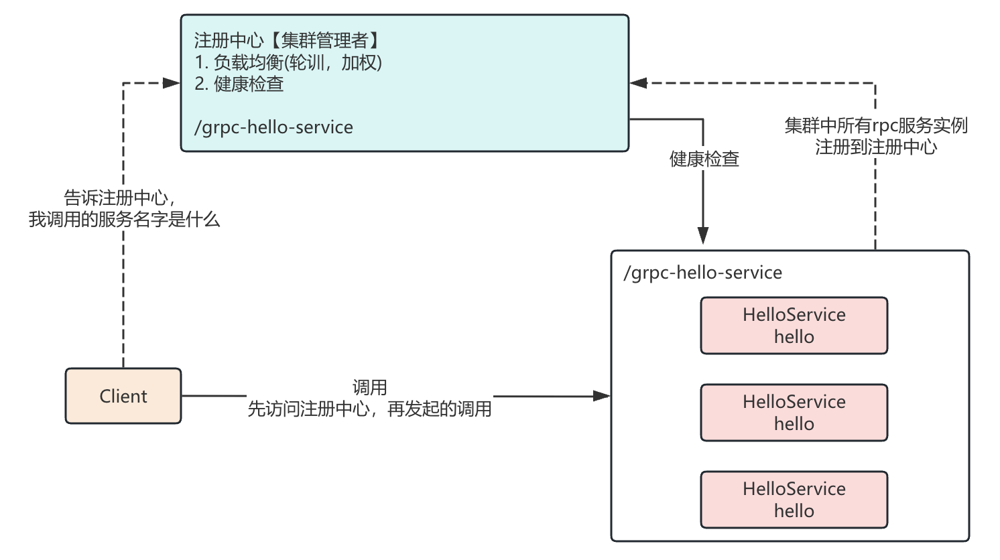

# NameResolver与负载均衡

## 理解

### 命名解析

- 本质上就是我们在SOA或者微服务中，所说的注册中心。

- 在rpc集群环境下，可以通过注册中心（命名解析）统一管理rpc集群 ，实现负载均衡、监控检查等高级特性
- 默认gPRC是通过DNS 做注册中心。用户可以自定义注册中心实现扩展

### Grpc注册中心选型

|            | zk     | etcd   | consul |
| ---------- | ------ | ------ | ------ |
| 开发语言   | Java   | Go     | Go     |
| 算法       | Paxos  | Raft   | Raft   |
| 多数据中心 | 不支持 | 不支持 | 支持   |
| web管理    | 支持   | 不支持 | 支持   |

### 注册中心理解



## Consul

### 理解

#### 是什么

- HashiCorp公司开源一个工具，用于实现分布式系统中服务发现（注册）与配置
- 一站式的解决方案，内置注册中心、健康检查、多数据中心、KeyValue存储等

#### 作用

- 注册中心
- 配置中心 

#### 优点

- 安装简单，自带web管理界面 
- 使用方便 比如 健康检查
- 一致性算法 Raft
- ...

#### 注意项

- Consul服务注册的本质：Consul进行服务注册时不关心服务的名字和功能。而是通过`ip+port`界定一个服务 
- 一个服务集群，定义一个逻辑的名字 
- Consul会自己进行健康检查（检查提供的服务的ip+port是不是可以通信）

### 使用案例

#### DEMO-模拟服务端服务注册到Consul

```java
public class TestServer {
    public static void main(String[] args) throws IOException, InterruptedException {
        //1.模拟服务  localhost:9000
        ServerSocketChannel serverSocketChannel = ServerSocketChannel.open();
        int port = new Random().nextInt(65535);
        serverSocketChannel.bind(new InetSocketAddress(port));

        //2.consul java client进行注册服务
        // 连接到consul服务器
        Consul consulConnection = Consul.builder().build();
        // 获得consul客户端对象
        AgentClient agentClient = consulConnection.agentClient();

        String serviceId = "Server-" + UUID.randomUUID().toString();

        // 进行服务的注册
        Registration service = ImmutableRegistration.builder()
                .name("grpc-server")
                .id(serviceId)
                .address("localhost")
                .port(port)
                .tags(Collections.singletonList("server"))
                .meta(Collections.singletonMap("version", "1.0"))
                // ttl http tcp
                // 通过tpc的方式进行健康检查
                .check(Registration.RegCheck.tcp("localhost:" + port, 10))
                .build();

        agentClient.register(service);

        Thread.sleep(100 * 1000);
    }
}
```

#### DEMO-模拟客户端服务调用

模拟客户端服务通过consul访问服务端服务

- client根据集群的名字（服务的名字） 获得一组健康的服务
- 根据负载均衡的算法，获取实际通信的rpc进行调用

```java
public class TestClient {
    public static void main(String[] args) {
        Consul consulConnection = Consul.builder().build();
        HealthClient healthClient = consulConnection.healthClient();
        ConsulResponse<List<ServiceHealth>> allServiceInstances = healthClient.getHealthyServiceInstances("grpc-server");

        List<ServiceHealth> response = allServiceInstances.getResponse();
        for (ServiceHealth serviceHealth : response) {
            System.out.println("serviceHealth.getService() = " + serviceHealth.getService());
        }
    }
}
```

### GRPC中Consul注册中心的开发

#### 服务端的处理

```java
public class GrpcServerConsul {
    public static void main(String[] args) throws InterruptedException, IOException {
        Random random = new Random();
        int port = random.nextInt(65535);

        ServerBuilder<?> serverBuilder = ServerBuilder.forPort(port);
        serverBuilder.addService(new HelloServiceImpl());
        Server server = serverBuilder.build();

        server.start();
        log.debug("server is starting......");
        registerToConsul("127.0.0.1", port);
        server.awaitTermination();
    }

    private static void registerToConsul(String address, int port) {
        Consul consul = Consul.builder().build();
        AgentClient client = consul.agentClient();

        String serviceId = "Server-" + UUID.randomUUID().toString();

        ImmutableRegistration service = ImmutableRegistration.builder()
                .id(serviceId)
                .name("grpc-server")
                .address(address)
                .port(port)
                .tags(Collections.singletonList("server"))
                .meta(Collections.singletonMap("version", "1.0"))
                .check(Registration.RegCheck.tcp(address + ":" + port, 10))
                .build();

        client.register(service);

    }
}
```

#### 客户端的处理

客户端在访问具体的grpc服务之前到注册中心（ consul）去查找注册的服务
- 命名解析(NameResolver)：根据名字（服务的名字） 去注册中心查找服务，进而进行访问    
- NameResolverProvider：命名解析的提供者(工厂)，用于创建命名解析对象，完成对于注册中心的访问
- 内置的命名解析：DNS方式处理的注册中心。修改自定义的名字解析的优先级，高于DNS才可以使用consul进行替换。

负载均衡：grpc客户端内置 

自定义NameResolver

```java
@Slf4j
public class CustomNameResolver extends NameResolver {

    private final ScheduledThreadPoolExecutor scheduledThreadPoolExecutor = new ScheduledThreadPoolExecutor(10);

    private Consul consul;
    private String authority;
    private Listener2 listener;

    // 用于为authority赋值
    public CustomNameResolver(String authority) {
        this.authority = authority;
        consul = Consul.builder().build();
    }

    // authority 概念 服务器集群的名字 grpc-server
    @Override
    public String getServiceAuthority() {
        return this.authority;
    }

    /*
     * listener 中文 叫做监听
     * start方法中我们要周期的发起对于名字解析的请求，获取最新的服务列表
     */
    @Override
    public void start(Listener2 listener) {
        this.listener = listener;
        scheduledThreadPoolExecutor.scheduleAtFixedRate(this::resolve, 10, 10, TimeUnit.SECONDS);
    }

    // 定期完成的工作 就是在resolve中处理的
    // 完成解析的工作
    private void resolve() {
        log.debug("开始解析 服务.... {} ", this.authority);
        //1.获取所有的健康服务 grpc-server
        // 把所有的健康服务的 ip+port封装 InetSocketAddress
        List<InetSocketAddress> addressList = getAddressList(this.authority);

        if (addressList == null || addressList.size() == 0) {
            log.debug("解析存在问题：{} 失败....." + this.authority);
            this.listener.onError(Status.UNAVAILABLE.withDescription("没有可用的节点...."));
            return;
        }

        //2.负载均衡 gprc 把所健康服务 封装 EquivalentAddressGroup {address:port}
        // InetSocketAddress ---> EquivalentAddressGroup
        List<EquivalentAddressGroup> equivalentAddressGroups = addressList.stream()
                .map(EquivalentAddressGroup::new)
                .collect(Collectors.toList());

        //3.命名解析完成 ResultionResult
        ResolutionResult resolutionResult = ResolutionResult.newBuilder()
                .setAddresses(equivalentAddressGroups)
                .build();

        // 监听名字解析的结果
        this.listener.onResult(resolutionResult);
    }

    private List<InetSocketAddress> getAddressList(String authority) {
        HealthClient healthClient = consul.healthClient();
        ConsulResponse<List<ServiceHealth>> response = healthClient.getHealthyServiceInstances(authority);

        List<ServiceHealth> healthList = response.getResponse();

        return healthList.stream()
                .map(ServiceHealth::getService)
                .map(service -> new InetSocketAddress(service.getAddress(), service.getPort()))
                .collect(Collectors.toList());
    }

    @Override
    public void shutdown() {
        scheduledThreadPoolExecutor.shutdown();
    }

    @Override
    public void refresh() {
        super.refresh();
    }
}
```

自定义NameResolverProvider

```java
public class CustomNameResolverProvider extends NameResolverProvider {

    @Override
    public NameResolver newNameResolver(URI targetUri, NameResolver.Args args) {
        return new CustomNameResolver(targetUri.toString());
    }

    /**
     * 优先级应该高于DNS（5）命名服务
     */
    @Override
    protected int priority() {
        return 6;
    }

    /**
     * 名字解析 （注册中心）通信的协议 consul
     */
    @Override
    public String getDefaultScheme() {
        return "consul";
    }

    /*
     * 作用：告知Grpc 自定义的ResolverProvider生效
     */
    @Override
    protected boolean isAvailable() {
        return true;
    }
}
```

grpc客户端的开发

- 原有的开发方式保留
- 引入自定义名字解析
- 引入负载均衡的算法
> 遗憾：内部集群名字的拼接有问题

```java
public class NameResolverGrpcClient {
    public static void main(String[] args) throws InterruptedException {
        //1.引入新的命名解析
        NameResolverRegistry.getDefaultRegistry().register(new CustomNameResolverProvider());

        //2.客户端的开发
        ManagedChannel managedChannel = ManagedChannelBuilder.forTarget("grpc-server")
                .usePlaintext()
                //3.引入负载均衡算法 round_robin轮训 负载均衡
                .defaultLoadBalancingPolicy("round_robin")
                .build();


        //4.获得stub对象进行调用
        // 模拟发送4次请求
        for (int i = 0; i < 4; i++) {
            sendRequest(managedChannel, i);
            Thread.sleep(1000);
        }


        managedChannel.awaitTermination(10, TimeUnit.SECONDS);
    }

    private static void sendRequest(ManagedChannel managedChannel, int idx) {
        HelloServiceGrpc.HelloServiceBlockingStub helloServiceBlockingStub = HelloServiceGrpc.newBlockingStub(managedChannel);
        HelloProto.HelloRespnose helloRespnose = helloServiceBlockingStub.hello(HelloProto.HelloRequest.newBuilder().setName("xiaohei " + idx).build());
        System.out.println("helloRespnose.getResult() = " + helloRespnose.getResult());

    }
}
```

服务器坑

在原始的gRPC与consul进行服务注册时，会产生一个Http2Connection异常。

原因：进行健康汇报检查时，consul代码会通过`.check(Registration.RegCheck.tcp(address + ":" + port, 10))`，向grpc-server发起访问，如果这个访问没有问题，则上报consul服务器，这样就完成了健康的检测。但是在`.check(Registration.RegCheck.tcp(address + ":" + port, 10))`向grpc-server发请求时，站在grpc-server的角度，他会认为这是一个普通的客户端方法，他需要建立Http2连接，而consul的客户端代码不支持http2协议，无法建立Http2的连接，所以就抛出`Http2ConnectionHandler Broken pipe`。

注意：

- 这个异常不会影响到我们目前程序的运行。
- 不能为了取消这个异常，而不使用` .check(Registration.RegCheck.tcp(address + ":" + port, 10))`。
- gRPC+consul+springboot => springcloud。健康检查 springboot actuator进行整合 而不采用`.check(Registration.RegCheck.tcp(address + ":" + port, 10))`。这样也就不会出现这个异常了。
