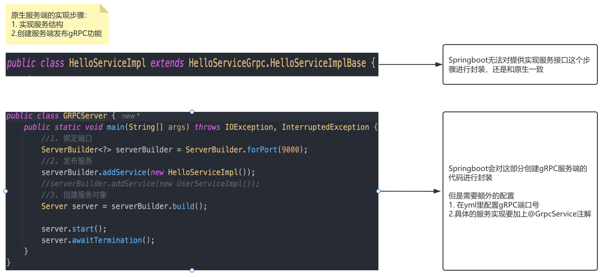

# gRPC与Springboot整合

## 整合思想

- grpc-server
2. grpc-client 

## 整合中对服务端的封装



### 搭建开发环境

- 搭建SpringBoot的开发环境
- 引入与Grpc相关的内容

```xml
<dependency>
      <groupId>com.suns</groupId>
      <artifactId>rpc-grpc-api</artifactId>
      <version>1.0-SNAPSHOT</version>
 </dependency>

<dependency>
    <groupId>net.devh</groupId>
    <artifactId>grpc-server-spring-boot-starter</artifactId>
    <version>2.14.0.RELEASE</version>
</dependency>
```

### 开发服务

服务实现，每一个服务实现都需要加@GrpcService注解

```java
@GrpcService
public class HelloServiceImpl extends HelloServiceGrpc.HelloServiceImplBase {
    @Override
    public void hello(HelloProto.HelloRequest request, StreamObserver<HelloProto.HelloResponse> responseObserver) {
        String name = request.getName();
        System.out.println("name is " + name);

        responseObserver.onNext(HelloProto.HelloResponse.newBuilder().setResult("this is result").build());
        responseObserver.onCompleted();
    }
}
```

application.yml配置

```yml
spring:
  main:
    # 如果只使用gRPC，可以关闭tomcat
    web-application-type: none

grpc:
  server:
    port: 9000
```

## 整合中对客户端的封装

### 环境搭建

```xml
 <dependency>
    <groupId>net.devh</groupId>
    <artifactId>grpc-client-spring-boot-starter</artifactId>
    <version>2.14.0.RELEASE</version>
 </dependency>
```

application.yml

```yml
grpc:
  client:
    grpc-server:
      address: 'static://127.0.0.1:9000'
      negotiation-type: plaintext
```

注入stub

```java
@Service
public class HelloService {
  
  @GrpcClient("grpc-server")
  private HelloServiceGrpc.HelloServiceBlockingStub stub; 
  
}
```

