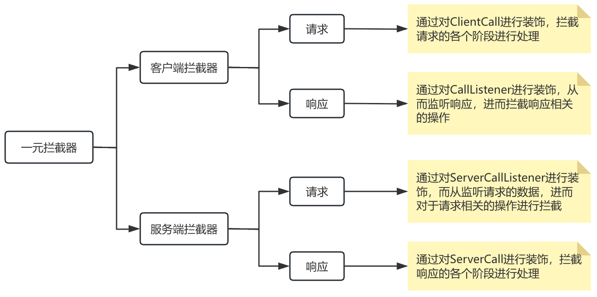

# gRPC拦截器

## 概述

### 分类

- 一元拦截器：用于一元RPC
- 流式拦截器 `Stream Tracer`：用于服务端流式、客户端流式、双向流式RPC

### 作用

- 鉴权 
- 数据校验
- 限流
- ...



## 一元拦截器开发

### 简单客户端一元拦截器

#### 示例

开发拦截器 

```java
@Slf4j
public class CustomClientInterceptor implements ClientInterceptor {
    @Override
    public <ReqT, RespT> ClientCall<ReqT, RespT> interceptCall(MethodDescriptor<ReqT, RespT> method, CallOptions callOptions, Channel next) {
        log.debug("这是一个拦截启动的处理，统一的做了一些操作 ....");
        return next.newCall(method, callOptions);
    }
}
```

在客户端进行设置 

```java
ManagedChannel managedChannel = ManagedChannelBuilder.forAddress("localhost", 9000)
                .usePlaintext()
                .intercept(new CustomClientInterceptor())
                .build();
```

细节

- usePlaintext()
- intercept(）

> 调用的先后顺序没有必须关联，谁先谁后都行。

#### 存在的问题

- 只能拦截请求，不能拦截响应。

- 即使拦截了请求操作，粒度过于宽泛，不精准。

> 请求操作又可以细分为以下阶段：
>
> - 开始阶段
>
> - 设置消息数量
>
> - 发送数据阶段
>
> - 半连接阶段

### 复杂客户端一元拦截器

#### 特点

- 拦截请求，拦截响应
- 分阶段的进行 请求 响应的拦截

> 渗透到 ClientCall[方法]的拦截，装饰器设计模式典型的使用场景。

#### 示例

复杂拦截器

```java
public class CustomClientInterceptor implements ClientInterceptor {
    @Override
    public <ReqT, RespT> ClientCall<ReqT, RespT> interceptCall(MethodDescriptor<ReqT, RespT> method, CallOptions callOptions, Channel next) {
        log.debug("这是一个拦截启动的处理 ,统一的做了一些操作 ....");
        /*
         * 如果我们需要用复杂客户端拦截器 ，就需要对原始的ClientCall进行包装
         * 那么这个时候，就不能返回原始ClientCall对象，
         * 应该返回 包装的ClientCall ---> CustomForwardingClientClass
         */
        //return next.newCall(method, callOptions);
        // ClientCall包装器
        return new CustomForwardingClientClass<>(next.newCall(method, callOptions));
    }
}
```

ClientCall包装器

```java
/*
 * 这个类型 适用于控制 拦截 请求发送各个环节
 */
@Slf4j
class CustomForwardingClientClass<ReqT, RespT> extends ClientInterceptors.CheckedForwardingClientCall<ReqT, RespT> {

    protected CustomForwardingClientClass(ClientCall<ReqT, RespT> delegate) {
        super(delegate);
    }

    /**
     * 开始调用阶段，目的是看一个这个RPC请求是不是可以被发起
     */
    @Override
    protected void checkedStart(Listener<RespT> responseListener, Metadata headers) throws Exception {
        log.debug("发送请求数据之前的检查.....");
        // 真正的去发起grpc的请求
        // 是否真正发送grpc的请求，取决这个start方法的调用
        //delegate().start(responseListener, headers);
      
        // 包装响应监听器
        delegate().start(new CustomCallListener<>(responseListener), headers);
    }

    /**
     * 指定发送消息的数量
     */
    @Override
    public void request(int numMessages) {
        //添加一些功能
        log.debug("request 方法被调用 ....");
        super.request(numMessages);
    }

    /**
     * 发送消息 缓冲区
     */
    @Override
    public void sendMessage(ReqT message) {
        log.debug("sendMessage 方法被调用... {} ", message);
        super.sendMessage(message);
    }

    /**
     * 开启半连接 请求消息无法发送，但是可以接受响应的消息
     */
    @Override
    public void halfClose() {
        log.debug("halfClose 方法被调用... 开启了半连接");
        super.halfClose();
    }
}
```

响应拦截

- onHeaders这个方法 会在onNext调用后 监听到数据
- onMessage这个方法 会在onCompleted调用后 监听到数据

```java
/*
 * 用于监听响应，并对响应进行拦截
 */
@Slf4j
class CustomCallListener<RespT> extends ForwardingClientCallListener.SimpleForwardingClientCallListener<RespT> {
    protected CustomCallListener(ClientCall.Listener<RespT> delegate) {
        super(delegate);
    }

    @Override
    public void onHeaders(Metadata headers) {
        log.info("响应头信息 回来了......");
        super.onHeaders(headers);
    }

    @Override
    public void onMessage(RespT message) {
        log.info("响应的数据 回来了.....{} ", message);
        super.onMessage(message);
    }
}
```

### 简单服务端一元拦截器

#### 示例

实现拦截器

```java
@Slf4j
public class CustomServerInterceptor implements ServerInterceptor {
    @Override
    public <ReqT, RespT> ServerCall.Listener<ReqT> interceptCall(ServerCall<ReqT, RespT> call, Metadata headers, ServerCallHandler<ReqT, RespT> next) {
        //在服务器端 拦截请求操作的功能 写在这个方法中
        log.debug("服务器端拦截器生效.....");
        return next.startCall(call, headers);
    }
}
```

注册拦截器

```java
public class GrpcServer {
    public static void main(String[] args) throws InterruptedException, IOException {
        ServerBuilder<?> serverBuilder = ServerBuilder.forPort(9000);
        serverBuilder.addService(new HelloServiceImpl());
        serverBuilder.intercept(new CustomServerInterceptor());
        Server server = serverBuilder.build();

        server.start();
        server.awaitTermination();
    }
}
```

#### 存在的问题

- 拦截请求发送过来的数据，无法处理响应的数据
- 拦截力度过于宽泛

### 复杂服务端一元拦截器

#### 特点

- 拦截请求的数据，拦截响应的数据

- 粒度细致

#### 请求数据拦截

拦截器

```java
@Slf4j
public class CustomServerInterceptor implements ServerInterceptor {
    @Override
    public <ReqT, RespT> ServerCall.Listener<ReqT> interceptCall(ServerCall<ReqT, RespT> call, Metadata headers, ServerCallHandler<ReqT, RespT> next) {
        // 在服务器端 拦截请求操作的功能 写在这个方法中
        log.debug("服务器端拦截器生效.....");
        // 默认返回的ServerCall.Listener仅仅能够完成请求数据的监听，但没有拦截功能
        // 所以要做扩展，采用包装器设计模式。
        //return next.startCall(call, headers);
        return new CustomServerCallListener<>(next.startCall(call, headers));
    }
}
```

ServerCall包装器

```java
@Slf4j
class CustomServerCallListener<ReqT> extends ForwardingServerCallListener.SimpleForwardingServerCallListener<ReqT> {
    protected CustomServerCallListener(ServerCall.Listener<ReqT> delegate) {
        super(delegate);
    }

    /**
     * 准备接受请求数据
     */
    @Override
    public void onReady() {
        log.debug("onRead Method Invoke....");
        super.onReady();
    }

    @Override
    public void onMessage(ReqT message) {
        log.debug("接受到了 请求提交的数据  {} ", message);
        super.onMessage(message);
    }

    @Override
    public void onHalfClose() {
        log.debug("监听到了 半连接...");
        super.onHalfClose();
    }

    @Override
    public void onComplete() {
        log.debug("服务端 onCompleted()...");
        super.onComplete();
    }

    @Override
    public void onCancel() {
        log.debug("出现异常后 会调用这个方法... 关闭资源的操作");
        super.onCancel();
    }
}
```

#### 响应数据拦截

ServerCall包装器

> 通过自定义的ServerCall 包装原始的ServerCall 增加对于响应拦截的功能

```java
@Slf4j
class CustomServerCall<ReqT, RespT> extends ForwardingServerCall.SimpleForwardingServerCall<ReqT, RespT> {

    protected CustomServerCall(ServerCall<ReqT, RespT> delegate) {
        super(delegate);
    }

    /**
     * 指定发送消息的数量 【响应消息】
     */
    @Override
    public void request(int numMessages) {
        log.debug("response 指定消息的数量 【request】");
        super.request(numMessages);
    }
    
    /**
     * 设置响应头
     */
    @Override
    public void sendHeaders(Metadata headers) {
        log.debug("response 设置响应头 【sendHeaders】");
        super.sendHeaders(headers);
    }

    /**
     * 响应数据
     */
    @Override
    public void sendMessage(RespT message) {
        log.debug("response 响应数据  【send Message 】 {} ", message);
        super.sendMessage(message);
    }

    /**
     * 关闭连接
     */
    @Override
    public void close(Status status, Metadata trailers) {
        log.debug("respnse 关闭连接 【close】");
        super.close(status, trailers);
    }
}
```

拦截器

> 就是把自定义的ServerCall与gRpc服务端进行整合

```java
@Slf4j
public class CustomServerInterceptor implements ServerInterceptor {
    @Override
    public <ReqT, RespT> ServerCall.Listener<ReqT> interceptCall(ServerCall<ReqT, RespT> call, Metadata headers, ServerCallHandler<ReqT, RespT> next) {
        //在服务器端 拦截请求操作的功能 写在这个方法中
        log.debug("服务器端拦截器生效.....");
      
        //1. 包装ServerCall 处理服务端响应拦截
        CustomServerCall<ReqT,RespT> reqTRespTCustomServerCall = new CustomServerCall<>(call);
        //2. 包装Listener   处理服务端请求拦截
        CustomServerCallListener<ReqT> reqTCustomServerCallListener = new CustomServerCallListener<>(next.startCall(reqTRespTCustomServerCall, headers));
        return reqTCustomServerCallListener;
    }
}
```

## 流式拦截器开发

### 一元与流式通信的区别

对比一元通信方式，流式通信方式的特点是消息多，而且不是一次性通信是分批分期。这时一元拦截器就无法细粒度的拦截特定的消息。所以需要流式拦截器解决这个问题。

### 客户端流式拦截器

#### 思路

- ClientStreamTracer：用于拦截请求与响应
- ClientStreamTracerFactory：用于创建ClientStreamTracer

#### 实现

拦截器

```java
@Slf4j
public class CustomerClientInterceptor implements ClientInterceptor {
    @Override
    public <ReqT, RespT> ClientCall<ReqT, RespT> interceptCall(MethodDescriptor<ReqT, RespT> method, CallOptions callOptions, Channel next) {
        log.debug("执行客户端拦截器...");

        // 把自己开发的ClientStreamTracerFactory融入到gRPC体系
        callOptions = callOptions.withStreamTracerFactory(new CustomClientStreamTracerFactory<>());
        return next.newCall(method, callOptions);
    }
}

class CustomClientStreamTracerFactory<ReqT, RespT> extends ClientStreamTracer.Factory {
    @Override
    public ClientStreamTracer newClientStreamTracer(ClientStreamTracer.StreamInfo info, Metadata headers) {
        return new CustomClientStreamTracer<>();
    }
}
```

客户端流式拦截实现

- inbound 开头的方法：对于相应相关操作的拦截
- outbound开头的方法：对于请求相关操作的拦截

```java
@Slf4j
class CustomClientStreamTracer<ReqT, RespT> extends ClientStreamTracer {
    /**
     * 用于输出响应头
     */
    @Override
    public void outboundHeaders() {
        log.debug("client: 用于输出请求头.....");
        super.outboundHeaders();
    }

    /**
     * 设置消息编号
     */
    @Override
    public void outboundMessage(int seqNo) {
        log.debug("client: 设置流消息的编号 {} ", seqNo);
        super.outboundMessage(seqNo);
    }

    @Override
    public void outboundUncompressedSize(long bytes) {
        log.debug("client: 获得未压缩消息的大小 {} ", bytes);
        super.outboundUncompressedSize(bytes);
    }

    /**
     * 用于获得 输出消息的大小
     */
    @Override
    public void outboundWireSize(long bytes) {
        log.debug("client: 用于获得 输出消息的大小 {} ", bytes);
        super.outboundWireSize(bytes);
    }

    /**
     * 拦截消息发送
     */
    @Override
    public void outboundMessageSent(int seqNo, long optionalWireSize, long optionalUncompressedSize) {
        log.debug("client: 监控请求操作 outboundMessageSent {} ", seqNo);
        super.outboundMessageSent(seqNo, optionalWireSize, optionalUncompressedSize);
    }

    @Override
    public void inboundHeaders() {
        log.debug("用于获得响应头....");
        super.inboundHeaders();
    }

    @Override
    public void inboundMessage(int seqNo) {
        log.debug("获得响应消息的编号...{} ",seqNo);
        super.inboundMessage(seqNo);
    }

    @Override
    public void inboundWireSize(long bytes) {
        log.debug("获得响应消息的大小...{} ",bytes);
        super.inboundWireSize(bytes);
    }

    @Override
    public void inboundMessageRead(int seqNo, long optionalWireSize, long optionalUncompressedSize) {
        log.debug("集中获得消息的编号 ，大小 ，未压缩大小 {} {} {}", seqNo, optionalWireSize, optionalUncompressedSize);
        super.inboundMessageRead(seqNo, optionalWireSize, optionalUncompressedSize);
    }

    @Override
    public void inboundUncompressedSize(long bytes) {
        log.debug("获得响应消息未压缩大小 {} ",bytes);
        super.inboundUncompressedSize(bytes);
    }

    @Override
    public void inboundTrailers(Metadata trailers) {
        log.debug("响应结束..");
        super.inboundTrailers(trailers);
    }
}
```

### 服务端流式拦截器

#### 思路

- ServerStreamTracer 拦截
  - inbound 开头的方法：用于请求的拦截
  - outbound开头的方法：用于响应的拦截 

- ServerStreamTracerFactory：用于创建ServerStreamTracer

#### 实现

拦截器

```java
public class CustomServerStreamFactory extends ServerStreamTracer.Factory {
    @Override
    public ServerStreamTracer newServerStreamTracer(String fullMethodName, Metadata headers) {
        return new CustomServerStreamTracer();
    }
}
```

服务端流式拦截实现

```java
@Slf4j
class CustomServerStreamTracer extends ServerStreamTracer {
    @Override
    public void inboundMessage(int seqNo) {
        super.inboundMessage(seqNo);
    }

    @Override
    public void inboundWireSize(long bytes) {
        super.inboundWireSize(bytes);
    }

    @Override
    public void inboundMessageRead(int seqNo, long optionalWireSize, long optionalUncompressedSize) {
        log.debug("server: 获得client发送的请求消息 ...{} {} {}", seqNo, optionalWireSize, optionalUncompressedSize);
        super.inboundMessageRead(seqNo, optionalWireSize, optionalUncompressedSize);
    }

    @Override
    public void inboundUncompressedSize(long bytes) {
        super.inboundUncompressedSize(bytes);
    }

    @Override
    public void outboundMessage(int seqNo) {
        super.outboundMessage(seqNo);
    }

    @Override
    public void outboundMessageSent(int seqNo, long optionalWireSize, long optionalUncompressedSize) {
        log.debug("server: 响应数据的拦截 ...{} {} {}", seqNo, optionalWireSize, optionalUncompressedSize);
        super.outboundMessageSent(seqNo, optionalWireSize, optionalUncompressedSize);
    }

    @Override
    public void outboundWireSize(long bytes) {
        super.outboundWireSize(bytes);
    }

    @Override
    public void outboundUncompressedSize(long bytes) {
        super.outboundUncompressedSize(bytes);
    }
}
```

