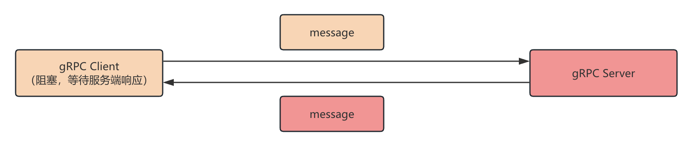
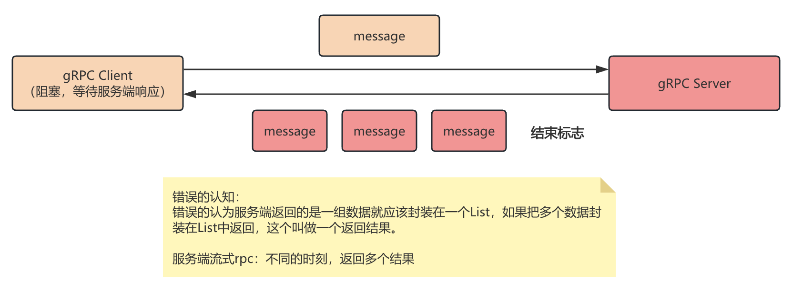
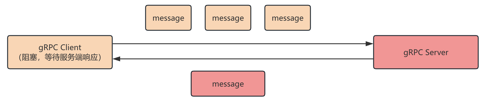
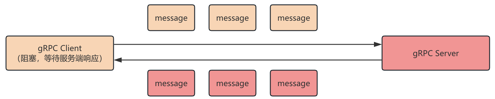

# gRPC的四种通信方式

## 四种通信方式

- 简单rpc 一元rpc (Unary RPC)
2. 服务端流式RPC   (Server Streaming RPC)
3. 客户端流式RPC   (Client Streaming RPC)
4. 双向流RPC (Bi-directional Stream RPC)

## 简单RPC(一元RPC)

> 上一章的grpc服务开发案例实际上就是一元rpc

### 特点

当client发起调用后，提交数据并且等待服务端响应（开发过程中，主要采用就是一元RPC的这种通信方式）



### 语法

```protobuf
service HelloService{
  rpc hello(HelloRequest) returns (HelloResponse){}
  rpc hello1(HelloRequest1) returns (HelloResponse1){}
}
```

## 服务端流式RPC 

### 特点

长链接，一个客户端请求对象，服务端可以回传多个结果对象



### 使用场景

```shell
#         股票标号
# client --------> Server
#        <-------
#   某一个时刻的 股票的行情
```

### 语法

```protobuf
service HelloService{
  // 服务端流式RPC
  rpc hello(HelloRequest) returns (stream HelloResponse){}
  // 一元rpc
  rpc hello1(HelloRequest1) returns (HelloResponse1){}
}
```

### 关键代码

服务端

```java
public void c2ss(HelloProto.HelloRequest request, StreamObserver<HelloProto.HelloResponse> responseObserver){
    // 1.接受client的请求参数
    String name = request.getName();
    // 2.做业务处理
    System.out.println("name = " + name);
    // 3.根据业务处理的结果，提供响应
    //   循环模拟多个结果
    for (int i = 0; i < 9; i++) {
        HelloProto.HelloResponse.Builder builder = HelloProto.HelloResponse.newBuilder();
        builder.setResult("处理的结果 " + i);
        HelloProto.HelloResponse helloResponse = builder.build();

        responseObserver.onNext(helloResponse);
        try {
            Thread.sleep(1000);
        } catch (InterruptedException e) {
            throw new RuntimeException(e);
        }
    }
    responseObserver.onCompleted();
}
```

客户端-阻塞式监听处理服务端流式RPC

```java
public class GRPCClient {
  public static void main(String[] args) {
      ManagedChannel managedChannel = ManagedChannelBuilder.forAddress("localhost", 9000).usePlaintext().build();
      try {
          HelloServiceGrpc.HelloServiceBlockingStub helloService = HelloServiceGrpc.newBlockingStub(managedChannel);

          HelloProto.HelloRequest.Builder builder = HelloProto.HelloRequest.newBuilder();
          builder.setName("rose");
          HelloProto.HelloRequest helloRequest = builder.build();
          // 响应的是一个迭代器
          Iterator<HelloProto.HelloResponse> helloResponseIterator = helloService.c2ss(helloRequest);
          while (helloResponseIterator.hasNext()) {
              HelloProto.HelloResponse helloResponse = helloResponseIterator.next();
              System.out.println("helloResponse.getResult() = " + helloResponse.getResult());
          }
      } catch (Exception e) {
          e.printStackTrace();
      }
      finally {
          managedChannel.shutdown();
      }
  }
}
```

客户端 - 异步方式监听处理服务端流式RPC

```java
public class GRPCClient {
    public static void main(String[] args) {
        ManagedChannel managedChannel = ManagedChannelBuilder.forAddress("localhost", 9000).usePlaintext().build();
        try {
            HelloServiceGrpc.HelloServiceStub helloService = HelloServiceGrpc.newStub(managedChannel);
            HelloProto.HelloRequest.Builder builder = HelloProto.HelloRequest.newBuilder();
            builder.setName("jack");
            HelloProto.HelloRequest helloRequest = builder.build();

            helloService.c2ss(helloRequest, new StreamObserver<HelloProto.HelloResponse>() {
                @Override
                public void onNext(HelloProto.HelloResponse value) {
                    // 服务端 响应了一个消息后，需要立即处理的话。把代码写在这个方法中。
                    System.out.println("服务端每一次响应的信息 " + value.getResult());
                }

                @Override
                public void onError(Throwable t) {

                }

                @Override
                public void onCompleted() {
                    // 需要把服务端响应的所有数据拿到后，在进行业务处理。
                    System.out.println("服务端响应结束 后续可以根据需要 在这里统一处理服务端响应的所有内容");
                }
            });
            
            // 重点：一定要阻塞等待，否则会直接就shutdown了
            managedChannel.awaitTermination(12, TimeUnit.SECONDS);
        } catch (Exception e) {
            e.printStackTrace();
        } finally {
            managedChannel.shutdown();
        }
    }
}
```

## 客户端流式RPC

### 特点

客户端发送多个请求对象，服务端只返回一个结果



### 使用场景

- IOT(物联网、传感器) 向服务端发送数据

### 语法

```protobuf
rpc cs2s(stream HelloRequest) returns (HelloResponse){}
```

### 关键代码

api

```protobuf
rpc cs2s(stream HelloRequest) returns (HelloResponse){}
```

服务端

```java
public StreamObserver<HelloProto.HelloRequest> cs2s(StreamObserver<HelloProto.HelloResponse> responseObserver) {
      return new StreamObserver<HelloProto.HelloRequest>() {
          @Override
          public void onNext(HelloProto.HelloRequest value) {
              System.out.println("接受到了client发送一条消息 " + value.getName());
          }

          @Override
          public void onError(Throwable t) {

          }

          @Override
          public void onCompleted() {
              System.out.println("client的所有消息 都发送到了 服务端 ....");

              //提供响应：响应的目的：当接受了全部client提交的信息，并处理后，提供相应
              HelloProto.HelloResponse.Builder builder = HelloProto.HelloResponse.newBuilder();
              builder.setResult("this is result");
              HelloProto.HelloResponse helloResponse = builder.build();

              responseObserver.onNext(helloResponse);
              responseObserver.onCompleted();
          }
      };
  }
```

客户端

```java
public class GRPCClient {
    public static void main(String[] args) {
        ManagedChannel managedChannel = ManagedChannelBuilder.forAddress("localhost", 9000).usePlaintext().build();
        try {
            HelloServiceGrpc.HelloServiceStub helloService = HelloServiceGrpc.newStub(managedChannel);

            StreamObserver<HelloProto.HelloRequest> helloRequestStreamObserver = helloService.cs2s(new StreamObserver<HelloProto.HelloResponse>() {
                @Override
                public void onNext(HelloProto.HelloResponse value) {
                    // 监控响应
                    System.out.println("服务端 响应 数据内容为 " + value.getResult());

                }

                @Override
                public void onError(Throwable t) {

                }

                @Override
                public void onCompleted() {
                    System.out.println("服务端响应结束 ... ");
                }
            });

            //客户端 发送数据 到服务端  多条数据 ，不定时...
            for (int i = 0; i < 10; i++) {
                HelloProto.HelloRequest.Builder builder = HelloProto.HelloRequest.newBuilder();
                builder.setName("sunshuai " + i);
                HelloProto.HelloRequest helloRequest = builder.build();

                helloRequestStreamObserver.onNext(helloRequest);
                Thread.sleep(1000);
            }

            helloRequestStreamObserver.onCompleted();

            managedChannel.awaitTermination(12, TimeUnit.SECONDS);

        } catch (Exception e) {
            e.printStackTrace();
        } finally {
            managedChannel.shutdown();
        }
    }
}
```

## 双向流RPC

### 特点

- 客户端可以发送多个请求消息，服务端响应多个响应消息



### 使用场景

- 聊天室

### 关键代码

api

```protobuf
rpc cs2ss(stream HelloRequest) returns (stream HelloResponse){}
```

服务端

```java
public StreamObserver<HelloProto.HelloRequest> cs2ss(StreamObserver<HelloProto.HelloResponse> responseObserver) {
     return new StreamObserver<HelloProto.HelloRequest>() {
         @Override
         public void onNext(HelloProto.HelloRequest value) {
             System.out.println("接受到client 提交的消息 "+value.getName());
             responseObserver.onNext(HelloProto.HelloResponse.newBuilder().setResult("response "+value.getName()+" result ").build());
         }

         @Override
         public void onError(Throwable t) {

         }

         @Override
         public void onCompleted() {
             System.out.println("接受到了所有的请求消息 ... ");
             responseObserver.onCompleted();
         }
     };
}
```

客户端

```java
public class GRPCClient {
    public static void main(String[] args) {
        ManagedChannel managedChannel = ManagedChannelBuilder.forAddress("localhost", 9000).usePlaintext().build();
        try {
            HelloServiceGrpc.HelloServiceStub helloService = HelloServiceGrpc.newStub(managedChannel);

            StreamObserver<HelloProto.HelloRequest> helloRequestStreamObserver = helloService.cs2ss(new StreamObserver<HelloProto.HelloResponse>() {
                @Override
                public void onNext(HelloProto.HelloResponse value) {
                    System.out.println("响应的结果 "+value.getResult());
                }

                @Override
                public void onError(Throwable t) {

                }

                @Override
                public void onCompleted() {
                    System.out.println("响应全部结束...");
                }
            });


            for (int i = 0; i < 10; i++) {
                helloRequestStreamObserver.onNext(HelloProto.HelloRequest.newBuilder().setName("sunshuai " + i).build());
            }
            helloRequestStreamObserver.onCompleted();

            managedChannel.awaitTermination(12, TimeUnit.SECONDS);

        } catch (Exception e) {
            e.printStackTrace();
        } finally {
            managedChannel.shutdown();
        }
    }
}
```

