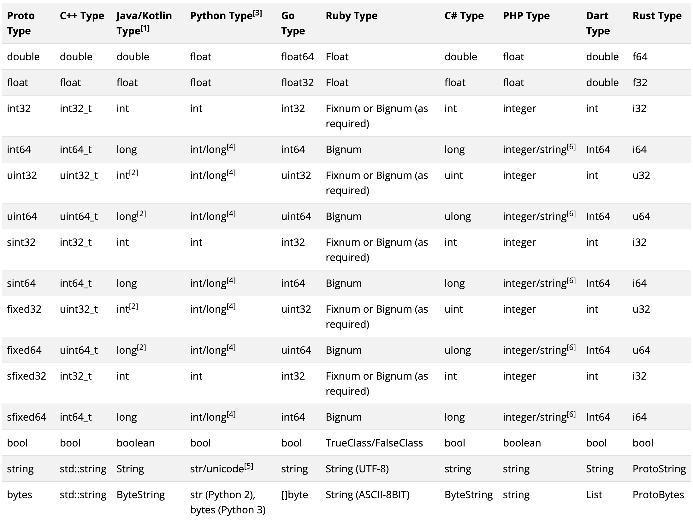

# protobuf

## 概述

- protobuf 是一种与编程语言无关（IDL），与具体的平台无关（OS）。他定义的中间语言可以方便的在client于server中进行RPC的数据传输
- 两种版本 proto2、proto3，但是目前主流应用的都是proto3
- 需要安装protobuf的编译器，编译器目的是可以把protobuf的IDL语言转换成具体某一种开发语言

## protobuf编译器的安装

> [下载地址](https://github.com/protocolbuffers/protobuf/releases)

## Idea插件

2021.2版本后面的新版本 IDEA内置了Protobuf插件，之前版本可以选装第三方Protobuf插件（二者不能共存）

## 语法详解

### 文件格式

```shell
.proto
# UserService.proto
# OrderService.proto
```

### 版本设定

```shell
# 必须放在首行
syntax = "proto3";
```
### 注释

```shell
# 单行注释   //
# 多行注释   /*    */
```

### 与Java相关的语法

```shell
# 后续protobuf生成的java代码是一个源文件还是多个源文件
option java_multiple_files = false; 

# 指定protobuf生成的类放置在哪个包中
option java_package = "com.suns";

# 指定的protobuf生成的外部类的名字（管理内部类，内部类才是真正开发使用）
option java_outer_classname = "UserServce";
```

### 逻辑包

```shell
# 对于protobuf对于文件内容的管理
package xxx;
```

### 导入

```shell
# UserService.proto
# OrderService.proto
import "xxx/UserService.proto";
```

### 基本类型



### 枚举

```shell
# 枚举的值必须是0开始 
enum SEASON{
   SPRING = 0;
   SUMMER = 1;
}
```

### 消息 Message 

```protobuf
// 1. 编号
//    编号范围从1开始到2^29-1为止
//    注意：19000 - 19999 不能用这个区间内的编号，因为他是protobuf自己保留的
// 2. 修饰字段的关键字
//    - singular：这是一个默认关键字，标识这个字段的值只能是0个或1个（0个值就是null）
//    - repeated：标识这个字段返回值是多个，等价于 Java List。Protobuf编译时生成的getter就是getStatusList()-->List
// 3. 可定义多个消息
// 4. 消息可以嵌套
// 5. 修饰消息的关键字
//    - oneof：表示修饰的消息有且仅有两个字段，实际值之可能是其中某一个

// singular示例
message LoginRequest {
   string username = 1;
   singular string password = 2;
   int32  age = 3;
}

// repeated示例
message Result{
   string content = 1;
   // 标识这个字段返回值是多个，等价于 Java List
   repeated string stutas = 2;
}

// 多个消息示例
message LoginRequest{
  ....
}
message LoginResponse{
  ...
}

// 嵌套消息示例
message SearchResponse{
   message Result{
      string url = 1;
      string title = 2;
   }

  string xxx = 1;
  int32  yyy = 2;
  Result ppp = 3;
}
message AAA{
  string xxx = 1;
  SearchResponse.Result yyy = 2;
}

// oneof [其中一个]
message SimpleMessage{
   oneof test_oneof{
      string name = 1;
      int32  age = 2;
   }
   test_oneof xxx
}
```

### 服务

```protobuf
// 定义多个服务接口
// service服务接口里面是可以定义多个服务方法
// gPRC 服务有4个服务方式，参考下一节
service HelloService{
   rpc hello(HelloRequest) returns(HelloResponse){}
}
```
