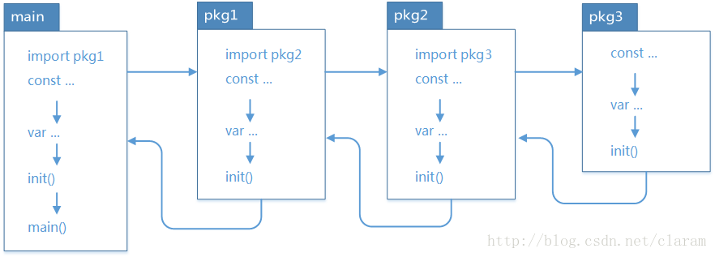
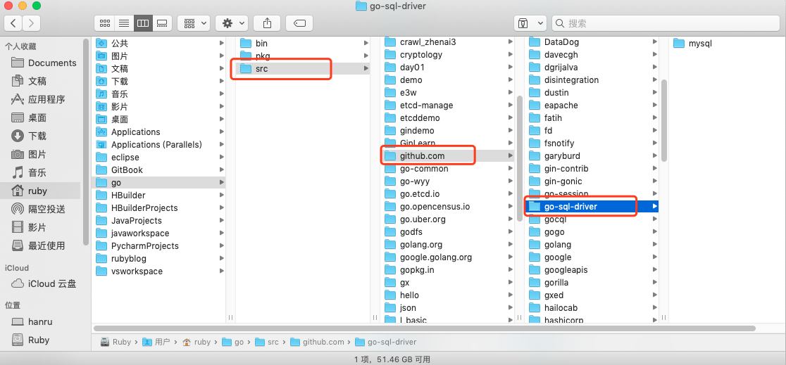
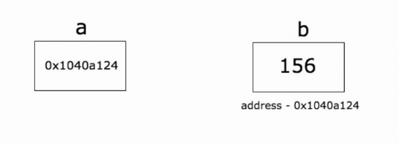

# 包管理与指针

## 包管理

Go 语言使用包（package）这种语法元素来组织源码，所有语法可见性均定义在 package 这个级别，与 Java 、Python 等语言相比，这算不上什么创新，但与 C 传统的 include 相比，则是显得"先进"了许多。

Go 语言的源码复用建立在包（package）基础之上。包通过 package、import、GOPATH 操作完成。

### main 包

Go 语言的入口 `main()` 函数所在的包（package）叫 `main`，`main` 包想要引用别的代码，需要 import 导入。

### package

`src` 目录是以代码包的形式组织并保存 Go 源码文件的。每个代码包都和 `src` 目录下的文件夹一一对应。每个子目录都是一个代码包。

> 代码包包名和文件目录名，不要求一致。比如文件目录叫 `hello`，但是代码包包名可以声明为 `main`，但是同一个目录下的源码文件第一行声明的所属包，必须一致！

同一个目录下的所有 `.go` 文件的第一行添加包定义，以标记该文件归属的包，演示语法：

```go
package 包名
```

包需要满足：

- 一个目录下的同级文件归属一个包。也就是说，在同一个包下面的所有文件的 `package` 名，都是一样的。
- 在同一个包下面的文件 `package` 名都建议设为是该目录名，但也可以不是。也就是说，包名可以与其目录不同名。
- 包名为 `main` 的包为应用程序的入口包，其他包不能使用。

> 在同一个包下面的文件属于同一个工程文件，不用 `import` 包，可以直接使用。

包可以嵌套定义，对应的就是嵌套目录，但包名应该与所在的目录一致，例如：

```go
// 文件：qf/ruby/tool.go中
package ruby
// 可以被导出的函数
func FuncPublic() {
}
// 不可以被导出的函数
func funcPrivate() {
}
```

包中，通过标识符首字母是否大写，来确定是否可以被导出。首字母大写才可以被导出，视为 public 公共的资源。

### import

要引用其他包，可以使用 `import` 关键字，可以单个导入或者批量导入，语法演示：

**A：通常导入**

```go
// 单个导入
import "package"
// 批量导入
import (
  "package1"
  "package2"
  )
```

**B：点操作**

我们有时候会看到如下的方式导入包：

```go
import(
	. "fmt"
) 
```

这个点操作的含义就是这个包导入之后在你调用这个包的函数时，你可以省略前缀的包名，也就是前面你调用的 `fmt.Println("hello world")` 可以省略的写成 `Println("hello world")`。

**C：起别名**

别名操作顾名思义我们可以把包命名成另一个我们用起来容易记忆的名字。导入时，可以为包定义别名，语法演示：

```go
import (
  p1 "package1"
  p2 "package2"
  )
// 使用时：别名操作，调用包函数时前缀变成了我们的前缀
p1.Method()
```

**D：`_` 操作**

如果仅仅需要导入包时执行初始化操作，并不需要使用包内的其他函数、常量等资源，则可以在导入包时，匿名导入。

这个操作经常是让很多人费解的一个操作符，请看下面这个 import：

```go
import (
   "database/sql"
   _ "github.com/ziutek/mymysql/godrv"
 ) 
```

`_` 操作其实是引入该包，而不直接使用包里面的函数，而是调用了该包里面的 `init` 函数。也就是说，使用下划线作为包的别名，会仅仅执行 `init()`。

> 导入的包的路径名，可以是相对路径也可以是绝对路径，推荐使用绝对路径（起始于工程根目录）。

### GOPATH 环境变量

`import` 导入时，会从 GO 的安装目录（也就是 `GOROOT` 环境变量设置的目录）和 `GOPATH` 环境变量设置的目录中，检索 `src/package` 来导入包。如果不存在，则导入失败。

`GOROOT`，就是 GO 内置的包所在的位置。
`GOPATH`，就是我们自己定义的包的位置。

通常我们在开发 Go 项目时，调试或者编译构建时，需要设置 `GOPATH` 指向我们的项目目录，目录中的 `src` 目录中的包就可以被导入了。

### init() 包初始化

下面我们详细地来介绍 `init()`、`main()` 这两个函数，它们是 Go 语言中的保留函数。我们可以在源码中，定义 `init()` 函数。此函数会在包被导入时执行，例如如果是在 `main` 中导入包，包中存在 `init()`，那么 `init()` 中的代码会在 `main()` 函数执行前执行，用于初始化包所需要的特定资料。例如：

包源码：

```go
// src/userPackage/tool.go

package userPackage
import "fmt"
func init() {
  fmt.Println("tool init")
}
```

主函数源码：

```go
// src/main.go

package main
import (
  "userPackage"
  )
func main() {
  fmt.Println("main run")
  // 使用userPackage
  userPackage.SomeFunc()
}
```

执行时，会先输出 `"tool init"`，再输出 `"main run"`。

下面我们来详细介绍一下 `init()`、`main()` 这两个函数在 Go 语言中的区别：

**相同点：**

- 两个函数在定义时不能有任何的参数和返回值。
- 该函数只能由 Go 程序自动调用，不可以被引用。

**不同点：**

- `init` 可以应用于任意包中，且可以重复定义多个。
- `main` 函数只能用于 `main` 包中，且只能定义一个。

**两个函数的执行顺序：**

在 `main` 包中的 Go 文件默认总是会被执行。

- 对同一个 Go 文件的 `init()` 调用顺序是从上到下的。
- 对同一个 package 中的不同文件，将文件名按字符串进行"从小到大"排序，之后顺序调用各文件中的 `init()` 函数。
- 对于不同的 package，如果不相互依赖的话，按照 `main` 包中 `import` 的顺序调用其包中的 `init()` 函数。
- 如果 package 存在依赖，调用顺序为最后被依赖的最先被初始化，例如：导入顺序 `main` → `A` → `B` → `C`，则初始化顺序为 `C` → `B` → `A` → `main`，依次执行对应的 `init` 方法。`main` 包总是被最后一个初始化，因为它总是依赖别的包。



> 避免出现循环 import，例如：A → B → C → A。
>
> 一个包被其它多个包 import，但只能被初始化一次。

### 管理外部包

Go 允许 import 不同代码库的代码。对于 import 要导入的外部的包，可以使用 `go get` 命令取下来放到 `GOPATH` 对应的目录中去。

举个例子，比如说我们想通过 Go 语言连接 MySQL 数据库，那么需要先下载 MySQL 的数据包，打开终端并输入以下命令：

```shell
go get github.com/go-sql-driver/mysql
```

安装之后，就可以在 `GOPATH` 目录的 `src` 下，看到对应的文件包目录。



> 也就是说，对于 Go 语言来讲，其实并不关心你的代码是内部还是外部的，总之都在 `GOPATH` 里，任何 import 包的路径都是从 `GOPATH` 开始的；唯一的区别，就是内部依赖的包是开发者自己写的，外部依赖的包是 `go get` 下来的。

### 编译包文件

我们可以通过 `go install` 来编译包文件。

我们知道一个非 `main` 包在编译后会生成一个 `.a` 文件（在临时目录下生成，除非使用 `go install` 安装到 `$GOROOT` 或 `$GOPATH` 下，否则你看不到 `.a`），用于后续可执行程序链接使用。

比如 Go 标准库中的包对应的源码部分路径在：`$GOROOT/src`，而标准库中包编译后的 `.a` 文件路径在 `$GOROOT/pkg/darwin_amd64` 下。

## 指针

### 指针的概念

指针是存储另一个变量的内存地址的变量。

我们都知道，变量是一种使用方便的占位符，用于引用计算机内存地址。

一个指针变量可以指向任何一个值的内存地址，它指向那个值的内存地址。



在上面的示意图中，变量 `b` 的值为 `156`，存储在内存地址 `0x1040a124`。变量 `a` 持有 `b` 的地址，现在 `a` 被认为指向 `b`。

### 获取变量的地址

Go 语言的取地址符是 `&`，放到一个变量前使用就会返回相应变量的内存地址。

```go
package main

import "fmt"

func main() {
   var a int = 10   

   fmt.Printf("变量的地址: %x\n", &a  )
}
```

运行结果：

```text
变量的地址: 20818a220
```

### 声明指针

声明指针，`*T` 是指针变量的类型，它指向 `T` 类型的值。

```go
var var_name *var-type
```

`var-type` 为指针类型，`var_name` 为指针变量名，`*` 号用于指定变量是作为一个指针。

```go
var ip *int        /* 指向整型*/
var fp *float32    /* 指向浮点型 */
```

示例代码：

```go
package main

import "fmt"

func main() {
   var a int= 20   /* 声明实际变量 */
   var ip *int        /* 声明指针变量 */

   ip = &a  /* 指针变量的存储地址 */

   fmt.Printf("a 变量的地址是: %x\n", &a  )

   /* 指针变量的存储地址 */
   fmt.Printf("ip 变量的存储地址: %x\n", ip )

   /* 使用指针访问值 */
   fmt.Printf("*ip 变量的值: %d\n", *ip )
}
```

运行结果：

```text
a 变量的地址是: 20818a220
ip 变量的存储地址: 20818a220
*ip 变量的值: 20
```

示例代码：

```go
package main

import "fmt"

type name int8
type first struct {
	a int
	b bool
	name
}

func main() {
	a := new(first)
	a.a = 1
	a.name = 11
	fmt.Println(a.b, a.a, a.name)
}
```

运行结果：

```text
false 1 11
```

> 未初始化的变量自动赋上初始值

```go
package main

import "fmt"

type name int8
type first struct {
	a int
	b bool
	name
}

func main() {
	var a = first{1, false, 2}
	var b *first = &a
	fmt.Println(a.b, a.a, a.name, &a, b.a, &b, (*b).a)
}
```

运行结果：

```text
false 1 2 &{1 false 2} 1 0xc042068018 1
```

> 获取指针地址在指针变量前加 `&` 的方式

### 空指针

**Go 空指针**
当一个指针被定义后没有分配到任何变量时，它的值为 `nil`。
`nil` 指针也称为空指针。
`nil` 在概念上和其它语言的 `null`、`None`、`nil`、`NULL` 一样，都指代零值或空值。
一个指针变量通常缩写为 `ptr`。

空指针判断：

```go
if(ptr != nil)     /* ptr 不是空指针 */
if(ptr == nil)    /* ptr 是空指针 */
```

### 获取指针的值

获取一个指针意味着访问指针指向的变量的值。语法是：`*a`

示例代码：

```go
package main  
import (  
    "fmt"
)

func main() {  
    b := 255
    a := &b
    fmt.Println("address of b is", a)
    fmt.Println("value of b is", *a)
}
```

### 操作指针改变变量的数值

示例代码：

```go
package main

import (  
    "fmt"
)

func main() {  
    b := 255
    a := &b
    fmt.Println("address of b is", a)
    fmt.Println("value of b is", *a)
    *a++
    fmt.Println("new value of b is", b)
}
```

运行结果：

```text
address of b is 0x1040a124  
value of b is 255  
new value of b is 256  
```

### 使用指针传递函数的参数

示例代码：

```go
package main

import (  
    "fmt"
)

func change(val *int) {  
    *val = 55
}
func main() {  
    a := 58
    fmt.Println("value of a before function call is",a)
    b := &a
    change(b)
    fmt.Println("value of a after function call is", a)
}
```

运行结果：

```text
value of a before function call is 58  
value of a after function call is 55  
```

**不要将一个指向数组的指针传递给函数。使用切片。**

假设我们想对函数内的数组进行一些修改，并且对调用者可以看到函数内的数组所做的更改。一种方法是将一个指向数组的指针传递给函数。

```go
package main

import (  
    "fmt"
)

func modify(arr *[3]int) {  
    (*arr)[0] = 90
}

func main() {  
    a := [3]int{89, 90, 91}
    modify(&a)
    fmt.Println(a)
}
```

运行结果：

```text
[90 90 91]
```

示例代码：

```go
package main

import (  
    "fmt"
)

func modify(arr *[3]int) {  
    arr[0] = 90
}

func main() {  
    a := [3]int{89, 90, 91}
    modify(&a)
    fmt.Println(a)
}
```

运行结果：

```text
[90 90 91]
```

**虽然将指针传递给一个数组作为函数的参数并对其进行修改，但这并不是实现这一目标的惯用方法。我们有切片。**

示例代码：

```go
package main

import (  
    "fmt"
)

func modify(sls []int) {  
    sls[0] = 90
}

func main() {  
    a := [3]int{89, 90, 91}
    modify(a[:])
    fmt.Println(a)
}
```

运行结果：

```text
[90 90 91]
```

> Go 不支持指针算法。
>
> ```go
> package main
>
> func main() {  
>     b := [...]int{109, 110, 111}
>     p := &b
>     p++
> }
> ```
>
> 报错：invalid operation: p++ (non-numeric type *[3]int)

**指针数组**

```go
package main

import "fmt"

const MAX int = 3

func main() {

   a := []int{10,100,200}
   var i int

   for i = 0; i < MAX; i++ {
      fmt.Printf("a[%d] = %d\n", i, a[i] )
   }
}
```

运行结果：

```text
a[0] = 10
a[1] = 100
a[2] = 200
```

有一种情况，我们可能需要保存数组，这样我们就需要使用到指针。

```go
package main

import "fmt"

const MAX int = 3

func main() {
   a := []int{10,100,200}
   var i int
   var ptr [MAX]*int;

   for  i = 0; i < MAX; i++ {
      ptr[i] = &a[i] /* 整数地址赋值给指针数组 */
   }

   for  i = 0; i < MAX; i++ {
      fmt.Printf("a[%d] = %d\n", i,*ptr[i] )
   }
}
```

运行结果：

```text
a[0] = 10
a[1] = 100
a[2] = 200
```

### 指针的指针

**指针的指针**

如果一个指针变量存放的又是另一个指针变量的地址，则称这个指针变量为指向指针的指针变量。

```go
var ptr **int;
```

```go
package main

import "fmt"

func main() {

   var a int
   var ptr *int
   var pptr **int

   a = 3000

   /* 指针 ptr 地址 */
   ptr = &a

   /* 指向指针 ptr 地址 */
   pptr = &ptr

   /* 获取 pptr 的值 */
   fmt.Printf("变量 a = %d\n", a )
   fmt.Printf("指针变量 *ptr = %d\n", *ptr )
   fmt.Printf("指向指针的指针变量 **pptr = %d\n", **pptr)
}
```

运行结果：

```text
变量 a = 3000
指针变量 *ptr = 3000
指向指针的指针变量 **pptr = 3000
```

**指针作为函数参数**

```go
package main

import "fmt"

func main() {
   /* 定义局部变量 */
   var a int = 100
   var b int= 200

   fmt.Printf("交换前 a 的值 : %d\n", a )
   fmt.Printf("交换前 b 的值 : %d\n", b )

   /* 调用函数用于交换值
   * &a 指向 a 变量的地址
   * &b 指向 b 变量的地址
   */
   swap(&a, &b);

   fmt.Printf("交换后 a 的值 : %d\n", a )
   fmt.Printf("交换后 b 的值 : %d\n", b )
}

func swap(x *int, y *int) {
   var temp int
   temp = *x    /* 保存 x 地址的值 */
   *x = *y      /* 将 y 赋值给 x */
   *y = temp    /* 将 temp 赋值给 y */
}
```

运行结果：

```text
交换前 a 的值 : 100
交换前 b 的值 : 200
交换后 a 的值 : 200
交换后 b 的值 : 100
```
