# 并发编程

Go 语言相比 Java 等一个很大的优势就是可以方便地编写并发程序。Go 语言内置了 goroutine 机制，使用 goroutine 可以快速地开发并发程序，更好地利用多核处理器资源。

Go 语言对于并发的实现是靠协程——Goroutine。Go 语言中并不鼓励用锁保护共享状态的方式在不同的 Goroutine 中分享信息（以共享内存的方式去通信），而是鼓励通过 **channel** 将共享状态或共享状态的变化在各个 Goroutine 之间传递（以通信的方式去共享内存）。

> “不要通过共享内存来通信，而应该通过通信来共享内存”——这是一句风靡 Golang 社区的经典语录。

## Goroutine

### 基本用法

Go 语言中用 `go` 关键字加上一个函数调用来创建一个新的 goroutine（Go 语言中被称为 Goroutine）：

```go
// 用go关键字加上一个函数（这里用了匿名函数）
// 调用就做到了在一个新的“线程”并发执行任务
go func() { 
    // do something in one new goroutine
}()
```

功能上等价于 Java8 的代码：

```java
new java.lang.Thread(() -> { 
    // do something in one new thread
}).start();
```

**并发性（Concurrency）是同时处理许多事情的能力。** 并发进程从不同的时间点开始，它们的执行周期可以重叠。并行性（Parallelism）则是同时做很多事情，并行运行的组件可能同时在不同的内核中运行。需要特别注意的是：并行并不总是导致更快的执行时间，因为并行运行的组件可能需要相互通信，这种通信开销在并发系统中很低，而在多核并行运行时则很高。

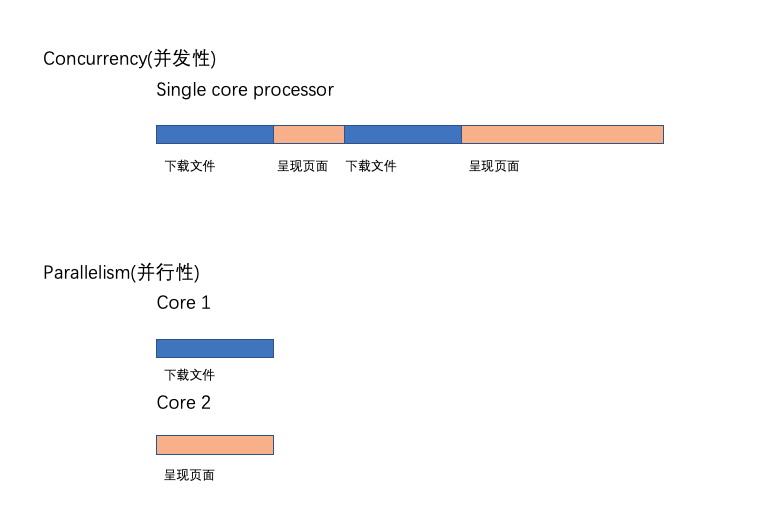

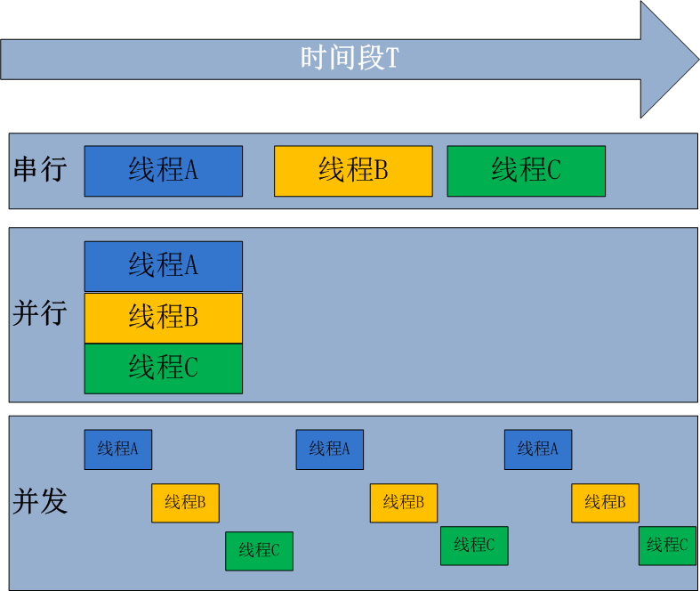

**Goroutine vs 操作系统线程对比：**

| 对比维度 | Goroutine | 操作系统线程 |
|---------|-----------|-------------|
| 调度方式 | Go runtime 调度器（用户态） | 操作系统内核调度 |
| 栈空间 | 初始 2KB，可动态扩展到 1GB | 通常固定 1~2MB |
| 创建开销 | 极低，可创建上百万个 | 较高，通常不超过 1 万个 |
| 上下文切换 | 用户态切换，成本低 | 内核态切换，成本高 |
| 通信方式 | 推荐 Channel | 共享内存 + 锁 |

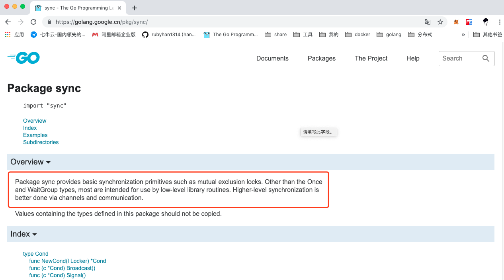

### sync.WaitGroup

`WaitGroup` 是 sync 包提供的同步等待组，用于等待一组 goroutine 执行完成。

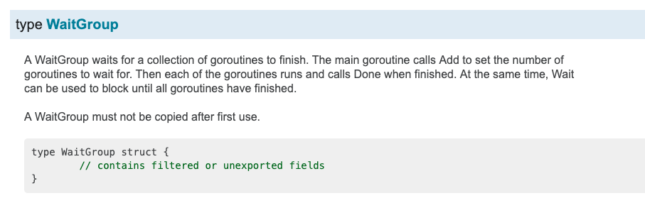

它是一个结构体，主要使用三个方法：

- **Add(delta int)**：设置等待组的计数器值，delta 可以为正也可以为负（表示要等待的 goroutine 数量）

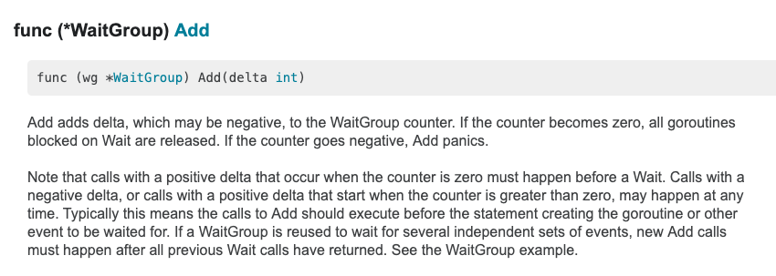

- **Done()**：将计数器减 1，实际上内部调用 `Add(-1)`
- **Wait()**：阻塞当前 goroutine 直到计数器变为 0

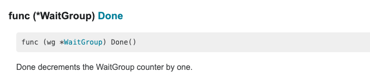

如果计数器的数值变为 0，表示等待时被阻塞的 goroutine 都被释放；如果计数器的数值为负数，则会引发 panic。

示例代码：

```go
package main

import (
	"fmt"
	"sync"
)
var wg sync.WaitGroup // 创建同步等待组对象
func main()  {
	/*
	WaitGroup：同步等待组
		可以使用Add(),设置等待组中要执行的子goroutine的数量，
		在main函数中，使用wait(),让主程序处于等待状态。直到等待组中子程序执行完毕，解除阻塞
		子goroutine对应的函数中。wg.Done()，用于让等待组中的子程序的数量减1
	 */
	// 设置等待组中，要执行的goroutine的数量
	wg.Add(2)
	go fun1()
	go fun2()
	fmt.Println("main进入阻塞状态。。。等待wg中的子goroutine结束。。")
	wg.Wait() // 表示main goroutine进入等待，意味着阻塞
	fmt.Println("main，解除阻塞。。")

}
func fun1()  {
	for i:=1;i<=10;i++{
		fmt.Println("fun1.。。i:",i)
	}
	wg.Done() // 给wg等待中的执行的goroutine数量减1，同Add(-1)
}
func fun2()  {
	defer wg.Done()
	for j:=1;j<=10;j++{
		fmt.Println("\tfun2..j,",j)
	}
}
```

运行结果：

```
fun1.。。i: 1
fun1.。。i: 2
fun1.。。i: 3
fun1.。。i: 4
fun1.。。i: 5
fun1.。。i: 6
fun1.。。i: 7
fun1.。。i: 8
fun1.。。i: 9
fun1.。。i: 10
main进入阻塞状态。。。等待wg中的子goroutine结束。。
	fun2..j, 1
	fun2..j, 2
	fun2..j, 3
	fun2..j, 4
	fun2..j, 5
	fun2..j, 6
	fun2..j, 7
	fun2..j, 8
	fun2..j, 9
	fun2..j, 10
main，解除阻塞。。
```

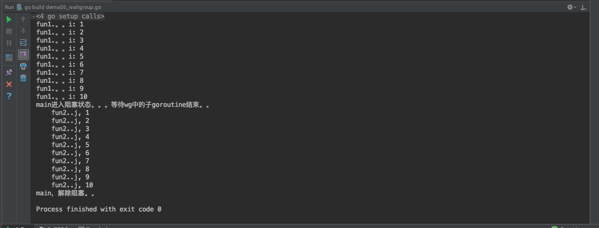

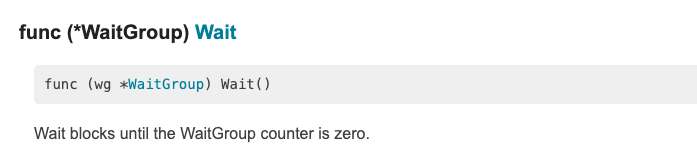

### runtime 调度

#### G-P-M 模型

在操作系统提供的内核线程之上，Go 搭建了一个特有的两级线程模型。goroutine 机制实现了 M : N 的线程模型，是协程（coroutine）的一种实现，Golang 内置的调度器，可以让多核 CPU 中每个 CPU 执行一个协程。

线程的实现模型主要有 3 种，它们之间最大的差异在于用户线程与内核调度实体（KSE）之间的对应关系：

**内核级线程模型（1:1）**：每个用户线程与一个 KSE 静态关联，调度完全由 OS 调度器完成。优点是多核支持下支持真正的并行；缺点是创建开销大。

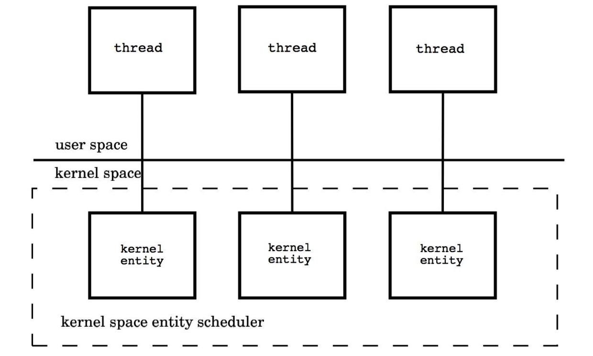

**用户级线程模型（M:1）**：多个用户线程与同一个 KSE 动态关联，线程的创建、销毁和调度由用户空间线程库负责。优点是上下文切换都在用户空间、开销小；缺点是如果某个线程调用阻塞式系统调用，所有线程都会被阻塞。

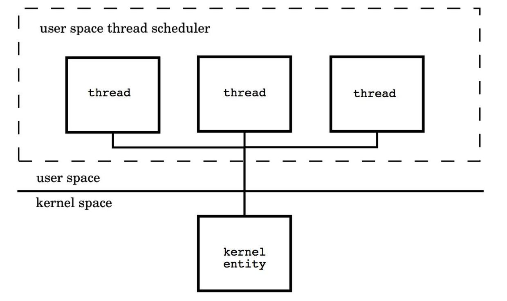

**两级线程模型（M:N）**：多个用户线程与多个 KSE 动态关联，综合了前两种模型的优点。Go 语言中的并发就是使用这种实现方式。

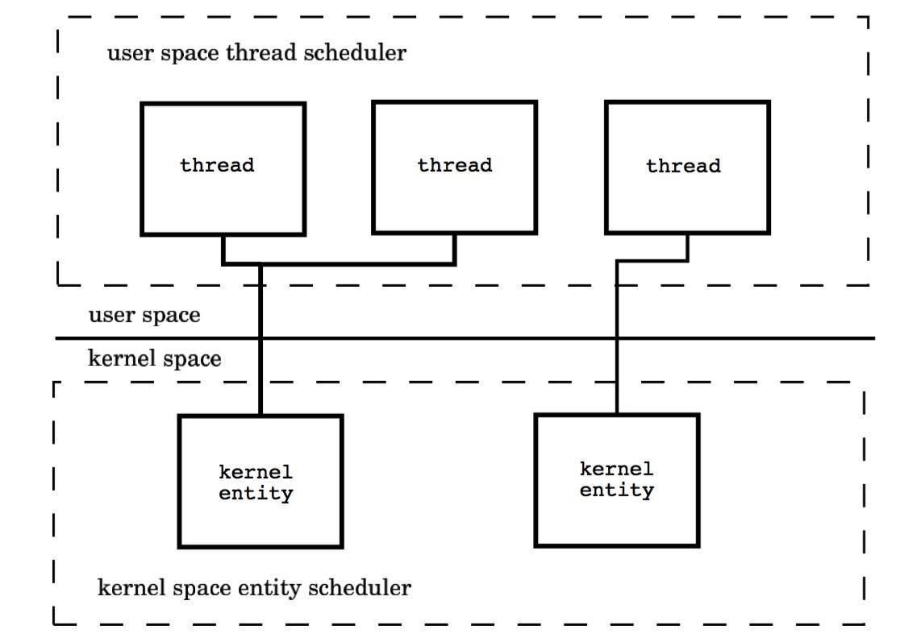

Go 语言中支撑整个 scheduler 实现的主要有 4 个重要结构：

- **G（Goroutine）**：goroutine 实现的核心结构，包含了栈、指令指针，以及其他对调度 goroutine 很重要的信息（例如其阻塞的 channel）。是对一个要并发执行的任务的封装，属于用户级资源。
- **M（Machine）**：系统线程，由操作系统管理，goroutine 就是跑在 M 之上的。属于 OS 资源。
- **P（Processor）**：逻辑处理器，主要用途是用来执行 goroutine 的，它维护了一个 goroutine 队列（runqueue）。P 的数量由 `GOMAXPROCS` 环境变量设置，或在代码中通过 `runtime.GOMAXPROCS()` 设置。
- **Sched**：调度器，维护有存储 M 和 G 的队列以及调度器的一些状态信息等。

加入 P 的好处是：M 要想运行 G 必须先与一个 P 绑定，然后才能运行该 P 管理的 G。可以在 P 对象中预先申请一些系统资源（本地资源），G 需要的时候先向自己的本地 P 申请（无需锁保护），不够用再向全局申请，从而提高效率。

**G-P-M 模型示意图：**

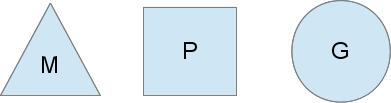

在单核处理器的场景下，所有 goroutine 运行在同一个 M 系统线程中；多核处理器的场景下，为了运行 goroutines，每个 M 系统线程会持有一个 Processor。

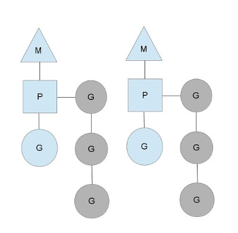

当正在运行的 goroutine 阻塞时（例如系统调用），会再创建一个系统线程（M1），当前的 M 线程放弃它的 P，P 转到新的线程中去运行。

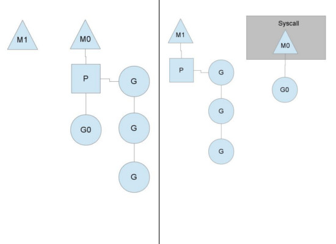

当其中一个 Processor 的 runqueue 为空时，会从另外一个上下文**偷取**一半的 goroutine。

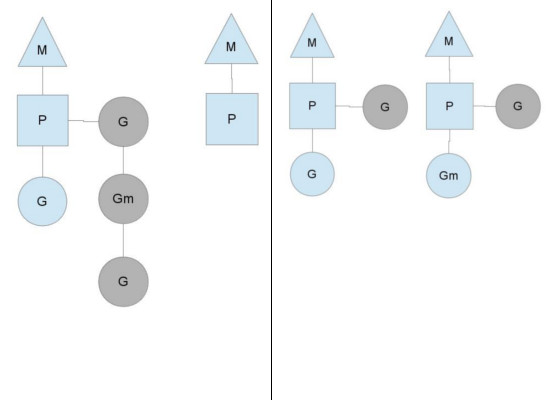

Go 运行时系统通过构造 G-P-M 对象模型实现了一套用户态的并发调度系统，自己管理和调度自己的并发任务。

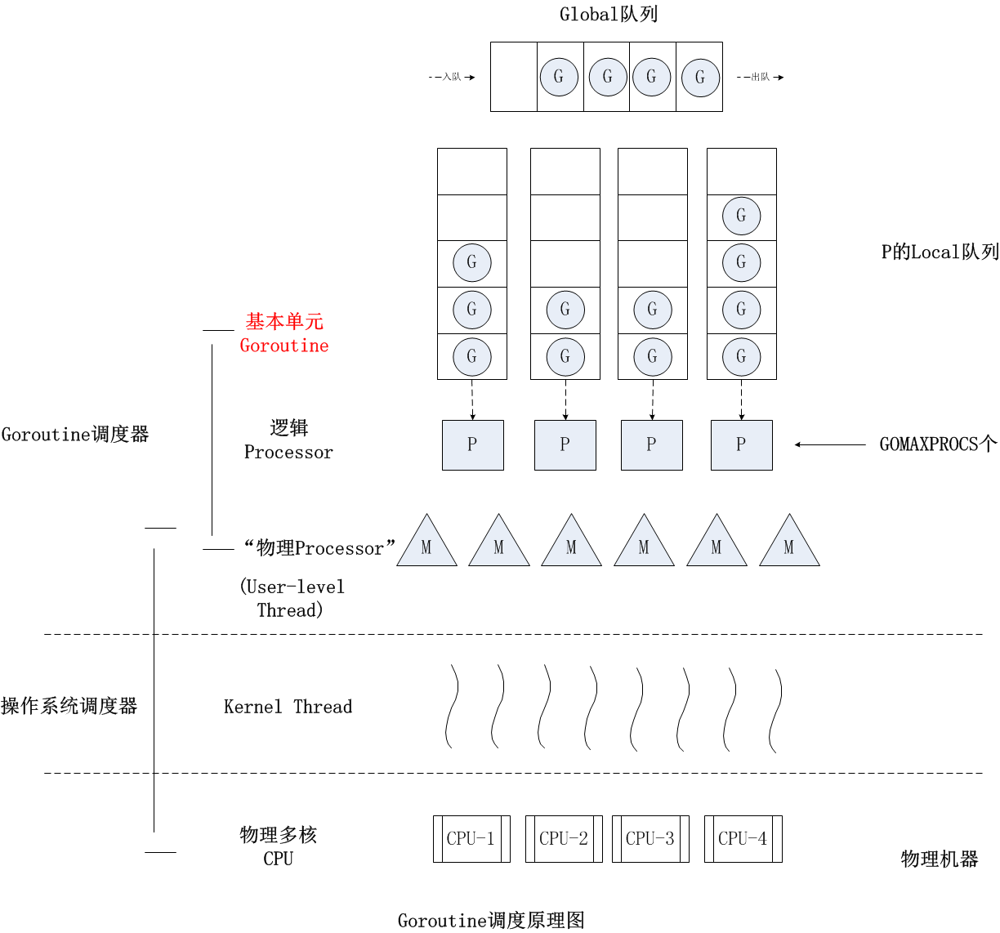

#### runtime 包常用函数

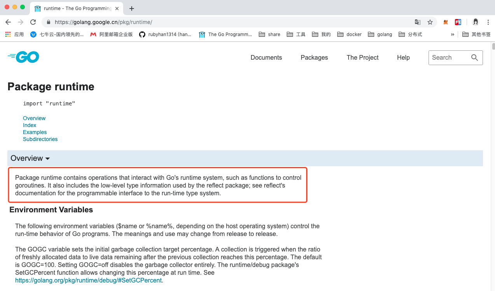

`runtime` 包提供与 Go 运行时系统交互的操作，常用函数包括：

```go
package main

import (
	"fmt"
	"runtime"
	"time"
)

func init(){
	// 1. 获取逻辑CPU的数量
	fmt.Println("逻辑CPU的核数：", runtime.NumCPU())
	// 2. 设置go程序执行的最大的P数量：[1,256]
	n := runtime.GOMAXPROCS(runtime.NumCPU())
	fmt.Println(n)
}
```

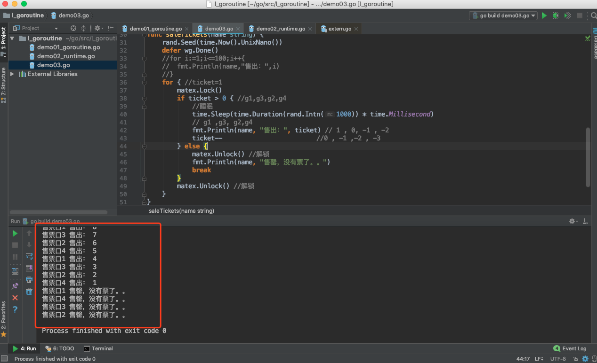

- **NumCPU()**：返回当前系统的 CPU 核数量
- **GOMAXPROCS(n)**：设置最大的可同时使用的 CPU 核数。go1.8 后，默认让程序运行在多个核上，通常可以不用显式设置。go1.8 前则需要手动设置以更高效地利用 CPU。

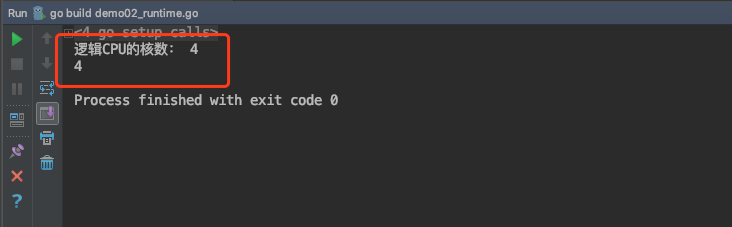

- **Gosched()**：让当前 goroutine 让出 CPU 时间片，以让其他 goroutine 运行，它不会挂起当前 goroutine，当前 goroutine 未来会继续执行。

```go
func main() {
	go func() {
		for i := 0; i < 5; i++ {
			fmt.Println("goroutine。。。")
		}
	}()

	for i := 0; i < 4; i++ {
		// 让出时间片，先让别的协程执行，它执行完，再回来执行此协程
		runtime.Gosched()
		fmt.Println("main。。")
	}
}
```

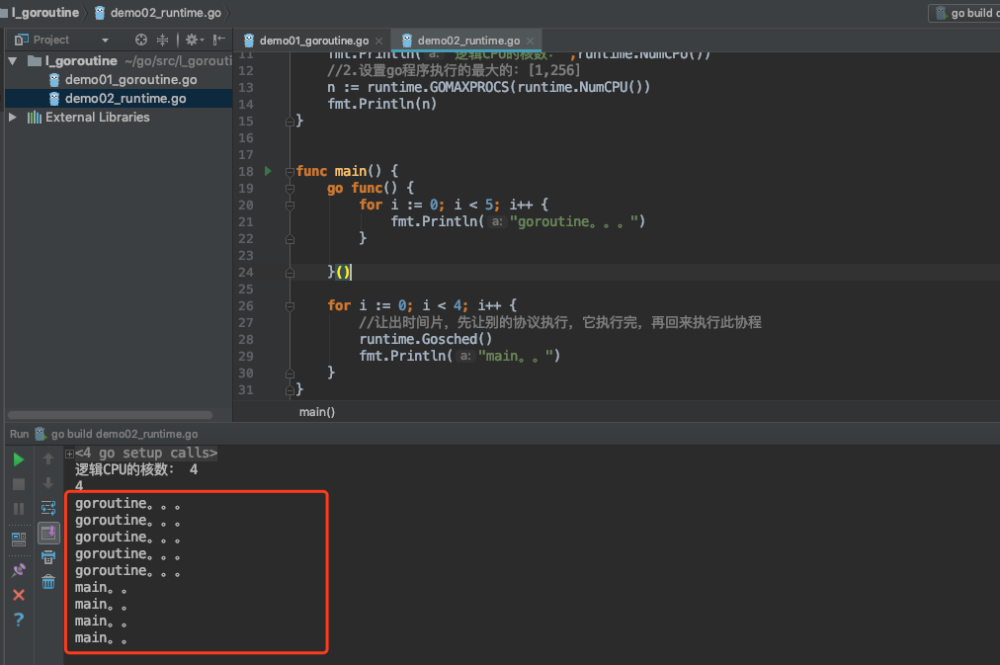

- **Goexit()**：退出当前 goroutine（但是 defer 语句会照常执行）。

```go
func main() {
	// 创建新建的协程
	go func() {
		fmt.Println("goroutine开始。。。")

		// 调用了别的函数
		fun()

		fmt.Println("goroutine结束。。") // 不会执行
	}() // 别忘了()

	// 睡一会儿，不让主协程结束
	time.Sleep(3*time.Second)
}

func fun() {
	defer fmt.Println("defer。。。") // defer 会执行

	// return           // 终止此函数
	runtime.Goexit() // 终止所在的协程

	fmt.Println("fun函数。。。") // 不会执行
}
```

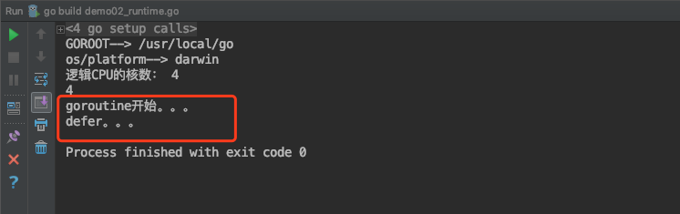

- **NumGoroutine()**：返回正在执行和排队的任务总数
- **GOOS**：目标操作系统
- **GOROOT**：获取 GOROOT 目录

```go
// 获取goroot目录：
fmt.Println("GOROOT-->", runtime.GOROOT())

// 获取操作系统
fmt.Println("os/platform-->", runtime.GOOS) // GOOS--> darwin，mac系统
```

- **runtime.GC()**：让运行时系统进行一次强制性的垃圾收集

### 临界资源与锁

#### 临界资源

**临界资源**指并发环境中多个进程/线程/协程共享的资源。在并发编程中对临界资源的处理不当，往往会导致数据不一致的问题。

示例代码：

```go
package main

import (
	"fmt"
	"time"
)

func main()  {
	a := 1
	go func() {
		a = 2
		fmt.Println("子goroutine。。", a)
	}()
	a = 3
	time.Sleep(1)
	fmt.Println("main goroutine。。", a)
}
```

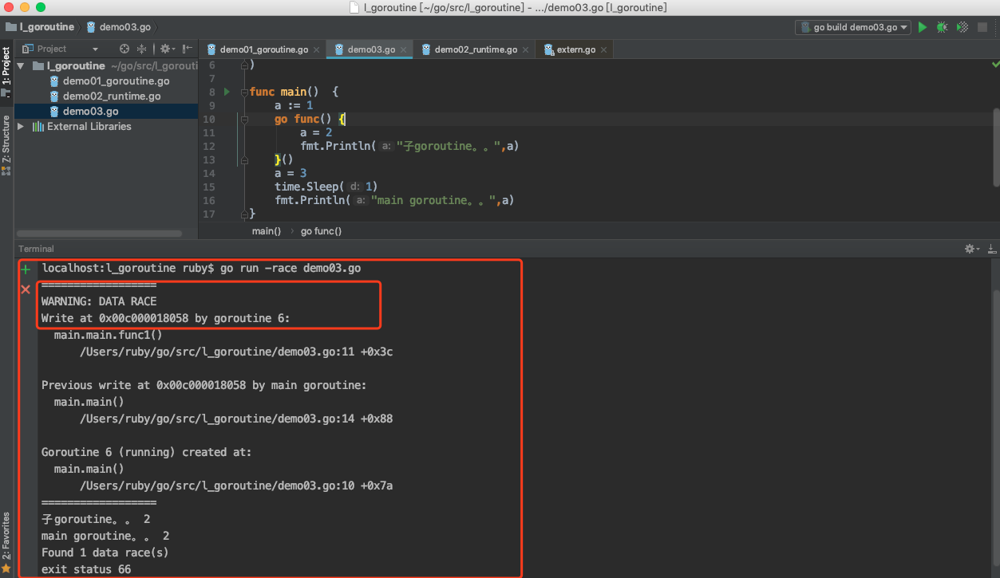

#### 临界资源安全问题

如果多个 goroutine 在访问同一个数据资源的时候，其中一个线程修改了数据，那么这个数值就被修改了，对于其他的 goroutine 来讲，这个数值可能是不对的。

举个例子：通过并发来实现火车站售票，一共有 10 张票，4 个售票口同时出售。

```go
package main

import (
	"fmt"
	"math/rand"
	"time"
)

// 全局变量
var ticket = 10 // 10张票

func main() {
	/*
	4个goroutine，模拟4个售票口，4个子程序操作同一个共享数据。
	 */
	go saleTickets("售票口1") // g1
	go saleTickets("售票口2") // g2
	go saleTickets("售票口3") // g3
	go saleTickets("售票口4") // g4

	time.Sleep(5*time.Second)
}

func saleTickets(name string) {
	rand.Seed(time.Now().UnixNano())
	for { // ticket=1
		if ticket > 0 { // g1, g3, g2, g4 同时判断
			// 睡眠
			time.Sleep(time.Duration(rand.Intn(1000)) * time.Millisecond)
			// g1 , g3, g2, g4
			fmt.Println(name, "售出：", ticket) // 1, 0, -1, -2
			ticket--                            // 0, -1, -2, -3
		} else {
			fmt.Println(name, "售罄，没有票了。。")
			break
		}
	}
}
```

运行后可能发现卖出了编号为负数的票。

**分析：** 卖票逻辑是先判断票数是否大于 0，然后卖票。当只剩最后 1 张票时，某个 goroutine 判断条件成立后先睡眠，此时其他 goroutine 抢占了 CPU，判断条件也成立，也都进入睡眠。当它们陆续醒来后，直接售出而不重新判断，导致卖出 0 张、-1 张甚至 -2 张。

这就是临界资源的不安全问题：某个 goroutine 按旧数值判断好了条件，又被其他 goroutine 抢占并修改了数值，等原 goroutine 继续执行时数值已经不对了。

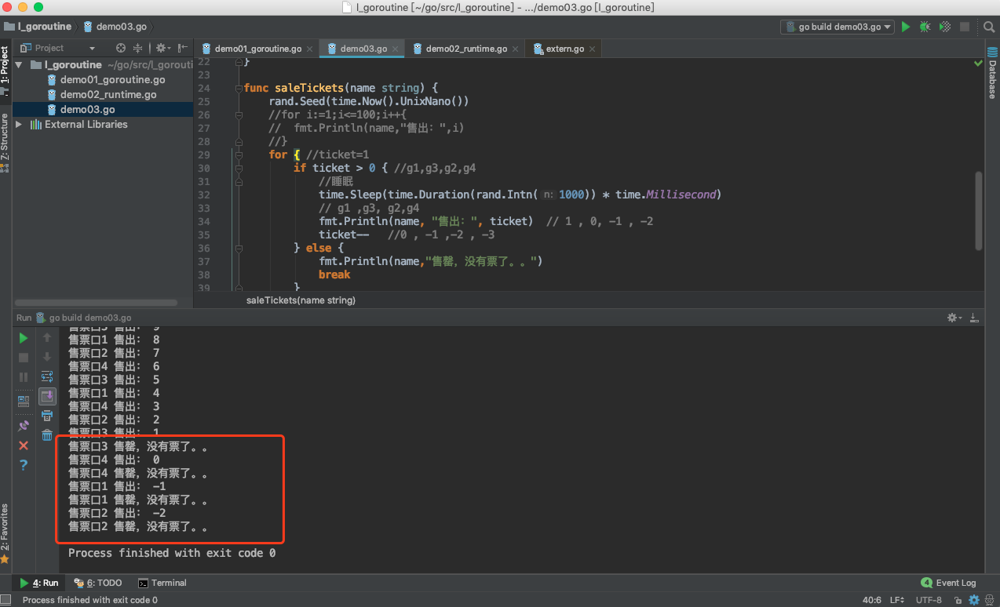

#### 临界资源安全问题的解决

解决临界资源安全问题需要通过同步机制。Go 语言中提供了 `sync` 包的锁操作，同时也强烈建议通过 Channel 来实现数据共享。

### sync.Mutex

`Mutex` 是互斥锁，最简单的一种锁类型，当一个 goroutine 获得了 Mutex 后，其他 goroutine 只能等待该 goroutine 释放该 Mutex。

sync.Mutex 类型只有两个公开的指针方法：

- **Lock()**：锁定当前共享资源。如果该锁已在使用中，则调用 goroutine 将阻塞，直到互斥体可用。

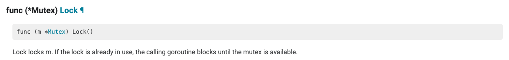

- **Unlock()**：解锁。锁定的互斥体不与特定的 goroutine 关联——允许一个 goroutine 锁定互斥体，然后安排另一个 goroutine 解锁。

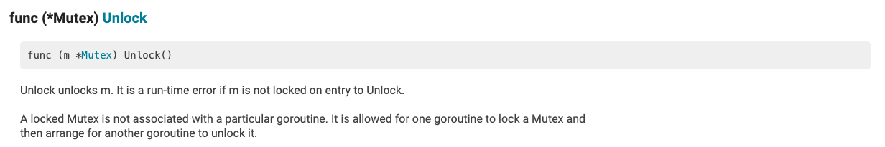

**注意：** 使用互斥锁时，对资源操作完成后一定要解锁，否则会出现死锁。通常借助 defer 保证互斥锁及时解锁。

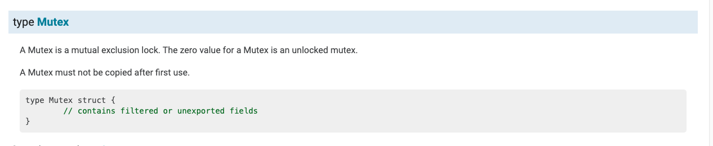

售票示例使用互斥锁解决：

```go
package main

import (
	"fmt"
	"time"
	"math/rand"
	"sync"
)

// 全局变量，表示票
var ticket = 10 // 10张票

var mutex sync.Mutex // 创建锁头

var wg sync.WaitGroup // 同步等待组对象

func main() {
	/*
	4个goroutine，模拟4个售票口，
	在使用互斥锁的时候，对资源操作完，一定要解锁。否则会出现程序异常，死锁等问题。
	defer语句
	 */
	wg.Add(4)
	go saleTickets("售票口1")
	go saleTickets("售票口2")
	go saleTickets("售票口3")
	go saleTickets("售票口4")

	wg.Wait() // main要等待
	fmt.Println("程序结束了。。。")
}

func saleTickets(name string){
	rand.Seed(time.Now().UnixNano())
	defer wg.Done()
	for{
		// 上锁
		mutex.Lock() // g2
		if ticket > 0{ // ticket 1 g1
			time.Sleep(time.Duration(rand.Intn(1000))*time.Millisecond)
			fmt.Println(name,"售出：",ticket) // 1
			ticket-- // 0
		}else{
			mutex.Unlock() // 条件不满足，也要解锁
			fmt.Println(name,"售罄，没有票了。。")
			break
		}
		mutex.Unlock() // 解锁
	}
}
```

运行结果：

```
售票口4 售出： 10
售票口4 售出： 9
售票口2 售出： 8
售票口1 售出： 7
售票口3 售出： 6
售票口4 售出： 5
售票口2 售出： 4
售票口1 售出： 3
售票口3 售出： 2
售票口4 售出： 1
售票口2 售罄，没有票了。。
售票口1 售罄，没有票了。。
售票口3 售罄，没有票了。。
售票口4 售罄，没有票了。。
程序结束了。。。
```

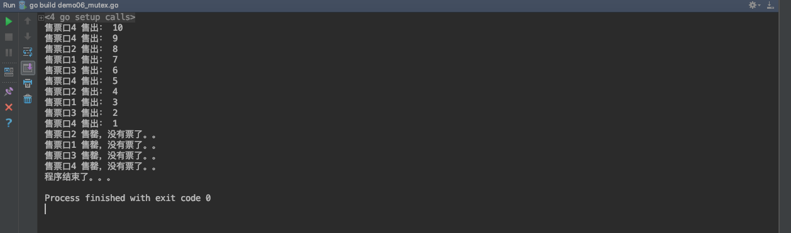

### sync.RWMutex

`RWMutex` 是读写互斥锁。锁可以由任意数量的读取器或单个写入器持有。

**读写锁的规则：**

1. 同时只能有一个 goroutine 能够获得写锁定
2. 同时可以有任意多个 goroutine 获得读锁定
3. 同时只能存在写锁定或读锁定（读和写互斥）

两个基本原则：
- 可以随便读，多个 goroutine 同时读
- 写的时候啥也不能干——不能读也不能写

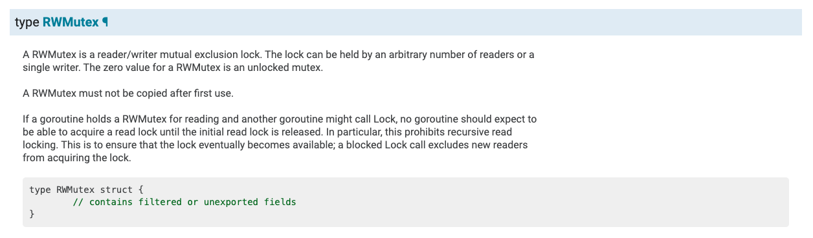

RWMutex 的四个方法：

- **RLock()**：读锁。当有写锁时无法加载读锁；只有读锁或没有锁时可以加载读锁，读锁可以加载多个，适用于"读多写少"的场景。

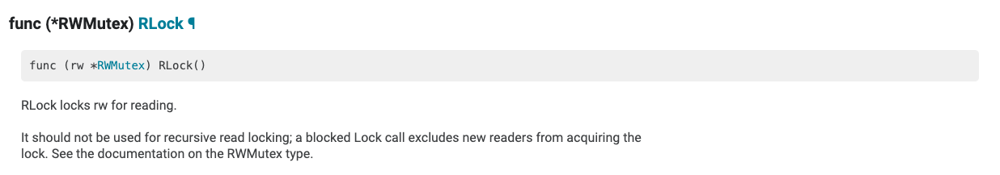

- **RUnlock()**：读锁解锁，撤销单次 RLock 调用，对其他同时存在的读取器没有效果。

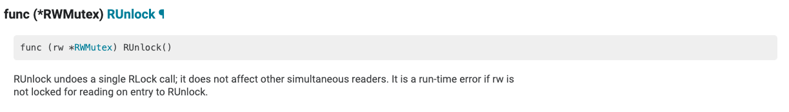

- **Lock()**：写锁。如果已有其他读锁或写锁，则阻塞直到该锁可用。写锁权限高于读锁，有写锁时优先进行写锁定。

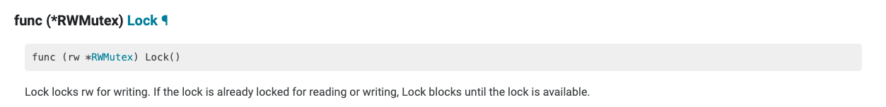

- **Unlock()**：写锁解锁。如果没有进行写锁定，会引发运行时错误。

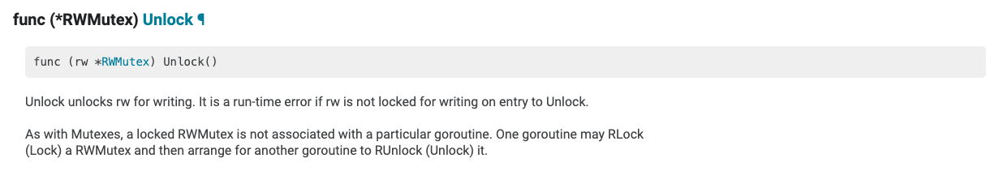

示例代码：

```go
package main

import (
	"fmt"
	"sync"
	"time"
)

var rwMutex *sync.RWMutex
var wg *sync.WaitGroup

func main() {
	rwMutex = new(sync.RWMutex)
	wg = new(sync.WaitGroup)

	wg.Add(3)
	go writeData(1)
	go readData(2)
	go writeData(3)

	wg.Wait()
	fmt.Println("main..over...")
}

func writeData(i int){
	defer wg.Done()
	fmt.Println(i, "开始写：write start。。")
	rwMutex.Lock() // 写操作上锁
	fmt.Println(i, "正在写：writing。。。。")
	time.Sleep(3*time.Second)
	rwMutex.Unlock()
	fmt.Println(i, "写结束：write over。。")
}

func readData(i int) {
	defer wg.Done()
	fmt.Println(i, "开始读：read start。。")
	rwMutex.RLock() // 读操作上锁
	fmt.Println(i, "正在读取数据：reading。。。")
	time.Sleep(3*time.Second)
	rwMutex.RUnlock() // 读操作解锁
	fmt.Println(i, "读结束：read over。。。")
}
```

运行结果：

```
3 开始写：write start
3 正在写：writing
2 开始读：read start
1 开始写：write start
3 写结束：write over
2 正在读：reading
2 读结束：read over
1 正在写：writing
1 写结束：write over
main..over...
```

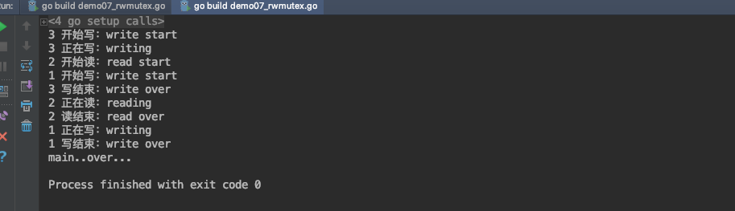

**Mutex vs RWMutex 对比：**

| 对比维度 | sync.Mutex | sync.RWMutex |
|---------|------------|--------------|
| 读操作并发 | 读与读互斥，一次只有一个 goroutine 持有锁 | 多个 goroutine 可同时持有读锁 |
| 写操作并发 | 写与写互斥，写与读互斥 | 写锁独占，写时禁止读 |
| 适用场景 | 一般场景，读写都较多 | 读多写少的场景 |
| 性能 | 读多时性能较低 | 读多时有明显性能优势 |
| 锁类型 | 只有 Lock/Unlock | Lock/Unlock + RLock/RUnlock |

**读写锁总结：**

1. 读锁不能阻塞读锁
2. 读锁需要阻塞写锁，直到所有读锁都释放
3. 写锁需要阻塞读锁，直到所有写锁都释放
4. 写锁需要阻塞写锁

## Channel

通道可以被认为是 Goroutines 之间通信的管道。类似于管道中的水从一端到另一端的流动，数据可以从一端发送到另一端，通过通道接收。

Go 语言中，要传递某个数据给另一个 goroutine，可以把这个数据封装成一个对象，然后把这个对象的指针传入某个 channel 中，另外一个 goroutine 从这个 channel 中读出这个指针并处理。Go 从语言层面保证同一个时间只有一个 goroutine 能够访问 channel 里面的数据，为开发者提供了一种优雅简单的工具。

### Channel 对比表

| 对比维度 | 无缓冲 Channel | 有缓冲 Channel |
|---------|---------------|---------------|
| 创建方式 | `make(chan T)` | `make(chan T, capacity)` |
| 容量 | 0 | 指定容量 > 0 |
| 发送行为 | 阻塞直到接收方就绪 | 缓冲区满时才阻塞 |
| 接收行为 | 阻塞直到发送方就绪 | 缓冲区空时才阻塞 |
| 通信模式 | 同步模式 | 异步模式 |
| 使用场景 | 需要严格同步的场景 | 生产者-消费者模式 |

### 基本语法

#### 通道的声明与创建

每个通道都有与其相关的类型。通道的零值为 nil，nil 通道没有任何用处，因此通道必须使用类似于 map 和切片的方法来定义：

```go
// 声明通道
var 通道名 chan 数据类型
// 创建通道：如果通道为nil(就是不存在)，就需要先创建通道
通道名 = make(chan 数据类型)
```

示例代码：

```go
package main

import "fmt"

func main() {
	var a chan int
	if a == nil {
		fmt.Println("channel 是 nil 的, 不能使用，需要先创建通道。。")
		a = make(chan int)
		fmt.Printf("数据类型是： %T", a)
	}
}
```

运行结果：

```
channel 是 nil 的, 不能使用，需要先创建通道。。
数据类型是： chan int
```

也可以简短声明：

```go
a := make(chan int) 
```

#### channel 的数据类型

channel 是引用类型的数据，在作为参数传递的时候，传递的是内存地址。

```go
package main

import (
	"fmt"
)

func main() {
	ch1 := make(chan int)
	fmt.Printf("%T,%p\n", ch1, ch1)

	test1(ch1)
}

func test1(ch chan int){
	fmt.Printf("%T,%p\n", ch, ch)
}
```

ch 和 ch1 的地址是一样的，说明它们是同一个通道。

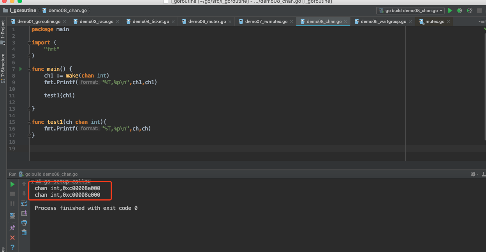

#### 通道的注意点

- 用于 goroutine 之间传递消息
- 每个通道都有相关联的数据类型，nil chan 不能使用，类似于 nil map
- 使用 `<-` 传递数据：`chan <- data` 向通道中写数据；`data <- chan` 从通道中读数据
- 阻塞特性：发送数据 `chan <- data` 是阻塞的，直到另一条 goroutine 读取数据来解除阻塞；读取数据 `data <- chan` 也是阻塞的，直到另一条 goroutine 写出数据解除阻塞
- 本身 channel 就是同步的，同一时间只能有一条 goroutine 来操作
- 通道是 goroutine 之间的连接，所以通道的发送和接收必须处在不同的 goroutine 中

#### 发送和接收

```go
data := <- a // read from channel a  
a <- data    // write to channel a
```

在通道上箭头的方向指定数据是发送还是接收。另外：

```go
v, ok := <- a // 从一个channel中读取
```

#### 发送和接收默认是阻塞的

一个通道发送和接收数据，默认是阻塞的。当一个数据被发送到通道时，在发送语句中被阻塞，直到另一个 Goroutine 从该通道读取数据。相对地，当从通道读取数据时，读取被阻塞，直到一个 Goroutine 将数据写入该通道。

这些通道的特性是帮助 Goroutines 有效地进行通信，而无需使用显式锁或条件变量。

示例代码：

```go
package main

import "fmt"

func main() {
	var ch1 chan bool       // 声明，没有创建
	fmt.Println(ch1)        // <nil>
	fmt.Printf("%T\n", ch1) // chan bool
	ch1 = make(chan bool)   // 0xc0000a4000,是引用类型的数据
	fmt.Println(ch1)

	go func() {
		for i := 0; i < 10; i++ {
			fmt.Println("子goroutine中，i：", i)
		}
		// 循环结束后，向通道中写数据，表示要结束了。。
		ch1 <- true

		fmt.Println("结束。。")

	}()

	data := <-ch1 // 从ch1通道中读取数据
	fmt.Println("data-->", data)
	fmt.Println("main。。over。。。。")
}
```

在上面的程序中，先创建了一个 `chan bool` 通道，然后启动子 Goroutine 并循环打印 10 个数字，之后向通道 ch1 中写入 `true`。在主 goroutine 中从 ch1 中读取数据，这一行代码是阻塞的，意味着在子 Goroutine 将数据写入到该通道之前，主 goroutine 将不会执行到下一行代码。因此，可以通过 channel 实现子 goroutine 和主 goroutine 之间的通信，消除了对 `time.Sleep()` 的需求。

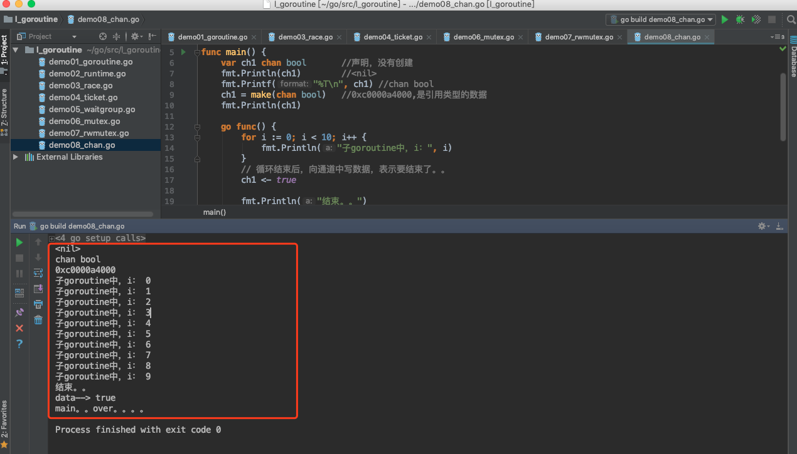

加入睡眠来更好理解 channel 的阻塞：

```go
package main

import (
	"fmt"
	"time"
)

func main() {
	ch1 := make(chan int)
	done := make(chan bool) // 通道
	go func() {
		fmt.Println("子goroutine执行。。。")
		time.Sleep(3 * time.Second)
		data := <-ch1 // 从通道中读取数据
		fmt.Println("data：", data)
		done <- true
	}()
	// 向通道中写数据。。
	time.Sleep(5 * time.Second)
	ch1 <- 100

	<-done
	fmt.Println("main。。over")
}
```

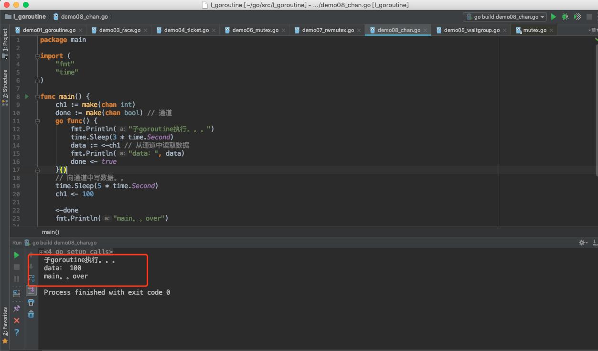

再一个例子，打印一个数字的个位数的平方和与立方和：

```go
package main

import (  
    "fmt"
)

func calcSquares(number int, squareop chan int) {  
    sum := 0
    for number != 0 {
        digit := number % 10
        sum += digit * digit
        number /= 10
    }
    squareop <- sum
}

func calcCubes(number int, cubeop chan int) {  
    sum := 0 
    for number != 0 {
        digit := number % 10
        sum += digit * digit * digit
        number /= 10
    }
    cubeop <- sum
} 

func main() {  
    number := 589
    sqrch := make(chan int)
    cubech := make(chan int)
    go calcSquares(number, sqrch)
    go calcCubes(number, cubech)
    squares, cubes := <-sqrch, <-cubech
    fmt.Println("Final output", squares + cubes)
}
```

运行结果：

```
Final output 1536
```

#### 死锁

使用通道时要考虑的一个重要因素是死锁。如果 Goroutine 在一个通道上发送数据，那么预计其他的 Goroutine 应该接收数据。如果这种情况不发生，那么程序将在运行时出现死锁。

类似地，如果 Goroutine 正在等待从通道接收数据，那么另一些 Goroutine 将会在该通道上写入数据，否则程序将会死锁。

```go
package main

func main() {  
    ch := make(chan int)
    ch <- 5
}
```

报错：

```
fatal error: all goroutines are asleep - deadlock!

goroutine 1 [chan send]:
main.main()
	/Users/ruby/go/src/l_goroutine/demo08_chan.go:5 +0x50
```

### 无缓冲通道

之前学习的所有通道基本上都没有缓冲。发送和接收到一个未缓冲的通道是阻塞的。

一次发送操作对应一次接收操作，对于一个 goroutine 来讲，它的一次发送，在另一个 goroutine 接收之前都是阻塞的。同样的，对于接收来讲，在另一个 goroutine 发送之前，它也是阻塞的。

### 有缓冲通道

缓冲通道就是指一个带有缓冲区的通道。发送到一个缓冲通道只有在缓冲区满时才被阻塞。类似地，从缓冲通道接收的信息只有在缓冲区为空时才会被阻塞。

可以通过将额外的容量参数传递给 `make` 函数来创建缓冲通道：

```go
ch := make(chan type, capacity)  
```

容量应该大于 0，以便通道具有缓冲区。默认情况下，无缓冲通道的容量为 0。

示例代码：

```go
package main

import (
	"fmt"
	"strconv"
	"time"
)

func main() {
	/*
	非缓存通道：make(chan T)
	缓存通道：make(chan T ,size)
		缓存通道，理解为是队列：

	非缓存，发送还是接受，都是阻塞的
	缓存通道，缓存区的数据满了，才会阻塞状态。。
	 */
	ch1 := make(chan int)           // 非缓存的通道
	fmt.Println(len(ch1), cap(ch1)) // 0 0
	// ch1 <- 100 // 阻塞的，需要其他的goroutine解除阻塞，否则deadlock

	ch2 := make(chan int, 5)        // 缓存的通道，缓存区大小是5
	fmt.Println(len(ch2), cap(ch2)) // 0 5
	ch2 <- 100                      //
	fmt.Println(len(ch2), cap(ch2)) // 1 5

	fmt.Println("--------------")
	ch3 := make(chan string, 4)
	go sendData3(ch3)
	for {
		time.Sleep(1*time.Second)
		v, ok := <-ch3
		if !ok {
			fmt.Println("读完了，，", ok)
			break
		}
		fmt.Println("\t读取的数据是：", v)
	}

	fmt.Println("main...over...")
}

func sendData3(ch3 chan string) {
	for i := 0; i < 10; i++ {
		ch3 <- "数据" + strconv.Itoa(i)
		fmt.Println("子goroutine，写出第", i, "个数据")
	}
	close(ch3)
}
```

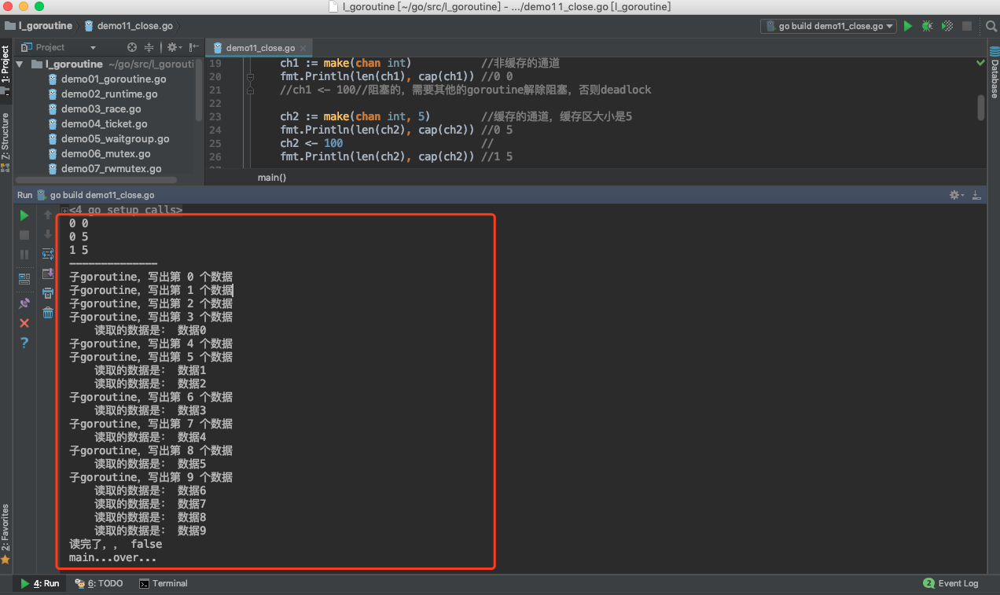

### 关闭通道

发送者可以通过关闭信道来通知接收方不会有更多的数据被发送到 channel 上：

```go
close(ch)
```

接收者可以在接收来自通道的数据时使用额外的变量来检查通道是否已经关闭：

```go
v, ok := <- ch  
```

如果 ok 的值是 true，表示成功的从通道中读取了一个数据 value。如果 ok 是 false，这意味着正在从一个封闭的通道读取数据，从闭通道读取的值将是通道类型的零值。例如，如果通道是一个 int 通道，那么从封闭通道接收的值将为 0。

示例代码：

```go
package main

import (
	"fmt"
	"time"
)

func main()  {
	ch1 := make(chan int)
	go sendData(ch1)
	/*
	子goroutine，写出数据10个
			每写一个，阻塞一次，主程序读取一次，解除阻塞

	主goroutine：循环读
			每次读取一个，堵塞一次，子程序写出一个，解除阻塞

	发送方关闭通道的--->接收方，接收到的数据是该类型的零值，以及false
	 */
	// 主程序中获取通道的数据
	for{
		time.Sleep(1*time.Second)
		v, ok := <- ch1 // 其他goroutine，显示的调用close方法关闭通道。
		if !ok{
			fmt.Println("已经读取了所有的数据，", ok)
			break
		}
		fmt.Println("取出数据：", v, ok)
	}

	fmt.Println("main...over....")
}

func sendData(ch1 chan int)  {
	// 发送方：10条数据
	for i:=0;i<10 ;i++  {
		ch1 <- i // 将i写入通道中
	}
	close(ch1) // 将ch1通道关闭了。
}
```

运行结果：

```
取出数据： 0 true
取出数据： 1 true
取出数据： 2 true
取出数据： 3 true
取出数据： 4 true
取出数据： 5 true
取出数据： 6 true
取出数据： 7 true
取出数据： 8 true
取出数据： 9 true
已经读取了所有的数据， false
main...over....
```

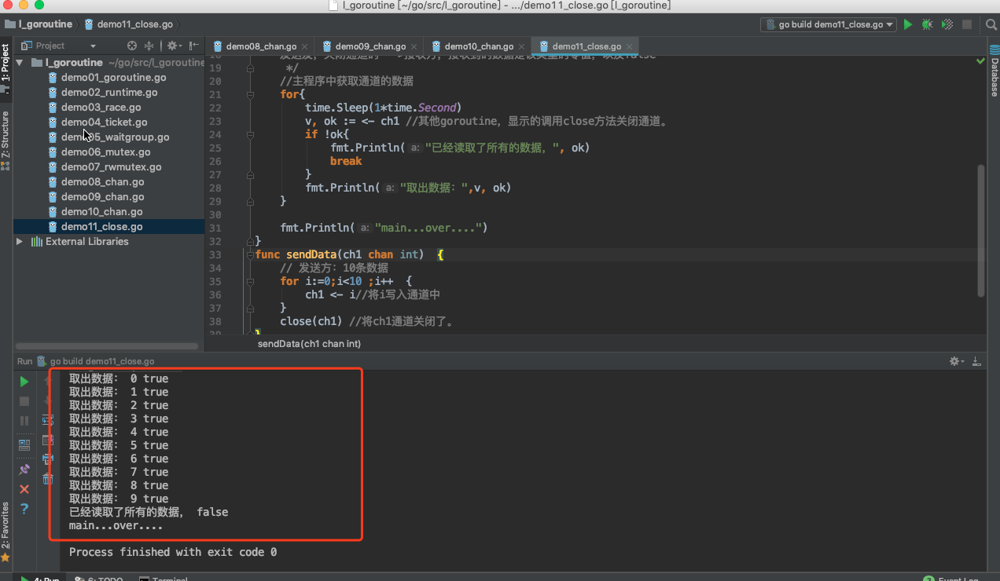

### range 遍历

我们可以循环从通道上获取数据，直到通道关闭。for 循环的 `for range` 形式可用于从通道接收值，直到它关闭为止。

```go
package main

import (
	"time"
	"fmt"
)

func main()  {
	ch1 := make(chan int)
	go sendData(ch1)
	// for循环的for range形式可用于从通道接收值，直到它关闭为止。
	for v := range ch1{
		fmt.Println("读取数据：", v)
	}
	fmt.Println("main..over.....")
}

func sendData(ch1 chan int)  {
	for i:=0;i<10 ; i++ {
		time.Sleep(1*time.Second)
		ch1 <- i
	}
	close(ch1) // 通知对方，通道关闭
}
```

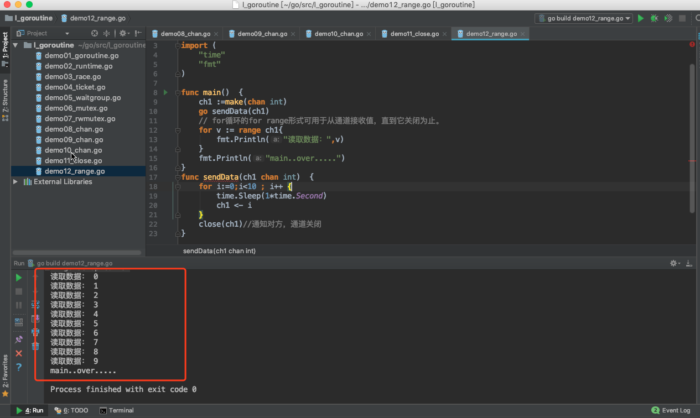

### select 语句

select 是 Go 中的一个控制结构。select 语句类似于 switch 语句，但是 select 会随机执行一个可运行的 case。如果没有 case 可运行，它将阻塞，直到有 case 可运行。

语法结构：

```go
select {
    case communication clause  :
       statement(s);      
    case communication clause  :
       statement(s); 
    /* 你可以定义任意数量的 case */
    default : /* 可选 */
       statement(s);
}
```

说明：
- 每个 case 都必须是一个通信
- 所有 channel 表达式都会被求值
- 所有被发送的表达式都会被求值
- 如果有多个 case 都可以运行，select 会随机公平地选出一个执行。其他不会执行
- 如果有 default 子句，则执行该语句
- 如果没有 default 子句，select 将阻塞，直到某个通信可以运行；Go 不会重新对 channel 或值进行求值

示例代码：

```go
package main

import (
	"fmt"
	"time"
)

func main() {
	/*
	分支语句：if，switch，select
	select 语句类似于 switch 语句，
		但是select会随机执行一个可运行的case。
		如果没有case可运行，它将阻塞，直到有case可运行。
	 */

	ch1 := make(chan int)
	ch2 := make(chan int)

	go func() {
		time.Sleep(2 * time.Second)
		ch2 <- 200
	}()
	go func() {
		time.Sleep(2 * time.Second)
		ch1 <- 100
	}()

	select {
	case num1 := <-ch1:
		fmt.Println("ch1中取数据。。", num1)
	case num2, ok := <-ch2:
		if ok {
			fmt.Println("ch2中取数据。。", num2)
		}else{
			fmt.Println("ch2通道已经关闭。。")
		}
	}
}
```

运行结果：可能执行第一个 case 打印 100，也可能执行第二个 case 打印 200（多运行几次，结果就不同了）。

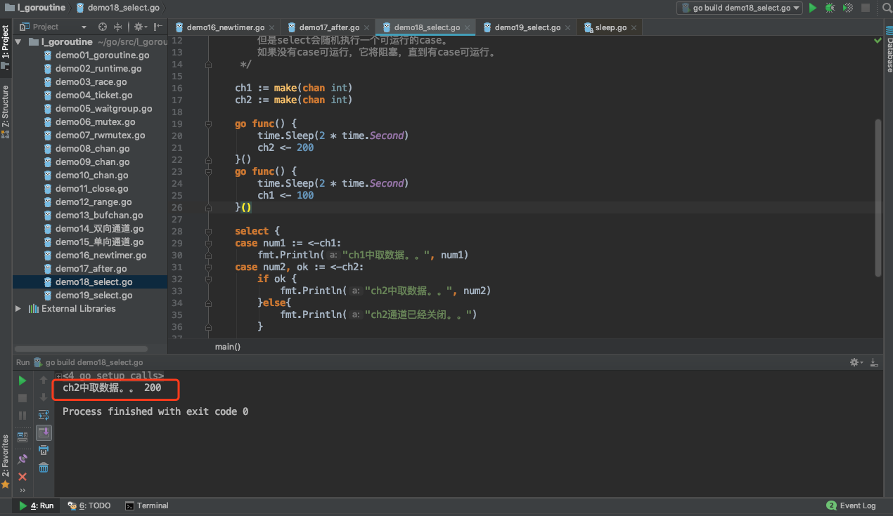

**select 结合 time 包实现超时：**

```go
package main

import (
	"fmt"
	"time"
)

func main() {
	ch1 := make(chan int)
	ch2 := make(chan int)

	select {
	case <-ch1:
		fmt.Println("case1可以执行。。")
	case <-ch2:
		fmt.Println("case2可以执行。。")
	case <-time.After(3 * time.Second):
		fmt.Println("case3执行。。timeout。。")
	}
}
```

运行结果：

```
case3执行。。timeout。。
```

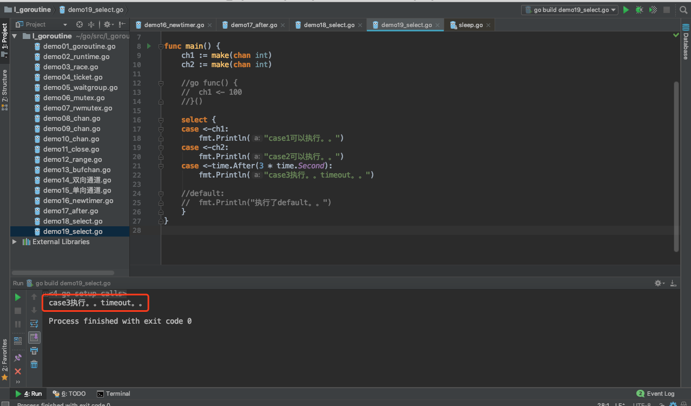

### 单向通道

**双向通道：** 既可以发送数据，也可以读取数据。

```go
data := <- a // read from channel a  
a <- data    // write to channel a
```

双向通道示例代码：

```go
package main

import "fmt"

func main()  {
	/*
	双向：
		chan T -->
			chan <- data, 写出数据，写
			data <- chan, 获取数据，读
	单向：定向
		chan <- T,
			只支持写，
		<- chan T,
			只读
	 */
	ch1 := make(chan string) // 双向，可读，可写
	done := make(chan bool)
	go sendData(ch1, done)
	data :=<- ch1 // 阻塞
	fmt.Println("子goroutine传来：", data)
	ch1 <- "我是main。。" // 阻塞

	<-done
	fmt.Println("main...over....")
}

// 子goroutine-->写数据到ch1通道中
// main goroutine-->从ch1通道中取
func sendData(ch1 chan string, done chan bool)  {
	ch1 <- "我是小明" // 阻塞
	data := <-ch1 // 阻塞
	fmt.Println("main goroutine传来：", data)

	done <- true
}
```

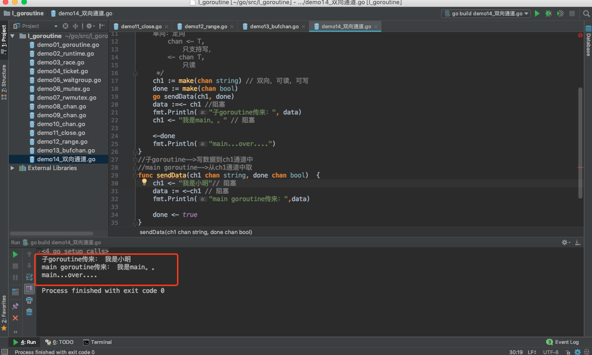

**单向通道（定向通道）：** 只能发送或者接收数据的通道。

- `chan <- T`：只支持写
- `<- chan T`：只支持读

单向通道主要用于函数参数传递中，可以在编译期限制函数内部对 channel 的操作：

```go
package main

import "fmt"

func main()  {
	/*
		单向：定向
		chan <- T, 只支持写
		<- chan T, 只读
		用于参数传递：
	 */
	ch1 := make(chan int) // 双向，读，写
	// ch2 := make(chan <- int)  // 单向，只写，不能读
	// ch3 := make(<- chan int)  // 单向，只读，不能写

	go fun1(ch1)
	data := <- ch1
	fmt.Println("fun1中写出的数据是：", data)

	go fun2(ch1)
	ch1 <- 200
	fmt.Println("main。。over。。")
}

// 该函数接收只写的通道
func fun1(ch chan <- int){
	// 函数内部，对于ch只能写数据，不能读数据
	ch <- 100
	fmt.Println("fun1函数结束。。")
}

func fun2(ch <-chan int){
	// 函数内部，对于ch只能读数据，不能写数据
	data := <- ch
	fmt.Println("fun2函数，从ch中读取的数据是：", data)
}
```

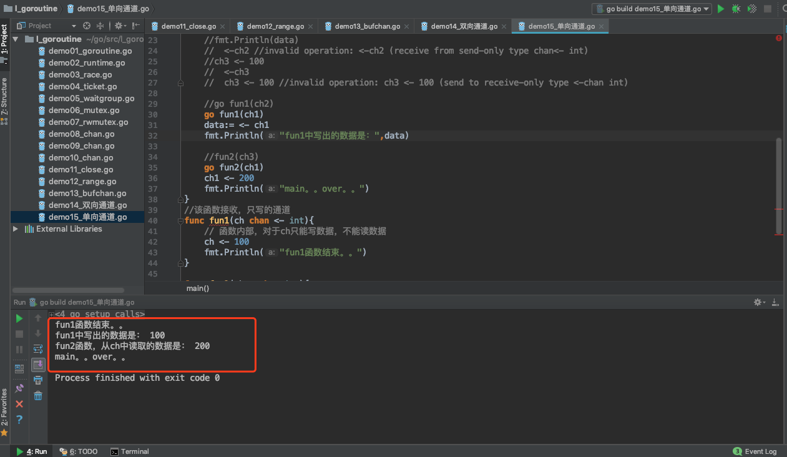

**通道方向对比：**

| 通道类型 | 声明语法 | 可发送 | 可接收 | 适用场景 |
|---------|---------|--------|--------|---------|
| 双向通道 | `chan T` | ✅ | ✅ | 通用场景 |
| 只写通道 | `chan<- T` | ✅ | ❌ | 函数参数限制只能发送 |
| 只读通道 | `<-chan T` | ❌ | ✅ | 函数参数限制只能接收 |

### Timer/Ticker

标准库中的 Timer 让用户可以定义自己的超时逻辑，尤其是在应对 select 处理多个 channel 的超时、单 channel 读写的超时等情形时尤为方便。

Timer 是一次性的时间触发事件，这点与 Ticker 不同，Ticker 是按一定时间间隔持续触发时间事件。

Timer 常见的创建方式：

```go
t := time.NewTimer(d)
t := time.AfterFunc(d, f)
c := time.After(d)
```

Timer 有 3 个要素：
- **定时时间**：就是那个 d
- **触发动作**：就是那个 f
- **时间 channel**：也就是 `t.C`

#### time.NewTimer()

`NewTimer()` 创建一个新的计时器，该计时器将在其通道上至少持续 d 之后发送当前时间。它的返回值是一个 `*Timer`。

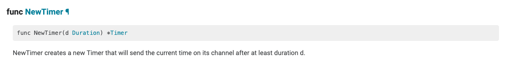

```go
package main

import (
	"time"
	"fmt"
)

func main() {
	/*
		1.func NewTimer(d Duration) *Timer
			创建一个计时器：d时间以后触发，go触发计时器的方法比较特别，就是在计时器的channel中发送值
	 */
	// 新建一个计时器：timer
	timer := time.NewTimer(3 * time.Second)
	fmt.Printf("%T\n", timer) // *time.Timer
	fmt.Println(time.Now())   // 2019-08-15 10:41:21.800768 +0800 CST m=+0.000461190

	// 此处在等待channel中的信号，执行此段代码时会阻塞3秒
	ch2 := timer.C     // <-chan time.Time
	fmt.Println(<-ch2) // 3秒后的时间
}
```

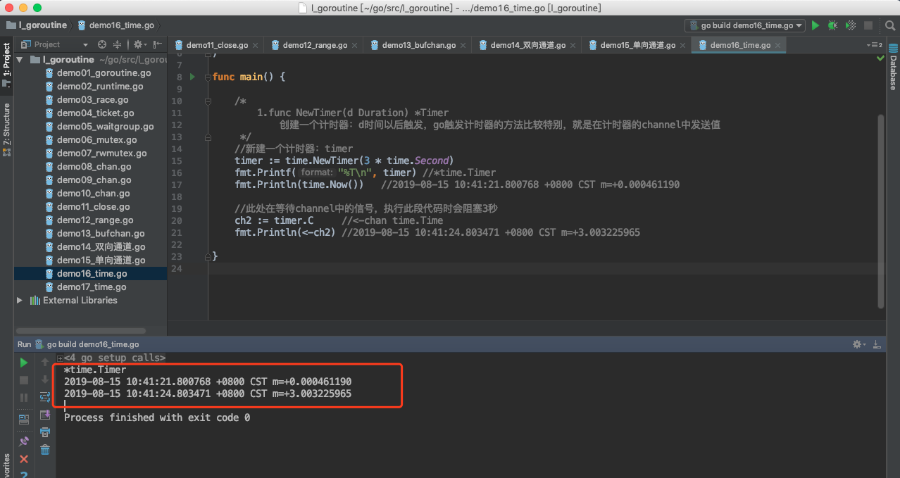

- 用于在指定的 Duration 类型时间后调用函数或计算表达式
- 如果只是想在指定时间之后执行，使用 `time.Sleep()`
- 使用 `NewTimer()`，可以在计时器到期之前取消该计时器
- 直到使用 `<-timer.C` 发送一个值，该计时器才会过期

#### timer.Stop

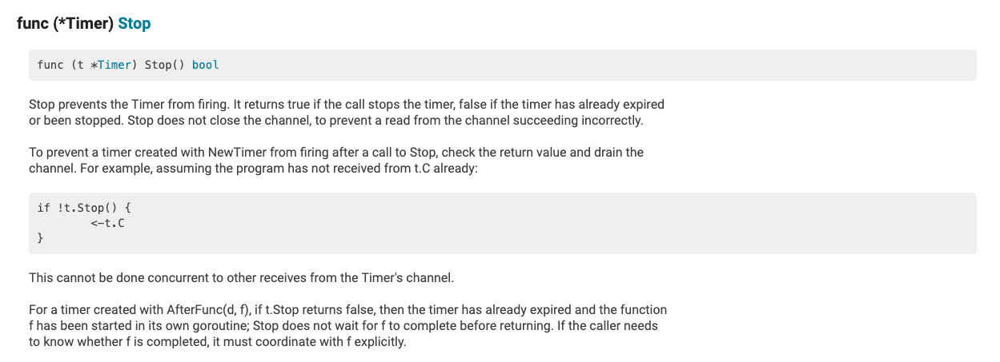

```go
package main

import (
	"time"
	"fmt"
)

func main() {
	fmt.Println("-------------------------------")

	// 新建计时器，5秒后触发
	timer2 := time.NewTimer(5 * time.Second)

	// 新开启一个线程来处理触发后的事件
	go func() {
		// 等触发时的信号
		<-timer2.C
		fmt.Println("Timer 2 结束。。")
	}()

	// 上面的等待信号在新线程中，代码继续往下执行，停掉计时器
	time.Sleep(3*time.Second)
	stop := timer2.Stop()

	if stop {
		fmt.Println("Timer 2 停止。。")
	}
}
```

运行结果：

```
Timer 2 停止。。
```

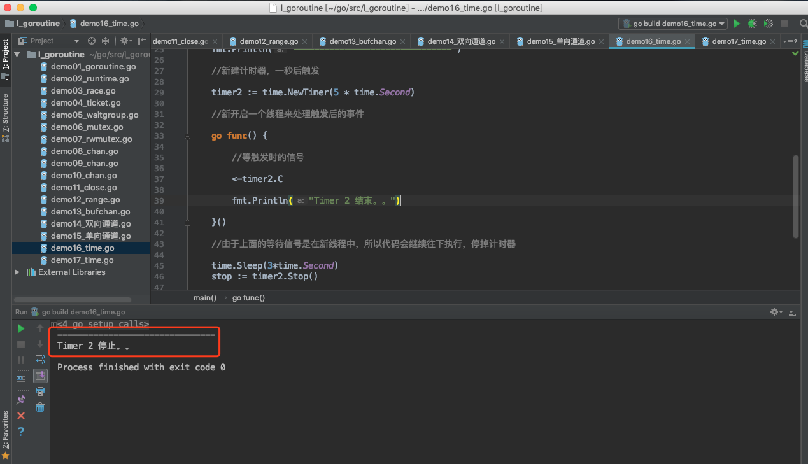

#### time.After()

在等待持续时间之后，在返回的通道上发送当前时间。它相当于 `NewTimer(d).C`。在计时器触发之前，垃圾收集器不会恢复底层计时器。如果效率有问题，使用 `NewTimer` 代替，并在不再需要计时器时调用 `Timer.Stop`。

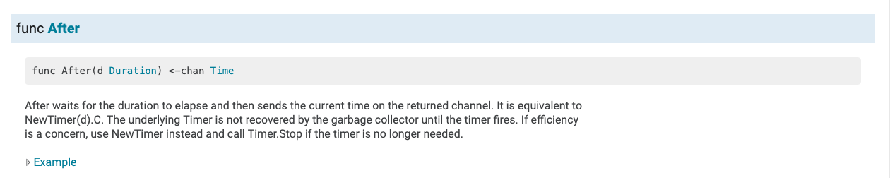

```go
package main

import (
	"time"
	"fmt"
)

func main() {
	/*
		func After(d Duration) <-chan Time
			返回一个通道：chan，存储的是d时间间隔后的当前时间。
	 */
	ch1 := time.After(3 * time.Second) // 3s后
	fmt.Printf("%T\n", ch1) // <-chan time.Time
	fmt.Println(time.Now())
	time2 := <-ch1
	fmt.Println(time2)
}
```

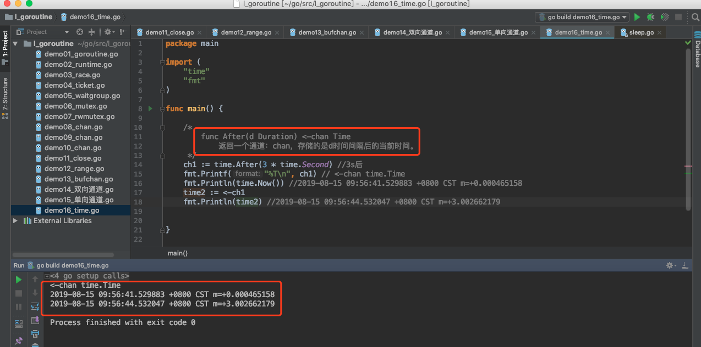

### CSP 模型

Go 语言的最大两个亮点就是 goroutine 和 channel。二者合体的典型应用 CSP（Communicating Sequential Process，通信顺序进程），是大家认可的并行开发神器。

CSP 是一种并发编程模型，用于描述两个独立的并发实体通过共享的通讯 channel 进行通信。相对于 Actor 模型，CSP 中 channel 是第一类对象，它不关注发送消息的实体，而关注于发送消息时使用的 channel。

Go 语言的 CSP 模型由协程 Goroutine 与通道 Channel 实现：

- **Go 协程 goroutine**：是一种轻量线程，不是操作系统的线程，而是将一个操作系统线程分段使用，通过调度器实现协作式调度。是一种绿色线程、微线程，能够在发现堵塞后启动新的微线程。
- **通道 channel**：类似 Unix 的 Pipe，用于协程之间通讯和同步。它是线程安全的，提供“先进先出”的特性，还能影响 goroutine 的阻塞和唤醒。

不要通过共享内存来通信，而要通过通信来实现内存共享——这就是 Go 的并发哲学，它依赖 CSP 模型，基于 channel 实现。

声明 channel 的语法如下：

```go
chan T      // 声明一个双向通道
chan<- T    // 声明一个只能用于发送的通道
<-chan T    // 声明一个只能用于接收的通道
```

Golang 的 channel 将 goroutine 隔离开，并发编程的时候可以将注意力放在 channel 上。有了 channel 和 goroutine 之后，Go 的并发编程变得异常容易和安全。

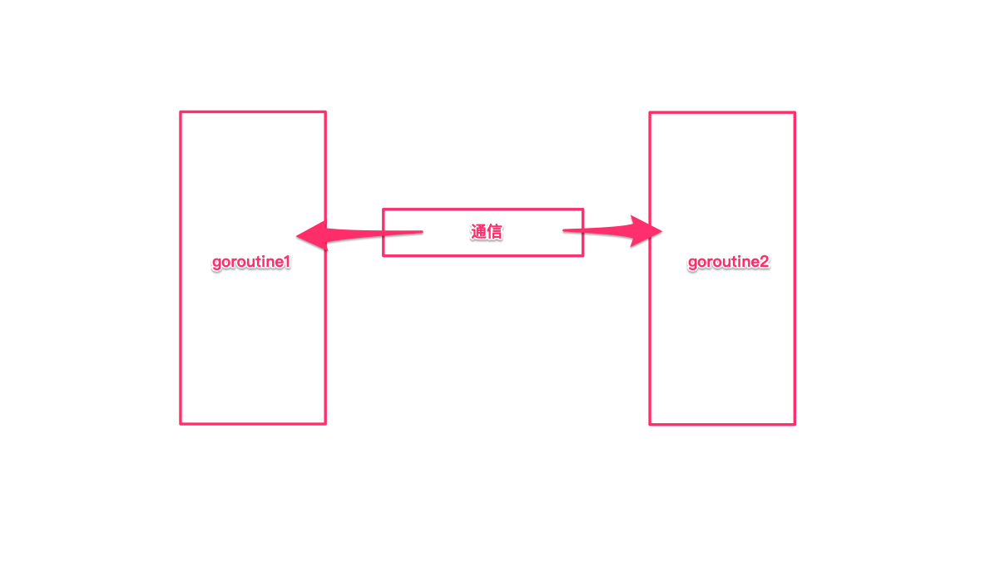
