# 概述与环境搭建

## Go语言概述

Go（又称 Golang）是 Google 于 2009 年发布的开源编程语言，由 Robert Griesemer、Rob Pike 和 Ken Thompson 三人设计。Ken Thompson 也是 B 语言和 C 语言的设计者、Unix 之父，这使 Go 从诞生之初就带有浓厚的系统编程基因。

Go 的设计哲学是 **"Less is more"**——追求简洁、高效、实用，而非堆砌语言特性。它的目标是在**开发效率**和**运行效率**之间取得平衡：像 Python 一样简洁、开发效率高，像 C 一样执行速度快，编译速度极快，且天生支持并发编程。

Go 语言诞生于互联网时代，专门针对多核处理器和网络编程做了优化。如今 Docker、Kubernetes、etcd、Prometheus 等云原生核心项目均由 Go 编写，Go 已成为**云计算时代的编程语言**。

## 设计初衷与痛点

Go 语言的诞生源于 Google 在大型项目开发中遇到的实际问题：

**Google 面临的现状：**

- 大量的 C++ 代码，同时又引入了 Java 和 Python
- 成千上万的工程师，数以万计行的代码
- 分布式的编译系统，数百万的服务器

**开发中的痛点：**

- 编译慢
- 失控的依赖
- 每个工程师只用了一个语言里的一部分特性
- 程序难以维护（可读性差、文档不清晰等）
- 更新的花费越来越长
- 交叉编译困难

**设计思路：**

Go 希望成为互联网时代的 C 语言。多数系统级语言（包括 Java 和 C#）的根本编程哲学来源于 C++，将 C++ 的面向对象进一步发扬光大。但是 Go 语言的设计者有不同的看法，他们认为值得学习的是 C 语言 —— C 语言经久不衰的根源是它足够简单，因此 Go 语言也应该是足够简单的。

Go 是由那些开发大型系统的人设计的，同时也是为了这些人服务的；它是为了解决工程上的问题，不是为了研究语言设计；它还是为了让编程变得更舒适和方便。

结合 Google 当时的现实情况 —— 很多工程师都是 C 系的，所以新设计的语言一定要易学习，最好是类似 C 的语言；同时 20 年没有出新的系统级语言了，所以新设计的语言必须是现代化的（例如内置 GC）。最后根据实战经验，他们向着目标设计了 Go。

**Go 语言的特色：**

- 没有继承多态的面向对象
- 强一致类型
- interface 不需要显式声明（Duck Typing）
- 没有异常处理（Error is value）
- 基于首字母的可访问特性
- 不用的 import 或者变量引起编译错误
- 完整而卓越的标准库包
- Go 内置 runtime（作用是性能监控、垃圾回收等）

## 核心特性

Go 语言之所以厉害，是因为它在服务端的开发中，总能抓住程序员的痛点，以最直接、简单、高效、稳定的方式来解决问题。

### 并发编程

Go 语言在并发编程方面比绝大多数语言要简洁不少，这一点是其最大亮点之一，也是其在未来进入高并发高性能场景的重要筹码。

不同于传统的多进程或多线程，Go 的并发执行单元是一种称为 **goroutine** 的协程。

由于在共享数据场景中会用到锁，再加上 GC，其并发性能有时不如异步复用 IO 模型，因此相对于大多数语言来说，golang 的并发编程**简单**比并发性能更具卖点。

在当今这个多核时代，并发编程的意义不言而喻。当然，很多语言都支持多线程、多进程编程，但遗憾的是，实现和控制起来并不是那么令人感觉轻松和愉悦。Go 不同的是，**语言级别**支持协程（goroutine）并发（协程又称微线程，比线程更轻量、开销更小、性能更高），操作起来非常简单，语言级别提供关键字 `go` 用于启动协程，并且在同一台机器上可以启动成千上万个协程。协程经常被理解为轻量级线程，一个线程可以包含多个协程，**共享堆不共享栈**。协程间一般由应用程序显式实现调度，上下文切换无需下到内核层，高效不少。

协程间通讯有两种方式：

1. **共享内存型**：使用全局变量 + mutex 锁来实现数据共享
2. **消息传递型**：使用一种独有的 **channel** 机制进行异步通讯

对比 Java 的多线程和 Go 的协程实现，明显更直接、简单。关键字 `go`，或许就是 Go 语言最重要的标志。**高并发是 Go 语言最大的亮点。**

### 内存回收（GC）

从 C 到 C++，这两种语言允许程序员自己管理内存（申请和释放）。因为没有垃圾回收机制所以 C/C++ 运行起来速度很快，但随之而来的是程序员对内存使用上的谨小慎微 —— 哪怕一点不小心就可能导致"内存泄露"使资源浪费，或者"野指针"使程序崩溃。尽管 C++11 引入了智能指针，但程序员仍然需要很小心的使用。

后来为了提高程序开发的速度以及程序的健壮性，Java 和 C# 等高级语言引入了 GC 机制，即程序员不需要再考虑内存的回收等，而是由语言特性提供垃圾回收器来回收内存。但是随之而来的可能是程序运行效率的降低。

**GC 过程是**：先 stop the world，扫描所有对象判活，把可回收对象在一段 bitmap 区中标记下来，接着立即 start the world，恢复服务，同时起一个专门 goroutine 回收内存到空闲 list 中以备复用，不物理释放。物理释放由专门线程定期来执行。

**GC 瓶颈**在于每次都要扫描所有对象来判活，待收集的对象数目越多，速度越慢。一个经验值是扫描 10 万个对象需要花费 1ms，所以尽量使用对象少的方案。比如在链表、map、slice、数组四种存储方式中进行选择，链表和 map 每个元素都是一个对象，而 slice 或数组是一个对象，因此 **slice 或数组有利于 GC**。

Go 1.5 之后对 GC 进行了重新设计，支持并发 GC，解决了 GC 时延（STW）问题。到 Go 1.8 时，GC 时延已从 Go 1.1 的数秒控制在 1ms 以内。

内存自动回收的好处：

- 再也不需要开发人员管理内存
- 开发人员专注业务实现，降低了心智负担
- 只需要 new 分配内存，不需要释放

### 内存分配

初始化阶段直接分配一块大内存区域，大内存被切分成各个大小等级的块，放入不同的空闲 list 中，对象分配空间时从空闲 list 中取出大小合适的内存块。内存回收时，会把不用的内存重放回空闲 list。空闲内存会按照一定策略合并，以减少碎片。

### 编译

编译涉及到两个问题：**编译速度**和**依赖管理**。

目前 Go 具有两种编译器，一种是建立在 GCC 基础上的 Gccgo，另外一种是分别针对 64 位 x64 和 32 位 x86 计算机的一套编译器（6g 和 8g）。

依赖管理方面，由于 Go 绝大多数第三方开源库都在 GitHub 上，在代码的 import 中加上对应的 GitHub 路径就可以使用了，库会默认下载到工程的 pkg 目录下。

另外，编译时会**默认检查代码中所有实体的使用情况**，凡是没使用到的 package 或变量，都会编译不通过。这是 Go 挺严谨的一面。

### 网络编程

由于 Go 诞生在互联网时代，因此它天生具备了去中心化、分布式等特性，具体表现之一就是提供了丰富便捷的网络编程接口：

- socket 用 `net.Dial`（基于 tcp/udp，封装了传统的 connect、listen、accept 等接口）
- HTTP 用 `http.Get()` / `http.Post()`
- RPC 用 `client.Call('class_name.method_name', args, &reply)`

Go 内置高性能 HTTP Server，不需要第三方框架即可构建生产级 Web 服务。

### 函数多返回值

在 C、C++ 中，包括其他一些高级语言是不支持多个函数返回值的。但是这项功能又确实是需要的，所以在 C 语言中一般通过将返回值定义成一个结构体，或者通过函数的参数引用的形式进行返回。而在 Go 语言中，支持函数多返回值是原生能力。

函数定义时可以在入参后面再加 `(a, b, c)`，表示将有 3 个返回值 a、b、c。这个特性在很多语言都有，比如 Python。

这个语法糖特性有现实意义，比如经常会要求接口返回一个三元组 `(errno, errmsg, data)`，在大多数只允许一个返回值的语言中，只能将三元组放入一个 map 或数组中返回，接收方还要写代码来检查返回值中包含了三元组。如果允许多返回值，则直接在函数定义层面上就做了强制，使代码更简洁安全。

### 语言交互性（Cgo）

语言交互性指的是本语言是否能和其他语言交互，比如可以调用其他语言编译的库。

在 Go 语言中直接重用了大部分的 C 模块，这里称为 **Cgo**。Cgo 允许开发者混合编写 C 语言代码，然后 Cgo 工具可以将这些混合的 C 代码提取并生成对于 C 功能的调用包装代码。开发者基本上可以完全忽略这个 Go 语言和 C 语言的边界是如何跨越的。

Go 可以和 C 程序交互，但不能和 C++ 交互。可以有两种替代方案：

1. 先将 C++ 编译成动态库，再由 Go 调用一段 C 代码，C 代码通过 dlfcn 库动态调用动态库（记得 `export LD_LIBRARY_PATH`）
2. 使用 swig

### 异常处理

Go 不支持 `try...catch` 这样的结构化的异常解决方式，因为觉得会增加代码量，且会被滥用，不管多小的异常都抛出。

Go 提倡的异常处理方式是：

- **普通异常**：被调用方返回 error 对象，调用方判断 error 对象
- **严重异常**：指的是中断性 panic（比如除 0），使用 `defer...recover...panic` 机制来捕获处理。严重异常一般由 Go 内部自动抛出，不需要用户主动抛出，避免传统 try...catch 写得到处都是的情况。当然，用户也可以使用 `panic('xxxx')` 主动抛出，只是这样就使这一套机制退化成结构化异常机制了

### 其他重要特性

**类型推导**：支持 `var abc = 10` 这样的语法，让 Go 看上去有点像动态类型语言，但 Go 实际上是强类型的，前面的定义会被自动推导出是 int 类型。

> 作为强类型语言，隐式的类型转换是不被允许的，记住一条原则：让所有的东西都是显式的。简单来说，Go 是一门写起来像动态语言，有着动态语言开发效率的静态语言。

**接口隐式实现**：一个类型只要实现了某个 interface 的所有方法，即可实现该 interface，无需显式去继承。

> Go 编程规范推荐每个 Interface 只提供一到两个的方法。这样使得每个接口的目的非常清晰。另外 Go 的隐式推导也使得组织程序架构的时候更加灵活。在写 Java / C++ 程序的时候，一开始就需要把父类 / 子类 / 接口设计好，因为一旦后面有变更，修改起来会非常痛苦。而 Go 不一样，当在实现的过程中发现某些方法可以抽象成接口的时候，直接定义好这个接口就可以了，其他代码不需要做任何修改，编译器的自动推导会帮你做好一切。

**不能循环引用**：即如果 `a.go` 中 import 了 b，则 `b.go` 要是 import a 会报 `import cycle not allowed`。好处是可以避免一些潜在的编程危险，比如 a 中的 `func1()` 调用了 b 中的 `func2()`，如果 `func2()` 也能调用 `func1()`，将会导致无限循环调用下去。

**defer 机制**：在 Go 语言中，提供关键字 `defer`，可以通过该关键字指定需要延迟执行的逻辑体，即在函数体 return 前或出现 panic 时执行。这种机制非常适合善后逻辑处理，比如可以尽早避免可能出现的资源泄漏问题。可以说，defer 是继 goroutine 和 channel 之后的另一个非常重要、实用的语言特性，对引入 defer，在很大程度上可以简化编程，并且在语言描述上显得更为自然，极大的增强了代码的可读性。

**"包"的概念**：和 Python 一样，把相同功能的代码放到一个目录，称之为包。包可以被其他包引用。main 包是用来生成可执行文件，每个程序只有一个 main 包。包的主要用途是提高代码的可复用性。通过 package 可以引入其他包。

**编程规范的强制集成**：Go 语言的编程规范强制集成在语言中，比如明确规定花括号摆放位置，强制要求一行一句，不允许导入没有使用的包，不允许定义没有使用的变量，提供 `gofmt` 工具强制格式化代码等等。Go 的设计者们认为，与其将规范写在文档里，还不如强制集成在语言里，这样更直接，更有利于团队协作和工程管理。

**交叉编译**：比如说你可以在运行 Linux 系统的计算机上开发运行 Windows 下运行的应用程序。这是第一门完全支持 UTF-8 的编程语言，这不仅体现在它可以处理使用 UTF-8 编码的字符串，就连它的源码文件格式都是使用的 UTF-8 编码。Go 语言做到了真正的国际化。

### Go 语言设计之初的功能清单

Go 的设计者们当初在白板上列出的语言功能目标：

- 规范的语法（不需要符号表来解析）
- 垃圾回收（独有）
- 无头文件
- 明确的依赖
- 无循环依赖
- 常量只能是数字
- int 和 int32 是两种类型
- 字母大小写设置可见性（letter case sets visibility）
- 任何类型（type）都有方法（不是类型）
- 没有子类型继承（不是子类）
- 包级别初始化以及明确的初始化顺序
- 文件被编译到一个包里
- 没有数值类型转换（常量起辅助作用）
- 接口隐式实现（没有"implement"声明）
- 嵌入（不会提升到超类）
- 方法按照函数声明（没有特别的位置要求）
- 方法即函数
- 接口只有方法（没有数据）
- 方法通过名字匹配（而非类型）
- 没有构造函数和析构函数
- postincrement（如 `++i`）是状态，不是表达式
- 没有 preincrement（`i++`）和 predecrement
- 赋值不是表达式
- 明确赋值和函数调用中的计算顺序（没有"sequence point"）
- 没有指针运算
- 内存一直以零值初始化
- 局部变量取值合法
- 方法中没有"this"
- 分段的堆栈
- 没有静态和其它类型的注释
- 没有模板
- 内建 string、slice 和 map
- 数组边界检查

## Go 语言的优势

### 1. 学习曲线容易

Go 语言语法简单，包含了类 C 语法。因为 Go 语言容易学习，所以一个普通的大学生花几个星期就能写出来可以上手的、高性能的应用。Go 语言的语法特性简单到几乎玩不出什么花招，直来直去的，学习曲线很低，上手非常快。

### 2. 效率：快速的编译时间，开发效率和运行效率高

开发过程中相较于 Java 和 C++ 呆滞的编译速度，Go 的快速编译时间是一个主要的效率优势。Go 拥有**接近 C 的运行效率**和**接近 PHP 的开发效率**。

C 语言的理念是信任程序员，保持语言的小巧，不屏蔽底层且底层友好，关注语言的执行效率和性能。而 Python 的姿态是用尽量少的代码完成尽量多的事。Go 语言把 C 和 Python 统一了起来。

### 3. 出身名门、血统纯正

Go 语言的创造者包括 Ken Thompson（B 语言和 C 语言的设计者、Unix 之父、1983 年图灵奖得主）、Rob Pike（Unix 核心成员、UTF-8 共同发明人）和 Robert Griesemer（Java HotSpot 虚拟机和 JS V8 引擎的开发者）。Go 语言出自 Google 公司，从发展态势来看，Google 对它很看重，Go 自然有一个良好的发展前途。

### 4. 自由高效：组合的思想、无侵入式的接口

Go 语言可以说是开发效率和运行效率二者的完美融合，天生的并发编程支持。Go 语言支持当前**所有的编程范式**，包括过程式编程、面向对象编程、面向接口编程、函数式编程。程序员们可以各取所需、自由组合。

### 5. 强大的标准库

包括互联网应用、系统编程和网络编程。Go 里面的标准库基本上已经是非常稳定了，特别是网络层、系统层的库非常实用。**Go 语言的 lib 库麻雀虽小五脏俱全**，基本上有绝大多数常用的库。

### 6. 部署方便：二进制文件，Copy 部署

这一点是很多人选择 Go 的最大理由，因为部署太方便了，所以现在也有很多人用 Go 开发运维程序。编译产物是单个二进制文件，复制即可运行，无运行时依赖。

### 7. 简单的并发

**并行和异步编程几乎无痛点。**Go 语言的 Goroutine 和 Channel 这两个神器简直就是并发和异步编程的巨大福音。像 C、C++、Java、Python 和 JavaScript 这些语言的并发和异步方式控制就比较复杂了，而且容易出错，而 Go 解决这个问题非常地优雅和流畅。Go 是为大数据、微服务、并发而生的一种编程语言。

- Go 作为一门语言致力于使事情简单化。它并未引入很多新概念，而是聚焦于打造一门简单的语言，它使用起来异常快速并且简单。其唯一的创新之处是 goroutines 和通道。Goroutines 是 Go 面向线程的轻量级方法，而通道是 goroutines 之间通信的优先方式。
- 创建 Goroutines 的成本很低，只需几千个字节的额外内存，正由于此，才使得同时运行数百个甚至数千个 goroutines 成为可能。相较于 Python/Java，在一个 goroutine 上运行一个函数需要最小的代码。

### 8. 稳定性

Go 拥有强大的编译检查、严格的编码规范和完整的软件生命周期工具，具有很强的稳定性，稳定压倒一切。Go 提供了软件生命周期（开发、测试、部署、维护等等）各个环节的工具，如 `go tool`、`gofmt`、`go test`。

## Go 与其他语言的对比

Go 的很多语言特性借鉴于它的三个祖先：C、Pascal 和 CSP。Go 的语法、数据类型、控制流等继承于 C，Go 的包、面向对象等思想来源于 Pascal 分支，而 Go 最大的语言特色 —— 基于管道通信的协程并发模型，则借鉴于 CSP 分支。

| 语言 | 特点 |
|------|------|
| **Java** | 编译语言，速度适中，稳定性好，开源性好，具有自己的一套编写规范，开发效率适中，目前最主流的语言 |
| **C/C++** | 现存编程语言中的老祖，执行速度最快无人能及，但是写起来最为复杂，开发难度大 |
| **C#** | 执行速度快，学习难度适中，开发速度适中，但存在一些缺点 |
| **Python** | 脚本语言，代码简洁、学习进度短，开发速度快，但在大型项目上不太稳定 |
| **JavaScript** | 前端处理能力是其它语言无法比拟，发展中的 JS 后端处理能力也卓越不凡 |
| **Scala** | 编译语言，比 Python 快十倍，和 Java 差不多，但是学习进度慢，对语言不够精通容易造成性能严重下降 |
| **Go** | 高并发能力无人能及，既具有像 Python 一样的简洁代码、开发速度，又具有 C 语言一样的执行效率 |

### Go vs Python vs Erlang

因为 Go 的语法和 Erlang、Python 类似，下面将这三门语言做个详细对比。

相比于 Python 的 40 个特性，Go 只有 31 个，可以说 Go 在语言设计上是相当克制的。比如，它没有隐式的数值转换，没有构造函数和析构函数，没有运算符重载，没有默认参数，也没有继承，没有泛型（注：Go 1.18 已引入泛型），没有异常，没有宏，没有函数修饰，更没有线程局部存储。

但是 Go 的特点也很鲜明，比如，它拥有协程、自动垃圾回收、包管理系统、一等公民的函数、栈空间管理等。

Go 作为静态类型语言，保证了 Go 在运行效率、内存用量、类型安全都要强于 Python 和 Erlang。

Go 的数据类型也更加丰富，除了支持表、字典等复杂的数据结构，还支持**指针**和**接口类型**，这是 Python 和 Erlang 所没有的。特别是接口类型特别强大，它提供了管理类型系统的手段。而指针类型提供了管理内存的手段，这让 Go 进入底层软件开发提供了强有力的支持。

Go 在面对对象的特性支持上做了很多反思和取舍，它没有类、虚函数、继承、泛型等特性。Go 语言中面向对象编程的核心是**组合和方法（function）**。组合很类似于 C 语言的 struct 结构体的组合方式，方法类似于 Java 的接口（Interface），但是使用方法上与对象更加解耦，减少了对对象内部的侵入。Erlang 则不支持面对对象编程范式，相比而言，Python 对面对对象范式的支持最为全面。

在函数式编程的特性支持上，Erlang 作为函数式语言，支持最为全面。但是基本的函数式语言特性，如 lambda、高阶函数、curry 等，三种语言都支持。

控制流的特性支持上，三种语言都差不多。Erlang 支持尾递归优化，这给它在函数式编程上带来便利。而 Go 通过动态扩展协程栈的方式来支持深度递归调用。Python 则在深度递归调用上经常被爆栈。

Go 和 Erlang 的并发模型都来源于 CSP，但是 Erlang 是基于 actor 和消息传递（mailbox）的并发实现，Go 是基于 goroutine 和管道（channel）的并发实现。不管 Erlang 的 actor 还是 Go 的 goroutine，都满足协程的特点：由编程语言实现和调度，切换在用户态完成，创建销毁开销很小。至于 Python，其多线程的切换和调度是基于操作系统实现，而且因为 GIL 的大坑级存在，无法真正做到并行。

从并发编程体验上看，Erlang 的函数式编程语法风格和其 OTP behavior 框架提供的晦涩的回调（callback）使用方法，对大部分 C/C++ 和 Java 出身的程序员来说，有一定的入门门槛。而被称为"互联网时代的 C"的 Go，其类 C 的语法和控制流，以及面对对象的编程范式，编程体验则好很多。

## 环境搭建

### 下载 Go

- 官网：[https://golang.org/](https://golang.org/)
- 国内镜像：[https://golang.google.cn/](https://golang.google.cn/)
- 中文网：[https://www.studygolang.com/dl](https://www.studygolang.com/dl)

推荐下载最新稳定版。安装包分为安装版（`pkg`/`msi`）和压缩版（`tar.gz`/`zip`），安装版会自动配置环境变量，更适合新手。


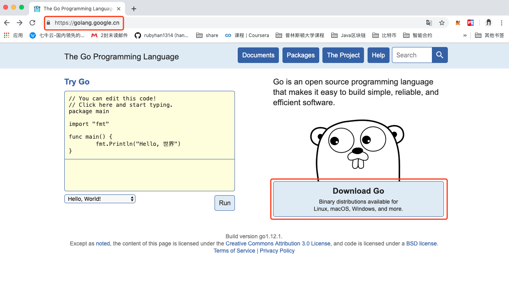

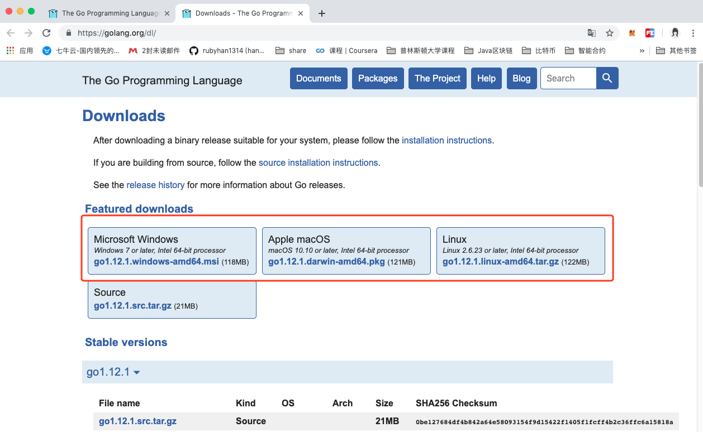

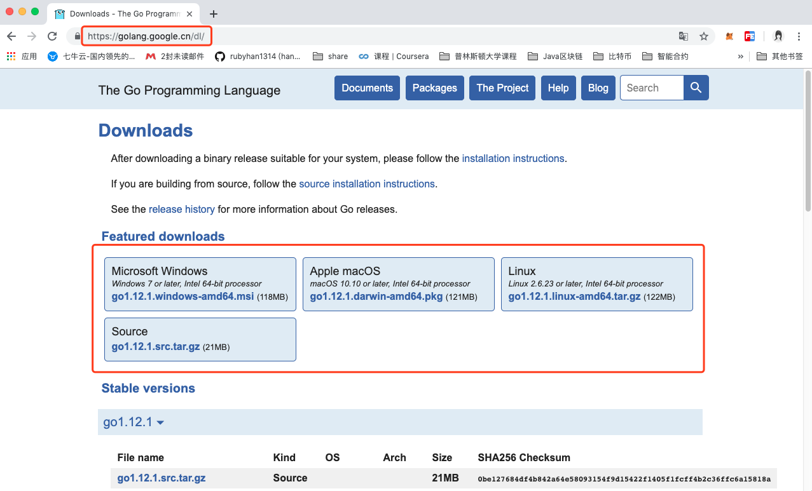

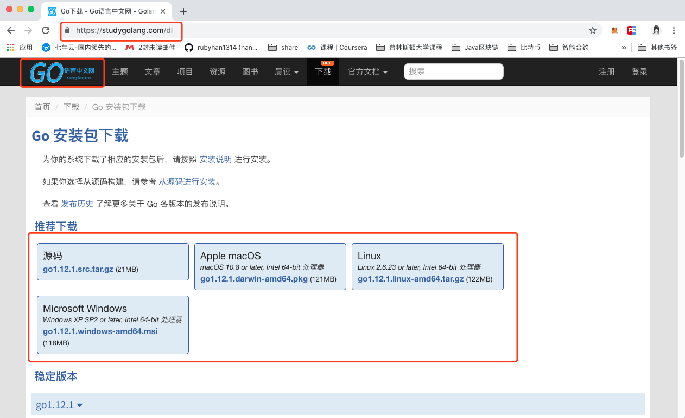

### macOS 安装

下载 `pkg` 安装包，双击按指引安装即可，Go 默认安装到 `/usr/local/go`。

配置环境变量，编辑 `~/.bash_profile` 或 `~/.zshrc`：

```bash
export GOROOT=/usr/local/go
export GOPATH=$HOME/go
export GOBIN=$GOROOT/bin
export PATH=$PATH:$GOBIN:$GOPATH/bin
```

执行 `source ~/.zshrc` 使其生效。

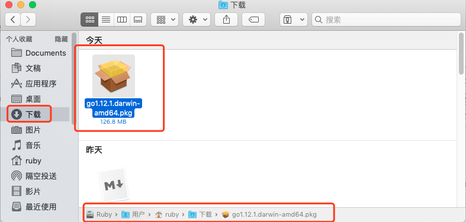

### Linux 安装

以 Ubuntu 为例，下载压缩包并解压：

```bash
sudo tar -xzf go1.XX.X.linux-amd64.tar.gz -C /usr/local
```

编辑 `~/.profile` 添加环境变量：

```bash
export GOROOT=/usr/local/go
export GOPATH=$HOME/go
export GOBIN=$GOROOT/bin
export PATH=$PATH:$GOBIN:$GOPATH/bin
```

执行 `source ~/.profile` 使其生效。

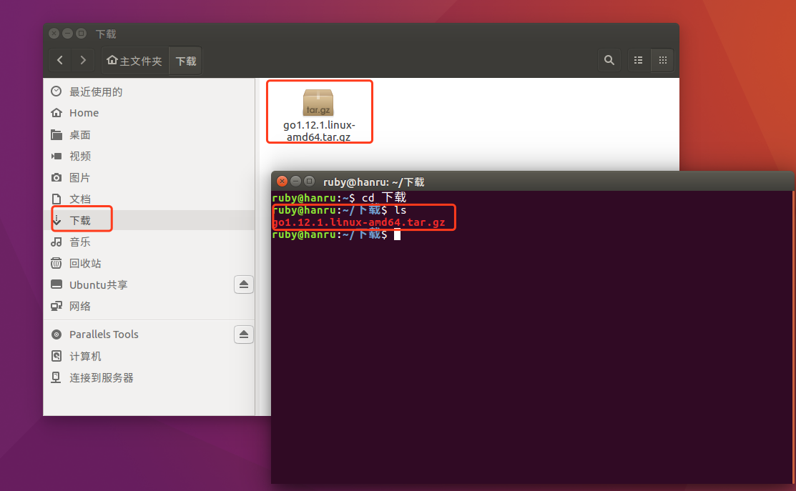

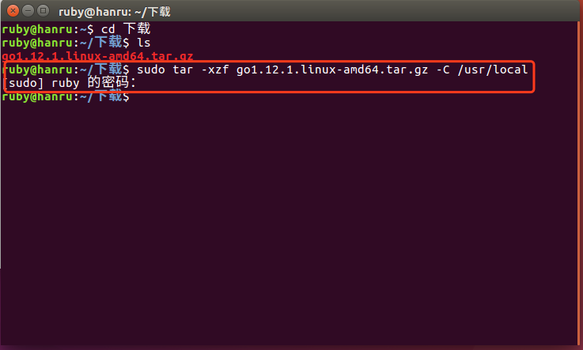

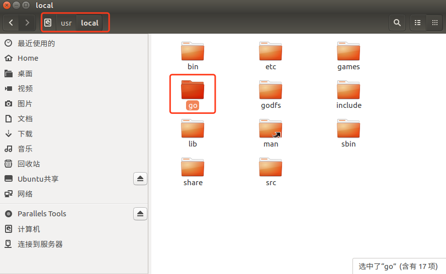

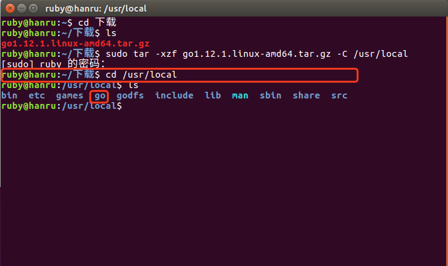

### Windows 安装

下载 `msi` 安装包，按指引安装即可，安装程序会自动配置环境变量。若需手动配置，在"系统变量"中添加：

- `GOROOT`：Go 安装路径（如 `C:\Go`）
- `GOPATH`：Go 工作目录（如 `D:\go`）
- 在 `Path` 中添加 `%GOROOT%\bin` 和 `%GOPATH%\bin`

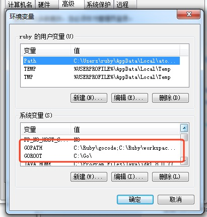

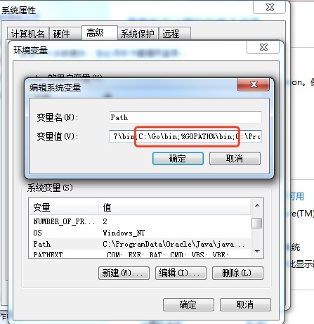

### 验证安装

```bash
go version  # 查看版本，例如 go version go1.12.1 darwin/amd64
go env      # 查看所有环境配置
```

## GOPATH 工作空间

GOPATH 是 Go 项目代码的工作目录，包含三个子目录：

| 目录 | 说明 |
|------|------|
| `src` | 源代码，每个子目录是一个包 |
| `pkg` | 编译后生成的归档文件（`.a`） |
| `bin` | 编译生成的可执行文件 |

典型的项目结构：

```
$GOPATH/
├── src/
│   └── github.com/
│       └── username/
│           └── myproject/
│               ├── main.go
│               └── utils/
│                   └── helper.go
├── pkg/
└── bin/
```

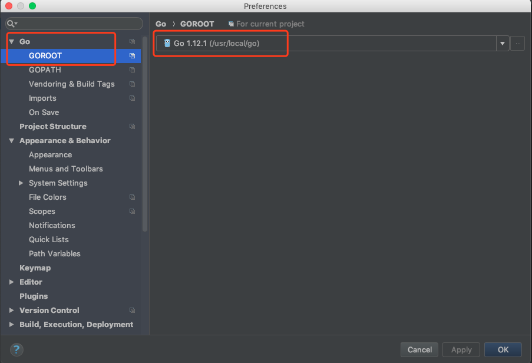

## 第一个程序：Hello World

创建 `$GOPATH/src/hello/main.go`：

```go
// package 声明，main 包是可执行程序的入口
package main

// 导入 fmt 包，用于格式化输出
import "fmt"

// main 函数，程序的入口
func main() {
    fmt.Println("Hello, World!")
}
```

### 运行方式

**方式一：go run**

```bash
go run main.go
```

适用于快速运行调试，不会在当前目录生成可执行文件。

**方式二：go build && 执行**

```bash
go build          # 编译，生成与目录同名的可执行文件
./hello           # 执行
```

**方式三：go install**

```bash
go install        # 编译并安装到 $GOPATH/bin
$GOPATH/bin/hello # 执行
```

### 代码解析

| 元素 | 说明 |
|------|------|
| `package main` | 声明包名，`main` 包是可执行程序的入口包 |
| `import "fmt"` | 导入标准库 `fmt` 包 |
| `func main()` | 程序入口函数，无参数无返回值 |
| `fmt.Println()` | 调用 `fmt` 包的 `Println` 函数输出一行文本 |

### import 的几种特殊写法

**点操作**：调用包的函数时可以省略前缀包名

```go
import (
    . "fmt"
)
// 可以直接写成 Println("hello world")
```

**别名操作**：给包起一个别名

```go
import (
    f "fmt"
)
// 调用：f.Println("hello world")
```

**下划线操作**：引入该包但不直接使用包里的函数，而是调用该包的 `init()` 函数

```go
import (
    "database/sql"
    _ "github.com/ziutek/mymysql/godrv"
)
```

## Go 的源码文件分类

Go 的源码文件分为三类：

### 1. 命令源码文件

声明自己属于 main 代码包、包含无参数声明和结果声明的 main 函数。

命令源码文件被安装以后，GOPATH 如果只有一个工作区，那么相应的可执行文件会被存放当前工作区的 bin 文件夹下；如果有多个工作区，就会安装到 GOBIN 指向的目录下。

命令源码文件是 Go 程序的入口。

**注意**：同一个代码包中不要放多个命令源码文件。多个命令源码文件虽然可以分开单独 `go run` 运行起来，但是**无法通过 `go build` 和 `go install`**（会报 `main redeclared in this block` 错误）。同理，命令源码文件和库源码文件放在一起也会出现这样的问题，库源码文件不能通过 `go build` 和 `go install` 这种常规的方法编译和安装。所以命令源码文件应该是被**单独放在一个代码包中**。

### 2. 库源码文件

库源码文件就是不具备命令源码文件上述两个特征的源码文件，存在于某个代码包中的普通的源码文件。

库源码文件被安装后，相应的归档文件（`.a` 文件）会被存放到当前工作区的 pkg 的平台相关目录下。

### 3. 测试源码文件

名称以 `_test.go` 为后缀的代码文件，并且必须包含 Test 或者 Benchmark 名称前缀的函数：

```go
func TestXXX(t *testing.T) {
    // 功能测试函数
}
```

名称以 Test 为名称前缀的函数，只能接受 `*testing.T` 的参数，这种测试函数是**功能测试函数**。

```go
func BenchmarkXXX(b *testing.B) {
    // 性能测试函数
}
```

名称以 Benchmark 为名称前缀的函数，只能接受 `*testing.B` 的参数，这种测试函数是**性能测试函数**。

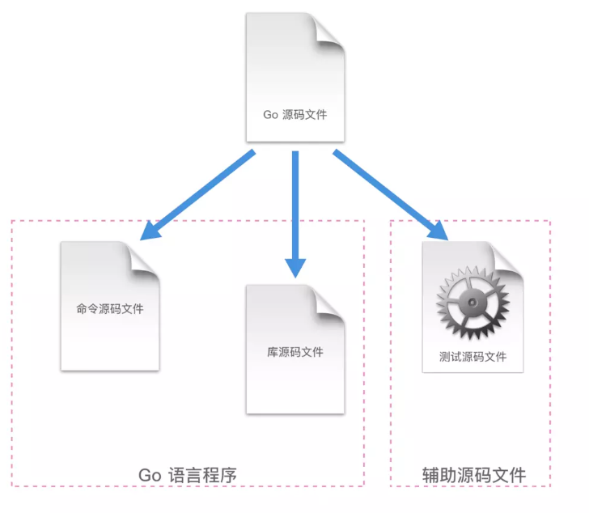

## Go 命令详解

在终端输入 `go help` 即可看到 Go 的所有命令：

```
bug         start a bug report
build       compile packages and dependencies
clean       remove object files and cached files
doc         show documentation for package or symbol
env         print Go environment information
fix         update packages to use new APIs
fmt         gofmt (reformat) package sources
generate    generate Go files by processing source
get         download and install packages and dependencies
install     compile and install packages and dependencies
list        list packages or modules
mod         module maintenance
run         compile and run Go program
test        test packages
tool        run specified go tool
version     print Go version
vet         report likely mistakes in packages
```

其中和编译相关的有 `build`、`get`、`install`、`run` 这 4 个。先罗列通用命令标记：

| 名称 | 说明 |
|------|------|
| `-a` | 强制重新编译所有涉及的 Go 语言代码包（包括标准库中的代码包），即使它们已经是最新的了 |
| `-n` | 仅打印执行过程中用到的所有命令，而不真正执行它们 |
| `-race` | 检测并报告指定 Go 语言程序中存在的数据竞争问题 |
| `-v` | 打印命令执行过程中涉及的代码包 |
| `-work` | 打印命令执行时生成和使用的临时工作目录的名字，且命令执行完成后不删除它 |
| `-x` | 打印执行过程中用到的所有命令，并同时执行它们 |

### go run

专门用来运行命令源码文件的命令，**注意，这个命令不是用来运行所有 Go 的源码文件的！**

`go run` 命令只能接受一个命令源码文件以及若干个库源码文件（必须同属于 main 包）作为文件参数，且**不能接受测试源码文件**。它在执行时会检查源码文件的类型。如果参数中有多个或者没有命令源码文件，那么 `go run` 命令就只会打印错误提示信息并退出，而不会继续执行。

**执行过程分析**（通过 `go run -n` 查看）：

```
mkdir -p $WORK/b001/              # 创建临时目录
# 编译：compile → 生成 _pkg_.a
# 链接：link → 生成可执行文件
$WORK/b001/exe/mytest             # 执行可执行文件
```

流程总结：**先 compile → 再 link → 最后执行**

最后用 `go run -work` 可以看到生成的临时文件目录，`go run` 命令最终生成了 2 个文件，一个是归档文件（`.a`），一个是可执行文件。

`go run` 命令在第二次执行的时候，如果发现导入的代码包没有发生变化，那么 `go run` **不会再次编译**这个导入的代码包，直接静态链接进来。

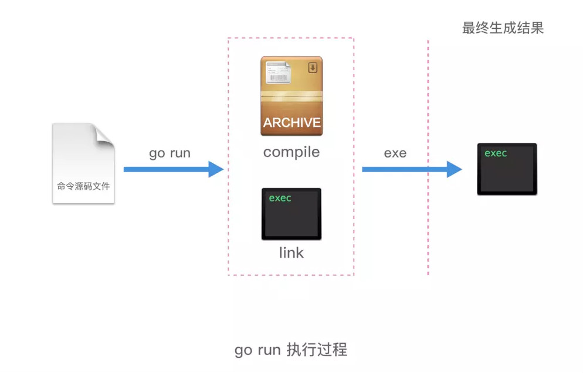

### go build

`go build` 命令主要是用于测试编译。在包的编译过程中，若有必要，会同时编译与之相关联的包。

行为规则：

1. 如果是**普通包**，执行 `go build` 命令后，**不会产生任何文件**
2. 如果是 **main 包**，执行 `go build` 命令后，会在当前目录下生成一个可执行文件。如果需要在 `$GOPATH/bin` 目录下生成相应的文件，需要执行 `go install` 或者使用 `go build -o 路径/可执行文件`
3. 如果某个文件夹下有多个文件，只想编译其中某一个文件，可以在 `go build` 之后加上文件名，例如 `go build a.go`；`go build` 命令默认会编译当前目录下的所有 go 文件
4. 可以指定编译输出的文件名，例如 `go build -o 可执行文件名`，默认情况是 package 名（非 main 包），或者是第一个源文件的文件名（main 包）
5. `go build` 会忽略目录下以 `_` 或者 `.` 开头的 go 文件
6. 如果源代码针对不同的操作系统需要不同的处理，可以根据不同的操作系统后缀来命名文件

**注意**：如果用来编译非命令源码文件，即库源码文件，`go build` 执行完是**不会产生任何结果的**。这种情况下，`go build` 命令只是检查库源码文件的有效性，只会做检查性的编译，而不会输出任何结果文件。

`go build` 编译命令源码文件，则会在该命令的执行目录中生成一个可执行文件。当代码包中有且仅有一个命令源码文件的时候，在文件夹所在目录中执行 `go build` 命令，会在该目录下生成一个**与目录同名的可执行文件**。

`go build` 后面不追加目录路径的话，它就把当前目录作为代码包并进行编译。`go build` 命令后面如果跟了代码包导入路径作为参数，那么该代码包及其依赖都会被编译。

**执行过程分析**（通过 `go build -n` 查看）：

流程和 `go run` 大体相同，唯一不同的就是在最后一步，`go run` 是执行了可执行文件，但是 `go build` 命令，只是把库源码文件编译了一遍，然后把可执行文件移动到了当前目录的文件夹中。

整个源码编译的执行流程：**源码 → compile（生成 .a） → link（生成可执行文件） → 输出可执行文件**

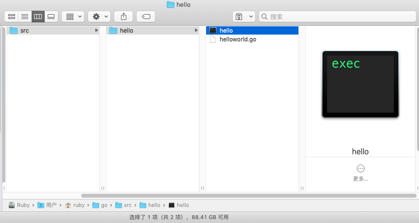

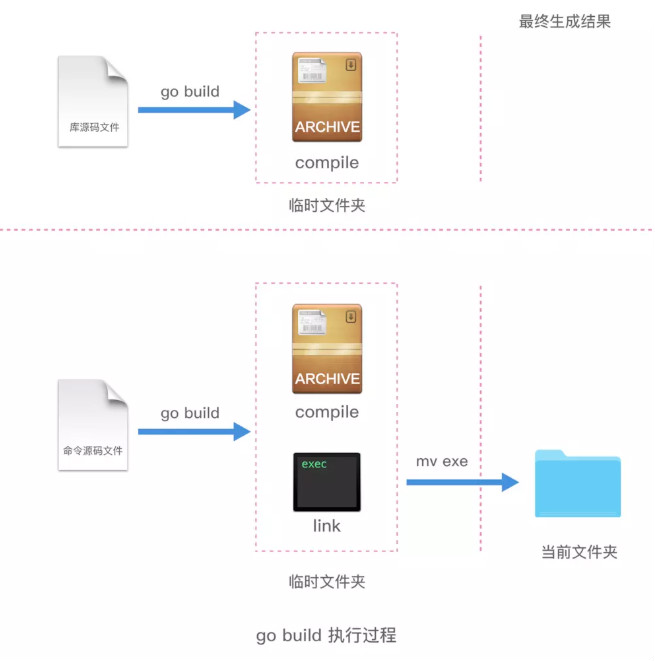

### go install

`go install` 命令是用来编译并安装代码包或者源码文件的。

`go install` 命令在内部实际上分成了两步操作：第一步是生成结果文件（可执行文件或者 `.a` 包），第二步会把编译好的结果移到 `$GOPATH/pkg` 或者 `$GOPATH/bin`。

- **可执行文件**：一般是 `go install` 带 main 函数的 go 文件产生的，有函数入口，可以直接运行
- **.a 应用包**：一般是 `go install` 不包含 main 函数的 go 文件产生的，没有函数入口，只能被调用

`go install` 用于编译并安装指定的代码包及它们的依赖包。当指定的代码包的依赖包还没有被编译和安装时，该命令会先去处理依赖包。与 `go build` 命令一样，传给 `go install` 命令的代码包参数应该以导入路径的形式提供。实际上，`go install` 命令只比 `go build` 命令多做了一件事，即：**安装编译后的结果文件到指定目录**。

- 安装代码包会在当前工作区的 pkg 的平台相关目录下生成归档文件（即 `.a` 文件）
- 安装命令源码文件会在当前工作区的 bin 目录（如果 GOPATH 下有多个工作区，就会放在 GOBIN 目录下）生成可执行文件

同样，`go install` 命令如果后面不追加任何参数，它会把当前目录作为代码包并安装。这和 `go build` 命令是完全一样的。

`go install` 命令后面如果跟了代码包导入路径作为参数，那么该代码包及其依赖都会被安装。

`go install` 命令后面如果跟了命令源码文件以及相关库源码文件作为参数的话，只有这些文件会被编译并安装。

**注意**：在安装多个库源码文件时可能遇到报错 `go install: no install location for .go files listed on command line (GOBIN not set)`。这是因为，只有在安装命令源码文件的时候，命令程序才会将环境变量 GOBIN 的值作为结果文件的存放目录。而在安装库源码文件时，命令程序内部的代表结果文件存放目录路径的那个变量不会被赋值。所以结论是：只能使用**安装代码包的方式**来安装库源码文件，而不能在 `go install` 命令罗列并安装它们。另外，`go install` 命令目前无法接受标记 `-o` 以自定义结果文件的存放位置，这也从侧面说明了 `go install` 命令不支持针对库源码文件的安装操作。

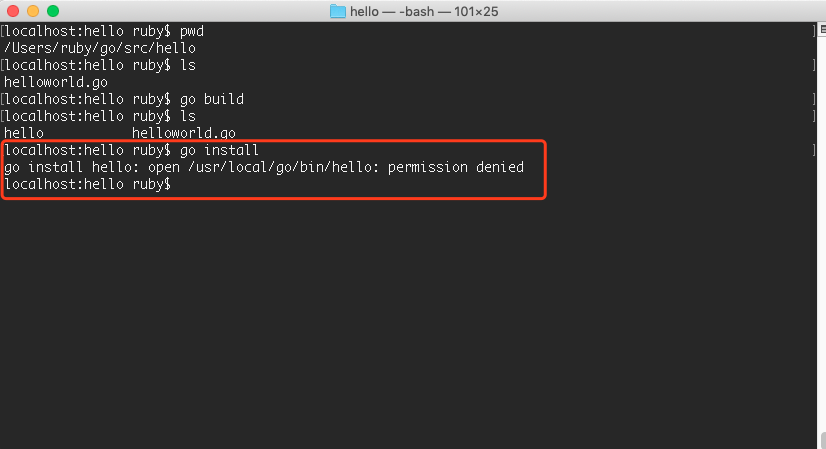

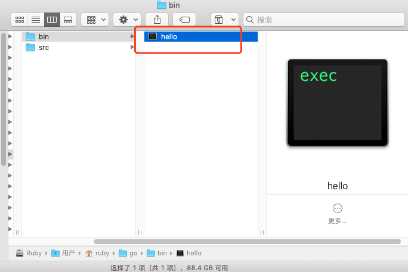

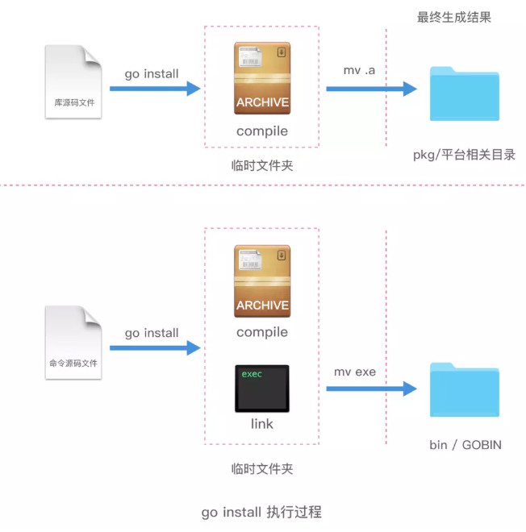

### go get

`go get` 命令用于从远程代码仓库（比如 GitHub）上下载并安装代码包。**`go get` 命令会把当前的代码包下载到 `$GOPATH` 中的第一个工作区的 src 目录中，并安装。**

如果在 `go get` 下载过程中加入 `-d` 标记，那么下载操作只会执行下载动作，而不执行安装动作。

还有一个很有用的标记是 `-u` 标记，加上它可以利用网络来**更新**已有的代码包及其依赖包。如果已经下载过一个代码包，但是这个代码包又有更新了，可以直接用 `-u` 标记来更新本地的对应的代码包。如果不加这个 `-u` 标记，执行 `go get` 一个已有的代码包，会发现命令什么都不执行。只有加了 `-u` 标记，命令会去执行 `git pull` 拉取最新的代码包版本，下载并安装。

命令 `go get` 还有一个很值得称道的功能 —— **智能下载**。在使用它检出或更新代码包之后，它会寻找与本地已安装 Go 语言的版本号相对应的标签（tag）或分支（branch）。比如，本机安装 Go 语言的版本是 1.x，那么 `go get` 命令会在该代码包的远程仓库中寻找名为 "go1" 的标签或者分支。如果找到指定的标签或者分支，则将本地代码包的版本切换到此标签或者分支。如果没有找到，则将本地代码包的版本切换到主干的最新版本。

**go get 常用标记：**

| 标记名称 | 标记描述 |
|----------|----------|
| `-d` | 让命令程序只执行下载动作，而不执行安装动作 |
| `-f` | 仅在使用 `-u` 标记时才有效。让命令程序忽略掉对已下载代码包的导入路径的检查 |
| `-fix` | 让命令程序在下载代码包后先执行修正动作，而后再进行编译和安装 |
| `-insecure` | 允许命令程序使用非安全的 scheme（如 HTTP）去下载指定的代码包 |
| `-t` | 让命令程序同时下载并安装指定的代码包中的测试源码文件中依赖的代码包 |
| `-u` | 让命令利用网络来更新已有代码包及其依赖包 |

执行 `go get` 的流程：调用 `git clone` 下载源码 → 编译 → 把库源码文件编译成归档文件安装到 pkg 对应的平台目录下。

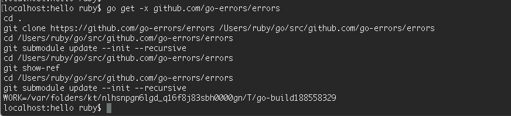


### 其他常用命令

**go clean**：移除当前源码包里面编译生成的文件，包括 `_obj/`、`_test/`、`_testmain.go`、`test.out`、`build.out` 以及 `go build` 和 `go test -c` 产生的文件。

**go fmt**：格式化代码文件。使用 `gofmt` 命令更多时候是用 `gofmt -w src`，可以格式化整个项目。开发工具的保存时自动格式化功能，底层其实就是调用了 `go fmt`。

**go test**：自动读取源码目录下面名为 `*_test.go` 的文件，生成并运行测试用的可执行文件。默认情况下不需要任何参数，会自动把源码包下面所有 test 文件测试完毕。

**go doc**：强大的文档工具。例如 `go doc builtin` 查看 builtin 包，`go doc net/http` 查看 http 包，`go doc fmt Printf` 查看指定函数，`go doc -src fmt Printf` 查看对应的源代码。

还可以通过 `godoc -http=:端口号`（如 `godoc -http=:9527`）在本地启动一个 golang.org 的本地 copy 版本，通过浏览器查询 pkg 文档等其它内容。如果设置了 GOPATH，在 pkg 分类下，不但会列出标准包的文档，还会列出本地 GOPATH 中所有项目的相关文档。

**其他命令**：
- `go fix`：修复以前老版本的代码到新版本
- `go version`：查看 Go 当前的版本
- `go env`：查看当前 Go 的环境变量
- `go list`：列出当前全部安装的 package

## 开发工具

### GoLand

JetBrains 出品的 Go 语言 IDE，功能强大，支持代码补全、重构、调试、Git 集成。下载地址：[https://www.jetbrains.com/go](https://www.jetbrains.com/go)。创建项目后需配置 GOROOT 和 GOPATH。

### VS Code

安装 Go 扩展后，配合 `gopls` 语言服务器即可获得良好的开发体验。

### 其他选择

Sublime Text、Atom、Vim/Neovim 等编辑器配合相应的 Go 插件也可使用。

## 编码规范

Go 官方通过工具和编译器强制推行编码规范，这是 Go 语言的重要设计理念之一 —— **与其写在文档里，不如集成在语言和工具链中**。

### 命名规范

| 元素 | 规范 | 示例 |
|------|------|------|
| 包名 | 小写单词，与目录一致 | `package utils` |
| 文件名 | 小写单词，下划线分隔 | `user_service.go` |
| 结构体/接口 | 驼峰命名，首字母大写表示导出 | `type User struct{}` |
| 变量 | 驼峰命名，首字母大小写决定可见性 | `userName`（包内）/ `UserName`（导出） |
| 常量 | 全大写，下划线分隔 | `const MAX_SIZE = 100` |
| 接口 | 单方法接口以 `er` 结尾 | `type Reader interface{}` |

**可见性规则**：首字母大写的标识符可以被外部包访问（public），首字母小写的仅包内可见（private）。

**bool 类型变量命名**：应以 Has、Is、Can 或 Allow 开头

```go
var isExist bool
var hasConflict bool
var canManage bool
var allowGitHook bool
```

### 注释规范

Go 使用 `//` 行注释和 `/* */` 块注释，推荐使用行注释。`godoc` 工具可根据注释自动生成文档。

```go
// Package math 提供基本的数学函数
package math

// Abs 返回 x 的绝对值
// 参数：
//   x - 输入值
// 返回值：
//   x 的绝对值
func Abs(x float64) float64 {
    if x < 0 {
        return -x
    }
    return x
}
```

建议全部使用单行注释，单行注释不要过长，禁止超过 120 字符。

### import 规范

使用分组导入，按**标准库**、**第三方库**、**项目内部包**分组，中间空行分隔：

```go
import (
    "encoding/json"
    "fmt"
    "strings"

    "github.com/astaxie/beego"
    "github.com/go-sql-driver/mysql"

    "myproject/models"
    "myproject/controller"
    "myproject/utils"
)
```

在项目中不要使用相对路径引入包，应使用绝对路径。

### 错误处理

- 错误处理的原则就是不能丢弃任何有返回 err 的调用，不要使用 `_` 丢弃，必须全部处理
- **尽早 return**：一旦有错误发生，马上返回
- 尽量不要使用 panic，除非你知道你在做什么
- 错误描述如果是英文必须为小写，不需要标点结尾
- 采用独立的错误流进行处理

```go
// 正确写法：尽早 return
if err != nil {
    // error handling
    return // or continue, etc.
}
// normal code
```

### 格式化工具

| 工具 | 说明 |
|------|------|
| `gofmt` | 代码格式化，强制统一风格 |
| `goimports` | 在 `gofmt` 基础上自动管理 import |
| `go vet` | 静态分析，检查可疑代码 |

大多数 IDE 支持保存时自动调用这些工具。

### 其他注意事项

- 左花括号不能换行，否则编译报错
- 不允许导入未使用的包，不允许定义未使用的变量
- 运算符和操作数之间要留空格
- 单元测试文件名命名规范为 `example_test.go`，测试用例的函数名称必须以 Test 开头
