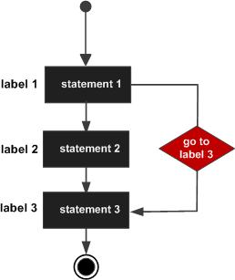

# 流程控制

## 概述

程序的流程控制结构一共有三种：

| 结构类型 | 说明 | 执行次数 |
|---------|------|---------|
| 顺序结构 | 代码从上向下逐行执行 | 逐行 |
| 选择结构（分支） | 条件满足，某些代码才会被执行 | 0~1 次 |
| 循环结构 | 条件满足，某些代码会被反复执行 | 0~N 次 |

选择结构对应的语句：`if`、`switch`、`select`

循环结构对应的语句：`for`（Go 没有 while 循环）

## 分支语句

### if 语句

**单分支：**

```go
if 布尔表达式 {
   /* 在布尔表达式为 true 时执行 */
}
```

**双分支：**

```go
if 布尔表达式 {
   /* 在布尔表达式为 true 时执行 */
} else {
   /* 在布尔表达式为 false 时执行 */
}
```

**多分支：**

```go
if 布尔表达式1 {
   /* 在布尔表达式1为 true 时执行 */
} else if 布尔表达式2 {
   /* 在布尔表达式1为 false，布尔表达式2为 true 时执行 */
} else {
   /* 在上面两个布尔表达式都为 false 时执行 */
}
```

示例代码：

```go
package main

import "fmt"

func main() {
   /* 定义局部变量 */
   var a int = 10

   /* 使用 if 语句判断布尔表达式 */
   if a < 20 {
       /* 如果条件为 true 则执行以下语句 */
       fmt.Printf("a 小于 20\n")
   }
   fmt.Printf("a 的值为 : %d\n", a)
}
```

### if 变体

if 语句还可以在条件判断前执行一个可选的初始化语句：

```go
if statement; condition {
}
```

示例代码：

```go
package main

import (
    "fmt"
)

func main() {
    if num := 10; num%2 == 0 { //checks if number is even
        fmt.Println(num, "is even")
    } else {
        fmt.Println(num, "is odd")
    }
}
```

> 需要注意的是，`num` 的定义在 `if` 里，那么只能够在该 `if..else` 语句块中使用，否则编译器会报错。

### switch 语句

switch 是一个条件语句，它计算表达式并将其与可能匹配的列表进行比较，并根据匹配执行代码块。可以认为它是写多个 `if else` 子句的惯用方式。

switch 语句执行的过程从上至下，直到找到匹配项。**匹配项后面不需要再加 `break`**——Go 默认每个 case 最后自带 `break`，匹配成功后不会自动向下穿透执行其他 case，而是跳出整个 switch。如果需要穿透，可以使用 `fallthrough`。

变量 var1 可以是任何类型，而 val1 和 val2 则可以是同类型的任意值。类型不被局限于常量或整数，但必须是相同的类型；或者最终结果为相同类型的表达式。

可以**同时测试多个可能符合条件的值，使用逗号分割**，例如：`case val1, val2, val3`。

语法格式：

```go
switch var1 {
    case val1:
        ...
    case val2:
        ...
    default:
        ...
}
```

如果 switch 没有表达式，它会匹配 `true`（相当于 switch true）：

```go
switch {
    case condition1:
        ...
    case condition2:
        ...
    default:
        ...
}
```

示例代码：

```go
package main

import "fmt"

func main() {
   /* 定义局部变量 */
   var grade string = "B"
   var marks int = 90

   switch marks {
      case 90:
          grade = "A"
      case 80:
          grade = "B"
      case 50, 60, 70: // case 后可以由多个数值
          grade = "C"
      default:
          grade = "D"
   }

   switch {
      case grade == "A":
         fmt.Printf("优秀!\n")
      case grade == "B", grade == "C":
         fmt.Printf("良好\n")
      case grade == "D":
         fmt.Printf("及格\n")
      case grade == "F":
         fmt.Printf("不及格\n")
      default:
         fmt.Printf("差\n")
   }
   fmt.Printf("你的等级是 %s\n", grade)
}
```

switch 省略表达式的用法（等价于 `switch true`）：

```go
package main

import (
    "fmt"
)

func main() {
    num := 75
    switch { // expression is omitted
    case num >= 0 && num <= 50:
        fmt.Println("num is greater than 0 and less than 50")
    case num >= 51 && num <= 100:
        fmt.Println("num is greater than 51 and less than 100")
    case num >= 101:
        fmt.Println("num is greater than 100")
    }
}
```

> **switch 注意事项：**
>
> 1. case 后的常量值不能重复
> 2. case 后可以有多个常量值
> 3. `fallthrough` 应该是某个 case 的最后一行。如果它出现在中间的某个地方，编译器就会抛出错误。

### fallthrough

如需贯通后续的 case（即强制执行下一个 case 中的代码），就使用 `fallthrough`：

```go
package main

import (
    "fmt"
)

type data [2]int

func main() {
    switch x := 5; x {
    default:
        fmt.Println(x)
    case 5:
        x += 10
        fmt.Println(x)
        fallthrough
    case 6:
        x += 20
        fmt.Println(x)
    }
}
```

运行结果：

```
15
35
```

### Type Switch

switch 语句还可以用于 type-switch，判断某个 interface 变量中实际存储的变量类型：

```go
switch x.(type) {
    case type:
       statement(s);
    case type:
       statement(s);
    /* 你可以定义任意个数的 case */
    default: /* 可选 */
       statement(s);
}
```

示例代码：

```go
package main

import "fmt"

func main() {
   var x interface{}

   switch i := x.(type) {
      case nil:
         fmt.Printf(" x 的类型 :%T", i)
      case int:
         fmt.Printf("x 是 int 型")
      case float64:
         fmt.Printf("x 是 float64 型")
      case func(int) float64:
         fmt.Printf("x 是 func(int) 型")
      case bool, string:
         fmt.Printf("x 是 bool 或 string 型")
      default:
         fmt.Printf("未知型")
   }
}
```

运行结果：

```
x 的类型 :<nil>
```

## 循环语句

### for 语句

`for` 是 Go 语言中**唯一**的循环语句（Go 没有 while 循环）。

语法结构：

```go
for init; condition; post { }
```

初始化语句只执行一次。在初始化循环之后，将检查该条件。如果条件计算为 true，那么 `{}` 中的循环体将被执行，然后是 post 语句。post 语句将在循环的每次成功迭代之后执行。在执行 post 语句之后，该条件将被重新检查。如果它是正确的，循环将继续执行，否则循环终止。

示例代码：

```go
package main

import (
    "fmt"
)

func main() {
    for i := 1; i <= 10; i++ {
        fmt.Printf(" %d", i)
    }
}
```

> 在 for 循环中声明的变量仅在循环范围内可用。因此，`i` 不能在循环外部访问。

### for 循环变体

**所有三个组成部分（init、condition、post）都是可选的**，因此 for 有多种变体形式：

| 形式 | 语法 | 说明 |
|------|------|------|
| 标准形式 | `for init; condition; post { }` | 完整的初始化、条件、后置语句 |
| while 风格 | `for condition { }` | 省略 init 和 post，效果与 while 相似 |
| 无限循环 | `for { }` | 省略所有组成部分，相当于 `for(;;)` |

**range 格式**：可以对 slice、map、数组、字符串等进行迭代循环：

```go
for key, value := range oldMap {
    newMap[key] = value
}
```

综合示例：

```go
package main

import "fmt"

func main() {

   var b int = 15
   var a int

   numbers := [6]int{1, 2, 3, 5}

   /* 标准 for 循环 */
   for a := 0; a < 10; a++ {
      fmt.Printf("a 的值为: %d\n", a)
   }

   /* while 风格 */
   for a < b {
      a++
      fmt.Printf("a 的值为: %d\n", a)
   }

   /* range 迭代 */
   for i, x := range numbers {
      fmt.Printf("第 %d 位 x 的值 = %d\n", i, x)
   }
}
```

### 多层 for 循环

for 循环中可以嵌套 for 循环，即为多层循环。

## 循环控制语句

| 语句 | 说明 |
|------|------|
| `break` | 跳出整个循环体，终止 for 循环 |
| `continue` | 跳过当前迭代，循环继续到下一个迭代 |

### break

break 语句用于在正常结束之前突然终止 for 循环：

```go
package main

import (
    "fmt"
)

func main() {
    for i := 1; i <= 10; i++ {
        if i > 5 {
            break // loop is terminated if i > 5
        }
        fmt.Printf("%d ", i)
    }
    fmt.Printf("\nline after for loop")
}
```

### continue

continue 语句用于跳过 for 循环的当前迭代。在 continue 语句后面的 for 循环中的所有代码将不会在当前迭代中执行，循环将继续到下一个迭代：

```go
package main

import (
    "fmt"
)

func main() {
    for i := 1; i <= 10; i++ {
        if i%2 == 0 {
            continue
        }
        fmt.Printf("%d ", i)
    }
}
```

## goto 语句

goto 可以无条件地转移到过程中指定的行。

语法结构：

```go
goto label;
..
..
label: statement;
```



示例代码：

```go
package main

import "fmt"

func main() {
   /* 定义局部变量 */
   var a int = 10

   /* 循环 */
LOOP:
   for a < 20 {
      if a == 15 {
         /* 跳过迭代 */
         a = a + 1
         goto LOOP
      }
      fmt.Printf("a的值为 : %d\n", a)
      a++
   }
}
```

goto 的一个实际应用场景是**统一错误处理**，避免多处错误处理时的代码重复：

```go
err := firstCheckError()
if err != nil {
    goto onExit
}
err = secondCheckError()
if err != nil {
    goto onExit
}
fmt.Println("done")
return
onExit:
    fmt.Println(err)
    exitProcess()
```
