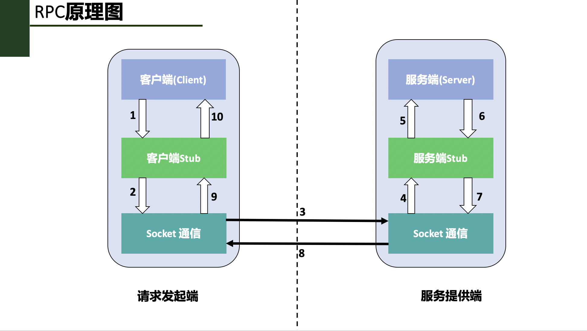
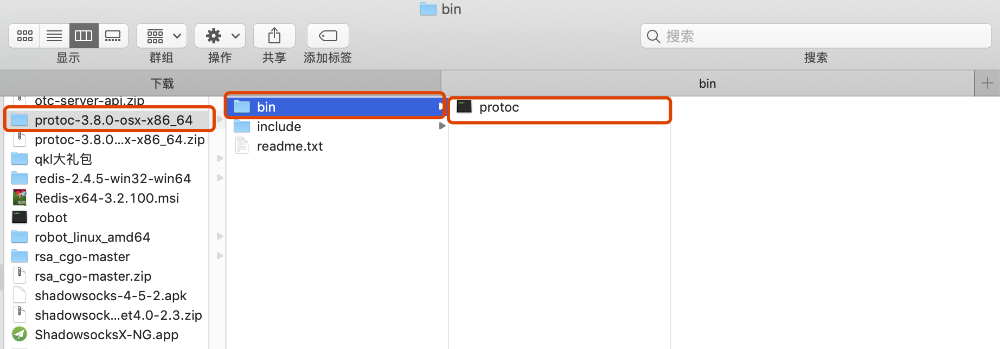
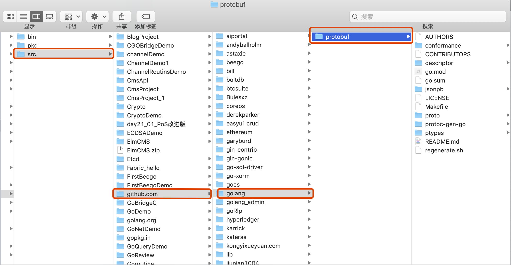
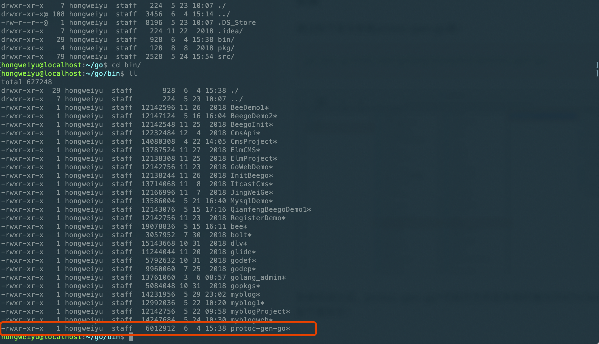
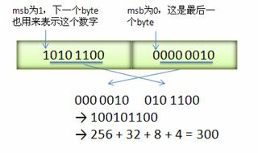
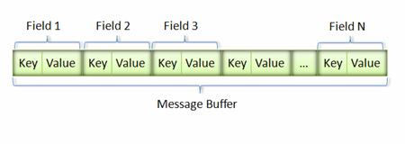
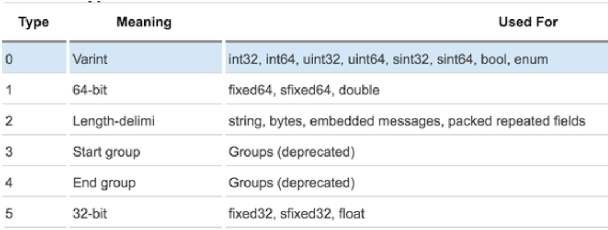
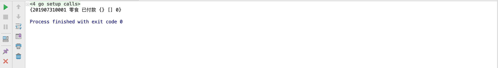
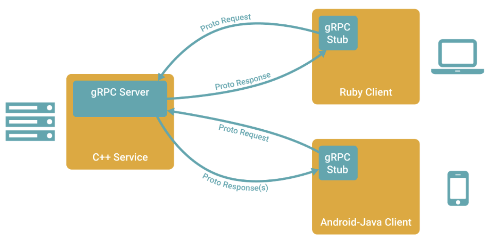
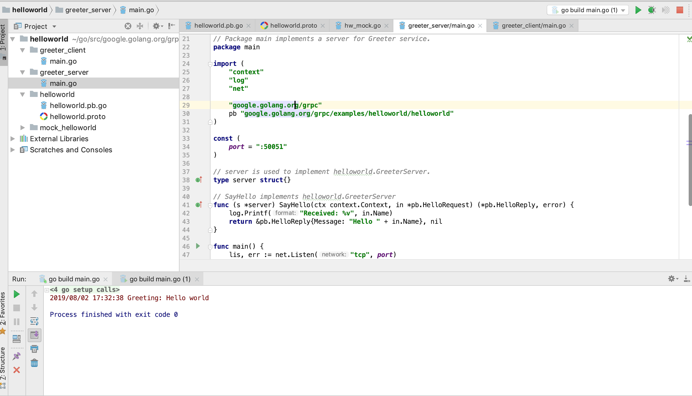

# RPC与ProtocolBuffers

## 一、RPC简介及原理介绍

### 1.1、背景

在前面的微服务理论内容中，我们已经学习了微服务的理论知识，了解了微服务实践中需要解决哪些问题。

### 1.2、本地过程调用

让我们先来看看正常情况下程序的执行和调用情况。例如有如下go语言代码：

```go
func main() {
	var a, b int
	a = 1
	b = 2
	c := Add(a, b)
	fmt.Println("计算结果:", c)
}
func Add(a int, b int) int {
	return a + b
}
```

在上述的Go语言代码中，我们定义了一个Add方法用于实现两个数相加的功能，在main方法中通过调用Add方法实现了计算两个变量之和的操作。整个过程涉及到变量值入栈，出栈，赋值等操作，最后将出栈的计算结果返回并赋值给c变量。

总结说来，本地程序调用的过程大致可以分为几个步骤和阶段：
* 开发者开发好的程序，并进行编译，编译成机器认可的可执行文件。
* 运行可执行文件，调用对应的功能方法，期间会读取可执行文件中的机器指令，进行入栈，出栈赋值等操作。此时，计算机由可执行程序所在的进程控制。
* 调用结束，所有的内存数据出栈，程序执行结束。计算机继续由操作系统进行控制。

### 1.3、问题及解决方法

上文我们已经说过，远程过程调用是在两台或者多台不同的物理机器上实现的调用，其间要跨越网络进行调用。因此，我们再想通过前文本地方法调用的形式完成功能调用，就无法实现了，因为编译器无法通过编译的可执行文件来调用远程机器上的程序方法。因此需要采用RPC的方式来实现远端服务器上的程序方法的调用。

RPC技术内部原理是通过两种技术的组合来实现的：**本地方法调用 和 网络通信技术。**

### 1.4、RPC简介

在上述本地过程调用的例子中，我们是在一台计算机上执行了计算机上的程序，完成调用。随着计算机技术的发展和需求场景的变化，有时就需要从一台计算机上执行另外一台计算机上的程序的需求，因此后来又发展出来了RPC技术。特别是目前随着互联网技术的快速迭代和发展，用户和需求几乎都是以指数式的方式在高速增长，这个时候绝大多数情况下程序都是部署在多台机器上，就需要在调用其他物理机器上的程序的情况。

RPC是Remote Procedure Call Protocol单词首字母的缩写，简称为：RPC，翻译成中文叫远程过程调用协议。所谓远程过程调用，通俗的理解就是可以在本地程序中调用运行在另外一台服务器上的程序的功能方法。这种调用的过程跨越了物理服务器的限制，是在网络中完成的，在调用远端服务器上程序的过程中，本地程序等待返回调用结果，直到远端程序执行完毕，将结果进行返回到本地，最终完成一次完整的调用。

需要强调的是：**远程过程调用指的是调用远端服务器上的程序的方法整个过程。**

### 1.5、RPC设计组成

RPC技术在架构设计上有四部分组成，分别是：**客户端、客户端存根、服务端、服务端存根。**

这里提到了**客户端**和**服务端**的概念，其属于程序设计架构的一种方式，在现代的计算机软件程序架构设计上，大方向上分为两种方向，分别是：**B/S架构**、**C/S架构**。B/S架构指的是浏览器到服务器交互的架构方式，另外一种是在计算机上安装一个单独的应用，称之为客户端，与服务器交互的模式。

由于在服务的调用过程中，有一方是发起调用方，另一方是提供服务方。因此，我们把服务发起方称之为客户端，把服务提供方称之为服务端。以下是对RPC的四种角色的解释和说明：

* **客户端(Client)：**服务调用发起方，也称为服务消费者。
* **客户端存根(Client Stub)：**该程序运行在客户端所在的计算机机器上，主要用来存储要调用的服务器的地址，另外，该程序还负责将客户端请求远端服务器程序的数据信息打包成数据包，通过网络发送给服务端Stub程序；其次，还要接收服务端Stub程序发送的调用结果数据包，并解析返回给客户端。
* **服务端(Server)：**远端的计算机机器上运行的程序，其中有客户端要调用的方法。
* **服务端存根(Server Stub)：**接收客户Stub程序通过网络发送的请求消息数据包，并调用服务端中真正的程序功能方法，完成功能调用；其次，将服务端执行调用的结果进行数据处理打包发送给客户端Stub程序。

### 1.6、RPC原理及调用步骤

了解完了RPC技术的组成结构我们来看一下具体是如何实现客户端到服务端的调用的。实际上，如果我们想要在网络中的任意两台计算机上实现远程调用过程，要解决很多问题，比如：

* 两台物理机器在网络中要建立稳定可靠的通信连接。
* 两台服务器的通信协议的定义问题，即两台服务器上的程序如何识别对方的请求和返回结果。也就是说两台计算机必须都能够识别对方发来的信息，并且能够识别出其中的请求含义和返回含义，然后才能进行处理。这其实就是通信协议所要完成的工作。

让我们来看看RPC具体是如何解决这些问题的，RPC具体的调用步骤图如下：



在上述图中，通过1-10的步骤图解的形式，说明了RPC每一步的调用过程。具体描述为：

* 1、客户端想要发起一个远程过程调用，首先通过调用本地客户端Stub程序的方式调用想要使用的功能方法名；
* 2、客户端Stub程序接收到了客户端的功能调用请求，**将客户端请求调用的方法名，携带的参数等信息做序列化操作，并打包成数据包。**
* 3、客户端Stub查找到远程服务器程序的IP地址，调用Socket通信协议，通过网络发送给服务端。
* 4、服务端Stub程序接收到客户端发送的数据包信息，并**通过约定好的协议将数据进行反序列化，得到请求的方法名和请求参数等信息。**
* 5、服务端Stub程序准备相关数据，**调用本地Server对应的功能方法进行，并传入相应的参数，进行业务处理。**
* 6、服务端程序根据已有业务逻辑执行调用过程，待业务执行结束，将执行结果返回给服务端Stub程序。
* 7、服务端Stub程序**将程序调用结果按照约定的协议进行序列化，**并通过网络发送回客户端Stub程序。
* 8、客户端Stub程序接收到服务端Stub发送的返回数据，**对数据进行反序列化操作，**并将调用返回的数据传递给客户端请求发起者。
* 9、客户端请求发起者得到调用结果，整个RPC调用过程结束。

### 1.7、RPC涉及到的相关技术

通过上文一系列的文字描述和讲解，我们已经了解了RPC的由来和RPC整个调用过程。我们可以看到RPC是一系列操作的集合，其中涉及到很多对数据的操作，以及网络通信。因此，我们对RPC中涉及到的技术做一个总结和分析：

* **1、动态代理技术：** 上文中我们提到的Client Stub和Sever Stub程序，在具体的编码和开发实践过程中，都是使用动态代理技术自动生成的一段程序。
* **2、序列化和反序列化：** 在RPC调用的过程中，我们可以看到数据需要在一台机器上传输到另外一台机器上。在互联网上，所有的数据都是以字节的形式进行传输的。而我们在编程的过程中，往往都是使用数据对象，因此想要在网络上将数据对象和相关变量进行传输，就需要对数据对象做序列化和反序列化的操作。
    * **序列化：**把对象转换为字节序列的过程称为对象的序列化，也就是编码的过程。
    * **反序列化：**把字节序列恢复为对象的过程称为对象的反序列化，也就是解码的过程。

我们常见的Json,XML等相关框架都可以对数据做序列化和反序列化编解码操作。同时，Protobuf协议也是一种数据编解码的协议，在RPC框架中使用的更广泛。

## 二、Go语言实现RPC编程

### 2.1、RPC官方库

在Go语言官方网站的pkg说明中，提供了官方支持的rpc包，具体链接如下：[https://golang.org/pkg/net/rpc/](https://golang.org/pkg/net/rpc/)。官方提供的rpc包完整的包名是：**net/rpc**。根据官方的解释，rpc包主要是提供通过网络访问一个对象方法的功能。

### 2.2、net/rpc库实现RPC调用编程

前文我们已经讲过rpc调用有两个参与者，分别是：**客户端（client）和服务器（server）**。

首先是提供方法暴露的一方--服务器。

#### 2.2.1、服务定义及暴露

在编程实现过程中，服务器端需要注册结构体对象，然后通过对象所属的方法暴露给调用者，从而提供服务，该方法称之为**输出方法**，此输出方法可以被远程调用。当然，在定义输出方法时，能够被远程调用的方法需要遵循一定的规则。我们通过代码进行讲解：

```go
func (t *T) MethodName(request T1,response *T2) error
```

上述代码是go语言官方给出的对外暴露的服务方法的定义标准，其中包含了主要的几条规则，分别是：
* 1、对外暴露的方法有且只能有两个参数，这个两个参数只能是输出类型或内建类型，两种类型中的一种。
* 2、方法的第二个参数必须是指针类型。
* 3、方法的返回类型为error。
* 4、方法的类型是可输出的。
* 5、方法本身也是可输出的。

我们举例说明：假设目前我们有一个需求，给出一个float类型变量，作为圆形的半径，要求通过RPC调用，返回对应的圆形面积。具体的编程实现思路如下：

```go
type MathUtil struct{
}
//该方法向外暴露：提供计算圆形面积的服务
func (mu *MathUtil) CalculateCircleArea(req float32, resp *float32) error {
	*resp = math.Pi * req * req //圆形的面积 s = π * r * r
	return nil //返回类型
}
```

在上述的案例中，我们可以看到：
* 1、Calculate方法是服务对象MathUtil向外提供的服务方法，该方法用于接收传入的圆形半径数据，计算圆形面积并返回。
* 2、第一个参数req代表的是调用者（client）传递提供的参数。
* 3、第二个参数resp代表要返回给调用者的计算结果，必须是指针类型。
* 4、正常情况下，方法的返回值为是error，为nil。如果遇到异常或特殊情况，则error将作为一个字符串返回给调用者，此时，resp参数就不会再返回给调用者。

至此为止，已经实现了服务端的功能定义，接下来就是让服务代码生效，需要将服务进行注册，并启动请求处理。

#### 2.2.2、注册服务及监听请求

**net/rpc包**为我们提供了注册服务和处理请求的一系列方法,结合本案例实现注册及处理逻辑，如下所示：

```go
//1、初始化指针数据类型
mathUtil := new(MathUtil) //初始化指针数据类型

//2、调用net/rpc包的功能将服务对象进行注册
err := rpc.Register(mathUtil)
if err != nil {
	panic(err.Error())
}

//3、通过该函数把mathUtil中提供的服务注册到HTTP协议上，方便调用者可以利用http的方式进行数据传递
rpc.HandleHTTP()

//4、在特定的端口进行监听
listen, err := net.Listen("tcp", ":8081")
if err != nil {
	panic(err.Error())
}
go http.Serve(listen, nil)
```

经过服务注册和监听处理，RPC调用过程中的服务端实现就已经完成了。接下来需要实现的是客户端请求代码的实现。

#### 2.2.3、客户端调用

在服务端是通过Http的端口监听方式等待连接的，因此在客户端就需要通过http连接，首先与服务端实现连接。

* 客户端连接服务端

    ```go
    client, err := rpc.DialHTTP("tcp", "localhost:8081")
    	if err != nil {
    		panic(err.Error())
    	}
    ```

* 远端方法调用

客户端成功连接服务端以后，就可以通过方法调用调用服务端的方法，具体调用方法如下：

    ```go
    var req float32 //请求值
	req = 3

	var resp *float32 //返回值
	err = client.Call("MathUtil.CalculateCircleArea", req, &resp)
	if err != nil {
		panic(err.Error())
	}
	fmt.Println(*resp)
    ```

    上述的调用方法核心在于client.Call方法的调用，该方法有三个参数，第一个参数表示要调用的远端服务的方法名，第二个参数是调用时要传入的参数，第三个参数是调用要接收的返回值。
    上述的Call方法调用实现的方式是同步的调用，除此之外，还有一种异步的方式可以实现调用。异步调用代码实现如下：

    ```go
    var respSync *float32
	//异步的调用方式
	syncCall := client.Go("MathUtil.CalculateCircleArea", req, &respSync, nil)
	replayDone := <-syncCall.Done
	fmt.Println(replayDone)
	fmt.Println(*respSync)
    ```

#### 2.2.4、多参数的请求调用参数传递

上述内容演示了单个参数下的RPC调用，对于多参数下的请求该如何实现。我们通过另外一个案例进行演示。

假设现在需要实现另外一个需求：通过RPC调用实现计算两个数字相加功能并返回计算结果。此时，就需要传递两个参数，具体实现如下：

将参数定义在一个新的结构体中：

```go
type AddParma struct {
	Args1 float32 //第一个参数
	Args2 float32 //第二个参数
}
```

在server.go文件中，实现两数相加的功能，并实现服务注册的逻辑：

```go
func (mu *MathUtil) Add(param param.AddParma, resp *float32) error {
	*resp = param.Args1 + param.Args2 //实现两数相加的功能
	return nil
}
mathUtil := new(MathUtil)

	err := rpc.RegisterName("MathUtil", mathUtil)
	if err != nil {
		panic(err.Error())
	}

	rpc.HandleHTTP()

	listen, err := net.Listen("tcp", ":8082")
	http.Serve(listen, nil)
```

在本案例中，我们通过新的注册方法rpc.RegisterName实现了服务的注册和调用。

至此，我们已经完成了net/rpc包的最基础的使用。

## 三、Protobuf简介

### 3.1、RPC 通信

对于单独部署，独立运行的微服务实例而言，在业务需要时，需要与其他服务进行通信，这种通信方式是进程之间的通讯方式（inter-process communication，简称IPC）。

前文已经描述过，IPC有两种实现方式，分别为：**同步过程调用、异步消息调用**。在同步过程调用的具体实现中，有一种实现方式为RPC通信方式，远程过程调用（英语：Remote Procedure Call，缩写为 RPC）。

远程过程调用（英语：Remote Procedure Call，缩写为RPC）是一个计算机通信协议。该协议允许运行于一台计算机的程序调用另一台计算机的子程序，而程序员无需额外地为这个交互作用编程。如果涉及的软件采用面向对象编程，那么远程过程调用亦可称作远程调用或远程方法调用，例：Java RMI。**简单地说就是能使应用像调用本地方法一样的调用远程的过程或服务。**很显然，这是一种client-server的交互形式，调用者(caller)是client,执行者(executor)是server。典型的实现方式就是request–response通讯机制。

### 3.2、RPC 实现步骤

一个正常的RPC过程可以分为一下几个步骤：

* 1、client调用client stub，这是一次本地过程调用。
* 2、client stub将参数打包成一个消息，然后发送这个消息。打包过程也叫做marshalling。
* 3、client所在的系统将消息发送给server。
* 4、server的的系统将收到的包传给server stub。
* 5、server stub解包得到参数。 解包也被称作 unmarshalling。
* 6、server stub调用服务过程。返回结果按照相反的步骤传给client。

在上述的步骤实现远程接口调用时，所需要执行的函数是存在于远程机器中，即函数是在另外一个进程中执行的。因此，就带来了几个新问题：
* **1、Call ID映射。**远端进程中间可以包含定义的多个函数，本地客户端该如何告知远端进程程序调用特定的某个函数呢？因此，在RPC调用过程中，所有的函数都需要有一个自己的ID。开发者在客户端（调用端）和服务端（被调用端）分别维护一个{函数<-->Call ID}的对应表。两者的表不一定完全相同，但是相同的函数对应的Call ID必须相同。当客户端需要进行远程调用时，调用者通过映射表查询想要调用的函数的名称，找到对应的Call ID，然后传递给服务端，服务端也通过查表，来确定客户端所需要调用的函数，然后执行相应函数的代码。
* **2、序列化与反序列化。**客户端如何把参数传递给远程调用的函数呢？在本地调用中，我们只需要把参数压到栈里，然后让函数自己去栈里读就行。但是在远程过程调用时，客户端跟服务端是不同的进程，不能通过内存来传递参数。甚至有时候客户端和服务端使用的都不是同一种语言（比如服务端用C++，客户端用Java或者Python）。这时候就需要客户端把参数先转成一个字节流，传给服务端后，再把字节流转成自己能读取的格式。这个过程叫序列化和反序列化。同理，从服务端返回的值也需要序列化反序列化的过程。
* **3、网络传输。**远程调用往往用在网络上，客户端和服务端是通过网络连接的。所有的数据都需要通过网络传输，因此就需要有一个网络传输层。网络传输层需要把Call ID和序列化后的参数字节流传递给服务端，然后在把序列化后的调用结果传回给客户端，完成这种数据传递功能的被成为传输层。大部分的网络传输都使用TCP协议，属于长连接。

在上述步骤实现中，可以看到其中有对传递的数据进行序列化和反序列化的操作，这就是本节内容要学习的内容：**Protobuf**。

### 3.3、Protobuf简介

Google Protocol Buffer( 简称 Protobuf)是Google公司内部的混合语言数据标准，他们主要用于RPC系统和持续数据存储系统。

### 3.4、Protobuf应用场景

Protocol Buffers 是一种轻便高效的结构化数据存储格式，可以用于结构化数据串行化，或者说序列化。它很适合做数据存储或RPC数据交换格式。可用于通讯协议、数据存储等领域的语言无关、平台无关、可扩展的序列化结构数据格式。

简单来说，Protobuf的功能类似于XML，即负责把某种数据结构的信息，以某种格式保存起来。主要用于数据存储、传输协议等使用场景。

为什么已经有了XML，JSON等已经很普遍的数据传输方式，还要设计出Protobuf这样一种新的数据协议呢？

### 3.5、Protobuf 优点

* **性能好/效率高**
    * 时间维度：采用XML格式对数据进行序列化时，时间消耗上性能尚可；对于使用XML格式对数据进行反序列化时的时间花费上，耗时长，性能差。
    * 空间维度：XML格式为了保持较好的可读性，引入了一些冗余的文本信息。所以在使用XML格式进行存储数据时，也会消耗空间。
    整体而言，Protobuf以高效的二进制方式存储，比XML小3到10倍，快20到100倍。

* **代码生成机制**
    * **代码生成机制的含义**

        在Go语言中，可以通过定义结构体封装描述一个对象，并构造一个新的结构体对象。比如定义Person结构体，并存放于Person.go文件：
        ```go
        type Person struct{
            Name string
            Age int
            Sex int
        }
        ```
        在分布式系统中，因为程序代码是分开部署，比如分别为A、B。A系统在调用B系统时，无法直接采用代码的方式进行调用，因为A系统中不存在B系统中的代码。因此，A系统只负责将调用和通信的数据以二进制数据包的形式传递给B系统，由B系统根据获取到的数据包，自己构建出对应的数据对象，生成数据对象定义代码文件。这种利用编译器，根据数据文件自动生成结构体定义和相关方法的文件的机制被称作代码生成机制。

    * **代码生成机制的优点**
        首先，代码生成机制能够极大解放开发者编写数据协议解析过程的时间，提高工作效率；其次，易于开发者维护和迭代，当需求发生变更时，开发者只需要修改对应的数据传输文件内容即可完成所有的修改。

* **支持"向后兼容"和"向前兼容"**
    * **向后兼容：**在软件开发迭代和升级过程中，"后"可以理解为新版本，越新的版本越靠后；而"前"意味着早期的版本或者先前的版本。向"后"兼容即是说当系统升级迭代以后，仍然可以处理老版本的数据业务逻辑。
    * **向前兼容：**向前兼容即是系统代码未升级，但是接受到了新的数据，此时老版本生成的系统代码可以处理接收到的新类型的数据。

    支持前后兼容是非常重要的一个特点，在庞大的系统开发中，往往不可能统一完成所有模块的升级，为了保证系统功能正常不受影响，应最大限度保证通讯协议的向前兼容和向后兼容。

* **支持多种编程语言**

Protobuf不仅仅Google开源的一个数据协议，还有很多种语言的开源项目实现。在Google官方发布的Protobuf的源代码中包含了C++、Java、Python三种语言。

### 3.6、Protobuf 缺点

* **可读性较差**
    为了提高性能，Protobuf采用了二进制格式进行编码。二进制格式编码对于开发者来说，是没办法阅读的。在进行程序调试时，比较困难。
* **缺乏自描述**
    诸如XML语言是一种自描述的标记语言，即字段标记的同时就表达了内容对应的含义。而Protobuf协议不是自描述的，Protobuf是通过二进制格式进行数据传输，开发者面对二进制格式的Protobuf，没有办法知道所对应的真实的数据结构，因此在使用Protobuf协议传输时，必须配备对应的proto配置文件。

## 四、Protobuf在Go语言中的编程实现

Go语言中有对应的实现Protobuf协议的库，Github地址：[https://github.com/golang/protobuf](https://github.com/golang/protobuf)

### 4.1、环境准备

使用Go语言的Protobuf库之前，需要相应的环境准备：

* **1、安装protobuf编译器。**

可以在如下地址：[https://github.com/protocolbuffers/protobuf/releases](https://github.com/protocolbuffers/protobuf/releases)选择适合自己系统的Proto编译器程序进行下载并解压，如图：



* **2、配置环境变量**

protoc编译器正常运行需要进行环境变量配置，将protoc可执行文件所在目录添加到当前系统的环境变量中。windows系统下可以直接在Path目录中进行添加；macOS系统下可以将protoc可执行文件拷贝至**/usr/local/include**目录下。具体的对应的系统的环境变量配置可以阅读解压后与bin目录同级的readme.txt的文件内容。

### 4.2、安装

通过如下命令安装protoc-gen-go库：

```
go get github.com/golang/protobuf/protoc-gen-go
```



安装完成以后，protoc-gen-go可执行文件在本地环境GOPATH/bin目录下，如下图所示：



### 4.3、Protobuf 协议语法

* **Protobuf 协议的格式**

Protobuf协议规定：使用该协议进行数据序列化和反序列化操作时，首先定义传输数据的格式，并命名为以**".proto"**为扩展名的消息定义文件。

* **message 定义一个消息**

先来看一个非常简单的例子。假设想定义一个"订单"的消息格式，每一个"订单"都含有一个订单号ID、订单金额Num、订单时间TimeStamp字段。可以采用如下的方式来定义消息类型的.proto文件：

```
message Order{
    required string order_id = 1;
    required int64 num = 2;
    optional int32 timestamp = 3;
}
```

Order消息格式有3个字段，在消息中承载的数据分别对应每一个字段。其中每个字段都有一个名字和一种类型。

    * **指定字段类型：**在proto协议中，字段的类型包括字符串（string)、整形（int32、int64...）、枚举（enum）等数据类型
    * **分配标识符：**在消息字段中，每个字段都有唯一的一个标识符。最小的标识号可以从1开始，最大到536870911。不可以使用其中的[19000－19999]的标识号， Protobuf协议实现中对这些进行了预留。如果非要在.proto文件中使用这些预留标识号，编译时就会报警。
    * **指定字段规则：**字段的修饰符包含三种类型，分别是：
        * **required：**一个格式良好的消息一定要含有1个这种字段。表示该值是必须要设置的；
        * **optional：**消息格式中该字段可以有0个或1个值（不超过1个）。
        * **repeated：**在一个格式良好的消息中，这种字段可以重复任意多次（包括0次）。重复的值的顺序会被保留。表示该值可以重复，相当于Go中的slice。

    **【注意：】使用required弊多于利；在实际开发中更应该使用optional和repeated而不是required。**

    * 添加更多消息类型

    在同一个.proto文件中，可以定义多个消息类型。多个消息类型分开定义即可。

### 4.4、使用Protobuf的步骤

* 1、创建扩展名为**.proto**的文件，并编写代码。比如创建person.proto文件，内容如下：

```
syntax = "proto2";
package example;

message Person {
    required string Name = 1;
    required int32 Age = 2;
    required string From = 3;
}
```

* 2、编译.proto文件，生成Go语言文件。执行如下命令：

```
protoc --go_out = . test.proto
```

执行 protoc --go_out=. test.proto 生成对应的 person.pb.go 文件。并构建对应的example目录，存放生成的person.pb.go文件。


* 3、在程序中使用Protobuf

在程序中有如下代码：

```go
package main
import (
	"fmt"
	"ProtocDemo/example"
	"github.com/golang/protobuf/proto"
	"os"
)
func main() {
	fmt.Println("Hello World. \n")

	msg_test := &example.Person{
		Name: proto.String("Davie"),
		Age:  proto.Int(18),
		From: proto.String("China"),
	}

	//序列化
	msgDataEncoding, err := proto.Marshal(msg_test)
	if err != nil {
		panic(err.Error())
		return
	}

	msgEntity := example.Person{}
	err = proto.Unmarshal(msgDataEncoding, &msgEntity)
	if err != nil {
		fmt.Println(err.Error())
		os.Exit(1)
		return
	}

	fmt.Printf("姓名：%s\n\n", msgEntity.GetName())
	fmt.Printf("年龄：%d\n\n", msgEntity.GetAge())
	fmt.Printf("国籍：%s\n\n", msgEntity.GetFrom())
}
```

* **3、执行程序**


## 五、Protobuf 协议语法与原理实现

### 5.1、Protobuf 协议语法

* **message：**
Protobuf中定义一个数据结构需要用到关键字message，这一点和Java的class，Go语言中的struct类似。

* **标识号：**
在消息的定义中，每个字段等号后面都有唯一的标识号，用于在反序列化过程中识别各个字段的，一旦开始使用就不能改变。标识号从整数1开始，依次递增，每次增加1，标识号的范围为1~2^29 - 1，其中[19000-19999]为Protobuf协议预留字段，开发者不建议使用该范围的标识号；一旦使用，在编译时Protoc编译器会报出警告。

* **字段规则：**
字段规则有三种：
    * 1、required：该规则规定，消息体中该字段的值是必须要设置的。
    * 2、optional：消息体中该规则的字段的值可以存在，也可以为空，optional的字段可以根据default设置默认值。
    * repeated：消息体中该规则字段可以存在多个（包括0个），该规则对应java的数组或者go语言的slice。

* **数据类型：**
常见的数据类型与protoc协议中的数据类型映射如下：

| .proto类型 | Java类型 | C++类型 | Go语言类型 | 备注 |
|-----------|---------|---------|---------|------|
| double | double | double | float64 | |
| float | float | float | float32 | |
| int32 | int | int | int32 | 可变长编码方式。编码负数时不够高效，如果字段可能包含负数，可以使用sint32 |
| int64 | long | int64 | int64 | 可变长编码方式。编码负数时不够高效，如果字段可能包含负数，使用sint64。 |
| uint32 | int | uint32 | uint32 | |
| uint64 | | uint64 | uint64 | |
| sint32 | int | int32 | int32 | 可变长编码方式，有符号的整形值。编码时比int32效率高。 |
| sint64 | long | int64 | int64 | 可变长编码方式，有符号的整形值，编码时比int64效率高。 |
| fixed32 | int | uint32 | uint32 | 总是4个字节。如果所有数值均比（2^28）大，该种编码方式比uint32高效。 |
| fixed64 | long | uint64 | uint64 | 总是8个字节。如果所有数值均比（2^56）大，此种编码方式比uint64高效。 |
| sfixed32 | int | uint32 | int32 | 总是4个字节。 |
| sfixed64 | long | uint64 | int64 | 总是8个字节。 |
| bool | boolean | bool | bool | |
| string | String | String | string | |

* **枚举类型：**

proto协议支持使用枚举类型，和正常的编程语言一样，枚举类型可以使用enum关键字定义在.proto文件中：

```go
enum Age{
    male=1;
    female=2;
}
```

* **字段默认值：**

.proto文件支持在进行message定义时设置字段的默认值，可以通过**default**进行设置，如下所示：

```
message Address {
    required sint32 id = 1 [default = 1];
    required string name = 2 [default = '北京'];
    optional string pinyin = 3 [default = 'beijing'];
    required string address = 4;
    required bool flag = 5 [default = true];
}
```

* **导入：**

如果需要引用的message是写在别的.proto文件中，可以通过import "xxx.proto"来进行引入。

* **嵌套：**

message与message之间可以嵌套定义，比如如下形式：

```
syntax = "proto2";
package example;
message Person {
    required string Name = 1;
    required int32 Age = 2;
    required string From = 3;
    optional Address Addr = 4;
    message Address {
        required sint32 id = 1;
        required string name = 2;
        optional string pinyin = 3;
        required string address = 4;
    }
}
```

* **message更新规则：**

message定义以后如果需要进行修改，为了保证之前的序列化和反序列化能够兼容新的message，message的修改需要满足以下规则：
    * 不可以修改已存在域中的标识号。
    * 所有新增添的域必须是 optional 或者 repeated。
    * 非required域可以被删除。但是这些被删除域的标识号不可以再次被使用。
    * 非required域可以被转化，转化时可能发生扩展或者截断，此时标识号和名称都是不变的。
    * sint32和sint64是相互兼容的。
    * fixed32兼容sfixed32。 fixed64兼容sfixed64。
    * optional兼容repeated。发送端发送repeated域，用户使用optional域读取，将会读取repeated域的最后一个元素。

Protobuf 序列化后所生成的二进制消息非常紧凑，这得益于 Protobuf 采用的非常巧妙的 Encoding 方法。

### 5.2、Protobuf序列化原理

之前已经做过描述，Protobuf的message中有很多字段，每个字段的格式为：**修饰符 字段类型 字段名 = 域号;**

#### 5.2.1、Varint

Varint是一种紧凑的表示数字的方法。它用一个或多个字节来表示一个数字，值越小的数字使用越少的字节数。这能减少用来表示数字的字节数。

Varint中的每个byte的最高位bit有特殊的含义，如果该位为1，表示后续的byte也是该数字的一部分，如果该位为0，则结束。其他的7个bit都用来表示数字。因此小于128的数字都可以用一个byte表示。大于128的数字，比如300，会用两个字节来表示：1010 1100 0000 0010。下图演示了 Google Protocol Buffer 如何解析两个bytes。注意到最终计算前将两个byte的位置相互交换过一次，这是因为 Google Protocol Buffer 字节序采用little-endian的方式。



在序列化时，Protobuf按照TLV的格式序列化每一个字段，T即Tag，也叫Key；V是该字段对应的值value；L是Value的长度，如果一个字段是整形，这个L部分会省略。

序列化后的Value是按原样保存到字符串或者文件中，Key按照一定的转换条件保存起来，序列化后的结果就是 KeyValueKeyValue…依次类推的样式，示意图如下所示：



采用这种Key-Pair结构无需使用分隔符来分割不同的Field。对于可选的Field，如果消息中不存在该field，那么在最终的Message Buffer中就没有该field，这些特性都有助于节约消息本身的大小。比如，我们有消息order1:

```
Order.id = 10;
Order.desc = "bill";
```

则最终的 Message Buffer 中有两个Key-Value对，一个对应消息中的id；另一个对应desc。Key用来标识具体的field，在解包的时候，Protocol Buffer根据Key就可以知道相应的Value应该对应于消息中的哪一个field。

Key 的定义如下：

```
(field_number << 3) | wire_type
```

可以看到 Key 由两部分组成。第一部分是 field_number，比如消息lm.helloworld中field id 的field_number为1。第二部分为wire_type。表示 Value的传输类型。而wire_type有以下几种类型：



## 六、RPC与Protobuf结合使用

需求：假设在一个系统中，有订单模块（Order），其他模块想要实现RPC的远程过程调用，根据订单ID和时间戳可以获取订单信息。如果获取成功就返回相应的订单信息；如果查询不到返回失败信息。现在，我们来进行需求的编程实现。

### 6.1、传输数据格式定义

* **数据定义**

根据需求，定义message.proto文件，详细定义如下：

```protobuf
syntax = "proto3";
package message;

//订单请求参数
message OrderRequest {
    string orderId = 1;
    int64 timeStamp = 2;
}

//订单信息
message OrderInfo {
    string OrderId = 1;
    string OrderName = 2;
    string OrderStatus = 3;
}
```

在上述文件中，定义了客户端发起RPC调用时的请求数据结构OrderRequest和服务端查询后返回的数据结构OrderInfo。数据定义采用proto3语法实现，整个数据定义被定义在message包下。

* **编译proto文件**

通过proto编译命令对.proto文件进行编译，自动生成对应结构体的Go语言文件。编译命令如下：

```go
protoc ./message.proto --go_out=./
```

执行上述命令是在message包下。编译命令结束后，会在message包下生成message.pb.go文件，其中自动生成了OrderRequest和OrderInfo在Go语言中结构体的定义和相关的方法。

### 6.2、Protobuf格式数据与RPC结合

* **服务的定义**

进行RPC远程过程调用，实现调用远程服务器的方法，首先要有服务。在本案例中，定义提供订单查询功能的服务，取名为OrderService，同时提供订单信息查询方法供远程调用。详细的服务和方法定义如下：

```go
//订单服务
type OrderService struct {
}
func (os *OrderService) GetOrderInfo(request message.OrderRequest, response *message.OrderInfo) error {
	orderMap := map[string]message.OrderInfo{
		"201907300001": message.OrderInfo{OrderId: "201907300001", OrderName: "衣服", OrderStatus: "已付款"},
		"201907310001": message.OrderInfo{OrderId: "201907310001", OrderName: "零食", OrderStatus: "已付款"},
		"201907310002": message.OrderInfo{OrderId: "201907310002", OrderName: "食品", OrderStatus: "未付款"},
	}

   current := time.Now().Unix()
   if (request.TimeStamp > current) {
	  *response = message.OrderInfo{OrderId: "0", OrderName: "", OrderStatus: "订单信息异常"}
   } else {
	  result := orderMap[request.OrderId]
	  if result.OrderId != "" {
		 *response = orderMap[request.OrderId]
	  } else {
		 return errors.New("server error")
	  }
   }
   return nil
}
```

在服务的方法定义中，使用orderMap模拟初始订单数据库，方便案例查询展示。GetOrderInfo方法有两个参数，第一个是message.OrderRequest，作为调用者传递的参数，第二个是message.OrderInfo，作为调用返回的参数，通过此处的两个参数，将上文通过.proto定义并自动生成的Go语言结构体数据结合起来。

* **服务的注册和处理**

服务定义好以后，需要将服务注册到RPC框架，并开启http请求监听处理。这部分代码与之前的RPC服务端实现逻辑一致，具体实现如下：

```go
func main() {

	orderService := new(OrderService)

	rpc.Register(orderService)

	rpc.HandleHTTP()

	listen, err := net.Listen("tcp", ":8081")
	if err != nil {
		panic(err.Error())
	}
	http.Serve(listen, nil)
}
```

* **RPC客户端调用实现**

在客户端，除了客户端正常访问远程服务器的逻辑外，还需要准备客户端需要传递的请求数据message.OrderInfo。具体实现如下：

```go
client, err := rpc.DialHTTP("tcp", "localhost:8081")
	if err != nil {
		panic(err.Error())
	}

	timeStamp := time.Now().Unix()
	request := message.OrderRequest{OrderId: "201907310001", TimeStamp: timeStamp}

	var response *message.OrderInfo
	err = client.Call("OrderService.GetOrderInfo", request, &response)
	if err != nil {
		panic(err.Error())
	}

	fmt.Println(*response)
```

### 6.3、运行结果

分别依次运行server.go和client.go程序。运行结果如下：



## 七、gRPC远程过程调用框架

gRPC是由Google公司开源的一款高性能的远程过程调用(RPC)框架，可以在任何环境下运行。该框架提供了负载均衡，跟踪，智能监控，身份验证等功能，可以实现系统间的高效连接。gRPC框架默认使用Protocol Buffers作为接口定义语言，用于描述网络传输消息结构。

gRPC支持多种语言的实现，因此gRPC支持客户端与服务器在多种语言环境中部署运行和互相调用。多语言环境交互示例如下图所示：



通过查看 examples 目录下的 helloworld 项目，并分别依次执行 greeter_server 中的 main.go 程序和 greeter_client 中的 main.go 程序，可以查看到运行结果。项目目录和运行效果如下所示：



> **提示：** gRPC框架的详细开发实践，包括四种通信方式、拦截器、NameResolver与负载均衡、与Spring Boot整合等内容，请参见 **Common/GRPC** 章节。

gRPC官方网站：[https://grpc.io/](https://grpc.io/)
