# go-micro框架

## 一、micro框架介绍

### 1.1、背景

在本课程的前面的内容中，已经学习了微服务之间通信采用的通信协议，如何实现服务的注册和发现，搭建服务管理集群，以及服务与服务之间的RPC通信方式。具体的内容包括：protobuf协议，consul及docker部署consul集群，gRPC框架的使用等具体的实现方案。

以上这些具体的方案都是为了解决微服务实践过程中具体的某个问题而提出的，实现微服务架构的项目开发。但是，在具体的项目开发过程中，开发者聚焦的是业务逻辑的开发和功能的实现，大量的环境配置，调试搭建等基础性工作会耗费相当一部分的精力，因此有必要将微服务架构中所涉及到的、相关的解决方案做集中管理和维护。这就是我们要学习的Micro。

### 1.2、概述

Micro是一个简化分布式开发的微服务生态系统，该系统为开发分布式应用程序提供了高效，便捷的模块构建。主要目的是简化分布式系统的开发。

学习完该框架以后，可以方便开发者们非常简单的开发出微服务架构的项目，并且随着业务模块的增加和功能的增加，Micro还能够提供管理微服务环境的工具和功能。

### 1.3、micro组成

micro是一个微服务工具包，是由一系列的工具包组成的，如下图所示：

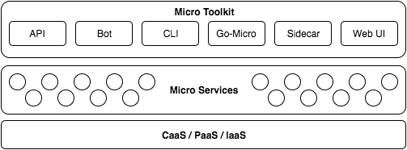

* **Go Micro：**用于在Go中编写微服务的插件式RPC框架。它提供了用于服务发现，客户端负载平衡，编码，同步和异步通信库。
* **API：** API主要负责提供将HTTP请求路由到相应微服务的API网关。它充当单个入口点，可以用作反向代理或将HTTP请求转换为RPC。
* **Sidecar：**一种对语言透明的RPC代理，具有go-micro作为HTTP端点的所有功能。虽然Go是构建微服务的伟大语言，但您也可能希望使用其他语言，因此Sidecar提供了一种将其他应用程序集成到Micro世界的方法。
* **Web：**用于Micro Web应用程序的仪表板和反向代理。我们认为应该基于微服务建立web应用，因此被视为微服务领域的一等公民。它的行为非常像API反向代理，但也包括对web sockets的支持。
* **CLI：**一个直接的命令行界面来与你的微服务进行交互。它还使您可以利用Sidecar作为代理，您可能不想直接连接到服务注册表。
* **Bot：**Hubot风格的bot，位于您的微服务平台中，可以通过Slack，HipChat，XMPP等进行交互。它通过消息传递提供CLI的功能。可以添加其他命令来自动执行常见的操作任务。

### 1.4、工具包介绍

#### 1.4.1、API

启用API作为一个网关或代理，来作为微服务访问的单一入口。它应该在您的基础架构的边缘运行。它将HTTP请求转换为RPC并转发给相应的服务。


#### 1.4.2、Web

UI是go-micro的web版本，允许通过UI交互访问环境。在未来，它也将是一种聚合Micro Web服务的方式。它包含一种Web应用程序的代理方式。将/[name]通过注册表路由到相应的服务。Web UI将前缀"go.micro.web."（可以配置）添加到名称中，在注册表中查找它，然后将进行反向代理。


#### 1.4.3、Sidecar

该Sidecar是go-micro的HTTP接口版本。这是将非Go应用程序集成到Micro环境中的一种方式。


#### 1.4.4、Bot

Bot是一个Hubot风格的工具，位于您的微服务平台中，可以通过Slack，HipChat，XMPP等进行交互。它通过消息传递提供CLI的功能。可以添加其他命令来自动执行常用操作任务。


#### 1.4.5、CLI

Micro CLI是go-micro的命令行版本，它提供了一种观察和与运行环境交互的方式。

#### 1.4.6、Go-Micro

Go-micro是微服务的独立RPC框架。它是该工具包的核心，并受到上述所有组件的影响。在这里，我们将看看go-micro的每个特征。


### 1.5、Go-Micro特性

* Registry：主要负责服务注册和发现功能。我们之前学习过的consul，就可以和此处的Registry结合起来，实现服务的发现功能。
* Selector：selector主要的作用是实现服务的负载均衡功能。当某个客户端发起请求时，将首先查询服务注册表，返回当前系统中可用的服务列表，然后从中选择其中一个节点进行查询，保证节点可用。
* Broker：Broker是go-micro框架中事件发布和订阅的接口，主要是用消息队列的方式实现信息的接收和发布，用于处理系统间的异步功能。
* Codec：go-micro中数据传输过程中的编码和解码接口。go-micro中有多种编码方式，默认的实现方式是protobuf，除此之外，还有json等格式。
* Transport：go-micro框架中的通信接口，有很多的实现方案可以选择，默认使用的是http形式的通信方式，除此以外，还有grpc等通信方式。
* Client和Server：分别是go-micro中的客户端接口和服务端接口。client负责调用，server负责等待请求处理。

### 1.6、环境安装

#### 1.6.1、安装consul

consul环境是go-micro默认使用的服务发现方式。在之前的课程中已经安装过。

#### 1.6.2、安装protobuf和依赖

关于protobuf相关知识，我们之前也已经安装并学习过，此处不再赘述。

#### 1.6.3、micro工具包安装（可选择）

前面说过，micro是一个微服务系统，提供了很多工具包，可以帮助我们进行开发和调试。

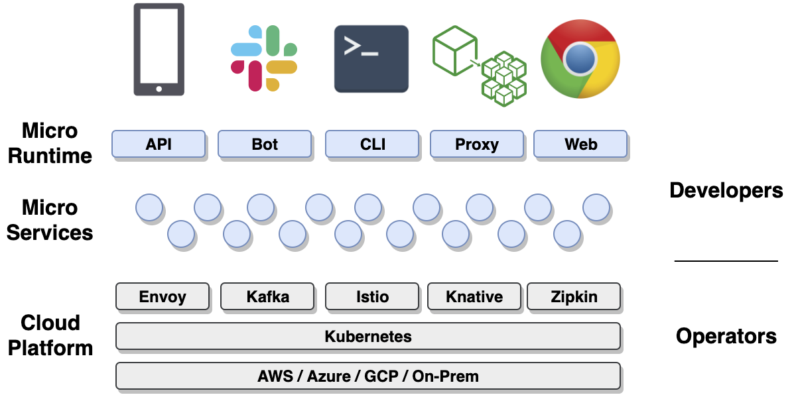

可以使用如下命令安装micro的一系列的工具包：

```go
go get -u github.com/micro/micro
```

#### 1.6.4、Go-micro安装

使用go-micro框架之前，首先需要安装go-micro框架，使用如下命令：

```go
go get github.com/micro/go-micro
```

安装完毕后，能够在$GOPATH目录下面找到go-micro的源码，如下图所示：

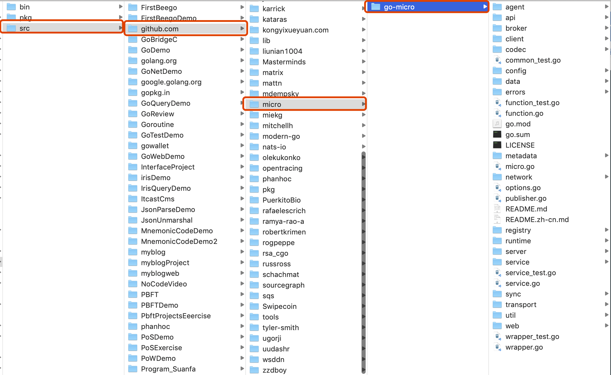

go-micro的源码在github上可以找到，链接如下：[https://github.com/micro/go-micro](https://github.com/micro/go-micro)

## 二、创建微服务

### 2.1、服务的定义

在micro框架中，服务用接口来进行定义，服务被定义为Service，完整的接口定义如下：

```go
type Service interface {
	Init(...Option)
	Options() Options
	Client() client.Client
	Server() server.Server
	Run() error
	String() string
}
```

在该接口中，定义了一个服务实例具体要包含的方法，分别是：Init、Options、Client、Server、Run、String等6个方法。

### 2.2、初始化服务实例

micro框架，除了提供Service的定义外，提供创建服务实例的方法供开发者调用：

```go
service := micro.NewService()
```

如上是最简单一种创建service实例的方式。NewService可以接受一个Options类型的可选项参数。NewService的定义如下：

```go
func NewService(opts ...Option) Service {
	return newService(opts...)
}
```

#### 2.2.1、Options可选项配置

关于Options可配置选项，有很多可以选择的设置项。micro框架包中包含了options.go文件，定义了详细的可选项配置的内容。最基本常见的配置项有：服务名称，服务的版本，服务的地址等：

```go
//服务名称
func Name(n string) Option {
	return func(o *Options) {
		o.Server.Init(server.Name(n))
	}
}

//服务版本
func Version(v string) Option {
	return func(o *Options) {
		o.Server.Init(server.Version(v))
	}
}

//服务部署地址
func Address(addr string) Option {
	return func(o *Options) {
		o.Server.Init(server.Address(addr))
	}
}

//元数据项设置
func Metadata(md map[string]string) Option {
	return func(o *Options) {
		o.Server.Init(server.Metadata(md))
	}
}
```

完整的实例化对象代码如下所示：

```go
func main() {
	//创建一个新的服务对象实例
	service := micro.NewService(
		micro.Name("helloservice"),
		micro.Version("v1.0.0"),
	)
}
```

开发者可以直接调用micro.Name为服务设置名称，设置版本号等信息。在对应的函数内部，调用了server.Server.Init函数对配置项进行初始化。

### 2.3、定义服务接口,实现服务业务逻辑

在前面的课程中，已经学习掌握了使用protobuf定义服务接口，并对服务进行具体实现。使用protobuf定义服务接口并自动生成go语言文件,需要经过以下几个步骤，我们通过示例进行说明：

> 我们依然通过案例来讲解相关的知识点：在学校的教务系统中，有学生信息管理的需求。学生信息包含学生姓名，学生班级，学习成绩组成；可以根据学生姓名查询学生的相关信息，我们通过rpc调用和学生服务来实现该案例。

#### 2.3.1、定义.proto文件

使用proto3语法定义数据结构体和服务方法。具体定义内容如下：

```protobuf
syntax = 'proto3';
package message;

//学生数据体
message Student {
    string name = 1; //姓名
    string classes = 2; //班级
    int32 grade = 3; //分数
}

//请求数据体定义
message StudentRequest {
    string name = 1;
}

//学生服务
service StudentService {
    //查询学生信息服务
    rpc GetStudent (StudentRequest) returns (Student);
}
```

#### 2.3.2、编译.proto文件

在原来学习gRPC框架时，我们是将.proto文件按照grpc插件的标准来进行编译。而现在，我们学习的是go-micro，因此我们可以按照micro插件来进行编译。micro框架中的protobuf插件，我们需要单独安装。

* 安装micro框架的protobuf插件

    ```go
    go get github.com/micro/protobuf/{proto,protoc-gen-go}
    ```

    通过上述命令可以成功安装proto插件,安装成功后可以在本地环境中的$GOPATH目录中的src/github.com/micro/protobuf中看到新安装的插件。源码目录如下图所示：

    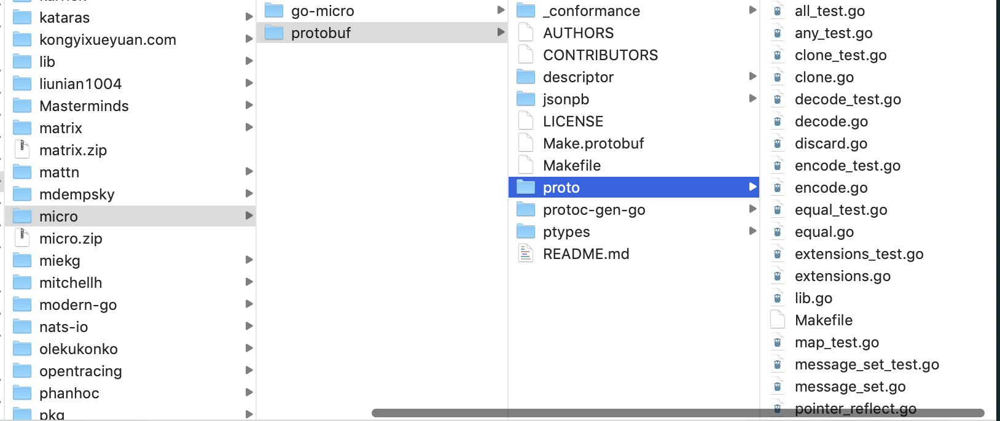

* 指定micro插件进行编译

    ```
    protoc --go_out=plugins=micro:. message.proto
    ```

    上述编译命令执行成功，可以在项目目录下的message目录下生成message.pb.go文件，该文件是由protoc编译器自动编译生成，开发者不能修改。message.pb.go如图所示：

    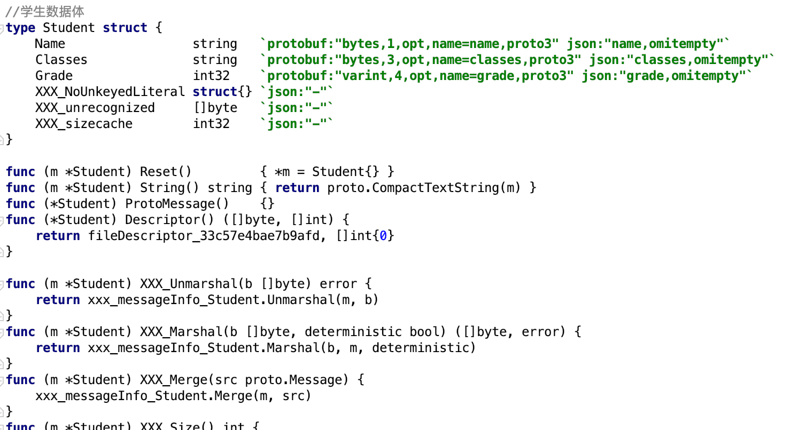

#### 2.3.3、编码实现服务功能

在项目目录下，实现StudentService定义的rpc GetStudent功能。新建studentManager.go文件，具体实现如下：

```go
//学生服务管理实现
type StudentManager struct {
}

//获取学生信息的服务接口实现
func GetStudent(ctx context.Context, request *message.StudentRequest, response *message.Student) error {

	studentMap := map[string]message.Student{
		"davie":  message.Student{Name: "davie", Classes: "软件工程专业", Grade: 80},
		"steven": message.Student{Name: "steven", Classes: "计算机科学与技术", Grade: 90},
		"tony":   message.Student{Name: "tony", Classes: "计算机网络工程", Grade: 85},
		"jack":   message.Student{Name: "jack", Classes: "工商管理", Grade: 96},
	}

	if request.Name == "" {
		return errors.New(" 请求参数错误,请重新请求。")
	}

	student := studentMap[request.Name]

	if student.Name != "" {
		response = &student
	}
	return errors.New(" 未查询当相关学生信息 ")
}
```

### 2.4、运行服务

在之前的学习过程中，我们是通过自己编写server.go程序,注册服务，并实现请求的监听。现在，我们用micro框架来实现服务的运行。完整的运行服务的代码如下：

```go
func main() {

	//创建一个新的服务对象实例
	service := micro.NewService(
		micro.Name("student_service"),
		micro.Version("v1.0.0"),
	)

	//服务初始化
	service.Init()

	//注册
message.RegisterStudentServiceHandler(service.Server(), new(StudentManager))

	//运行
	err := service.Run()
	if err != nil {
		log.Fatal(err)
	}
}
```

### 2.5、客户端调用

客户端可以构造请求对象，并访问对应的服务方法。具体方法实现如下：

```go
func main() {

	service := micro.NewService(
		micro.Name("student.client"),
	)
	service.Init()

	studentService := message.NewStudentServiceClient("student_service", service.Client())

	res, err := studentService.GetStudent(context.TODO(), &message.StudentRequest{Name: "davie"})
	if err != nil {
		fmt.Println(err)
	}
	fmt.Println(res.Name)
	fmt.Println(res.Classes)
	fmt.Println(res.Grade)
}
```

### 2.6、运行结果

#### 2.6.1、运行服务端

运行main.go文件中的main函数,服务注册成功，并输出如下日志：

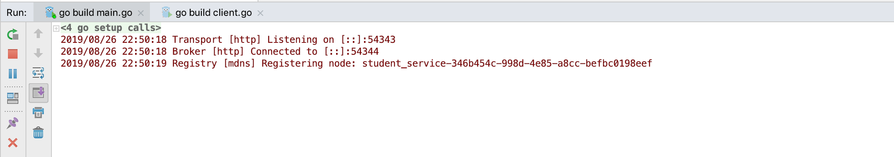

```
2019/08/26 22:50:18 Transport [http] Listening on [::]:54343
2019/08/26 22:50:18 Broker [http] Connected to [::]:54344
2019/08/26 22:50:19 Registry [mdns] Registering node: student_service-346b454c-998d-4e85-a8cc-befbc0198eef
```

#### 2.6.2、运行客户端

客户端负责发起请求和功能调用,运行client.go程序，程序正常输出。

### 2.7、注册服务到consul

#### 2.7.1、默认注册到mdns

在我们运行服务端的程序时，我们可以看到Registry [mdns] Registering node:xxx这个日志,该日志显示go-micro框架将我们的服务使用默认的配置注册到了mdns中。mdns是go-micro的默认配置选项。

#### 2.7.2、注册到consul

在前面的微服务理论课程中，我们已经学习过consul。consul是服务注册与发现的组件,因此，如果我们本地系统已经安装了consul环境，我们可以选择将我们的服务注册到consul中。指定注册到consul时，需要先将consul进行启动。

* 启动consul

    启动命令如下：

    ```
    consul agent -dev
    ```

通过上述命令，我们可以在终端中启动consul。

* 指定服务注册到consul

通过命令运行服务程序，并指定注册到consul，详细命令如下：

```
go run main.go --registry=consul
```

通过--registry选项，指定要注册到的服务发现组件。

* 查看服务

由于consul给我们提供了ui界面，因此我们可以通过浏览器界面来访问consul节点页面。访问本地8500端口,浏览器地址是：

```
http://localhost:8500
```

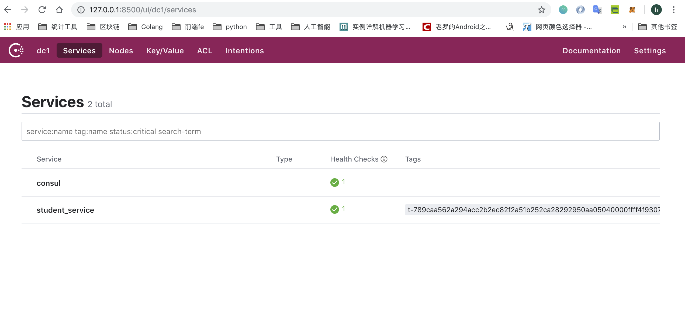

## 三、心跳机制与可选项配置

### 3.1、代码实现consul配置

之前使用的--registry选项配置的形式来指定注册到consul组件中，其实这一配置也可以在代码中进行实现。go-micro在创建服务时提供了很多可选项配置，其中就包含服务组件的指定。指定注册到consul的编程代码实现如下：

```go
...
   //创建一个新的服务对象实例
	service := micro.NewService(
		micro.Name("student_service"),
		micro.Version("v1.0.0"),
		micro.Registry(consul.NewRegistry()),
	)
...
```

通过micro.Registry可以指定要注册的发现组件，这里我们注册到consul，因此调用consul.NewRegistry。

### 3.2、插件化

在前面的go-micro介绍课中，我们提到过go-micro是支持插件化的基础的微服务框架，不仅仅是go-micro，整个的micro都被设计成为"可插拔"的机制。

在上一节课的案例中，我们使用--registry选项指定将服务注册到对应的服务发现组件，我们选择的是注册到consul中。这里的--registry就是是"可插拔"的插件化机制的体现。因为在2019年最新的代码中，go-micro中默认将服务注册到mdns中，同时支持开发者手动指定特定的服务发现组件。

我们可以看到在这个过程中，我们的服务的程序没有发生任何变化，但是却轻松的实现了服务注册发现组件的更换，这就是插件化的优势，利用插件化能最大限度的解耦。

在go-micro框架中，支持consul，etcd，zookeeper，dns等组件实现服务注册和发现的功能。如果有需要，开发者可以根据自己的需要进行服务发现组件的替换。

### 3.3、服务注册发现的原理

让我们再回顾一下服务注册与发现的原理：服务注册发现是将所有的服务注册到注册组件中心，各服务在进行互相调用功能时，先通过查询方法获取到要调用的服务的状态信息和地址，然后向对应的微服务模块发起调用。我们学习过consul的工作原理和环境搭建，consul的工作原理图如下所示：

### 3.4、未发现服务错误

回顾完了服务注册发现的原理，我们就可以知道，如果请求发起端程序不能在服务组件中发现对应的服务，则会产生错误。接下来我们利用程序演示错误。

首先，通过终端命令启动consul节点服务，以方便服务注册：

```
consul agent -dev
```

#### 3.4.1、指定服务程序注册到consul

我们利用已经学习过的服务注册可选项指定注册到consul组件，详细命令如下：

```
go run main.go --registry=consul
```

通过该命令，可以成功将服务注册到consul组件，并启动服务开始运行。

#### 3.4.2、运行客户端服务

由于服务端程序已经注册到consul,因此客户端程序在执行时也需要到consul中查询才能正确执行。运行客户端并注册到consul组件的命令是：

```
go run client.go --registry=consul
```

通过以上命令，程序可以正确得到执行，并输出正确结果。

#### 3.4.3、未发现服务错误

我们可以主动让程序发生错误，来验证未发现的错误，以此来验证我们所学习的服务注册与发现的原理。在执行客户端程序时，我们不指定--registry选项，默认使用mdns，则命令为：

```
go run client.go
```

我们执行上述命令，运行客户端程序。由于我们的客户端程序会连接对应的服务的方法，但是对应的服务并没有注册到mdns中，因此，程序会发生错误。本案例中，客户端程序执行错误如下：

```
{"id":"go.micro.client","code":500,"detail":"error selecting student_service node: not found","status":"Internal Server Error"}
```

我们可以看到，程序返回了错误信息，提示我们服务未找到。

通过这个主动错误的示范，我们能更加深刻的理解go-micro与consul的插件式协同工作和微服务内部的原理。

### 3.5、弊端与解决方法

服务实例与发现组件的工作机制是：当服务开启时，将自己的相关信息注册到发现组件中，当服务关闭时，发送卸载或者移除请求。在实际生产环境中，服务可能会出现很多异常情况，发生宕机或者其他等情况，往往服务进程会被销毁，或者网络出现故障也会导致通信链路发生问题，在这些情况下，服务实例会在服务发现组件中被移除。

#### 3.5.1、TTL和间隔时间

为了解决这个问题，go-micro框架提供了TTL机制和间隔时间注册机制。TTL是Time-To-Live的缩写，指定一次注册在注册组件中的有效期，过期后便会删除。而间隔时间注册则表示定时向注册组件中重新注册以确保服务在线。

* 指令方式

    这两种注册方式都可以通过可选项指令来实现配置，具体的命令如下：

    ```
    go run main.go --registry=consul --register_ttl=10 --register_interval=5
    ```

    该命令表示我们每间隔5秒钟向服务注册组件注册一次，每次有效期限是10秒。

* 编码方式

  除了使用指令的方式以外，还可以在代码中实现这两种参数的设定，在微服务创建时通过配置来完成。具体代码如下：

  ```go
  ...
  service := micro.NewService(
		micro.Name("student_service"),
		micro.Version("v1.0.0"),
		micro.RegisterTTL(10*time.Second),
		micro.RegisterInterval(5*time.Second),
	)
  ...
  ```

  分别通过micro.RegisterTTL和micro.RegisterInterval来实现两个选项的设置。

## 四、解耦利器--事件驱动机制

### 4.1、背景

之前的课程中我们已经学习了使用go-micro创建微服务，并实现了服务的调用。我们具体的实现是实例化了client对象，并调用了对应服务的相关方法。这种方式可以实现系统功能，但有比较大的缺点。

我们通过举例来说明：在某个系统中存在用户服务（user service)、产品服务（product service)和消息服务（message service）。如果用户服务中要调用消息服务中的功能方法，则具体的实现方式可用下图所示方法表示：

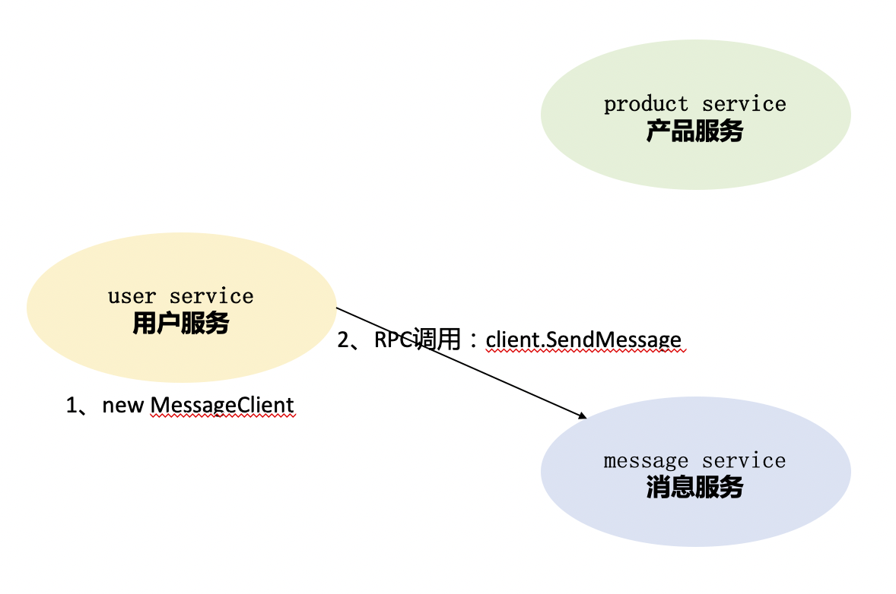

按照正常的实现是在user service模块的程序中实例化message service的一个client，然后进行RPC调用，调用sendMessage来实现发送消息。

#### 4.1.1、缺点

这种实现方式代码耦合度高，用户服务的模块中出现了消息服务模块的代码，不利于系统的扩展和功能的迭代开发。

### 4.2、发布/订阅机制

#### 4.2.1、事件驱动

依然是上述的案例，用户服务在用户操作的过程中，需要调用消息服务的某个方法，假设为发送验证码消息的一个方法。为了使系统代码能够实现解耦，用户服务并不直接调用消息服务的具体的方法，而是将用户信息等相关数据发送到一个中间组件，该组件负责存储消息，而消息服务会按照特定的频率访问中间的消息存储组件，并取出其中的消息,然后执行发送验证码等操作。具体的示意图如下所示：

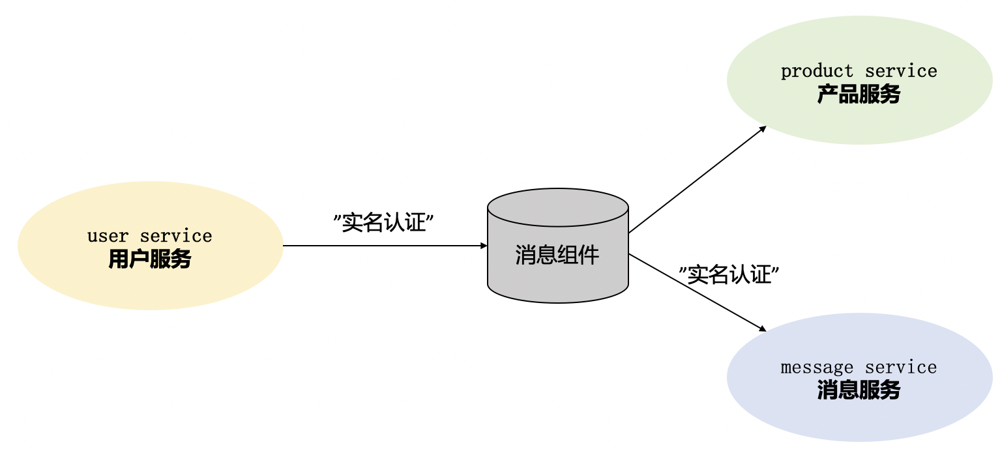

在上述的架构图中，我们可以看到，相较于之前的实现，多了一个中间的消息组件系统。

#### 4.2.2、事件发布

只有当用户服务中的某个功能执行时，才会触发相应的事件，并将对应的用户数据等消息发送到消息队列组件中，这个过程我们称之为事件发布。

#### 4.2.3、事件订阅

与事件发布对应的是事件订阅。我们增加消息队列组件的目的是实现模块程序的解耦，原来是程序调用端主动进行程序调用，现在需要由另外一方模块的程序到消息队列组件中主动获取需要相关数据并进行相关功能调用。这个主动获取的过程称之为订阅。

基于消息发布/订阅的消息系统有很多种框架的实现，常见的有：Kafka、RabbitMQ、ActiveMQ、Kestrel、NSQ等。

### 4.3、Broker

在我们介绍go-micro的时已经提到过，go-micro整个框架都是插件式的设计。没错，这里的发布/订阅也是通过接口设计来实现的。

#### 4.3.1、定义

```go
type Broker interface {
	Init(...Option) error
	Options() Options
	Address() string
	Connect() error
	Disconnect() error
	Publish(topic string, m *Message, opts ...PublishOption) error
	Subscribe(topic string, h Handler, opts ...SubscribeOption) (Subscriber, error)
	String() string
}
```

如果我们要具体实现事件的发布和订阅功能，只需要安装对应支持的go-plugins插件实现就可以了。go-plugins里支持的消息队列方式有：kafka、nsq、rabbitmq、redis等。同时，go-micro本身支持三种broker，分别是http、nats、memory，默认的broker是http，在实际使用过程中往往使用第三方的插件来进行消息发布/订阅的实现。

在本课程中，我们演示RabbitMQ插件实现的事件订阅和发布机制。

### 4.4、安装go-plugins

在go-micro框架的学习过程中，需要频繁的用到相关的插件。因此，首先安装go-plugins插件库，在go-plugins插件库中，封装提供了go-micro框架中的插件机制的实现方案。

#### 4.4.1、源码库

在github网站上能够找到对应的go-plugins插件库的源码，源码地址是：[https://github.com/micro/go-plugins](https://github.com/micro/go-plugins)

#### 4.4.2、安装

```go
go get github.com/micro/go-plugins
```

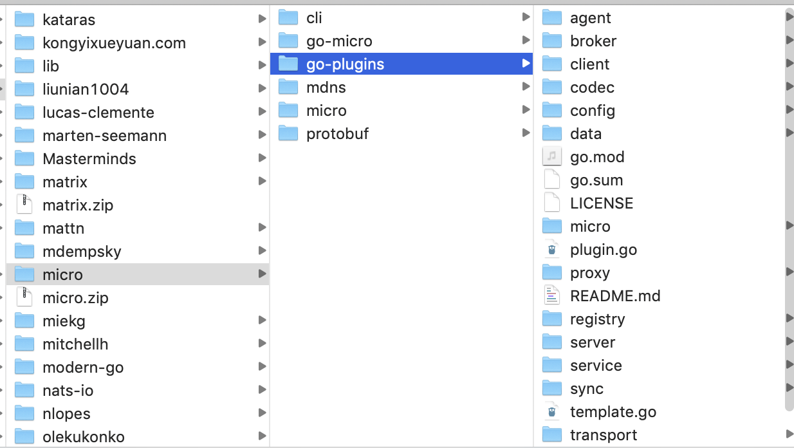

可以通过上述的命令安装micro的插件库，安装以后可以在当前系统的$GOPATH/src/github.com/micro目录中找到对应的插件库源码。

#### 4.4.3、Broker实现

在已经安装和下载的go-plugins插件库中,我们可以看到有一个broker目录，其中就封装了go-micro框架的broker机制支持的解决方案。

我们在本案例中，以mqtt进行讲解。

### 4.5、MQTT介绍及环境搭建

#### 4.5.1、MQTT简介

MQTT全称是Message Queuing Telemetry Transport，翻译为消息队列遥测传输协议，是一种基于发布/订阅模式的"轻量级"的通讯协议，该协议基于TCP/IP协议，由IBM在1999年发布。MQTT的最大优点在于，可以用极少的代码和有限的宽带,为连接远程设备提供提供实时可靠的消息服务。

#### 4.5.2、MQTT安装

在MacOS系统下，安装MQTT的服务器Mosquitto。可以在MacOS终端中使用命令进行安装：

```
brew install mosquitto
```

#### 4.5.3、运行mosquitto

在MacOS系统中安装成功以后，可以通过命令进行启动mosquitto，具体操作命令如下：

```
$cd /usr/local/
$./sbin/mosquitto -c etc/mosquitto/mosquitto.conf -d -v
```

启动成功后，会在终端中有如下所示的日志输出：

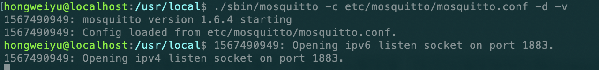

出现如上图所示的输出内容，即表示mqtt启动成功。

windows系统上的mqtt的安装和启动，可以到[https://activemq.apache.org/](https://activemq.apache.org/)中下载最新的安装文件，然后进行安装和运行。

### 4.6、编程实现

接下来进行订阅和发布机制的编程的实现。

#### 4.6.1、消息组件初始化

如果要想使用消息组件完成消息的发布和订阅，首先应该让消息组件正常工作。因此，需要先对消息组件进行初始化。我们可以在服务创建时，对消息组件进行初始化，并进行可选项配置,设置使用mqtt作为消息组件。代码实现如下：

```go
...
server := micro.NewService(
		micro.Name("go.micro.srv"),
		micro.Version("latest"),
		micro.Broker(mqtt.NewBroker()),
)
...
```

可以使用micro.Broker来指定特定的消息组件，并通过mqtt.NewBroker初始化一个mqtt实例对象,作为broker参数。

#### 4.6.2、消息订阅

因为是事件驱动机制，消息的发送方随时可能发布相关事件。因此需要消息的接收方先进行订阅操作，避免遗漏消息。go-micro框架中可以通过broker.Subscribe实现消息订阅。编程代码如下所示：

```go
...
pubSub := service.Server().Options().Broker
_, err := pubSub.Subscribe("go.micro.srv.message", func(event broker.Event) error {
		var req *message.StudentRequest
		if err := json.Unmarshal(event.Message().Body, &req); err != nil {
			return err
		}
		fmt.Println(" 接收到信息：", req)
		//去执行其他操作

		return nil
	})
...
```

#### 4.6.3、消息发布

完成了消息的订阅，我们再来实现消息的发布。在客户端实现消息的发布。在go-micro框架中，可以使用broker.Publish来进行消息的发布,具体的代码如下：

```go
...

brok := service.Server().Options().Broker
if err := brok.Connect(); err != nil {
	log.Fatal(" broker connection failed, error : ", err.Error())
}

student := &message.Student{Name: "davie", Classes: "软件工程专业", Grade: 80, Phone: "12345678901"}
msgBody, err := json.Marshal(student)
if err != nil {
	log.Fatal(err.Error())
}
msg := &broker.Message{
	Header: map[string]string{
		"name": student.Name,
	},
	Body: msgBody,
}

err = brok.Publish("go.micro.srv.message", msg)
if err != nil {
	log.Fatal(" 消息发布失败：%s\n", err.Error())
} else {
	log.Print("消息发布成功")
}

...
```

### 4.7、运行程序

#### 4.7.1、启动mqtt服务器

mqtt服务器默认会在1883端口进行监听。

#### 4.7.2、启动server程序

首先运行server端程序的main.go文件中的main函数。

#### 4.7.3、错误

在运行main.go程序时，会报如下错误：cannot find package "github.com/eclipse/paho.mqtt.golang"：

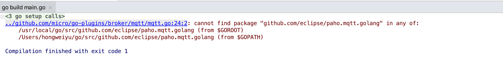

需要我们安装对应的包源码，该包的源码地址在github地址代码库中：[https://github.com/eclipse/paho.mqtt.golang](https://github.com/eclipse/paho.mqtt.golang)，安装命令如下：

```go
go get github.com/eclipse/paho.mqtt.golang
```

安装成功后，可以在本地环境中的 GOPATH 目录下看到已安装的包源码，如下图所示：

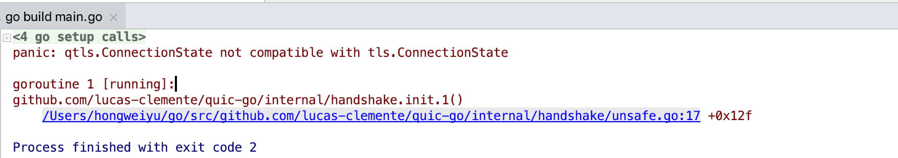

包安装后，可以执行server.go文件中的main函数，启动程序如下：


#### 4.7.4、启动client程序

server程序启动后，启动客户端程序client.go，可以输出正确日志。另外可以在mqtt终端中输出相关的消息订阅和发布的日志，如下图所示：

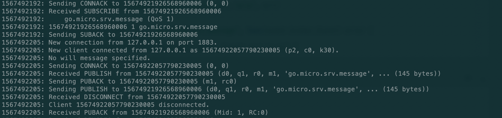

### 4.8、弊端

在服务端通过fmt.println日志，可以输出event.Message().Body)数据，其格式为：

```
{"name":"davie","classes":"软件工程专业","grade":80,"phone":"12345678901"}
```

我们可以看到在服务实例之间传输的数据格式是json格式。根据之前学习proto知识可以知道，在进行消息通信时，采用JSON格式进行数据传输，其效率比较低。

因此，这意味着，当我们在使用第三方消息组件进行消息发布/订阅时，会失去对protobuf的使用。这对追求高效率的开发者而言，是需要解决和改进的问题。因为使用protobuf可以直接在多个服务之间使用二进制流数据进行传输，要比json格式高效的多。

### 4.9、googlepubsub

在go-micro框架中内置的Broker插件中，有google提供的googlepubsub插件实现，位于代理层之上，同时还省略了使用第三方代理消息组件（如mqtt)。

参考资料：[https://cloud.google.com/pubsub/](https://cloud.google.com/pubsub/)。感兴趣的同学可以自己动手实现，此处我们作为拓展思路，不再进行实现。

## 五、Micro负载均衡组件--Selector

### 5.1、背景

在Go-micro中的介绍课程中，我们说过go-micro具备负载均衡功能。所谓负载均衡，英文为Load Balance，其意思是将负载进行平衡、分摊到多个操作单元上进行执行。例如Web服务器，应用服务器，微服务程序服务器等，以此来完成达到高并发的目的。

当只有一台服务部署程序时，是不存在负载均衡问题的，此时所有的请求都由同一台服务器进行处理。随着业务复杂度的增加和功能迭代，单一的服务器无法满足业务增长需求，需要靠分布式来提高系统的扩展性，随着而来的就是负载均衡的问题。因此需要加入负载均衡组件或者功能，两者的区别和负载均衡的作用如下所示：

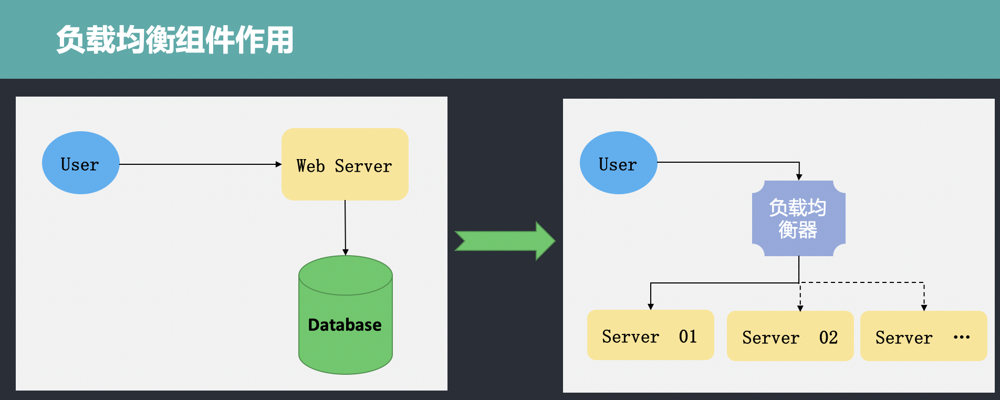

从图中可以看到，用户先访问负载均衡器，再由负载均衡器对请求进行处理，进而分发到不同的服务器上的服务程序进行处理。

负载均衡器主要处理四种请求，分别是：HTTP、HTTPS、TCP、UDP。

### 5.2、负载均衡算法

负载均衡器的作用既然是负责接收请求，并实现请求的分发，因此需要按照一定的规则进行转发处理。负载均衡器可以按照不同的规则实现请求的转发，其遵循的转发规则称之为负载均衡算法。常用的负载均衡算法有以下几个：

* Round Robin（轮训算法）：所谓轮训算法，其含义很简单，就是按照一定的顺序进行依次排队分发。当有请求队列需要转发时，为第一个请求选择可用服务列表中的第一个服务器，为下一个请求选择服务列表中的第二个服务器。按照此规则依次向下进行选择分发，直到选择到服务器列表的最后一个。当第一次列表转发完毕后，重新选择第一个服务器进行分发，此为轮训。

* Least Connections（最小连接）：因为分布式系统中有多台服务器程序在运行，每台服务器在某一个时刻处理的连接请求数量是不一样的。因此，当有新的请求需要转发时，按照最小连接数原则，负载均衡器会优先选择当前连接数最小的服务器，以此来作为转发的规则。

* Source（源）：还有一种常见的方式是将请求的IP进行hash计算，根据计算结果来匹配要转发的服务器，然后进行转发。这种方式可以一定程度上保证特定用户能够连接到相同的服务器。

### 5.3、Micro的Selector

Selector的英文是选择器的意思，在Micro中实现了Selector组件，运行在客户端实现负载均衡功能。当客户端需要调用服务端方法时，客户端会根据其内部的selector组件中指定的负载均衡策略选择服务注册中的一个服务实例。Go-micro中的Selector是基于Register模块构建的，提供负载均衡策略，同时还提供过滤、缓存和黑名单等功能。

### 5.4、Selector定义

首先，让我们来看一下Selector的定义：

```go
type Selector interface {
	Init(opts ...Option) error
	Options() Options
	// Select returns a function which should return the next node
	Select(service string, opts ...SelectOption) (Next, error)
	// Mark sets the success/error against a node
	Mark(service string, node *registry.Node, err error)
	// Reset returns state back to zero for a service
	Reset(service string)
	// Close renders the selector unusable
	Close() error
	// Name of the selector
	String() string
}
```

如上是go-micro框架中的Selector的定义，Selector接口定义中包含Init、Options、Mark、Reset、Close、String方法。其中Select是核心方法，可以实现自定义的负载均衡策略，Mark方法用于标记服务节点的状态,String方法返回自定义负载均衡器的名称。

### 5.5、DefaultSelector

在selector包下，除Selector接口定义外，还包含DefaultSelector的定义，作为go-micro默认的负载均衡器而被使用。DefaultSelector是通过NewSelector函数创建生成的。NewSelector函数实现如下:

```go
func NewSelector(opts ...Option) Selector {
	sopts := Options{
		Strategy: Random,
	}

	for _, opt := range opts {
		opt(&sopts)
	}

	if sopts.Registry == nil {
		sopts.Registry = registry.DefaultRegistry
	}

	s := &registrySelector{
		so: sopts,
	}
	s.rc = s.newCache()

	return s
}
```

在NewSelector中，实例化了registrySelector对象并进行了返回,在实例化的过程中，配置了Selector的Options选项，默认的配置是Random。我们进一步查看会发现Random是一个func，定义如下：

```go
func Random(services []*registry.Service) Next {
	var nodes []*registry.Node

	for _, service := range services {
		nodes = append(nodes, service.Nodes...)
	}

	return func() (*registry.Node, error) {
		if len(nodes) == 0 {
			return nil, ErrNoneAvailable
		}

		i := rand.Int() % len(nodes)
		return nodes[i], nil
	}
}
```

该算法是go-micro中默认的负载均衡器，会随机选择一个服务节点进行分发；除了Random算法外，还可以看到RoundRobin算法，如下所示：

```go
func RoundRobin(services []*registry.Service) Next {
	var nodes []*registry.Node

	for _, service := range services {
		nodes = append(nodes, service.Nodes...)
	}

	var i = rand.Int()
	var mtx sync.Mutex

	return func() (*registry.Node, error) {
		if len(nodes) == 0 {
			return nil, ErrNoneAvailable
		}

		mtx.Lock()
		node := nodes[i%len(nodes)]
		i++
		mtx.Unlock()
		return node, nil
	}
}
```

### 5.6、registrySelector

registrySelector是selector包下default.go文件中的结构体定义，具体定义如下:

```go
type registrySelector struct {
	so Options
	rc cache.Cache
}
```

#### 缓存Cache

目前已经有了负载均衡器，我们可以看到在Selector的定义中，还包含一个cache.Cache结构体类型，这是什么作用呢？

有了Selector以后，我们每次请求负载均衡器都要去Register组件中查询一次，这样无形之中就增加了成本，降低了效率，没有办法达到高可用。为了解决以上这种问题，在设计Selector的时候设计一个缓存，Selector将自己查询到的服务列表数据缓存到本地Cache中。当需要处理转发时，先到缓存中查找，如果能找到即分发；如果缓存当中没有，会执行请求服务发现注册组件，然后缓存到本地。

具体的实现机制如下所示：

```go
type Cache interface {
	// embed the registry interface
	registry.Registry
	// stop the cache watcher
	Stop()
}

func (c *cache) watch(w registry.Watcher) error {
	// used to stop the watch
	stop := make(chan bool)

	// manage this loop
	go func() {
		defer w.Stop()

		select {
		// wait for exit
		case <-c.exit:
			return
		// we've been stopped
		case <-stop:
			return
		}
	}()

	for {
		res, err := w.Next()
		if err != nil {
			close(stop)
			return err
		}
		c.update(res)
	}
}
```

通过watch实现缓存的更新、创建、移除等操作。

#### 黑名单

在了解完了缓存后，我们再看看Selector中其他的方法。在Selector接口的定义中，还可以看到有Mark和Reset方法的声明。具体声明如下：

```go
// Mark sets the success/error against a node
Mark(service string, node *registry.Node, err error)
// Reset returns state back to zero for a service
Reset(service string)
```

Mark方法可以用于标记服务注册和发现组件中的某一个节点的状态，这是因为在某些情况下，负载均衡器跟踪请求的执行情况。如果请求被转发到某个服务节点上，多次执行失败，就意味着该节点状态不正常，此时可以通过Mark方法设置节点变成黑名单，以过滤掉状态不正常的节点。
