# 微服务概述

## 一、微服务简介-构建单体应用

互联网技术发展迅速的今天，微服务倍受关注。无论是炒作还是怀疑，不可否认，微服务架构模式具有非常明显的优势 —- 特别是在实施敏捷开发和复杂的企业应用迭代开发方面。

### 1.1、单体应用

我们先不问微服务是什么，让我们从最熟悉的创建一个应用和一个普通的项目开始说起。

#### 1.1.1、打车系统

我们假设要开始开发一个打车应用，目标是与Uber和DiDi竞争。经过讨论和技术选型，我们开始手动开发生成一个新项目，该新应用有一个模块化的六边形架构，如下图所示：

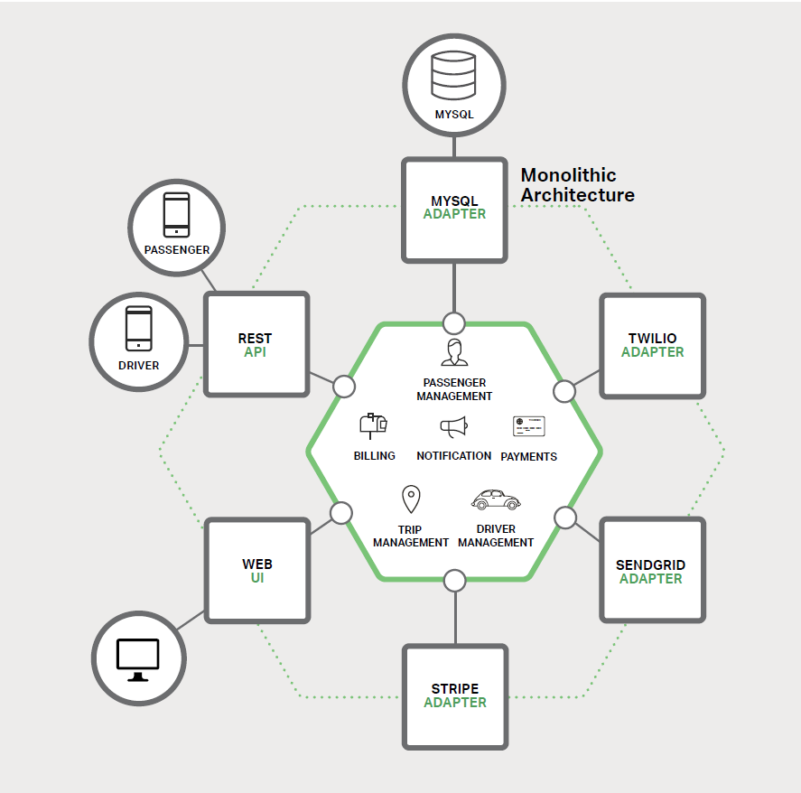

该应用的核心是由**模块**实现的业务逻辑。它定义了**服务、领域对象和事件**。围绕核心的是与外部世界接口对接的适配器。适配器示例包括数据库访问组件、生产和消费消息的消息组件和暴露了 API 或实现了一个 UI 的 web 组件。

* **单体应用：**所谓的单体应用就是指一个war包包含了项目的所有功能。比如上述举例的打车应用，尽管有一个逻辑模块化架构，但应用程序被作为一个单体进行打包和部署。例如，我们所熟知的许多Java应用程序被打包成WAR文件部署在如Tomcat或者Jetty之类的应用服务器上。其他Java应用程序被打包成可执行JAR包。

* **单体应用的特点：**
    * **容易开发：**开发者只需要在专用的开发工具上（比如Eclipse，myEclipse)等就可以管理整个项目代码，完成代码开发工作。
    * **容易运行和测试：**既然我们能够在本地开发工具上完成整个项目的功能开发和调试，自然也就很容易在我们本地环境上进行测试调试。
    * **容易部署：**当应用程序开发、调试、测试完成以后，只需要将代码进行打包，然后将打包好的应用程序拷贝到服务器上进行部署即可。

#### 1.1.2、互联网公司架构

再比如，我们拿一个常见的互联网公司的静态逻辑架构来举例，将系统切分成五层，如下图所示：

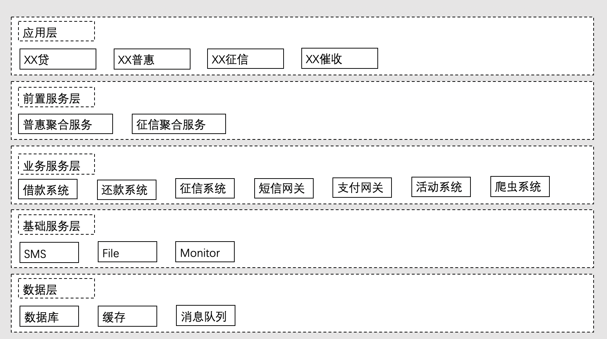

* **应用层：**面向客户的最终软件产品，直接暴露给互联网的各种App、Web站点以及Wap站点。
* **前置服务层：**各种重业务的聚合入口，对具体引用层做大量工作，实现业务调用链条的封装，达成业务逻辑的强实现。
* **业务服务层：**包含各种基础的业务服务单元，比如借款系统、还款系统、征信系统、活动系统、爬虫系统、引流系统、文件系统等。
* **基础服务层：**不包含状态的基础业务服务，包括但不限于短信网关、文件网关、服务监控等。
* **数据层：**包括各种形态的数据存储层，但不限于各种数据库、缓存、消息队列等。

如上我们从传统的构建项目应用和项目架构拆解的角度来解释了什么是单体应用，单体的特点以及传统的应用的架构设计。类似的单体应用在我们以往的互联网发展和企业应用中使用的非常普遍。

但是，随着需求的增长，业务的变化，单体应用在慢慢发展和迭代后，也会遇到一些问题，单体应用的瓶颈会逐步显现。

## 二、微服务简介--走向单体地狱

当我们的应用刚开始起步，业务功能少，代码量可控时，我们还能正常的开发。但是，随着系统业务的不断增长，代码量不断增加，我们维护创建的单体应用系统的性能和维护成本都会受到限制，限制了我们继续新增新业务的能力。

### 2.1、单体应用发展趋势

成功的应用有一个趋势，整个项目随着时间推移会变得越来越臃肿。而开发团队在每个迭代开发周期中都要实现更多的用户需求，这意味着需要添加许多行代码。当原来的单体应用运行维护几年之后，小而简单的应用将会逐渐成长成一个庞大的应用。

### 2.2、问题与困境

一旦应用程序成为了一个庞大、复杂的单体应用，整个开发团队可能就会陷入一个痛苦的境地：

* **敏捷开发受挫**

    **主要问题是：应用程序实在非常复杂，其对于任何一个开发人员来说显得过于庞大**。最终，正确修复 bug 和实现新功能变得非常困难而耗时。就拿应用启动时间这一项指标来说，应用程序越大，启动时间越长。如果开发人员经常要重启应用服务器，那么很大一部分时间都是在等待中度过，这将极大的影响我们的工作效率。

* **持续部署受挫**

    另一个大问题是，复杂的单体应用本身就是持续部署的障碍。如今，SaaS（Software-as-a-Service软件即服务）应用发展到了可以每天多次将变更推送到生产环境。这对于复杂的单体来说非常困难，因为这需要重新部署整个应用程序才能更新其中任何一部分。此外，因变更所产生的影响通常不是很明确，开发者很可能需要做大量的手工测试。因此，持续部署是不可能做到的。

* **应用难以扩展**

    当不同模块存在资源需求冲突时，单体应用可能难以扩展。例如，一个模块可能会进行密集型图像处理逻辑，理想情况下是部署在云服务器A实例中；另一个模块可能是一个内存数据库，最适合部署到云服务器B实例中。但是，由于这些模块是属于同一个应用，只能被部署在一起，此时就要求运维人员必须在硬件选择上做出妥协和让步。

* **可靠性低**

    单体应用的另一个问题是可靠性低。因为所有模块都运行在同一进程中。任何模块的一个 bug，比如内存泄漏，可能会拖垮整个进程。此外，由于应用程序的所有实例都是相同的，该错误将影响到整个应用的可用性，对整个应用都造成影响。

* **技术升级困难**

    单体应用因为体积庞大，使得采用新框架和语言变得非常困难。假设有50万行代码使用了某个框架编写。如果使用较新的一个框架来重写整个应用，这将非常昂贵（在时间和成本方面）。

最后，经过了上面几个方面的问题的罗列，我们总结一下：当我们开发个业务量小，功能适量的一个项目应用时，通过单体应用的开发，就可以满足我们的开发需求，实现业务功能。当业务量快速增长，系统持续开发迭代时，我们的应用体积和业务复杂程度会越来越高，以至于影响开发人员的开发效率，提高了项目的维护成本，我们的项目会遇到各种瓶颈问题，应用程序的持续扩展能力受到限制，性能也因此受到影响。

既然实际生产环境中遇到了这样的难题，作为项目管理者和项目开发者，就必须想办法解决出现的这些问题。答案是**微服务**。

## 三、微服务简介--解决复杂问题

许多大公司如阿里巴巴，腾讯，微博，滴滴等，已经采用现在所谓的微服务架构模式解决了前文所提到的单体应用遇到的种种问题。主要的思路：**将应用程序分解成一套较小的互连服务。**

### 3.1、微服务解决方案

**一个服务通常实现了一组不同的特性或功能，例如订单管理、客户管理等。每一个微服务都是一个小型迷你应用，在需要依赖的地方，通过REST API连接其他所需要的服务执行业务逻辑。**

* **微服务架构**

    一些微服务会向外暴露一组供其他模块访问和使用的API。其他微服务实现了自己的业务逻辑，在必要时，可以通过API进行业务逻辑访问。比如，之前提到的单体应用，通过拆解后，可以变成如下的架构：

    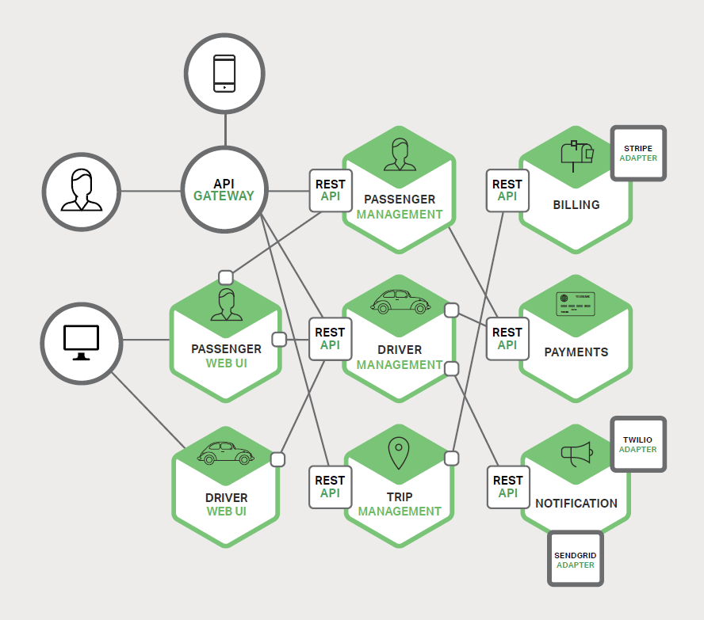

    具体的表现为：**应用程序的每个功能区域现在都由自己的微服务实现。**例如，以我们的出租车系统为例，一个是乘客的应用，一个是司机的应用。这使得它更容易地为特定的用户、司机、设备或者专门的用例部署不同的场景。每个后端服务暴露一个REST API，大部分服务消费的API由其他服务提供。例如，Driver Management 使用了 Notification 服务器来通知可用司机一个可选路程。UI服务调用了其他服务来渲染页面。

* **微服务与数据库的关系**

    既然我们将微服务架构模式明显影响到了应用程序与数据库之间的关系，与其他共享单个数据库模式服务有所不同，其每一个服务都有自己的数据库模式。一方面，这种做法与企业级数据库数据模型的想法相背，此外，它经常导致部分数据冗余。对于微服务架构而言，每一个服务都应该有自己的数据库模式，因为它能实现松耦合。如下图所示：

    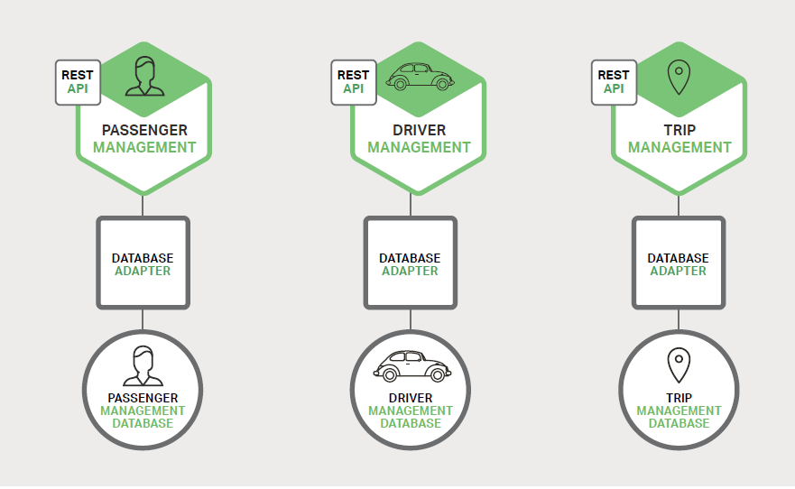

    这种模式下设计架构的特点是每个服务都拥有各自的数据库。而且，服务可以使用一种最适合其需求、号称多语言持久架构的数据库。比如，Driver Management要找到与潜在乘客接近的司机，就必须使用支持高效地理查询的数据库。

**【补充：伸缩立方】**

无论是单体应用还是微服务架构的应用，在实际的生产环境和数据量增加时，都会面临着应用扩展的需要。在进行系统伸缩性的探索上，有不同的方法。通常，我们常见的提高系统伸缩性能的方法有以下几种：

* 通过负载均衡器后运行的多个拷贝构成，有N份拷贝，则每份负责处理1/N的负载。比如，当我们的系统流量过大时，我们常常会部署到多个Tomcat上，这些Tomcat均挂载在同一台负载均衡器上，这样每一台Tomcat所处理的业务量就降低为原来的一部分。如下图所示：

    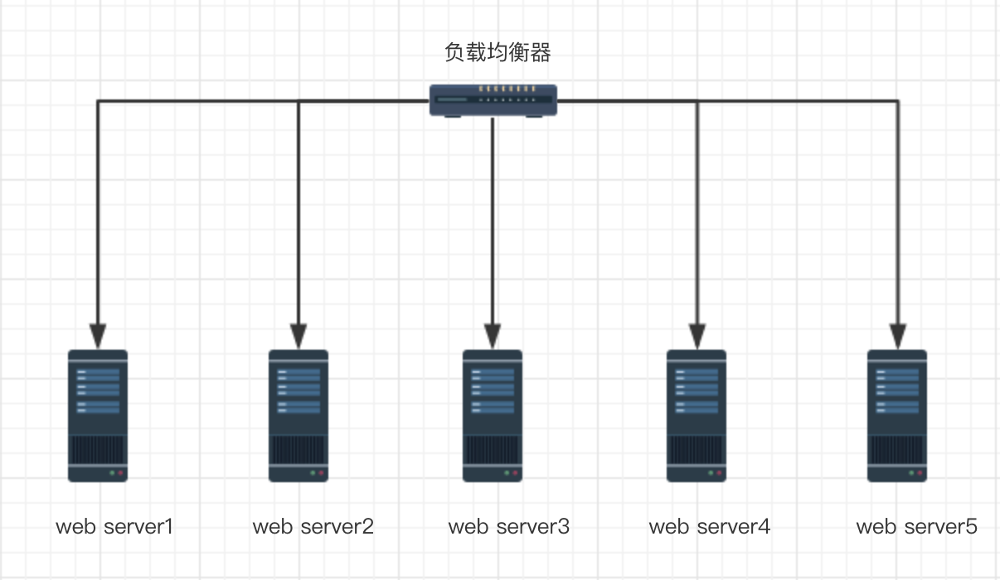

* 对数据库进行分解。原来是所有的业务和功能都存放在统一的数据库中，比如叫db1。为了提高系统性能，提高处理数据的能力，可以将原本是耦合、依赖在同一个系统中的业务模块拆分为小规模的多个业务模块，也就是我们说的微服务的实现架构，每个微服务都只实现核心功能。在拆分的过程中，因为每个微服务是独立部署的，所以订单模块对应的订单表存在于一个数据库db1中，支付模块所对应的支付表存在于另外一个数据库db2中。这样就完成了由一个数据库到多个数据库的拆分。如下图所示：

    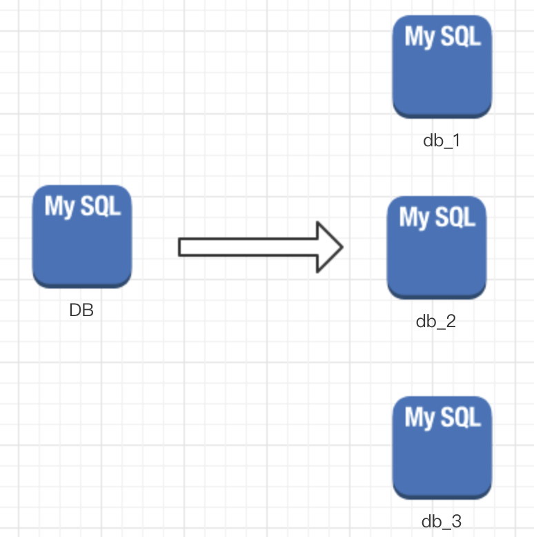

* 对数据表进行拆分。数据库中，同一张表格的数据量过大时，我们的查询等业务在操作数据库时会变得效率下降，我们需要通过其他的方式来提高数据库操作的效率。解决这种同一张表数据的数据量过大的问题，通过拆表来解决。比如我们将0-10000000的数据存放在第1个表中，将10000001-20000000数据存放在第2个表中，依次类推。如下图所示：

    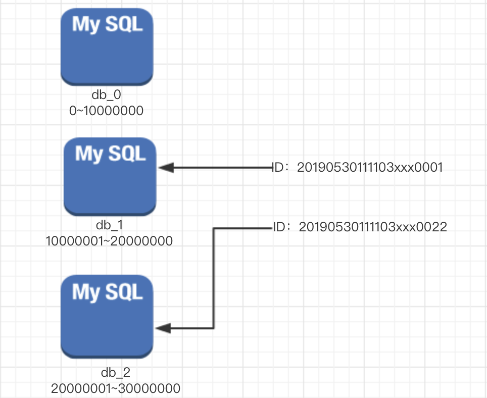

##### **伸缩立方**

伸缩立方是一本技术书籍中提出的概念，这本书的名称为《The Art of Scalability》。

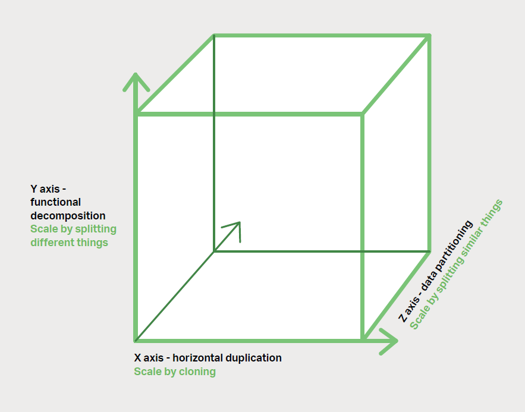

在上述伸缩立方的表当中，分为X轴，Y轴，Z轴。具体轴的方案如下：

* **X轴：**运行多个负载均衡器后的多个实例。
* **Y轴：**对应用进一步分解为微服务（分库）
* **Z轴：**大数据量时，对数据进行分区（分表）

### 3.2、微服务的优缺点

* **微服务优点**
    * **解决复杂问题。**微服务架构把可能会变得庞大的单体应用程序分解成一套服务。虽然功能数量不变，但是应用程序已经被分解成可管理的块或者服务。每个服务都有一个明确定义边界的方式，如远程过程调用（RPC）驱动或API。微服务架构模式强制一定程度的模块化。
    * **团队分工协作更容易。**微服务这种架构使得每个服务都可以由一个团队独立专注开发。开发者可以自由选择任何符合服务API的技术。
    * **独立部署。**微服务架构模式可以实现每个微服务独立部署。开发人员根本不需要去协调部署本地变更到服务。这些变更一经测试即可立即部署。
    * **程序扩展能力强。**微服务架构模式使得每个服务能够独立扩展。开发者可以仅部署满足每个服务的容量和可用性约束的实例数目。

* **微服务缺点**
    * **规模难以界定。**以微服务架构为主的设计模式重点过于强调拆分和微型，以至于会导致一个大型项目会被拆分出很多的微服务实例。在拆分的过程中，如何定义微服务迷你应用的规模，往往存在着不同的标准。我们需要强调的是：**微服务仅仅是一种技术手段，而不是主要目标。**微服务的目标在于充分分解应用程序以方便应用敏捷开发和部署。
    * **增加系统复杂度。**因为微服务是独立部署，拆分成各个功能服务实例。因此，原本的单体应用就变成了一个分布式系统，如何管理这个分布式系统，无形之中增加了原有应用程序的复杂度。
    * **分区数据库架构难题。**在原来的单体应用下，比较容易实现，我们只需要操作不同的实体表就可以实现，但是在微服务架构中，因为数据存储是独立存储和部署，这导致我们在某个业务中更新多个模块数据时，我们需要调用不同的微服务接口API依次更新。
    * **项目测试难度增加。**在原来的单体应用中，开发者可以通过在统一的测试目录下统一编写测试用例和测试方法。相比较而言，如果我们要进行微服务的功能测试，就需要将所依赖的所有的微服务都要启动起来才能执行。
    * **多服务修改更加困难。**在微服务中，当我们需要横跨多个微服务实例间进行业务调整时，就需要仔细认真规划和协调，以便完成整个业务的调整。
    * **微服务需要进行多次部署。**将程序改为微服务架构以后，应用程序的数量就变多了，这样在整体运行时就需要部署多次。

以上几点是微服务架构不足的地方。我们必须要辩证的看待和使用微服务，本质上它是一项技术，我们要利用微服务技术解决现实项目中的问题。

## 四、微服务的概念与微服务架构实践的问题

### 4.1、微服务的定义

结合微服务之父Martin先生给微服务的定义：**将一个单体应用拆分成一组微小的服务组件，每个微小的服务组件运行在自己的进程上，组件之间通过如RESTful API这样的轻量级机制进行交互，这些服务以业务能力为核心，用自动化部署机制独立部署，另外，这些服务可以用不同的语言进行研发，用不同技术来存储数据。**通过以上的定义描述，我们可以基本确定微服务的特征，如下所示：

* 在分布式环境中，将单体应用拆分为一系列服务，共同组成整个系统。
* 每个服务都轻量级，单独部署，运行在自己的进程中。
* 每个微服务注重自己的核心能力的开发，微服务组件之间采用轻量级通信方式进行通信，包括但不限于RESTful API。
* 按照业务边界进行划分。
* 微服务是一种编程架构思想，有不同的语言实现。

### 4.2、微服务实践要解决的问题

用微服务来进行实践到生产项目中，首先要解决一些问题。比如下图的微服务业务架构：

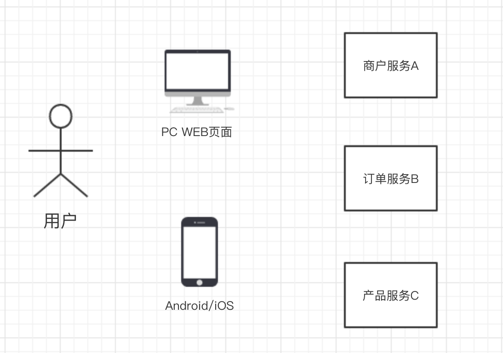

在上图图表展示的架构图中，我们假设将业务商户服务A、订单服务B和产品服务C分别拆分为一个微服务应用，单独进行部署。此时，我们面临很多要可能出现的问题要解决，比如：

* **1、客户端如何访问这些服务？**
* **2、每个服务之间如何进行通信？**
* **3、多个微服务，应如何实现？**
* **4、如果服务出现异常宕机，该如何解决？**

#### 4.2.1、客户端如何访问服务

在单体应用开发中，所有的服务都是本地的，前端UI界面，移动端APP程序可以直接访问后端服务器程序。

现在按功能拆分成独立的服务，跑在独立的进程中。如下图所示：

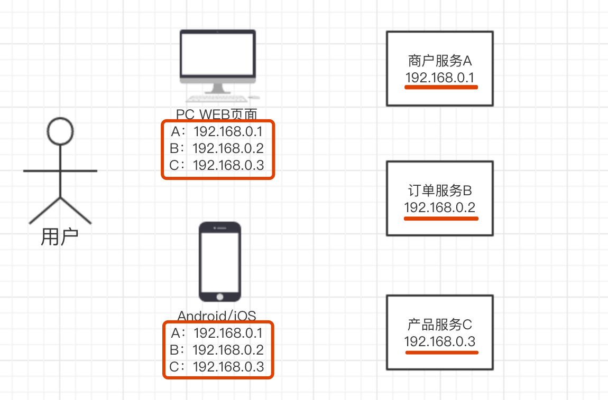

此时，后台有N个服务，前台就需要记住管理N个服务，一个服务**下线**、**更新**、**升级**，前台和移动端APP就要重新部署或者重新发包，这明显不服务我们拆分的理念。

除了访问管理出现困难以外，N个小服务的调用也是一个不小的网络开销。另外，一般微服务在系统内部，通常是无状态的，而我们的用户在进行业务操作时，往往是跨业务模块进行操作，且需要是有状态的，在此时的这个系统架构中，也无法解决这个问题。传统的用来解决用户登录信息和权限管理通常有一个统一的地方维护管理（OAuth），我们称之为授权管理。

基于以上列出的问题，我们采用一种叫做网关（英文为API Gateway）的技术方案来解决这些问题，网关的作用主要包括：

* **提供统一服务入口，让微服务对前台透明**
* **聚合后台的服务，节省流量，提升性能**
* **提供安全，过滤，流控等API管理功能**

网关(API Gateway)可以有很多广义的实现办法，可以是一个软硬一体的盒子，也可以是一个简单的MVC框架，甚至是一个Node.js的服务端。他们最重要的作用是为前台（通常是移动应用）提供后台服务的聚合，提供一个统一的服务出口，解除他们之间的耦合，不过API Gateway也有可能成为**单点故障**点或者性能的瓶颈。

最终，添加了网关(API Gateway)的业务架构图变更为如下所示：


#### 4.2.2、服务之间如何通信

所有的微服务都是独立部署，运行在自己的进程容器中，所以微服务与微服务之间的通信就是IPC（Inter Process Communication），翻译为进程间通信。进程间通信的方案已经比较成熟了，现在最常见的有两大类：**同步调用、异步消息调用**。

##### **同步调用**

同步调用比较简单，一致性强，但是容易出调用问题，性能体验上也会差些，特别是调用层次多的时候。同步调用的有两种实现方式：分别是**REST**和**RPC**
* **REST：**REST基于HTTP，实现更容易，各种语言都支持，同时能够跨客户端，对客户端没有特殊的要求，只要具备HTTP的网络请求库功能就能使用。
* **RPC：**rpc的特点是传输效率高，安全性可控，在系统内部调用实现时使用的较多。

基于REST和RPC的特点，我们通常采用的原则为：**向系统外部暴露采用REST，向系统内部暴露调用采用RPC方式。**

##### **异步消息调用**

异步消息的方式在分布式系统中有特别广泛的应用，他既能减低调用服务之间的耦合，又能成为调用之间的缓冲，确保消息积压不会冲垮被调用方，同时能保证调用方的服务体验，继续干自己该干的活，不至于被后台性能拖慢。需要付出的代价是一致性的减弱，需要接受数据**最终一致性**；还有就是后台服务一般要实现**幂等性**，因为消息送出于性能的考虑一般会有重复。最后就是必须引入一个独立的 Broker，作为中间代理池。

常见的异步消息调用的框架有：Kafaka、Notify、MessageQueue。

最终，大部分的服务间的调用架构实现如下所示：


#### 4.2.3、如何实现众多微服务

在微服务架构中，一般每一个服务都是有多个拷贝，来做负载均衡。一个服务随时可能下线，也可能应对临时访问压力增加新的服务节点。这就出现了新的问题：

* **服务之间如何相互感知？**例如有新的服务实例上线，已上线的实例如何知道并与之通信。
* **服务如何管理？**服务实例数量多了，也面临着如何管理的问题。

这就是服务的发现、识别与管理问题。解决多服务之间的识别，发现的问题一般是通过注册的方式来进行。

具体来说：当服务上线时，服务提供者将自己的服务注册信息注册到某个专门的框架中，并通过心跳维持长链接，实时更新链接信息。服务调用者通过服务管理框架进行寻址，根据特定的算法，找到对应的服务，或者将服务的注册信息缓存到本地，这样提高性能。当服务下线时，服务管理框架会发送服务下线的通知给其他服务。

常见的服务管理框架有：Zookeeper等框架。

如上的问题解决方案有两种具体的实现，分别是：**基于客户端的服务注册与发现**、**基于服务端的服务注册与发现**。

##### 基于客户端的服务注册与发现

优点是架构简单，扩展灵活，只对服务注册器依赖。缺点是客户端要维护所有调用服务的地址，有技术难度，一般大公司都有成熟的内部框架支持。

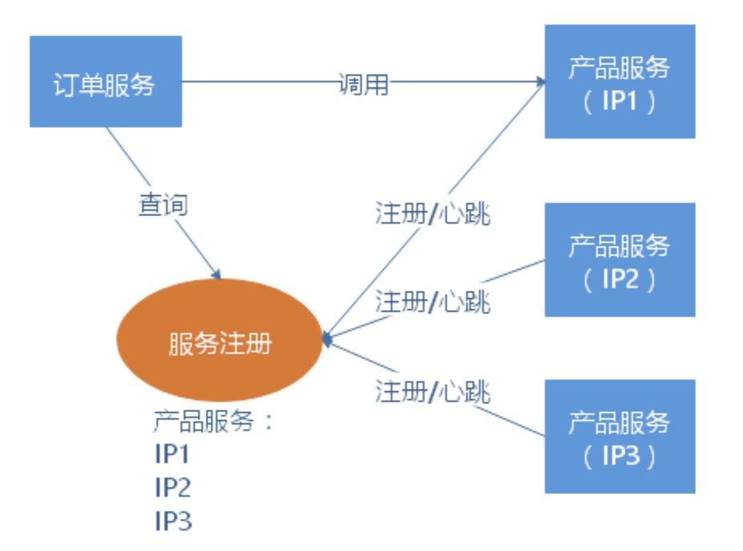

##### 基于服务端的服务注册与发现

优点是简单，所有服务对于前台调用方透明，一般在小公司在云服务上部署的应用采用的比较多。

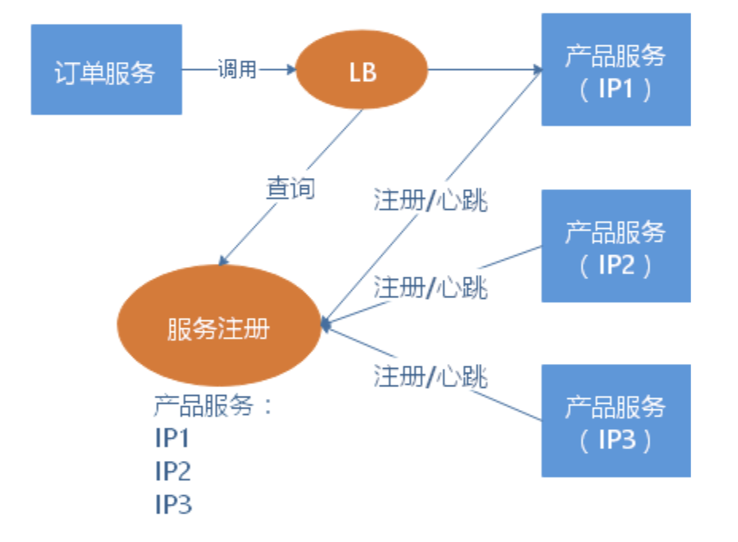

#### 4.2.4、服务宕机等异常情况的处理

前面提到，单体应用开发一个很大的风险是，把所有鸡蛋放在一个篮子里，一荣俱荣，一损俱损。而分布式最大的特性就是网络是不可靠的。通过微服务拆分能降低这个风险，不过如果没有特别的保障，结局肯定是噩梦。

因此，当我们的系统是由一系列的服务调用链组成的时候，我们必须确保任一环节出问题都不至于影响整体链路。相应的手段有很多，比如说：

* 重试机制
* 限流
* 熔断机制
* 负载均衡
* 降级（本地缓存）

## 五、微服务管理--服务发现

在微服务简介篇，我们已经介绍过微服务架构中要解决的四个基本的问题。从本节课开始我们来学习如何实现服务的管理。

### 5.1、为什么要使用服务发现

设想下，我们写了一些通过REST API或者Thrift API调用某个服务的代码，为了发起这个请求，代码需要知道服务实例的网络地址(IP 地址和端口号）。在传统运行在物理机器上的应用中，某个服务实例的网络地址一般是静态的，比如，代码可以从只会偶尔更新的配置文件中读取网络地址。

然而在现在流行的基于云平台的微服务应用中， 有更多如下图所示的困难问题需要去解决：

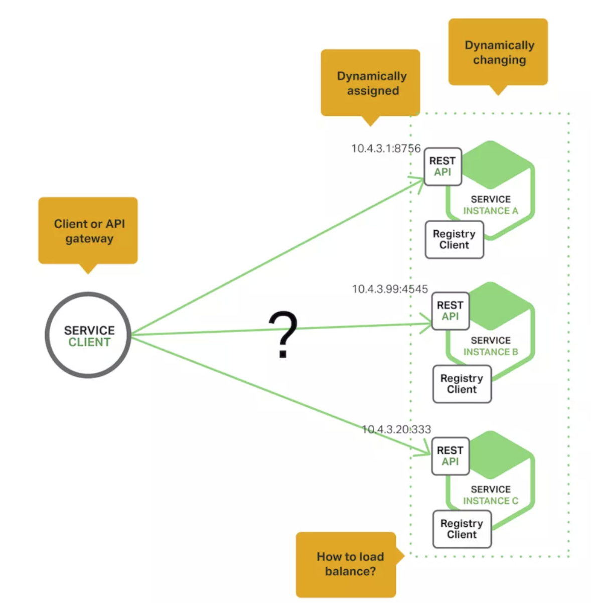

服务实例需要动态分配网络地址，而且，一组服务实例可能会因为自动扩展、失败或者升级发生动态变化，因此客户端代码应该使用更加精细的服务发现机制。

在生产实践中，主要有两种服务发现机制：**客户端发现**和**服务端发现**。

### 5.2、客户端发现模式

当我们使用客户端发现的时候，客户端负责决定可用服务实例的网络地址并且在集群中对请求负载均衡, 客户端访问**服务登记表**，也就是一个可用服务的数据库，然后客户端使用一种负载均衡算法选择一个可用的服务实例然后发起请求。该模式如下图所示：

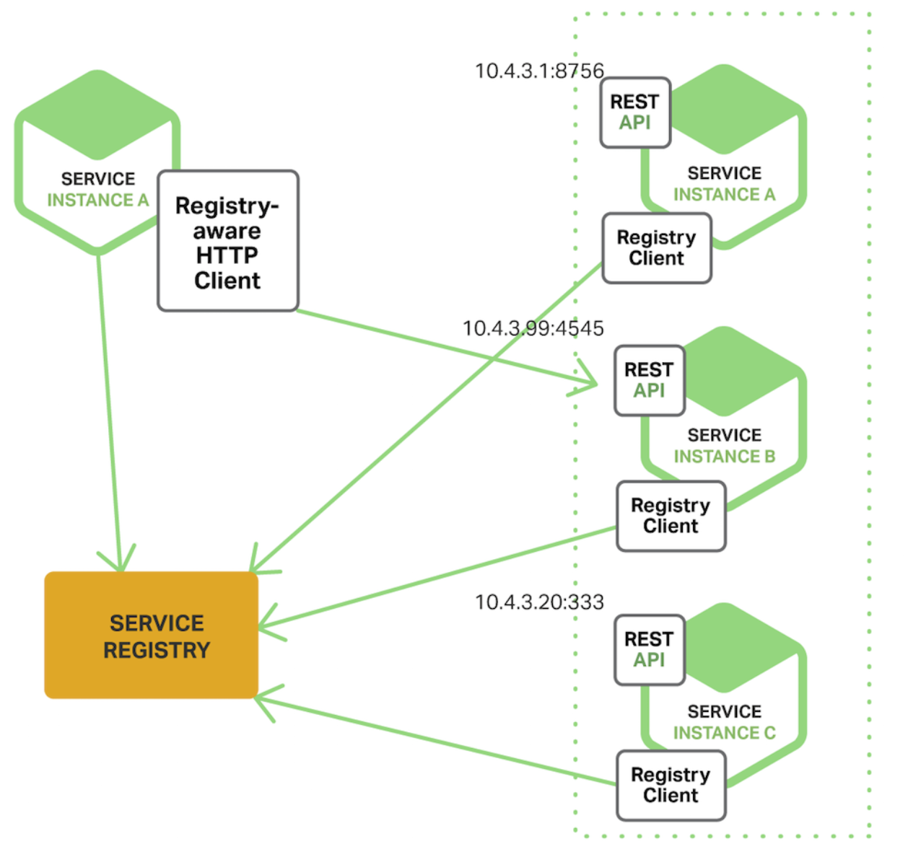

服务实例的网络地址在服务启动的时候被登记到服务注册表中 ，当实例终止服务时从服务注册表中移除。服务实例的注册一般是通过**心跳机制**阶段性的进行刷新。

* **客户端发现机制的优势：**
    * 该模式中只增加了服务注册表，整体架构也相对简单；
    * 客户端可以使用更加智能的，特定于应用的负载均衡机制，如一致性哈希。
* **客户端发现机制的缺点：** 客户端发发现机制中，客户端与服务注册表紧密耦合在一起，开发者必须为每一种消费服务的客户端对应的编程语言和框架版本都实现服务发现逻辑。

### 5.3、服务端发现模式

与客户端发现模式对应的，另外一种服务发现模式称之为服务端发现模式，整体架构如下：

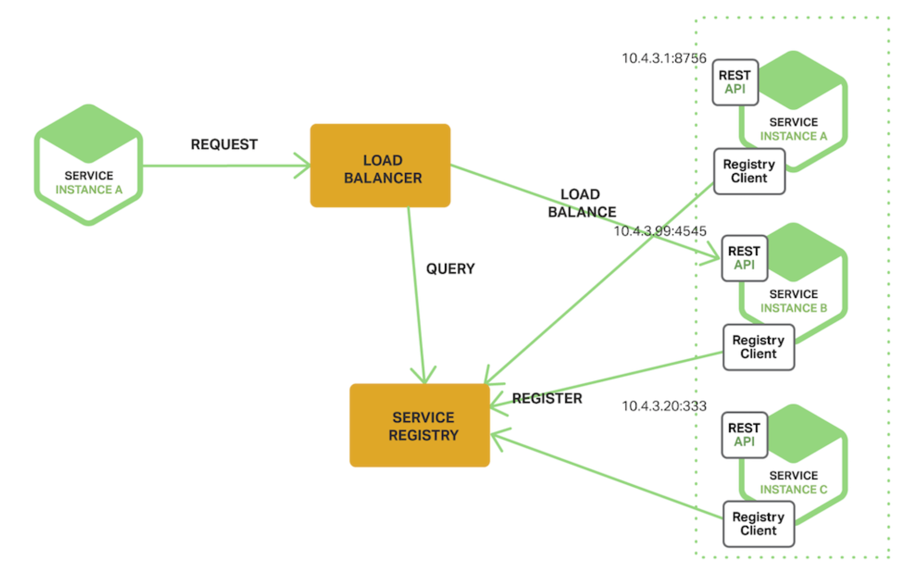

在该种模式下，客户端通过一个负载均衡器向服务发送请求，负载均衡器查询服务注册表并把请求路由到一台可用的服务实例上。和客户端发现一样，服务实例通过服务注册表进行服务的注册和注销。

* **服务端发现模式的优点：**
    * 服务发现的细节对客户端来说是抽象的，客户端仅需向负载均衡器发送请求即可。
    * 这种方式减少了为消费服务的不同编程语言与框架实现服务发现逻辑的麻烦。
* **服务端发现模式的缺点：** 除非部署环境已经提供了负载均衡器，否则这又是一个需要额外设置和管理的可高可用的系统组件。

### 5.4、服务注册表

服务注册表是服务发现的关键部分，它是一个包含服务实例网络地址的的数据库。一个服务注册表需要高可用和实时更新，客户端可以缓存从服务注册表获取的网络地址。然而，这样的话缓存的信息最终会过期，客户端不能再根据该信息发现服务实例。因此，服务注册表对集群中的服务实例使用复制协议来维护一致性。

举个例子：Netflix Eureka是典型的服务注册表的案例实现，它为服务实例的注册与查询提供了REST API：**一个服务实例可以使用POST来注册自己的网络地址，它必须每30秒通过PUT去刷新，服务实例可以直接或者在服务实例注册超时的时候使用DELETE删除注册表中的信息，另外客户端可以使用HTTP GET获取注册实例的信息。**

当然，除了Netflix Eureka以外，还有：
* **etcd：**一个高可用、分布式、一致性、key-value方式的存储，被用在分享配置和服务发现中。两个著名的项目使用了它：Kubernetes和Cloud Foundry。
* **consul：**一个发现和配置服务的工具，为客户端注册和发现服务提供了API，Consul还可以通过执行健康检查决定服务的可用性。
* **Apache Zookeeper：**Zookeeper是一个广泛使用、高性能的针对分布式应用的协调服务。

### 5.5、服务注册方式

服务实例必须使用服务注册表来进行服务的注册和注销，在实践过程中有不同的方式来实现服务的注册和注销：

* **self-registration模式：**这种模式下，服务实例自己负责通过服务注册表对自己进行注册和注销，另外如何有必要的话，服务实例可以通过发送心跳包请求防止注册过期。该种模式的架构实现如下：

    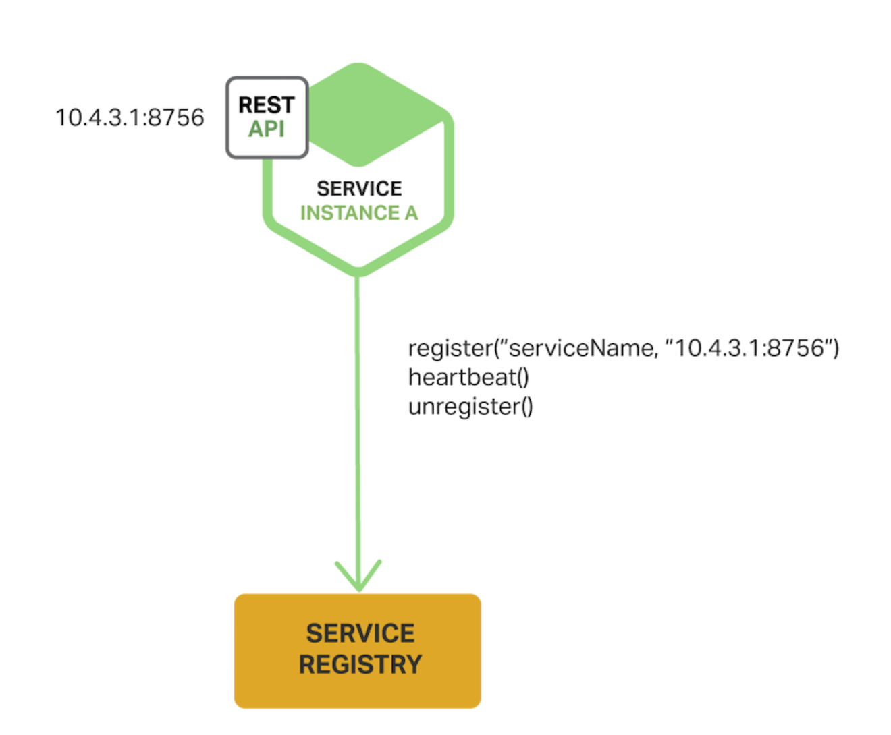

    **self-registration**模式有一些优势也有一些劣势：优势之一是它相对简单，而且不强制使用其他的系统组件。然而，一个很大的劣势是它使得服务实例和服务注册表强耦合，你必须在每一个使用服务的客户端编程语言和架构代码中实现注册逻辑。

* **third-party registration模式：**当使用third-party registration模式的时候，服务实例本身并不负责通过服务注册表注册自己，相反的，通过另一个被称作service registrar系统组件来处理注册。service registrar通过轮询或者订阅事件来检测一些运行实例的变化，当它检测到一个新的可用服务实例时就把该实例注册到服务注册表中去，service registrar还负责注销已经被终止的服务实例，下图展示了该模式的架构：

    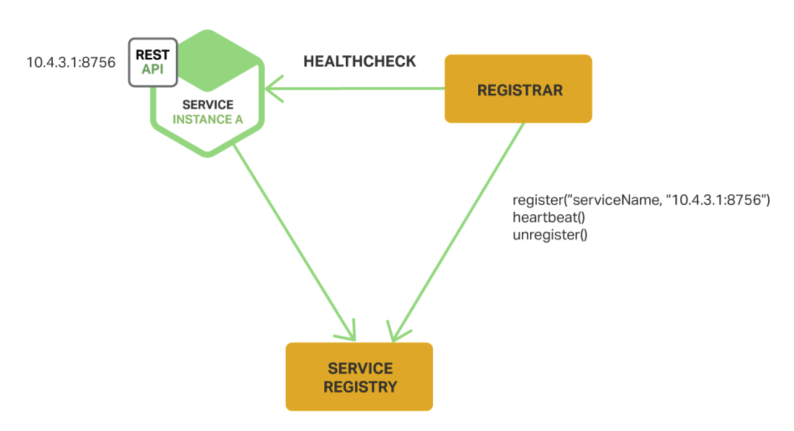

    third-party registration模式也有一些优势和劣势：主要优势是使得服务从服务注册表中被解耦，你不必为开发者使用的每种开发语言和框架实现服务注册的逻辑，相反，服务实例的注册被一个专有服务以集中式的方式处理。该模式的劣势是，除非它被内置在部署环境中，不然这又是一个需要被设置和管理的高可用系统组件。

### 5.6、总结

在一个微服务应用中，一组运行的服务实例是动态变化的，实例有动态分配的网络地址，因此，为了使得客户端能够向服务发起请求，必须要要有服务发现机制。

服务发现的关键是服务注册表，服务注册表是可用服务实例的数据库，它提供了管理和查询使用的API。服务实例使用这些管理API进行服务的注册和注销，系统组件使用查询API来发现可用的服务实例。

* 客户端发现的案例：Eureka、ZooKeeper
* 服务端发现的案例：consul+nigix

我们选择Consul来进行学习。

### 5.7、Consul

* **Consul概述**
consul是google开源的一个使用go语言开发的服务发现、配置管理中心服务，consul属于微服务架构的基础设置中用于发现和配置服务的一个工具。Consul提供如下的几个核心功能：

    * **服务发现：**Consul的某些客户端可以提供一个服务，其他客户端可以使用Consul去发现这个服务的提供者。
    * **健康检查：**Consul客户端可以提供一些健康检查，这些健康检查可以关联到一个指定的服务，比如心跳包的检测。
    * **键值存储：**应用实例可以使用Consul提供的分层键值存储，比如动态配置，特征标记，协作等。通过HTTP API的方式进行获取。
    * **多数据中心：**Consul对多数据中心有非常好的支持。

* **官方网站：**
可以访问[https://www.consul.io/](https://www.consul.io/)查看Consul的相关介绍，获取相关资料。

* **安装：**
在官方文档中，点击Download按钮，进入下载软件界面[https://www.consul.io/downloads.html](https://www.consul.io/downloads.html)，选择自己本机系统的类型，如下图所示：

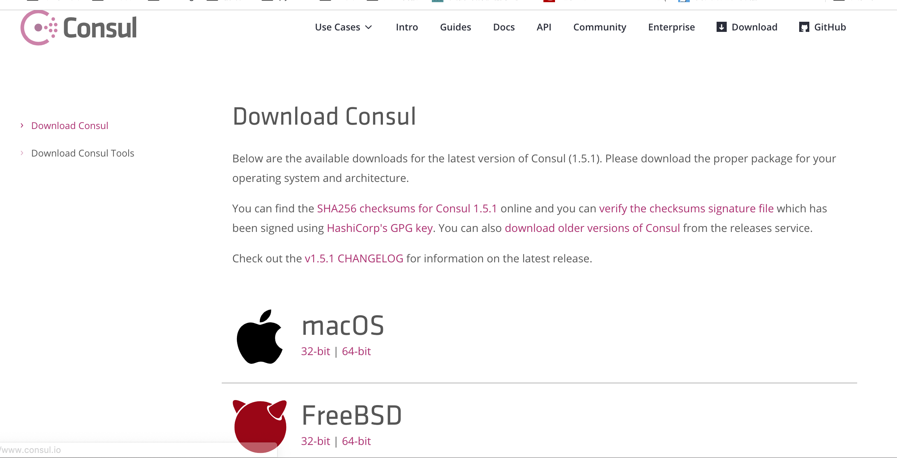

Consul最新版本是v1.5.1版本。

## 六、微服务管理--分布式与单点故障

上节课我们提到了服务的注册与发现机制，可以引入一个服务注册发现组件来实现对服务的管理，完成服务注册，信息查询，存储配置等功能。虽然引入了服务注册发现组件解决了旧问题，但是会引入新问题。

### 6.1、Consul环境配置

* 1、将下载的consul_1.5.1_darwin_amd64.zip进行解压，解压后得到可执行文件consul。
* 2、将consul可执行文件拷贝到电脑本地的环境变量中。
    * Unix系统中：可以拷贝到**~/bin**或**/usr/local/bin**目录下，这两个目录是常见的安装目录。
    * Windows系统：可以将consul安装到**%PATH%**所对应的目录路径中。
    以macOS系统为例，属于unix系统，将consul拷贝到/usr/local/bin目录下，如图所示：

    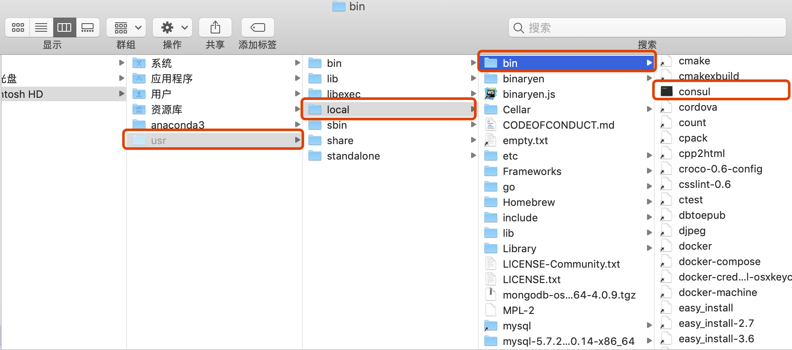

* 3、测试配置成功
完成consul的环境配置后，即表示已经将consul完成了安装。可以通过在命令行中运行consul指令验证是否安装成功。打开命令行工具，输入如下指令：

    ```
    consul
    ```

    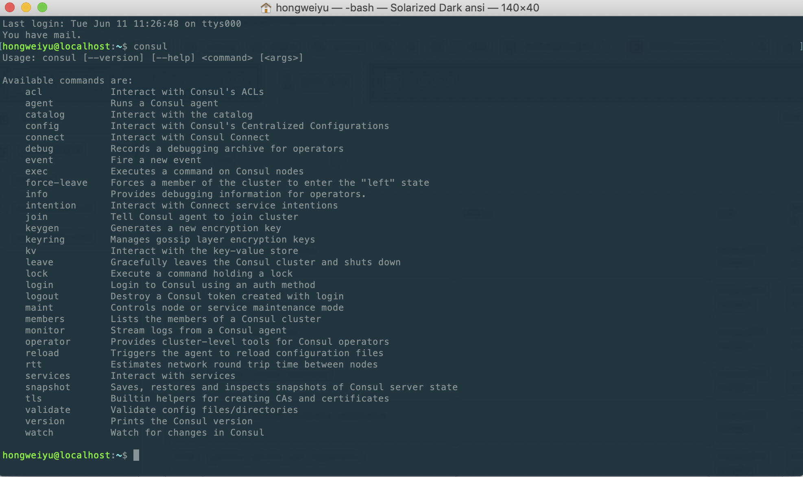
    在终端中输入**consul**指令，出现如上指令用法及参数提示，即表示consul安装成功。
    如果得到的是**-bash: consul: command not found**的错误，则表示**path**没有正确设置，需要重新检查consul可执行文件所在路径是否添加到了环境变量PATH中。

### 6.2、主从模式分布式系统

分布式系统中，一般是采用主从模式进行部署，如下图所示：

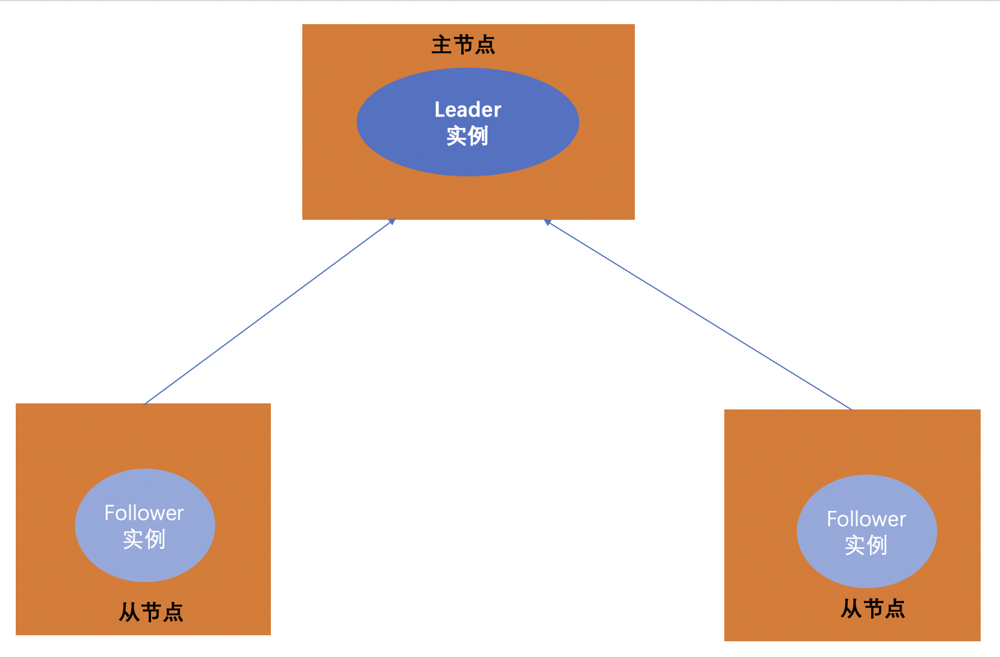

### 6.3、单点故障

通常分布式系统采用主从模式，就是一个主控机连接多个处理节点。主节点负责分发任务，从节点负责处理任务，当我们的主节点发生故障时，整个系统就瘫痪了。这就是单点故障。

单点故障（single point of failure），从英文字面上可以看到是单个点发生的故障，通常应用于计算机系统及网络。实际指的是单个点发生故障的时候会波及到整个系统或者网络，从而导致整个系统或者网络的瘫痪。这也是在设计IT基础设施时应避免的。

对应到上文，我们所说的服务注册与发现组件，如果我们引入的服务注册与发现组件出现了问题，则会导致系统乃至整个链路瘫痪，这是不可容忍的。需要采用新的方案解决此问题。

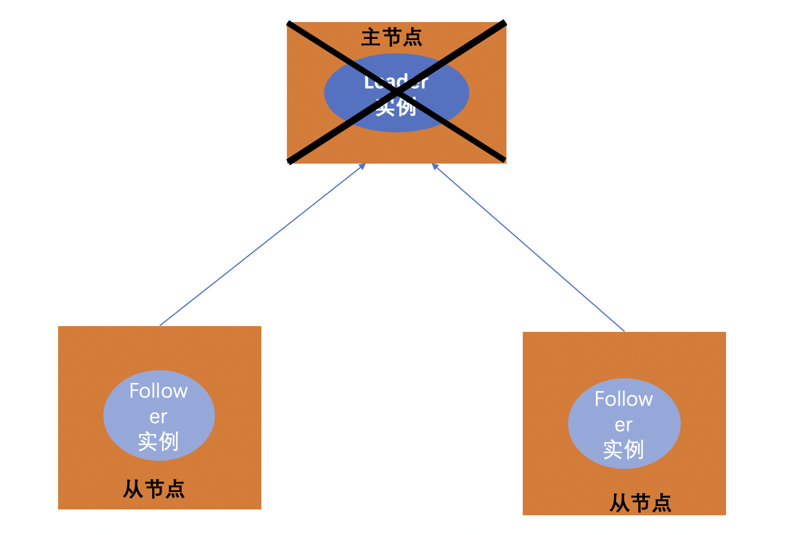

### 6.4、传统解决方案

传统的解决方案是采用一个备用节点，这个备用节点定期给当前主节点发送ping包，主节点收到ping包以后向备用节点发送回复ACK,当备用节点收到回复时就会认为当前主节点还活着，让他继续提供服务。

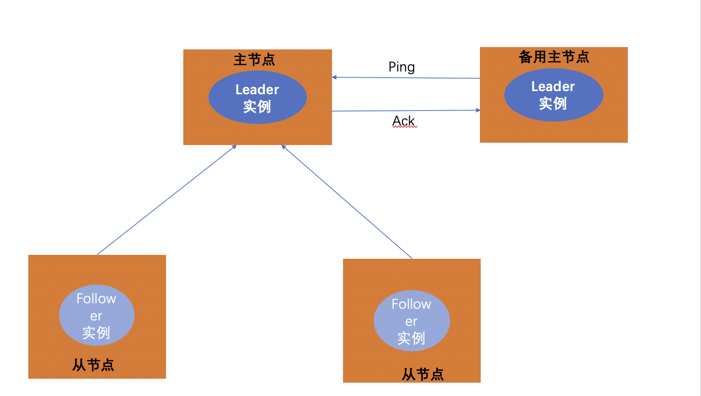

当主节点停止服务以后，这个时候备用节点收不到回复了，备用主节点认为主节点就宕机了，备用节点会代替主节点成为主节点，如下图：

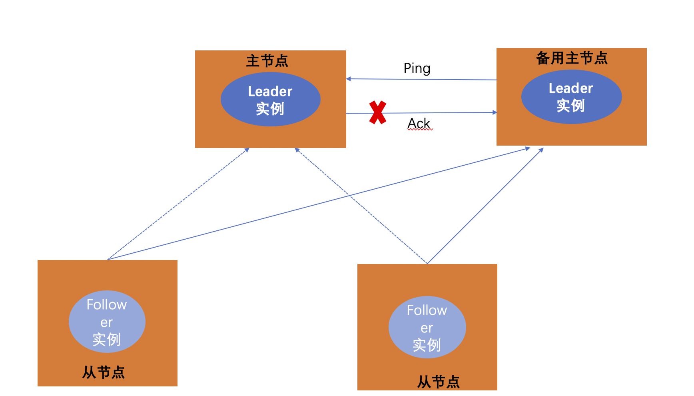

但是这种方案有个问题，如果仅仅是网络故障引起的ACK返回延时，这种方案就会面临着同时存在两个主节点的问题。

### 6.5、Consul中的Raft

Raft是一种基于Paxos的一致性算法。和Paxos相比，Raft的状态更少，算法更简单易懂。

Raft中的节点总是处于以下三种状态之一: follower、candidate或leader。所有的节点最初都是follower。在这种状态下，节点可以接受来自leader的日志条目并进行投票。如果在一段时间内没有收到条目，节点将自动提升到候选状态。在候选状态中，节点请求同级的选票。如果一个候选人获得了法定人数的选票，那么他就被提升为领袖。领导者必须接受新的日志条目，并将其复制给所有其他的追随者。此外，如果不能接受过时的读取，则还必须对leader执行所有查询。

### 6.6、Consul内部原理

我们可以通过如下的原理图来理解Consul的原理：

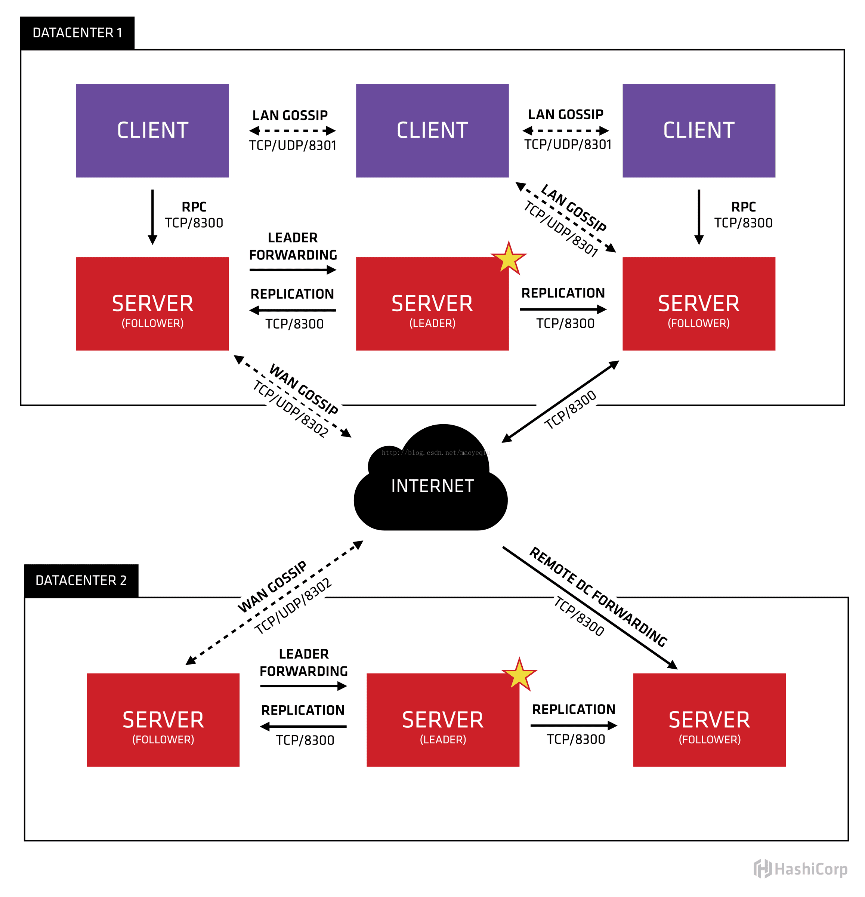

首先Consul支持多数据中心，在上图中有两个DataCenter，他们通过Internet互联，同时请注意为了提高通信效率，只有Server节点才加入跨数据中心的通信。

在单个数据中心中，Consul分为Client和Server两种节点（所有的节点也被称为Agent），Server节点保存数据，Client负责健康检查及转发数据请求到Server。

Server节点有一个Leader和多个Follower，Leader节点会将数据同步到Follower，Server的数量推荐是3个或者 5个，在Leader挂掉的时候会启动选举机制产生一个新的 Leader。

集群内的Consul节点通过gossip协议（流言协议）维护成员关系，也就是说某个节点了解集群内现在还有哪些节点，这些节点是Client还是Server。

单个数据中心的流言协议同时使用TCP和UDP通信，并且都使用8301端口。跨数据中心的流言协议也同时使用TCP和UDP 通信，端口使用8302。

集群内数据的读写请求既可以直接发到Server，也可以通过Client使用RPC转发到Server，请求最终会到达Leader节点。

在允许数据轻微陈旧的情况下，读请求也可以在普通的Server节点完成，集群内数据的读写和复制都是通过TCP的8300端口完成。

## 七、微服务管理--Consul服务发现原理

### 7.1、Consul服务发现原理

使用以下案例进行Consul服务发现原理的讲解，如图所示：

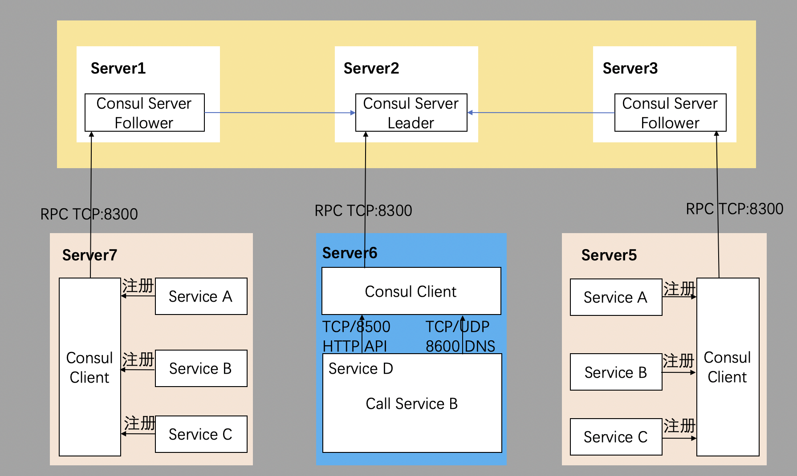

1、**部署集群。**首先需要有一个正常的Consul集群，有Server，有Leader。这里在服务器Server1、Server2、Server3上分别部署了Consul Server。

2、**选举Leader节点。**假设他们选举了Server2上的 Consul Server 节点为Leader。这些服务器上最好只部署Consul程序，以尽量维护Consul Server的稳定。

3、**注册服务。**然后在服务器Server4和Server5上通过Consul Client分别注册Service A、B、C，这里每个Service 分别部署在了两个服务器上，这样可以避免Service的单点问题。服务注册到Consul可以通过 HTTP API（8500 端口）的方式，也可以通过 Consul 配置文件的方式。

4、**Consul client转发注册消息。**Consul Client 可以认为是无状态的，它将注册信息通过RPC转发到Consul Server，服务信息保存在Server的各个节点中，并且通过Raft实现了强一致性。

5、**服务发起通信请求。**最后在服务器Server6中Program D需要访问Service B，这时候Program D首先访问本机Consul Client提供的HTTP API，本机Client会将请求转发到 Consul Server。

6、Consul Server查询到Service B当前的信息返回，最终Program D拿到了Service B的所有部署的IP和端口，然后就可以选择Service B的其中一个部署并向其发起请求了。

## 八、微服务管理--Consul启动

### 8.1、启动Consul

安装配置好Consul以后，我们可以通过简单的命令启动consul。先来看最简单的启动方式：

```
consul agent -dev
```

在新终端中，执行如上操作。

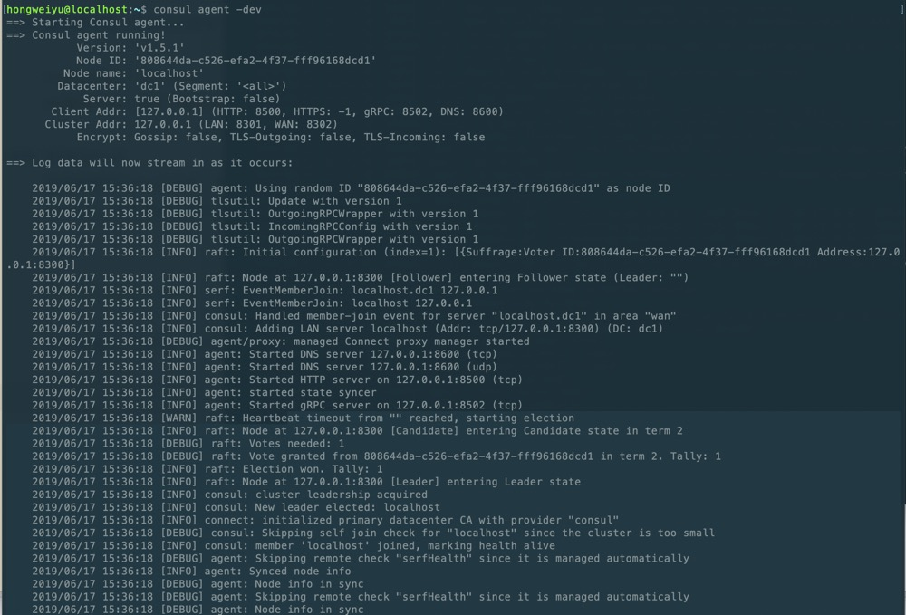

```
hongweiyu@localhost:~$ consul agent -dev
==> Starting Consul agent...
==> Consul agent running!
           Version: 'v1.5.1'
           Node ID: '808644da-c526-efa2-4f37-fff96168dcd1'
         Node name: 'localhost'
        Datacenter: 'dc1' (Segment: '<all>')
            Server: true (Bootstrap: false)
       Client Addr: [127.0.0.1] (HTTP: 8500, HTTPS: -1, gRPC: 8502, DNS: 8600)
      Cluster Addr: 127.0.0.1 (LAN: 8301, WAN: 8302)
           Encrypt: Gossip: false, TLS-Outgoing: false, TLS-Incoming: false

==> Log data will now stream in as it occurs:

    2019/06/17 15:36:18 [DEBUG] agent: Using random ID "808644da-c526-efa2-4f37-fff96168dcd1" as node ID
    2019/06/17 15:36:18 [INFO] raft: Initial configuration (index=1): [{Suffrage:Voter ID:808644da-c526-efa2-4f37-fff96168dcd1 Address:127.0.0.1:8300}]
    2019/06/17 15:36:18 [INFO] raft: Node at 127.0.0.1:8300 [Follower] entering Follower state (Leader: "")
    2019/06/17 15:36:18 [INFO] serf: EventMemberJoin: localhost.dc1 127.0.0.1
    2019/06/17 15:36:18 [INFO] consul: Adding LAN server localhost (Addr: tcp/127.0.0.1:8300) (DC: dc1)
    2019/06/17 15:36:18 [INFO] agent: Started DNS server 127.0.0.1:8600 (tcp)
    2019/06/17 15:36:18 [INFO] agent: Started DNS server 127.0.0.1:8600 (udp)
    2019/06/17 15:36:18 [INFO] agent: Started HTTP server on 127.0.0.1:8500 (tcp)
    2019/06/17 15:36:18 [INFO] agent: Started gRPC server on 127.0.0.1:8502 (tcp)
    2019/06/17 15:36:18 [WARN] raft: Heartbeat timeout from "" reached, starting election
    2019/06/17 15:36:18 [INFO] raft: Node at 127.0.0.1:8300 [Candidate] entering Candidate state in term 2
    2019/06/17 15:36:18 [INFO] raft: Election won. Tally: 1
    2019/06/17 15:36:18 [INFO] raft: Node at 127.0.0.1:8300 [Leader] entering Leader state
    2019/06/17 15:36:18 [INFO] consul: cluster leadership acquired
    2019/06/17 15:36:18 [INFO] consul: New leader elected: localhost
    2019/06/17 15:36:18 [INFO] consul: member 'localhost' joined, marking health alive
```

上面贴出了Consul启动的输出日志，对日志做如下分析和说明：

* -dev：dev是consul多种启动模式的一种，dev是development的缩写，代表的是开发模式，该种启动模式仅仅是为了快速便捷的启动单节点consul，比如当前环境。
* Consul agent running!：表示该consul节点正常运行起来。
* Datacenter:'dc1' 表示当前节点所属的数据中心的名称为dc1。
* Server：true（bootstrap：false） 表示该节点属于Server角色。Consul节点统称为agent，有两类：Client、Server。
* raft: Heartbeat timeout from "" reached, starting election Raft算法开始进行Leader节点选举。
* consul: cluster leadership acquired、consul: New leader elected: localhost Leader节点选举结束，本地唯一的节点被选举为leader节点。
* consul: member 'localhost' joined, marking health alive 目前localhost节点是一个健康正常的节点

### 8.2、查看consul节点信息

在consul启动后，可以通过命令查看节点的信息。在原有已经启动consul的终端窗口之外，重新开启新的终端窗口，执行如下命令：

```
consul members
```


```
Node       Address         Status  Type    Build  Protocol  DC   Segment
localhost  127.0.0.1:8301  alive   server  1.5.1  2         dc1  <all>
```

输出日志说明：
* Address：节点地址
* Status：alive表示节点健康运行
* Type：节点的类型，有两种：server、client
* DC：Datacenter的缩写，dc1表示该节点属于Datacenter1

### 8.3、UI界面访问

终端命令行下启动consul的dev模式后，通过members命令查看节点信息，除此以外，还可以使用Http的浏览器访问的模式，查看节点信息。
consul启动，正常运行后，打开浏览器，在地址栏中键入：http://localhost:8500。可以查看节点信息，如下图：

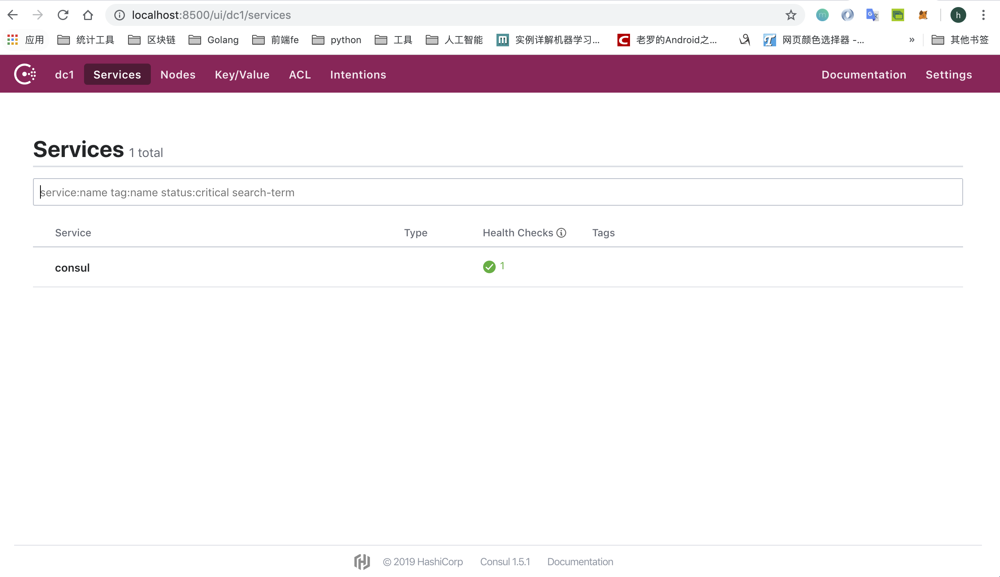

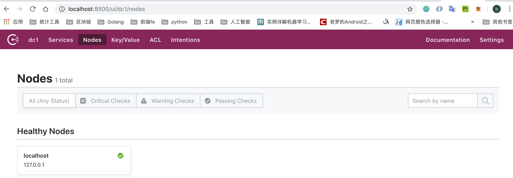

### 8.4、停止服务

在节点运行终端中执行：ctrl + c，表示退出节点运行。

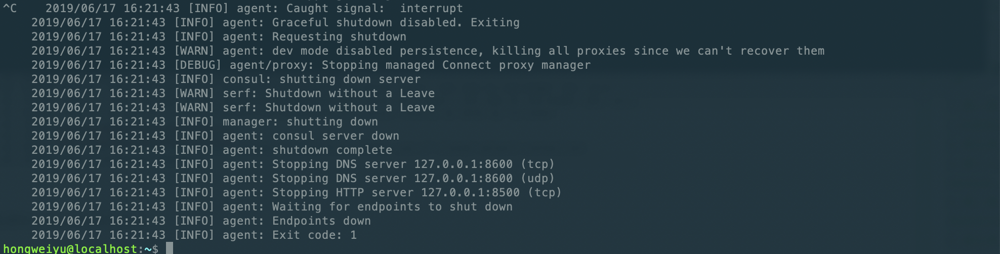

```
2019/06/17 16:21:43 [INFO] agent: Caught signal:  interrupt
2019/06/17 16:21:43 [INFO] agent: Graceful shutdown disabled. Exiting
2019/06/17 16:21:43 [INFO] agent: Requesting shutdown
2019/06/17 16:21:43 [INFO] consul: shutting down server
2019/06/17 16:21:43 [INFO] manager: shutting down
2019/06/17 16:21:43 [INFO] agent: consul server down
2019/06/17 16:21:43 [INFO] agent: shutdown complete
2019/06/17 16:21:43 [INFO] agent: Stopping DNS server 127.0.0.1:8600 (tcp)
2019/06/17 16:21:43 [INFO] agent: Stopping DNS server 127.0.0.1:8600 (udp)
2019/06/17 16:21:43 [INFO] agent: Stopping HTTP server 127.0.0.1:8500 (tcp)
2019/06/17 16:21:43 [INFO] agent: Waiting for endpoints to shut down
2019/06/17 16:21:43 [INFO] agent: Endpoints down
2019/06/17 16:21:43 [INFO] agent: Exit code: 1
```

退出节点运行。

### 8.5、consul dev模式示意图

上述consul agent -dev模式下的启动与运行consul节点。集群中只包含一个节点，唯一的节点被选举成为Leader节点。

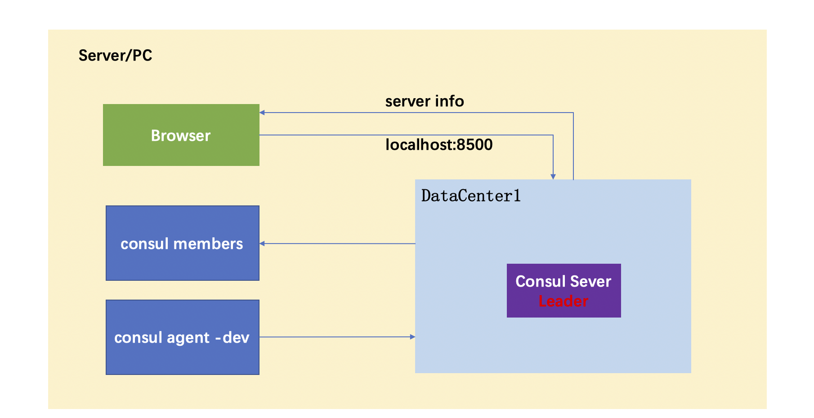

## 九、微服务管理--服务注册与查询

### 9.1、定义一个服务

服务的定义通过一个.json的json文件来进行定义，该文件中使用json格式定义所要注册服务的相关内容，以下为服务的json格式示例：

```json
{
  "service": {
    "id": "firstservice",
    "name": "firstservice",
    "tags": ["dev"],
    "port": 80
  }
}
```

### 9.2、服务注册

#### 9.2.1、创建服务文件所存放的文件夹

```
sudo mkdir /etc/consul.d
```

说明：.d做后缀，表示一系列配置文件的存放目录

#### 9.2.2、编写如章节一中的服务内容，并保存为文件

```
vim firstservice.json
```

#### 9.2.3、保存firstservice.json文件到指定目录

```
mv firstservice.json /etc/consul.d/
```

通过如上命令将自定义的firstservice.json服务文件移动至集中存放consul集群启动时要启动的服务目录中，即/etc/consul.d

### 9.3、服务查询

#### 9.3.1、启动consul

由于我们添加了服务，启动的服务是以配置文件的形式进行配置的，因此，在启动时有必要指定服务配置文件所对应的目录，如下所示：

```
consul agent -dev -config-dir /etc/consul.d/
```

如上的命令表示：根据-config-dir指定的服务注册的目录中的文件来启动服务。

#### 9.3.2、服务查询

服务的查询支持两种方式的查询，分别为：**DNS**和**HTTP**

* **a、第一种：DNS**

```
dig @127.0.0.1 -p 8600 dev.firstservice.service.consul
```

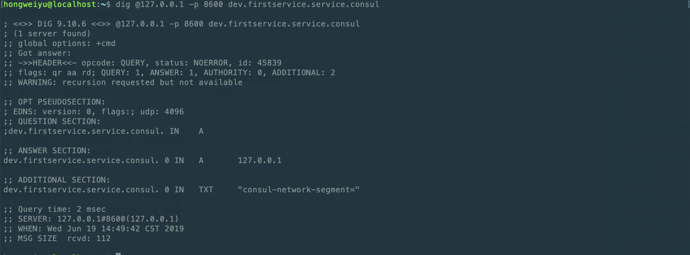

【说明：】
* 1、dev.firstservice.service.consul是固定的格式组合，具体格式为:**tag.servicename.service.consul**，即**tag**和**servicename**为服务创建时自定义配置内容。
* 2、DNS访问的端口是8600

* **b、第二种：HTTP**

```
curl http://localhost:8500/v1/catalog/service/firstservice
```

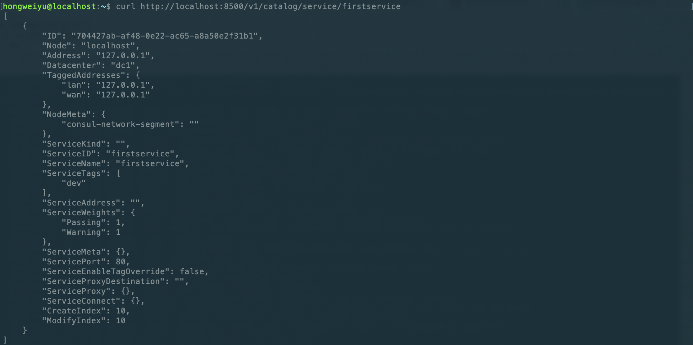

【说明:】
* 1、HTTP访问路径：host:port/版本号/service/服务名。
* 2、Address：用于指定一个特定的Service的IP地址，默认情况下，使用的是该service使用的agent。

### 9.4、注册多个服务

#### 9.4.1、每一个服务分别写一个json文件

例如，新建第二个服务sendservice，将新建secondservice.json文件，如下：

```json
{
  "service": {
    "id": "secondservice",
    "name": "secondservice",
    "tags": ["dev"],
    "port": 80
  }
}
```

* 使用http格式访问：

    ```
    curl http://localhost:8500/v1/catalog/service/secondservice
    ```

#### 9.4.2、将多个服务写到一个json文件中

除了将每一个服务单独定义为一个json配置文件外，consul还允许将多个服务组合定义在一个json文件中，具体的方式是对json文件的格式稍作修改，将原来的service修改为sevices，将原来service对应的对象类型，修改为数组类型。举例如下：

```json
{
  "services": [
  {
    "id": "firstservice",
    "name": "firstservice",
    "tags": ["dev"],
    "port": 80
  },
  {
    "id": "secondservice",
    "name": "secondservice",
    "tags": ["dev"],
    "port": 80
  }
  ]
}
```

说明：
* 1、放在多个services中而不是原来的service
* 2、多个服务放在一个数组中，起名为services

在实际的开发过程中，微服务数量众多。如果每个文件都放在一个文件里，文件会非常多；而如果所有服务都放在一个文件里，文件太大，也不合适。因此，在实践中，往往二者结合使用。例如，假设有100个微服务，则放在10个json文件中，每个文件中放10个微服务。

## 十、微服务管理--Docker安装及运行consul节点

### 10.1、搭建集群

在真实的生产环境中，需要真实的部署consul集群。在一台机器上想要模拟多台集群部署的效果，有两种方案：一种是借助虚拟机，另一种是借助容器技术。

在本系列课程中，使用后者容器技术来实现集群的搭建。

### 10.2、Docker简介

Docker是一个开源的应用容器引擎，基于Go语言并遵从Apache2.0协议开源。

Docker可以让开发者打包他们的应用以及依赖包到一个轻量级、可移植的容器中，然后发布到任何流行的Linux机器上，也可以实现虚拟化。

容器是完全使用沙箱机制，相互之间不会有任何的接口，更重要的是容器性能开销很低。

### 10.3、Docker安装

#### 10.3.1、Windows系统下安装

window系统下的安装可以参考如下的链接文档：[https://www.runoob.com/docker/windows-docker-install.html](https://www.runoob.com/docker/windows-docker-install.html)

#### 10.3.2、MacOS系统下安装

MacOS系统下的安装，有两种方式。同样可以参考如下链接：[https://www.runoob.com/docker/macos-docker-install.html](https://www.runoob.com/docker/macos-docker-install.html)

### 10.4、Docker测试

Docker安装完成以后，可以进行测试。可以通过终端命令的形式查看Docker是否安装成功：

```
docker version
```

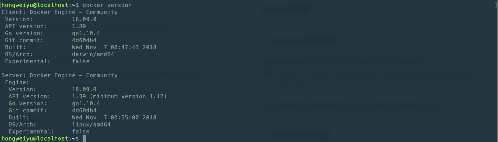

### 10.5、Docker中安装consul

Docker仅仅是一个容器，是搭建集群的一个环境。如果想要搭建多个集群，还必须安装consul环境。Docker中安装consul环境，可以使用指令实现。Docker安装consul指令如下：

* **docker search**

```
docker search consul
```

使用如上命令查看consul的镜像文件，在终端输出如下所示内容：

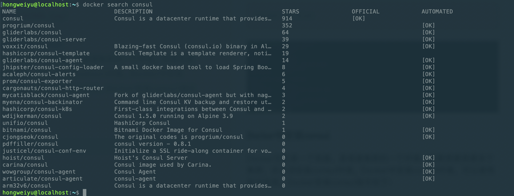

* **docker pull**

```
docker pull consul
```

通过search查询了consul镜像的相关内容后，可以使用如上的docker pull命令安装consul环境。


### 10.6、检验Docker安装Consul成功

在Docker中安装consul可以，可以通过如下命令查看docker中安装consul是否成功：

```
docker images
```

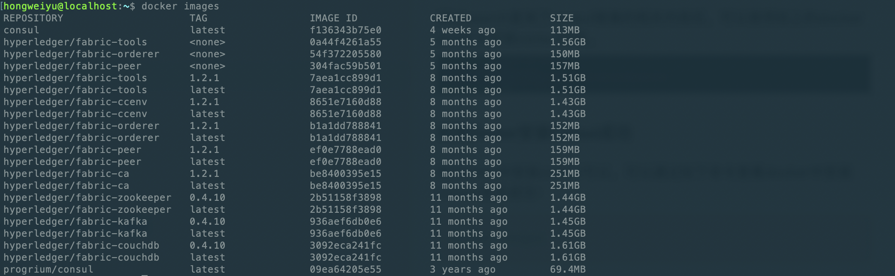

或者

```
docker run consul version
```

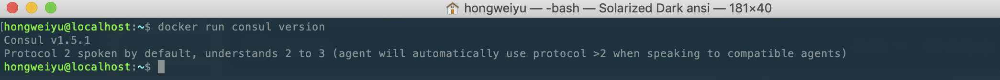

### 10.7、Docker中启动一个单独节点consul agent

Docker中安装好了consul以后，首先尝试启动一个server节点，可以通过如下命令来启动docker中的单个节点：

```
$ docker run -p 8500:8500/tcp consul agent -server -ui -bootstrap-expect=1 -client=0.0.0.0
```

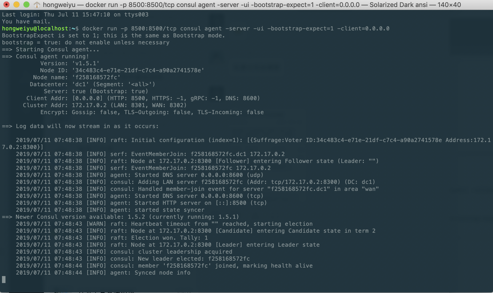

如上的命令中，参数说明如下：

* 暴露了端口，分别是：HTTP端口：8500
* -h：对应的node1为节点的名称
* -server：表示启动的节点类型为server类型
* -bootstrap-expect：用于server节点选举leader的参数,表示达到几个server节点时开始选举

在暴露的http端口中，还对应的映射到了主机的端口上，因此，我们可以通过在主机中访问server的信息。比如：

* curl访问HTTP接口：
    ```
    curl localhost:8500/v1/catalog/nodes
    ```

    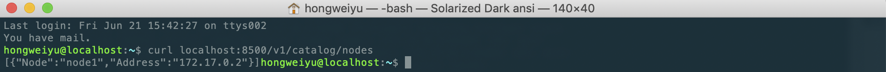

* dig来和DNS接口进行交互：

    ```
    dig @0.0.0.0 -p 8600 node1.node.consul
    ```

    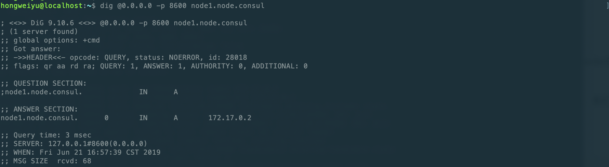

另外，我们还可以浏览器来进行访问，在主机的浏览器中键入：[http://127.0.0.1:8500](http://127.0.0.1:8500) 进行访问，可以查看到server节点的相关信息。

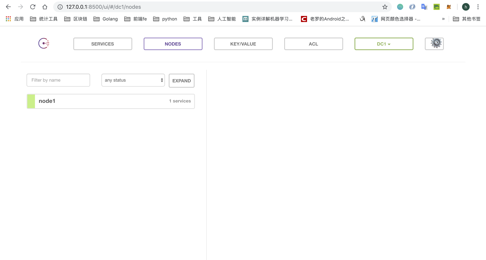

* 宿主机上查看节点数量
在宿主机上已经安装了Consul， 可以用命令行来和容器里的Consul Agent进行交互：

```
consul members
```

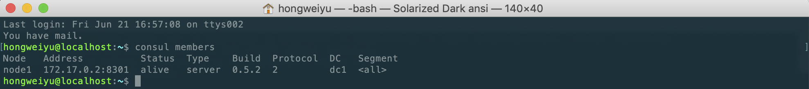

## 十一、微服务管理--Docker搭建Consul集群

### 11.1、一台主机上搭建Consul集群并测试

借助Docker容器，已经启动了一个server节点，并能够与之通信。
接下来，希望借助Docker来搭建consul集群。以启动3个consul集群节点为例：

#### 11.1.1、启动第一个节点

启动第一个节点的时候没有使用了 -bootstrap 参数， 而是使用了 -bootstrap-expect 3, 使用这个参数节点会等到所有三个端都连接到一起了才会启动并且成为一个可用的cluster。

```
$ docker run -d -p 8500:8500 -e CONSUL_BIND_INTERFACE='eth0' --name=consul_server_1 consul agent -server -bootstrap -ui -node=1 -client='0.0.0.0'
```

对如上的参数做如下说明：
* ui：表示启动 Web UI 管理器，默认开放端口 8500，可以在浏览器进行访问。
* --name：为容器指定名称

#### 11.1.2、查看节点IP

我们需要知道这个container的内部IP， 使用下面的命令把这个IP放到了环境变量 JOIN_IP 里。

```
$ JOIN_IP="$(docker inspect -f '{{ .NetworkSettings.IPAddress }}' node1)"
```

也可以直接查看container的IP，如下命令：

```
$ docker inspect -f '{{ .NetworkSettings.IPAddress }}' node1
```

#### 11.1.3、启动第二个节点

启动 node2并且告诉他通过 $JOIN_IP 加入到 node1：

```
$ docker run -d -e CONSUL_BIND_INTERFACE='eth0' --name=consul_server_2 consul agent -server -node=2  -join='172.17.0.2'
```

这里需要对参数作一下说明：
* CONSUL_BIND_INTERFACE是consul镜像提供给我们的几个常用的环境变量，该常量与-bind作用相同。
* name：为启动的节点命名
* node：为起订的节点赋值一个id
* agent：表示启动 Agent 进程。
* server：表示启动Consul Server 模式。
* join：表示加入到某一个集群中去。

#### 11.1.4、启动第三个节点

按照同样的方法我们启动 node3：

```
$ docker run -d -e CONSUL_BIND_INTERFACE='eth0' --name=consul_server_3 consul agent -server -node=3  -join='172.17.0.2'
```

现在我们就有了一个拥有3个节点的运行在一台机器上的集群。注意，根据Consul Agent的名字给container起了名字。

我们没有暴露出任何一个端口用以访问这个集群， 但是我们可以使用第四个agent节点以client的模式（不是用 -server参数）。这意味着他不参与选举但是可以和集群交互。而且这个client模式的agent也不需要磁盘做持久化。

```
$ docker run -d -e CONSUL_BIND_INTERFACE='eth0' --name=consul_server_4 consul agent -client -node=4 -join='172.17.0.2' -client='0.0.0.0'

$ docker run -d -e CONSUL_BIND_INTERFACE='eth0' --name=consul_server_5 consul agent -client -node=5 -join='172.17.0.2' -client='0.0.0.0'

$ docker run -d -e CONSUL_BIND_INTERFACE='eth0' --name=consul_server_6 consul agent -client -node=5 -join='172.17.0.2' -client='0.0.0.0'

```

如果上述命令都能执行成功，就意味着我们的集群搭建成功了。

### 11.2、查看集群的状态

集群搭建完成以后，我们可以通过浏览器或者终端命令行的形式来查看，集群里面的节点的状态。

#### 11.2.1、浏览器：

我们可以在浏览器中访问localhost:8500端口,可以看到如下效果:

* 三个serve类型的节点集群节点：

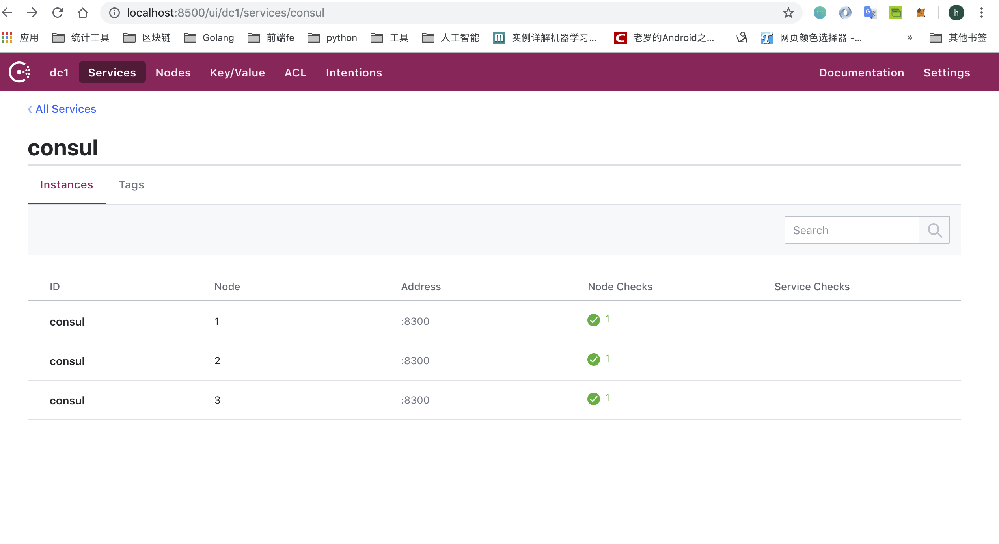

* 所有的Node节点（server和client）：

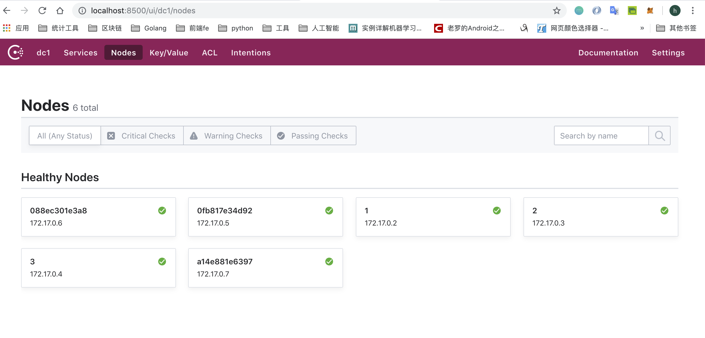

#### 11.2.2、命令行查看节点状态：

在终端下执行如下命令：

```
$ consul members
```

或者是：

```
$ docker exec consul_server_1 consul members
```

均可以看到如下输出效果：

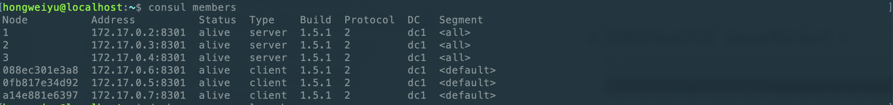

### 11.3、停止节点

* 活动容器状态查看

使用docker ps命令可以输出当前运行活动中的容器：

```
$ docker ps
```

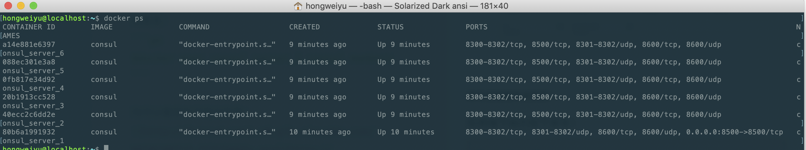

* 停止容器活动

可以使用如下命令将目前正处于活动中的容器停止：

```
$ docker stop containerID
```


如果要停止多个，可以用空格隔开。

* 移除容器

如果想要彻底移除启动的节点容器，可以通过rm命令来实现：

```
$ docker rm containerID
```

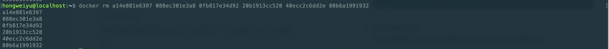

## 十二、微服务管理--微服务定义

### 12.1、consul常用命令及选项

#### 12.1.1、常用命令：command

consul命令的使用形式为：

```
consul command [option]
```

* agent：consul的节点分为client和server两类，这两类节点统称为agent节点。
* join：该命令的作用是将agent加入到consul的集群当中。当新启动一个agent节点后，往往需要指定节点需要加入到特定的consul集群中，此时使用join命令进行指定。
* members：列出consul集群中的所有的成员节点信息，包括ip，端口，状态，类型等信息。

#### 12.1.2、常用选项：option

除command命令外，还有option选项供开发者使用，常见的和常使用的option有：

* -data-dir：该选项用于指定agent储存状态的数据目录，这是所有agent都必须的，对于server尤其重要，因为他们必须持久化集群的状态。
* -config-dir：该选项用于指定service的配置文件和检查定义所在的位置。通常会指定为"某一个路径/consul.d"（通常情况下，.d表示一系列配置文件存放的目录）
* -config-file：指定一个要装载的配置文件。该选项可以配置多次，进而配置多个配置文件。
* -dev：该选项用于创建一个开发环境下的server节点，该参数配置下，不会有任何持久化操作，即不会有任何数据写入到磁盘。dev模式仅仅是在开发和测试环境中使用，不能用于生产环境。
* -bootstrap-expect：该选项用于通知consul server类型节点，指定集群的server节点个数，该参数是为了延迟选举启动，直到全部的节点启动完毕以后再进行启动。
* -node：该node选项用于指定节点在集群中的名称，该名称在集群中需要是唯一的，推荐直接使用机器的IP。
* -bind：该选项用于指定节点所在的IP地址。
* -server：该选项用于指明consul节点类型为server类型。每个数据中心（DC）的server数量推荐3到5个。所有的server节点加入到集群后要经过选举，采用raft一致性算法来确保数据操作的一致性。
* -client：该参数用于指定consul界定为client节点类型。
* -join：英文为加入的意思，join选项用于指定要将节点添加到具体哪个集群中。
* -dc：dc是datacenter的简称，该选项用于指定节点加入的dc实例。

### 12.2、微服务定义标准及选项

除了命令行选项，微服务的定义和配置也可以放入文件中。在某些情况下，这可能更容易，比如当使用配置管理系统配置时。配置文件是JSON格式的，使得它们易于被人和计算机读取和编辑。配置被格式化为单个JSON对象，其中包含配置。

配置文件不仅用于设置代理，还用于提供检查和服务定义。这些配置文件同样可以被其他软件和功能所识别。它们分别记录在检查配置和服务配置下。服务和检查定义支持在重新加载期间更新。

例如，如下的JSON格式配置文件：

```json
{
  "datacenter": "east-aws",
  "data_dir": "/opt/consul",
  "log_level": "INFO",
  "node_name": "foobar",
  "server": true,
  "watches": [
    {
        "type": "checks",
        "handler": "/usr/bin/health-check-handler.sh"
    }
  ],
  "telemetry": {
     "statsite_address": "127.0.0.1:2180"
  }
}
```

上述的json文件格式是一个案例，consul的json文件配置可选项有很多，比如：

* addresses：该配置选项用于设置绑定地址。在Consul 1.0和更高版本中，可以将这些设置为要绑定到的地址列表。支持绑定设置多种类型的地址，包括：dns、http、https、grpc等共四种类型。
* bootstrap：该配置相当于在命令行中添加了-bootstrap命令行标志。
* bootstrap_expect：该配置相当于在命令行中添加了-bootstrap_expect命令行标志。
* bind_addr：该配置相当于在命令行中添加-bind指令操作。
* ca_file：该配置用于指定ca证书文件的目录。
* ca_path：该配置用于指定ca证书的整体目录。
* client_addr：该配置与命令行中-client指令功能相同。
* config_entries：在该配置项下，通过配置二级配置项来进行，二级配置项可以配置bootstrap选项。
* connect：关于连接的一些配置项通过该配置进行设置，同样是通过二级配置项来完成，可支持的二级配置项有：enabled、ca_provider、ca_config。
* datacenter：该配置项与命令行中-datacenter指令作用相同。
* data_dir：该配置项与命令行中-data-dir指令作用相同，用于指定微服务json定义文件所在的目录。
* dns_config：该选项用于配置dns相关参数。
* domain：该配置项与命令行中的-domain指令作用相同。
* node_id：该配置项与命令行中的-node-id指令作用相同，用于自定义设定node-id。
* node_name：该配置项与命令行中的-node指令作用相同，用于为node指定名称。
* ports：该配置项用于配置节点的端口号，通过二级配置选项可以配置：dns、http、https、grpc、serf_lan、serf_wan、server等不同类型的端口。
* protocol：该配置选项与命令行中的-protocol指令功能相同。

如上，只是列出了部分json配置文件的配置项，全部的配置选项在consul的官方网站有相关的说明，可以访问如下链接进行查看：[https://www.consul.io/docs/agent/options.html](https://www.consul.io/docs/agent/options.html)
