# beego框架

## beego框架介绍

### beego简介

beego是一个使用Go语言来开发Web应用的GoWeb框架，该框架起始于2012年，由一位中国的程序员编写并进行公开，其目的就是为大家提供一个高效率的web应用开发框架。该框架采用模块封装，使用简单，容易学习。方便技术开发者快速学习并进行实际开发。对程序员来说，beego掌握起来非常简单，只需要关注业务逻辑实现即可，框架自动为项目需求提供不同的模块功能。

beego官方文档：[https://beego.me/](https://beego.me/)

### beego框架特性

Beego框架的主要特性：

1）**简单化：** RESTful支持，MVC模型；可以使用bee工具来提高开发效率，比如监控代码修改进行热编译，自动化测试代码，以及自动化打包部署等丰富的开发调试功能。

2）**智能化：** beego框架封装了路由模块，支持智能路由，智能监控，并可以监控内存消耗，CPU使用以及goroutine的运行状况，方便开发者对线上应用进行监控分析。

3）**模块化：** beego根据功能对代码进行节耦封装，形成了Session，Cache，Log，配置解析，性能监控，上下文操作，ORM等独立的模块，方便开发者进行使用。

4）**高性能：** beego采用Go原生的http请求，goroutine的并发效率应付大流量的Web应用和API应用。

### beego安装

首先我们进行beego源码的安装。使用go get命令来进行beego的安装。

**【注意】：** beego框架要求Go语言版本1.1+以上。可以通过`go version`查看当前Go语言版本：

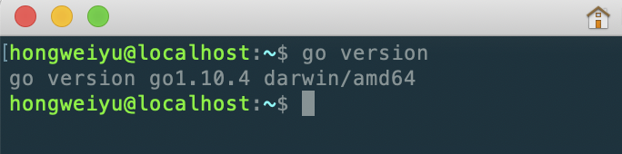

安装命令：

```shell
go get github.com/astaxie/beego
```

等待go将源代码下载安装完毕，就可以在`GOPATH`下面的`src`目录下找到beego框架源码。

#### 编写第一个beego程序

最简示例：

```go
package main
import "github.com/astaxie/beego"
func main() {
    beego.Info("第一个beego案例")
    beego.Run("localhost:8080")
}
```

访问浏览器 `http://localhost:8080`，可以看到后台打出了日志，说明前端的请求确实到了后台main方法里面进行执行。

### 命令行工具Bee

#### 什么是bee

bee是一个开发工具，是协助Beego框架开发项目时进行创建项目，运行项目，热部署等相关的项目管理的工具。beego是源码，负责开发；bee是工具，负责构建和管理项目。beego支持代码热部署——当修改代码时，可以不用停止服务重新启动，内置的beego就能够实时感知源代码程序编码，并进行实时生效。

#### bee安装

```shell
go get github.com/beego/bee
```

#### bee常用功能命令

- **new命令：** 新建一个全新的web项目，必须在`src`目录下执行：

  ```shell
  bee new ProjectName
  ```

- **api命令：** 用来创建开发API应用：

  ```shell
  bee api ProjectNames
  ```

  API项目少了static和views目录，多了一个test目录用于写测试用例代码。

- **run命令：** 运行项目，并且能够通过监控文件系统，实时进行代码的热部署更新：

  ```shell
  bee run
  ```

- **pack命令：** 发布应用时的打包操作，把项目打包成zip包：

  ```shell
  bee pack
  ```

- **version命令：** 查看当前bee、beego、go的版本：

  ```shell
  bee version
  ```

### 使用Bee工具

使用`bee new`命令来新建一个案例项目：

```shell
bee new BeegoDemo2
```

命令执行效果如下：

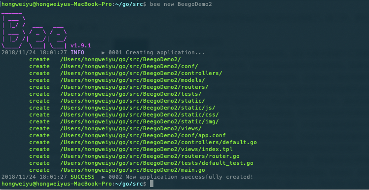

使用goland打开新建的项目，查看项目目录结构：

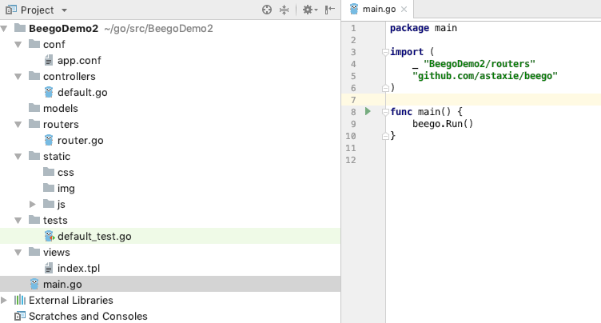

使用`bee run`命令运行项目：

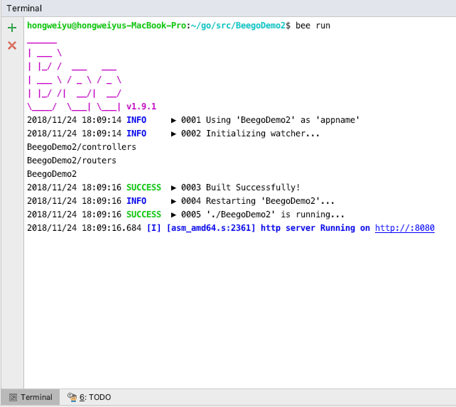

浏览器中验证效果：

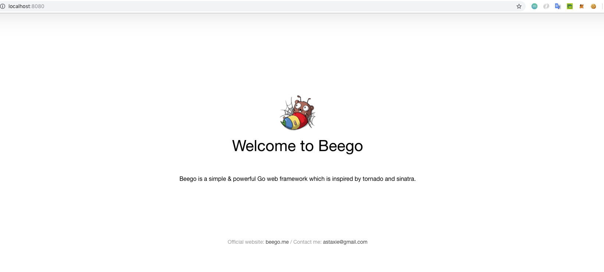

## beego程序流程分析

### beego程序入口

Go语言执行的时候是执行main包下面的init函数，main函数依次执行。首先找到main.go文件：

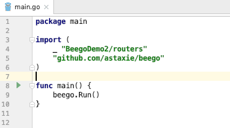

在main.go中，import导入了两个包，一个是routers，一个是beego。在routers包前面有`_`，表明是引入routers包并执行init方法。

### Go语言程序执行顺序

Go语言的执行流程如下：

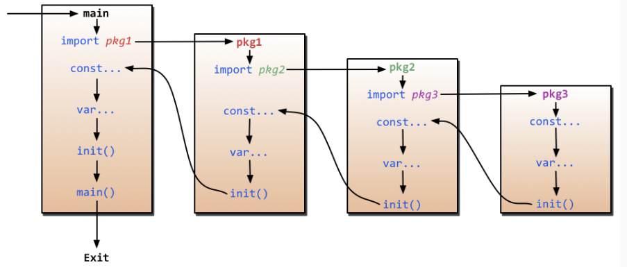

### 请求拦截与路由分发

程序首先到routers包下执行init方法。router.go中的内容：

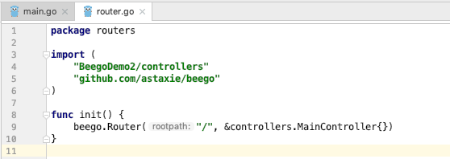

可以看到`beego.Router()`这句代码。router表示路由，该函数的功能是映射URL到controller。第一个参数是URL（用户请求的地址），第二个参数是对应的Controller。

### 控制器处理

MainController结构体及函数声明在default.go文件中：

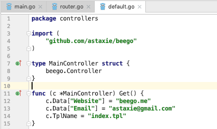

这里有一个Get方法，方法中有三行代码。浏览器访问 `http://localhost:8080` 是一个get请求，因此被"/"拦截，执行到MainController中的Get函数。Get函数中有三句话：`c.Data[]= ""` 表示设置返回的数据字段及内容，`c.TplName`表示设置处理该请求指向某个模板文件。

**模板文件：** 页面使用静态的html+css+js等静态代码来进行页面的布局和效果控制，而把页面的数据使用变量表示。这样，在进行页面展示时，就能自动填充页面里面的变量值；这些静态代码文件统称为模板文件。

### beego.Run()逻辑

在main函数中执行`beego.Run()`，Run方法内部主要做了几件事：

- 解析配置文件（app.conf文件），比如端口、应用名称等信息。
- 检查是否开启session，如果开启session，就会初始化一个session对象。
- 是否编译模板。beego框架会在项目启动的时候根据配置把views目录下的所有模板进行预编译，然后存放在map中，这样可以有效提高模板运行的效率。
- 监听服务端口。根据app.conf文件中的端口配置，启动监听。

## beego项目架构

### 项目配置：conf

项目配置文件所在的目录，项目中有一些全局的配置都可以放在此目录下。默认的app.conf文件中默认指定了三个配置：

- `appname = BeegoDemo2`：指定项目名称。
- `httpport = 8080`：指定项目服务监听端口。
- `runmode = dev`：指定执行模式。

### 控制器：controllers

该目录是存放控制器文件的目录，所谓控制器就是控制应用调用哪些业务逻辑，由controllers处理完http请求以后，并负责返回给前端调用者。

### 数据层：models

models层可以解释为实体层或者数据层，在models层中实现和用户和业务数据的处理，主要和数据库表相关的一些操作会在这一目录中实现，然后将执行后的结果数据返回给controller层。比如向数据库中插入新数据，删除数据库表数据，修改某一条数据，从数据库中查询业务数据等都是在models层实现。

### 路由层：routers

该层是路由层。所谓路由就是分发的意思，当前端浏览器进行一个http请求达到后台web项目时，必须要让程序能够根据浏览器的请求url进行不同的业务处理，从接收到前端请求到判断执行具体的业务逻辑的过程的工作，就由routers来实现。

### 静态资源目录：static

在static目录下，存放的是web项目的静态资源文件，主要有：css文件，img，js，html这几类文件。html中会存放应用的静态页面文件。

### 视图模板：views

views中存放的就是应用中存放html模版页面的目录。所谓模版，就是页面框架和布局是已经使用html写好了的，只需要在进行访问和展示时，将获取到的数据动态填充到页面中，能够提高渲染效率。

综上，整个项目架构就是MVC的运行模式。

## beego框架路由设置

在beego框架中，支持四种路由设置，分别是：**基础路由**、**固定路由**、**正则路由**和**自动路由**。

### 基础路由

直接通过beego.Get、beego.Post、beego.Head、beego.Delete等方法来进行路由的映射。常见的http请求方法操作有：GET、HEAD、PUT、POST、DELETE、OPTIONS等。

GET路由：

```go
beego.GET("",func)
```

POST路由：

```go
beego.POST("",func)
```

除此之外，还支持Patch、Head、Delete等基础路由。这种请求和对应的方法就是RESTful形式——用户发出get请求时就自动执行Get方法，Post请求就执行Post方法。

### 固定路由

```go
beego.Router("/",controller);
```

Get请求对应到Get方法，Post对应到Post方法，Delete对应到Delete方法，Header方法对应Header方法。

### 正则路由

正则路由是指在固定路由的基础上，支持匹配一定格式的正则表达式。比如`:id`、`:username`、自定义正则、file的路径和后缀切换以及全匹配等操作。

### 自定义路由

beego提供自定义路由配置，方式如下：

```go
beego.Router("/",&IndexController{},"")
```

可以用的HTTP Method：
- `"*"`：包含以下所有的函数
- `"get"`：GET 请求
- `"post"`：POST 请求
- `"put"`：PUT 请求
- `"delete"`：DELETE 请求
- `"patch"`：PATCH 请求
- `"options"`：OPTIONS 请求
- `"head"`：HEAD 请求

在beego.Controller中，定义了Init、Prepare、Post、Get、Head、Delete等方法。

## 静态文件的设置

在goweb项目中，有一些静态资源文件需要能被访问到，需要在项目中进行静态资源设置：

```go
beego.SetStaticPath("/down1","download1")
```

这里的download目录是指非goweb项目的static目录下目录，而是开发者重新新建的另外的目录。

## 实战项目介绍

在本系列课程中，我们将一起使用Beego框架开发实现一个博客系统。效果如下图所示：

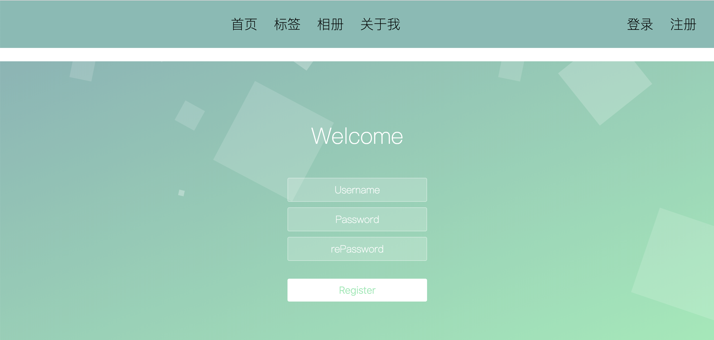

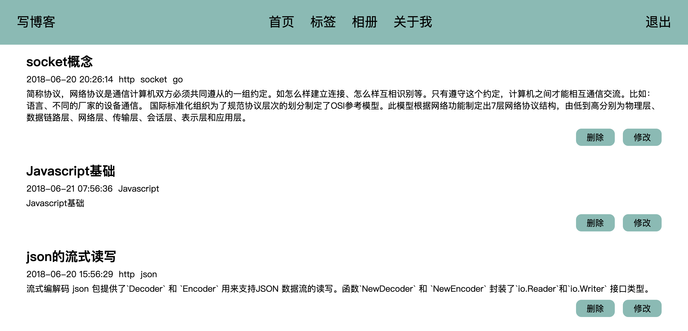

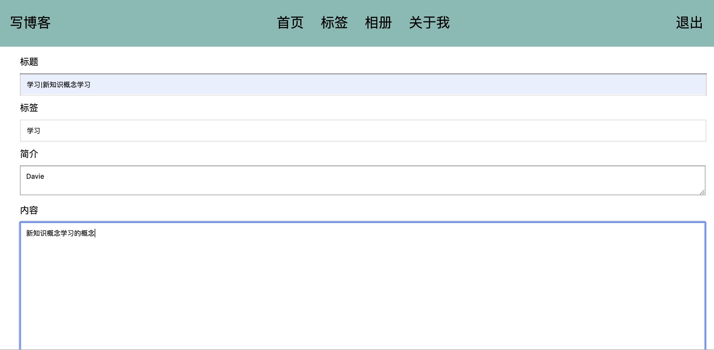

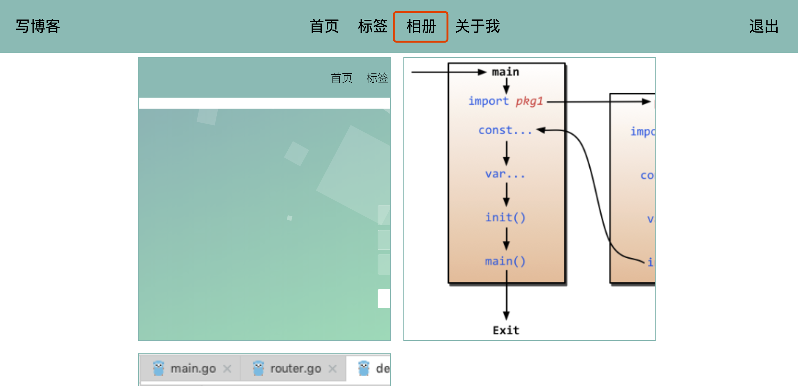

## 数据库配置及连接测试

### mysql数据库安装

mysql官方下载网站：[https://dev.mysql.com/downloads/](https://dev.mysql.com/downloads/)

我们使用的是5.7版本，下载链接：[https://dev.mysql.com/downloads/mysql/5.7.html#downloads](https://dev.mysql.com/downloads/mysql/5.7.html#downloads)

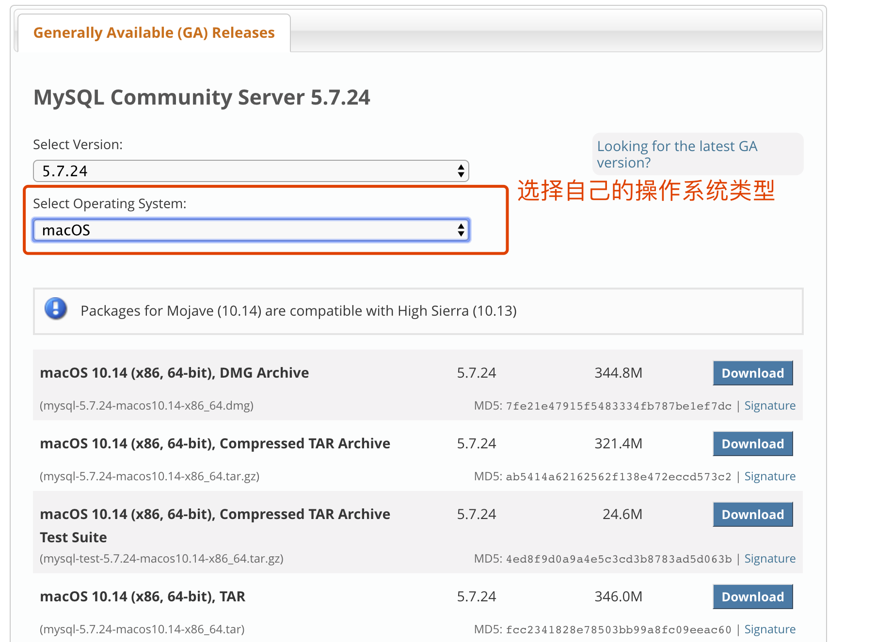

安装完毕后，将mysql的bin目录路径添加配置到环境变量，以便能够在终端命令行中进行使用登陆mysql。

在终端中登陆mysql的命令：

```shell
mysql -u root -p
```

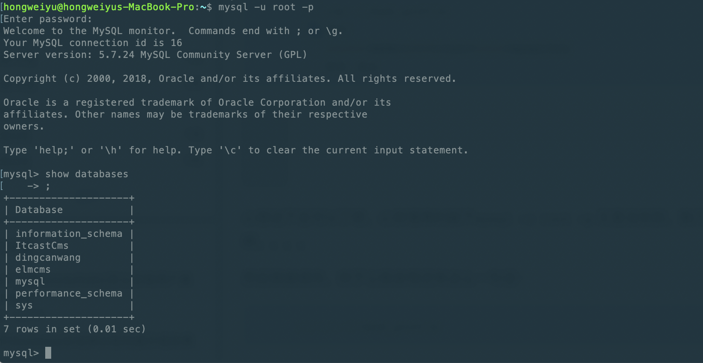

### mysql数据库常用命令

- 查看数据库：

  ```sql
  show databases;
  ```

- 使用某个数据库：

  ```sql
  use databaseName;
  ```

- 展示某个数据库表格列表：

  ```sql
  show tables;
  ```

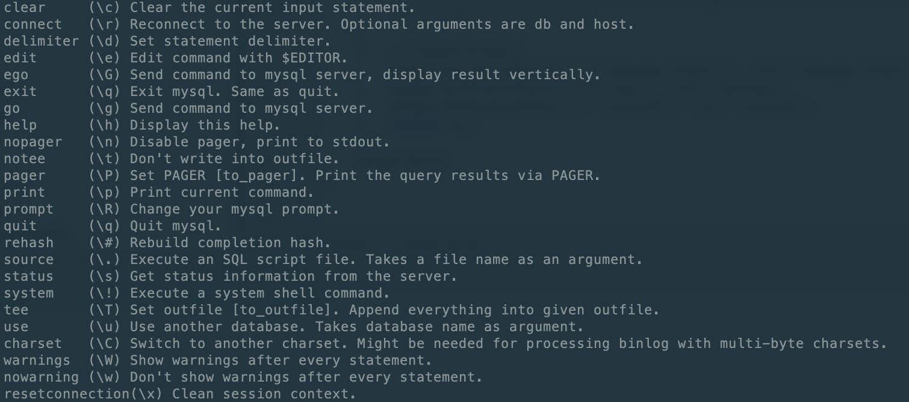

以上mysql数据操作都是命令行终端形式，为了方便日常操作，可以使用图形化界面工具Navicat。

### Navicat安装

navicat工具下载地址：[https://www.navicat.com/en/download/navicat-for-mysql](https://www.navicat.com/en/download/navicat-for-mysql)

选择自己的系统版本，然后下载安装文件，进行安装。

### 数据库驱动

在beego中，目前支持三种数据库驱动：

- **MySQL：** `github.com/go-sql-driver/mysql`
- **PostgreSQL：** `github.com/lib/pq`
- **Sqlite3：** `github.com/mattn/go-sqlite3`

beego中的ORM所具备的几个特性：

- **支持Go语言的所有类型存储**
- **CRUD操作简单**
- **自动Join关联表**
- **允许直接使用SQL查询**

### beego项目中使用mysql

#### 导入对应的数据库驱动

```go
import _ "github.com/go-sql-driver/mysql"
```

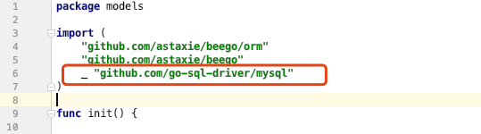

#### 注册驱动，连接数据库

```go
orm.RegisterDriver("mysql", orm.DRMySQL)
orm.RegisterDataBase(aliasName, driverName, dbConn)
```

详细代码如下：

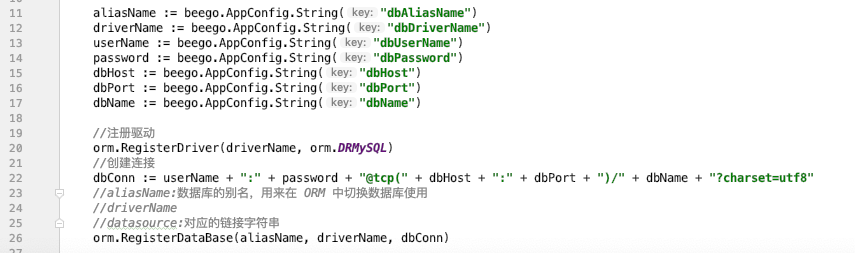

#### 创建数据库并执行程序

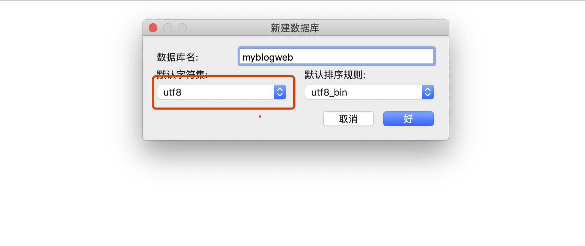

连接数据库代码示例：

```go
package models

import (
    "github.com/astaxie/beego"
    "github.com/astaxie/beego/orm"
    "BlogProject/MysqlDemo/util"
    //切记：导入驱动包
    _ "github.com/go-sql-driver/mysql"
)

func init() {
    driverName := beego.AppConfig.String("driverName")

    //注册数据库驱动
    orm.RegisterDriver(driverName, orm.DRMySQL)

    //数据库连接
    user := beego.AppConfig.String("mysqluser")
    pwd := beego.AppConfig.String("mysqlpwd")
    host := beego.AppConfig.String("host")
    port := beego.AppConfig.String("port")
    dbname := beego.AppConfig.String("dbname")

    //dbConn := "root:yu271400@tcp(127.0.0.1:3306)/cmsproject?charset=utf8"
    dbConn := user + ":" + pwd + "@tcp(" + host + ":" + port + ")/" + dbname + "?charset=utf8"

    err := orm.RegisterDataBase("default", driverName, dbConn)
    if err != nil {
        util.LogError("连接数据库出错")
        return
    }
    util.LogInfo("连接数据库成功")
}
```

#### 程序执行结果

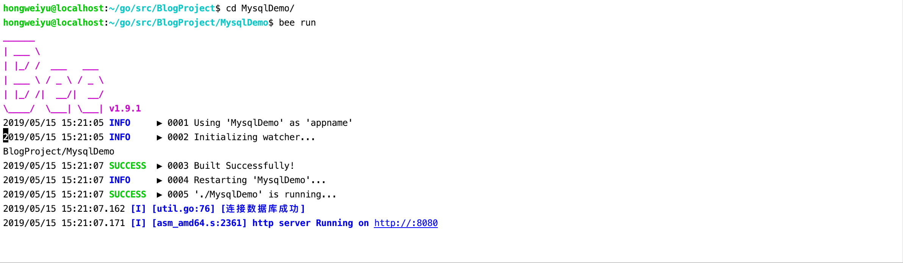

## 项目搭建和用户注册功能

### 创建项目

首先打开终端进入gopath下的src目录，然后执行以下命令，创建一个beego项目：

```shell
bee new myblog
```

运行效果如下：

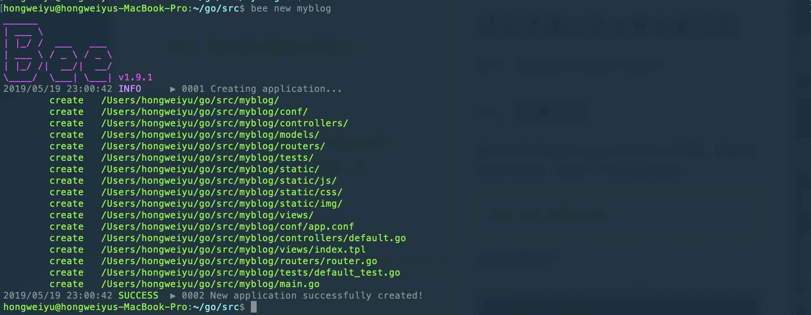

然后通过goland打开该项目：

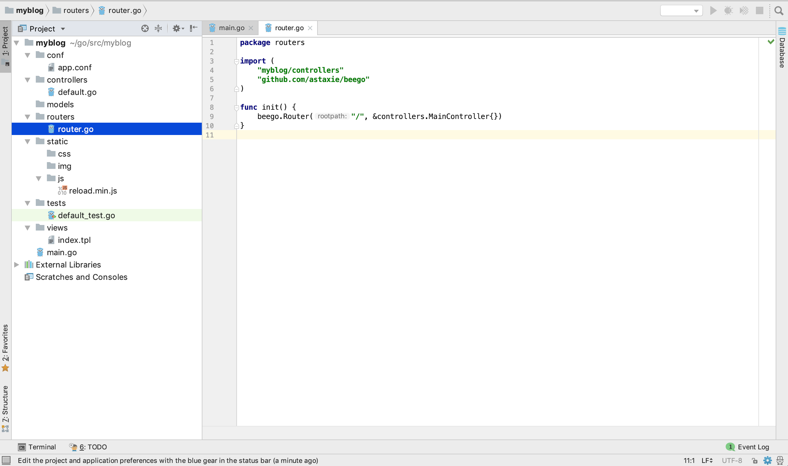

### 修改端口配置

打开conf包下的配置文件app.conf，修改端口号为8080：

```ini
appname = myblog
httpport = 8080
runmode = dev
```

### 项目运行和效果

在终端中进入该项目目录，然后运行项目：

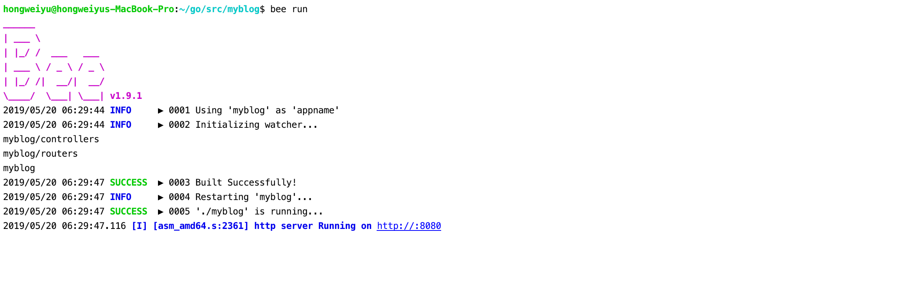

打开浏览器输入网址 `http://127.0.0.1:8080/`，可以看到欢迎界面：

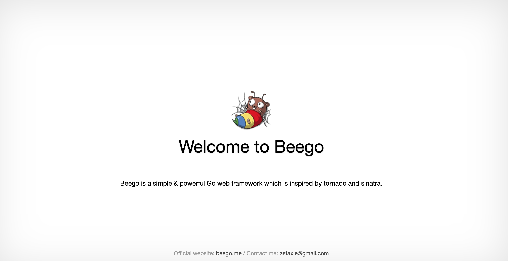

### 数据库创建及连接

首先创建数据库：

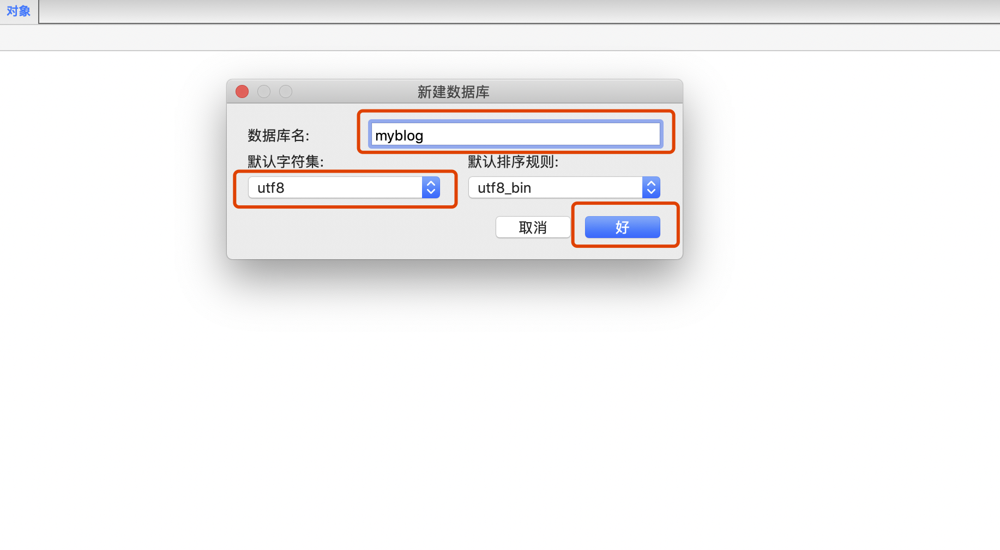

创建一个工具包utils，然后创建一个go文件，用于做mysql的工具类，里面提供连接数据库和创建表的功能：

```go
func InitMysql() {
    fmt.Println("InitMysql....")
    driverName := beego.AppConfig.String("driverName")

    //注册数据库驱动
    orm.RegisterDriver(driverName, orm.DRMySQL)

    //数据库连接
    user := beego.AppConfig.String("mysqluser")
    pwd := beego.AppConfig.String("mysqlpwd")
    host := beego.AppConfig.String("host")
    port := beego.AppConfig.String("port")
    dbname := beego.AppConfig.String("dbname")

    dbConn := user + ":" + pwd + "@tcp(" + host + ":" + port + ")/" + dbname + "?charset=utf8"

    db, _ = sql.Open(driverName, dbConn)
```

### 数据库表设计

设计user表，需要用户的id作为主键，用户名username和密码password，状态status（0表示正常状态，1表示删除），注册时间用整型时间戳表示：

```go
//创建用户表
func CreateTableWithUser() {
    sql := `CREATE TABLE IF NOT EXISTS users(
        id INT(4) PRIMARY KEY AUTO_INCREMENT NOT NULL,
        username VARCHAR(64),
        password VARCHAR(64),
        status INT(4),
        createtime INT(10)
        );`

    ModifyDB(sql)
}
```

### 数据库操作方法

```go
//操作数据库
func ModifyDB(sql string, args ...interface{}) (int64, error) {
    result, err := db.Exec(sql, args...)
    if err != nil {
        log.Println(err)
        return 0, err
    }
    count, err := result.RowsAffected()
    if err != nil {
        log.Println(err)
        return 0, err
    }
    return count, nil
}

//查询
func QueryRowDB(sql string) *sql.Row{
    return db.QueryRow(sql)
}
```

### 定义User和数据库操作方法

在models中创建model文件：

```go
package models

import (
    "myblogweb/utils"
    "fmt"
)

type User struct {
    Id         int
    Username   string
    Password   string
    Status     int // 0 正常状态， 1删除
    Createtime int64
}

//--------------数据库操作-----------------

//插入
func InsertUser(user User)(int64, error){
    return utils.ModifyDB("insert into users(username,password,status,createtime) values (?,?,?,?)",
        user.Username,user.Password,user.Status,user.Createtime)
}

//按条件查询
func QueryUserWightCon(con string)int{
    sql := fmt.Sprintf("select id from users %s",con)
    fmt.Println(sql)
    row:=utils.QueryRowDB(sql)
    id :=0
    row.Scan(&id)
    return id
}

//根据用户名查询id
func QueryUserWithUsername(username string) int{
    sql := fmt.Sprintf("where username='%s'",username)
    return QueryUserWightCon(sql)
}

//根据用户名和密码，查询id
func QueryUserWithParam(username ,password string)int{
    sql:=fmt.Sprintf("where username='%s' and password='%s'",username,password)
    return QueryUserWightCon(sql)
}
```

### 用户注册视图

在views包下创建register.html：

```html
<!DOCTYPE html>
<html lang="en">
<head>
    <meta charset="UTF-8">
    <title>注册</title>
    <link rel="stylesheet" type="text/css" href="../static/css/lib/login.css">
    <link rel="stylesheet" type="text/css" href="../static/css/blogsheet.css">
    <script src="../static/js/lib/jquery-3.3.1.min.js"></script>
    <script src="../static/js/lib/jquery.url.js"></script>
    <script src="../static/js/blog.js"></script>
</head>
<body>
    <div id="nav">
        <div id="nav-login">
            <ul>
                <li><a href="/login">登录</a></li>
                <li><a href="/register">注册</a></li>
            </ul>
        </div>
    </div>

    <div class="htmleaf-container">
        <div class="wrapper">
            <div class="container">
                <h1>Welcome</h1>
                <form id="register-form" class="form">
                    <input type="text" name="username" placeholder="Username">
                    <input type="password" name="password" placeholder="Password" id="register-password">
                    <input type="password" name="repassword" placeholder="rePassword">
                    <br>
                    <button type="submit" id="login-button">Register</button>
                </form>
            </div>

            <ul class="bg-bubbles">
                <li></li><li></li><li></li><li></li><li></li>
                <li></li><li></li><li></li><li></li><li></li>
            </ul>
        </div>
    </div>
</body>
</html>
```

### 添加用户注册逻辑验证

在js目录下创建blog.js，添加表单验证：

```js
$(document).ready(function () {
    //注册表单验证
    $("register-from").validate({
        rules:{
            username:{
                required:true,
                rangelength:[5,10]
            },
            password:{
                required:true,
                rangelength:[5,10]
            },
            repassword:{
                required:true,
                rangelength:[5,10],
                equalTo:"#register-password"
            }
        },
        messages:{
            username:{
                required:"请输入用户名",
                rangelength:"用户名必须是5-10位"
            },
            password:{
                required:"请输入密码",
                rangelength:"密码必须是5-10位"
            },
            repassword:{
                required:"请确认密码",
                rangelength:"密码必须是5-10位",
                equalTo:"两次输入的密码必须相等"
            }
        },
        submitHandler:function (form) {
            var urlStr = "/register";
            $(form).ajaxSubmit({
                url:urlStr,
                type:"post",
                dataType:"json",
                success:function (data,status) {
                    alert("data:"+data.message)
                    if (data.code == 1){
                        setTimeout(function () {
                            window.location.href="/login"
                        },1000)
                    }
                },
                err:function (data,status) {
                    alert("err:"+data.message+":"+status)
                }
            })
        }
    })
})
```

### 控制器开发

在controllers包下创建RegisterController，处理用户的注册：

```go
package controllers

import "github.com/astaxie/beego"

type RegisterController struct {
    beego.Controller
}

func (this *RegisterController) Get(){
    this.TplName = "register.html"
}
```

### 添加路由解析

修改router.go文件：

```go
func init() {
    beego.Router("/", &controllers.MainController{})
    beego.Router("/register", &controllers.RegisterController{})
}
```

### Post方法编码实现

在RegisterController中创建Post()方法，用于处理post的请求：

```go
//处理注册
func (this *RegisterController) Post() {
    //获取表单信息
    username := this.GetString("username")
    password := this.GetString("password")
    repassword := this.GetString("repassword")
    fmt.Println(username, password, repassword)

    //注册之前先判断该用户名是否已经被注册
    id := models.QueryUserWithUsername(username)
    fmt.Println("id:",id)
    if id > 0 {
        this.Data["json"] = map[string]interface{}{"code":0,"message":"用户名已经存在"}
        this.ServeJSON()
        return
    }

    //存储的密码是md5后的数据
    password = utils.MD5(password)
    fmt.Println("md5后：",password)

    user := models.User{0,username,password,0,time.Now().Unix()}
    _,err :=models.InsertUser(user)
    if err != nil{
        this.Data["json"] = map[string]interface{}{"code":0,"message":"注册失败"}
    }else{
        this.Data["json"] = map[string]interface{}{"code":1,"message":"注册成功"}
    }
    this.ServeJSON()
}
```

### 工具方法 — MD5加密

在工具包中，添加myUtils.go：

```go
package utils

import (
    "fmt"
    "crypto/md5"
)

//传入的数据不一样，那么MD5后的32位长度的数据肯定会不一样
func MD5(str string) string{
    md5str:=fmt.Sprintf("%x",md5.Sum([]byte(str)))
    return md5str
}
```

### 项目运行

在终端中进入项目所在目录，执行：

```shell
bee run
```

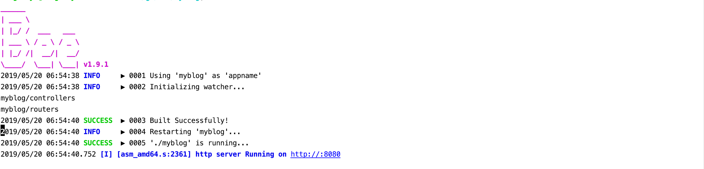

初始化数据库后，已创建好一张数据表user：

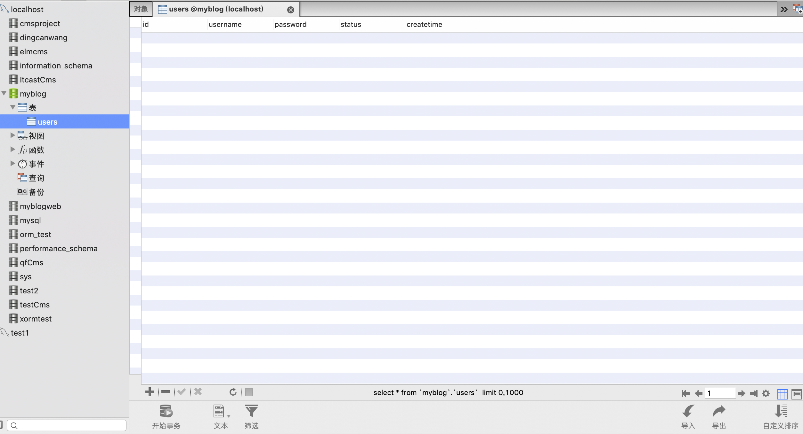

打开浏览器，输入 `http://localhost:8080/register`，然后输入用户名和密码进行注册：

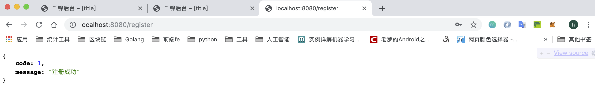

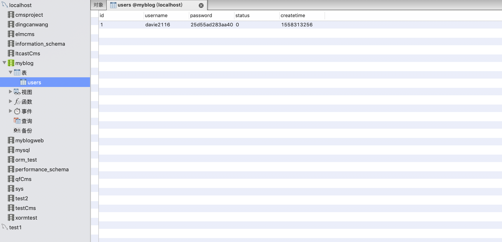

## 用户登录功能

### 定义LoginController

```go
type LoginController struct {
    beego.Controller
}
func (this *LoginController) Get() {
    this.TplName = "login.html"
}
```

### 注册登录功能路由

```go
func init() {
    beego.Router("/", &controllers.MainController{})
    beego.Router("/register", &controllers.RegisterController{})
    beego.Router("/login", &controllers.LoginController{})
}
```

### Post方法处理登录请求

```go
func (this *LoginController) Post() {
    username := this.GetString("username")
    password := this.GetString("password")
    fmt.Println("username:", username, ",password:", password)
    id := models.QueryUserWithParam(username, utils.MD5(password))
    fmt.Println("id:",id)
    if id > 0 {
        this.Data["json"] = map[string]interface{}{"code": 1, "message": "登录成功"}
    } else {
        this.Data["json"] = map[string]interface{}{"code": 0, "message": "登录失败"}
    }
    this.ServeJSON()
}
```

### 用户登录的model操作

在user_model.go中，添加根据用户名和密码来查询id的方法：

```go
//根据用户名和密码，查询id
func QueryUserWithParam(username ,password string)int{
    sql:=fmt.Sprintf("where username='%s' and password='%s'",username,password)
    return QueryUserWightCon(sql)
}
```

### 视图层开发

在views包下创建login.html页面，内容与注册页类似。js实现登录逻辑验证：

```js
//登录
$("#login-form").validate({
    rules:{
        username:{
            required:true,
            rangelength:[5,10]
        },
        password:{
            required:true,
            rangelength:[5,10]
        }
    },
    messages:{
        username:{
            required:"请输入用户名",
            rangelength:"用户名必须是5-10位"
        },
        password:{
            required:"请输入密码",
            rangelength:"密码必须是5-10位"
        }
    },
    submitHandler:function (form) {
        var urlStr ="/login"
        alert("urlStr:"+urlStr)
        $(form).ajaxSubmit({
            url:urlStr,
            type:"post",
            dataType:"json",
            success:function (data,status) {
                alert("data:"+data.message+":"+status)
                if(data.code == 1){
                    setTimeout(function () {
                        window.location.href="/"
                    },1000)
                }
            },
            error:function (data,status) {
                alert("err:"+data.message+":"+status)
            }
        });
    }
});
```

### 项目运行

打开浏览器输入 `http://127.0.0.1:8080/login` 然后输入用户名和密码：

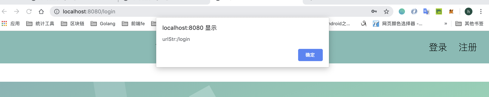

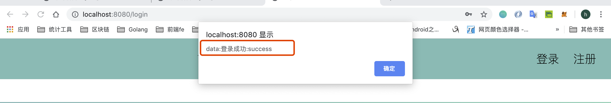

## Session处理

### Session使用场景介绍

用户登录后可以有写博客的功能，也允许用户退出。如果用户没有登录，直接访问首页，只可以查看文章、标签、相册等，但是没有写博客的功能。

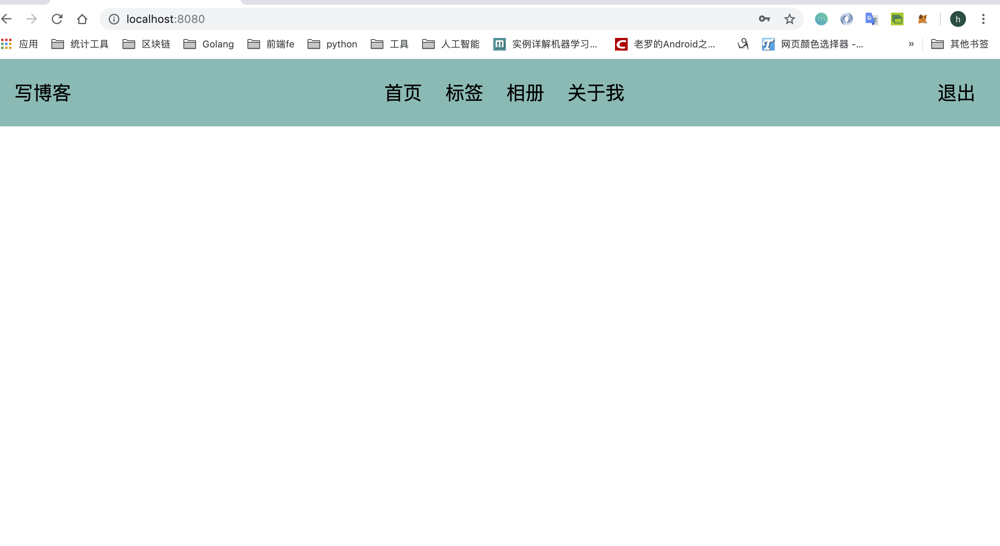

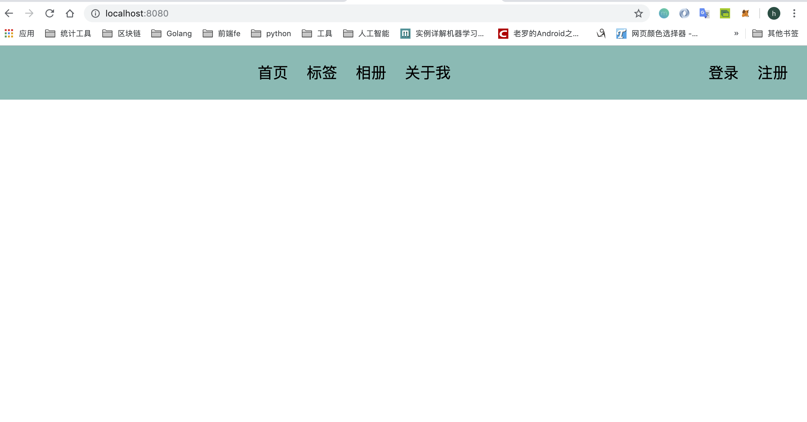

实现该功能的操作需要使用session。

### 启用Session功能

方式一：修改app.conf文件，添加一行：

```ini
sessionon = true
```

方式二：在main.go中打开session：

```go
func main() {
    utils.InitMysql()
    beego.BConfig.WebConfig.Session.SessionOn = true // 打开session
    beego.Run()
}
```

### 登录功能添加Session处理

修改登录的Post方法，在登录时设置session：

```go
func (this *LoginController) Post() {
    ...
    if id > 0 {
        // 设置了session会将数据处理设置到cookie
        this.SetSession("loginuser", username)
        this.Data["json"] = map[string]interface{}{"code": 1, "message": "登录成功"}
    } else {
        this.Data["json"] = map[string]interface{}{"code": 0, "message": "登录失败"}
    }
    this.ServeJSON()
}
```

### 添加首页路由

```go
func init() {
    beego.Router("/", &controllers.HomeController{})
    beego.Router("/register", &controllers.RegisterController{})
    beego.Router("/login", &controllers.LoginController{})
}
```

### 添加首页控制器

先创建一个父Controller，用于获取session，判断用户是否登录。创建base_controller.go：

```go
type BaseController struct {
    beego.Controller
    IsLogin   bool
    Loginuser interface{}
}

//判断是否登录
func (this *BaseController) Prepare() {
    loginuser := this.GetSession("loginuser")
    fmt.Println("loginuser---->", loginuser)
    if loginuser != nil {
        this.IsLogin = true
        this.Loginuser = loginuser
    } else {
        this.IsLogin = false
    }
    this.Data["IsLogin"] = this.IsLogin
}
```

Prepare()函数会在Method方法之前执行，用户可重写此函数实现用户验证之类。再创建home_controller.go：

```go
type HomeController struct {
    BaseController
}

func (this *HomeController)Get(){
    fmt.Println("IsLogin:",this.IsLogin,this.Loginuser)
    this.TplName="home.html"
}
```

### 视图层嵌套布局

在views目录下创建子目录block，里面创建nav.html，后续的每个页面都有这几个功能：


```html
<div id="nav">
    <div id="nav-write-article">
        <ul>
        {{/*如果已经登录，才会显示"写博客"*/}}
        {{if .IsLogin}}
            <li><a href="/article/add">写博客</a></li>
        {{end}}
        </ul>
    </div>

    <div id="nav-menu">
        <ul>
            <li><a href="/">首页</a></li>
            <li><a href="/tags">标签</a></li>
            <li><a href="/album">相册</a></li>
            <li><a href="/#">关于我</a></li>
        </ul>
    </div>

    <div id="nav-login">
        <ul>
        {{if .IsLogin}}
            <li><a href='javascript:if(confirm("确定退出吗？")){location="/exit"}'>退出</a></li>
        {{else}}
            <li><a href="/login">登录</a></li>
            <li><a href="/register">注册</a></li>
        {{end}}
        </ul>
    </div>
</div>
```

在home.html中嵌套nav：

```html
<!DOCTYPE html>
<html lang="en">
<head>
    <meta charset="UTF-8">
    <title>首页</title>
    <link href="../static/css/blogsheet.css" rel="stylesheet">
</head>
<body>
{{template "block/nav.html" .}}
</body>
</html>
```

> 特别注意，`{{template "block/nav.html" .}}`，后面的`.`是传递当前参数到子模板。

### 退出功能

添加退出路由：

```go
beego.Router("/exit", &controllers.ExitController{})
```

创建exit_controller.go：

```go
package controllers

type ExitController struct {
    BaseController
}

func (this *ExitController)Get(){
    //清除该用户登录状态的数据
    this.DelSession("loginuser")
    this.Redirect("/",302)
}
```

项目运行效果：

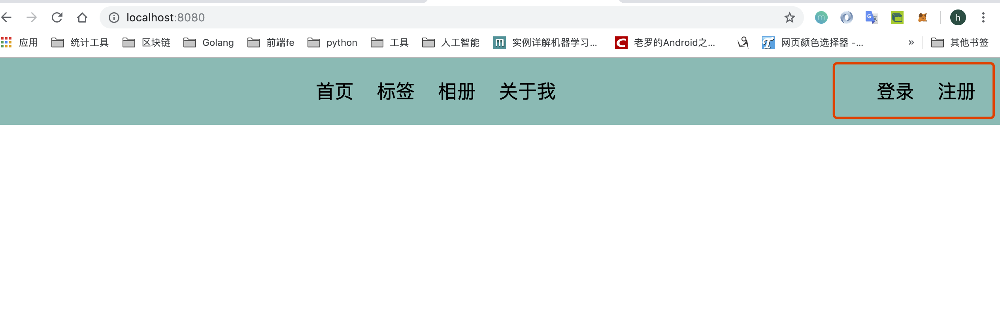

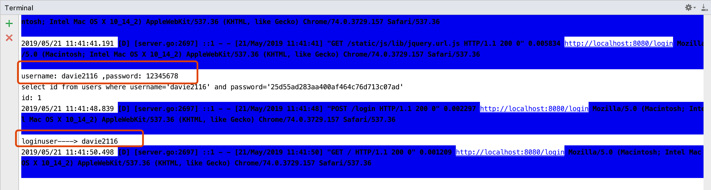

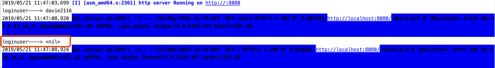

## 写文章功能

### 数据库表设计

创建article表：

```go
//创建文章表
func CreateTableWithArticle(){
    sql:=`create table if not exists article(
        id int(4) primary key auto_increment not null,
        title varchar(30),
        author varchar(20),
        tags varchar(30),
        short varchar(255),
        content longtext,
        createtime int(10)
        );`
    ModifyDB(sql)
}
```

### model层实现

在model目录下创建article_model.go：

```go
type Article struct {
    Id         int
    Title      string
    Tags       string
    Short      string
    Content    string
    Author     string
    Createtime int64
}

//---------数据处理-----------
func AddArticle(article Article) (int64, error) {
    i, err := insertArticle(article)
    return i, err
}

//-----------数据库操作---------------
//插入一篇文章
func insertArticle(article Article) (int64, error) {
    return utils.ModifyDB("insert into article(title,tags,short,content,author,createtime) values(?,?,?,?,?,?)",
        article.Title, article.Tags, article.Short, article.Content, article.Author, article.Createtime)
}
```

### 控制器层

创建add_article_controller.go：

```go
type AddArticleController struct {
    BaseController
}

// 当访问/add路径的时候会触发AddArticleController的Get方法
func (this *AddArticleController) Get() {
    this.TplName = "write_article.html"
}

func (this *AddArticleController) Post() {
    //获取浏览器传输的数据，通过表单的name属性获取值
    title := this.GetString("title")
    tags := this.GetString("tags")
    short := this.GetString("short")
    content := this.GetString("content")
    fmt.Printf("title:%s,tags:%s\n", title, tags)

    //实例化model，将它插入到数据库中
    art := models.Article{0, title, tags, short, content, "千锋教育", time.Now().Unix()}
    _, err := models.AddArticle(art)

    //返回数据给浏览器
    var response map[string]interface{}
    if err == nil {
        response = map[string]interface{}{"code": 1, "message": "ok"}
    } else {
        response = map[string]interface{}{"code": 0, "message": "error"}
    }

    this.Data["json"] = response
    this.ServeJSON()
}
```

### 注册路由

```go
//写文章
beego.Router("/article/add", &controllers.AddArticleController{})
```

### 视图层开发

在views目录下创建write_article.html：

```html
<!DOCTYPE html>
<html lang="en">
<head>
    <meta charset="UTF-8">
    <title>写文章</title>
    <link href="../static/css/blogsheet.css" rel="stylesheet">
    <script src="../static/js/lib/jquery-3.3.1.min.js"></script>
    <script src="../static/js/lib/jquery.url.js"></script>
    <script src="../static/js/blog.js"></script>
</head>
<body>
{{template "block/nav.html" .}}
<div id="main">
    <form id="write-art-form" method="post">
        <div>标题</div>
        <input type="text" placeholder="请输入标题" name="title" >
        <div>标签</div>
        <input type="text" placeholder="请输入标签" name="tags" >
        <div>简介</div>
        <textarea placeholder="请输入简介" name="short"></textarea>
        <div>内容</div>
        <textarea id="content" placeholder="请输入内容" name="content"></textarea>
        <input id="write-article-id" hidden name="id" >
        <br>
        <button type="button" onclick="history.back()">返回</button>
        <button type="submit" id="write-art-submit">提交</button>
    </form>
</div>
</body>
</html>
```

js脚本：

```js
//添加文章的表单
$("#write-art-form").validate({
    rules: {
        title: "required",
        tags: "required",
        short: {
            required: true,
            minlength: 2
        },
        content: {
            required: true,
            minlength: 2
        }
    },
    messages: {
        title: "请输入标题",
        tags: "请输入标签",
        short: {
            required: "请输入简介",
            minlength: "简介内容最少两个字符"
        },
        content: {
            required: "请输入文章内容",
            minlength: "文章内容最少两个字符"
        }
    },
    submitHandler: function (form) {
        var urlStr = "/article/add";
        $(form).ajaxSubmit({
            url: urlStr,
            type: "post",
            dataType: "json",
            success: function (data, status) {
                alert(":data:" + data.message);
                setTimeout(function () {
                    window.location.href = "/"
                }, 1000)
            },
            error: function (data, status) {
                alert("err:" + data.message + ":" + status)
            }
        });
    }
})
```

### 项目运行

登录后进入首页，点击写文章：

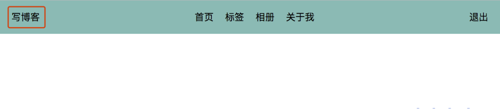

进入写文章页面：

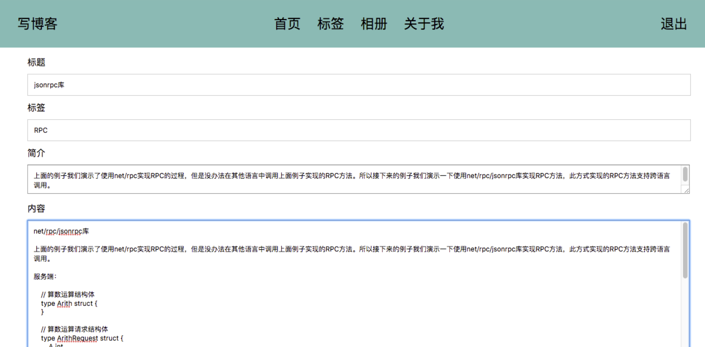

点击按钮进行提交，数据被插入到数据库中。

### 准备测试数据

我们在数据库中插入10条数据：

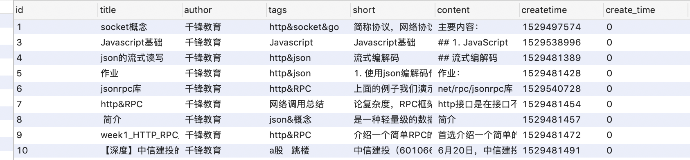

## 项目首页功能

### 查询文章

在home_controller.go的Get()方法中，查询所有文章并分页显示。默认查询第一页：

```go
func (this *HomeController) Get() {
    page, _ := this.GetInt("page")
    if page <= 0 {
        page = 1
    }
    var artList []models.Article
    artList, _ = models.FindArticleWithPage(page)
    this.Data["PageCode"] = 1
    this.Data["HasFooter"] = true
    fmt.Println("IsLogin:", this.IsLogin, this.Loginuser)
    this.Data["Content"] = models.MakeHomeBlocks(artList, this.IsLogin)
    this.TplName = "home.html"
}
```

#### model层处理 — 分页查询

在article_model.go中添加分页查询方法：

```go
//-----------查询文章---------

//根据页码查询文章
func FindArticleWithPage(page int) ([]Article, error) {
    //从配置文件中获取每页的文章数量
    num, _ := beego.AppConfig.Int("articleListPageNum")
    page--
    return QueryArticleWithPage(page, num)
}

/**
分页查询数据库
limit分页查询语句，语法：limit m，n
m代表从多少位开始获取，与id值无关
n代表获取多少条数据
注意limit前面没有where
 */
func QueryArticleWithPage(page, num int) ([]Article, error) {
    sql := fmt.Sprintf("limit %d,%d", page*num, num)
    return QueryArticlesWithCon(sql)
}

func QueryArticlesWithCon(sql string) ([]Article, error) {
    sql = "select id,title,tags,short,content,author,createtime from article " + sql
    rows, err := utils.QueryDB(sql)
    if err != nil {
        return nil, err
    }
    var artList []Article
    for rows.Next() {
        id := 0
        title := ""
        tags := ""
        short := ""
        content := ""
        author := ""
        var createtime int64
        createtime = 0
        rows.Scan(&id, &title, &tags, &short, &content, &author, &createtime)
        art := Article{id, title, tags, short, content, author, createtime}
        artList = append(artList, art)
    }
    return artList, nil
}
```

#### 首页显示内容结构体定义

在models目录下创建home_model.go：

```go
type HomeBlockParam struct {
    Id         int
    Title      string
    Tags       [] TagLink
    Short      string
    Content    string
    Author     string
    CreateTime string
    //查看文章的地址
    Link string
    //修改文章的地址
    UpdateLink string
    DeleteLink string
    //记录是否登录
    IsLogin bool
}

//标签链接
type TagLink struct {
    TagName string
    TagUrl  string
}
```

#### 首页内容显示功能

```go
//----------首页显示内容---------
func MakeHomeBlocks(articles []Article, isLogin bool) template.HTML {
    htmlHome := ""
    for _, art := range articles {
        //将数据库model转换为首页模板所需要的model
        homeParam := HomeBlockParam{}
        homeParam.Id = art.Id
        homeParam.Title = art.Title
        homeParam.Tags = createTagsLinks(art.Tags)
        homeParam.Short = art.Short
        homeParam.Content = art.Content
        homeParam.Author = art.Author
        homeParam.CreateTime = utils.SwitchTimeStampToData(art.Createtime)
        homeParam.Link = "/article/" + strconv.Itoa(art.Id)
        homeParam.UpdateLink = "/article/update?id=" + strconv.Itoa(art.Id)
        homeParam.DeleteLink = "/article/delete?id=" + strconv.Itoa(art.Id)
        homeParam.IsLogin = isLogin

        //处理变量
        t, _ := template.ParseFiles("views/block/home_block.html")
        buffer := bytes.Buffer{}
        t.Execute(&buffer, homeParam)
        htmlHome += buffer.String()
    }
    return template.HTML(htmlHome)
}
```

### 文章分页展示

#### 分页结构体定义

在home_model.go中添加分页的结构体对象：

```go
type HomeFooterPageCode struct {
    HasPre   bool
    HasNext  bool
    ShowPage string
    PreLink  string
    NextLink string
}
```

#### 查询文章总条数及分页处理方法

```go
//-----------翻页-----------
func ConfigHomeFooterPageCode(page int) HomeFooterPageCode {
    pageCode := HomeFooterPageCode{}
    //查询出总的条数
    num := GetArticleRowsNum()
    //从配置文件中读取每页显示的条数
    pageRow, _ := beego.AppConfig.Int("articleListPageNum")
    //计算出总页数
    allPageNum := (num-1)/pageRow + 1
    pageCode.ShowPage = fmt.Sprintf("%d/%d", page, allPageNum)
    //当前页数小于等于1，那么上一页的按钮不能点击
    if page <= 1 {
        pageCode.HasPre = false
    } else {
        pageCode.HasPre = true
    }
    //当前页数大于等于总页数，那么下一页的按钮不能点击
    if page >= allPageNum {
        pageCode.HasNext = false
    } else {
        pageCode.HasNext = true
    }
    pageCode.PreLink = "/?page=" + strconv.Itoa(page-1)
    pageCode.NextLink = "/?page=" + strconv.Itoa(page+1)
    return pageCode
}
```

在article_model.go中，加入查询总数据量的方法：

```go
//------翻页------
//存储表的行数，只有自己可以更改
var artcileRowsNum = 0

//只有首次获取行数的时候才统计表里的行数
func GetArticleRowsNum() int {
    if artcileRowsNum == 0 {
        artcileRowsNum = QueryArticleRowNum()
    }
    return artcileRowsNum
}

//查询文章的总条数
func QueryArticleRowNum() int {
    row := utils.QueryRowDB("select count(id) from article")
    num := 0
    row.Scan(&num)
    return num
}

//设置页数（当新增或删除文章时调用）
func SetArticleRowsNum(){
    artcileRowsNum = QueryArticleRowNum()
}
```

#### 修改首页视图添加分页控件

修改home.html：

```html
<!DOCTYPE html>
<html lang="en">
<head>
    <meta charset="UTF-8">
    <title>首页</title>
    <link href="../static/css/blogsheet.css" rel="stylesheet">
</head>
<body>
{{template "block/nav.html" .}}
<div id="main">
{{.Content}}
{{if .HasFooter}}
    <div id="home-footer">
        <a {{if .PageCode.HasPre}}href="{{.PageCode.PreLink}}" {{else}} class="disable" {{end}}>上一页</a>
        <span>{{.PageCode.ShowPage}}页</span>
        <a {{if .PageCode.HasNext}}href="{{.PageCode.NextLink}}" {{else}} class="disable" {{end}}>下一页</a>
    </div>
{{end}}
</div>
</body>
</html>
```

### 项目运行效果

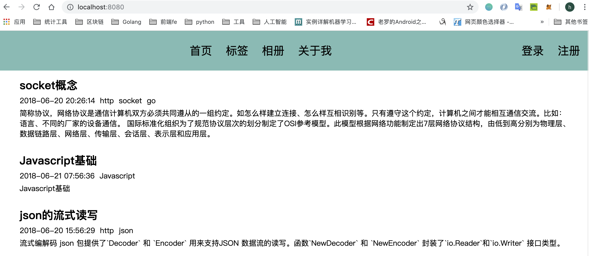

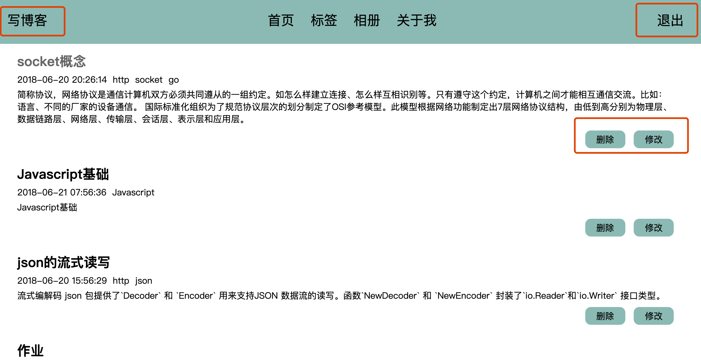

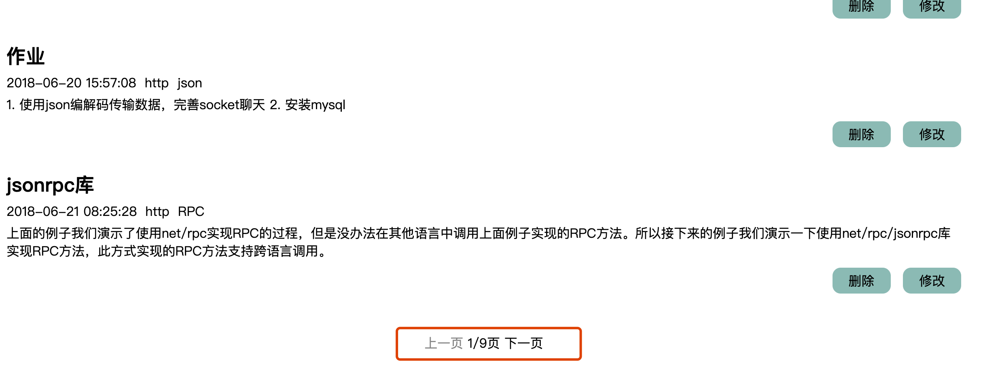

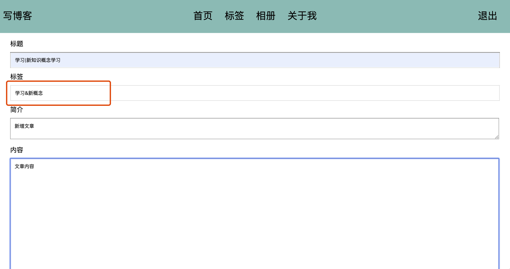

## 文章详情功能

### 查看文章详情

添加路由：

```go
//显示文章内容
beego.Router("/article/:id", &controllers.ShowArticleController{})
```

创建show_article_controller.go：

```go
type ShowArticleController struct {
    BaseController
}

func (this *ShowArticleController) Get() {
    idStr := this.Ctx.Input.Param(":id")
    id, _ := strconv.Atoi(idStr)
    fmt.Println("id:", id)
    //获取id所对应的文章信息
    art := models.QueryArticleWithId(id)
    this.Data["Title"] = art.Title
    this.Data["Content"] = art.Content
    this.TplName="show_article.html"
}
```

在article_model.go中添加根据id查询文章的方法：

```go
//----------查询文章-------------
func QueryArticleWithId(id int) Article {
    row := utils.QueryRowDB("select id,title,tags,short,content,author,createtime from article where id=" + strconv.Itoa(id))
    title := ""
    tags := ""
    short := ""
    content := ""
    author := ""
    var createtime int64
    createtime = 0
    row.Scan(&id, &title, &tags, &short, &content, &author, &createtime)
    art := Article{id, title, tags, short, content, author, createtime}
    return art
}
```

创建show_article.html视图：

```html
<!DOCTYPE html>
<html lang="en">
<head>
    <meta charset="UTF-8">
    <title>{{.Title}}</title>
    <link href="../static/css/blogsheet.css" rel="stylesheet">
</head>
<body>
{{template "block/nav.html" .}}
<div id="main">
    <h1>{{.Title}}</h1>
    <div>{{.Content}}</div>
</div>
</body>
</html>
```

### 项目运行

接下来我们重启项目，并刷新页面,并点击一篇文章：

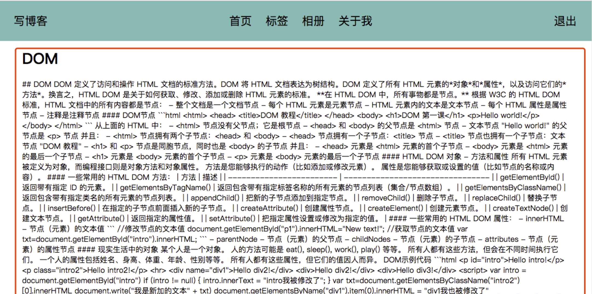

虽然页面能够显示文章内容，但是看着很不舒服，一锅粥一样，我们通过markdown语法格式显示。

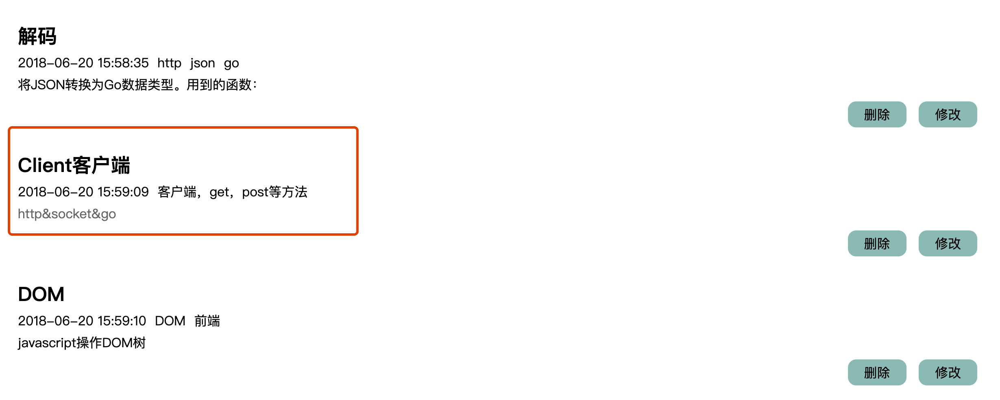

### Markdown格式支持

安装markdown相关包：

```shell
go get github.com/russross/blackfriday
go get github.com/PuerkitoBio/goquery
go get github.com/sourcegraph/syntaxhighlight
```

#### 工具库源码

安装之后也可以到src目录下查看：

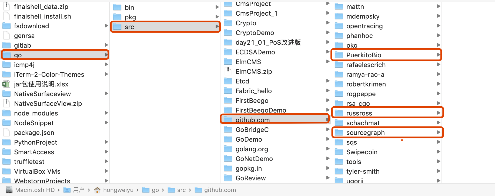

在utils目录下myUtils.go中添加Markdown语法转换方法：

```go
func SwitchMarkdownToHtml(content string) template.HTML {
    markdown := blackfriday.MarkdownCommon([]byte(content))

    //获取到html文档
    doc, _ := goquery.NewDocumentFromReader(bytes.NewReader(markdown))
    /**
    对document进程查询，选择器和css的语法一样
    第一个参数：i是查询到的第几个元素
    第二个参数：selection就是查询到的元素
     */
    doc.Find("code").Each(func(i int, selection *goquery.Selection) {
        light, _ := syntaxhighlight.AsHTML([]byte(selection.Text()))
        selection.SetHtml(string(light))
        fmt.Println(selection.Html())
        fmt.Println("light:", string(light))
        fmt.Println("\n\n\n")
    })
    htmlString, _ := doc.Html()
    return template.HTML(htmlString)
}
```

修改controller中的Get()方法，将`art.Content`传入`SwitchMarkdownToHtml`方法：

```go
func (this *ShowArticleController) Get() {
    ...
    this.Data["Title"] = art.Title
    this.Data["Content"] = utils.SwitchMarkdownToHtml(art.Content)
    this.TplName="show_article.html"
}
```

在show_article.html页面上导入highlight样式包：

```html
<link href="../static/css/lib/highlight.css" rel="stylesheet">
```

项目运行效果：

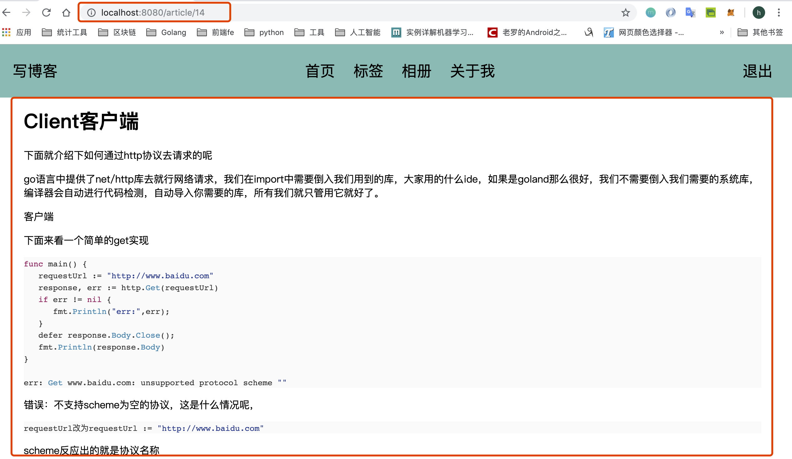

## 修改文章功能

### 添加修改文章路由

```go
//更新文章
beego.Router("/article/update", &controllers.UpdateArticleController{})
```

### 修改文章控制器（GET方法）

创建update_article_controller.go，当点击修改按钮时，通过get请求进入Get()方法，显示写文章页面并填充已有数据：

```go
type UpdateArticleController struct {
    BaseController
}

func (this *UpdateArticleController) Get() {
    id, _ := this.GetInt("id")
    fmt.Println(id)
    //获取id所对应的文章信息
    art := models.QueryArticleWithId(id)
    this.Data["Title"] = art.Title
    this.Data["Tags"] = art.Tags
    this.Data["Short"] = art.Short
    this.Data["Content"] = art.Content
    this.Data["Id"] = art.Id
    this.TplName = "write_article.html"
}
```

### 修改文章控制器（POST方法）

当用户点击提交按钮，触发post请求，进入Post()方法：

```go
func (this *UpdateArticleController) Post() {
    id, _ := this.GetInt("id")
    fmt.Println("postid:", id)
    //获取浏览器传输的数据
    title := this.GetString("title")
    tags := this.GetString("tags")
    short := this.GetString("short")
    content := this.GetString("content")
    //实例化model，修改数据库
    art := models.Article{id, title, tags, short, content, "", 0}
    _, err := models.UpdateArticle(art)
    //返回数据给浏览器
    if err == nil {
        this.Data["json"] = map[string]interface{}{"code": 1, "message": "更新成功"}
    } else {
        this.Data["json"] = map[string]interface{}{"code": 0, "message": "更新失败"}
    }
    this.ServeJSON()
}
```

### 视图层修改

修改文章和写文章用同一个页面，在write_article.html页面中：

```html
<form id="write-art-form" method="post">
    <div>标题</div>
    <input type="text" placeholder="请输入标题" name="title" value="{{.Title}}">
    <div>标签</div>
    <input type="text" placeholder="请输入标签" name="tags" value="{{.Tags}}">
    <div>简介</div>
    <textarea placeholder="请输入简介" name="short">{{.Short}}</textarea>
    <div>内容</div>
    <textarea id="content" placeholder="请输入内容" name="content">{{.Content}}</textarea>
    <input id="write-article-id" hidden name="id" value="{{.Id}}">
    <button type="button" onclick="history.back()">返回</button>
    <button type="submit" id="write-art-submit">提交</button>
</form>
```

修改js脚本，判断id确定是添加还是修改：

```js
submitHandler: function (form) {
    alert("hello")
    var urlStr = "/article/add";
    //判断文章id确定提交的表单的服务器地址
    var artId = $("#write-article-id").val();
    alert("artId:" + artId);
    if (artId > 0) {
        urlStr = "/article/update"
    }
    alert("urlStr:" + urlStr);
    $(form).ajaxSubmit({
        url: urlStr,
        type: "post",
        dataType: "json",
        success: function (data, status) {
            alert(":data:" + data.message);
            setTimeout(function () {
                window.location.href = "/"
            }, 1000)
        },
        error: function (data, status) {
            alert("err:" + data.message + ":" + status)
        }
    });
```

### model层添加修改数据方法

在article_model.go文件中添加：

```go
//----------修改数据----------
func UpdateArticle(article Article) (int64, error) {
    //数据库操作
    return utils.ModifyDB("update article set title=?,tags=?,short=?,content=? where id=?",
        article.Title, article.Tags, article.Short, article.Content, article.Id)
}
```

### 项目运行效果

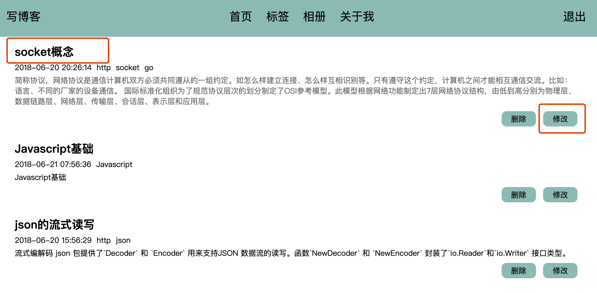

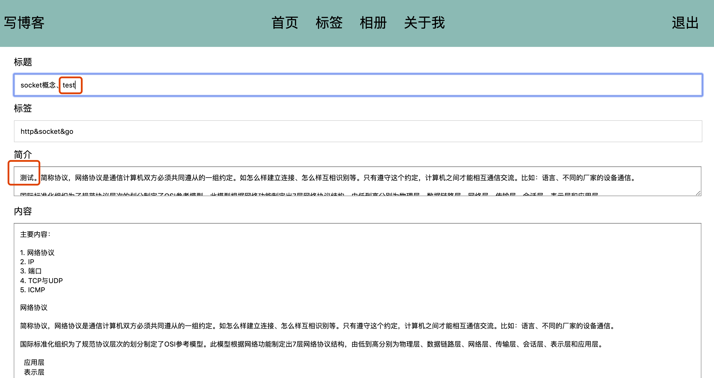

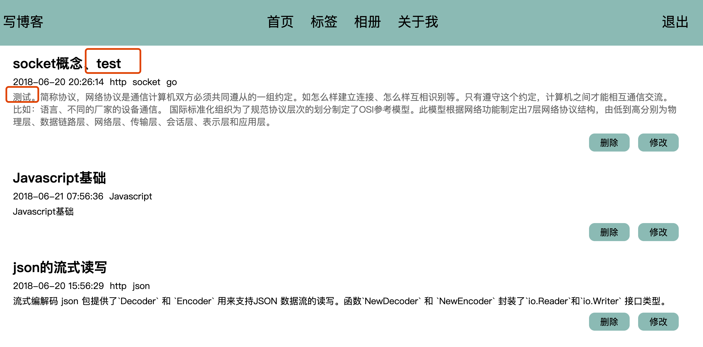

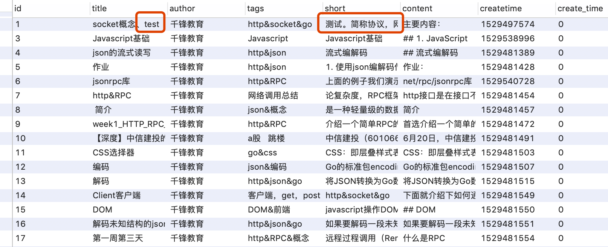

## 删除文章功能

### model添加删除方法

在article_model.go文件中添加：

```go
//----------删除文章---------
func DeleteArticle(artID int) (int64, error) {
    i, err := deleteArticleWithArtId(artID)
    SetArticleRowsNum()
    return i, err
}

func deleteArticleWithArtId(artID int) (int64, error) {
    return utils.ModifyDB("delete from article where id=?", artID)
}
```

视图层中，已登录用户可以看到删除按钮：

```html
{{if .IsLogin}}
    <div class="home-block-item-udpate">
        <a href='javascript:if(confirm("确定删除吗？")){location="{{.DeleteLink}}}"}'>删除</a>
        <a href={{.UpdateLink}}>修改</a>
    </div>
{{end}}
```

### 删除文章控制器

在controllers目录下创建delete_article_controller.go：

```go
package controllers
import (
    "fmt"
    "myblogweb/models"
    "log"
)

type DeleteArticleController struct {
    BaseController
}

//点击删除后重定向到首页
func (this *DeleteArticleController) Get() {
    artID, _ := this.GetInt("id")
    fmt.Println("删除 id:", artID)
    _, err := models.DeleteArticle(artID)
    if err != nil {
        log.Println(err)
    }
    this.Redirect("/", 302)
}
```

### 添加删除文章路由

```go
// 删除文章
beego.Router("/article/delete", &controllers.DeleteArticleController{})
```

### 项目运行效果

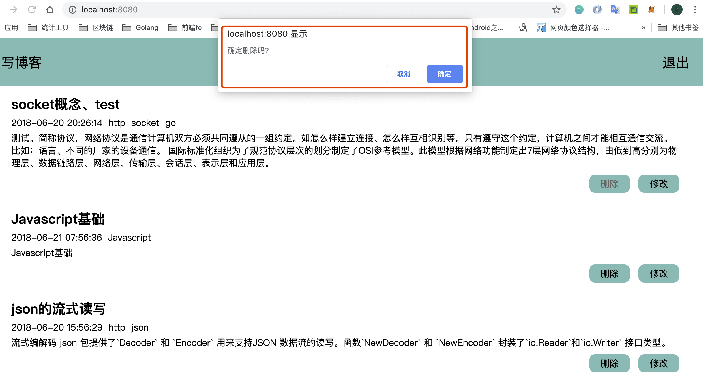

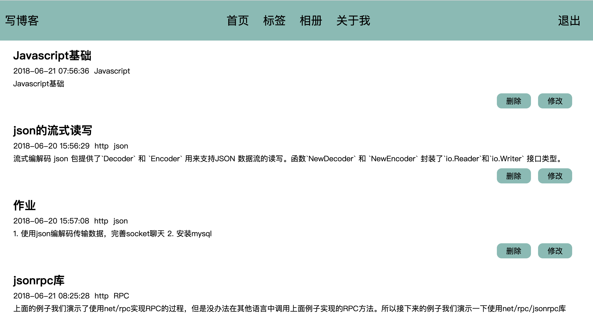

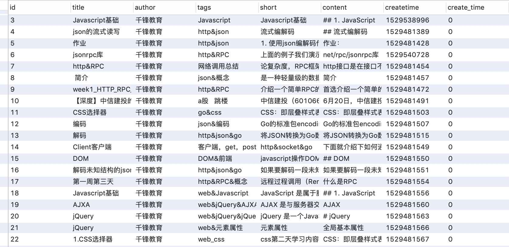

## 标签功能

### model层

在article_model.go文件中，查询出所有的标签：

```go
//查询标签，返回一个字段的列表
func QueryArticleWithParam(param string) []string {
    rows, err := utils.QueryDB(fmt.Sprintf("select %s from article", param))
    if err != nil {
        log.Println(err)
    }
    var paramList []string
    for rows.Next() {
        arg := ""
        rows.Scan(&arg)
        paramList = append(paramList, arg)
    }
    return paramList
}
```

创建tags_model.go：

```go
package models
import "strings"

func HandleTagsListData(tags []string) map[string]int {
    var tagsMap = make(map[string]int)
    for _, tag := range tags {
        tagList := strings.Split(tag, "&")
        for _, value := range tagList {
            tagsMap[value]++
        }
    }
    return tagsMap
}
```

### 添加控制器层

创建tags_controller.go：

```go
package controllers

import (
    "myblogweb/models"
    "fmt"
)

type TagsController struct {
    BaseController
}

func (this *TagsController) Get() {
    tags := models.QueryArticleWithParam("tags")
    fmt.Println(models.HandleTagsListData(tags))
    this.Data["Tags"] = models.HandleTagsListData(tags)
    this.TplName = "tags.html"
}
```

### 添加标签功能路由

```go
//标签
beego.Router("/tags", &controllers.TagsController{})
```

### 添加视图层文件

在views包下新建tags.html：

```html
<!DOCTYPE html>
<html lang="en">
<head>
    <meta charset="UTF-8">
    <title>标签</title>
    <link href="../static/css/blogsheet.css" rel="stylesheet">
</head>
<body>
{{template "block/nav.html" .}}
<div id="main">
    <h1>标签</h1>
    <div id="tags-list">
    {{range $k,$v := .Tags}}
        <div><a href="/?tag={{$k}}"><span class="global-color">{{$k}}</span> 有{{$v}}篇文章</a></div>{{end}}
    </div>
</div>
</body>
</html>
```

### 项目运行效果

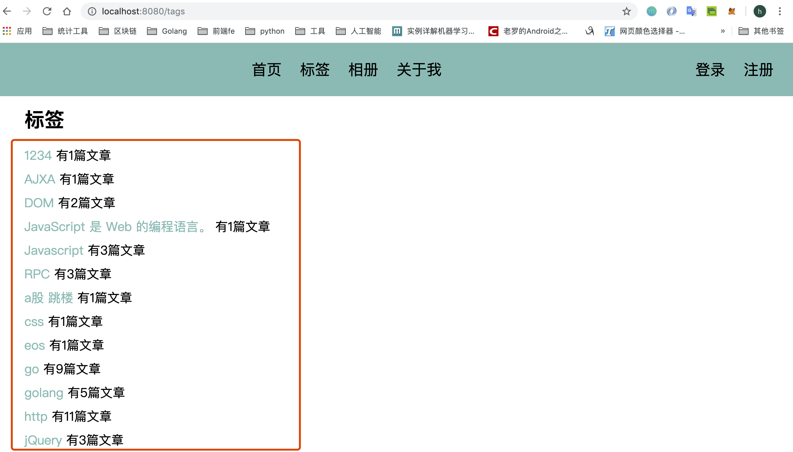

## 首页功能扩展

### 修改首页逻辑

修改home_controller.go，支持按tag和page分类查询：

```go
func (this *HomeController) Get() {
    tag := this.GetString("tag")
    fmt.Println("tag:", tag)
    page, _ := this.GetInt("page")
    var artList []models.Article
    if len(tag) > 0 {
        //按照指定的标签搜索
        artList, _ = models.QueryArticlesWithTag(tag)
        this.Data["HasFooter"] = false
    } else {
        if page <= 0 {
            page = 1
        }
        artList, _ = models.FindArticleWithPage(page)
        this.Data["PageCode"] = models.ConfigHomeFooterPageCode(page)
        this.Data["HasFooter"] = true
    }
    fmt.Println("IsLogin:", this.IsLogin, this.Loginuser)
    this.Data["Content"] = models.MakeHomeBlocks(artList, this.IsLogin)
    this.TplName = "home.html"
}
```

有三种情况：
1. 如果tag有值，page就不会有值（如 `/?tag=web`）
2. 如果page有值，那么tag就不会有值（如 `/?page=3`）
3. 用户直接访问首页，没有传入tag也没有传入page

### model层按标签查询

在article_model.go中添加方法，支持四种标签匹配情况：

```go
//--------------按照标签查询--------------
func QueryArticlesWithTag(tag string) ([]Article, error) {
    sql := " where tags like '%&" + tag + "&%'"
    sql += " or tags like '%&" + tag + "'"
    sql += " or tags like '" + tag + "&%'"
    sql += " or tags like '" + tag + "'"
    fmt.Println(sql)
    return QueryArticlesWithCon(sql)
}
```

### 项目运行效果

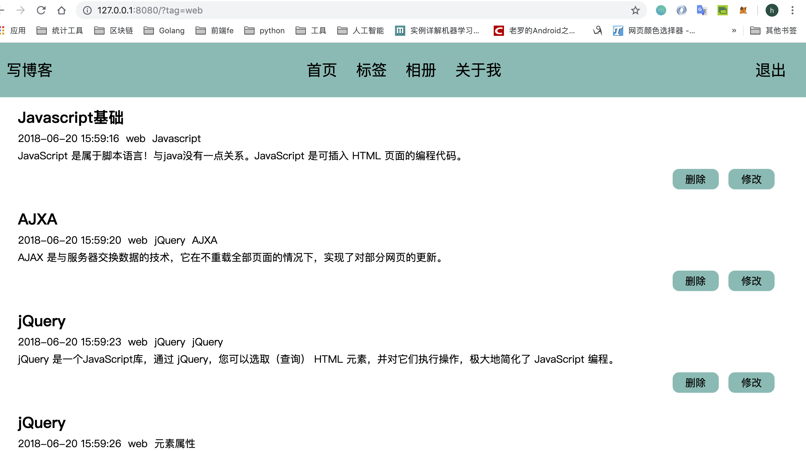

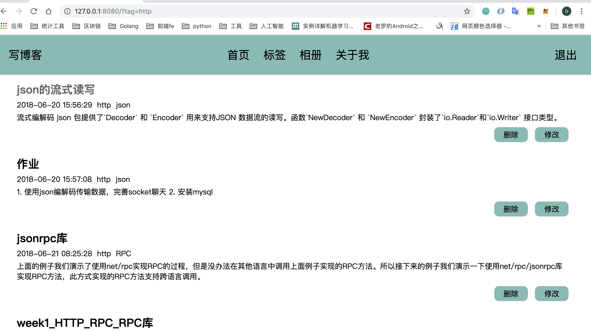

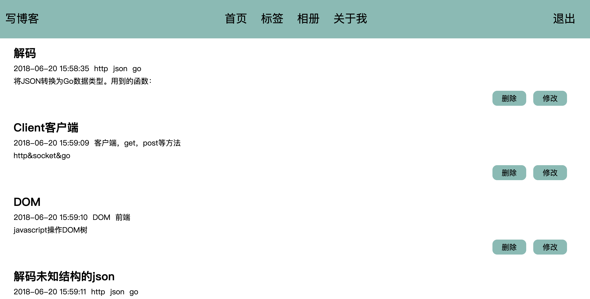

## 文件上传和图片展示

### 创建数据表album

在utils工具包下的mysqlUtil.go文件中，添加创建数据表的方法：

```go
//--------图片--------
func CreateTableWithAlbum() {
    sql := `create table if not exists album(
        id int(4) primary key auto_increment not null,
        filepath varchar(255),
        filename varchar(64),
        status int(4),
        createtime int(10)
        );`
    ModifyDB(sql)
}
```

在InitMysql初始化方法中进行调用：

```go
func InitMysql() {
    fmt.Println("InitMysql....")
    if db == nil {
        db, _ = sql.Open("mysql", "root:hanru1314@tcp(127.0.0.1:3306)/myblogweb")
        CreateTableWithUser()
        CreateTableWithArticle()
        CreateTableWithAlbum()
    }
}
```

### AlbumController控制器

创建album_controller.go：

```go
package controllers
import (
    "myblog/models"
    "github.com/opentracing/opentracing-go/log"
)
type AlbumController struct {
    BaseController
}
func (this *AlbumController) Get() {
    this.TplName="album.html"
}
```

### 视图层实现

在views目录下创建album.html：

```html
<!DOCTYPE html>
<html lang="en">
<head>
    <meta charset="UTF-8">
    <title>相册</title>
    <script src="../static/js/lib/jquery-3.3.1.min.js"></script>
    <script src="../static/js/lib/jquery.url.js"></script>
    <script src="../static/js/blog.js"></script>
    <link href="../static/css/blogsheet.css" rel="stylesheet">
</head>
<body>
{{template "block/nav.html" .}}
<div id="main">
    <form method="post">
        <input type="file" id="album-upload-file" name="upload">
        <input type="button" id="album-upload-button" value="提交文件">
    </form>
</div>
</body>
</html>
```

js实现文件上传：

```js
//文件上传
$("#album-upload-button").click(function () {
    var filedata = $("#album-upload-file").val();
    if (filedata.length <= 0) {
        alert("请选择文件!");
        return
    }
    //文件上传通过Formdata去储存文件的数据
    var data = new FormData()
    data.append("upload", $("#album-upload-file")[0].files[0]);
    alert(data)
    var urlStr = "/upload"
    $.ajax({
        url: urlStr,
        type: "post",
        dataType: "json",
        contentType: false,
        data: data,
        processData: false,
        success: function (data, status) {
            alert(":data:" + data.message);
            if (data.code == 1) {
                setTimeout(function () {
                    window.location.href = "/album"
                }, 1000)
            }
        },
        error: function (data, status) {
            alert("err:" + data.message + ":" + status)
        }
    })
})
```

### UploadController文件上传控制器

创建upload_controller.go：

```go
package controllers

import (
    "fmt"
    "time"
    "path/filepath"
    "os"
    "io"
    "myblog/models"
)

type UploadController struct {
    BaseController
}

func (this *UploadController) Post() {
    fmt.Println("fileupload...")
    fileData, fileHeader, err := this.GetFile("upload")
    if err != nil {
        this.responseErr(err)
        return
    }
    fmt.Println("name:", fileHeader.Filename, fileHeader.Size)
    now := time.Now()
    fmt.Println("ext:", filepath.Ext(fileHeader.Filename))
    fileType := "other"
    //判断后缀为图片的文件，如果是图片我们才存入到数据库中
    fileExt := filepath.Ext(fileHeader.Filename)
    if fileExt == ".jpg" || fileExt == ".png" || fileExt == ".gif" || fileExt == ".jpeg" {
        fileType = "img"
    }
    //文件夹路径
    fileDir := fmt.Sprintf("static/upload/%s/%d/%d/%d", fileType, now.Year(), now.Month(), now.Day())
    //ModePerm是0777
    err = os.MkdirAll(fileDir, os.ModePerm)
    if err != nil {
        this.responseErr(err)
        return
    }
    //文件路径
    timeStamp := time.Now().Unix()
    fileName := fmt.Sprintf("%d-%s", timeStamp, fileHeader.Filename)
    filePathStr := filepath.Join(fileDir, fileName)
    desFile, err := os.Create(filePathStr)
    if err != nil {
        this.responseErr(err)
        return
    }
    //将浏览器客户端上传的文件拷贝到本地路径的文件里面
    _, err = io.Copy(desFile, fileData)
    if err != nil {
        this.responseErr(err)
        return
    }
    if fileType == "img" {
        album := models.Album{0, filePathStr, fileName, 0, timeStamp}
        models.InsertAlbum(album)
    }
    this.Data["json"] = map[string]interface{}{"code": 1, "message": "上传成功"}
    this.ServeJSON()
}

func (this *UploadController) responseErr(err error) {
    this.Data["json"] = map[string]interface{}{"code": 0, "message": err}
    this.ServeJSON()
}
```

### 注册相册和文件上传路由

```go
//相册
beego.Router("/album", &controllers.AlbumController{})
//文件上传
beego.Router("/upload", &controllers.UploadController{})
```

### 添加相册model

创建album_model.go：

```go
type Album struct {
    Id         int
    Filepath   string
    Filename   string
    Status     int
    Createtime int64
}

//-------插入图片---------------
func InsertAlbum(album Album) (int64, error) {
    return utils.ModifyDB("insert into album(filepath,filename,status,createtime)values(?,?,?,?)",
        album.Filepath, album.Filename, album.Status, album.Createtime)
}
```

### 查看图片功能

在album_model.go中添加查询方法：

```go
//--------查询图片----------
func FindAllAlbums() ([]Album, error) {
    rows, err := utils.QueryDB("select id,filepath,filename,status,createtime from album")
    if err != nil {
        return nil, err
    }
    var albums []Album
    for rows.Next() {
        id := 0
        filepath := ""
        filename := ""
        status := 0
        var createtime int64
        createtime = 0
        rows.Scan(&id, &filepath, &filename, &status, &createtime)
        album := Album{id, filepath, filename, status, createtime}
        albums = append(albums, album)
    }
    return albums, nil
}
```

修改album_controller.go的Get()方法：

```go
func (this *AlbumController) Get() {
    albums,err := models.FindAllAlbums()
    if err !=nil{
        log.Error(err)
    }
    this.Data["Album"] = albums
    this.TplName="album.html"
}
```

修改album.html，添加图片展示区域：

```html
<div id="album-box">
    {{range .Album}}
        <div class="album-item" style='background-image: url("{{.Filepath}}");'></div>
    {{end}}
</div>
```

### 文件上传运行效果

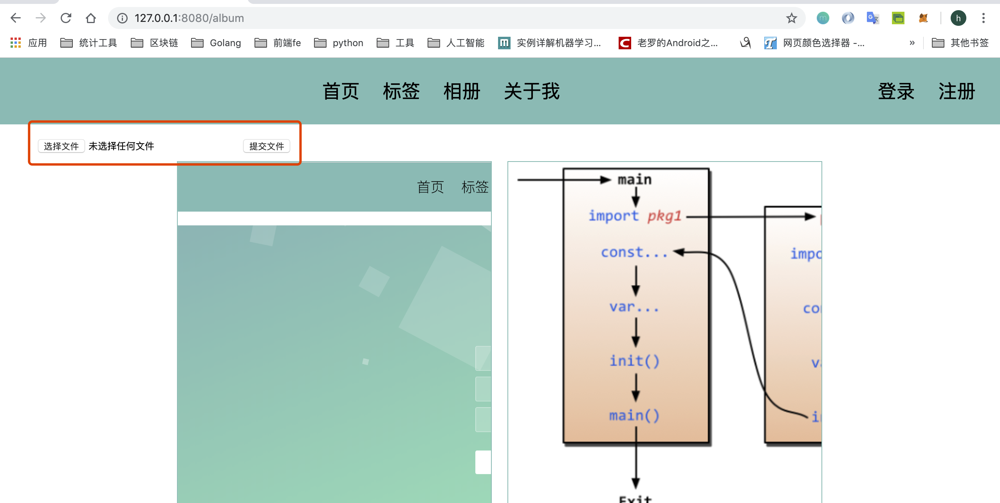

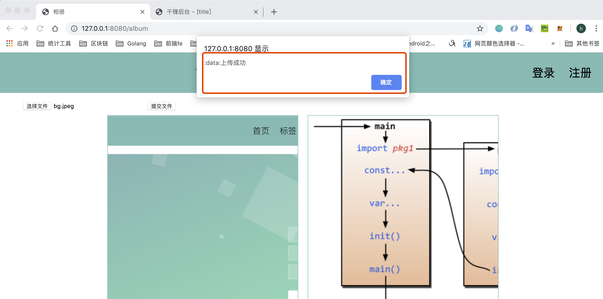

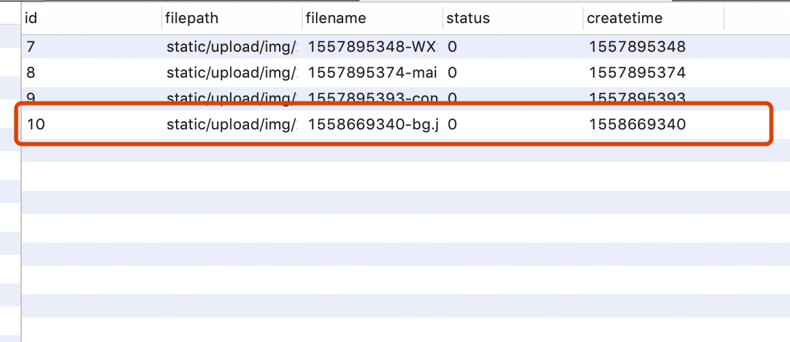

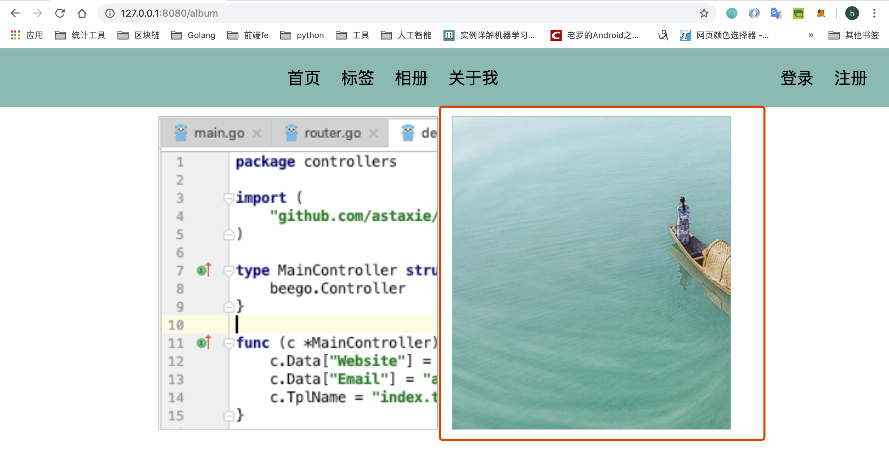

## 关于我功能

### 添加控制器

创建aboutme_controller.go：

```go
package controllers

type AboutMeController struct {
    BaseController
}

func (c *AboutMeController) Get() {
    c.Data["wechat"] = "微信：13167582311"
    c.Data["qq"] = "QQ：861574834"
    c.Data["tel"] = "Tel：13167582311"
    c.TplName = "aboultme.html"
}
```

### 注册路由

```go
//关于我
beego.Router("/aboutme", &controllers.AboutMeController{})
```

## 课程总结

经过了本节课程内容，我们完成了使用Beego框架开发一个博客系统。通过该项目，大家能够掌握Beego框架的使用方法。下面回顾一下Beego框架开发一个web项目所需要掌握的重要知识点。

### beego框架组成

Beego框架的八大模块分别是**cache、config、context、httplibs、logs、orm、session、toolbox**等模块组合而成。模块之间高度解耦，依赖性低。

### beego框架调试工具

Beego框架的项目管理工具Bee工具的使用，可以方便开发者管理、调试、打包项目，自动生成项目目录结构等。

### beego程序执行流程

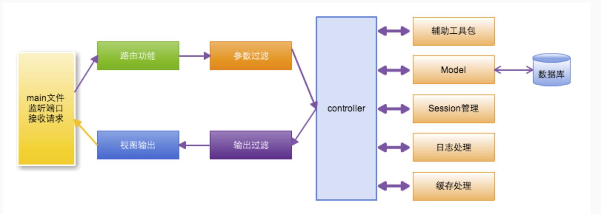

### 数据库操作

- **数据库连接：** beego中的orm支持MySQL，Sqlite3、PostgreSQL。需配置用户名、密码、主机、端口号、数据库名称等。
- **数据库操作：** SQL语句、条件查询、统计功能、增删改查（CRUD）、模糊查询、表关联。

### beego项目架构总结

- **MVC模式：** M（model）模型层，V（view）视图层，C（controller）控制器层。
- **路由解析：** 默认路由（Post、Put、Delete、Head、Options、Patch等）、自动路由、正则表达式路由、自定义路由。
- **Session处理：** 两种管理方式——配置文件配置、程序中通过SessionConfig配置；操作方法——SetSession、GetSession、DelSession。
- **Views视图模板：** views目录存放视图模板文件，controller.TplName指定渲染的页面模板文件，模板文件中通过`{{.param}}`实现变量的使用，controller.Data["param"]为模板页面的变量赋值。
