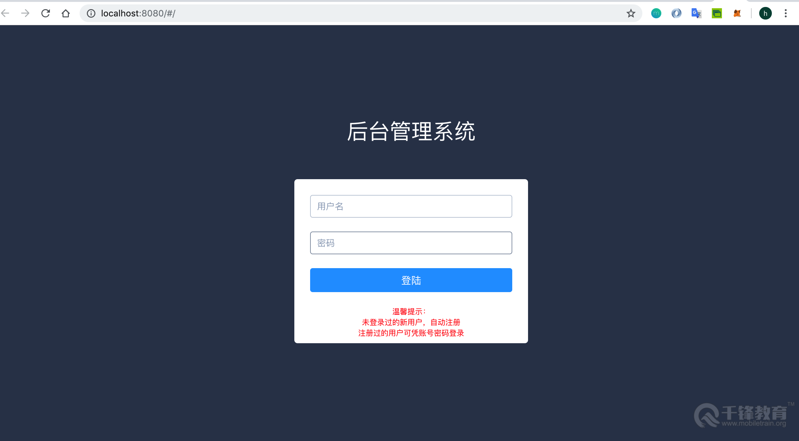
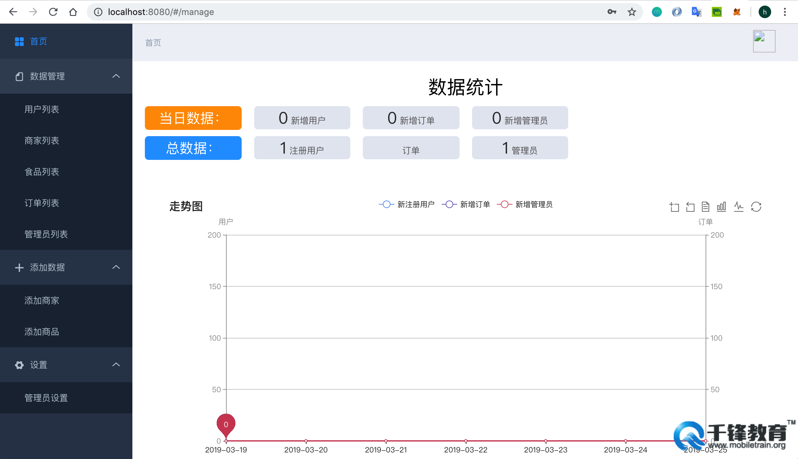
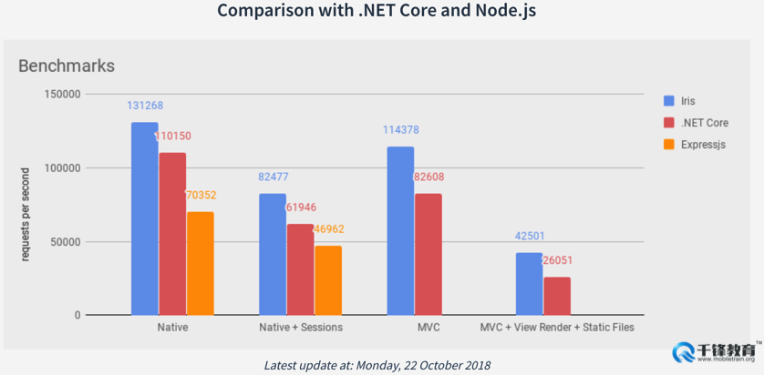
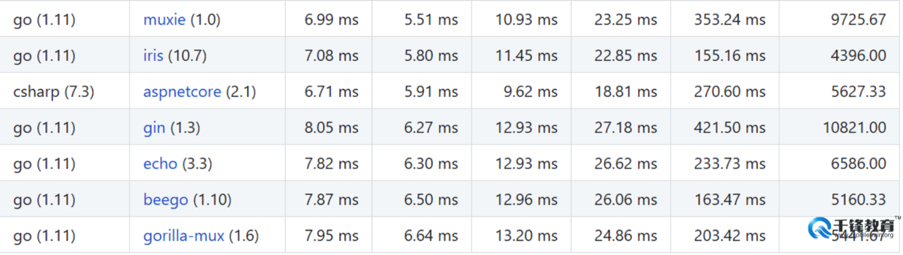
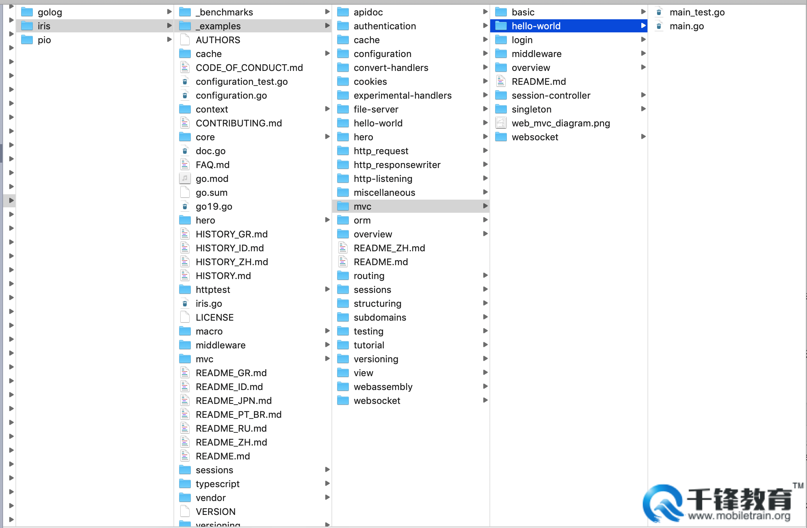
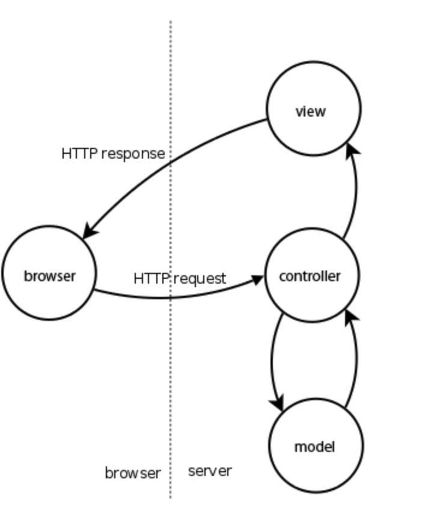
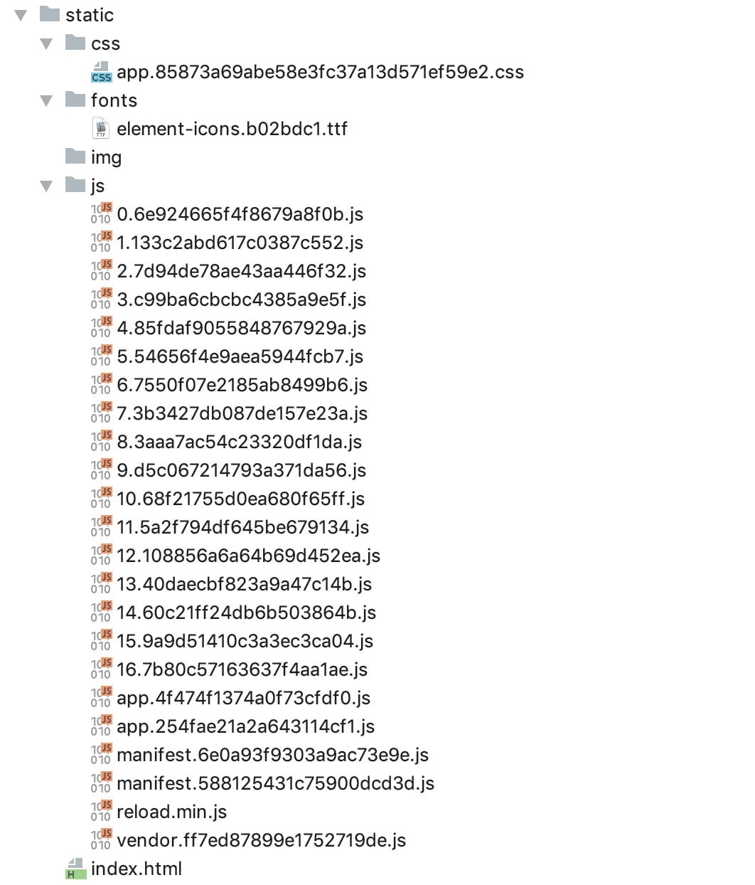

# iris框架

## Web项目开发介绍

### 项目架构

web项目从大的功能上可以分为前台和后台两个部分。前台主要是我们在浏览器中或者桌面应用、Android、iOS移动应用等直接面向用户的程序，直接接受用户的操作和使用，我们称之为前台，也称之为客户端；为前台应用提供数据和功能调用的部署运行在服务器上的程序，用于操作处理前端应用的数据，我们称之为后台，也称之为服务端。类似于这种客户端和服务端的架构，我们通常称之为CS模式，C为client的缩写，S为server的缩写。

### 开发流程

#### 需求确定

在需求确定阶段，主要由产品经理进行确定系统的功能与性能。确认了具体需求后，产品经理会将产品功能进行设计，通常称该阶段为产品原型设计过程。

#### 分析与设计

在需求确定以后，接下来进入到分析与设计阶段。在该阶段中，又分为几个小阶段：
- **架构分析与设计：** 逻辑架构、物理架构（服务器配置、数据库配置）、技术选型等
- **业务逻辑分析：** 系统用户、使用目的、操作步骤、用户体验与反馈等
- **业务逻辑设计：** 数据库详细设计、对象关系字段映射等
- **界面设计：** UI风格、用户体验等

#### 开发环境搭建

当需求和设计阶段都确定以后，就正式进入开发阶段。首先就是开发环境的搭建，包含硬件环境和软件环境两种。硬件环境是指的开发机器、服务器等硬件设施；软件环境包含开发工具、项目管理平台、软件支持等软件支持。

#### 开发与测试

在实际的项目开发周期中，进行代码开发的周期往往较短。在代码功能开发结束以后，还需要对系统功能进行测试，此时由项目测试人员进行专业的白盒测试、黑盒测试、性能测试、压力测试等全方位、多角度的系统测试。该阶段的开发与测试是交替进行，反复进行多轮，以此来保证开发人员开发的功能的正确性和系统的稳定性。

#### 文档编纂

在系统设计、项目开发与测试过程中，需要遵循一套适用于团队使用和可执行可接受的标准化开发步骤。将项目开发、操作说明、项目架构说明等文档性的内容进行编写并妥善保存，以便在后续项目维护和对接过程中，相关人员对项目能够正确快速的了解和熟悉。

### 实战项目功能介绍

在本系列课程中，将进行一个后台管理平台项目的实战开发，以帮助学习Iris框架的相关用法和项目开发流程。

#### 项目效果





#### 项目架构

- 前端：Vue框架
- 后端：Go语言Iris框架 + MySQL数据库、Redis缓存数据库
- 接口调试工具：Postman

## Iris框架简介

### Golang介绍

Go语言是谷歌推出的一种全新的编程语言，可以在不损失应用程序性能的情况下降低代码的复杂性。Go语言的一些功能：

- 具有现代的程序语言特色，如垃圾回收，帮助程序设计师处理琐碎和重要的内存管理等问题。Go的速度也非常快，几乎和C或C++程序一样快，且能够快速制作程序。
- 该软件是专为构建服务器软件所设计（如Google的Gmail）。
- Go也可解决现今的一大挑战：多核心处理器。一般电脑程序通常依序执行，一次进行一项工作，但多核心处理器更适合并行处理许多工作。

相较于其他语言，Golang之所以发展迅速，与该语言特有的特色密不可分——简洁、快速、安全、并行、有趣、开源，内存管理、数组安全、编译迅速。

### Iris简介

Iris是一款Go语言中用来开发web应用的框架，该框架支持编写一次并在任何地方以最小的机器功率运行，如Android、iOS、Linux和Windows等。该框架只需要一个可执行的服务就可以在平台上运行了。

Iris框架以简单而强大的API而被开发者所熟悉。Iris除了为开发者提供非常简单的访问方式外，还同样支持MVC。另外，用Iris构建微服务也很容易。

在Iris框架的官方网站上，被称为速度最快的Go后端开发框架。Iris框架具备的特点和特性如下：

1. 聚焦高性能
2. 健壮的静态路由支持和通配符子域名支持
3. 视图系统支持超过5以上模板
4. 支持定制事件的高可扩展性Websocket API
5. 带有GC、内存 & Redis提供支持的会话
6. 方便的中间件和插件
7. 完整REST API
8. 能定制HTTP错误
9. 源码改变后自动加载

在GoWeb开发的诸多框架中，各个维度的性能比较如下：





### Iris框架学习渠道

- Iris官网：[https://iris-go.com/](https://iris-go.com/)
- Iris框架源码地址：[https://github.com/kataras/iris](https://github.com/kataras/iris)
- Iris框架中文学习文档：[https://studyiris.com/doc/](https://studyiris.com/doc/)

### Iris框架安装

**环境要求：** iris框架要求golang版本至少为1.8。可以通过`go version`命令来查看当前go环境版本。

安装Iris框架的命令如下：

```shell
go get -u github.com/kataras/iris
```

安装完成Iris框架以后，能够在本地机器的GoPath环境目录中的 `src/github.com/` 目录下找到iris框架对应的包名：



### 源码案例

在iris源码安装完成以后，iris框架为开发者提供了自己学习的实战案例。iris提供的案例在iris框架目录中的 `_example` 目录下，在学习时可以进行参考。

### Iris构造服务实例

在Iris中，构建并运行一个服务实例需要两步：

- 通过 `iris.New()` 方法可以实例化一个应用服务对象 `app`
- 通过 `Run` 方法开启端口监听服务，运行服务实例

如下是一个最简单的Iris服务案例：

```go
package main
import "github.com/kataras/iris"
func main() {
    //1.创建app结构体对象
    app := iris.New()
    //2.端口监听
    app.Run(iris.Addr(":7999"), iris.WithoutServerError(iris.ErrServerClosed))
}
```

## HTTP请求及数据返回格式

### 数据请求方式的分类

HTTP协议一共定义了八种方法用来对Request-URI网络资源的不同操作方式，这些操作具体为：GET、POST、PUT、DELETE、HEAD、OPTIONS、TRACE、CONNECT。

- **HTTP1.0：** 定义了三种请求方法：GET、POST 和 HEAD
- **HTTP1.1：** 新增了五种请求方法：OPTIONS、PUT、DELETE、TRACE 和 CONNECT

### Iris框架的请求处理方式

#### 默认请求处理

Iris框架中服务实例 `app` 中包含多个方法，用来支持对上述HTTP多种请求类型的直接处理：

```go
app := iris.New()
//url: http://localhost:8000/getRequest
//type：GET请求
app.Get("/getRequest", func(context context.Context) {
    path := context.Path()
    app.Logger().Info(path)
})
```

#### Handle自定义处理

除了默认处理外，框架还支持使用通用的 `Handle` 方法来自定义编写自己的请求处理类型及对应的方法：

```go
//url: http://localhost:/user/info
//type：POST请求
app.Handle("POST", "/user/info", func(context context.Context) {
    context.WriteString(" User Info is Post Request , Deal is in handle func ")
})
//启动端口监听服务
app.Run(iris.Addr(":8000"))
```

#### GET请求

向特定的网络资源数据发起请求。GET请求可以携带请求数据，携带的请求数据会以 `?` 分割URL和传输数据，参数之间以 `&` 相连。

```go
//url：http://localhost:8000/userpath
//type：GET请求
app.Get("/userpath", func(context context.Context) {
    //获取Path
    path := context.Path()
    //日志输出
    app.Logger().Info(path)
    //写入返回数据：string类型
    context.WriteString("请求路径：" + path)
})
```

使用Handle方法处理GET请求：

```go
//url：http://localhost:8000/hello
//type：GET请求
app.Handle("GET", "/hello", func(context context.Context) {
    context.HTML("<h1> Hello world. </h1>")
})
```

#### POST请求

POST请求在进行请求时会将请求数据放在请求body中进行请求，请求数据大小没有限制。

```go
//type：POST请求
//携带数据：name、pwd命名的请求数据
app.Post("/postLogin", func(context context.Context) {
    //获取请求path
    path := context.Path()
    //日志
    app.Logger().Info(path)
    //获取请求数据字段
    name := context.PostValue("name")
    pwd, err := context.PostValueInt("pwd")
    if err != nil {
        panic(err.Error())
    }
    app.Logger().Info(name, "  ", pwd)
    //返回
    context.HTML(name)
})
```

使用Handle方法处理POST请求：

```go
//url：http://localhost:8000/user/info
//type：POST请求
app.Handle("POST", "/user/info", func(context context.Context) {
    context.WriteString(" User Info is Post Request , Deal is in handle func ")
})
```

#### PUT、DELETE、OPTIONS、HEAD等其他类型请求

除了上述GET、POST最为常见的两种请求方式以外，还有PUT、DELETE、OPTIONS、HEAD等其他类型请求，可以通过两种方式来处理：

- iris框架提供的自动识别请求类型的处理请求方法（`app.Put`、`app.Delete`、`app.Head`等）
- 使用通用的Handle方法对路由请求进行处理

PUT请求示例：

```go
//type：PUT类型请求
app.Put("/putinfo", func(context context.Context) {
    path := context.Path()
    app.Logger().Info("请求url：", path)
})
```

DELETE请求示例：

```go
//type：DELETE类型请求
app.Delete("/deleteuser", func(context context.Context) {
    path := context.Path()
    app.Logger().Info("Delete请求url：", path)
})
```

### 请求处理的数据格式返回

在进行请求处理时，处理方法func有一个参数`context`。Context是用于处理请求的上下文环境变量，iris框架支持多种数据格式的返回。

#### 返回string类型数据

```go
context.WriteString("hello world")
```

#### 返回json格式的数据

```go
context.JSON(iris.Map{"message": "hello word", "requestCode": 200})
```

#### 返回xml格式的数据

```go
context.XML(Person{Name: "Davie", Age: 18})
```

#### 返回html格式数据

```go
context.HTML("<h1> Davie, 12 </h1>")
```

## Iris路由处理

### Context概念

Context是iris框架中的一个路由上下文对象，在iris框架中的源码路径定义为：`$GOPATH/github.com/kataras/iris/context/context.go`。以下是Context的部分接口声明和定义：

```go
package context
type Context interface {
    BeginRequest(http.ResponseWriter, *http.Request)
    EndRequest()
    ResponseWriter() ResponseWriter
    ResetResponseWriter(ResponseWriter)
    Request() *http.Request
    SetCurrentRouteName(currentRouteName string)
    GetCurrentRoute() RouteReadOnly
    Do(Handlers)
    AddHandler(...Handler)
    SetHandlers(Handlers)
    Handlers() Handlers
    Next()
    NextOr(handlers ...Handler) bool
    NextOrNotFound() bool
    StopExecution()
    IsStopped() bool
    Params() *RequestParams
    Values() *memstore.Store
    Method() string
    Path() string
    Host() string
    Subdomain() (subdomain string)
    RemoteAddr() string
    GetHeader(name string) string
    IsAjax() bool
    IsMobile() bool
    StatusCode(statusCode int)
    GetStatusCode() int
    Redirect(urlToRedirect string, statusHeader ...int)
    URLParam(name string) string
    // 各种数据返回方法
    Text(text string) (int, error)
    HTML(htmlContents string) (int, error)
    JSON(v interface{}, options ...JSON) (int, error)
    JSONP(v interface{}, options ...JSONP) (int, error)
    XML(v interface{}, options ...XML) (int, error)
    Markdown(markdownB []byte, options ...Markdown) (int, error)
    ......
```

在iris框架内，提供给开发者一个ContextPool，即存储上下文变量Context的管理池，该变量池中有多个context实例，可以进行复用。每次有新请求，就会获取一个新的context变量实例，来进行请求的路由处理。

### 正则表达式路由

Iris框架在进行处理http请求时，支持请求url中包含正则表达式。正则表达式的具体规则为：

1. 使用`{}`对正则表达式进行包裹，url中出现类似`{}`样式的格式，即识别为正则表达式
2. 支持自定义正则表达式的变量的命名，变量名用字母表示。比如：`{name}`
3. 支持对自定义正则表达式变量的数据类型限制，变量名和对应的数据类型之间用`:`分隔开。比如：`{name:string}`表示正则表达式为name，类型限定为string类型
4. 通过`context.Params()`的`Get()`和`GetXxx()`系列方法来获取对应的请求url中的正则表达式的变量
5. 正则表达式支持变量的数据类型包括：`string`、`int`、`uint`、`bool`等

正则表达式的请求示例：

```go
app.Get("/api/users/{isLogin:bool}", func(context context.Context) {
    isLogin, err := context.Params().GetBool("isLogin")
    if err != nil {
        context.StatusCode(iris.StatusNonAuthoritativeInfo)
        return
    }
    if isLogin {
        context.WriteString(" 已登录 ")
    } else {
        context.WriteString(" 未登录 ")
    }
})
```

## Iris框架设置

### 路由组的使用

在实际开发中，我们通常都是按照模块进行开发，同一模块的不同接口url往往是最后的一级url不同，具有相同的前缀url。因此，我们期望在后台开发中，可以按照模块来进行处理我们的请求。对于这种需求，iris框架也是支持的。

```go
usersRouter := app.Party("/admin", userMiddleware)
```

如上述代码所示，iris框架中使用 `app.Party` 方法来对请求进行分组处理。第二个参数是处理路由组的中间件方法，通常情况下我们会在中间件中写 `context.Next()` 方法。

### 应用程序内代码配置

在iris框架开发中，初始化应用程序时已经使用了默认的配置值。如果开发者想要根据自己的需求进行配置，iris框架也是支持的。

iris程序的全局app实例中，支持通过多种方式进行代码配置：

#### app.Configure

通过 `app.Configure(iris.WithConfiguration(iris.Configuration{DisableStartuplog:false}))` 来对整体应用进行配置项配置。

#### app.Run

通过 `app.Run` 方法的第二个参数来进行相关的自定义配置项的配置，第二个参数的类型同 `app.Configure` 一致。

Configuration结构体定义所支持的配置项分别为：

- **DisableInterruptHandler：** 如果设置为true，当人为中断程序执行时则不会自动正常将服务器关闭。默认为false。
- **DisablePathCorrection：** 该配置项表示更正并将请求的路径重定向到已注册的路径。比如：如果请求 `/home/` 但找不到此Route的处理程序，然后路由器检查 `/home` 处理程序是否存在，如果是，将客户端重定向到正确的路径 `/home`。默认为false。
- **EnablePathEscape：** 该配置选项用于配置是否支持路径转义。适用于请求url中包含转义字符时进行配置。默认为false。
- **FireMethodNotAllowed：** 默认为false。
- **DisableBodyConsumptionOnUnmarshal：** 该设置选项用于配置读取请求数据的方法是否使用。如果设置为true，则表示禁用 `context.UnmarshalBody`、`context.ReadJSON` 以及 `context.ReadXML`。默认为false。
- **DisableAutoFireStatusCode：** 该配置变量为控制是否处理错误自动执行。如果为true，则不会进行错误自动执行。默认为false。
- **TimeFormat：** 时间格式。默认格式为："Mon, 02 Jan 2006 15:04:05 GMT"
- **Charset：** 字体格式选项。默认字体为："UTF-8"

### 通过TOML配置文件进行配置

TOML是Tom's Obvious, Minimal Language的缩写，是一种配置文件。TOML是前GitHub CEO Tom Preston-Werner于2013年创建的语言，其目标是成为一个小规模的易于使用的语义化配置文件格式。TOML被设计为可以无二义性的转换为一个哈希表(Hash table)。

具体的项目配置使用中，我们需要创建 `config.tml` 类型的配置文件，并在程序中明确使用toml文件进行读取配置内容：

```go
app.Configure(iris.WithConfiguration(iris.TOML("./configs/iris.tml")))
```

### 通过YAML配置文件

YAML是专门用来写配置文件的语言，写法简洁、功能强大，比JSON格式还要方便。YAML实质上是一种通用的数据串行化格式。YAML的主要语法格式有以下几项：

- 大小写敏感
- 使用缩进表示层级关系
- 缩进时不允许使用Tab键，只允许使用空格
- 缩进的空格数目不受限制，相同层级的配置元素左侧对齐即可

可以通过yaml配置文件来对应用进行简单选项的配置：

```go
app.Configure(iris.WithConfiguration(iris.YAML("./configs/iris.yml")))
```

### 通过读取自定义配置文件

首先创建json格式的配置文件并编写配置项：

```json
{
  "appname": "IrisDemo",
  "port": 8000
}
```

在应用程序内，编程实现对配置文件的读取和解析：

```go
file, _ := os.Open("/Users/hongweiyu/go/src/irisDemo/5-路由组及Iris配置/config.json")
defer file.Close()
decoder := json.NewDecoder(file)
conf := Coniguration{}
err := decoder.Decode(&conf)
if err != nil {
    fmt.Println("Error:", err)
}
fmt.Println(conf.Port)
```

## MVC包使用

在Iris框架中，封装了mvc包作为对mvc架构的支持，方便开发者遵循mvc的开发原则进行开发。iris框架支持请求数据、模型、持久数据分层处理，并支持各层级模块代码绑定执行。

MVC即：model、view、controller三个部分，分别代表数据层、视图层、控制层。控制器层负责完成页面逻辑；实体层负责完成数据准备与数据操作；视图层负责展现UI效果。

在iris框架中，MVC请求过程描述如下：



### mvc.Application

iris框架中的mvc包中提供了 `Application` 结构体定义。开发者可以通过注册自定义的controller来使用对应提供的API，其中包含路由组 `router.Party`，用来注册layout、middleware以及相应的handlers等。

### iris.mvc特性

iris框架封装的mvc包，支持所有的http方法。比如，如果想要提供GET，那么控制器应该有一个名为 `Get()` 的函数，开发者可以定义多个方法函数在同一个Controller中提供。mvc模块会自动执行到 `Get()`、`Post()` 等八种对应的方法。如下所示：

```go
//自定义的控制器
type CustomController struct{}

//注册自定义控制器处理请求
mvc.New(app).Handle(new(CustomController))

//自动处理基础的Http请求
//Url： http://localhost:8000
//Type：GET请求
func (cc *CustomController) Get() mvc.Result{
    //todo
    return mvc.Response{
        ContentType:"text/html",
    }
}

/**
 * Url：http://localhost:8000
 * Type：POST
 **/
func (cc *CustomController) Post() mvc.Result{
    //todo
    return mvc.Response{}
}
```

### 根据请求类型和请求URL自动匹配处理方法

在iris框架中的mvc设计包中，设定了自定义的控制器以后，支持根据请求类型和对应的URL自动匹配对应的处理方法。具体案例如下：

```go
/**
 * url：http://localhost:8000/info
 * type：GET请求
 **/
func (cc *CustomController) GetInfo() mvc.Result{
    //todo
}

/**
 * url：http://localhost:8000/login
 * type：POST
 **/
func (cc *CustomController) PostLogin() mvc.Result{
    //todo
}
```

当我们发起请求时，iris框架就能够自动匹配对应的控制器的处理方法。除了get和post两个方法之外，http请求的八种类型中的其他请求类型，也支持自动匹配。

### BeforeActivation方法

在通过 `Configure` 和 `Handle` 进行了自定义Controller绑定以后，就可以使用自己自定义的Controller来自定义处理请求方法。开发者可以在 `BeforeActivation` 方法中来处理请求定义。如下所示：

```go
func （m *CustomController） BeforeActivation(a mvc.BeforeActivation){
    a.Handle("GET","/users/info","QueryInfo")
}

//对应处理请求的方法
func (m *CustomController) QueryInfo() mvc.Result{
    //todo
}
```

### 使用mvc.Configure配置路由组和控制器

除了使用 `mvc.New(app)` 来构建mvc.Application结构体对象和 `Handle` 方法来配置处理请求的控制器外，iris框架还支持使用 `mvc.Configure` 来配置路由组和控制器的设置。具体使用方法如下：

```go
mvc.Configure(app.Party("/user"), func(mvc *mvc.Application) {
    mvc.Handle(new(UserController))
})
```

## Session的使用和控制

在实际的项目开发中，我们会经常有业务场景使用到Session功能。在iris框架中，也提供了方便使用，功能齐全的Session模块。Session模块的源码目录为 `kataras/iris/sessions` 包。

### Session与Cookie的区别

在学习web开发过程中，我们总会和session和cookie打交道：

- **相同点：** session和cookie两者都是用来存储客户的状态信息的手段。在登录、注册等动作后，可以存储相关账户的状态信息，方便程序后续跟踪及使用。
- **不同点：**
  - 存储位置不同。Cookie是存储在客户端浏览器上，方便客户端请求时使用；Session存储的相关信息存储在服务器端，用于存储客户端连接的状态信息。
  - 数据类型不同。Cookie仅支持存储字符串string一种数据类型；Session支持int、string、bool等多种数据类型，Session支持的数据类型更全更多。

### Session对象创建

在实际的程序开发中，iris框架中可以非常方便的创建一个新的session对象：

```go
sessionID := "mySession"
//session的创建
sess := sessions.New(sessions.Config{
    Cookie: sessionID,
})
```

### 支持的数据类型

iris框架中的session所支持存储的数据类型：

```go
//String：字符串类型
session.GetString()
//Int：无符号整形及系列相关单位的同类型
session.GetInt()
//Boolean：布尔值类型
session.GetBoolean()
//Float：单精度数值类型及系列相关单位的同类型
session.GetFloat()
//interface{}：接口即任意数据结构类型
session.GetFlash()
```

### Session的使用

```go
session := sess.Start(ctx)
session.Set("key", "helloworld")
```

## 实战项目资源导入和项目框架搭建

### 实战项目框架搭建

我们的实战项目是使用Iris框架开发一个关于本地服务平台的后台管理平台。平台中可以管理用户、商品、商铺等相关的信息，平台可以实时展示用户、商品等相关监测数据的变化情况。项目框架搭建后的说明：

- **config：** 项目配置文件及读取配置文件的相关功能
- **controller：** 控制器目录、项目各个模块的控制器及业务逻辑处理的所在目录
- **datasource：** 实现mysql连接和操作、封装操作mysql数据库的目录
- **model：** 数据实体目录，主要是项目中各业务模块的实体对象的定义
- **service：** 服务层目录。用于各个模块的基础功能接口定义及实现，是各个模块的数据层
- **static：** 配置项目的静态资源目录
- **util：** 提供通用的方法封装
- **main.go：** 项目程序主入口
- **config.json：** 项目配置文件

### 项目资源导入

因为我们实战的项目开发主要是实现服务器端的功能开发和Iris框架的知识练习，因此我们将注重在后台功能开发上，对于前端的页面和一些布局效果不做深入研究，只需要会使用、会调试即可。

因此，在该项目中，我们从外部导入的资源主要是前端的一些资源。前端框架采用Vue编写，我们在此项目中直接将编译后的js文件、css文件等相关的文件导入到实战项目中，全部存放于static目录中：


