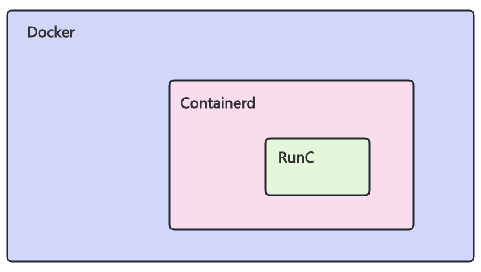
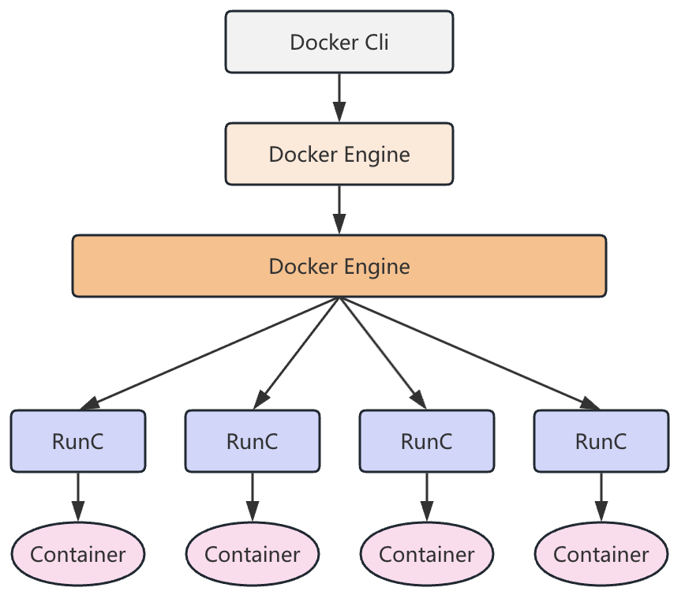

# Containerd

## 概述

### 理解

Containerd是一种容器运行时，可以管理容器的整个生命周期，包含镜像的传输、容器的运行和销毁、容器的监控，同时也可以管理更底层的存储和网络等。

Containerd属于Docker引擎中的一部分，在2016年12月从DockerEngine中剥离，成为了一个可以独立使用的容器运行时（Runtime），并且在2017年捐赠给了CNCF，成为了CNCF的顶级项目之一。

Containerd是一个开源的容器运行时项目，同时也是CNCF体系中已经毕业的容器运行时。

> 注意： Containerd一般不会单独拿出来使用，它的管理功能并没有那么完善，大多数都用来做为K8s或者Docker的Runtime

### Containerd和Docker的关系

Docker包含Containerd，但Containerd并不完全依赖于Docker。Docker是一个完整的容器化平台，提供了镜像构建、容器管理、网络管理、存储管理等功能。而Containerd只是作为Docker的一个组件，负责容器的生命周期管理。


### Docker和Container调用链



### Containerd创建客户端工具

- **ctr**：Containerd原生客户端工具
- **nerdctl**：用于Containerd并且友好兼容Docker Cli使用习惯
- **crictl**：为K8s设计，遵循CRI接口规范

常见命令对比

| docker cli     | ctr                     | nerdctl              | crictl                          |
| -------------- | ----------------------- | -------------------- | ------------------------------- |
| docker run     | ctr run                 | nerdctl run          | crictl run                      |
| docker ps      | ctr c ls                | nerdctl ps           | crictl ps                       |
| docker inspect | ctr c info              | nerdctl inspect      | crictl inspect container-id     |
| docker exec    | ctr t exec -t --exec-id | nerdctl exec -it     | crictl exec -it container-id sh |
| docker start   | ctr t start             | nerdctl start        | crictl start                    |
| docker stop    | /                       | nerdctl stop         | crictl stop                     |
| docker rm      | ctr c rm                | nerdctl rm           | crictl rm                       |
| docker cp      | /                       | nerdctl cp           | /                               |
| docker save    | /                       | nerdctl save         | /                               |
| docker load    | /                       | nerdctl load         | /                               |
| docker images  | ctr i ls                | nerdctl images       | crictl images                   |
| docker logs    | /                       | nerdctl logs         | crictl logs                     |
| docker build   | /                       | nerdctl build        | -                               |
| docker rmi     | ctr i rm                | nerdctl rmi          | crictl rmi                      |
| docker pull    | ctr i pull              | nerdctl pull         | crictl pull                     |
| docker tag     | ctr i tag               | nerdctl tag          | /                               |
| docker push    | ctr i push              | nerdctl push         | /                               |
| docker login   | /                       | nerdctl login        | /                               |
| docker logout  | /                       | nerdctl logout       | /                               |
| /              | ctr ns ls               | nerdctl namespace ls | /                               |
## 配置文件

### 配置insecure registry

如果我们自己搭建的私有镜像仓库地址不是https，需要配置insecure registry，否则默认走https端口443有问题，无法拉取与推送

```shell
$ cat /etc/containerd/config.toml
#...
[plugins."io.containerd.grpc.vl.cri".registry.mirrors]
    [plugins."io.containerd.grpc.vl.cri".registry.mirrors."192.168.181.200"]
        endpoint = ["http://192.168.181.200"]
#...
        
$ systemctl restart containerd
```

> 注意：如果K8s容器运行时使用的是Containerd，想要在节点本地提前拉取镜像
>   1.  如果想要支持http，需要在K8s的每一个节点上修改containerd的配置
>   2. config.toml 是给kubelet命令使用识别的，修改该配置文件后ctr本身并不会读取该配置。
>     ctr拉取http镜像仓库镜像时需要加`--plain-http`参数：ctr i pull xxx --plain-http
>     ctr 拉取有用户名密码的镜像仓库镜像时需要加`--user`参数
>   3. docker拉取的镜像和containerd没有任何关系，需要通过ctr拉取
>   4. ctr即使拉取到了镜像k8s还是提示本地没有该镜像？
>     => ctr 命令空间限制，ctr必须拉取到k8s.io命名空间而不是默认的default

## ctr基础

### 命名空间管理

Containerd的Namespace是一个强大的工具，主要用于实现容器之间的资源隔离、访问控制和安全性。可以实现多个容器在同一台主机上独立运行而不会相互干扰，从而提高了系统的可扩展性和可管理性。

> 注意：Containerd的命令空间和Kubernetes的命令空间是两个不同的概念！

```shell
# 命名空间相关参数帮助
ctr ns -h

# 列出列表
ctr ns ls [-q]

# 创建
ctr ns c test

# 添加标签
ctr ns label test a=b

# 删除
ctr ns rm
```

### 镜像管理

```Dockerfile
# 指定命名空间下的镜像列表
ctr -n k8s.io  i ls

# 拉取
ctr i pull registry.cn-beijing.aliyuncs.com/monap/counter:v1

# 删除
ctr i rm

# 修改
ctr i tag

# 上传
ctr i push xxx --user --http-plain

# 导入导出
ctr i export/import

# 挂载到本地目录
ctr i mount/unmount
```

### 容器管理

```shell
# 指定命名空间下的容器列表
ctr -n k8s.io c ls

# 创建
ctr c create IMAGE NAME

# inspect
ctr c info NAME

# 删除
ctr c rm
```

## nerdctl 更好的containerd cli

### 安装

```shell
# 获取版本：
https://github.com/containerd/nerdctl/releases

# 下载工具：
https://github.com/containerd/nerdctl/releases/download/v1.7.6/nerdct1-1.7.6-1inux-amd64.tar.gz

# 安装：
tar xf nerdctl-1.7.6-linux-amd64.tar.gz
mv nerdctl /usr/local/bin/
```

> nerdctl 操作与 docker cli 完全兼容！