# Docker

## Docker 概述

### Docker为什么出现

一款产品开发到上线有两套环境

环境配置十分麻烦，每一个机器都要部署环境（集群Redis，Hadoop..）

项目能不能都带上环境安装打包 => Docker提出解决方案

### 虚拟化技术和容器技术

#### 虚拟化技术

虚拟机是完全虚拟了一个主机，运行了一个完整的操作系统，然后在这个系统上安装和运行软件

缺点：资源占用十分多，冗余步骤多，启动慢

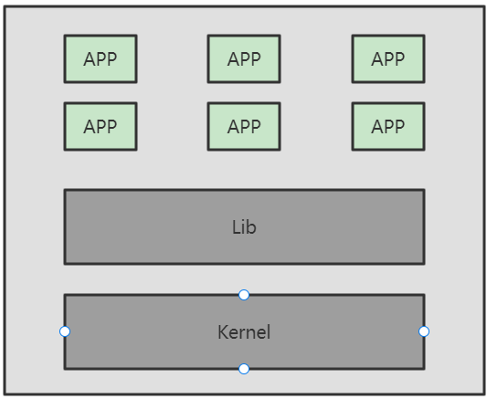

#### 容器化技术

不是完整的模拟了一个操作系统

容器内的应用直接运行在宿主机的内核中，容器是没有自己的内核的，也没有虚拟硬件

每个容器间相互隔离，每个容器内都有一个属于自己的文件系统互不影响

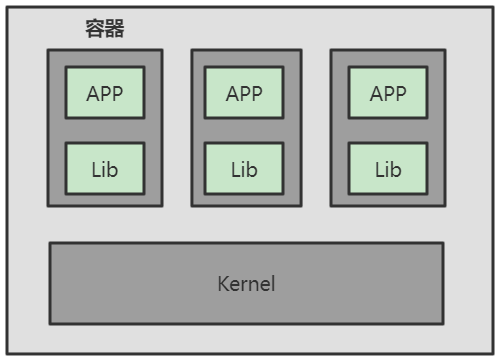

### Docker理解

基于Go语言开发，是一个开源的容器引擎

让开发者可以打包他们的应用以及依赖包到一个可移植的镜像中，然后发布到任何流行的 Linux或Windows 机器上

可以实现虚拟化。容器是完全使用沙箱机制，相互之间不会有任何接口

一个完整的Docker由以下几部分组成：

- DockerClient客户端
- Docker Daemon守护进程
- Docker Image镜像
- DockerContainer容器


### Docker的作用

**使应用更快速的交付和部署**

- 传统：很多帮助文档，安装程序
- Docker：打包镜像发布测试，一键运行

**更便捷的升级和扩缩容**

- Docker部署应用就像搭积木一样

**更简单的系统运维**

-  在容器化后，开发与测试环境都是高度一致的

**更高效的计算资源利用**

- Docker是内核级的虚拟化，可以在一个物理机上运行很多个容器示例，服务器的性能可以被压榨到极致

### Docker中的名词概念

Docker的架构图:

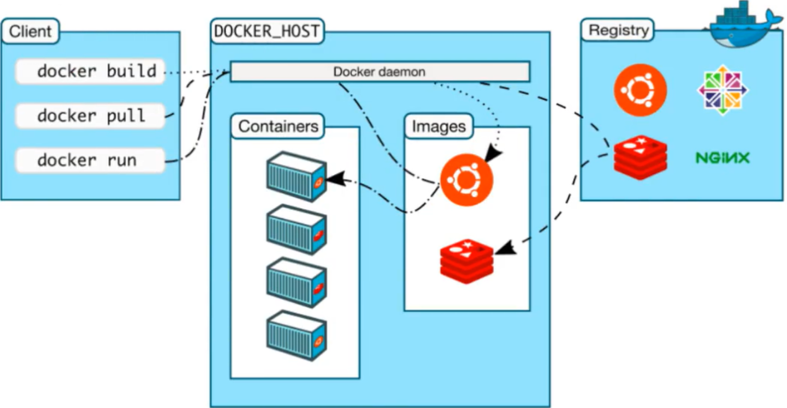

#### 镜像（image）

相当于一个模板，可以通过这个模板来创建容器服务。我们可以通过这个镜像创建多个容器

#### 容器（container）

Docker可以利用容器技术独立运行一个或一组应用，这个容器可以理解为一个简易的操作系统

#### 仓库（repository）

存放镜像的地方，分为共有仓库和私有仓库

### 安装Docker        

CentOS安装Docker

```shell
# 1.卸载旧的Docker
yum remove docker \
  docker-client \
  docker-client-latest \
  docker-common \
  docker-latest \
  docker-latest-logrotate \
  docker-logrotate \
  docker-engine
# 2.安装yum-utils软件包可以提供yum-config-manager实用程序
yum install -y yum-utils
# 3.设置想要从哪个仓库下载
 yum-config-manager \
    --add-repo \
    http://mirrors.aliyun.com/docker-ce/linux/centos/docker-ce.repo
   //https://download.docker.com/linux/centos/docker-ce.repo 默认国外docker
# 4.更新yum软件包索引
yum makecache fast
# 5.安装最新版的Docker Engine和容器（docker-ce社区版，ee是企业版需要授权）
yum install docker-ce docker-ce-cli containerd.io
# 6.启动docker，设置docker为开机自启
systemctl start docker
systemctl enable docker
# 7.查看版本
docker version
# 8.测试helloworld
docker run hello-world
# 9.查看hello-world镜像
docker images
# 10.卸载docker
#    卸载依赖
yum remove docker-ce docker-ce-cli containerd.io
#    删除目录
rm -rf /var/lib/docker
#    手动删除所有已编辑的配置文件
# 11.配置docker镜像加速器
#    通过修改daemon配置文件/etc/docker/daemon.json来使用加速器
mkdir -p /etc/docker
tee /etc/docker/daemon.json <<-'EOF'
{
  "registry-mirrors": [
    "https://hub.rat.dev",
    "https://docker.1panel.live",
    "https://docker.rainbond.cc",
    "https://docker.1ms.run"
  ]
}
EOF
systemctl daemon-reload
systemctl restart docker
```

### Docker原理

#### docker run

 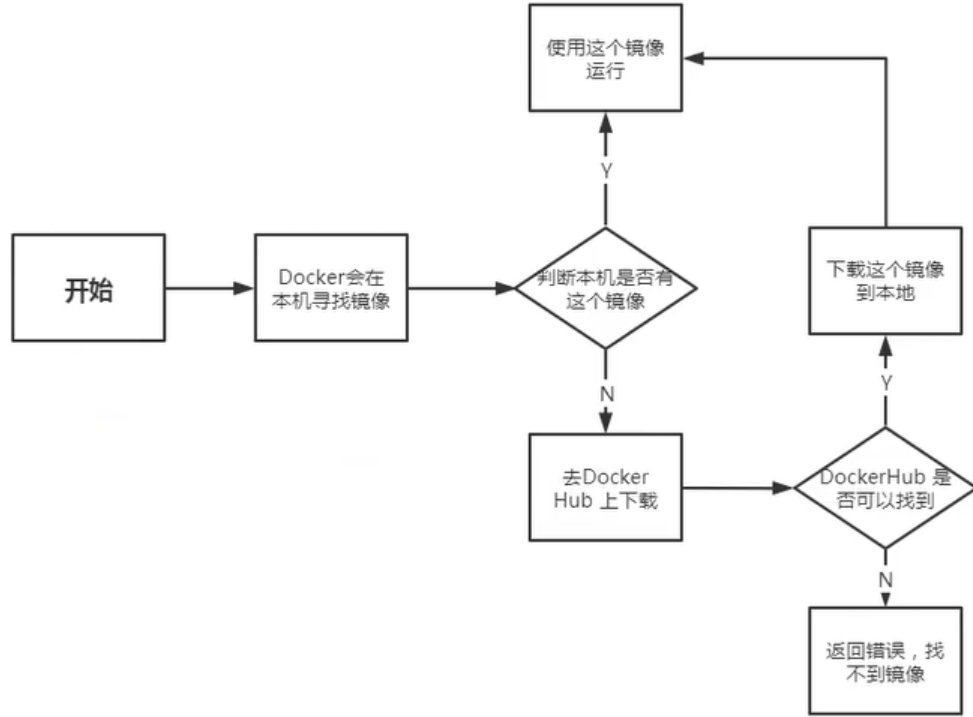

#### 底层原理

Docker是一个Client-Server结构的系统，Docker的守护进程运行在主机上，通过Socket从客户端访问！Docker-Server接受到Docker-Client的指令就会执行该命令

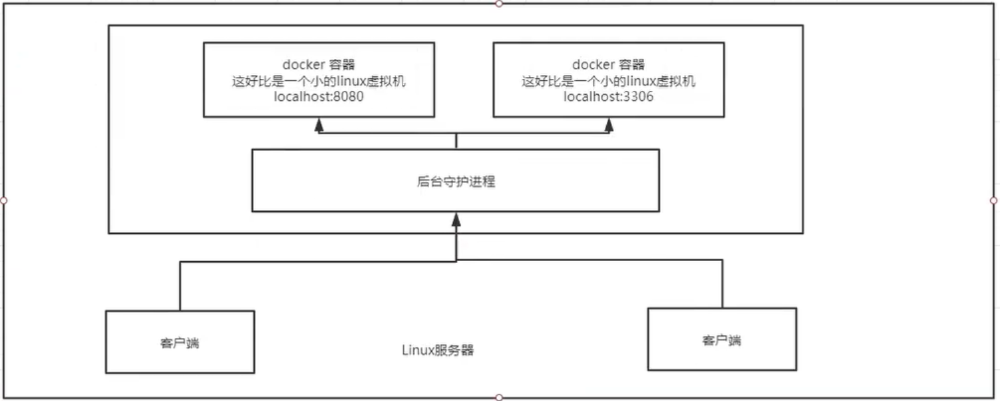

#### Docker为什么比虚拟机快？

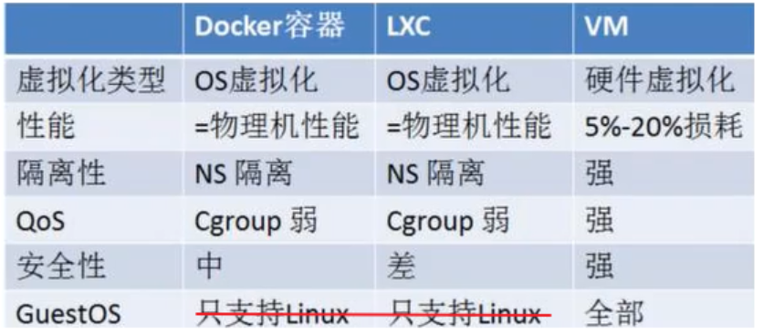

- Docker有着比虚拟机更少的抽象层

- Docker利用的是宿主机的内核，vm需要GuestOS

  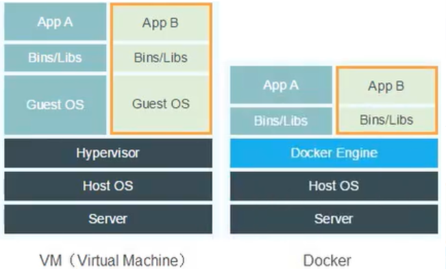

## Docker 常用命令

> 官网命令参考：https://docs.docker.com/engine/reference

### 帮助命令

```shell
# 版本信息
docker version
# 详细信息
docker info            
# 帮助命令
docker 命令 --help      
```

### 镜像命令

```shell
# 查看本地所有镜像
docker images   
#   -q：仅显示id
#   -a：显示所有镜像（默认隐藏中间镜像）

# 搜索所有镜像
docker search 镜像名 

# 拉取镜像
docker pull 镜像名:[tag] [--platform linux/arm64]
#   1.如果不写tag默认下载latest
#   2.会分层下载 => docker image的核心：联合文件系统

# 删除镜像
docker rmi [镜像名|镜像id]
#   -f：强制删除
#   递归删除全部镜像
docker rmi -f $(docker images -aq) 
#   删除多个镜像
docker rmi -f [镜像名/镜像id|镜像名/镜像id|镜像名/镜像id] 

# 镜像的导入导出
#   1.将本地镜像导出
docker save -o 导出的路径（如./tomcat.image） 镜像id
#   2.加载本地的镜像文件,加载后名字和TAG都变成了none
docker load-i 镜像文件（如tomcat.image）
#   3.修改镜像的名字
docker tag 镜像id 新镜像名字:TAG

# 查看镜像的构建变更历史
docker history 容器id

# 查看镜像或容器的元数据
docker inspect [镜像id｜容器id|容器名]
```

### 容器命令

```shell
# 新建容器并运行
docker run [可选参数] 镜像名|镜像id[:tag]
#   --name：给容器起名字
#   -d：后台运行dnn
#   -it：使用交互方式运行，进入容器查看内容
#   -p：指定容器端口，可以与通过（-p 3306:3306）与主机端口映射
#       ① -p 主机端口:容器端口           
#       ② -p 容器端口
#       ② -p 主机ip:主机端口:容器端口
#   -P：随机指定端口
#   -rm：退出容器时自动删除，一般用来做镜像debug。不能与-d同时使用
#   -e： 指定环境变量

# 启动并进入容器
docker run -it centos  
#    exit：       进入容器后使用此命令直接停止容器并退出
#    ctrl+P+Q     进入容器后使用此快捷键不停止容器直接退出
#    /bin/bash    指此脚本使用/bin/sh来解释执行

# 后台创建并启动容器
docker run -d 镜像名/镜像id
# ↑ 问题：docker ps 发现centos并没有运行  
#      => 原因:容器后台运行对应就必须要有一个前台进程，docekr发现没有前台应用就
#        会自动停止它

# 查看运行中的容器
docker ps [可选参数]
#   -a          查看所有运行的容器（包括曾经运行过的容器）
#   -n=数字     显示最近创建的多少个容器
#   -q：        只显示容器的编号

# 删除容器
docker rm [可选参数] 容器id       # 删除指定容器，不能删除正在运行的容器
#   -f：强制删除
docker rm -f $(docker ps -aq)   # 删除所有容器
docker ps -a -q|xargs docker rm # 删除所有容器

# 启动和停止容器
docker start 容器id      # 启动容器，启动之前运行过的容器
docker restart 容器id    # 重启容器
docker stop 容器id       # 停止正在运行容器
docker kill 容器id       # 强制停止容器

# 查看容器的日志
docker logs  -tf --tail 条数 容器id  # 显示指定条数的日志
#   -t：时间戳
#   -f：可以滚动查看日志的最后几行
#   --tail number：要显示的日志条数

# 进入当前正在运行的容器
#   方式一：进入容器后开启一个新的终端，可以在里面操作（常用）
docker exec -it 容器id /bin/bash  # 也可以直接写成bash，它是/bin下的一个命令
#   方式二：进入容器正在执行的终端，不会启动新的终端
docker attach 容器id

# 查看容器内的进程信息
docker top 容器id

# 从容器内拷贝文件到主机上（反向一样）
#    1.从容器内拷贝文件到主机上 
docker cp 容器id:容器内文件名字 目的主机路径
#    2.从主机拷贝文件到容器内
docker cp 主机上文件名字 容器id:容器内文件名字
# 思考：我们每次改动容器应用的配置文件都需要进入容器内部，十分麻烦。
#      我们应该可以在容器外部提供一个映射路径，达到在容器外部修改外部的配置文件则容器内部的配置文件就能相应自动修改
#      => 使用数据卷技术解决
```

### 常用命令总结

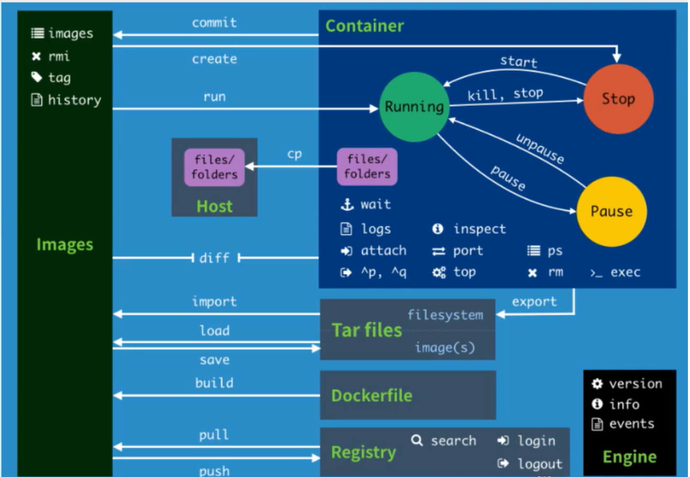

### 例-Docker部署ES

```shell
# 1.注意点：
#   ① es暴露的端口很多
#   ② es十分的耗内存，一启动就是1.x个G
#   ③ es的数据一般需要放置到安全目录！挂载

# 2.创建elasticsearch容器并启动
docker run -d --name elasticsearch -p 9200:9200 \
-p 9300:9300 -e "discovery.type=single-node" elasticsearch:7.9.1

# 3.启动elasticsearch后发现服务器十分的卡，查看一下cpu的状态
docker stats
#   CONTAINER ID        NAME                CPU %      MEM USAGE / LIMIT    
#   355e1cbc8dd9        elasticsearch       0.24%      1.243GiB / 1.796GiB 
#   dd4766dff995        tomcat01            0.15%      84.05MiB / 1.796GiB 

# 4.测试es成功后应该马上关闭它，并增加内存的限制修改配置文件
curl localhost:9200  # 测试es是否成功

# 5.重新开启elasticsearch ，并通过-e命令修改配置文件
docker run -d --name elasticsearch -p 9200:9200 \
-p 9300:9300 -e "discovery.type=single-node" \
-e ES_JAVA_OPTS="-Xms64m -Xmx512m"  elasticsearch:7.9.1
```

### 例-Portainer可视化面板安装

Portainer是Docker图形化界面管理工具，可以提供一个后台面板供我们操作

```shell
docker run -d -p 9000:9000 \
    --restart=always \
    -v /var/run/docker.sock:/var/run/docker.sock \
    --name prtainer-test \
    docker.io/portainer/portainer
    
# 访问测试（访问外网的8088即可）
```

## Docker镜像

### Docker中央仓库

Docker官方的中央仓库，这个仓库的镜像是最全的但是下载速度很慢

国内的Docker镜像网站：

- [网易蜂巢](c.163.com/hub)
- [daoCloud](hub.daocloud.io)
- 阿里云

公司内会采用私服的方式拉取镜像：(需要添加配置才能生效)

```shell
# 1.进入/etc/docker/daemon.json
# 2. 添加如下配置
{
    "registry-mirros":["https://registry.docker-cn.com"],
    "insecure-registries":["ip:port"]
}
# 3.重启两个服务
systemctl daemon-reload
systemctl restart docker
```

### 镜像

#### 镜像是什么

镜像是一种轻量级，可执行的独立软件包，用来打包软件运行环境和基于运行环境开发的软件，它包含运行某个软件所需的所有内容，包括代码，运行时，库，环境变量和配置文件

#### 如何得到镜像

- 从远程仓库下载

- 朋友拷贝

- 自己制作一个镜像DockerFile

### UnionFS联合文件系统

Union文件系统是一种分层，轻量级并且高性能的文件系统，它支持对文件系统的修改作为一次提交来一层层叠加，同时可以将不同目录挂载到同一个虚拟文件系统下

Union文件系统是Docker镜像的基础，镜像可通过分层来进项继承，基于基础镜像（没有父镜像），可以制作各种具体的应用镜像

特性：一次同时加载多个文件系统，但从外面看起来只能看到一个文件系统，联合加载会把各层文件系统叠加起来，这样最终的文件系统会包括所有底层的文件和目录

#### 分层理解

我们去下载一个镜像，会发现是一层一层的在下载，Docker镜像为什么会采用这种分层的结构？

最大的好处就是资源共享！比如有多个镜像都从相同的Base镜像构建而来，那么宿主机只需要在磁盘上保留一份base镜像，同时内存中也只需要加载一份base镜像，这样就可以为所有的容器服务了，而且镜像的每一层都可以被共享

查看镜像分层的命令：

```shell
docker images inspect
```

所有的Docker镜像都起始于一个基础镜像层，当进行修改或者增加新的内容时，就会在当前镜像层之上创建新的镜像层。例如：假如基于Ubuntu Linux 16.04创建一个新的镜像，这就是新镜像的第一层。如果在该镜像中添加Python包，就会在基础镜像之上创建第二个镜像层。如果继续添加一个安全补丁就会创建第三个镜像层。

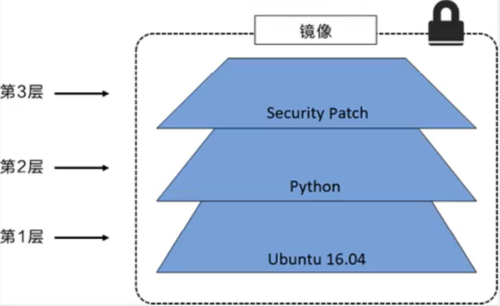

在添加额外的镜像层的同时，镜像始终保持是当前所有镜像的组合，理解这一点非常重要。如下：每个镜像包含了三个文件，而镜像包含了来自两个镜像层的六个文件

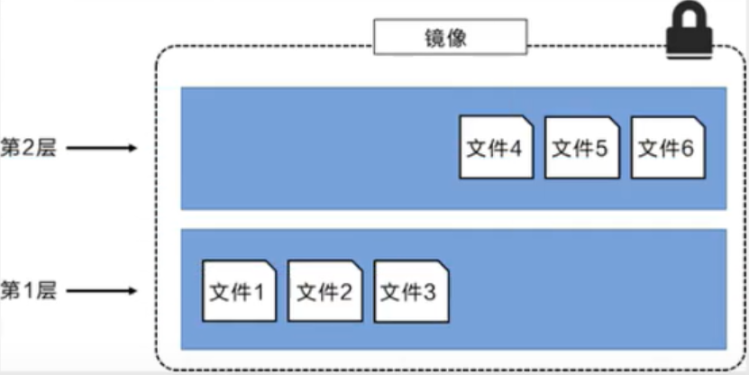

上图中的镜像层更之前图中的略有区别，主要目的是便于展示文件。下图中展示了一个稍微复杂的三层镜像，在外部看来整个镜像只有六个文件，这是因为最上层中的文件7是文件5的一个更新版本

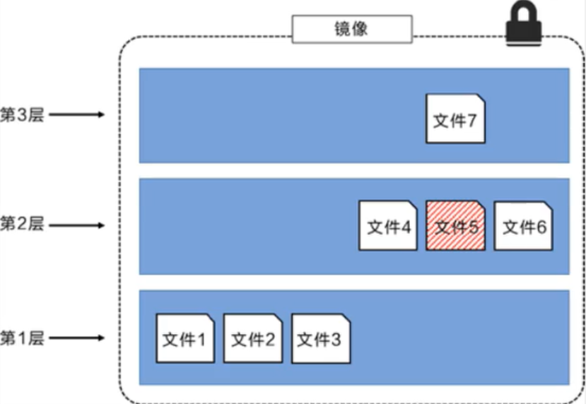

这种情况下，上层镜像层中的文件覆盖了底层镜像层中的文件。这样就使得文件的更新版本作为一个新镜像层加入到镜像当中。Docker通过存储引擎（新版本采用快照机制）的方式来实现镜像层堆栈，并保证多镜像层对外展示为统一的文件系统。

Linux上可用的存储引擎有AUFS，Overlay2，Device Mapper，Btrfs以及ZFS。每种存储引擎都基于Linux中对应的文件系统或者块设备技术，并且每种存储引擎都有其独有的性能特点。

Docker在Windows上仅支持windowsfilter一种存储引擎，该引擎基于NTFS文件系统之上实现了分层和CoW。下面展示了与系统显示相同的三层镜像。所有镜像层堆叠并合并，对外提供统一的视图

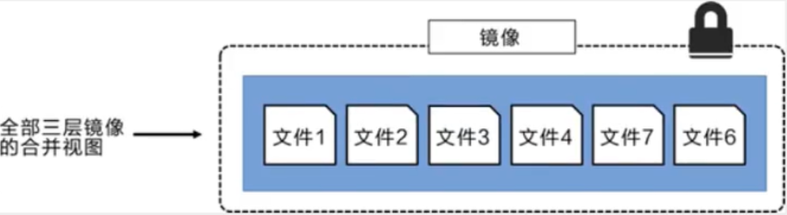

特别的，Docker镜像都是只读的，当容器启动时一个新的可写层被加载到镜像的顶部！这一层就是我们通常说的容器层，容器之下的都叫镜像层！

### Docker 镜像加载原理

docker的镜像实际上由一层一层的文件系统组成，这种层级的文件系统就是UnionFS

`bootfs` (boot file system)主要包括bootloader和kernerl，bootloader主要是引导加载kernel，Linux刚启动时会加载bootfs文件系统，在Docker镜像的最底层就是bootfs。这一层与我们典型的Linux/Unix系统是一样的，包含boot加载器和内核。当boot加载完成之后整个内核就都在内存中了，此时内存的使用权已由bootfs转交给内核，此时系统也会卸载bootfs。

`rootfs` (root file system) 在bootfs之上，包含的就是典型Linux系统的/dev，/proc，/bin，/etc等标准目录和文件，rootfs就是各种不同的操作系统发行版，比如Ubuntu，Centos等

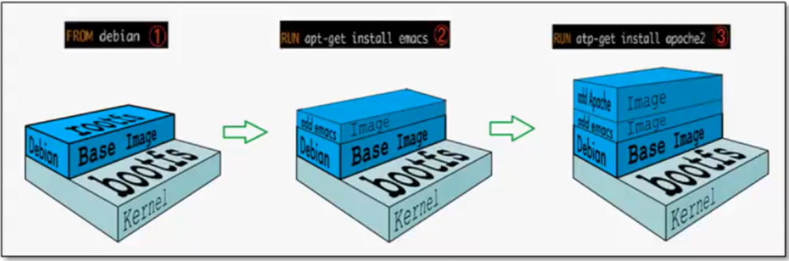

平时我们安装进虚拟机的CentOS都是几个G，为什么Doccker才几百M？对于一个精简的OS，rootfs可以很小，只需要包含最基本的命令，工具和程序库就可以了，因为底层直接用Host的kernel，自己只需要提供rootfs就可以了。由此可见对于不同的Linux发行版，bootfs基本是一致的，rootfs会有差别，因此不同的发行版可以公用bootfs

### 提交一个自定义镜像

提交容器成为一个新的副本

```shell
docker commit -m="提交的描述信息" -a="作者" 容器id 目标镜像名:[tag]
```

### 发布自己的镜像到DockerHub

在Docker官网注册账号

在自己的服务器上提交自己的镜像

```shell
# 1.登录
docker login -u 用户名
# 2.提交镜像
docker push 用户名/镜像名:版本号 
```

## 数据卷与数据卷容器

### 什么是数据卷

Docker的理念

- 将运用与运行的环境打包形成容器运行 ，运行可以伴随着容器，但是我们 `对数据的要求希望是持久化的`

- `容器之间希望有可能共享数据`

Docker容器产生的数据如果不通过docker commit生成新的镜像，使得数据做为镜像的一部分保存下来，那么当容器删除后，数据自然也就没有了。

为了很好的实现数据保存和数据共享，Docker提出了 `Volume` 这个概念，简单的说就是绕过默认的联合文件系统，而以正常的文件或者目录的形式存在于宿主机上。又被称作 `数据卷`

> 理解：其实相当于把宿主机上的某一个目录映射成一个数据卷，像U盘一样挂载到容器内部的联合文件系统中去

### 数据卷能做什么

- 容器的持久化
- 容器间继承+共享数据

> 卷就是目录或文件，存在于一个或多个容器中。它是由docker挂载到容器中的，但不属于联合文件系统，因此能够绕过Union File System提供一些用于持续存储或共享数据的特性
>
> 卷的设计目的就是数据的持久化，完全独立于容器的生存周期，因此Docker不会在容器删除时删除其挂载的数据卷

### 数据卷的特点

- 数据卷可在容器之间共享或重用数据
- 卷中的更改可以直接生效
- 数据卷中的更改不会包含在镜像的更新中
- 数据卷的生命周期一直持续到没有容器使用它为止

### 数据卷的管理

```shell
# 1.创建数据卷
#   创建后默认会放在一个目录下：/var/lib/docker/volumes/数据卷名称/_data
#   _data目录下就是数据卷存放的内容即映射
docker volume create 数据卷名称

# 2.查看数据卷的详细信息
docker volume inspect 数据卷名称

# 3.查看全部的数据卷
docker volume ls

# 4.删除数据卷
docker volume rm 数据卷容器
```

### 命令挂载数据卷到容器

方式一：直接指定一个路径作为数据卷的存放位置，运行镜像并挂载数据卷。使用这种方式的宿主机映射路径下是空的，需要手动添加内容

```shell
docker run -it -v 宿主机绝对路径目录:容器内目录:[ro|rw]  镜像名
# 1. ro即readonly只读，此时说明这个路径只能通过宿主机来操作，容器内部无法操作
#    rw指readwrite可读可写 
# 2. 一旦设置了这个容器的权限，容器对我们挂载出来的内容就有限定了
```

方式二：数据卷存放在默认路径

- 使用这种方式会将容器内部自带的文件，存储在默认的存放路径中
- 两个名词：`具名挂载` 和 `匿名挂载`

```shell
# 映射数据卷时，如果数据卷不存在Docker会自动创建

# 1.匿名挂载：-v 容器内路径
docker run -d -P --name nginx01 -v /etc/nginx nginx

# 2.具名挂载：
docker run -d -P --name nginx01 -v mynginx:/etc/nginx nginx
```

查看数据卷是否挂载成功：

```shell
docker inspect 容器id
```

> 数据卷挂在好之后
>
> - 容器和宿主机之间数据共享
> - 容器停止退出后主机修改的数据与容器完全同步
> - 容器删除后宿主机上对应挂载目录的数据不会删除

### DockerFile 挂载数据卷到容器

DockerFIle就是用来构建docker镜像的构建文件，内容就是一段命令脚本，通过这个脚本可以生成镜像

通过dockerfile挂载数据卷的方式很常用，如果构建镜像时没有挂载，也可以再使用-v命令手动挂载

```shell
# 1.在主机/home目录下创建一个docker-test-volume目录并进入
mkdir /home/docker-test-volume
cd /home/docker-test-volume

# 2.在该目录下创建一个文件
vim dockerfile01

# 3.在文件中写入一段命令脚本，每一个命令就是镜像的一层
FROM centos                          # 以已有的centos镜像为基础
VOLUME ["volume01","volume02"]       # 通过VOLUME命令挂载数据卷
CMD echo "----end-----"              # 生成完镜像后会在命令行发送一段消息
CMD /bin/bash                        # 进入容器走的是/bin/bash控制台

# 4.写完脚本后保存，再通过下面的命令构建镜像。-f指定文件，-t指定目标镜像名
docker build -f dockerfile01 -t polaris/centos .
```

docker inspect查看以下卷挂载是否成功

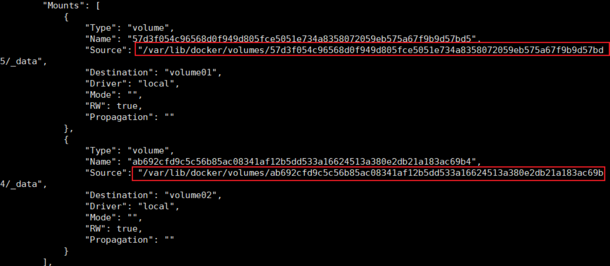

###  数据卷容器

给一个命名的容器挂载数据卷，其他容器通过挂载这个父容器实现数据共享

挂载了数据卷的容器称为数据卷容器

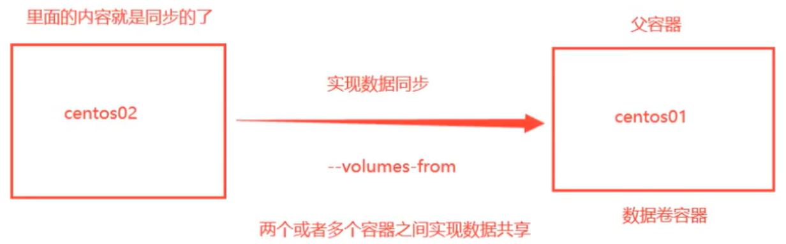

示例：

启动centos01当作父容器

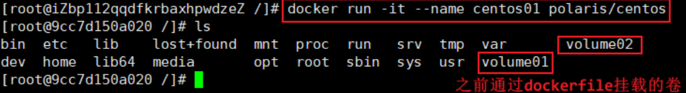

启动centos02并通过 `--volumes-from` 命令挂载父容器centos01

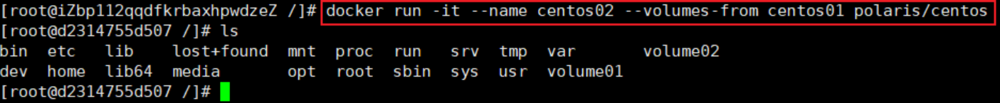

测试

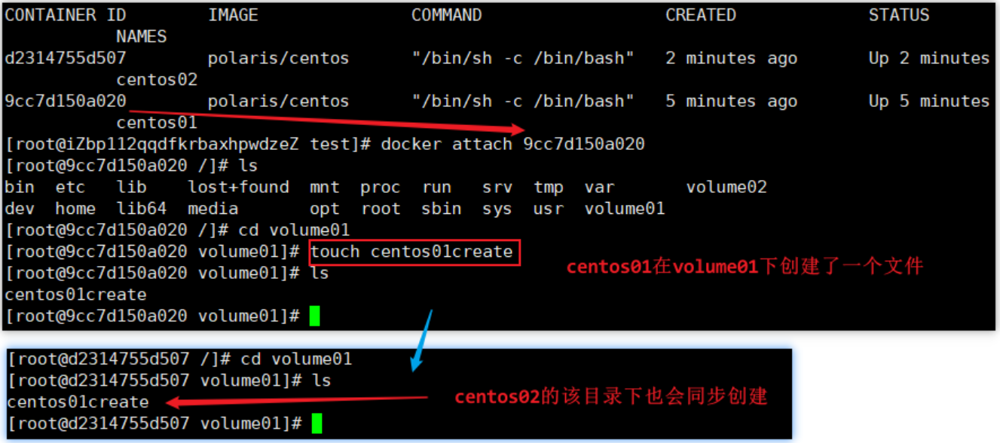

> 注意：停掉或删除父容器，其他容器的对应数据依然还会在

## DockerFile

### 理解

DockerFIle是用来构建Docker镜像的构建文件，是由一系列命令和参数构成的脚本

通过DockerFile构建镜像的步骤

- 编写DockerFIle文件
- docker build  构建成一个镜像

### DockerFile编写规则

- 每条保留字指令都必须为大写字母且后面要跟随至少一个参数
- 指令按照从上到下，顺序执行
- #表示注释
- 每条指令都会创建一个新的镜像层，并对镜像进行提交

### DockerFile执行流程

- docker从基础镜像运行一个容器
- 执行一条指令并对容器做出修改
- 执行类似docekr commit的操作提交一个新的镜像层
- docker再基于刚提交的镜像运行一个新容器
- 执行dockerfile中的下一条指令直到所有指令都执行完成

### 原理

从应用软件的角度来看，Dockerfile、Docker镜像与Docker容器分别代表软件的三个不同阶段。Dockerfile是软件的原材料，Docker镜像是软件的交付品，Docker容器则可以认为是软件的运行态。Dockerfile面向开发，Docker镜像成为交付标准，Docker容器则涉及部署与运维，三者缺一不可，合力充当Docker体系的基石。

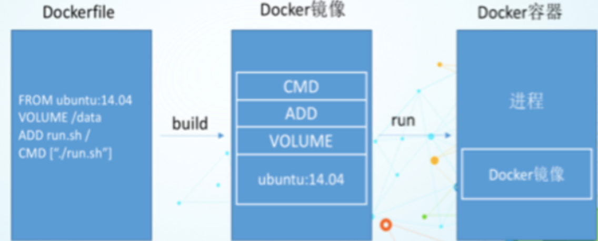

- Dockerfile：需要定义一个Dockerfile，Dockerfile定义了进程需要的一切东西。Dockerfile涉及的内容包括执行代码或者是文件、环境变量、依赖包、运行时环境、动态链接库、操作系统的发行版、服务进程和内核进程(当应用进程需要和系统服务和内核进程打交道，这时需要考虑如何设计namespace的权限控制)等等;

- Docker镜像：在用Dockerfile定义一个文件之后，docker build时会产生一个Docker镜像，当运行 Docker镜像时，会真正开始提供服务

- Docker容器：”容器是直接提供服务的

### DockerFile保留字指令

```shell
### BUILD
FROM           # 当前镜像是基于哪个镜像的第一个指令必须是FROM
MAINTAINER     # 镜像维护者的姓名和邮箱地址，将被弃用，使用LABEL替代
LABEL          # k=v形式，将一些元数据添加至镜像
COPY           # 类似于ADD，拷贝文件和目录到镜像中
               # 将从构建上下文目录中<原路径>的文件/目录复制到新的一层的镜像内的<目标路径>位置
ADD            # 将宿主机目录下的文件拷贝进镜像且ADD命令会自动处理URL和解压tar包
RUN            # 构建镜像时需要运行的Shell指令
ARG            # 设置编译镜像时传入的参数

### BOTH
WORKDIR        # 指定在创建容器后，终端默认登录进来的工作目录，一个落脚点
USER           # 容器使用的用户

### RUN
ENV            # 用来在构建镜像过程中设置环境变量
EXPOSE         # 当前容器对外暴露出的端口号
VOLUME         # 容器数据卷，用于数据保存和持久化工作
CMD            # 指定一个容器启动时要运行的命令
               # Dockerfile中可以有多个CMD指令但只有最后一个生效
               # CMD会被docker run xxContainer 之后的参数替换
ENTRYPOINT     # 指定一个容器启动时要运行的命令
               # ENTRYPOINT的目的和CMD一样都是在指定容器启动程序及其参数
               # 1️⃣ ENTRYPOINT和CMD的区别是不能被docker run的后置命令给覆盖掉
               # 2️⃣ ENTRYPOINT也是可以被覆盖的，通过 --entrypoint=xx 来覆盖
               #    docker run -it --entrypoint=bash nginx
               # 3️⃣ CMD可以作为ENTRYPOINT的参数
               #    docker run -it --entrypoint=ls nginx /root
```

#### LABEL 和 MAINTAINER

Dockerfile使用MAINTAINER定义作者信息，但是这个参数将来会被弃用，可以使用 LABEL 进行替换：

```shell
FROM registry.cn-beijing.aliyuncs.com/monap/centos:7 
# MAINTAINER monap # 即将废弃 
LABEL maintainer="monap" version="demo" 
LABEL multiple="true
```

#### ADD 和 COPY

使用 ADD 添加一个压缩包会自动解压tar.gz压缩包

```Dockerfile
FROM nginx 
MAINTAINER monap
ADD ./index.tar.gz /usr/share/nginx/html/ 
WORKDIR /usr/share/nginx/html
```

使用 COPY 添加一个压缩包会原样复制进去

```Dockerfile
FROM nginx 
MAINTAINER monap
COPY ./index.tar.gz /usr/share/nginx/html/ 
WORKDIR /usr/share/nginx/html
```

> 思考：制作镜像时我们是先解压到本地再拷贝进容器，还是先拷贝进容器再解压？
>    ==> 如果是tar包，可以执行ADD命令自动解压进容器
>    ==> 如果不是tar包，先解压到本地再拷贝进容器，否则镜像会多一层 `RUN tar xf xx.zip`

使用 COPY 拷贝指定目录下的所有文件到容器不包括本级目录。 此时只会拷贝 webroot 下的所有文件，不会将 webroot 文件夹拷贝过去 。

```Dockerfile
FROM nginx 
MAINTAINER monap
WORKDIR /usr/share/nginx/html
COPY webroot/ .
```

如果想连本级目录一起拷贝，可以用下面这种方式变相实现（容器内webroot目录没有会自动创建）

```Dockerfile
FROM nginx 
MAINTAINER monap
WORKDIR /usr/share/nginx/html
COPY webroot/ ./webroot
```

#### COPY时更改文件权限

```Dockerfile
# 使用 --chown 设置所有者和组
COPY --chown=user:group somefile.txt /path/to/destination/ 

# 使用 --chmod 设置文件权限 
COPY --chmod=644 someotherfile.txt /path/to/destination/ 

# 同时使用 --chown 和 --chmod 
COPY --chown=user:group --chmod=755 executable.sh /path/to/destination/ 

# 也可以复制目录并设置权限和所有者 
COPY --chown=user:group --chmod=755 directory/ /path/to/destination/
```

> 如果我们想在宿主机上先把文件权限改好再传入容器，应该怎么改？
>  ==> 文件权限可以直接使用chmod更改
>  ==> 文件所有者没法更改，只会是当前宿主机用户（Docker的机制）

#### 启动容器时指定用户

指定普通用户后建议同时指定工作目录为用户家目录，并且启动端口要大于1024，防止权限问题

```Dockerfile
FROM registry.cn-beijing.aliyuncs.com/monap/centos:7 
MAINTAINER monap 
RUN useradd -m tomcat -u 1001 
USER 1001
WORKDIR /home/tomcat
COPY webroot/ . 
```

#### CMD 和 ENTRYPOINT

CMD 可以被覆盖 

```shell
$ docker run --rm centos:env-cmd echo "cover..." 
cover...
```

ENTRYPOINT 指定的不能被直接覆盖

```shell
$ docker run --rm centos:entrypoint cannot cover... 
envir:test version:1.0
```

ENTRYPOINT 指定 --entrypoint 参数比如指定 entrypoint 为 ls，后置命令为/tmp，就相当于 ENTRYPOINT 是 ls，CMD 是/tmp

```shell
$ docker run --rm --entrypoint=ls centos:entrypoint /tmp 
anaconda-post.log yum.log
```

### Dockerfile 传参-动态构建
使用 ARG 和 build-arg 传入动态变量：

```Dockerfile
FROM registry.cn-beijing.aliyuncs.com/monap/centos:7 
LABEL maintainer="monap" version="demo" 
LABEL multiple="true" 

ARG USERNAME 
ARG DIR="defaultValue" 

RUN useradd -m $USERNAME -u 1001 && mkdir $DIR 
```

```shell
$ docker build --build-arg USERNAME="test_arg" -t test:arg . 
$ docker run -ti --rm test:arg bash 

$ ls
bin dev home lib64 media opt root selinux sys usr defaultValue etc lib lost+found mnt proc sbin srv tmp var 

$ tail -1 /etc/passwd 
test_arg:x:1001:1001::/home/test_arg:/bin/bash
```

### 异构制作镜像

Docker 提供了 `buildx` 工具，它是 Docker 的扩展，可以方便地创建多架构镜像。`buildx` 使用了 `QEMU`（一个开源虚拟化技术）来模拟不同的硬件架构。

```shell
# 配置 Linux 内核支持多架构二进制格式解释器
# binfmt_misc 是 Linux 内核的一个模块，它允许用户注册可执行文件格式和相应的解释器。
# 当内核遇到未知格式的可执行文件时，会使用 binfmt_misc 查找与该文件格式关联的解释器
#（在这种情况下是 QEMU）并运行文件
docker run --privileged --rm tonistiigi/binfmt --install all

# 查看当前系统有哪些构建器
docker buildx ls

# 创建一个新构建器
docker buildx create --name mybuilder

# 切换到自定义构建器
docker buildx use mybuilder

# 启用新构建器
docker buildx inspect --bootstrap mybuilder

# 构建并上传
# 我们可以通过这种方式从docker hub通过多架构基础镜像到我们的私有镜像仓库
docker buildx build --platform linux/arm64 -t registry.cnbeijing.aliyuncs.com/monap/buildx:v2 --push -f ./Dockerfile .

# 只构建不上传
docker buildx build --platform linux/arm64/v8 -t registry.cnbeijing.aliyuncs.com/monap/buildx:armv2 -f ./Dockerfile . --load
```

> 注意：
>  1️⃣ 制作多架构镜像的基础镜像也需要支持多架构（docker hub官网可以查看）

### 镜像优化

#### 使用 Alpine 作为基础镜像

```Dockerfile
FROM registry.cn-beijing.aliyuncs.com/monap/alpine:3.20
MAINTAINER monap
RUN adduser -D monap
```

> 注意：使用alpine镜像时，添加用户命令是 adduser、-D 表示不设置密码

#### 多阶段构建

创建go语言hello程序

```go
package main 

import "fmt"

func main() { 
  fmt.Println("Hello World!") 
}
```

单阶段构建

```Dockerfile
FROM registry.cn-beijing.aliyuncs.com/monap/golang:1.22.4-alpine3.20
WORKDIR /opt 
COPY hw.go /opt 
RUN go build /opt/hw.go 
CMD "./hw"
```

执行构建并运行测试

```shell
$ docker build -t hw:one . 
Successfully built e036098fbb2e 
Successfully tagged hw:one

$ docker run --rm hw:one 
Hello World!

# 查看此时由一个阶段构建的镜像大小
$ docker images | grep e036098fbb2e 
hw    one     e036098fbb2e    5 minutes ago       372MB
# 可以看到此时镜像大小为 372MB，
# 但是上述的代码我们只需要构建步骤产生的二进制文件 hw 即可，这个文件大小可以进入到容器内部看一下
$ docker run --rm hw:one du -sh ./hw 
2.0M ./hw
```

多阶段 Dockerfile 构建

```Dockerfile
# 构建过程
FROM registry.cn-beijing.aliyuncs.com/monap/golang:1.22.4-alpine3.20 as builder
WORKDIR /opt 
COPY hw.go /opt 
RUN go build /opt/hw.go 
# CMD "./hw"

# 生成应用镜像过程 
FROM registry.cn-beijing.aliyuncs.com/monap/alpine:3.20 
COPY --from=builder /opt/hw .
CMD [ "./hw" ]
```

再次构建后查看此时的镜像大小和运行镜像的效果

```shell
$ docker build -t hw:multi . 

$ docker images |grep multi 
hw     multi     a3bba8204f75     6 minutes ago     2.07MB 

$ docker run --rm hw:multi 
Hello World!
```

#### 容器外进行文件操作

如果需要将某个压缩文件拷贝到镜像并且需要更改文件夹权限

- 方式一：在构建之前先更改完毕再进行构建镜像
- 方式二：COPY命令时使用--chown和--chmod修改权限

```shell
tar xf xxx.tar.gz -C xxx
chmod -R 700 xxx 
```

```Dockerfile
FROM registry.cn-beijing.aliyuncs.com/monap/alpine:3.20 
MAINTAINER monap 
COPY --chown 101:101 xxx /mnt/xxx
```

#### 指令合并

```Dockerfile
FROM registry.cn-beijing.aliyuncs.com/monap/alpine:3.20
# RUN sed -i "s@dl-cdn.alpinelinux.org@mirrors.aliyun.com@g" /etc/apk/repositories 
# RUN apk update
# RUN apk add nginx curl 
RUN sed -i "s@dl-cdn.alpinelinux.org@mirrors.aliyun.com@g" /etc/apk/repositories; apk update; apk add ngi
```

### 制作镜像案例

#### 制作Vue/H5镜像

```Dockerfile
FROM registry.cn-beijing.aliyuncs.com/monap/nginx:1.15.12
COPY dist/* /usr/share/nginx/html/
```

#### 制作Java后端镜像

```Dockerfile
FROM registry.cn-beijing.aliyuncs.com/monap/jre:8u211-data
COPY target/spring-cloud-eureka-0.0.1-SNAPSHOT.jar ./app.jar
CMD java -jar app.jar
```

#### 制作Golang后端镜像

```Dockerfile
FROM registry.cn-beijing.aliyuncs.com/monap/alpine-glibc:alpine-3.9 
COPY ./go-project ./
# 启动该应用，CMD 和 ENTRYPOINT 均可
ENTRYPOINT [ "./go-project"]
```

## Docker 网络

### Docker0

查看宿主机Ip地址

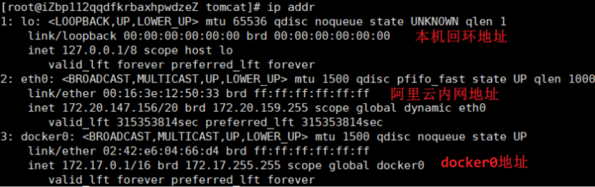

启动一个容器，并查看容器内部Ip地址

```shell
# 1.启动一个tomcat容器并查看容器的内部网络地址
#   如下：除了本地回环地址还有一个eth0地址，它是docker分配的
[root@iZbp112qqdfkrbaxhpwdzeZ tomcat]# docker run -d -P --name tomcat01 tomcat
3fdc590a6dd3677bd2250bf4b9dd7ecb16f94b018a95d13c565122b5c2101d27
[root@iZbp112qqdfkrbaxhpwdzeZ tomcat]# docker exec -it tomcat01 ip addr
1: lo: <LOOPBACK,UP,LOWER_UP> mtu 65536 qdisc noqueue state UNKNOWN group default qlen 1
    link/loopback 00:00:00:00:00:00 brd 00:00:00:00:00:00
    inet 127.0.0.1/8 scope host lo
       valid_lft forever preferred_lft forever
56: eth0@if57: <BROADCAST,MULTICAST,UP,LOWER_UP> mtu 1500 qdisc noqueue state UP group default 
    link/ether 02:42:ac:11:00:03 brd ff:ff:ff:ff:ff:ff link-netnsid 0
    inet 172.17.0.3/16 brd 172.17.255.255 scope global eth0
       valid_lft forever preferred_lft forever
       
# 2.思考：linux能否ping通容器内部？=> 可以
[root@iZbp112qqdfkrbaxhpwdzeZ tomcat]# ping 172.17.0.3
PING 172.17.0.3 (172.17.0.3) 56(84) bytes of data.
64 bytes from 172.17.0.3: icmp_seq=1 ttl=64 time=0.075 ms
```

再次查看主机ip地址发现多了一个57ip地址对应了容器内的56ip地址

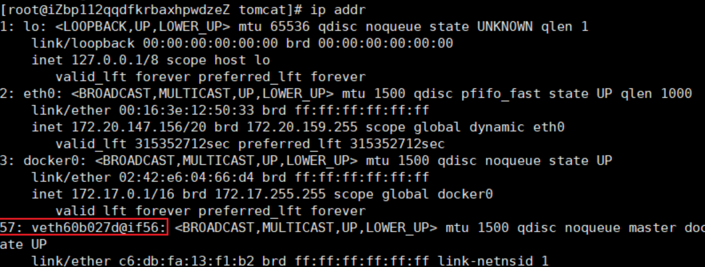

测试docker的两个容器间是否能ping通 => 可以

```shell
# 容器和容器间是可以互相ping通的
[root@iZbp112qqdfkrbaxhpwdzeZ tomcat]# docker exec -it tomcat02 ping 172.17.0.3
PING 172.17.0.3 (172.17.0.3) 56(84) bytes of data.
64 bytes from 172.17.0.3: icmp_seq=1 ttl=64 time=0.099 ms
```

### 原理

#### 观察发现

只要安装了docker，主机就会有一个网卡g

每启动一个docker容器，docker就会给容器分配一个ip，且主机对应也会多一个网卡

#### veth-pair技术

veth-pair就是一对的虚拟设备接口，他们都是成对出现的，一端连着协议一端彼此相连

正因为有此特性，veth-pair充当了一个桥梁，专门用于连接各种虚拟网络设备的

#### 两个docker容器维护能互相连同

tomcat01和tomcat02是共用的一个路由器(docker0)

所有的容器不指定网络的情况下，都是由docker0路由的，docker会给我们的容器分配一个默认的可用IP

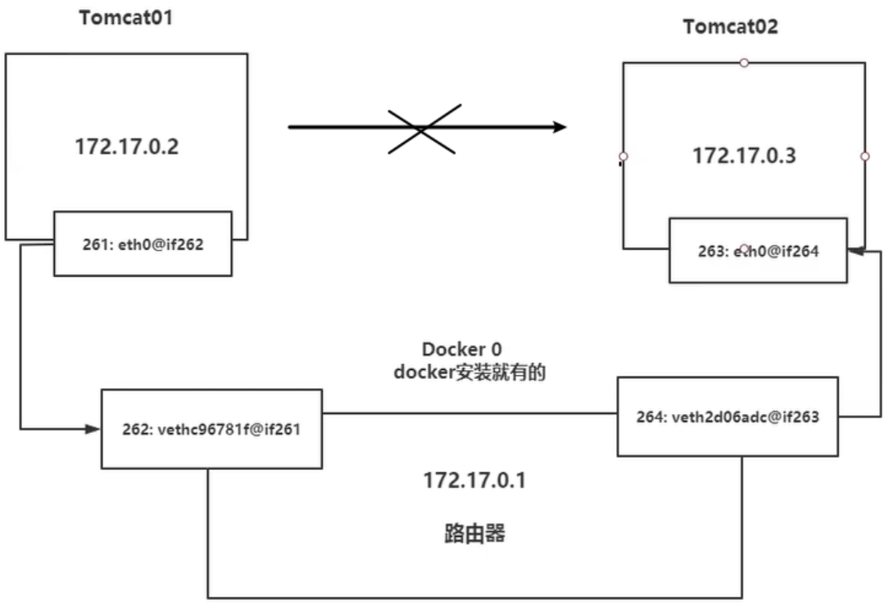

> 注意：
>
> Docker中所有的网络接口都是虚拟的，虚拟的转发效率很高
>
> 只要容器删除，相对应的一对网桥也就没了

### 容器互连之--link

docker0不支持容器名连接访问还需要配置--link，我们最好自定义网络不使用docker0

思考：

- 如果两个容器互连，一个容器的ip换掉了，不修改就无法互连了。怎样处理？

- 可以通过名字来访问容器？

```shell
# 1.直接ping 容器名是不行的
[root@iZbp112qqdfkrbaxhpwdzeZ tomcat]# docker exec -it tomcat02 ping tomcat01
ping: tomcat01: Name or service not known

# 2.通过--link可以解决tomcat3 ping tomcat02，但是反过来还是不能ping通
[root@iZbp112qqdfkrbaxhpwdzeZ tomcat]# docker run -d -P --name tomcat03 --link tomcat02 tomcat
a0b9cd4889b676a5a7f4670dfc54c23e59bbbae299c4fd0a06729913797d5f38
[root@iZbp112qqdfkrbaxhpwdzeZ tomcat]# docker exec -it tomcat03 ping tomcat02
PING tomcat02 (172.17.0.4) 56(84) bytes of data.
64 bytes from tomcat02 (172.17.0.4): icmp_seq=1 ttl=64 time=0.122 ms
[root@iZbp112qqdfkrbaxhpwdzeZ tomcat]# docker exec -it tomcat02 ping tomcat03
ping: tomcat03: Name or service not known

# 3.查看--link原理
#   ① 可以查看tomcat03容器详细信息
[root@iZbp112qqdfkrbaxhpwdzeZ tomcat]# docker inspect a0b9cd4889b6 
...
"HostConfig": {
    ...
    "Links": [
        "/tomcat02:/tomcat03/tomcat02"
    ],
#   ② 可以查看tomcat03容器的hosts配置文件
[root@iZbp112qqdfkrbaxhpwdzeZ tomcat]# docker exec -it tomcat03 cat /etc/hosts
127.0.0.1	localhost
::1	localhost ip6-localhost ip6-loopback
fe00::0	ip6-localnet
ff00::0	ip6-mcastprefix
ff02::1	ip6-allnodes
ff02::2	ip6-allrouters
172.17.0.4	tomcat02 d0c223a02773
172.17.0.2	a0b9cd4889b6

# 4.结论：--link就是我们在hosts配置文件中增加了一个映射
#         172.17.0.4   tomcat02 d0c223a02773
# 5.再tomcat02去--link一次tomcat03就双向映射成功了。即可以相互通过名字ping通
```

### 自定义网络

#### 查看所有的docker网络

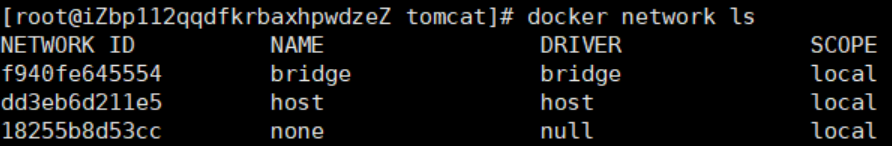

#### 网络模式

- bridge：桥接模式，我们自定义网络也是这种模式
- none：不配置网络
- host：主机模式，和宿主机共享网络
- container：容器内网络直接连通，局限性大（用的少）

#### 创建接模式的网络

```shell
# 1.我们之前直接启动的命令会默认加上--net bridge，就是默认使用的docker0
#   docker0特点：默认不能通过域名访问，通过--link映射可以实现
docker run -d -P --name tomcat01 --net bridge tomcat

# 2.自定义一个网络！
#   ① 创建一个网络。
#     --subnet指定子网，--gateway指定默认网关，bridge不写也可以因为默认bridge模式
 docker network create --driver bridge --subnet 192.168.0.0/16 \
 --gateway 192.168.0.1 mynet
#   ② 查看是否创建成功
[root@iZbp112qqdfkrbaxhpwdzeZ tomcat]# docker network ls
NETWORK ID          NAME                DRIVER              SCOPE
f940fe645554        bridge              bridge              local
dd3eb6d211e5        host                host                local
cc9e8bea9efb        mynet               bridge              local
18255b8d53cc        none                null                local
#   ③ 查看我们自己的网络
docker network inspect mynet
```

#### 运行容器并指定使用自定义网络mynet

```shell
# 1.启动两个tomcat并指定使用mynet网络
docker run -d -P --name tomcat-net-02 --net mynet tomcat
docker run -d -P --name tomcat-net-01 --net mynet tomcat

# 2.查看我们自己的网络
docker network inspect mynet
"Containers": {
    "8f87cda9fac1962711e0e68c20f571774112e8e510720d71504f085594e97ef1": {
        "Name": "tomcat-net-01",
        "EndpointID": "d5c000ec737ff8d3cb194a1a4b20e551f357bd0a1f454f4daeb0e88344744265",
        "MacAddress": "02:42:c0:a8:00:02",
        "IPv4Address": "192.168.0.2/16",
        "IPv6Address": ""
    },
    "b675b0c0bb43f0f4e424d760afc3bfc0f9112e3f90e7f616e3f33e6b20bae39d": {
        "Name": "tomcat-net-02",
        "EndpointID": "4d706c97f5dc1585363a5ced4a85b9ae3bee5f48983b18d6c3a3523bea605bc5",
        "MacAddress": "02:42:c0:a8:00:03",
        "IPv4Address": "192.168.0.3/16",
        "IPv6Address": ""
    }
},

# 3.再次测试两个容器相互通过容器名是能直接ping通的
docker exec -it tomcat-net-01 ping tomcat-net-02
docker exec -it tomcat02-net-02 ping tomcat-net-01
```

#### 使用自定义网络的好处

- 不同的集群使用不同的网络，能保证集群都是安全且健康的

- 不同的网络之间也是可以连通的

#### 不同网络连通

通过connect命令连接一个网络的容器到另一个网络

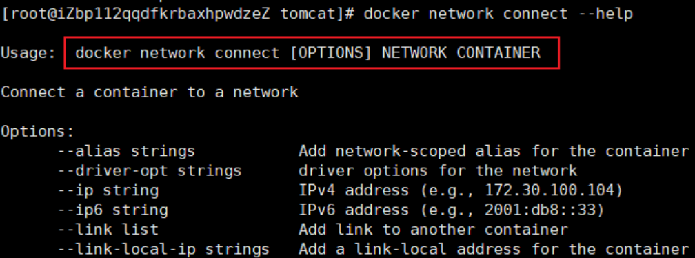

测试

```shell
# 1.再建两个容器使用的是docker0网络
docker run -d -P --name tomcat01 tomcat
docker run -d -P --name tomcat02 tomcat

# 2.两个不同的网络互相ping是不行的
[root@iZ tomcat]# docker exec -it tomcat01 ping tomcat-net-01
ping: tomcat-net-01: Name or service not known

# 3.通过connect 连通后，tomcat01被加到了mynet网络去了？
#     => 其实就是给一个容器分配了两个ip
#     => 例如阿里云服务：一个公网ip，一个私网ip
[root@iZ tomcat]# docker network connect mynet tomcat01
[root@iZ tomcat]# docker network inspect mynet
"Containers": {
    "588d80b0de7142496643b833bb8eb32e5f0609281f81ef7cddd75fb96ff8e6f3": {
        "Name": "tomcat01",
        "EndpointID": "a99b4a72f5d4c44d30c389a5cc305898cef2e24f6576bc12f1dd77c958cbc567",
        "MacAddress": "02:42:c0:a8:00:04",
        "IPv4Address": "192.168.0.4/16",
        "IPv6Address": ""
    },
    "8f87cda9fac1962711e0e68c20f571774112e8e510720d71504f085594e97ef1": {
        "Name": "tomcat-net-01",
        "EndpointID": "d5c000ec737ff8d3cb194a1a4b20e551f357bd0a1f454f4daeb0e88344744265",
        "MacAddress": "02:42:c0:a8:00:02",
        "IPv4Address": "192.168.0.2/16",
        "IPv6Address": ""
    },
    "b675b0c0bb43f0f4e424d760afc3bfc0f9112e3f90e7f616e3f33e6b20bae39d": {
        "Name": "tomcat-net-02",
        "EndpointID": "4d706c97f5dc1585363a5ced4a85b9ae3bee5f48983b18d6c3a3523bea605bc5",
        "MacAddress": "02:42:c0:a8:00:03",
        "IPv4Address": "192.168.0.3/16",
        "IPv6Address": ""
    }
},

# 4.再次测试已经能够tomcat01已经能ping通mynet内的任意容器了
[root@iZ tomcat]# docker exec -it tomcat01 ping tomcat-net-01
PING tomcat-net-01 (192.168.0.2) 56(84) bytes of data.
64 bytes from tomcat-net-01.mynet (192.168.0.2): icmp_seq=1 ttl=64 time=0.073 ms
[root@iZ tomcat]# docker exec -it tomcat01 ping tomcat-net-02
PING tomcat-net-02 (192.168.0.3) 56(84) bytes of data.
64 bytes from tomcat-net-02.mynet (192.168.0.3): icmp_seq=1 ttl=64 time=0.088 ms
```

## Docker Compose

### 理解

部署和管理繁多的服务是困难的，而这正是 Docker Compose 要解决的问题。Docker Compose 并不是通过脚本和各种冗长的 docker 命令来将应用组件组织起来，而是通过一个声明式的配置文件描述整个应用，从而使用一条命令完成部署。应用部署成功后还可以通过一系列简单的命令实现对其完整声明周期的管理。甚至配置文件还可以置于版本控制系统中进行存储和管理

Docker Compose 的前身是 Fig，Fig 是一个基于 Docker 的 Python 工具，允许用户基于一个 YAML 文件定义多容器应用从而可以使用 fig 命令行工具进行应用的部署。Fig 还可以对应用的全生命周期进行管理。内部实现上，Fig 会解析 YAML 文件并通过 Docker API 进行应用的部署和管理。在 2014 年，Docker 公司收购了 Orchard 公司，并将 Fig 更名为 Docker Compose。命令行工具也从 fig 更名为 docker-compose，并自此成为绑定在 Docker 引擎之上的外部工具。虽然它从未完全集成到 Docker 引擎中但是仍然受到广泛关注并得到普遍使用。直至今日Docker Compose 仍然是一个需要在 Docker 主机上进行安装的外部 Python 工具。使用它时，首先编写定义多容器（多服务）应用的 YAML 文件，然后将其交由 docker-compose 命令处理，Docker Compose 就会基于 Docker 引擎 API 完成应用的部署。

### Linux安装Docker Compose

去github官网搜索 [docker-compose](https://github.com/docker/compose/releases/download/1.24.1/docker-compose-Linux-x86_64)

将下载的文件放入Linux的/usr/local下

```shell
# 1.将该文件的名字修改一下方便使用
mv docker-compose-Linux-x86_64 docker-compose
# 2.将它的权限设置为可执行文件
chmod 777 docker-compose
# 3.给/usr/local/bin设置一个环境变量（方便）
vim /etc/profile     # 添加：export PATH=/usr/local/bin:$PATH
# 4.把docker-compose放进/usr/local/bin
mv docker-compose bin/
source /etc/profile  # 再加载一下profile配置文件
# 5.测试是否安装成功
docker-compose --version

# 简单方式：直接下载并授权
curl -L "https://get.daocloud.io/docker/compose/releases/download/1.27.3/docker-compose-$(uname -s)-$(uname -m)" -o /usr/local/bin/docker-compose
chmod +x /usr/local/bin/docker-compose
```

### yml配置文件

Doccker Compose 使用 YAML 文件来定义多服务的应用，YAML 是 JSON 的一个子集，因此也可以使用 JSON。Docker Compose 默认使用文件名 docker-compose.yml，当然也可以使用 -f 参数指定具体文件

compose 文件是一个定义服务、 网络和卷的 `YAML` 文件 。Compose 文件的默认路径是 `./docker-compose.yml `(可以是用` .yml` 或 `.yaml `作为文件扩展名)。服务定义包含应用于为该服务启动的每个容器的配置，就像传递命令行参数一样 `docker container create`。同样，网络和卷的定义类似于 `docker network create` 和 `docker volume create`。正如 `docker container create` 在 Dockerfile 指定选项，如 CMD、 EXPOSE、VOLUME、ENV，在默认情况下，你不需要再次指定它们docker-compose.yml。可以使用 Bash 类 ${VARIABLE} 语法在配置值中使用环境变量。

### 例-管理MySQL和Tomcat

编写 docker-compose.yml文件

```yml
version: '3.1'
services:
   mysql:            # 服务的名称
      restart: always   # 只要docker启动，那么这个容器就跟着一起启动
      image: daocloud.io/library/mysql:5.7.4 # 指定镜像的路径
      container_name: mysql #指定容器名称
      ports:
         - 3306:3306    #指定端口号的映射，可以指定多个
      environment: 
         MYSQL_ROOT_PASSWORD: 123456  #指定mysql的root用户登录密码
         TZ: Asia/Shanghai     #指定时区
      volumes:        #映射数据卷,注意，这些容器内的重要目录可以去DaoCloud上查看
         - /opt/docker_mysql_tomcat/mysqldata:/var/lib/mysql
   tomcat:
      restart: always
      image: daocloud.io/library/tomcat:8.5.15-jre8
      container_name: tomcat
      ports:
         - 8080:8080
      environment:
         TZ: Asia/Shanghai
      volumes:
         - /opt/docker_mysql_tomcat/tomcat_webapps:/usr/local/tomcat/webapps
         - /opt/docker_mysql_tomcat/tomcat_logs:/usr/local/tomcat/logs
```

运行 docker-compose.yml文件

```shell
cd /opt/
mkdir docker_mysql_tomcat
cd docker_mysql_tomcat/
vim docker-compose.yml
docker-compose up -d
```

### 使用docker-compose命令管理容器

在使用docker-compose命令时，默认会在当前目录下找docker-compose.yml文件

```shell
# 运行 docker-compose.yml文件
#   如果镜像不存在以下就会帮我们构建出镜像，如果镜像已经存在会直接运行这个自定义镜像
docker-compose up -d
#   已有镜像的情况下基于docker-compose.yml文件重新构建镜像
docker-compose build
#   运行前，重新构建镜像并运行
docker-compose up -d --build

# 关闭并删除容器
docker-compose down

# 开启或关闭或重启已经存在的由docker-compose维护的容器
docker-compose [stop|restart]

# 查看由docker-compose维护的容器
docker-compose ps

# 查看由docker-compose的容器的日志
docker-compose logs -f   # -f可以滚动

```

### Docker Compose配合Dockerfile使用

使用docker-compse.yml文件以及Dockerfile文件在生成自定义镜像的同时启动当前镜像，并且由docker-compose去管理容器

Dockerfile文件

```shell
FROM daocloud.io/library/tomcat:8.5.15-jre8
COPY MyBookStore.war /usr/local/tomcat/webapps
```

yml文件

```shell
version: '3.1'
services:
   mysql:
      restart: always
      image: daocloud.io/library/mysql:5.7.4
      container_name: mysql
      ports:
         - 3306:3306
      environment: 
         MYSQL_ROOT_PASSWORD: 123456
         TZ: Asia/Shanghai
      volumes:
         - /opt/docker_mysql_tomcat/mysql_data:/var/lib/mysql
         
   tomcat_bookstore:
      restart: always
      build:                             # 构建自定义镜像
         context: ../                    # 指定dockerfile文件的所在路径
         dockerfile: Dockerfile          # 指定dockerfile文件的名字
      image: tomcat_bookstore:1.0        # 使用构建出来的镜像并为其命名
      container_name: tomcat_bookstore   # 指定容器名称
      ports:
         - 8080:8080
      environment: 
         TZ: Asia/Shanghai
```