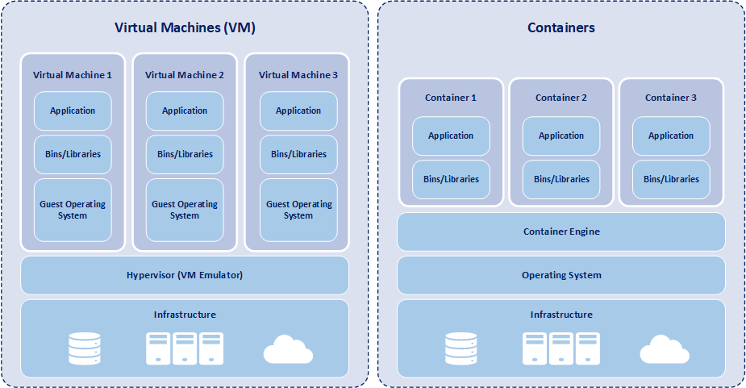
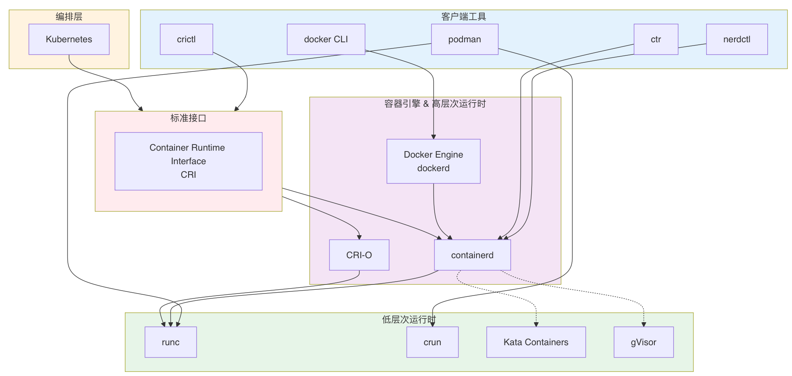

# 容器技术

## 概述

### 引入

容器技术是一种高效的应用程序部署方法，允许开发人员在隔离环境中打包和运行应用程序，这一过程被称为容器化。容器技术的出现解决了传统部署方法中存在的一系列问题，使得软件开发和部署更加一致、高效。

虚拟机和容器是两种最常用于抽象物理硬件并在独立空间中运行应用程序的机制。此外，容器和虚拟机都具有类似的硬件抽象优势。它们都是部署应用程序的同时将应用程序与底层硬件隔离开来的方式。但它们的功能不同，因为容器共享操作系统，而虚拟机包含完整且独立的操作系统。

### 容器化

容器化是一种将应用程序及其依赖项打包到一个独立、可移植的容器中的技术。这个容器包含了应用程序的所有运行时所需的组件，例如代码、运行时环境、库和系统工具。与传统的部署方法不同，容器的关键思想是在不同的环境中实现一致性，无论是在开发人员的本地工作站还是在生产服务器上部署，都无需担心操作系统配置和底层基础设施的差异。

### 关键组件

- 容器引擎：容器引擎是提供容器运行环境的核心软件。它负责创建、运行和管理容器的生命周期。容器引擎包括 Docker、Containerd等。容器引擎通过将容器映像加载到主机系统中并运行容器进程，实现了应用程序的隔离和独立运行。
- 容器镜像：容器镜像是一个静态文件，包含运行应用程序所需的所有组件，包括代码、运行时、系统工具、库和设置。容器镜像是容器的可执行文件，它将应用程序及其依赖项打包成一个独立的单元。这种封装确保了在不同环境中具有一致的运行时环境。
- 注册表：注册表是存储和内容交付系统，用于保存和分享容器镜像。用户可以从注册表中提取容器镜像，这样就可以在不同的主机上部署和运行相同的应用程序。Docker Hub 是一个常见的公共注册表，而组织和企业也可以使用私有注册表来管理和存储他们的容器映像。
- 编排工具：编排工具用于管理和协调多个容器的部署、扩展和运维。它们帮助实现容器集群的自动化管理。Kubernetes 是一个开源的、广泛使用的编排工具，它提供了自动化容器的部署、伸缩和运维的功能。
- 命名空间（Namespaces）： 用于隔离容器的进程视图，包括文件系统、网络堆栈、进程 ID 等。每个容器都有自己独立的命名空间，使其看起来像在一个独立的环境中运行。命名空间允许容器拥有独立的进程空间、网络空间、挂载点、用户空间等。这确保了容器之间的隔离，使它们无法看到和影响彼此。
- cgroup（Control Groups）： 用于管理和限制容器的资源使用，包括 CPU、内存、磁盘 I/O 等。cgroup确保容器在共享主机资源的同时不会过度占用。这样可以确保容器在共享主机资源的同时，不会因为使用过多资源而影响其他容器或主机系统。

> 命名空间和cgroup：Linux 的命名空间和 cgroup 是容器技术实现隔离的核心特性！这两个功能结合在一起，为容器提供了隔离和资源管理的基础，确保它们能够在相互独立且安全的环境中运行。

## 容器运行时接口-CRI

CRI（Container RuntimeInterface）是Kubernetes中用于实现容器运行时和Kubernetes之间交互的标准化接口。CRI定义了Kubernetes与底层容器运行时的通信协议和接口规范，可以让Kubernetes与不同的容器运行时进行交互，实现跨容器运行时的一致性，以达到在不需要改动任何代码的情况下支持多种运行时，比如Containerd、CRI-O、Kata等。

## 容器组件脉络图

### 客户端工具（Client Tools）

这些是用户直接操作的命令行工具，用于与底层容器运行时交互。

**docker CLI**

- **起源**：2013 年由 Docker Inc. 推出，是容器技术普及的关键推手。
- **作用**：用户通过 `docker run`、`docker build` 等命令管理容器和镜像。
- **架构特点**：采用 **C/S（客户端-服务器）模式**，CLI 本身不执行容器操作，而是通过 REST API 调用后台的 `dockerd` 守护进程。
- **关系**：依赖 **Docker Engine（dockerd）**，而 dockerd 内部又依赖 **containerd**。

**podman**

- **起源**：由 Red Hat 主导开发，最初源于 **CRI-O 项目**的衍生需求，目的是提供一个无需守护进程、兼容 Docker CLI 的工具 。
- **作用**：提供与 `docker` 几乎相同的命令（如 `podman run`），但**无需 root 权限、无守护进程**（daemonless）。
- **架构特点**：**单一二进制**，既是 CLI 也是运行时管理器，直接调用低层次运行时（如 runc/crun）。
- **关系**：不依赖 Docker 或 containerd，可独立工作；支持 OCI 镜像和运行时标准。

**nerdctl**

- **起源**：由 containerd 社区开发（CNCF 项目），全称 “**containerd CLI**”。
- **作用**：为 `containerd` 提供类似 `docker` 的用户体验，常用于 **Kubernetes 节点调试**或 **纯 containerd 环境**。
- **关系**：直接与 **containerd** 通信，是其官方推荐的 CLI 工具。

**crictl**

- **起源**：Kubernetes 社区为调试 CRI 兼容运行时而开发。
- **作用**：专用于与 **CRI（Container Runtime Interface）** 兼容的运行时（如 containerd、CRI-O）交互。
- **关系**：**不面向普通用户**，而是面向 Kubernetes 节点管理员，通过 CRI gRPC 接口操作 Pod 和容器。

**ctr**

- **起源**：`containerd` 项目自带的**低级调试工具**。
- **作用**：直接操作 containerd 的内部对象（如 tasks、snapshots），**不推荐日常使用**。
- **关系**：是 containerd 的“原生 CLI”，但功能原始，缺乏高级抽象（如镜像构建、网络管理）。

### 容器引擎 & 高层次运行时（High-level Runtimes）

这些组件负责镜像管理、容器生命周期、网络、存储卷等“高层”任务。

**Docker Engine（dockerd）**

- **起源**：Docker Inc. 最初的完整容器平台。
- **演变**：早期 Docker 是“大一统”架构，后来为解耦，将核心容器管理功能剥离为 **containerd**（2016 年捐赠给 CNCF）。
- **关系**：Docker Engine = dockerd（API 层 + 镜像管理 + 网络等） + **containerd（容器生命周期）** + **runc（实际创建容器）**。

 **containerd**

- **起源**：从 Docker Engine 中剥离出的核心容器运行时，2017 年成为 CNCF 毕业项目。
- **作用**：管理容器的完整生命周期（创建、启动、停止、删除）、镜像、快照、网络等。
- **特点**：支持 CRI 插件，可直接被 Kubernetes 使用；也支持直接被 nerdctl 或 ctr 调用。
- **关系**：被 Docker Engine 使用，也被 Kubernetes（通过 CRI）直接使用。

**CRI-O**

- **起源**：由 Red Hat、Intel 等主导，专为 **Kubernetes 设计**的轻量级容器运行时 。
- **目的**：只实现 Kubernetes 所需的 CRI 接口，**不兼容 Docker CLI**，追求最小化和安全性。
- **关系**：直接调用 **runc**（或 Kata 等），被 Kubernetes 通过 CRI 调用，**不面向普通用户**。

> 💡 注意：Podman 和 CRI-O 共享部分底层库（如 **libpod**、**conmon**），但定位不同：Podman 面向开发者，CRI-O 面向 Kubernetes。

### 低层次运行时（Low-level Runtimes）

这些组件只负责**创建和运行容器进程**，遵循 **OCI（Open Container Initiative）运行时规范**。

**runc**

- **起源**：由 Docker Inc. 开发，是 OCI 运行时规范的**参考实现**。
- **作用**：根据 `config.json` 创建符合 Linux namespaces/cgroups 的容器进程。
- **关系**：被 Docker、containerd、CRI-O、Podman 等广泛使用。

**crun**

- **起源**：由 Red Hat 开发，用 **C 语言**编写（runc 用 Go），更轻量、启动更快。
- **作用**：OCI 兼容的替代运行时，特别适合 **Podman** 和资源受限环境。
- **关系**：Podman 默认在某些系统（如 Fedora）中使用 crun 而非 runc。

**Kata Containers**

- **起源**：Intel 和 Hyper.sh 联合发起，后成为 CNCF 项目。
- **作用**：通过**轻量级虚拟机**（QEMU + Firecracker）运行每个容器，提供**强隔离**（类似 VM 的安全性）。
- **关系**：可通过 containerd 的 **runtime class** 被 Kubernetes 调用。

**gVisor**

- **起源**：Google 开发。
- **作用**：用 **用户态内核（Sentry）** 拦截系统调用，提供应用级隔离，**无需硬件虚拟化**。
- **关系**：同样通过 containerd 集成到 Kubernetes 中。

> Kata 和 gVisor 都是 **OCI 兼容的“安全运行时”**，作为 runc 的替代选项。

### 编排层：Kubernetes（K8s）

- **作用**：容器编排平台，管理跨节点的 Pod、服务、存储等。
- **关键设计**：不直接调用具体运行时，而是通过 CRI（Container Runtime Interface）抽象层。
- **关系**：K8s → CRI → containerd 或 CRI-O → runc/crun/Kata/gVisor。

### 标准接口：CRI（Container Runtime Interface）

- **起源**：Kubernetes 1.5 引入，目的是解耦 K8s 与具体容器运行时。
- **本质**：一套 gRPC API 规范，定义了如何管理 Pod 和容器。
- **实现者**：containerd（通过内置插件）、CRI-O、Mirantis Container Runtime 等。
- **意义**：让 Kubernetes 可以自由切换底层运行时，而不影响上层逻辑。

### 生态演进逻辑

- Docker 开创时代（2013）
- 社区要求解耦
- containerd + runc 成为标准中间层
- Kubernetes 需要专用运行时
- CRI-O 出现
- Red Hat 推出 daemonless 的 Podman（兼容 Docker CLI）
- 安全需求催生 Kata/gVisor
- 所有组件围绕 OCI + CRI 标准协同工作。

> 这个生态的核心思想是：**分层解耦 + 标准化接口（OCI/CRI）**，让不同组件可以灵活组合。