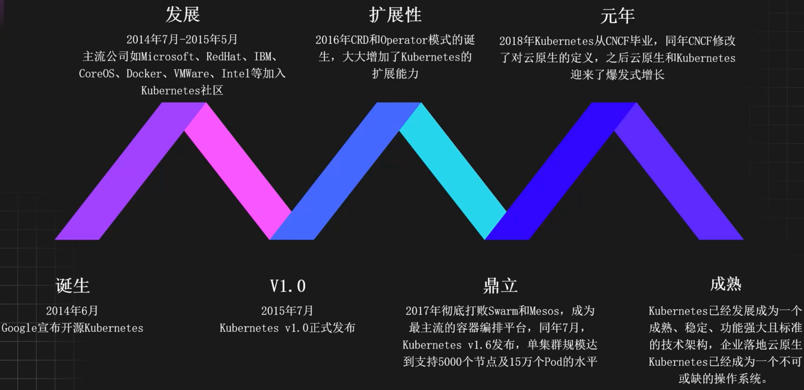
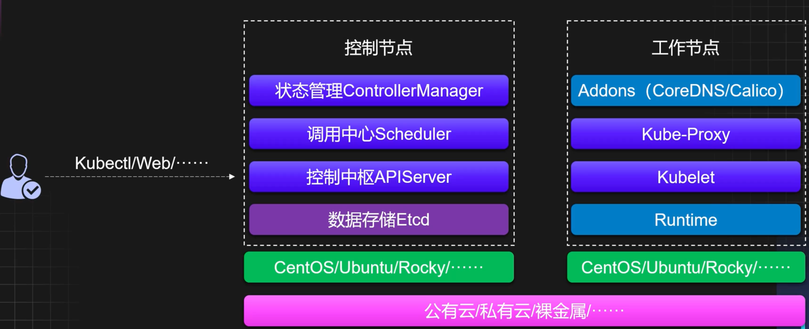
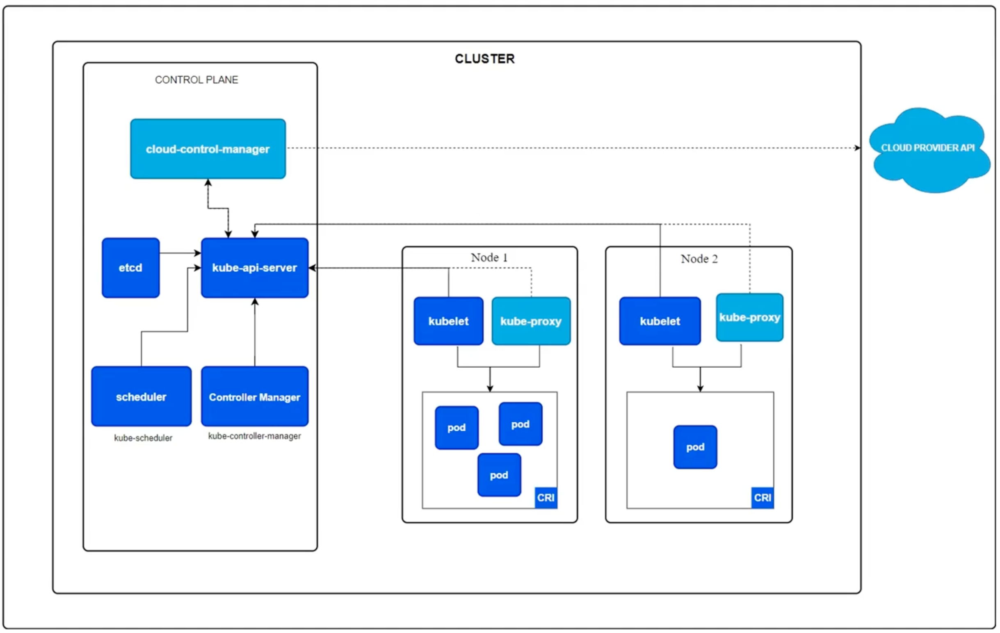
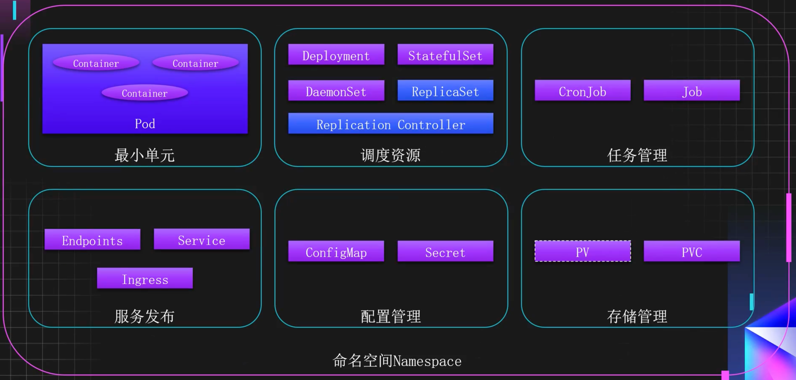
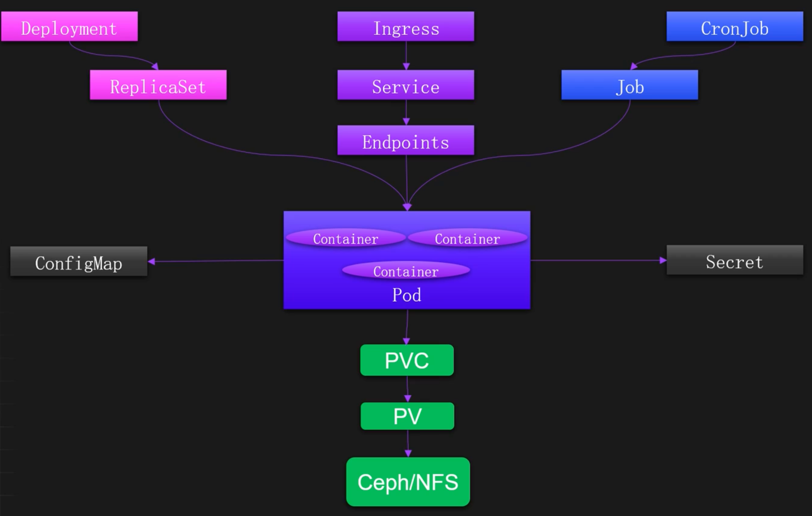
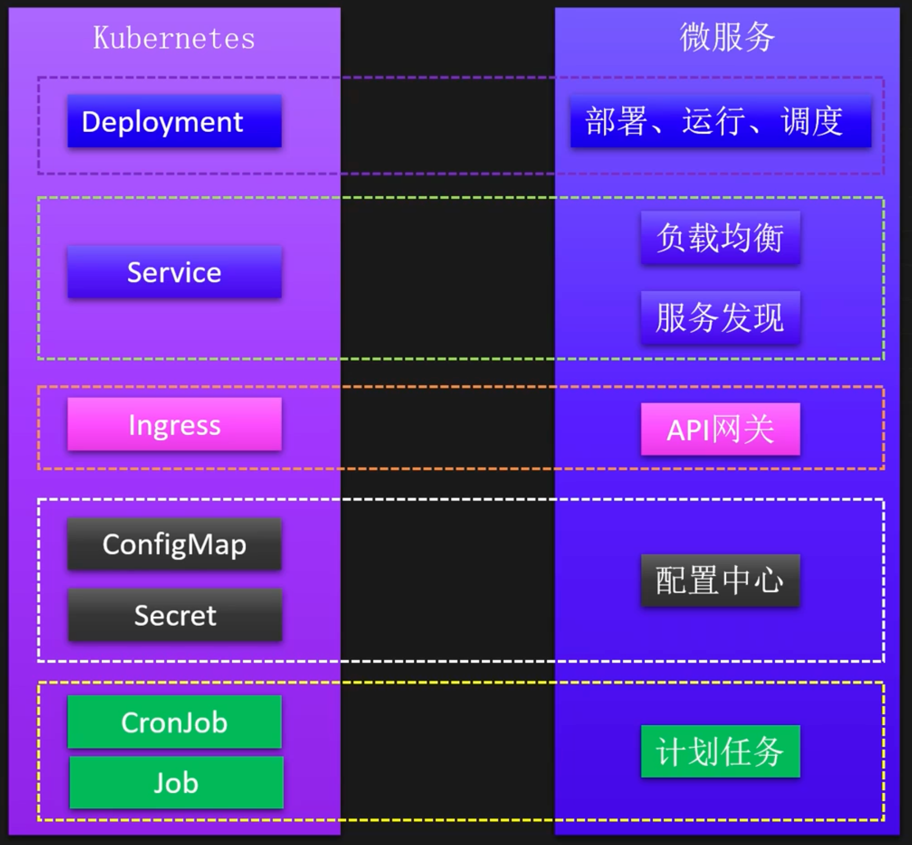
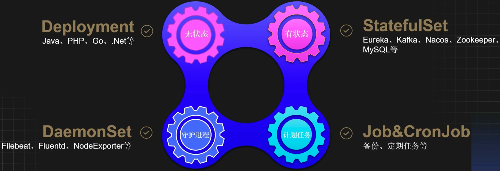
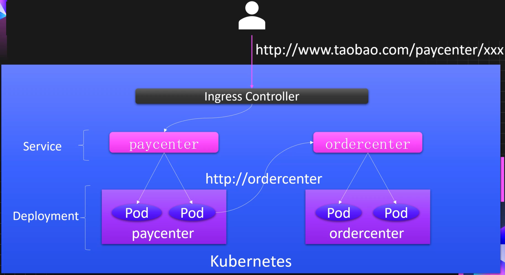
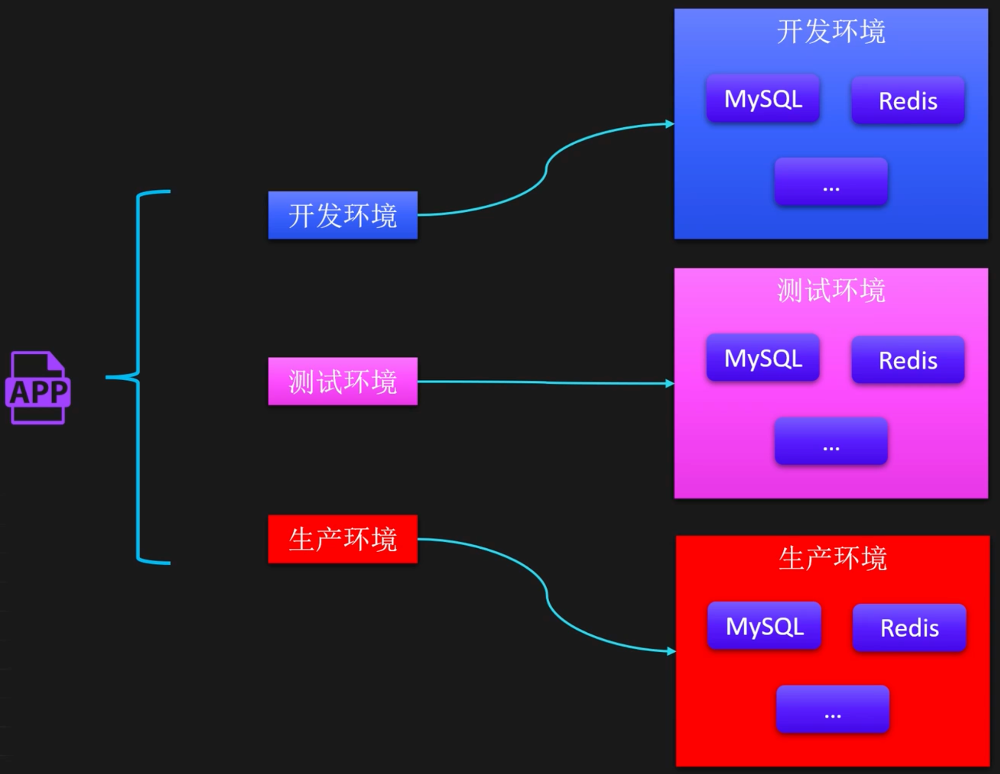
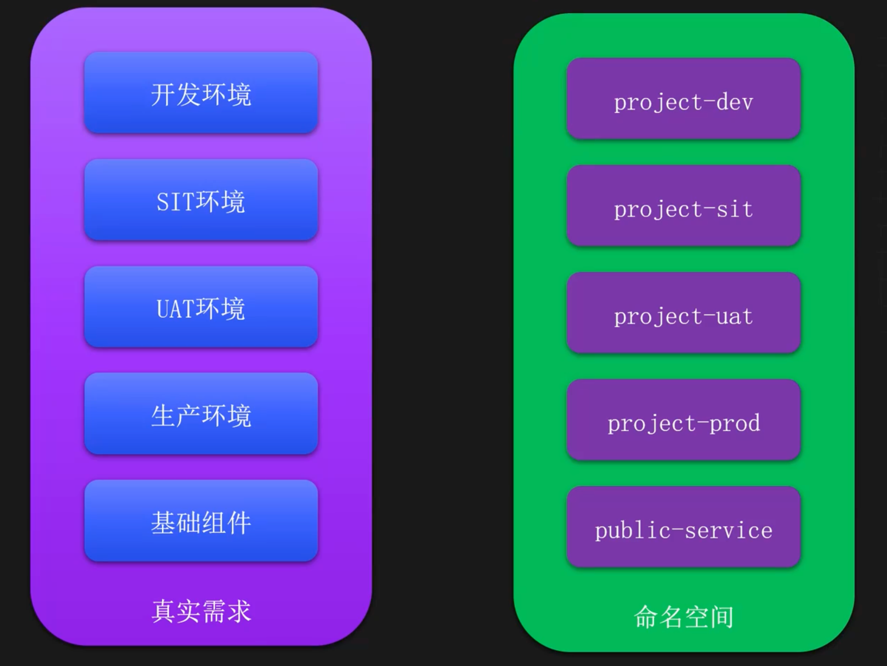

# K8S设计思想

## 概述

### 什么是K8S

Kubernetes（简称K8s，希腊语，意为舵手）是一个开源 的容器编排系统，用于容器的自动化部署、扩展，以及 提供高可用和负载均衡的运行环境。 

Kubernetes提供了一个便携、高效的PaaS平台，降低了 在物理机或虚拟机上调度和运行服务的难度，同时 Kubernetes还整合了网络、存储、安全、监控等能力， 是一个非常完善的“云原生操作系统” 

Kubernetes的前身是谷歌内部的Borg系统，是基于谷歌 15年生产环境经验的基础上开源的一个项目。由谷歌设 计并在2014年开源，之后捐献给了CNCF，称为CNCF第一 个开源的顶级项目，目前已成为云原生领域的标准。

### 里程碑

### K8S 为何为云原生基座

#### 单独的Docker无法满足生产需求

- 缺乏完整的生命周期管理
- 缺乏服务发现、负载均衡、配置管理、存储管理
- 程序的扩容、部署、回滚和更新依旧不够灵活
- 宿主机宕机容器无法自动恢复
- 程序级健康检查依旧不到位
- 端口管理比较复杂
- 流量管理依旧复杂

#### K8S 各种优点

- 开源开放
- 弹性伸缩
- 服务发现
- 负载均衡
- 自愈能力
- 健康检查
- 滚动更新
- 一键回滚
- 高可用
- 声明式
- 多环境
- 隔离性

#### 提升开发效率

使用K8S之前

- 多环境程序日志查询困难
- 多环境代码发布迭代缓慢
- 无关代码占用大量精力
- 多环境搭建过程复杂
- 环境迁移过程繁琐且费力

使用K8S之后

- 无需登录机器即可查询
- 不可变基础设施一键发布
- Namespace隔离一键复制
- 只需要关心业务逻辑代码
- 通过包管理工具一键迁移

####  降低运维难度

使用K8S之前

- 基础环境管理难度大
- 宕机人工处理耗精力
- 中间件搭建与维护困难
- 应用扩缩容繁琐且复杂
- 程序端口维护很麻烦

使用K8S之前之后

- 一次构建多次部署
- 全自动容灾机制无需干预
- 一键扩缩容无需更改配置
- 包管理工具一键安装管理
- 无需特别关心端口冲突

## K8S 架构解析

### K8S 总体架构

#### 概览图

#### 详细设计图

#### 交互链路

### 组件详解

#### 控制节点组件

- **APIServer**：APIServer是整个集群的控制中枢，提供集群中各个模块之间的数据交换，并将集群状态和信息存储到分布式键-值(key-value)存储系统Etcd集群中。同时它也是集群管理、资 源配额、提供完备的集群安全机制的入口，为集群各类资源对象提供增删改查以及watch的REST API接口。 
- **Scheduler**：Scheduler是集群Pod的调度中心，主要是通过调度算法将Pod分配到最佳的Node节 点，它通过APIServer监听所有Pod的状态，一旦发现新的未被调度到任何Node节点的Pod （pod.spec.nodeName为空），就会根据一系列策略选择最佳节点进行调度，对每一个Pod创建 一个绑定（binding），然后被调度的节点上的Kubelet负责启动该Pod。
- **Controller Manager**：Controller Manager是集群状态管理器，以保证Pod或其他资源达到期望 值。比如集群中某个服务的副本数或其他资源因故障和错误导致无法正常运行，没有达到设定 的值时，Controller Manager会尝试自动修复并使其达到期望状态。 
- **Etcd**：Etcd用作Kubernetes的后台数据库，用于存储Kubernetes集群中的数据。Etcd由CoreOS 开发，是一种持久性、轻量型、分布式的键-值（key-value）数据存储组件。

#### 工作节点组件

- **Kubelet**：负责管理该节点上的Pod，同时对容器进行健康检查及监控，并且负责上报节点和节点上面Pod的状态。 
- **Kube-Proxy**：负责维护节点上的网络规则，允许从集群内部或外部的网络与Pod进行网络通信。同时负责维护Service和Pod之间的请求路由和流量转发。
- **Container Runtime**：符合CRI接口规范的容器运行时，负责管理Kubernetes环境中容器的生命周期。 
- **CoreDNS**：用于Kubernetes集群内部Service的解析，和上游域名的解析转发。可以让Pod把Service名称解析成Service的IP，然后通过Service的IP地址进行连接到对应的应用上，同时对外部的域名将会转发到外部的DNS进行解析。 
- **Calico**：符合CNI标准的一个网络插件，它负责给每个Pod分配一个不会重复的IP，并且把每个节点当做一各“路由器”，这样一个节点的Pod就可以通过Pod的IP地址访问到其他节点的Pod。 
- **Metrics Server**：一个用于Kubernetes集群的监控工具，它负责收集、存储和提供关于集群中各种资源的度量数据，比如CPU和内存。同时为Horizontal Pod Autoscaler（HPA）和Vertical Pod Autoscaler（VPA）提供所需的资源指标数据。

#### 核心组件细节

- **APIServer**：`无状态`组件，是唯一一个直接和Etcd通信的Kubernetes组件，可以直接进行横向扩容。 
- **Scheduler和Controller**：`有状态`组件，主节点信息保存在了`leases`资源中，可以通过kubectl get leases -n kube-system获取，也可以进行横向扩容，选主过程无需人工干预。 
- **Kube-Proxy**：可选组件，如果使用Cilium作为CNI组件，可以不安装Proxy。 
- **Etcd**：生产环境中建议部署为`大于3`的`奇数`个的Etcd节点，以保证数据的安全性和可恢复性，并且Etcd的数据盘需要使用SSD硬盘。 
- **Kubectl**：集群的管理工具，只要有`Kubeconfig`和`Kubectl`文件，就可以在任意的地方对Kubernetes集群进行管理操作。

## K8S 核心资源

### 分类

### 关系

### 资源抽象理由

### 资源详解

#### 调度资源

#### 服务发布

#### 配置管理

#### 资源隔离

