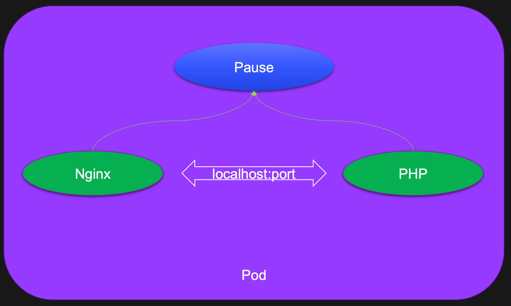
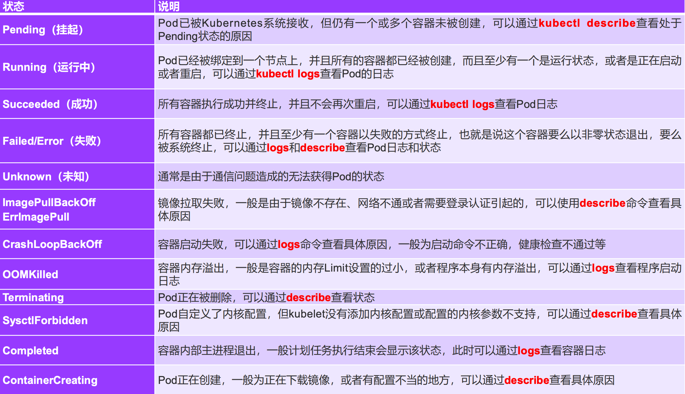

# Pod

## 什么是Pod

Pod可以简单地理解为是一组、一个或多个容器构成，每个Pod还包含一个Pause容器。
 
Pause容器是Pod的父容器，它主要负责僵尸进程的回收管理，同时通过Pause容器可以使同一个Pod里面的不同容器共享存储、网络、PID、IPC等，容器之间可以使用 `localhost:port` 相互访问，可以使用 volume 等实现数据共享。

根据 Docker 的构造，Pod可被建模为一组具有共享命令空间、卷、IP地址和Port端口的容器。



## Pod设计思想

- 多容器协作
- 强依赖服务
- 简化应用的生命周期管理
- 兼容多种CRI运行时

## Pod 基本操作

```shell
# 1. 定义一个 Pod
cat > nginx.yaml << EOF
apiVersion: v1                 # 必选，API 的版本号
kind: Pod                      # 必选，类型 Pod
metadata:                      # 必选，元数据
  name: nginx                  # 必选，符合 RFC 1035 规范的 Pod 名称
  labels:                      # 可选，标签
    run: nginx                 # 可选，键值对
spec:                          # 必选，用于定义 Pod 的详细信息
  containers:                  # 必选，容器列表
  - name: nginx                # 必选，符合 RFC 1035 规范的容器名称
    image: nginx:1.15.12       # 必选，容器所用的镜像的地址
    ports:                     # 可选，容器需要暴露的端口号列表
    - name: httpPort           # 可选，端口名称
      containerPort: 80        # 端口号
EOF

# 2. 创建 Pod
kubectl create -f nginx.yaml 


# 3. 查看 Pod 状态：
kubectl get po nginx


# 4. 使用 kubectl run 直接创建一个 Pod（不使用yaml文件快速创建pod，不推荐）
kubectl run nginx-run --image=nginx:1.15.12

# 5. 输出一个简单的创建pod的yaml模板(不会创建pod)
kubectl run nginx --image=nginx:1.15.12 -oyaml --dry-run
```

如何知道pod类型的yaml怎么写？

```shell
kubectl explain pod

kubectl explain pod.spec

...
```

如何确定apiVersion？

```shell
# 查看K8S定义的所有资源名称、缩写、用到的apiVersion
kubectl api-resources

# 如果类型为Pod,可以查看pod这类资源的版本
kubectl api-resources | grep pod
```

##  Pod状态及Pod故障排查



##  更改Pod启动命令和参数

```shell
# 新增启动命令与参数
cat > nginx.yaml << EOF
apiVersion: v1
kind: Pod
metadata:
  name: nginx
spec:
  containers:
  - name: nginx
    image: nginx:1.15.12
    command: [ "sleep", "10" ]          # 用于覆盖 ENTRYPOINT,它会覆盖镜像原本的启动命令
    args:                               # 用于覆盖 CMD，它会覆盖镜像原本的启动参数
    ports:
    - containerPort: 80
EOF
```

## pod分配CPU和内存

为容器分配 CPU 和内存

注意：
- pod requests不能大于limits
- 一个节点上的所有pod limits总和可以大于节点可分配资源，但是pod requests总和不能大于节点可分配资源！
- 每个pod的requests分配最佳实践是根据监控指标真实使用率修改！

```yaml
apiVersion: v1
kind: Pod
metadata:
  name: nginx
  spec:
    containers:
    - name: nginx
      image: nginx:stable 
      ports
      - containerPort: 80
        resources: 
          requests:
            memory: "100Mi"      # 单位 E、P、T、G、M、K、Ei、Pi、Ti、Gi、Mi、Ki 
            cpu: "100m"            # 1 核等于 1000m 
          limits: 
            memory: "200Mi" 
    - name: redis
       image: redis:7.2.5
       ports:
       - containerPort: 6379ce
```

## pod配置环境变量及内置字段

环境变量示例

```yaml
apiVersion: apps/v1
kind: Deployment
metadata: 
  name: env-test 
  labels: 
    app: env-test 
spec: 
  selector:
    matchLabels: 
      app: env-test
  replicas: 1 
  template:
    metadata: 
      labels:
        app: env-test 
  spec: 
    containers: 
    - name: env-test
      image: nginx:stable
      env: 
      - name: ENV 
        value: test 
      - name: POD_NAME
        valueFrom: 
          fieldRef:
            fieldPath: metadata.name 
      - name: POD_NAMESPACE 
        valueFrom:
          fieldRef: 
            fieldPath: metadata.namespace 
      - name: POD_NODE_NAME 
        valueFrom:
          fieldRef: 
            fieldPath: spec.nodeName 
      - name: POD_IP 
        valueFrom: 
          fieldRef: 
            fieldPath: status.podIP
```

可选的内置字段

```shell
metadata.name
metadata.namespace
metadata.uid
metadata.labels[xxx]
metadata.annotations[xxx] 
spec.nodeName
spec.serviceAccountName
status.hostIP
status.hostIPs
status.podIP
status.podIPs
```

##  Pod镜像拉取策略

通过 `spec.containers[].imagePullPolicy `参数可以指定镜像的拉取策略，目前支持的策略如下:

| 操作方式         | 说明                                                                 |
| ------------ | ------------------------------------------------------------------ |
| Always       | 总是拉取，当镜像 tag 为 latest 时，且 imagePullPolicy 未配置，默认为 Always           |
| Never        | 不管是否存在都不会拉取                                                        |
| ifNotPresent | 镜像不存在时拉取镜像，如果 tag 为非 latest，且 imagePullPolicy 未配置，默认为 ifNotPresent |

##  Pod重启策略

可以使用 `spec.restartPolicy `指定容器的重启策略：

| 操作方式      | 说明                   |
| --------- | -------------------- |
| Always    | 默认策略。容器失效时自动重启该容器    |
| OnFailure | 容器以不为0的状态码中止，自动重启该容器 |
| Never     | 无论何种状态，都不会重启         |

##  Pod探针

> 探针配置原则：
> 	1. 程序启动慢：startupProbe + livenessProbe + readinessProbe
> 	2. 程序启动快：livenessProbe + readinessProbe
> 	3. readinessProbe与readinessProbe探测时间间隔不要太长，使程序出现问题能快速恢复
> 	4. 配置了startupProbe时，readinessProbe与readinessProbe的初始化时间应该极短如1s

### 三种探针

| 种类           | 说明                                                         |
| -------------- | ------------------------------------------------------------ |
| startupProbe   | Kubernetes 1.16 新增的探测方式，用于判断容器内的应用程序是否已经启动。如果配置了startupProbe就会先禁用其他探测直到它成功为止。如果探测失败Kubelet会杀死容器，之后根据重启策略进行处理。如果探测成功或没有配置 startupProbe则状态为成功之后就不再探测。适用于探测启动比较慢的Pod |
| livenessProbe  | 用于探测容器是否在运行，如果探测失败kubelet 会 “杀死” 容器并根据重启策略进行相应的处理。如果未指定该探针将默认为 Success。会循环探测！ |
| readinessProbe | 1. 一般用于探测容器内的程序是否健康，即判断容器是否为就绪（Ready）状态。如果是则可以处理请求，反之 Endpoints Controller 将从所有的 Service 的 Endpoints 中删除此容器所在 Pod 的 IP 地址。如果未指定该探针将默认为 Success。会循环探测！<br>2. 检查失败会切断该容器对应Pod的Service流量！<br>3. 不会重启Pod |

### 探针的四种实现方式

| 实现方式             | 说明                                                           |
| ---------------- | ------------------------------------------------------------ |
| ExecAction       | 在容器内执行一个指定的命令，如果命令返回值为0则认为容器健康                               |
| TCPSocketAction  | 通过 TCP 连接检查容器指定的端口，如果端口开放则认为容器健康                             |
| HTTPSocketAction | 对指定的 URL 进行 GET 请求，如果状态码在 200 ~ 400 之间，则认为容器健康。生产环境常用，要求暴露接口 |
| GRPC             | GRPC协议的健康检查，如果响应的状态是“SERVING”，则认为容器监控                        |

###  livenessProbe 和 readinessProbe探针

创建一个没有探针的 Pod：

```yaml
# 因为没有配置健康检查，在执行sleep 10 的时候Pod状态已经变成了 Running ,这是非常危险的！
apiVersion: v1
kind: Pod
metadata:
  name: nginx
spec:
  containers:
  - name: nginx
    image: nginx:1.15.12
    imagePullPolicy: IfNotPresent
    command:
    - sh
    - -c
    - sleep 10; nginx -g "daemon off;"
    ports:
    - containerPort: 80
  restartPolicy: Never
```

配置健康检查探针的Pod：

```yaml
apiVersion: v1
kind: Pod
metadata:
  name: nginx
spec:
  containers:
  - name: nginx
    image: nginx:1.15.12
    imagePullPolicy: IfNotPresent
    command:
    - sh
    - -c
    - sleep 10; nginx -g "daemon off;"
    readinessProbe:                      # 可选，健康检查。注意三种检查方式同时只能使用一种！
      httpGet:                           # 接口检测方式
        path: /index.html                # 检查路径
        port: 80
        scheme: HTTP                     # HTTP or HTTPS
        #httpHeaders:                    # 可选, 检查的请求头（一般用于鉴权）
        #- name: end-user
        # value: Jason 
      initialDelaySeconds: 10            # 初始化时间, 健康检查延迟执行时间
      timeoutSeconds: 2                  # 超时时间
      periodSeconds: 5                   # 检测间隔
      successThreshold: 1                # 检查成功为 1 次表示就绪
      failureThreshold: 2                # 检测失败 2 次表示未就绪
    livenessProbe:                       # 可选，健康检查
      tcpSocket:                         # 端口检测方式
        port: 80
      initialDelaySeconds: 10            # 初始化时间
      timeoutSeconds: 2                  # 超时时间
      periodSeconds: 5                   # 检测间隔
      successThreshold: 1                # 检查成功为 1 次表示就绪
      failureThreshold: 2                # 检测失败 2 次表示未就绪
    ports:
    - containerPort: 80
```

### StartupProbe探针

为什么一定要有StartupProbe？在生产环境中经常会遇到一些程序启动非常慢，不用StartupProbe时健康检查该怎么配置？

- 将 init 时间设置的非常长如 180s。会出现的问题是必须要等待 180s 后才能正常工作，这是不能容忍的！
- 另一种方式是将检测失败次数设置的多一些如 10 次，检测间隔改为 20s。会出现的问题是如果程序已经挂了，200s后才能重启容器，这也是不能容忍的！

```yaml
apiVersion: v1
kind: Pod
metadata:
  name: nginx
spec:
  containers:
  - name: nginx
    # 由于 nginx:1.15.12 镜像没有 pgrep 命令，所以这里换了一个镜像（一般带alpine的镜像都有 pgrep 命令）
    image: registry.cn-beijing.aliyuncs.com/dotbalo/nginx:1.15.12-alpine 
    imagePullPolicy: IfNotPresent
    command:
    - sh
    - -c
    - sleep 30; nginx -g "daemon off;"
    startupProbe:
      tcpSocket:                             # 端口检测方式
        port: 80
      initialDelaySeconds: 10                # 初始化时间
      timeoutSeconds: 2                      # 超时时间
      periodSeconds: 5                       # 检测间隔
      successThreshold: 1                    # 检查成功为 1 次表示就绪
      failureThreshold: 5                    # 检测失败 5 次表示未就绪
    readinessProbe:                          # 可选，健康检查。注意三种检查方式同时只能使用一种。
      httpGet:                               # 接口检测方式
        path: /index.html                    # 检查路径
        port: 80
        scheme: HTTP                         # HTTP or HTTPS
        #httpHeaders:                        # 可选, 检查的请求头
        #- name: end-user
        # value: Jason 
      initialDelaySeconds: 10                # 初始化时间, 健康检查延迟执行时间
      timeoutSeconds: 2                      # 超时时间
      periodSeconds: 5                       # 检测间隔
      successThreshold: 1                    # 检查成功为 1 次表示就绪
      failureThreshold: 2                    # 检测失败 2 次表示未就绪
    livenessProbe:                           # 可选，健康检查
      exec:                                  # 端口检测方式
        command:
        - sh
        - -c
        - pgrep nginx
      initialDelaySeconds: 10                # 初始化时间
      timeoutSeconds: 2                      # 超时时间
      periodSeconds: 5                       # 检测间隔
      successThreshold: 1                    # 检查成功为 1 次表示就绪
      failureThreshold: 2                    # 检测失败 2 次表示未就绪
    ports:
    - containerPort: 80
```

> 注意：Pod健康检查时间计算方式如下：
>	initialDelaySeconds + timeoutSeconds + (periodSeconds + timeoutSeconds) * (failureThreshold -1)

### gRPC探测方式

> gRPC 探针 在 K8S 1.24 版本后默认开启

etcd使用gRPC端口，这里以etcd举例：

```yaml
apiVersion: v1
kind: Pod
metadata:
  name: etcd-with-grpc
spec:
  containers:
  - name: etcd
    image: registry.cn-hangzhou.aliyuncs.com/google_containers/etcd:3.5.1-0
    command: [ "/usr/local/bin/etcd", "--data-dir", "/var/lib/etcd", "--listen-client-urls", "http://0.0.0.0:2379", "--advertise-client-urls", "http://127.0.0.1:2379", "--log-level", "debug"]
    ports:
    - containerPort: 2379
    livenessProbe:
      grpc:
        port: 2379
      initialDelaySeconds: 10
```

## pod的生命周期

### pod启动过程


### pod退出过程

> 注意：状态置为Terminating和删除Endpoints是同时发生的


### preStop 和 postStart

是否用了合理的探针，就能保证 Pod 启动与运行万无一失呢？肯定不是！

- 在传统架构中，更新副本时我们总是先停止一个副本然后把新代码部署上去再启动这个副本。所以说会有一个停止再启动的过程。

- 在 K8S 中默认的更新方式是：先创建一个新的Pod，在新的Pod启动成功后再删除旧的Pod！

- 所以合理的探针能保证平滑的启动，却没有保证平滑的退出，要想做到零宕机的发版还是不够的！

postStart使用场景：

- 容器创建完成后执行的指令，可以是 exec、httpGet、TCPSocket
- `它的执行和容器的启动命令执行是同时的`，所以它不一定比容器启动先执行完成
- 如果是`容器启动的前置依赖操作不建议使用该方式`，而是使用 `init container` 做初始化操作

PreStop使用场景：

- 容器停止之前执行的指令，可以是 exec、httpGet、TCPSocket、sleep(k8s 1.30+)
- Pod 删除中做一些收尾工作，比如等待已经进入的请求完全执行完成（平滑退出）
- 例如Spring Cloud体系中，B服务会从注册中心Nacos中拿到A服务所有的Ip地址列表，并轮询向这些Ip地址发请求。如果Pod退出了但是注册中心Naocs还未来得及更新，这时流量还会打到这个退出的A服务副本上，这次的访问就失败了！解决就是通过PreStop发送一个通知告诉Nacos该副本要下线了。或者最简单的方式 sleep 30s 后等待该副本从Nacos注册表中被剔除了再进行Pod删除操作

> 注意：httpGet比TCPSocket更可靠，一些业务服务比如Java微服务存在假死的情况，端口可以telnet通但是服务已经不工作了，所以对于业务服务能用httpGet尽量使用httpGet！

PreStop与PreStart使用示例：

```yaml
apiVersion: v1
kind: Pod
metadata:
  name: nginx
spec:
  containers:
  - name: nginx
    image: nginx:1.15.12
    imagePullPolicy: IfNotPresent
    lifecycle:
      # 容器创建完成后执行的指令
      postStart:                         
        exec:
          command:
          - sh
          - -c
          - 'mkdir /data/'
      # 容器停止之前执行的指令
      preStop:
        exec:
          command:
          - sh
          - -c
          - sleep 10
    ports:
    - containerPort: 80
  restartPolicy: Never
```

### 宽限期实现服务平滑退出

配置退出过程的sleep如果大于30秒，需要同时配置宽限期为 `30 + sleep的秒数`，否则会因为宽限期只要30秒导致sleep配置无效。

```yaml
apiVersion: v1
kind: Pod
metadata:
  name: nginx
spec:
  # 宽限期配置
  terminationGracePeriodSeconds: 120   # 30 + 90
  containers:
  - name: nginx
    image: nginx:1.15.12
    imagePullPolicy: IfNotPresent
    lifecycle:
      preStop:
        sleep:
          seconds: 90
    ports:
    - containerPort: 80
  restartPolicy: Never
```

## 零宕机发版

当微服务是以K8S为微服务基座时是通过k8s service进流量的，流量发给谁是通过endpoint列表去处理的不需要人工干预且速度非常快，可以看成是裸服务。

当微服务是用的第三方注册中心比如Nacos时，这时的微服务和裸服务是不一样的，微服务注册到注册中心的是Pod Ip地址，服务间是通过Pod Ip地址相互访问的。每次更新服务时Pod Ip地址都会变化，如果注册表没有及时更新的话那连的可能还是之前的地址，这时就会出现服务短暂宕机现象。所以在变更服务时需要一种手段去让注册中心的Pod Ip地址快速下线。

```yaml
apiVersion: v1
kind: Pod
metadata:
  name: nginx
spec:
  # 宽限期配置
  terminationGracePeriodSeconds: 90   # 30 + 60
  containers:
  - name: nginx
    image: nginx:1.15.12
    imagePullPolicy: IfNotPresent
    lifecycle:
	  # preStop:
	    # exec:
	      # 业务服务提供接口，由业务服务自己去通知注册中心自己已下线
	      # 该方式虽然是最优雅的方式，但是每个业务微服务都必须适配，较为麻烦
	      # command:
	        # - sh
	        # - -c
	        # - "curl 127.0.0.1:8080/service/down?ip=xxx"
	  preStop:
	    exec:
	      # 给java进程发送退出信号后等待x秒，注册中心y秒探测一次服务状态发现不健康服务会主动下线
	      command:
	        - sh
	        - -c
	        - "pkill java; sleep 60"
    ports:
    - containerPort: 80
  restartPolicy: Never

```