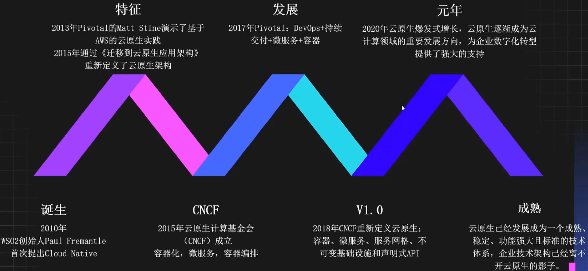
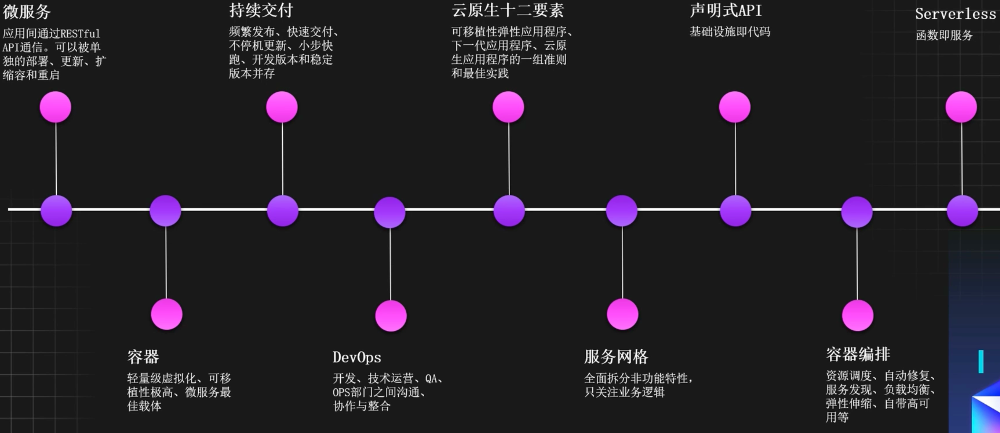
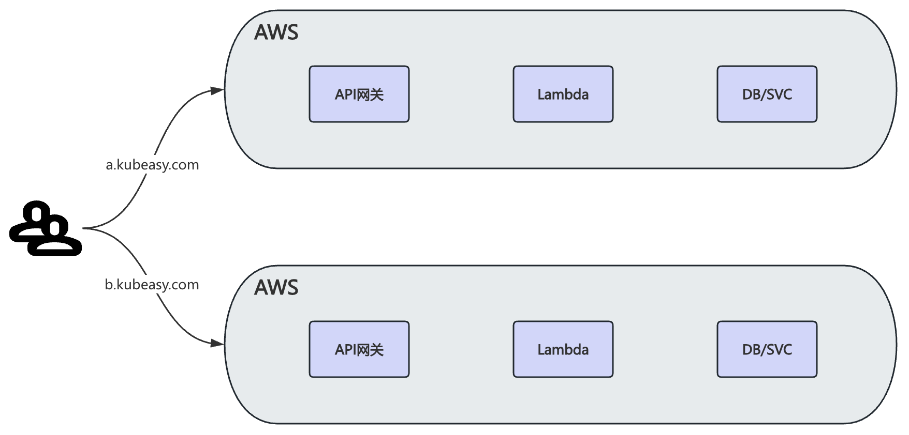
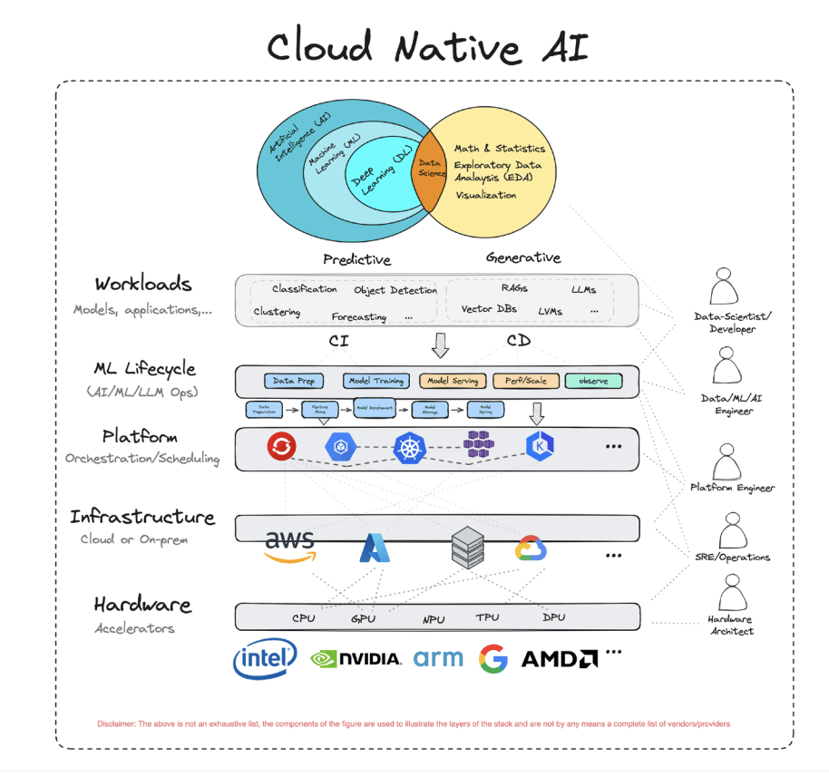

# 云原生基础

> 云原生意义：云原生有利于各组织在公有云、私有云和混合云等新型动态环境中构建和运行可弹性扩展的应用。

## 云原生发展



## CNCF云原生项目

### 全景图

> https://landscape.cncf.io/

### 分类

> http://cncf.io/projects/

生产环境下云原生项目尽量选择毕业项目

- SandBox 沙盒项目
- Incubating 孵化项目
- Graduated 毕业项目：Kubernetes、Prometheus等
- Archived 归档项目

## 云原生技术体系



### 声明式API

声明式API是一种比较流行且先进的编程范式，其设计理念强调通过声明式的说明，来表达所需的目标状态，进而管理比较复杂的系统，而不是去手动完成达成目标所需的操作。

声明式API的核心思想是将“意图”与“执行”分离，技术人员只需要通过声明目标状态，即可完成构建、部署和管理的操作，不需要去理解复杂的细节。

举例

```yaml
apiVersion: v1
kind: Pod
metadata:
  name: nginx
spec:
  containers:
  - name: nginx
    image: nginx:1.15.12
    imagePullPolicy: IfNotPresent
    command:
    - sh
    - -c
    - sleep 10; nginx -g "daemon off;"
    ports:
    - containerPort: 80
  restartPolicy: Never
```

### Serverless

Serverless是一种无服务器架构，可以让技术人员完全无需管理服务器和基础设施。通过Serverless，技术人员可以更加高效地构建和发布应用。同时Serverless的弹性能力，大大降低了企业成本。

Serverless架构图


### 云原生12要素

- 一份基准代码，多份部署（local、dev、prod环境通过配置适配）
- 显式声明依赖（类似Java的pom文件）
- 在环境变量中存储配置（最低要求做到存储分离）
- 把后端服务当作附加资源（很难实现、例如mysql挂了后依赖mysql的java服务还能正常运行）
- 严格分离构建、发布和运行（不能在运行环境中直接修改代码）
- 应用无状态化
- 通过端口绑定来提供服务（通过port来提供服务，而不是使用socket文件等方式）
- 通过进程模型来扩展（当服务性能不高时推荐增加副本数来提供性能）
- 快速启动和优雅停止（启动时不能加载过多依赖项，停止时可以接收停止信号做一些收尾工作）
- 运行环境一致性（local、dev、prod环境资源一致性）
- 日志当作事件流（日志直接输出到控制台、kafka、hadoop等，而不是输出到本地文件）
- 后台管理任务当作一次性进程运行（服务的任务与基本运行时逻辑隔离并解耦，单独出来运行）

### 云原生应用最佳实践

- 应用日志直接输出至控制台
- 应用数据不要直接写在本地
- 应用配置与代码分离
- 应用服务治理采用云平台能力
- 应用微服务化
- 应用可容器化
- 应用提供可靠健康检查接口
- 应用提供Metrics接口

## 云原生AI

云原生人工智能(CNAI）是指使用云原生技术构建和部署人工智能应用和工作负载。其核心是将AI与云原生技术（如容器化、微服务、DevOps等）相结合，以实现更高效、更灵活、更可靠的AI应用开发和部署。


CNAI 全景图

https://landscape.cncf.io/?group=cnai

