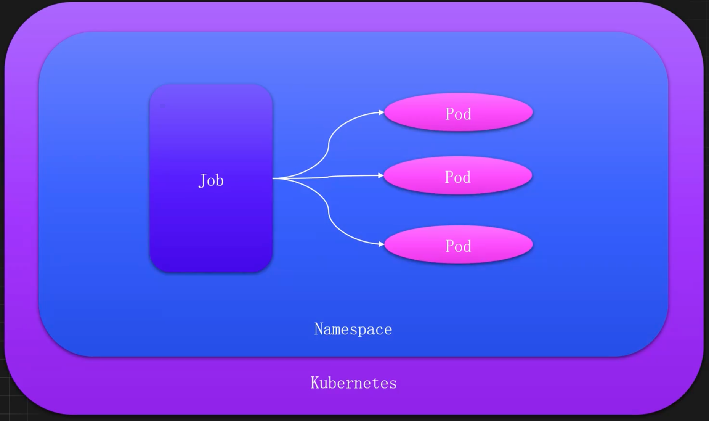
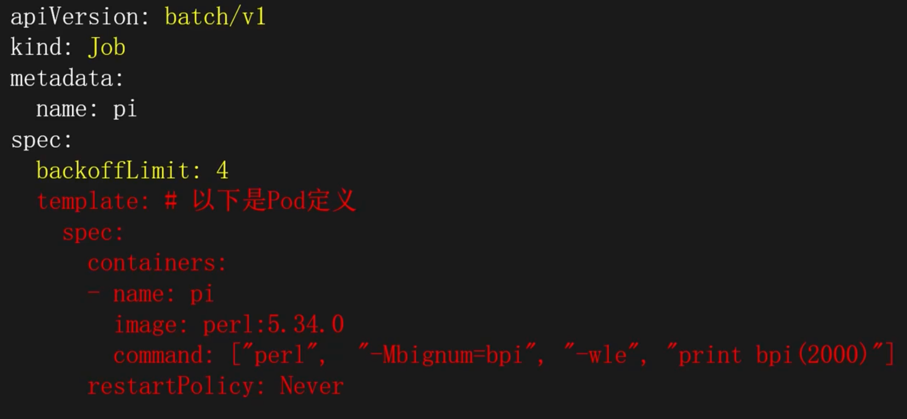
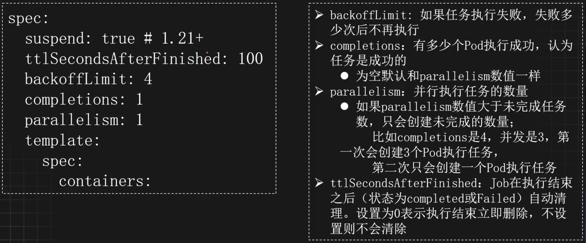
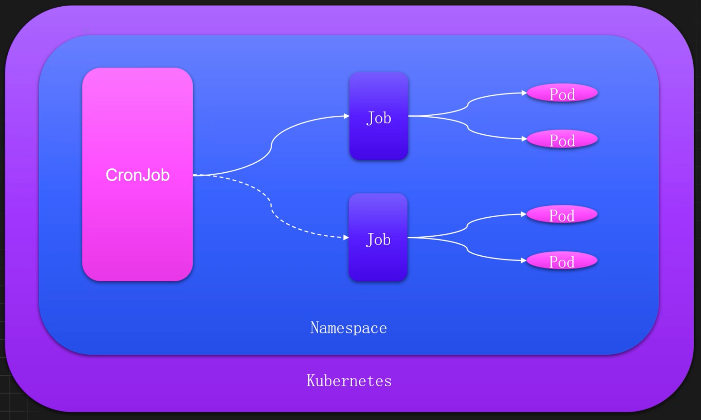
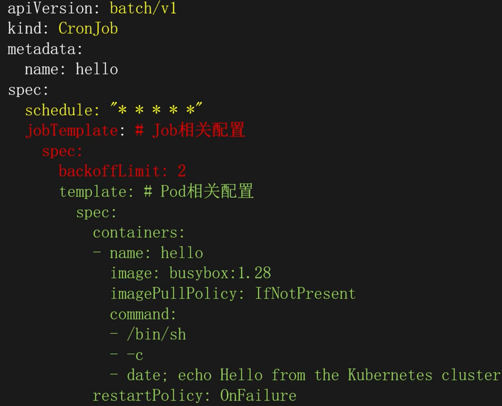
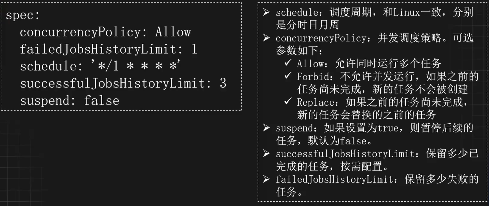

# 任务管理

## Job

### 理解

#### 什么是Job

Kubernetes的Job资源，主要用来执行单次任务，比如执行一次备份任务、微调一次模型等。对于每次任务，Job控制器会创建一个或多个Pod执行相关指令，并且确保成功的个数达到预期的值才会把Job标记为成功（Completed），否则将会标记为失败（Failed）。

#### 工作流程



#### Job的特点和优势

- `环境隔离`：Job可以使用不同的镜像执行任务，无需考虑版本冲突
- `单次执行`：Job任务通常是短暂的，运行一次后就结束
- `状态追踪`：Job控制器会追踪所有Pod的完成情况，一旦达到指定的成功次数，Job才会被标记为完成
- `失败重试`：任务执行失败，可以按需重新执行
- `并行执行`：同一个任务可以拆分不同的Pod并行执行，提高执行速度

#### Job资源定义



#### Job常用配置



### 创建

创建 Job，也可以通过 `kubectl` 和 `Yaml` 文件创建。 

使用 `kubectl` 创建

```shell
# 使用 Kubectl 创建一个一次性任务，打印一个 Hello
kubectl create job hello --image=registry.cnbeijing.aliyuncs.com/monap/busybox -- echo "Hello, Job"

# 查看创建的 Job
kubectl get job
NAME    STATUS    COMPLETIONS    DURATION   AGE 
hello  Complete      1/1           4s       16s

# 查看 Job 创建的 Pod
kubectl get po
```

使用 `Yaml` 创建

```yaml
# vim job2.yaml
apiVersion: batch/v1
kind: Job
metadata:
  name: hello2
spec:
  template:
    spec:
      containers:
        - name: hello2
          image: registry.cn-beijing.aliyuncs.com/monap/busybox
          command:
            - echo
            - Hello, Job
          resources: {}
      restartPolicy: Never
```

### 状态

- `DURATION`：表示 Job 从开始执行到最后一个 Pod 完成的时间长度 
- `COMPLETIONS`：表示 Job 当前已完成的个数与期望完成次数

### 并发执行

假设需要创建一个 Job，这个 Job 可以同时创建两个 Pod 执行任务，当执行成功 5 个表示该 Job 执行成功

```yaml
# cat job2.yaml
apiVersion: batch/v1
kind: Job
metadata:
  name: hello2
spec:
  parallelism: 2      # 创建 2 个 Pod 同时执行任务
  completions: 5      # 总共需要成功完成 5 个 Pod 表示任务结束
  template:
    spec:
      restartPolicy: Never
      containers:
        - name: hello2
          image: registry.cn-beijing.aliyuncs.com/monap/busybox
          command:
            - sh
            - -c
            - echo "Hello Job!"
          resources: {}
```

创建该 Job

```shell
# 创建 Job
kubectl create -f job2.yaml

# 过一段时间查看pod（可以发现一共创建了 5 个 Pod 执行任务，状态都为 Completed）
kubectl get po
```

### 重试机制

如果要实现 Pod 执行失败后可以重试，此时可以把重启策略改成 `OnFailure`，但是最好限制一下重试次数。 

比如最多允许每个 Pod 尝试两次任务执行

```yaml
# cat job2.yaml
apiVersion: batch/v1
kind: Job
metadata:
  name: hello2
spec:
  parallelism: 2        # 最多同时运行 2 个 Pod
  completions: 5        # 需要成功完成 5 个 Pod 才算 Job 成功
  backoffLimit: 2       # 整个 Job 最多重试 2 次（注意：不是每个 Pod！）（默认值为6）
  template:
    spec:
      restartPolicy: OnFailure
      containers:
        - name: hello2
          image: registry.cn-beijing.aliyuncs.com/monap/busybox
          command:
            - sh
            - -c
            - |
              echo "Hello Job!" && sleep 1 && exit 42
          resources: {}
```

查看创建的 Pod

```shell
# 查看Pod
# 此时 Pod 会重启且最多重启两次
kubectl get po

# 重启结束后，Job 会被标记为失败
kubectl get job
```

## CronJob

### 理解

#### 什么是CronJob

Kubernetes的CronJob资源，是Job资源的延伸，主要用于周期性执行任务，比如定期备份数据库、定期对某个服务健康检查等。CronJob和Linux的计划任务功能类似，主要用于按计划执行某个操作，但是功能比Linux原生的计划任务更加丰富。

#### 工作流程



#### CronJob的特点和优势

- `周期执行`：CronJob使用cron表达式定期创建Job执行任务
- `并行执行`：CronJob具备多种并发策略，调用Job更加灵活
- `可靠性高`：CronJob可以调度到K8s的任意节点运行，防止单点故障
- `环境隔离`：CronJob可以使用不同的镜像执行任务，无需考虑版本冲突
- `历史记录`：CronJob可以保留多个成功和失败的任务，便于问题跟踪和审计

#### CronJob资源定义



#### CronJob常用配置



### 创建

CronJob 创建同样支持命令行和 Yaml 文件创建，比如创建一个每分钟执行一次的任务

使用 `kubectl` 创建

```shell
# 创建 CronJob
kubectl create cj hello --image=registry.cnbeijing.aliyuncs.com/moanp/busybox --schedule='*/1 * * * *' -- echo "Hello, Hello from the Kubernetes CronJob"

# 查看 CronJob
$ kubectl get cj
NAME    SCHEDULE       TIMEZONE  SUSPEND  ACTIVE    LAST     SCHEDULE AGE
hello   */1 * * * *     <None>   False     0      <None>       29s

# 等待 1 分钟后，即可查看到调度的 Job
kubectl get job
```

使用 `Yaml` 创建

```yaml
# cat cronjob.yaml
apiVersion: batch/v1
kind: CronJob
metadata:
  creationTimestamp: null
  name: hello2
spec:
  jobTemplate:
    spec:
      template:
        metadata:
          creationTimestamp: null
        spec:
          containers:
            - command:
                - echo
                - Hello, Hello from the Kubernetes CronJob
              image: registry.cn-beijing.aliyuncs.com/monap/busybox
              name: hello2
              resources: {}
          restartPolicy: OnFailure
  schedule: '*/1 * * * *'
```

### 并发策略

CronJob 支持三种并发策略： 

- `Allow`：允许同时运行多个任务，默认值
- `Forbid`：不允许并发运行，如果之前的任务尚未完成，新的任务不会被创建
- `Replace`：如果之前的任务尚未完成，新的任务会替换的之前的任务

如需更改并发策略，只需要更改 CronJob 的 concurrencyPolicy 字段即可。比如不允许 CronJob 并发执行

```yaml
# cat cronjob.yaml
apiVersion: batch/v1
kind: CronJob
metadata:
  creationTimestamp: null
  name: hello2
spec:
  concurrencyPolicy: Forbid
  jobTemplate:
    spec:
      template:
        metadata:
          creationTimestamp: null
        spec:
          containers:
            - command:
                - sh
                - -c
                - echo Hello, Hello from the Kubernetes CronJob; sleep 300
              image: registry.cn-beijing.aliyuncs.com/monap/busybox
              name: hello2
              resources: {}
          restartPolicy: OnFailure
  schedule: '*/1 * * * *'
```

创建该计划任务

```shell
# 创建
kubectl apply -f cronjob.yaml

# 查看
kubectl get cj

# 该任务在第一个创建 Job 后，第二个任务不会在两分钟后创建
kubectl get job | grep hello2

# 第一次调度的 Pod 并未结束，同时由于并发策略的控制，下一次在 Pod 完成时不会调度
kubectl get po | grep hello2

# 如果并发策略改成替换，下一次任务将覆盖上一次任务（避免长时间无法结束的任务）
# 更改并发策略为替换
##
concurrencyPolicy: Replace
##
kubectl replace -f cronjob.yaml

# 查看新建的 Job 和 Pod
kubectl get job | grep hello2
kubectl get po

# 一分钟后，Pod 为结束，下一次的调度会覆盖上一次的任务
kubectl get po | grep hello2
```

### 执行记录

CronJob 默认的执行记录保留方式如下：

- `成功记录`：默认为 3 次，可以通过  `successfulJobsHistoryLimit` 字段更改
- `失败记录`：默认为 1 次，可以通过 `failedJobsHistoryLimit` 字段更改

为了更好的收集日志和追踪问题，可以增加记录的数量。比如都增加到 5 个

```yaml
# cat cronjob.yaml
apiVersion: batch/v1
kind: CronJob
metadata:
  creationTimestamp: null
  name: hello2
spec:
  schedule: '*/1 * * * *'
  failedJobsHistoryLimit: 5
  successfulJobsHistoryLimit: 5
```

### 调度时区

如果采用具体的时间调度任务，需要注意调度的时区问题。 

如果 CronJob 未标注调度时区，Kubernetes 会以 kube-controller-manager 组件的时区进行调度，如果该组件运行的时区和本地时区不一样，会导致无法按照规定时间进行调度。

比如创建一个每天凌晨一点开始执行的任务，此时配置的调度表达式可能如下：

```yaml
schedule: '00 01 * * *'
```

但是如果未指定时区，当 `kube-controller-manager` 组件的时区和本地时区有差别时，可能会在每天的九点进行调度（本地时区为 Shanghai 时区，kube-controller-manager 采用 UTC 时间）

在 Kubernetes 1.25 版本时，CronJob 增加了`.spec.timeZone` 的字段用于配置 CronJob 的调度时区，在 1.27 版本达到稳定，可以直接使用。1.25~1.27 版本之间需要打开 kube-apiserver 的 featuregates 特性，比如：

```shell
--feature-gates=CronJobTimeZone=true
```

配置时区只需要添加 timeZone 即可

```yaml
apiVersion: batch/v1
kind: CronJob
meta
  name: example-cronjob
spec:
  schedule: "*/5 02 * * *"
  timeZone: "Asia/Shanghai"
```

## 案例

### CronJob定时备份MySQL

创建一个测试 MySQL

```yaml
# vim mysql.yaml
apiVersion: apps/v1
kind: Deployment
metadata:
  name: mysql
spec:
  replicas: 1
  selector:
    matchLabels:
      app: mysql
  template:
    metadata:
      labels:
        app: mysql
    spec:
      containers:
        - name: mysql
          image: registry.cn-beijing.aliyuncs.com/monap/mysql:8.0.20
          ports:
            - name: tcp-3306
              containerPort: 3306
              protocol: TCP
          env:
            - name: MYSQL_ROOT_PASSWORD
              value: password_123
          livenessProbe:
            tcpSocket:
              port: 3306
            initialDelaySeconds: 30
            timeoutSeconds: 3
            periodSeconds: 30
            successThreshold: 1
            failureThreshold: 2
          readinessProbe:
            tcpSocket:
              port: 3306
            initialDelaySeconds: 30
            timeoutSeconds: 3
            periodSeconds: 30
            successThreshold: 1
            failureThreshold: 2
```

创建一个 MySQL 的 Service

```shell
kubectl expose deploy mysql --port 3306
```

创建一个数据库和表

```shell
$ kubectl exec -ti mysql-895f96d-zb2wd -- bash
root@mysql-895f96d-zb2wd:/# mysql -uroot -hmysql -p 
Enter password: 
mysql> create database dukuan; 
Query OK, 1 row affected (0.01 sec) 
mysql> CREATE TABLE employees ( 
  id INT AUTO_INCREMENT PRIMARY KEY, 
  first_name VARCHAR(50) NOT NULL, 
  last_name VARCHAR(50) NOT NULL, 
  email VARCHAR(100), 
  hire_date DATE
); 
mysql> show tables; 
+------------------+ 
| Tables_in_dukuan | 
+------------------+ 
| employees |
 +------------------+ 
 1 row in set (0.00 sec)
```

单次备份测试

```shell
$ kubectl exec -ti mysql-895f96d-zb2wd -- bash
root@mysql-895f96d-zb2wd:/# mysqldump -uroot -p'password_123' --alldatabases > /tmp/all.sql
```

创建一个用于放置 CronJob 的命名空间

```shell
kubectl create ns cronjob
```

创建备份的持久化 PVC

```yaml
# cat mysql-backup-pvc.yaml
---
apiVersion: v1
kind: PersistentVolumeClaim
metatadata:
  name: mysql-backup-data
spec:
  accessModes:
    - ReadWriteMany
  resources:
    requests:
      storage: 10Gi
  storageClassName: nfs-csi
  
# kubectl create -f mysql-backup-pvc.yaml -n cronjob
```

创建 CronJob 每天凌晨 1 点执行备份

```yaml
# cat mysql-backup.yaml
apiVersion: batch/v1
kind: CronJob
metadata:
  creationTimestamp: null
  name: mysql-backup
spec:
  schedule: '01 16 * * *'
  failedJobsHistoryLimit: 5
  successfulJobsHistoryLimit: 5
  jobTemplate:
    spec:
      template:
        metadata:
          creationTimestamp: null
        spec:
          volumes:
            - name: data
              persistentVolumeClaim:
                claimName: mysql-backup-data
          restartPolicy: Never
          containers:
            - name: backup
              image: registry.cn-beijing.aliyuncs.com/monap/mysql:8.0.20
              command:
                - sh
                - -c
                - |
                  mysqldump -hmysql.default -P3306 -uroot -p'password_123' --all-databases > /mnt/all-`date +%Y%m%d-%H%M%S`.sql;
                  ls /mnt/
              resources: {}
              volumeMounts:
                - name: data
                  mountPath: /mnt
```

创建 CronJob

```shell
# 创建 CronJob
kubectl create -f mysql-backup.yaml -n cronjob

# 查看cronjob
kubectl get cj -n cronjob

# 到执行的时间后，即可看到创建的 Job
kubectl get job -n cronjob
kubectl get po -n cronjob
```

### CronJob定时重启K8s服务

有时候需要定期重启 K8s 中的服务，也可以使用 CronJob 实现。

```shell
# 创建一个用于放置 CronJob 的命名空间（已有可忽略）
kubectl create ns cronjob

# 创建重启 K8s 服务的权限
# 创建 ClusterRole 
kubectl create clusterrole deployment-restart --verb=get,update,patch --resource=deployments.apps 
# 绑定权限
kubectl create clusterrolebinding deployment-restart-binding -- clusterrole=deployment-restart --serviceaccount=cronjob:default
```

创建 CronJob 执行重启任务（每周六凌晨两点执行）

```yaml
# cat restart-deploy.yaml
apiVersion: batch/v1
kind: CronJob
metadata:
  name: default-restart
  namespace: cronjob
spec:
  schedule: 01 18 * * 5
  concurrencyPolicy: Allow
  suspend: false
  jobTemplate:
    metadata:
      creationTimestamp: null
    spec:
      template:
        metadata:
          creationTimestamp: null
        spec:
          restartPolicy: Never
          containers:
            - name: restart
              image: registry.cnbeijing.aliyuncs.com/monap/kubectl:latest
              command:
                - /bin/bash
                - '-c'
                - >-
                  kubectl rollout restart deploy mysql -n default
      successfulJobsHistoryLimit: 3
      failedJobsHistoryLimit: 3
```

创建与查看

```shell
# 创建 CronJob
kubectl create -f restart-deploy.yaml -n cronjob

# 查看执行记录
kubectl get job -n cronjob
```
