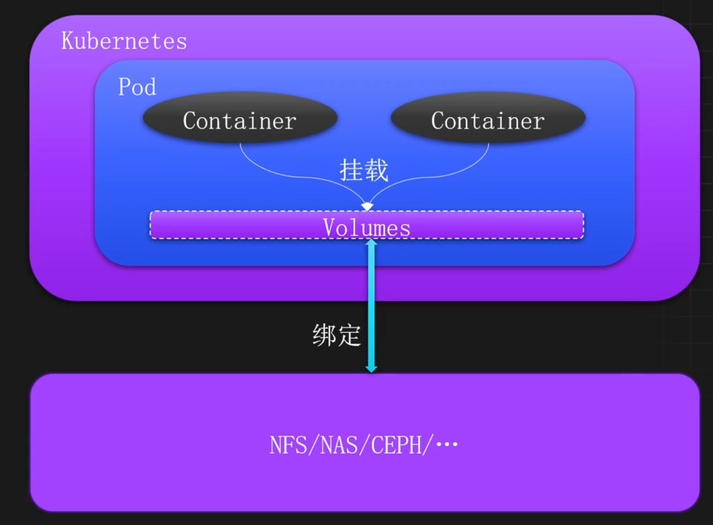
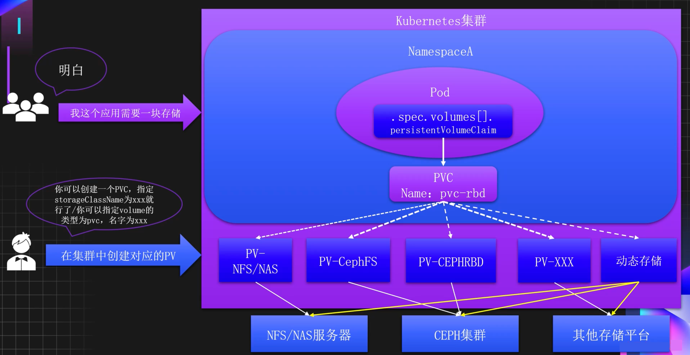
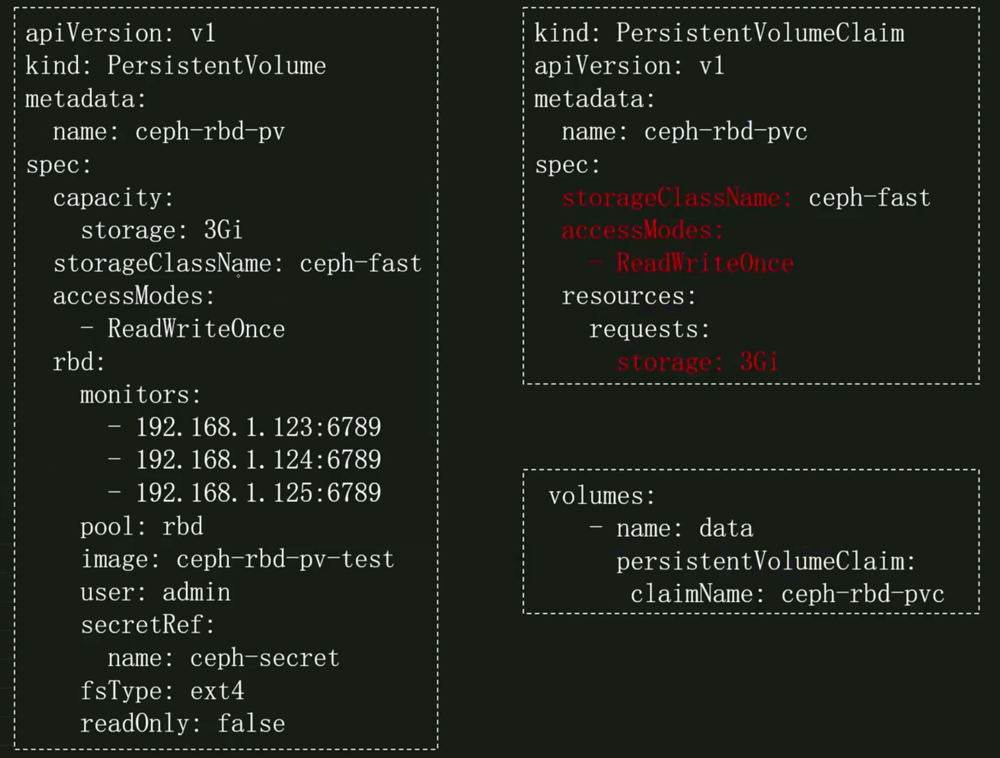
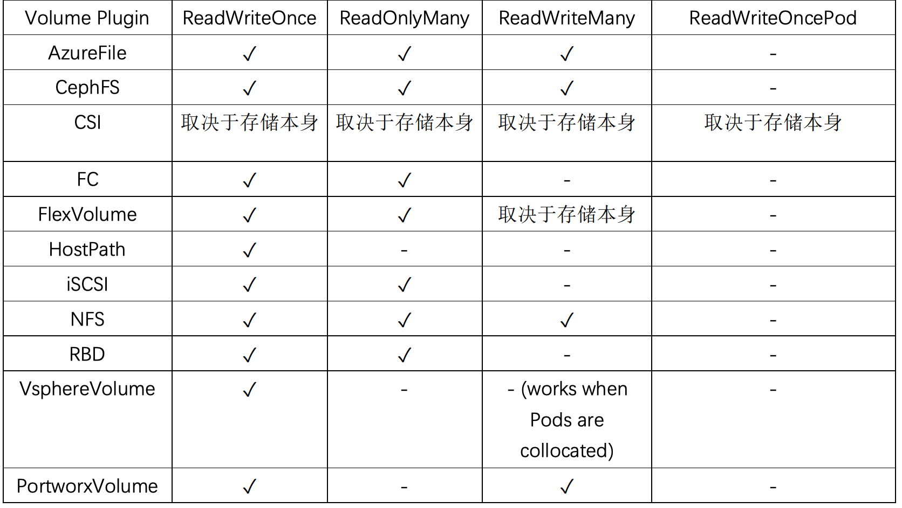
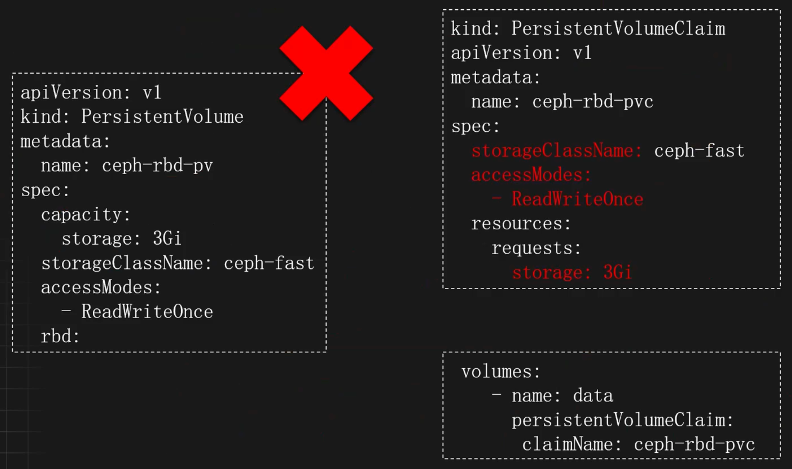
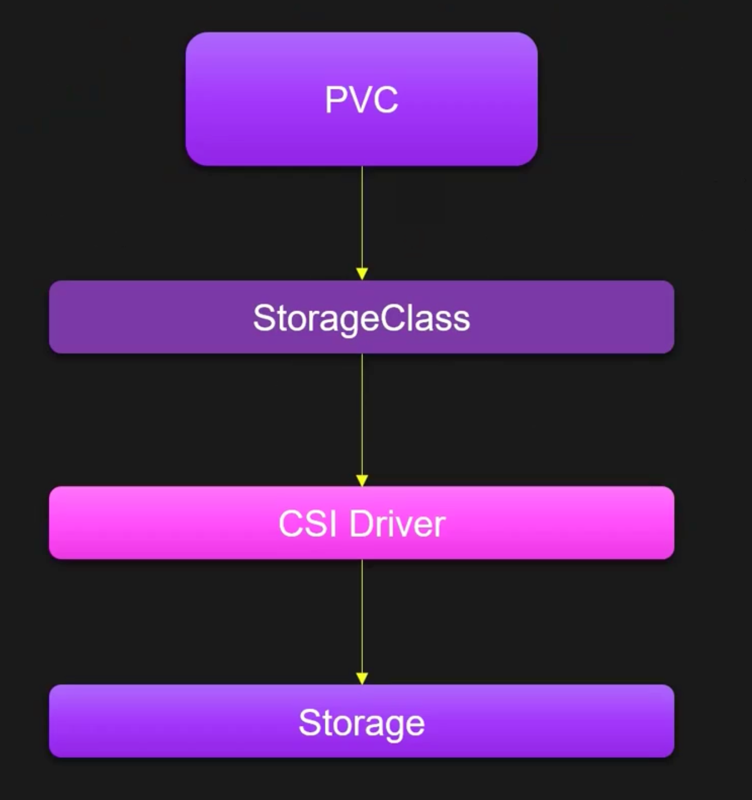
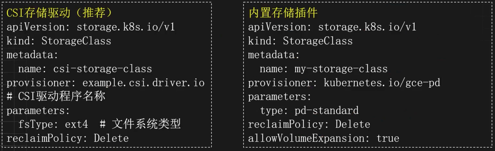
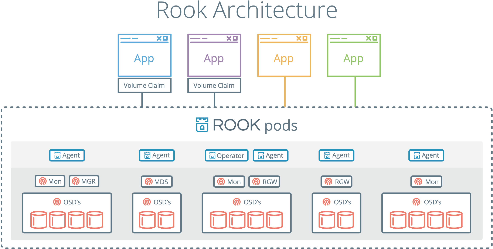
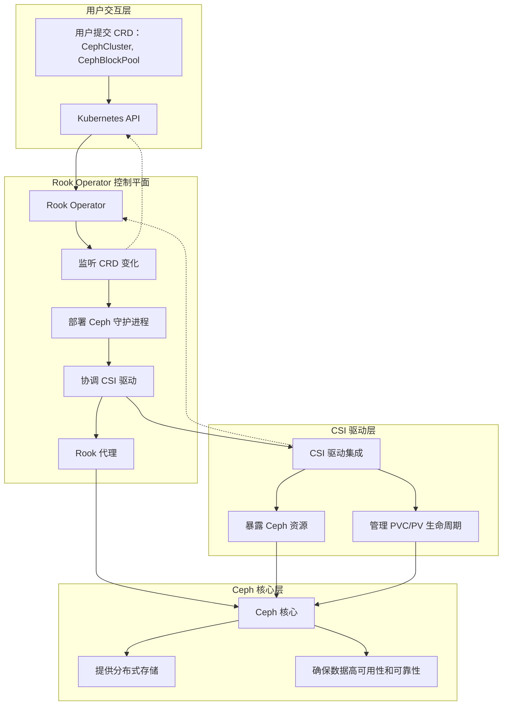

# 存储管理

## 引入

### 创建的存储需求

- 用户数据
- 文件数据
- 配置文件
- 共享数据
- 程序数据
- 日志文件

### 什么是Volumes

Kubernetes的Volumes是一个对存储资源的抽象，属于Pod级别的一个配置字段。

Volumes在Pod中绑定多个、多种的数据类型，比如NFS、NAS、CEPH等，这些绑定的数据可以挂载到Pod中的一个或多个容器中，从而实现容器的数据持久化和数据共享。



## 使用 Volumes 直接绑定存储

### Volume常见存储类型

[官方介绍](https://kubernetes.io/docs/concepts/storage/volumes/)

- `EmptyDir`：临时目录，当Pod从节点删除时，EmptyDir中的数据也会被删除，常用于临时数据存储，如缓存、中间计算结果、数据共享等
- `HostPath`：节点数据共享，HostPath可以让容器直接访问节点上的文件或目录，常用于和节点共享数据
- `ConfigMap&Secret`：用于挂载ConfigMap和Secret到容器中
- `Downward API`：元数据挂载，主要用于容器访问Pod的一些元数据，比如标签、命名空间等（不推荐使用，可以直接使用env的方式去挂载元数据）
- `NAS&NFS`：网络文件系统，主要用于挂载远程存储到容器中，实现跨主机的数据共享和持久化
- `PVC`：PV请求，K8s中的一类资源，用于配置多种不同的存储后端

### EmptyDir

EmptyDir 是 Kubernetes 支持的临时存储功能，主要用于多个容器的数据共享，当 Pod 重建时，数据会被清空。EmptyDir 可以绑定主机上的 `硬盘` 和 `内存` 作为 Volume，比如把 `emptyDir.medium` 字段设置为 Memory，就可以让 Kubernetes 使用 tmpfs（内存支持的文件系统）。虽然 tmpfs 非常快，但是设置的大小会被计入到 Container 的内存限制当中。

#### 磁盘类型的 EmptyDir

配置使用 emptyDir 卷非常简单，直接指定 emptyDir 为{}即可（如果不需要指定其他配置）

```yaml
apiVersion: apps/v1
kind: Deployment
metadata:
  labels:
    app: emptydir
  name: emptydir
  namespace: default
spec:
  replicas: 2
  selector:
    matchLabels:
      app: emptydir
  template:
    metadata:
      labels:
        app: emptydir
    spec:
      containers:
      - image: registry.cn-beijing.aliyuncs.com/monap/nginx:1.15.12
        imagePullPolicy: IfNotPresent
        name: nginx
        volumeMounts:
        - mountPath: /opt
          name: share-volume
      - image: registry.cn-beijing.aliyuncs.com/monap/redis:7.2.5
        imagePullPolicy: IfNotPresent
        name: redis
        volumeMounts:
        - mountPath: /mnt
          name: share-volume
      volumes:
      - name: share-volume
        emptyDir: {}
```

进到容器中即可查看到挂载的目录，可以发现`emptyDir` 磁盘类型是在宿主机上创建的临时目录，并且使用的是宿主机的根文件系统空间。这里的挂载目录/opt的size就是宿主机磁盘的大小

```shell
$ df -Th 
Filesystem               Type     Size  Used  Avail Use%  Mounted on 
overlay                  overlay  39G   9.2G   30G   24%   / 
tmpfs                    tmpfs    64M    0     64M   0%    /dev 
/dev/mapper/rl_192-root  xfs      39G   9.2G   30G   24%   /opt
```

#### 内存类型 EmptyDir

使用内存作为 EmptyDir，只需要把 medium 改为 Memory 即可。这里medium只能为空或者Memory，为空时就是磁盘类型

```yaml
  volumes:
    - name: share-volume
      emptyDir:
        medium: Memory
```

创建 Pod，即可在 Pod 的容器内看到使用 tmpfs 挂载的/opt 目录，这里的挂载目录/opt的size就是宿主机内存的大小

```shell
$ df -Th 
Filesystem   Type     Size  Used  Avail  Use%  Mounted on 
overlay     overlay   39G   7.1G   32G   19%    /
tmpfs       tmpfs     64M    0     64M   0%     /dev
tmpfs       tmpfs     3.5G   0     3.5G  0%     /opt
```

#### EmptyDir 大小限制

两种类型的 EmptyDir 都支持限制卷的大小，只需要添加 sizeLimit 字段即可

```yaml
volumes:
  - name: share-volume
    emptyDir:
      medium: Memory
      sizeLimit: 10Mi
```

再次进入到容器中查看

```shell
$ df -Th 
Filesystem   Type     Size  Used  Avail  Use%  Mounted on 
overlay     overlay   39G   7.1G   32G   19%    /
tmpfs       tmpfs     64M    0     64M   0%     /dev
tmpfs       tmpfs     3.5G   0     10M   0%      /opt
```

#### EmptyDir 注意项

- 磁盘类型的 emptyDir，限制大小后不会显示具体限制的大小
- 磁盘类型的emptyDir超出最大限制时，Pod 将会变成 Completed 状态被驱逐不再提供服务，同时将会新创建一个 Pod
- 内存类型的 emptyDir 不会超出限制的大小，如不限制将会使用机器内存的最大值， 或容器内存限制之和的最大值

### HostPath

HostPath 类型的卷可将节点上的文件或目录挂载到 Pod 上，用于容器和节点之间的数据共享。 

比如使用 hostPath 类型的卷，将主机的/data 目录挂载到 Pod 的/test-pd 目录

```yaml
apiVersion: apps/v1
kind: Deployment
metadata:
  labels:
    app: nginx
  name: nginx
  namespace: default
spec:
  replicas: 2
  selector:
    matchLabels:
      app: nginx
  template:
    metadata:
      labels:
        app: nginx
    spec:
      containers:
      - image: registry.cn-beijing.aliyuncs.com/monap/nginx:1.15.12
        imagePullPolicy: IfNotPresent
        name: nginx
        volumeMounts:
        - mountPath: /opt
          name: share-volume
      - image: registry.cn-beijing.aliyuncs.com/monap/redis:7.2.5
        imagePullPolicy: IfNotPresent
        name: redis
        volumeMounts:
        - mountPath: /mnt
          name: share-volume
        - mountPath: /data
          name: data
      volumes:
      - name: share-volume
        emptyDir:
          medium: Memory
          sizeLimit: 10Mi
      - name: data
        hostPath:
          path: /data
```

hostPath 卷常用的 type（类型）如下：

- `type 为空字符串`：默认选项，意味着挂载 hostPath 卷之前不会执行任何检查
- `DirectoryOrCreate`：如果给定的 path 不存在任何东西，那么将根据需要创建一个权限为 0755 的空目录，和 Kubelet 具有相同的组和权限
- `Directory`：目录必须存在于给定的路径下
- `FileOrCreate`：如果给定的路径不存储任何内容，则会根据需要创建一个空文件，权限设置为 0644，和 Kubelet 具有相同的组和所有权
- `File`：文件，必须存在于给定路径中
- `Socket`：UNIX 套接字，如某个程序的 socket 文件，必须存在于给定路径中
- `CharDevice`：字符设备，如串行端口、声卡、摄像头等，必须存在于给定路径中，且只有 Linux 支持
- `BlockDevice`：块设备，如硬盘等，必须存在于给定路径中，且只有 Linux 支持

### NFS/NAS

使用远程存储介质，可以实现跨主机容器之间的数据共享，比如使用 NFS、NAS、CEPH 等。

#### NFS 搭建

准备一台机器用于搭建 NFS，首先安装 NFS

```shell
# CentOS、Rocky 系列
$ yum install nfs-utils rpcbind -y

# Ubuntu 系列
$ apt install nfs-kernel-server -y
```

配置共享目录

```shell
$ mkdir /data/nfs
$ echo "/data/nfs/
192.168.181.0/24(rw,sync,no_subtree_check,no_root_squash)" >> /etc/exports

# 加载 NFS 配置
$ exportfs -r
```

启动 NFS

```shell
# CentOS、Rocky 系列
$ systemctl enable --now nfs-server rpcbind 

# Ubuntu 系列 
$ systemctl enable --now nfs-kernel-server
```

客户端挂载测试

```shell
# 首先安装客户端工具
# CentOS、Rocky 系列 
$ yum install nfs-utils -y 

# Ubuntu 系列
$ apt install nfs-common -y 

# 挂载 
$ mount -t nfs 192.168.181.140:/data/nfs /mnt/

$ df -Th | grep mnt 
192.168.181.140:/data/nfs    nfs4  39G  9.2G  30G  24%  /mnt
```

#### 挂载 NFS 类型的卷

直接在 volumes 上添加 NFS 的卷即可

```yaml
apiVersion: apps/v1
kind: Deployment
metadata:
  labels:
    app: nfs
  name: nfs
  namespace: default
spec:
  replicas: 2
  selector:
    matchLabels:
      app: nfs
  template:
    metadata:
      labels:
        app: nfs
    spec:
      containers:
      - image: registry.cn-beijing.aliyuncs.com/monap/nginx:1.15.12
        imagePullPolicy: IfNotPresent
        name: nginx
        volumeMounts:
        - mountPath: /opt
          name: nfs-volume
      - image: registry.cn-beijing.aliyuncs.com/monap/redis:7.2.5
        imagePullPolicy: IfNotPresent
        name: redis
        volumeMounts:
        - mountPath: /mnt
          name: nfs-volume
      volumes:
      - name: nfs-volume
        nfs:
          server: 192.168.181.140
          path: /data/nfs/testdata
```

进入到容器中，即可查看挂载的目录

```shell
$ df -Th
Filesystem                          Type     Size.  Used    Avail  Use%  Mounted on
overlay                             overlay   39G   9.2G    30G     24%   / 
tmpfs                               tmpfs     64M.    0     64M.     0%   /dev 
192.168.181.140:/data/nfs/testdata  nfs4      39G   9.2G    30G     24%   /opt
```

通过Kubernetes创建Pod并使用NFS类型的持久化存储（无论是直接指定NFS，还是通过PV/PVC）时，Kubelet（Kubernetes的节点代理）会在宿主机上执行实际的挂载操作，以便将远程的NFS共享目录呈现给Pod中的容器。

如果 Pod 一直处于创建中，可能是由于没有安装客户端工具导致的，可以使用 describe 查看详情

```shell
$ kubectl  get  po
nfs-6db79bb58b-m4vvj 0/2 ContainerCreating 0 59s

$ kubectl describe po nfs-6db79bb58b-m4vvj
Warning FailedMount 55s (x8 over 119s) kubelet
MountVolume.SetUp failed for volume "nfs-volume" : mount failed: exit status 32

Mounting command: mount
Mounting arguments: -t nfs 192.168.181.140:/data/nfs/testdata 
/var/lib/kubelet/pods/faae4701-1c1d-4a2d-a16efa76c64a7ae7/volumes/kubernetes.io~nfs/nfs-volume
Output: mount: /var/lib/kubelet/pods/faae4701-1c1d-4a2d-a16efa76c64a7ae7/volumes/kubernetes.io~nfs/nfs-volume: bad option; for several filesystems (e.g. nfs, cifs) you might need a /sbin/mount. helper program.
```

## 使用 PV 和 PVC 挂载存储

### 为什么需要PV和PVC

存储需求多样性，只有Volume无法满足

- 当某个数据卷不再被挂载使用时，里面的数据如何处理?
- 如果想要实现只读挂载如何处理？
- 如果想要只能一个Pod挂载如何处理？
- 如何只允许某个Pod使用10G的空间？
- 同一个应用不同副本如何使用不同的数据目录？

存储配置的复杂度，Volume不适用于所有人

- 配置参数的专业性过高，开发人员（用户）在定义 Pod 时，必须了解底层存储的细节
- 开发人员接触到了基础设施的敏感信息

代码维护复杂度，不符合云原生设计

- 配置与基础设施强耦合，导致"硬编码"
- 存储变更的连锁反应，当决定将存储后端从 NFS 迁移到 CephRBD，需要找出所有使用了该 NFS 的 Pod，逐个修改它们的 YAML 文件
- 缺乏逻辑抽象，导致代码重复

### PV和PVC概念及工作原理

[官方介绍](https://kubernetes.io/docs/concepts/storage/persistent-volumes/)

`PersistentVolume`：简称PV，是由Kubernetes管理员设置的存储，可以配置Ceph、NFS、GlusterFS等常用存储，相对于Volume配置，提供了更多的功能，比如生命周期的管理、大小的限制，同时也可以支持存储的动态分配。

`PersistentVolumeClaim`：简称PVC，是对存储PV的请求，表示需要什么类型的PV，并绑定该PV。如果某个服务需要挂载存储，只需要在Volumes中添加PVC类型的Volume即可，并且通常只需要指定PVC的名称即可，无需关心整个的存储配置细节。



PV和PVC使用示例



### PV的访问策略

[官方文档](https://kubernetes.io/docs/concepts/storage/persistent-volumes/#access-modes)

> 注意：单节点不是单Pod。虽然只允许一个节点（Node）挂载，但该节点上可以运行多个 Pod，这些 Pod 都可以访问该卷。

- `ReadWriteOnce`：可以被单节点以读写模式挂载，命令行中可以被缩写为 RWO
- `ReadOnlyMany`：可以被多个节点以只读模式挂载，命令行中可以被缩写为 ROX
- `ReadWriteMany`：可以被多个节点以读写模式挂载，命令行中可以被缩写为 RWX
- `ReadWriteOncePod`：只能被单个 Pod 以读写模式挂载，命令行中可以被缩写为 RWOP， 目前仅支持在 CSI 且 Kubernetes 1.22+中使用

常见存储支持的访问策略



### PV的回收策略

[官方文档](https://kubernetes.io/docs/concepts/storage/persistent-volumes/#reclaim-policy)

如果更改回收策略，只需要通过 `persistentVolumeReclaimPolicy` 字段配置即可

- `Retain`：保留，该策略允许手动回收资源，当删除 PVC 时，PV 仍然存在，PV 被视为已释放，管理员可以手动回收卷。 
- `Recycle`：回收，如果 Volume 插件支持，Recycle 策略会对卷执行 rm -rf 清理该 PV，并使其可用于下一个新的 PVC，但是本策略将来会被弃用，目前只有 NFS 和 HostPath 支持该策略。 
- `Delete`：删除，如果 Volume 插件支持，删除 PVC 时会同时删除 PV，`动态存储默认为 Delete`，目前支持 Delete 的存储后端包括 AWS EBS、GCE PD、Azure Disk、OpenStack Cinder、Ceph 等。

### PV的状态

- `Available`：可用，没有被 PVC 绑定的空闲资源
- `Bound`：已绑定，已经被 PVC 绑定
- `Released`：已释放，PVC 被删除，但是资源还未被重新使用
- `Failed`：失败，自动回收失败

### HostPath类型的PV

创建 HostPath 类型的 PV

- `capacity`：容量配置
- `volumeMode`：卷的模式，目前支持 Filesystem（文件系统） 和 Block（块），其中 Block 类型需要后端存储支持，默认为文件系统
- `accessModes`：该 PV 的访问模式
- `storageClassName`：PV 的类，一个特定类型的 PV 只能绑定到特定类别的 PVC
- `persistentVolumeReclaimPolicy`：回收策略

```yaml
# vim hostpath-pv.yaml
kind: PersistentVolume
apiVersion: v1
metadata:
  name: task-pv-volume
  labels:
    type: local
spec:
  storageClassName: hostpath
  volumeMode: Filesystem
  capacity:
    storage: 10Gi
  accessModes:
    - ReadWriteOnce
  hostPath:
    path: "/mnt/data"
```

### NFS/NAS类型的PV

创建一个 NAS/NFS 类型的 PV

```yaml
# vim nas-nfs-pv.yaml
apiVersion: v1
kind: PersistentVolume
metadata:
  name: pv-nfs
spec:
  capacity:
    storage: 5Gi
  volumeMode: Filesystem
  accessModes:
    - ReadWriteMany
  persistentVolumeReclaimPolicy: Recycle
  storageClassName: nfs-slow
  nfs:
    # NFS 上的共享目录
    path: /data/nfs
    # NFS 的 IP 地址
    server: 192.168.181.140
```

### 创建PVC绑定PV

比如创建一个 PVC 绑定到 NFS 的 PV 上

```yaml
# vim pvc-nfs.yaml
apiVersion: v1
kind: PersistentVolumeClaim
metadata:
  name: task-pvc-claim
spec:
  storageClassName: nfs-slow
  accessModes:
    - ReadWriteMany
  resources:
    requests:
      storage: 3Gi
```

通过 PVC 把存储挂载到容器中

```yaml
apiVersion: apps/v1
kind: Deployment
metadata:
  name: pvc-test
  namespace: default
  labels:
    app: pvc-test
spec:
  replicas: 2
  selector:
    matchLabels:
      app: pvc-test
  template:
    metadata:
      labels:
        app: pvc-test
    spec:
      volumes:
        - name: data
          persistentVolumeClaim:
            claimName: task-pvc-claim
      containers:
        - name: pvc-test
          image: nginx
          imagePullPolicy: IfNotPresent
          env:
            - name: TZ
              value: Asia/Shanghai
            - name: LANG
              value: C.UTF-8
          volumeMounts:
            - name: data
              mountPath: "/usr/share/nginx/html"
```

### PVC创建和挂载失败的原因

PVC 一直 Pending 的原因：

- PVC 的空间申请大小大于 PV 的大小
- PVC 的 StorageClassName 没有和 PV 的一致
- PVC 的 accessModes 和 PV 的不一致
- 请求的 PV 已被其他的 PVC 绑定

挂载 PVC 的 Pod 一直处于 Pending：

- PVC 没有创建成功/PVC 不存在
- PVC 和 Pod 不在同一个 Namespace

## 动态存储

### 理解

#### 什么是动态存储

PV的定义依旧很困难，前面并没有解决掉配置复杂度(各种存储参数)的问题。我们可以使用动态存储解决掉管理PV的复杂度。

动态存储可以在用户需要存储资源时自动创建和配置PV，而无需手动创建和配置PV。可以让存储资源的分配变得更加灵活，并且可以随着应用程序的需求变化而动态调整。

#### 动态PV使用示例



#### 工作原理

动态存储依赖 `StorageClass` 和 `CSI`（ContainerStorageInterface）实现，当我们创建一个PVC时，通过 `storageClassName` 指定动态存储的类，该类指向了不同的存储供应商，比如Ceph、NFS等，之后通过该类就可完成PV的自动创建。

#### 动态存储架构图



#### 容器存储接口 -CSI

`CSI`（ContainerStorageInterface）是一个标准化的存储接口，用于在容器环境中集成外部存储系统。它提供了一种统一的方式来集成各种存储系统，无论是云提供商的存储服务，还是自建的存储集群，都可以通过CSI对接到容器平台中。

在同一个Kubernetes集群中，可以同时存在多个CSI对接不同的存储平台，之后可以通过 `StorageClass` 的 `provisioner` 字段声明该Class对接哪一种存储平台。

#### 存储类 - StorageClass

`StorageClass` 和 `IngressClass` 类似，用于定义存储资源的类别，可以使用内置的存储插件或第三方的CSI驱动程序关联存储。

在同一个Kubernetes集群中，可以同时存在多个StorageClass对接不同或相同的CSI，用于实现更多的动态存储需求场景。

> 多个 `StorageClass` 对接同一个 CSI 驱动，本质上是为了通过不同的“服务等级”或“功能特性”来满足不同应用对存储的多样化需求。同一个 CSI 驱动（例如 `csi-aws-ebs`）通常能提供多种底层存储资源（例如 AWS 上不同型号的 EBS 卷）。通过创建多个 `StorageClass`，我们可以将这些选项“包装”成不同档次的产品，供用户按需选择。



### 安装 NFS/NAS CSI

[代码地址](https://github.com/kubernetes-csi/csi-driver-nfs)

通过 `kubectl` 方式安装 

```shell
# 下载安装文件
git clone https://github.com/kubernetes-csi/csi-driver-nfs.git

# 安装 CSI
$ cd csi-driver-nfs/ 
$ sed -i "s#registry.k8s.io#k8s.m.daocloud.io#g" deploy/v4.12.1/*.yaml
$ ./deploy/install-driver.sh v4.12.1 local

# 查看 Pod 状态
$ kubectl -n kube-system get pod -l app=csi-nfs-controller
$ kubectl -n kube-system get pod -l app=csi-nfs-node

# 查看 CSI
$ kubectl get csidriver
NAME ATTACHREQUIRED PODINFOONMOUNT STORAGECAPACITY TOKENREQUESTS REQUIRESREPUBLISH MODES AGE
nfs.csi.k8s.io false false false false Persistent 10m
```

### 创建 StorageClass

[参考文档](https://github.com/kubernetes-csi/csi-driver-nfs/blob/master/deploy/example/README.md)

更改 StorageClass 配置

```yaml
# vim deploy/v4.12.1/storageclass.yaml
apiVersion: storage.k8s.io/v1
kind: StorageClass
metadata:
  name: nfs-csi
provisioner: nfs.csi.k8s.io
parameters:
  # 主要修改这里
  server: 192.168.181.140
  share: /data/nfs
  # csi.storage.k8s.io/provisioner-secret is only needed for providing mountOptions in DeleteVolume
  # csi.storage.k8s.io/provisioner-secret-name: "mount-options"
  # csi.storage.k8s.io/provisioner-secret-namespace: "default"
reclaimPolicy: Delete
volumeBindingMode: Immediate
allowVolumeExpansion: true
mountOptions:
  - nfsvers=4.1
```

查看 StorageClass

```shell
$ kubectl get sc
NAME PROVISIONER RECLAIMPOLICY VOLUMEBINDINGMODE ALLOWVOLUMEEXPANSION AGE
nfs-csi  nfs.csi.k8s.io  Delete  Immediate  false  23s
```

### 挂载测试

```shell
# vim deploy/example/pvc-nfs-csi-dynamic.yaml 
---
apiVersion: v1
kind: PersistentVolumeClaim
metadata:
  name: pvc-nfs-dynamic
  namespace: default
spec:
  accessModes:
    - ReadWriteMany
  resources:
    requests:
      storage: 10Gi
  storageClassName: nfs-csi
  

# 创建pvc
kubectl create -f deploy/example/pvc-nfs-csi-dynamic.yaml

# 查看pvc和pv
kubectl get pvc pvc-nfs-dynamic
kubectl get pv

# 此时会在 NFS 目录下创建一个共享目录
ls /data/nfs/
```

挂载测试

```yaml
# cat deployment.yaml
apiVersion: apps/v1
kind: Deployment
metadata:
  name: deployment-nfs
  namespace: default
spec:
  replicas: 3
  selector:
    matchLabels:
      name: deployment-nfs
  template:
    metadata:
      name: deployment-nfs
      labels:
        name: deployment-nfs
    spec:
      nodeSelector:
        kubernetes.io/os: linux
      containers:
        - name: deployment-nfs
          image: registry.cn-beijing.aliyuncs.com/monap/nginx:1.15.12
          command:
            - "/bin/bash"
            - "-c"
            - |
              while true; do
                echo $(hostname) $(date) >> /mnt/nfs/outfile;
                sleep 5;
              done
          volumeMounts:
            - name: nfs
              mountPath: "/mnt/nfs"
              readOnly: false
      volumes:
        - name: nfs
          persistentVolumeClaim:
            claimName: pvc-nfs-dynamic
```

在 NFS 节点的数据目录，即可查看到来自于不同示例写入的数据

```shell
tail -f /data/nfs/pvc-80d65113-8693-4a66-9474-fef76f1b439e/outfile
```

测试完毕后删除测试数据

```shell
# 删除测试应用
$ kubectl delete -f deployment.yaml

# 删除pvc
$ kubectl delete pvc pvc-nfs-dynamic

# 此时 PV 和数据也会被删除
$ kubectl get pv
No resources found

$ ls /data/nfs/
```

### 部署 MySQL 并持久化数据

创建一个 MySQL 的 PVC

```yaml
# cat mysql-pvc.yaml
---
apiVersion: v1
kind: PersistentVolumeClaim
metadata:
  name: mysql-data
spec:
  accessModes:
    - ReadWriteMany
  resources:
    requests:
      storage: 10Gi
  storageClassName: nfs-csi
```

创建一个 MySQL 的 Deployment

```yaml
# cat mysql-deploy.yaml
apiVersion: apps/v1
kind: Deployment
meta
  name: mysql
spec:
  replicas: 1
  selector:
    matchLabels:
      app: mysql
  strategy:
    type: Recreate
  template:
    metadata:
      labels:
        app: mysql
    spec:
      volumes:
        - name: data
          persistentVolumeClaim:
            claimName: mysql-data
        # - name: conf
        #   configMap:
        #     name: mysqld.cnf
        #     defaultMode: 420
      containers:
        - name: mysql
          image: registry.cn-beijing.aliyuncs.com/monap/mysql:8.0.20
          imagePullPolicy: IfNotPresent
          ports:
            - name: tcp-3306
              containerPort: 3306
              protocol: TCP
          env:
            - name: MYSQL_ROOT_PASSWORD
              value: "password_123"
          volumeMounts:
            - name: data
              mountPath: /var/lib/mysql
            # - name: conf
            #   readOnly: true
            #   mountPath: /etc/mysql/mysql.conf.d/
          livenessProbe:
            tcpSocket:
              port: 3306
            initialDelaySeconds: 30
            timeoutSeconds: 3
            periodSeconds: 30
            successThreshold: 1
            failureThreshold: 2
          readinessProbe:
            tcpSocket:
              port: 3306
            initialDelaySeconds: 30
            timeoutSeconds: 3
            periodSeconds: 30
            successThreshold: 1
            failureThreshold: 2
          # lifecycle:
          #   postStart:
          #     exec:
          #       command: [ "sh", "-c", "rm -rf /var/lib/mysql/lost+found" ]
      restartPolicy: Always
      dnsPolicy: ClusterFirst
  strategy:
    type: Recreate
```

创建 MySQL，并查看启动状态

```shell
$ kubectl create -f mysql-deploy.yaml 
deployment.apps/mysql created

$ kubectl get po 
NAME                   READY  STATUS    RESTARTS  AGE
mysql-78495ddfff-2h6l9 1/1    Running    0        96s
```

MySQL 启动后，会在数据目录初始化基础数据，此时可以在后端存储中看到

```shell
$ ls /data/nfs/pvc-01602665-4968-4a4d-b8e9-e3eb627f7f34/
auto.cnf ca.pem ib_buffer_pool '#innodb_temp' public_key.pem undo_002
binlog.000001 client-cert.pem ibdata1 mysql server-cert.pem
binlog.000002 client-key.pem ib_logfile0 mysql.ibd server-key.pem
binlog.index '#ib_16384_0.dblwr' ib_logfile1 performance_schema sys
ca-key.pem '#ib_16384_1.dblwr' ibtmp1 private_key.pem undo_001
```

创建数据测试

```shell
$ kubectl exec -ti mysql-78495ddfff-2h6l9 -- bash

$ $ mysql -uroot -p 
Enter password: 输入密码 

mysql> CREATE DATABASE monap;
Query OK, 1 row affected (0.00 sec)
```

删除 Pod 后，数据不会丢失

```shell
$ kubectl delete po mysql-78495ddfff-2h6l9 
pod "mysql-78495ddfff-2h6l9" deleted

$ kubectl exec -ti mysql-78495ddfff-vh7nj -- bash
root@mysql-78495ddfff-vh7nj:/# mysql -uroot -p
Enter password: 
mysql> SHOW DATABASES; 
+--------------------+ 
| Database | 
+--------------------+ 
| monap              | 
| information_schema | 
| mysql              | 
| performance_schema | 
| sys                | 
+--------------------+
```

### StatefulSet 配置动态存储

使用 StatefulSet 部署有状态服务时，可以使用 `volumeClaimTemplates` 自动为每个 Pod 生成 PVC，并挂载至容器中，大大降低了手动创建管理存储的难度和复杂度。 

假设需要搭建一个三节点的 RabbitMQ 集群到 K8s 中，并且需要实现数据的持久化，此时可以通过 StatefulSet 创建三个副本，并且通过 `volumeClaimTemplates` 绑定存储。 

首先下载部署文件：

```shell
$ git clone https://gitee.com/dukuan/k8s.git

$ cd k8s/k8s-rabbitmq-cluster/
```

更改存储配置

```yaml
# vim rabbitmq-cluster-ss.yaml 
      volumeMounts:
      - mountPath: /etc/rabbitmq
        name: config-volume
        readOnly: false
      - mountPath: /var/lib/rabbitmq
        name: rabbitmq-storage
        readOnly: false
      # 可以发现volumeClaimTemplates下的结构和pvc的结构基本一致
      volumeClaimTemplates:
      - metadata:
          name: rabbitmq-storage
        spec:
          accessModes:
            - ReadWriteOnce
          storageClassName: "nfs-csi"
          resources:
            requests:
              storage: 4Gi
```

创建资源

```shell
$ kubectl create ns public-service

$ kubectl create -f .
```

查看状态

```shell
# 查看启动状态
kubectl get po -n public-service

# 查看创建的pvc
kubectl get pvc -n public-service

# 查看创建的service
kubectl get svc -n public-service

# 通过 15672 端口的 NodePort 即可访问 RabbitMQ 的管理页面
```

## 云原生存储产品

### 分布式存储组件选型与对比

#### 基本信息

| 对比维度       | Longhorn                                                  | Rook-Ceph                                        | OpenEBS                                               | JuiceFS                                                   | CubeFS                                            | GlusterFS                                                 |
| :--------- | :-------------------------------------------------------- | :----------------------------------------------- | :---------------------------------------------------- | :-------------------------------------------------------- | :------------------------------------------------ | :-------------------------------------------------------- |
| **开源协议**   | Apache 2.0                                                | Apache 2.0                                       | Apache 2.0                                            | Apache 2.0                                                | Apache 2.0                                        | GPL v3 / LGPL v3                                          |
| **CNCF状态** | 🟡 Incubating                                             | 🟢 Graduated (2020.10)                           | 🟠 Sandbox (2024.10重新加入)                              | ⚪ 非CNCF项目                                                 | 🟢 Graduated (2024.12)                            | ⚪ 非CNCF项目                                                 |
| **主要维护方**  | SUSE/Rancher                                              | Red Hat/社区                                       | DataCore/社区                                           | Juicedata                                                 | OPPO/JD.com/社区                                    | 社区维护                                                      |
| **商业支持**   | SUSE 商业订阅                                                 | Red Hat Ceph Storage                             | DataCore 商业支持                                         | JuiceFS Cloud/Enterprise                                  | SmartX 等                                          | ⚠️ Red Hat 已 EOL (2024.12)                                |
| **GitHub** | [longhorn/longhorn](https://github.com/longhorn/longhorn) | [rook/rook](https://github.com/rook/rook)        | [openebs/openebs](https://github.com/openebs/openebs) | [juicedata/juicefs](https://github.com/juicedata/juicefs) | [cubefs/cubefs](https://github.com/cubefs/cubefs) | [gluster/glusterfs](https://github.com/gluster/glusterfs) |
| **官方文档**   | [longhorn.io/docs](https://longhorn.io/docs)              | [rook.io/docs](https://rook.io/docs/rook/latest) | [openebs.io/docs](https://openebs.io/docs)            | [juicefs.com/docs](https://juicefs.com/docs)              | [cubefs.io/docs](https://cubefs.io/docs)          | [docs.gluster.org](https://docs.gluster.org/)             |

#### 社区活跃度

|对比维度|Longhorn|Rook-Ceph|OpenEBS|JuiceFS|CubeFS|GlusterFS|
|:--|:--|:--|:--|:--|:--|:--|
|**GitHub Stars**|~7.3k+|~13k+|~9.5k+|~11.1k+|~5k+|~4.7k+|
|**社区活跃度**|🟢 高 (月度社区会议)|🟢 高 (活跃开发)|🟡 中 (2024重组后恢复)|🟢 高 (活跃开发)|🟢 中高 (CNCF毕业)|🔴 低 (维护模式)|
|**最近更新**|持续活跃|持续活跃|持续活跃|持续活跃|持续活跃|⚠️ 维护模式|
|**发布周期**|~2-3个月|~4个月|~2-3个月|~1-2个月|~2-3个月|不定期|

#### 存储访问模式

| 对比维度                    | Longhorn           | Rook-Ceph     | OpenEBS         | JuiceFS           | CubeFS       | GlusterFS      |
| :---------------------- | :----------------- | :------------ | :-------------- | :---------------- | :----------- | :------------- |
| **块存储 (Block/RBD)**     | ✅ 支持               | ✅ 支持 (RBD)    | ✅ 支持 (Mayastor) | ❌ 不支持             | ❌ 不支持        | ❌ 不支持          |
| **文件存储 (File/POSIX)**   | ✅ 支持 (RWX via NFS) | ✅ 支持 (CephFS) | ✅ 支持 (部分引擎)     | ✅ 支持 (POSIX/FUSE) | ✅ 支持 (POSIX) | ✅ 支持 (主要模式)    |
| **对象存储 (Object/S3)**    | ❌ 不支持              | ✅ 支持 (RGW S3) | ❌ 不支持           | ✅ 支持 (S3 Gateway) | ✅ 支持 (S3兼容)  | ✅ 支持 (Swift兼容) |
| **ReadWriteOnce (RWO)** | ✅                  | ✅             | ✅               | ✅                 | ✅            | ✅              |
| **ReadWriteMany (RWX)** | ✅ (NFS方式)          | ✅ (CephFS)    | ✅ (部分引擎)        | ✅                 | ✅            | ✅              |
| **ReadOnlyMany (ROX)**  | ✅                  | ✅             | ✅               | ✅                 | ✅            | ✅              |

#### 技术架构

| 对比维度       | Longhorn                 | Rook-Ceph       | OpenEBS                            | JuiceFS                   | CubeFS          | GlusterFS      |
| :--------- | :----------------------- | :-------------- | :--------------------------------- | :------------------------ | :-------------- | :------------- |
| **架构类型**   | 分布式块存储                   | 统一存储平台          | 容器附加存储 (CAS)                       | 分布式文件系统                   | 分布式文件/对象存储      | 分布式文件系统        |
| **内核依赖**   | iSCSI (open-iscsi)       | Ceph 内核模块 (RBD) | 无 (用户态) / hugepages (Mayastor)     | FUSE                      | 无 (用户态)         | FUSE           |
| **存储引擎**   | 自研分布式块引擎                 | Ceph (RADOS)    | LocalPV-HostPath/LVM/ZFS, Mayastor | FUSE + 对象存储后端             | 自研分布式引擎         | GlusterD       |
| **元数据管理**  | 内置 (etcd)                | Ceph MON/MDS    | 依引擎而定                              | 外部数据库 (Redis/MySQL/TiKV等) | 内置 (Raft)       | DHT (无中心)      |
| **CSI 驱动** | ✅ 原生支持                   | ✅ 原生支持          | ✅ 原生支持                             | ✅ 原生支持                    | ✅ 原生支持          | ✅ 支持 (外部)      |
| **部署方式**   | Helm / kubectl / Rancher | Helm / Operator | Helm / Operator                    | Helm / kubectl            | Helm / Operator | DaemonSet / 外部 |

#### 数据分配策略

| 对比维度               | Longhorn | Rook-Ceph  | OpenEBS   | JuiceFS  | CubeFS | GlusterFS   |
| :----------------- | :------- | :--------- | :-------- | :------- | :----- | :---------- |
| **数据局部化**          | ✅ 节点亲和性  | ✅ CRUSH 算法 | ✅ LocalPV | ✅ 缓存本地化  | ✅ 支持   | ✅ DHT       |
| **容量均衡**           | ✅ 自动均衡   | ✅ Balancer | ✅ 支持      | 依赖后端对象存储 | ✅ 支持   | ✅ Rebalance |
| **条带化 (Striping)** | ❌ 不支持    | ✅ EC/条带    | ❌ 不支持     | ✅ 分块存储   | ✅ EC   | ✅ 支持        |
| **分层存储 (Tiering)** | ❌ 不支持    | ✅ SSD/HDD  | ❌ 不支持     | ✅ 缓存层    | ✅ 支持   | ✅ Tiering   |
| **纠删码 (EC)**       | ❌ 不支持    | ✅ 支持       | ❌ 不支持     | 依赖后端     | ✅ 支持   | ❌ 不支持       |

#### 高可用与数据保护

| 对比维度              | Longhorn       | Rook-Ceph         | OpenEBS        | JuiceFS | CubeFS   | GlusterFS         |
| :---------------- | :------------- | :---------------- | :------------- | :------ | :------- | :---------------- |
| **副本机制**          | 多副本 (默认3)      | 多副本 / EC          | 多副本 (Mayastor) | 依赖后端存储  | 多副本 / EC | 副本卷               |
| **跨节点高可用**        | ✅ 同步复制         | ✅ 同步复制            | ✅ 同步复制         | 依赖后端存储  | ✅ 同步复制   | ✅ 副本卷             |
| **快照 (Snapshot)** | ✅ CSI Snapshot | ✅ CSI Snapshot    | ✅ 支持           | ✅ 支持    | ✅ 支持     | ✅ 有限支持            |
| **克隆 (Clone)**    | ✅ 支持           | ✅ 支持              | ✅ 支持           | ✅ 支持    | ✅ 支持     | ✅ 支持              |
| **备份与恢复**         | ✅ S3/NFS 备份    | ✅ RBD镜像/RGW       | ✅ Velero 集成    | ✅ 多种后端  | ✅ 支持     | ⚠️ 需外部工具          |
| **灾难恢复 (DR)**     | ✅ 跨集群 DR       | ✅ RBD Mirror/异步复制 | △ 部分支持         | ✅ 多云复制  | ✅ 跨区域复制  | ✅ Geo-replication |
| **静态数据加密**        | ✅ LUKS         | ✅ 支持              | ✅ Mayastor     | ✅ 支持    | ✅ 支持     | ✅ 支持              |
| **传输加密**          | ✅ 支持           | ✅ 支持              | △ 部分支持         | ✅ 支持    | ✅ 支持     | ✅ TLS             |

#### PV 管理与认证

|对比维度|Longhorn|Rook-Ceph|OpenEBS|JuiceFS|CubeFS|GlusterFS|
|:--|:--|:--|:--|:--|:--|:--|
|**StorageClass**|✅ 支持|✅ 支持|✅ 支持|✅ 支持|✅ 支持|✅ 支持|
|**动态卷供应**|✅ 支持|✅ 支持|✅ 支持|✅ 支持|✅ 支持|✅ Heketi|
|**在线卷扩容**|✅ 支持|✅ 支持|✅ 支持|✅ 支持|✅ 支持|✅ 支持|
|**RBAC 集成**|✅ K8s RBAC|✅ K8s RBAC|✅ K8s RBAC|✅ K8s RBAC|✅ K8s RBAC|✅ K8s RBAC|
|**多租户支持**|通过命名空间|✅ Pool/Quota|通过命名空间|✅ 支持|✅ 支持|通过命名空间|
|**加密卷访问控制**|✅ K8s Secret|✅ K8s Secret|✅ K8s Secret|✅ K8s Secret|✅ 支持|通过后端|

#### 集群规模与扩展

|对比维度|Longhorn|Rook-Ceph|OpenEBS|JuiceFS|CubeFS|GlusterFS|
|:--|:--|:--|:--|:--|:--|:--|
|**最小节点数**|3 节点|3 节点 (生产)|1 节点 (LocalPV) / 3 节点|1 节点 (元数据需外部)|3 节点|3 节点 (副本卷)|
|**最大规模**|中等规模 (TB级)|🔥 大规模 (EB级)|中等规模|🔥 大规模 (PB级)|🔥 大规模 (EB级)|中等规模|
|**滚动升级**|✅ 支持|✅ 支持|✅ 支持|✅ 支持|✅ 支持|✅ 支持|
|**自动故障恢复**|✅ 自动|✅ 自动|✅ 自动|依赖后端|✅ 自动|⚠️ 手动/半自动|
|**水平扩展能力**|中|高|中|高|高|中|

#### 性能特点

|对比维度|Longhorn|Rook-Ceph|OpenEBS|JuiceFS|CubeFS|GlusterFS|
|:--|:--|:--|:--|:--|:--|:--|
|**性能定位**|中等|高 (需调优)|高 (Mayastor)|高 (取决于后端)|高|中等|
|**随机 IOPS**|中等|高 (RBD优化)|🔥 高 (Mayastor NVMe)|依赖后端对象存储|高|较低 (FUSE开销)|
|**顺序吞吐量**|中等|高|高|高|高|中等|
|**延迟特性**|毫秒级|亚毫秒 (NVMe)|🔥 亚毫秒 (Mayastor)|依赖后端|低延迟|较高 (FUSE)|
|**元数据性能**|中等|高 (MDS)|高|高 (内存缓存)|🔥 极高 (内存B树)|中等|
|**大文件性能**|中等|高|高|🔥 优秀|🔥 优秀|高|
|**小文件性能**|中等|中等|高 (LocalPV)|中等|高|较低|

#### 资源占用

|对比维度|Longhorn|Rook-Ceph|OpenEBS|JuiceFS|CubeFS|GlusterFS|
|:--|:--|:--|:--|:--|:--|:--|
|**CPU 开销**|🟢 低-中|🔴 中-高|🟢 低 (LocalPV) / 🔴 高 (Mayastor)|🟢 低|🟡 中|🟡 中|
|**内存开销**|🟢 低-中 (~1GB)|🔴 高 (建议4GB+/OSD)|🟢 低-高 (引擎依赖)|🟢 低|🟡 中|🟡 中|
|**存储开销**|副本数倍 (默认3x)|副本/EC (可配置)|副本数倍|依赖对象存储定价|副本/EC|副本数倍|
|**网络带宽要求**|10GbE 推荐|10GbE+ 推荐|10GbE 推荐|依赖对象存储访问|10GbE 推荐|10GbE 推荐|

#### 运维复杂度

|对比维度|Longhorn|Rook-Ceph|OpenEBS|JuiceFS|CubeFS|GlusterFS|
|:--|:--|:--|:--|:--|:--|:--|
|**安装复杂度**|⭐ 简单|⭐⭐⭐⭐ 复杂|⭐⭐ 较简单|⭐⭐ 较简单|⭐⭐⭐ 中等|⭐⭐⭐ 中等|
|**日常运维**|⭐ 简单|⭐⭐⭐⭐ 复杂|⭐⭐ 较简单|⭐⭐ 较简单|⭐⭐⭐ 中等|⭐⭐⭐ 中等|
|**故障排查**|⭐⭐ 较简单|⭐⭐⭐⭐⭐ 很复杂|⭐⭐⭐ 中等|⭐⭐ 较简单|⭐⭐⭐ 中等|⭐⭐⭐⭐ 较复杂|
|**学习曲线**|🟢 低|🔴 高|🟡 中低|🟡 中低|🟡 中|🟡 中高|
|**监控集成**|✅ Prometheus/Grafana|✅ Prometheus/Grafana|✅ Prometheus/Grafana|✅ Prometheus/Grafana|✅ Prometheus/Grafana|✅ Prometheus|
|**Web UI**|✅ 内置|✅ Ceph Dashboard|❌ 无|❌ 无 (企业版有)|❌ 无|❌ 无|

#### AI/ML 场景支持

| 对比维度         | Longhorn | Rook-Ceph | OpenEBS | JuiceFS            | CubeFS        | GlusterFS |
| :----------- | :------- | :-------- | :------ | :----------------- | :------------ | :-------- |
| **AI/ML 优化** | ❌ 不适合    | △ 需调优     | △ 有限    | 🔥 专项优化            | 🔥 原生支持       | ❌ 不推荐     |
| **大模型训练**    | ❌ 规模限制   | △ 可用      | △ 有限    | ✅ 广泛使用             | ✅ PB级数据       | ❌ 不适合     |
| **数据集管理**    | △ 基本     | ✅ 支持      | △ 基本    | ✅ 优秀               | ✅ 优秀          | △ 基本      |
| **GPU 集群适配** | △ 一般     | ✅ 支持      | △ 一般    | ✅ 优秀               | ✅ 优秀          | ❌ 不推荐     |
| **典型用户**     | 边缘/小规模   | 传统企业      | 通用      | MiniMax, StepFun 等 | JD, OPPO, 小米等 | 遗留系统      |

#### 多云与混合云支持

| 对比维度       | Longhorn | Rook-Ceph  | OpenEBS | JuiceFS             | CubeFS | GlusterFS |
| :--------- | :------- | :--------- | :------ | :------------------ | :----- | :-------- |
| **多云支持**   | △ 有限     | ✅ 支持       | ✅ 支持    | 🔥 原生多云             | ✅ 支持   | △ 有限      |
| **云厂商集成**  | △ 有限     | △ 有限       | ✅ 支持    | 🔥 广泛 (S3/OSS/COS等) | ✅ 支持   | △ 有限      |
| **跨云数据迁移** | △ 手动     | ✅ RGW Sync | △ 手动    | ✅ 原生支持              | ✅ 支持   | △ 手动      |
| **混合云部署**  | ✅ 支持     | ✅ 支持       | ✅ 支持    | 🔥 优秀               | ✅ 支持   | ✅ 支持      |

#### 适用场景推荐

|场景|首选方案|备选方案|不推荐|
|:--|:--|:--|:--|
|**边缘计算 / 小规模集群**|🥇 Longhorn|OpenEBS (LocalPV)|Rook-Ceph|
|**企业级生产环境**|🥇 Rook-Ceph|CubeFS|Longhorn|
|**AI/ML 训练平台**|🥇 JuiceFS / CubeFS|Rook-Ceph|Longhorn, GlusterFS|
|**数据库工作负载**|🥇 OpenEBS (LocalPV)|Rook-Ceph (RBD)|JuiceFS|
|**文件共享 / NAS**|🥇 CubeFS / Rook-Ceph (CephFS)|JuiceFS|Longhorn|
|**混合云 / 多云**|🥇 JuiceFS|CubeFS|Longhorn, GlusterFS|
|**对象存储**|🥇 Rook-Ceph (RGW) / MinIO|CubeFS|Longhorn, OpenEBS|
|**开发测试环境**|🥇 Longhorn / OpenEBS|JuiceFS|Rook-Ceph|

#### 选型决策树

```
开始选型
    │
    ├─── 是否需要块存储 (数据库等)？
    │       ├── 是 ──→ 小规模？ ──→ Longhorn
    │       │              └── 大规模？ ──→ Rook-Ceph (RBD) / OpenEBS (Mayastor)
    │       │
    │       └── 否 ──→ 是否需要文件存储？
    │                       │
    │                       ├── AI/ML场景？ ──→ JuiceFS / CubeFS
    │                       │
    │                       ├── 传统企业应用？ ──→ Rook-Ceph (CephFS)
    │                       │
    │                       └── 简单文件共享？ ──→ NFS / CubeFS
    │
    └─── 是否需要对象存储 (S3)？
            ├── 是 ──→ Rook-Ceph (RGW) / MinIO / CubeFS
            └── 否 ──→ 根据其他需求选择
```

#### 重要提醒

GlusterFS 警告

> ⚠️ **不建议新项目使用 GlusterFS**
> 
> - Red Hat Gluster Storage 已于 2024年12月31日 EOL
> - Red Hat 已解散 GlusterFS 工程团队
> - 上游开发活动大幅减少 (2024年仅31次提交)
> - Fedora 正在讨论是否退役该软件包
> - 建议迁移至 Rook-Ceph 或 CubeFS

OpenEBS 注意事项

> ℹ️ **OpenEBS 2024年重组**
> 
> - 2024年2月被 CNCF 存档
> - 2024年10月重新恢复 Sandbox 状态
> - 旧引擎 (cStor, Jiva) 已归档
> - 当前主要引擎：LocalPV-HostPath, LocalPV-LVM, LocalPV-ZFS, Mayastor

#### 参考文档

|项目|官方文档|GitHub|CNCF页面|
|:--|:--|:--|:--|
|Longhorn|https://longhorn.io/docs|https://github.com/longhorn/longhorn|https://www.cncf.io/projects/longhorn/|
|Rook-Ceph|https://rook.io/docs/rook/latest|https://github.com/rook/rook|https://www.cncf.io/projects/rook/|
|OpenEBS|https://openebs.io/docs|https://github.com/openebs/openebs|https://www.cncf.io/projects/openebs/|
|JuiceFS|https://juicefs.com/docs|https://github.com/juicedata/juicefs|-|
|CubeFS|https://cubefs.io/docs|https://github.com/cubefs/cubefs|https://www.cncf.io/projects/cubefs/|
|GlusterFS|https://docs.gluster.org|https://github.com/gluster/glusterfs|-|

### Longhorn

#### 理解

Longhorn 是一个轻量级、可靠且易用的 Kubernetes 分布式块存储系统，由 Rancher 开发并开源。

**核心特性：**

- 企业级分布式存储，无单点故障
- 增量快照功能    
- 支持备份到 NFS 或 S3 兼容存储
- 定期快照和备份
- 无中断升级
- 图形化管理界面

#### 前置要求

##### Kubernetes 集群要求

- **Kubernetes 版本**: >= v1.25（推荐 v1.30-1.33）
- **容器运行时**:
    - Docker v1.13+
    - containerd v1.3.7+
    - 或其他兼容运行时        

##### 节点要求

> 每个 Kubernetes 节点必须满足

**基础工具**

节点上必须安装以下命令行工具：

- `bash`
- `curl`
- `findmnt`
- `grep`
- `awk`
- `blkid`
- `lsblk`

**文件系统支持**

- 支持 ext4 或 XFS 文件系统
- 必须启用 file extents 特性
- 必须启用 Mount Propagation

**权限要求**

- Longhorn 工作负载必须以 root 用户运行
- 需要 privileged 权限

##### 软件依赖

**必需软件包**

- open-iscsi（必需)
	- 用于持久卷支持
	- `iscsid` 守护进程必须运行
	- `iscsi_tcp` 内核模块必须加载
- NFSv4 客户端（用于 RWX 卷和备份)
	- 需要 NFSv4、v4.1 或 v4.2 内核支持
- cryptsetup（用于卷加密）
	- 使用 LUKS2 格式
	- 需要 `dm_crypt` 内核模块
- device-mapper（用于 v2 卷）
	- 需要 `dmsetup` 工具

**各发行版安装命令**

```shell
# Debian/Ubuntu
apt-get install open-iscsi nfs-common cryptsetup dmsetup  
systemctl enable iscsid && systemctl start iscsid

# RHEL/CentOS/Rocky/EKS
yum --setopt=tsflags=noscripts install iscsi-initiator-utils  
yum install nfs-utils cryptsetup device-mapper  
systemctl enable iscsid && systemctl start iscsid

# SUSE/openSUSE
zypper install open-iscsi nfs-client cryptsetup device-mapper  
systemctl enable iscsid && systemctl start iscsid
```

**加载内核模块**

```shell
# 在所有节点上执行
sudo modprobe nfs
sudo modprobe iscsi_tcp
sudo modprobe dm_crypt

# 确保开机自动加载（永久生效）
echo "nfs" >> /etc/modules-load.d/longhorn.conf
echo "iscsi_tcp" >> /etc/modules-load.d/longhorn.conf
echo "dm_crypt" >> /etc/modules-load.d/longhorn.conf

# 检查是否加载成功
lsmod | grep -E "nfs|iscsi_tcp|dm_crypt"
```

##### 硬件要求

**最低配置（测试/开发环境）**

- 节点数量: 最少 3 个节点
- CPU: 每节点 4 vCPU
- 内存: 每节点 4 GiB RAM
- 存储: 推荐 SSD/NVMe（HDD 可用但有性能限制）

**生产环境推荐配置**

- 节点数量: 3+ 个节点
- CPU: 每节点 8+ vCPU
- 内存: 每节点 16+ GiB RAM
- 存储: SSD/NVMe（强烈推荐）
- 网络: 节点间 10 Gbps 带宽

##### 内核版本要求

- 推荐: Linux Kernel v5.8+ （文件系统优化）
- V2 数据引擎: Linux Kernel v5.19+
- 避免使用:
    - 6.5.6
    - 5.15.0-94
    - 6.5.0-21 (Ubuntu)
    - 6.5.0-1014-aws （这些版本存在 RWX 相关 bug）

##### 前置检查工具

使用 `longhornctl` 工具检查环境：

```shell
# 下载工具  
curl -sSfL -o longhornctl https://github.com/longhorn/cli/releases/download/v1.10.1/longhornctl-linux-amd64  
chmod +x longhornctl  
​  
# 检查前置条件  
./longhornctl check preflight  
​  
# 自动安装依赖（可选）  
./longhornctl install preflight
```

> `longhornctl` 的预检原理是通过 Kubernetes 集群来间接检查节点主机环境。其工作流程分为两个核心阶段：
> 1. 集群交互阶段：工具使用 `kubeconfig` 文件，通过 Kubernetes API Server 在集群的 `longhorn-system` 命名空间中创建一个临时的 DaemonSet*。
> 2. 节点检查阶段：该 DaemonSet 会在每个节点上启动一个预检 Pod。这些 Pod 在节点本地执行实际的环境检查（如验证 `open-iscsi`、文件系统、挂载传播等），并将结果汇总上报。

#### 快速安装

快速安装适用于测试、开发环境或快速体验 Longhorn 功能。

##### 使用 kubectl 安装

```shell
# 安装 Longhorn
kubectl apply -f https://raw.githubusercontent.com/longhorn/longhorn/v1.10.1/deploy/longhorn.yaml


# 监控安装进度
kubectl get pods --namespace longhorn-system --watch

#  验证部署
kubectl -n longhorn-system get pod

# 预期输出应显示以下 Pod 都处于 Running 状态：
# - longhorn-ui-*
# - longhorn-manager-*
# - longhorn-driver-deployer-*
# - csi-attacher-*
# - csi-provisioner-*
# - csi-resizer-*
# - csi-snapshotter-*
# - engine-image-*
# - instance-manager-*

# 注意: 如果使用 Kubernetes < v1.25 且启用了 Pod Security Policy，还需要执行：
kubectl apply -f https://raw.githubusercontent.com/longhorn/longhorn/master/deploy/podsecuritypolicy.yaml
```

##### 使用 Helm 安装

```shell
# 前置条件: 安装 Helm v3.0+

# 添加 Helm 仓库
helm repo add longhorn https://charts.longhorn.io  
helm repo update

# 安装 Longhorn
helm install longhorn longhorn/longhorn \  
  --namespace longhorn-system \  
  --create-namespace \  
  --version 1.10.1
  
# 验证部署
kubectl -n longhorn-system get pod
```

#### 生产环境安装

生产环境安装需要更多的配置和优化，以确保高可用性、性能和安全性。

##### 存储配置

**磁盘设置最佳实践**

使用专用磁盘

- 不要使用根磁盘存储 Longhorn 数据
- 为 Longhorn 挂载专用磁盘到 `/var/lib/longhorn/` 或自定义路径

最小可用空间要求

- 根磁盘: 保留 25% 可用空间
- 专用磁盘: 保留 10% 可用空间

使用 LVM 聚合磁盘

```shell
# 创建物理卷
pvcreate /dev/sdb /dev/sdc

# 创建卷组
vgcreate longhorn-vg /dev/sdb /dev/sdc

# 创建逻辑卷
lvcreate -l 100%FREE -n longhorn-lv longhorn-vg

# 格式化
mkfs.ext4 /dev/longhorn-vg/longhorn-lv

# 挂载
mkdir -p /var/lib/longhorn
mount /dev/longhorn-vg/longhorn-lv /var/lib/longhorn

# 添加到 /etc/fstab
echo "/dev/longhorn-vg/longhorn-lv /var/lib/longhorn ext4 defaults 0 0" >> /etc/fstab
```

##### 网络配置

- 推荐带宽：节点间 10 Gbps
- 专用存储网络：使用独立网络提高 IO 性能和稳定性

##### 使用 Helm 安装（生产配置）

创建 `longhorn-values.yaml` 配置文件：

```yaml
# 默认设置  
defaultSettings:  
  # 副本配置  
  defaultReplicaCount: 3  # 生产环境推荐 3 副本  
  replicaSoftAntiAffinity: false  # 确保副本在不同节点  
  replicaAutoBalance: "least-effort"  # 自动平衡副本  
​  
  # 存储配置  
  defaultDataPath: "/var/lib/longhorn/"  
  storageOverProvisioningPercentage: 100  # 根据实际使用率调整  
  storageMinimalAvailablePercentage: 10  # 专用磁盘最小可用空间  
​  
  # 数据本地性  
  defaultDataLocality: "best-effort"  # 或 "strict-local" 用于有内置复制的应用  
​  
  # 备份配置  
  backupTarget: "s3://your-bucket@region/backups"  # S3 备份目标  
  backupTargetCredentialSecret: "longhorn-backup-secret"  
​  
  # 快照配置  
  snapshotDataIntegrity: "enabled"  
  snapshotDataIntegrityImmediateCheckAfterSnapshotCreation: true  
​  
  # 性能优化  
  guaranteedInstanceManagerCPU: 12  # V1 引擎 CPU 预留百分比  
​  
  # 高可用配置  
  nodeDownPodDeletionPolicy: "delete-both-statefulset-and-deployment-pod"  
  autoSalvage: true  
  allowVolumeCreationWithDegradedAvailability: false  
​  
# 持久化配置  
persistence:  
  defaultClass: true  
  defaultClassReplicaCount: 3  
​  
# 资源限制（根据实际情况调整）  
longhornManager:  
  resources:  
    requests:  
      cpu: 100m  
      memory: 128Mi  
    limits:  
      cpu: 1000m  
      memory: 512Mi  
​  
longhornDriver:  
  resources:  
    requests:  
      cpu: 100m  
      memory: 128Mi  
    limits:  
      cpu: 500m  
      memory: 256Mi  
​  
# Ingress 配置（可选，后续可单独配置）  
ingress:  
  enabled: false  
​  
# 网络策略  
networkPolicies:  
  enabled: false  # 根据需要启用
```

安装命令：

```shell
helm install longhorn longhorn/longhorn \  
  --namespace longhorn-system \  
  --create-namespace \  
  --version 1.10.1 \  
  --values longhorn-values.yaml
```

##### 备份配置

**S3 备份配置**

创建 S3 凭证 Secret:

```shell
kubectl create secret generic longhorn-backup-secret \  
  --from-literal=AWS_ACCESS_KEY_ID=<your-access-key> \  
  --from-literal=AWS_SECRET_ACCESS_KEY=<your-secret-key> \  
  --namespace longhorn-system
```

配置备份目标（通过 Helm values 或 UI）:

```yaml
defaultSettings:  
  backupTarget: "s3://bucket-name@region/path"  
  backupTargetCredentialSecret: "longhorn-backup-secret"
```

NFS 备份配置

```yaml
defaultSettings:  
  backupTarget: "nfs://nfs-server:/export/path"
```

##### 生产环境检查清单

安装完成后，确认以下配置：

- [ ]  所有节点已安装必需的软件包（open-iscsi、nfs-utils 等）
- [ ]  使用专用磁盘而非根磁盘
- [ ]  副本数设置为 3
- [ ]  禁用 replicaSoftAntiAffinity（确保副本分布在不同节点）
- [ ]  配置备份目标（S3 或 NFS）
- [ ]  设置定期备份任务
- [ ]  配置监控（Prometheus + Grafana）
- [ ]  配置 UI 访问认证
- [ ]  验证网络带宽满足要求（10 Gbps 推荐）
- [ ]  CoreDNS 至少 2 个副本（高可用）

#### 访问 UI 界面

Longhorn 默认不启用外部访问和认证，需要手动配置。

##### 方法 1: 使用 Ingress + 基本认证（推荐）

**步骤 1: 创建认证文件**

```shell
USER=admin  
PASSWORD=your-secure-password  
echo "${USER}:$(openssl passwd -stdin -apr1 <<< ${PASSWORD})" >> auth
```

**步骤 2: 创建 Secret**

```shell
kubectl -n longhorn-system create secret generic basic-auth --from-file=auth
```

**步骤 3: 创建 Ingress**

创建 `longhorn-ingress.yaml`:

```yaml
apiVersion: networking.k8s.io/v1  
kind: Ingress  
metadata:  
  name: longhorn-ingress  
  namespace: longhorn-system  
  annotations:  
    # NGINX Ingress 基本认证  
    nginx.ingress.kubernetes.io/auth-type: basic  
    nginx.ingress.kubernetes.io/ssl-redirect: 'false'  
    nginx.ingress.kubernetes.io/auth-secret: basic-auth  
    nginx.ingress.kubernetes.io/auth-realm: 'Authentication Required'  
    # 支持大文件上传（backing image）  
    nginx.ingress.kubernetes.io/proxy-body-size: 10000m  
spec:  
  ingressClassName: nginx  
  rules:  
  - host: longhorn.yourdomain.com  # 修改为你的域名  
    http:  
      paths:  
      - pathType: Prefix  
        path: "/"  
        backend:  
          service:  
            name: longhorn-frontend  
            port:  
              number: 80
```

应用配置：

```shell
kubectl apply -f longhorn-ingress.yaml
```

**步骤 4: 访问 UI**

```
https://longhorn.yourdomain.com  
用户名: admin  
密码: your-secure-password
```

##### 方法 2: 使用 kubectl port-forward（临时访问）

```shell
kubectl port-forward -n longhorn-system svc/longhorn-frontend 8080:80
```

然后访问: `http://localhost:8080`

##### 方法 3: 使用 NodePort

```shell
kubectl -n longhorn-system patch svc longhorn-frontend -p '{"spec":{"type":"NodePort"}}'  
kubectl -n longhorn-system get svc longhorn-frontend
```

访问: `http://<node-ip>:<node-port>`

#### 监控配置

##### 使用 Prometheus + Grafana

Longhorn 原生支持 Prometheus 指标采集。

**1. 安装 Prometheus Operator（如果未安装）**

```shell
helm repo add prometheus-community https://prometheus-community.github.io/helm-charts  
helm repo update  
​  
helm install prometheus prometheus-community/kube-prometheus-stack \  
  --namespace monitoring \  
  --create-namespace
```

**2. 配置 ServiceMonitor**

Longhorn 会自动创建 ServiceMonitor，确保 Prometheus 能够发现：

```shell
kubectl -n longhorn-system get servicemonitor
```

**3. 导入 Grafana 仪表板**

访问 Grafana，导入 Longhorn 官方仪表板：

- Dashboard ID: 从 Longhorn 文档获取
- 或从 Longhorn UI 导出仪表板 JSON

**4. 配置告警规则**

创建 `longhorn-alerts.yaml`:

```yaml
apiVersion: monitoring.coreos.com/v1  
kind: PrometheusRule  
metadata:  
  name: longhorn-alerts  
  namespace: longhorn-system  
spec:  
  groups:  
  - name: longhorn.rules  
    interval: 30s  
    rules:  
    - alert: LonghornVolumeStatusCritical  
      expr: longhorn_volume_robustness == 3  
      for: 5m  
      labels:  
        severity: critical  
      annotations:  
        summary: "Longhorn volume {{ $labels.volume }} is in critical state"  
​  
    - alert: LonghornVolumeStatusDegraded  
      expr: longhorn_volume_robustness == 2  
      for: 5m  
      labels:  
        severity: warning  
      annotations:  
        summary: "Longhorn volume {{ $labels.volume }} is degraded"  
​  
    - alert: LonghornNodeStorageWarning  
      expr: (longhorn_node_storage_usage_bytes / longhorn_node_storage_capacity_bytes) > 0.85  
      for: 5m  
      labels:  
        severity: warning  
      annotations:  
        summary: "Longhorn node {{ $labels.node }} storage usage > 85%"
```

应用配置：

```shell
kubectl apply -f longhorn-alerts.yaml
```

#### 安全配置

**1. 卷加密**

Longhorn 支持卷级别的加密（使用 LUKS2）。

创建加密 Secret:

```shell
kubectl create secret generic longhorn-crypto \  
  --from-literal=CRYPTO_KEY_VALUE=your-encryption-key \  
  --namespace longhorn-system
```

创建加密 StorageClass:

```yaml
apiVersion: storage.k8s.io/v1  
kind: StorageClass  
metadata:  
  name: longhorn-encrypted  
provisioner: driver.longhorn.io  
allowVolumeExpansion: true  
parameters:  
  numberOfReplicas: "3"  
  staleReplicaTimeout: "2880"  
  encrypted: "true"  
  csi.storage.k8s.io/provisioner-secret-name: "longhorn-crypto"  
  csi.storage.k8s.io/provisioner-secret-namespace: "longhorn-system"  
  csi.storage.k8s.io/node-publish-secret-name: "longhorn-crypto"  
  csi.storage.k8s.io/node-publish-secret-namespace: "longhorn-system"  
  csi.storage.k8s.io/node-stage-secret-name: "longhorn-crypto"  
  csi.storage.k8s.io/node-stage-secret-namespace: "longhorn-system"
```

**2. RBAC 配置**

Longhorn 使用 Kubernetes 标准 RBAC，通过 PVC 权限控制卷访问。

**3. 网络隔离

启用网络策略限制 Pod 间通信：

```shell
# 在 Helm values 中启用  
networkPolicies:  
  enabled: true
```

**4. 备份加密**

S3 备份支持服务端加密（SSE）：

```shell
defaultSettings:  
  backupTarget: "s3://bucket@region/path?encryption=aws:kms"
```

#### 验证安装

##### 1. 创建测试 PVC

```yaml
apiVersion: v1  
kind: PersistentVolumeClaim  
metadata:  
  name: longhorn-test-pvc  
spec:  
  accessModes:  
    - ReadWriteOnce  
  storageClassName: longhorn  
  resources:  
    requests:  
      storage: 1Gi

kubectl apply -f test-pvc.yaml  
kubectl get pvc longhorn-test-pvc
```

##### 2. 创建测试 Pod

yaml

```yaml
apiVersion: v1  
kind: Pod  
metadata:  
  name: longhorn-test-pod  
spec:  
  containers:  
  - name: test  
    image: nginx:alpine  
    volumeMounts:  
    - name: longhorn-vol  
      mountPath: /data  
  volumes:  
  - name: longhorn-vol  
    persistentVolumeClaim:  
      claimName: longhorn-test-pvc
```

创建

```shell

kubectl apply -f test-pod.yaml  
kubectl exec -it longhorn-test-pod -- df -h /data
```

##### 3. 测试数据持久化

```shell

# 写入数据  
kubectl exec longhorn-test-pod -- sh -c "echo 'Hello Longhorn' > /data/test.txt"  
​  
# 删除 Pod  
kubectl delete pod longhorn-test-pod  
​  
# 重新创建 Pod  
kubectl apply -f test-pod.yaml  
​  
# 验证数据  
kubectl exec longhorn-test-pod -- cat /data/test.txt
```

##### 4. 清理测试资源

```shell
kubectl delete pod longhorn-test-pod  
kubectl delete pvc longhorn-test-pvc
```

#### 常见问题

##### 1. Pod 一直处于 Pending 状态

```shell
# 检查
kubectl describe pod <pod-name> -n longhorn-system

# 可能原因:
# - 节点未安装 open-iscsi
# - iscsid 服务未运行
# - 节点资源不足
```

##### 2. 卷无法挂载

```shell
# 检查

kubectl -n longhorn-system logs <longhorn-manager-pod>

# 可能原因:
# - iscsi_tcp 模块未加载: `modprobe iscsi_tcp`
# - 防火墙阻止 iSCSI 流量
```

##### 3. 性能问题

优化建议:

- 使用 SSD/NVMe 存储    
- 增加节点间网络带宽
- 调整 `defaultDataLocality` 为 `best-effort` 或 `strict-local`
- 使用专用存储网络

#### 卸载 Longhorn

##### 使用 kubectl 卸载

```shell
kubectl delete -f https://raw.githubusercontent.com/longhorn/longhorn/v1.10.1/deploy/longhorn.yaml
```

##### 使用 Helm 卸载

```shell
helm uninstall longhorn --namespace longhorn-system
```

#### 清理数据（可选）

```shell
# 删除命名空间  
kubectl delete namespace longhorn-system  
​  
# 清理节点数据（在每个节点上执行）  
rm -rf /var/lib/longhorn/*

```

#### 参考资源

- [Longhorn 官方文档](https://longhorn.io/docs/1.10.1)
- [Longhorn GitHub](https://github.com/longhorn/longhorn)
- [Longhorn 知识库](https://longhorn.io/kb)
- [SUSE Edge 文档](https://documentation.suse.com/en-us/suse-edge/3.1/html/edge/components-longhorn.html)

### Rook-Ceph

#### 引入

Rook 是一个开源的云原生存储编排器，由云原生计算基金会（CNCF）托管，属于毕业级项目。它通过 Kubernetes Operator 模式，将 Ceph 等分布式存储系统无缝集成到 Kubernetes 环境中，简化存储的部署、配置、扩展和维护。Rook 的核心目标是提供自动化、动态的存储管理，使开发者无需深入了解底层存储技术即可在云原生环境中使用高可用存储。

支持的存储后端：主要支持 Ceph，也支持 NFS、Cassandra 等（以 Ceph 为主）

项目背景：

- 2016 年启动，2018 年 Ceph Operator（Rook v0.9）发布稳定版本。
- 广泛应用于生产环境，社区活跃，CNCF 毕业标志其成熟性。

#### 核心组件与架构

Rook 的架构是模块化的，主要分为四个层面，这些组件协同工作，确保存储服务的可靠性和可扩展性。

- Rook Operator（自动化管理层）
- CSI 驱动（存储接口层）
- Ceph 守护进程（核心存储层）
- Rook 代理（节点级操作层）



##### Rook Operator （自动化管理层）

Rook Operator 是 Rook 架构的核心组件，负责自动化管理存储集群的生命周期。它运行在 Kubernetes 集群中，作为一个控制器，监听用户定义的存储资源（如 CephCluster CRD），并根据这些配置协调存储系统的部署、配置、升级和故障恢复。

核心功能

- `集群初始化`：根据用户通过 Custom Resource Definition（CRD）定义的 CephCluster 资源，自动部署 Ceph 集群，包括配置存储节点、初始化 Ceph 组件（如 MON、MGR 等）。
- `自动化运维`：监控 Ceph 集群的状态，执行自动扩展（scale-out）、故障恢复（如 OSD 失败后重新分配）、配置更新等任务。
- `升级管理`：支持 Ceph 和 Rook 的滚动升级，减少对存储服务的干扰。
- `资源协调`：与 Kubernetes 的调度器协作，确保 Ceph 组件（如 MON、OSD）以 Pod 形式合理分布在集群节点上。

实现方式：Rook Operator 是一个 Go 语言编写的 Kubernetes Operator，利用 Kubernetes 的控制器模式运行。它通过 Kubernetes API 监听 CRD（如 `CephCluster`、`CephBlockPool` 等），并根据资源定义调用底层的 Ceph 管理工具来执行操作。Operator 还维护 Ceph 集群的状态信息，确保声明式配置与实际状态一致。

##### CSI 驱动（存储接口层）

CSI（Container Storage Interface）驱动是 Rook 与 Kubernetes 存储生态系统之间的桥梁，负责将 Rook 管理的存储资源（如 Ceph 的块存储、文件系统或对象存储）暴露给 Kubernetes 工作负载。

功能

- `动态存储分配`：支持 Kubernetes 的动态卷分配（Dynamic Provisioning），根据 PVC（Persistent Volume Claim）自动创建存储卷。
- `存储操作`：实现 CSI 标准接口，包括创建、删除、挂载、卸载、快照和扩展存储卷等功能。
- `存储类型支持`：
    - `块存储（RBD）`：提供高性能的块设备，适合数据库等应用。
    - `文件存储（CephFS）`：提供共享文件系统，适合多 Pod 共享数据。
    - `对象存储（RGW）`：通过 S3 兼容接口提供对象存储。

实现方式

- Rook 集成了 Ceph 的 CSI 驱动，以 DaemonSet 或 Deployment 的形式运行在 Kubernetes 集群中。
- CSI 驱动包括：
    - `Controller Plugin`：处理存储卷的创建、删除、快照等全局操作。
    - `Node Plugin`：在每个节点上运行，负责存储卷的挂载、卸载等本地操作。
- Rook 的 CSI 驱动通过 gRPC 与 Kubernetes 的 CSI 控制器通信，并调用 Ceph 的原生接口（如 `librbd`、`libcephfs`）来操作底层存储。

##### Ceph 守护进程（核心存储层）

Ceph 守护进程（Daemon）是 Rook 管理的核心存储组件，构成了实际存储数据的分布式存储系统。Rook 通过 Kubernetes 运行和管理 Ceph 的核心进程（如 MON、OSD、MGR、MDS、RGW）。

功能

- 核心存储：提供分布式存储服务:
    - `MON（Monitor）`：维护集群状态、配置和一致性。
    - `OSD（Object Storage Daemon）`：管理物理存储设备，处理数据存储和复制。
    - `MGR（Manager）`：提供集群管理和监控功能（如仪表盘、REST API）。
    - `MDS（Metadata Server）`：为 CephFS 文件系统提供元数据服务。
    - `RGW（RADOS Gateway）`：提供 S3 兼容的对象存储接口。
- `数据可靠性`：通过副本或纠删码（Erasure Coding）实现数据冗余和高可用性。
- `可扩展性`：支持动态添加或移除存储节点，适应大规模存储需求。

实现方式

- Rook 将每个 Ceph 守护进程以 Pod 形式运行在 Kubernetes 集群中，Pod 的调度由 Kubernetes 管理。
- Rook Operator 根据 `CephCluster CRD` 配置，自动部署和管理这些守护进程。例如：
    - 在指定节点上运行 OSD Pod，绑定到特定磁盘设备。
    - 确保 MON Pod 分布在不同节点以保证高可用性。
- Rook 使用 Ceph 的原生工具（如 `cephadm` 或直接调用 `Ceph CLI`）来初始化和配置守护进程。

##### Rook 代理（节点级操作层）

Rook 代理（Rook Agent）是一个运行在每个 Kubernetes 节点上的轻量级组件，负责节点级的存储相关操作，增强 Rook 与节点本地资源的交互。

功能

- `设备发现`：自动发现节点上的可用存储设备（如磁盘、SSD），并将信息报告给 Rook Operator。
- `设备管理`：协助 Rook Operator 初始化和管理存储设备（如格式化磁盘、创建 OSD）。
- `本地操作`：执行与存储相关的本地任务，如挂载 Ceph 卷、清理设备等。
- `监控与维护`：收集节点级别的存储状态信息，辅助 Operator 进行故障检测和恢复。

实现方式

- Rook 代理以 DaemonSet 形式部署，确保每个 Kubernetes 节点上都有一个代理实例。
- 代理通过与 Rook Operator 的通信，获取节点级任务指令，并调用底层系统工具（如 `lsblk`、`mkfs`）或 Ceph 命令来执行操作。
- 代理与 CSI 驱动的 Node Plugin 协作，共同完成存储卷的挂载和卸载。

##### 层间协作架构

Rook 的四个层面通过 Kubernetes 的资源管理和事件驱动机制紧密协作，形成一个高效的存储编排系统：

1. 用户交互：用户通过 Kubernetes API 提交 CRD（如 CephCluster、CephBlockPool），定义存储需求。
2. Rook Operator：Operator 监听 CRD 变化，调用 Ceph 工具部署守护进程，并协调 CSI 驱动和代理。
3. CSI 驱动集成：CSI 驱动将 Ceph 存储资源暴露给 Kubernetes 应用，处理 PVC 和 PV 的生命周期。
4. Rook 代理：代理在节点级别执行设备管理和本地操作，确保 Operator 的指令落地。
5. Ceph 核心：Ceph 守护进程提供分布式存储功能，保证数据高可用性和可靠性。
6. Kubernetes API：作为事件驱动和资源管理的核心，连接各组件。



#### 安装

##### Helm方式安装

```shell
# 
```