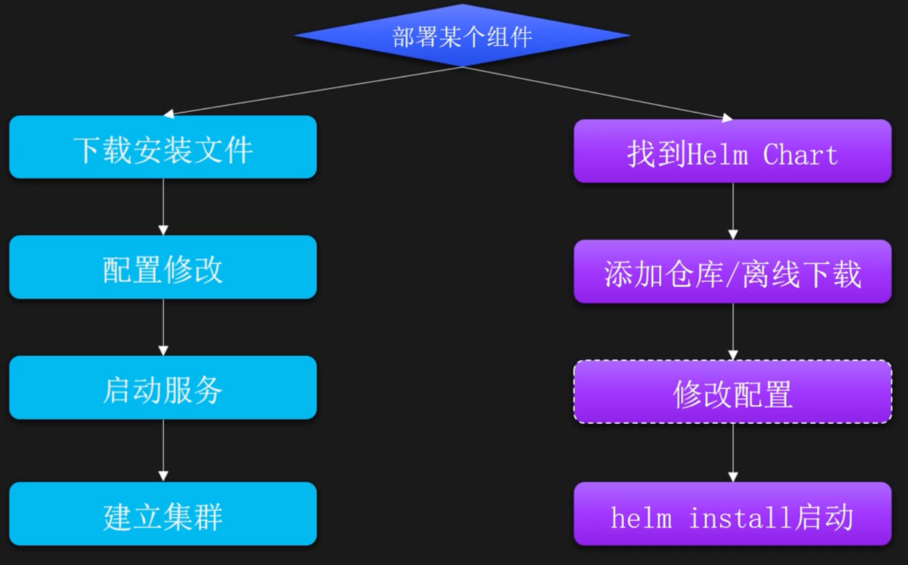
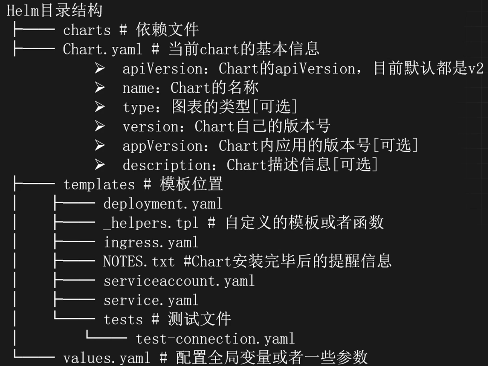

# 工程化管理-Helm

## 什么是Helm

[官网](https://helm.sh/)

Helm是Kubernetes的包管理器，类似于Linux上的apt或yum，可以用包的形式工程化管理和部署复杂的Kubernetes应用程序，比如一键安装zookeeper集群、一键部署整个项目等。

Helm核心概念：

- `Helm`：Helm的管理工具
- `Chart`：Helm的包，是一个包含Kubernetes资源定义的安装文件包
- `Release`：Helm每次部署会产生一个Release，可以用于回滚等
- `Repository`：HelmChart存储库，用于存储和分发Chart

## Helm主要功能

- `资源管理`：HelmChart是一组预定义的YAML文件，描述了Kubernetes应用程序的各个组件配置与模板
- `版本控制`：Helm支持版本控制，可以轻松回滚到之前的版本
- `依赖管理`：Charts可以声明依赖关系，Helm可以自动解析并安装这些依赖
- `模板化`：Charts可以使用Go的模板语言，动态生成资源文件

## Helm 使用步骤



## Helm 常用仓库类型对比

|      |   ChartMuseum | OCI           |
| ---- | ------------- | ------------- |
| 访问方式 | HTTP/HTTPS    | OCI规范         |
| 命令行  | helm repo add | helm registry |

## Helm 使用示例

### 在线方式

ChartMuseum方式

```shell
# 添加Bitnami仓库
helm repo add bitnami https://charts.bitnami. com/bitnami

# 使用Bitnami安装mysql
helm install my-mysql bitnami/mysql --version 12.0.1 

# 更改MySQL镜像
helm install my-mysql bitnami/mysql --version 12.0.1 --set global.imageRegistry=xxx
```

OCI方式

```shell
helm install my-release oci://registry-1.docker.io/bitnamicharts/schema-registry
```

> bitnami：一个非赢利性的开源组织，‌专注于简化开源软件部署的开源项目，提供预配置的应用程序堆栈、容器镜像及‌Helm图表，支持跨平台部署与云原生环境集成。

### 离线方式

ChartMuseum方式

```shell
# 添加Bitnami仓库
helm repo add bitnami https://charts.bitnami.com/bitnami

# 下载安装包
helm pull bitnami/mysql --version 12.0.1

# 解压后安装
helm installmy-mysql ·
```

OCI方式

[官方仓库](https://artifacthub.io/)

```shell
helm pull oci://registry-1.docker.io/bitnamicharts/schema-registry
```

## Helm目录结构



## Helm 安装

[官方安装文档](https://helm.sh/docs/intro/install/)

[Helm安装包](https://github.com/helm/helm/releases)

```shell
$ mkdir helm

$ cd helm 

$ wget https://get.helm.sh/helm-v3.16.2-linux-amd64.tar.gz 

$ ls helm-v3.16.2-linux-amd64.tar.gz

$ tar xf helm-v3.16.2-linux-amd64.tar.gz

$ mv linux-amd64/helm /usr/local/bin/

$ helm version 
version.BuildInfo{Version:"v3.16.2", GitCommit:"13654a52f7c70a143b1dd51416d633e1071faffb", GitTreeState:"clean", GoVersion:"go1.22.7"}
```

## Helm 仓库管理

添加仓库

```shell
# helm repo add [仓库名字] [仓库地址]
$ helm repo add bitnami https://charts.bitnami.com/bitnami
"bitnami" has been added to your repositories
```

添加后仓库的保存位置

```shell
$ cat /root/.config/helm/repositories.yaml
apiVersion: ""
generated: "0001-01-01T00:00:00Z"
repositories:
- caFile: "" 
  certFile: ""
  insecure_skip_tls_verify: false
  keyFile: ""
  name: bitnami
  pass_credentials_all: false
  password: ""
  url: https://charts.bitnami.com/bitnami
  username: ""
```

添加阿里云仓库

```shell
$ helm repo add aliyun https://kubernetes.oss-cnhangzhou.aliyuncs.com/charts
"aliyun" has been added to your repositories
```

添加 Rancher 仓库

```shell
$ helm repo add rancher-mirror https://rancher-mirror.rancher.cn/servercharts/latest
"rancher-mirror" has been added to your repositories
```

查看仓库

```shell
$ helm repo list
NAME             URL 
bitnami          https://charts.bitnami.com/bitnami
aliyun           https://kubernetes.oss-cn-hangzhou.aliyuncs.com/charts
rancher-mirror   https://rancher-mirror.rancher.cn/server-charts/latest
```

删除仓库

```shell
$ helm repo remove rancher-mirror 
"rancher-mirror" has been removed from your repositories 

$ helm repo list
NAME              URL
bitnami           https://charts.bitnami.com/bitnami
aliyun            https://kubernetes.oss-cn-hangzhou.aliyuncs.com/charts
```

更新单个仓库

```shell
$ helm repo update bitnami
Hang tight while we grab the latest from your chart repositories...
...Successfully got an update from the "bitnami" chart repository
Update Complete. ⎈Happy Helming!⎈
```

更新所有仓库

```shell
helm repo update
```

## Helm Chart 管理

搜索 Chart

```shell
$ helm search repo nginx
NAME                  CHART VERSION   APP VERSION     DESCRIPTION
aliyun/nginx-ingress     0.9.5         0.10.2         An nginx Ingress controller that uses ConfigMap... 
aliyun/nginx-lego        0.3.1                        Chart for nginx-ingress-controller and kube-lego
bitnami/nginx            18.2.5        1.27.2         NGINX Open Source is a web server that can be a...
```

搜索某个仓库

```shell
$ helm search repo bitnami/nginx
NAME                   CHART VERSION   APP VERSION      DESCRIPTION
bitnami/nginx            18.2.5           1.27.2        NGINX Open Source is a web server that can be a...
bitnami/nginx-ingress-controller 11.5.4   1.11.3        NGINX Ingress Controller is an Ingress controll...
bitnami/nginx-intel      2.1.15           0.4.9         DEPRECATED NGINX Open Source for Intel is a lig...
```

查看某个 Chart 的版本

```shell
$ helm search repo bitnami/nginx -l
NAME                  CHART VERSION     APP VERSION      DESCRIPTION
bitnami/nginx          18.2.5             1.27.2         NGINX Open Source is a web server that ca n be a...
bitnami/nginx          18.2.4             1.27.2         NGINX Open Source is a web server that ca n be a...
```

下载 Chart

```shell
$ helm pull bitnami/nginx

$ ls 
nginx-18.2.5.tgz
```

下载指定版本的 Chart

```shell
$ helm pull bitnami/nginx --version 18.2.4
```

通过 OCI 下载

```shell
$ helm pull bitnami/mysql

$ helm pull oci://docker.kubeasy.com/bitnamicharts/mysql --version 12.0.1
```

## Helm Release 管理

在线安装 Chart

```shell
$ kubectl create ns helm-test
namespace/helm-test created

$ helm install nginx bitnami/nginx -n helm-test
NAME: nginx
NAMESPACE: helm-test
STATUS: deployed
REVISION: 1
TEST SUITE: None
NOTES: 
CHART NAME: nginx
CHART VERSION: 18.2.5
APP VERSION: 1.27.2
…
```

查看安装的 Release

```shell
$ helm list -n helm-test 
NAME   NAMESPACE  REVISION  UPDATED          STATUS      CHART         APP VERSION
nginx  helm-test     1      2024-11-26xxx   deployed   nginx-18.2.5     1.27.2
```

查看创建的 Pod

```shell
$ kubectl get po -n helm-test
NAME                     READY   STATUS             RESTARTS   AGE
nginx-548f986b76-ffzj6   0/1     Init:ErrImagePull   0         2m
```

安装时修改参数

```shell
$ helm upgrade --install nginx bitnami/nginx -n helm-test --set image.registry=docker.kubeasy.com --set image.repository=bitnami/nginx --set image.pullPolicy=IfNotPresent
```

查看 Release

```shell
$ helm list -n helm-test 
NAME    NAMESPACE   REVISION  UPDATED        STATUS    CHART         APP VERSION
nginx   helm-test     3       2024-11-26xx   deployed  nginx-18.2.5   1.27.2
```

查看创建的 Pod

```shell
$ kubectl get po -n helm-test
NAME                    READY  STATUS    RESTARTS   AGE
nginx-68575c7944-p626p  1/1    Running      0       88s
```

查看 Releases 状态

```shell
$ helm status nginx -n helm-test
```

查看 Release 历史版本

```shell
$ helm history nginx -n helm-test
REVISION  UPDATED   STATUS    CHART          APP VERSION     DESCRIPTION
1           xx    superseded  nginx-18.2.5   1.27.2          Install complete
2           xx    superseded  nginx-18.2.5   1.27.2          Upgrade complete
3           xx     deployed   nginx-18.2.5.  1.27.2          Upgrade complete
```

查看某个版本的状态

```shell
$ helm status nginx -n helm-test --revision 2
```

查看某个 Release 的详细信息，包括值、配置、状态

```shell
$ helm get all nginx -n helm-test
```

查看某个 Release 设置的值

```shell
$ helm get values nginx -n helm-test
USER-SUPPLIED VALUES: 
image: 
  pullPolicy: IfNotPresent
  registry: docker.kubeasy.com
  repository: bitnami/nginx
```

回滚某个 Release

```shell
# 扩容（需要带着之前的值）
$ helm upgrade --install nginx bitnami/nginx -n helm-test --set image.registry=docker.kubeasy.com --set image.repository=bitnami/nginx --set image.pullPolicy=IfNotPresent --set replicaCount=2

# 回滚
$ helm rollback nginx 4 -n helm-test 
Rollback was a success! Happy Helming!
```

离线安装 Release

```shell
$ helm pull bitnami/nginx --version 18.2.4

$ tar xf nginx-18.2.4.tgz 

$ cd nginx

$ helm install nginx . -n helm-test
```

查看 Release

```shell
$ helm list -n helm-test
NAME   NAMESPACE  REVISION  UPDATED      STATUS    CHART APP     VERSION
nginx  helm-test     1      16:23:49.xx  deployed  nginx-18.2.4   1.27.2
```

通过离线的方式安装，一般都是直接更改 values 文件，所以无法使用 `get values` 查看数据

```shell
$ helm get values -n helm-test nginx
USER-SUPPLIED VALUES:
Null
```

查看历史版本

```shell
$ helm history nginx -n helm-test
REVISION   UPDATED   STATUS      CHART        APP VERSION   DESCRIPTION
1          xx       superseded  nginx-18.2.4    1.27.2      Install complete
2          xx       superseded  nginx-18.2.4    1.27.2      Upgrade complete
3          xx       deployed    nginx-18.2.4    1.27.2      Upgrade complete
```

回滚

```shell
$ helm rollback nginx 2 -n helm-test 
Rollback was a success! Happy Helming!
```

卸载

```shell
$ helm delete nginx -n helm-test
```

如果想根据 Chart 导出 Yaml，可以使用 template 字段

```shell
$ helm template nginx . -n helm-test --output-dir yaml
wrote yaml/nginx/templates/networkpolicy.yaml
wrote yaml/nginx/templates/pdb.yaml
wrote yaml/nginx/templates/serviceaccount.yaml
wrote yaml/nginx/templates/tls-secret.yaml
wrote yaml/nginx/templates/svc.yaml
wrote yaml/nginx/templates/deployment.yaml

$ ls yaml/nginx/templates/
deployment.yaml networkpolicy.yaml pdb.yaml serviceaccount.yaml svc.yaml tls-secret.yaml
```

## 常用服务安装

### 安装Redis到K8s中

使用 Helm 安装单节点 Redis，并设置密码

```shell
$ helm upgrade --install redis bitnami/redis -n helm-test --set global.imageRegistry=docker.kubeasy.com --set global.redis.password=123456 - -set architecture=standalone --set master.persistence.enabled=false
```

查看 Pod 状态

```shell
$ kubectl get po -n helm-test 
NAME            READY    STATUS   RESTARTS   AGE
redis-master-0.  1/1     Running     0       2m2s

$ kubectl get svc -n helm-test 
NAME            TYPE       CLUSTER-IP    EXTERNAL-IP   PORT(S)     AGE
redis-headless ClusterIP       None      <None>        6379/TCP    2m4s 
redis-master   ClusterIP  10.96.233.26   <None>        6379/TCP    2m4s
```

登录测试

```shell
$ kubectl exec -ti redis-master-0 -n helm-test -- bash 
I have no name!@redis-master-0:/$ redis-cli -h redis-master

redis-master:6379> auth 123456
OK 
redis-master:6379> set a 1
OK
redis-master:6379> get a "1"
```

### 安装MySQL到K8s中

使用 Helm 安装单节点 MySQL，并设置密码，本次采用离线安装的方式，首先下载 Chart 包

```shell
$ helm pull oci://docker.kubeasy.com/bitnamicharts/mysql --version 12.0.1 
Pulled: docker.kubeasy.com/bitnamicharts/mysql:12.0.1 
Digest: sha256:e05c5e8bb7bcdd3cd5e45fb0436a40dc882a6055e082c0e90d1678b149e01c8f 

$ tar xf mysql-12.0.1.tgz

$ cd mysql
```

更改配置

```shell
# vim values.yaml 
global:
  imageRegistry: "docker.kubeasy.com"
  storageClass: "nfs-csi"
architecture: standalone
auth:
  rootPassword: "123456"
  createDatabase: true
  database: "hello"
```

安装

```shell
$ helm install mysql . -n helm-test 
NAME: mysql

$ kubectl get po -n helm-test 
NAME      READY    STATUS     RESTARTS  AGE 
mysql-0   0/1      Init:0/1      0      25s 

$ kubectl get pvc -n helm-test
NAME          STATUS   VOLUME  CAPACITY   ACCESS MODES   STORAGECLASS  VOLUMEATTRIBUTESCLASS  AGE 
data-mysql-0  Bound    pvc-xx    8Gi        RWO           nfs-csi     <unset>     33s 

$ kubectl get svc -n helm-test
NAME               TYPE      CLUSTER-IP   EXTERNAL-IP  PORT(S)   AGE
mysql            ClusterIP  10.96.242.7  <None>       3306/TCP   38s
mysql-headless   ClusterIP      None     <None>        3306/TCP  38s 

$ kubectl get po -n helm-test
NAME     READY    STATUS    RESTARTS    AGE
mysql-0   1/1     Running     0        3m47s
```

登录测试

```shell
$ kubectl exec -ti mysql-0 -n helm-test -- bash 
Defaulted container "mysql" out of: mysql, preserve-logs-symlinks (init) 

I have no name!@mysql-0:/$ mysql -uroot -hmysql -p 
Enter password:

mysql> show databases;
```

修改配置并更新

```yaml
# vim values.yaml
auth:
  ## @param auth.rootPassword Password for the `root` user. Ignored if existing secret is provided
  ## ref: https://github.com/bitnami/containers/tree/main/bitnami/mysql#setting-theroot-password-on-first-run
  ##
  rootPassword: "molly"
passwordUpdateJob: 
  ## @param passwordUpdateJob.enabled Enable password update job
  ##
  enabled: true
```

更改

```shell
$ helm upgrade mysql -n helm-test .
```

### 安装MySQL主从模式到K8s中

上述的 Chart 也支持部署主从模式的 MySQL，首先修改架构模式为复制模式

```yaml
# vim values.yaml
architecture: replication
# 按需修改复制所用用户的密码
  replicationUser: replicator
  ## @param auth.replicationPassword MySQL replication user password. Ignored if existing secret is provided
  ##
  replicationPassword: "123456"
```

安装

```shell
$ helm install mysql-rep -n helm-test .
NAME: mysql-rep
```

查看安装状态

```shell
$ kubectl get po -n helm-test
NAME READY STATUS RESTARTS AGE
mysql-rep-primary-0 1/1 Running 0 85s
mysql-rep-secondary-0 1/1 Running 0 85s 

$ kubectl get pvc -n helm-test
NAME                       STATUS  VOLUME  CAPACITY  ACCESS MODES    STORAGECLASS VOLUMEATTRIBUTESCLASS AGE
data-mysql-0               Bound  pvc-xx1    8Gi         RWO           nfs-csi 17m
data-mysql-rep-primary-0   Bound  pvc-xx2    8Gi         RWO           nfs-csi 3m14s
data-mysql-rep-secondary-0 Bound  pvc-xx3    8Gi         RWO           nfs-csi 3m14s
```

查看主从状态

```shell
$ kubectl exec -ti mysql-rep-primary-0 -n helm-test – bash

$ mysql -uroot -hmysql-rep-secondary -p
Enter password:
mysql> SHOW REPLICA STATUS\G; 
*************************** 1. row *************************** 
Replica_IO_State: Waiting for source to send event
             Source_Host: mysql-rep-primary
             Source_User: replicator
```

### 安装高可用PostgreSQL到K8s中

下载 PostgreSQL 安装文件

```shell
$ helm pull oci://docker.kubeasy.com/bitnamicharts/postgresql-ha
Pulled: docker.kubeasy.com/bitnamicharts/postgresql-ha:15.0.2
Digest: sha256:a3b74d61f3371483c29095e03ff00db5b07db393a626006d9f0f8a68b626e437
```

配置更改

```yaml
global:
  imageRegistry: "docker.kubeasy.com"
  defaultStorageClass: "nfs-csi "
  storageClass: ""
  postgresql:
    password: "123456"
    repmgrPassword: "123456"
  pgpool:  # pgpool 可以将查询分发到多个 PostgreSQL 节点，实现读写分离
    adminUsername: ""
    adminPassword: "123456"
witness:   # 用于提供额外的投票机制，防止脑裂现象，非必须
  create: true
```

安装 PostgreSQL

```shell
$ helm install pg -n helm-test .
NAME: pgsql-ha
```

查看部署后的资源

```shell
$ kubectl get po -n helm-test
NAME READY STATUS RESTARTS AGE
pg-postgresql-ha-pgpool-84d9985d8c-xf4cw 1/1 Running 0 59s
pg-postgresql-ha-pgpool-84d9985d8c-zdl7t 1/1 Running 0 58s
pg-postgresql-ha-postgresql-0 1/1 Running 0 58s
pg-postgresql-ha-postgresql-1 1/1 Running 0 58s
pg-postgresql-ha-postgresql-2 1/1 Running 0 58s
pg-postgresql-ha-postgresql-witness-0 1/1 Running 1 (28s ago) 58s

$ kubectl get svc -n helm-test
NAME TYPE CLUSTER-IP EXTERNAL-IP PORT(S) AGE
pg-postgresql-ha-pgpool ClusterIP 10.103.160.46 5432/TCP 6m5s
pg-postgresql-ha-postgresql ClusterIP 10.100.3.33 5432/TCP 6m5s
pg-postgresql-ha-postgresql-headless ClusterIP None 5432/TCP 6m5s
pg-postgresql-ha-postgresql-witness ClusterIP None 5432/TCP 6m5s
```

登录测试

```shell
$ kubectl exec -ti pg-postgresql-ha-postgresql-0 -n helm-test -- bash
I have no name!@pg-postgresql-ha-postgresql-0:/$ psql -h pg-postgresqlha-pgpool -U postgres
Password for user postgres:
psql (17.2) Type "help" for help.

postgres=# CREATE DATABASE mydatabase;
CREATE DATABASE
postgres=# \c mydatabase
You are now connected to database "mydatabase" as user "postgres". 
mydatabase=# CREATE TABLE employees ( 
   id SERIAL PRIMARY KEY, 
   name VARCHAR(100), 
   age INT, 
   department VARCHAR(50)
   );
xxx
```

查看集群的状态

```shell
$ /opt/bitnami/scripts/postgresql-repmgr/entrypoint.sh repmgr -f /opt/bitnami/repmgr/conf/repmgr.conf cluster show
```

卸载

```shell
$ helm delete pg -n helm-test 
release "pg" uninstalled
```

## 自定义 Helm Chart

[Chart Template 语法](https://helm.sh/zh/docs/chart_template_guide/getting_started/)

### 使用场景

- 简化应用部署
- 多环境部署
- 快速迭代和回滚
- CI/CD集成
- 项目一键启动

### 创建及模板渲染流程

helm chart创建

```shell
helm create <chart-name>
```

### 常用内置变量

- `Release.Name`：实例的名称，helminstall指定的名字Release.Namespace：应用实例的命名空间
- `Release.IsUpgrade`：如果当前对实例的操作是更新或者回滚，这个变量的值就会被置为true
- `Release.IsInstall`：如果当前对实例的操作是安装，则这边变量被置为true
- `Release.Revision`：此次修订的版本号，从1开始，每次升级回滚都会增加1
- `Chart`：Chart.yaml文件中的内容，可以使用`Chart.Version`表示应用版本，`Chart.Name`表示Chart的名称

### 常用字符串处理函数

- `trim`：去除字符串两边的空格
- `trimAll`：从字符串中移除给定的字符
- `trimPrefix`：从字符串前面移除某个字符
- `trimSuffix`：从字符串后面移除某个字符
- `lower`：转成小写
- `upper`：转成大写
- `title`：首字母大写
- `repeat`：重复字符串
- `nospace`：去除所有的空格
- `contains`：判断是否包含某个值
- `hasPrefix`：判断是否以什么开头
- `hasSuffix`：判断是否以什么结尾
- `quote`：使用双引号括起来字符串
- `squote`：使用单引号括起来字符串
- `cat`：字符串使用空格拼接
- `indent`：以指定的长度缩进
- `nindent`：缩进，并添加新一行
- `replace`：字符串替换
- `substr`：截取字符串，从哪到哪
- `trunc`：截断字符串，从前或从后
- `print`：组合字符串
- `println`：和print效果一样，但会在末尾新添加一行
- `printf`：格式化字符串，`printf"%shas %d dogs." .Name .NumberDogs`

### 常用类型转换函数

- `atoi`：字符串转成整型
- `toString`：转换成字符串
- `toStrings`：转换成字符串列表
- `toYaml`：将列表、切片、数组、字典等，转换成已缩进的yaml块

### 常用逻辑比较函数

- `and`：且，多个条件必须均成立
- `or`：或，多个条件成立一个即可
- `not`：取反
- `eq`：判断是否相等
- `ne`：判断是否不相等
- `lt`：判断是否小于
- `le`：判断是否小于等于
- `gt`：判断是否大于
- `ge`：判断是否大于等于
- `default`：设置默认值
- `empty`：判断是否为空

### 管道符

Helm的管道符用 `|` 表示，可以用于按顺序完成一系列任务。比如：

```yaml
apiVersion: v1
kind: ConfigMap
metadata:
  name: {{ .Release.Name }}-configmap
data:
  myvalue: "Hello World"
  drink: {{ .Values.favorite.drink | repeat 5 | quote }}
  food: {{ .Values.favorite.food | upper | quote }}
```

### 条件语句 if-else

格式

```yaml
{{ if PIPELINE }}
  # Do something
{{ else if OTHER PIPELINE }}
  # Do something else
{{ else }}
  # Default case{{ end }}
```

举例

```yaml
{{ if eq .Values.favorite.drink "coffee" }}
  mug: "true'
{{ end }}

# 特殊用法
# {{-：删除左边的空行
# -}}：删除右边的空行
{{- if eq .Values.favorite.drink "coffee" }}
  mug: "true′
{{- end }}
```

### 循环语句 range

#### 切片形式

格式

```yaml
{{ range xxx }}
  # Do something
{{ end }}
```

举例

```yaml
# 原始yaml
pizzaToppings:
 - mushrooms
 - cheese
 - peppers
 - onions
   
# range语法（其中.是当前值）
toppings: |-
  {{- range .Values.pizzaToppings }}
  - {{ . | title | quote }}
  {{- end }}
  
  
# 结果：
toppings: |-
  - "Mushrooms"
  - "Cheese"
  - "Peppers"
  - "Onions"
```

#### kv形式

```yaml
# 原始yaml
favorite:
  drink: coffee
  food: pizza
  
# range语法
{{- range $key, $val := .Values.favorite }}
  {{ $key }}: {{ $val | quote }}
{{- end }}


# 结果：
favorite: |-
  drink: "coffee"
  food: "pizza"
```

### 更改取值作用域 with

语法

```yaml
{{ with PIPELINE }}
  # restricted scope
{{ end }}
```

示例

```yaml
# 使用之前取值
drink: {{.Values.favorite.drink | default "tea" | quote }}
food: {{.Values.favorite.food | upper | quote }}

# 更改作用域之后
{{- with .Values.favorite }}
drink: {{ .drink 丨 default "tea"| quote }}
food: {{ .food 丨 upper 「 quote }}
{{- end }}
```

>注意：更改作用域之后，如果再取其他作用域的变量，需要指定`$`符，比如 
>       `Release: {{ $.Release.Name }

### 模板定义和使用

`_helpers.tpl` 文件是Helm中一本非常重要的组成部分，通常用来定义可以被其他模板文件复用的辅助函数、片段或变量等。

在Helm中可以将常用的代码片段和逻辑放在`_helpers.tpl`中，用来保持模板的整洁、避免重复，并且更容易管理和维护。

定义模板

```yaml
# _helpers.tpl
{{- define "myapp.fullname" -}}
{{- printf "%s-%s" .Release.Name .Chart.Name | trunc 63 | trimSuffix "-" }}
{{- end }}
```

使用模板

```yaml
# templates/api-deployment.yaml
apiVersion: apps/v1
kind: Deployment
metadata:
  name: {{ include "myapp.fullname". }}-api
```

### 安装说明 NOTES.TXT

`NOTES.TXT`是一个Helm Chart的安装说明文件，在执行`helm install`或`helm upgrade`命令后，Helm会打印出对用户有用的信息，比如使用说明。

NOTES文件同样可以使用template语法进行生成，比如：

```txt
Thank you for installing {{ .Chart.Name }.
Your release is named {{ .Release.Name }}.
To learn more about the release, try:
  $ helm status {{ .Release.Name }}
  $ helm get all {{ .Release.Name }}
```

生成后NOTES :

```txt
Thank you for installing mychart.
Your release is named rude-cardinal.
To learn more about the release, try:
  $ helm status rude-cardinal
  $ helm get all rude-cardinal
```


