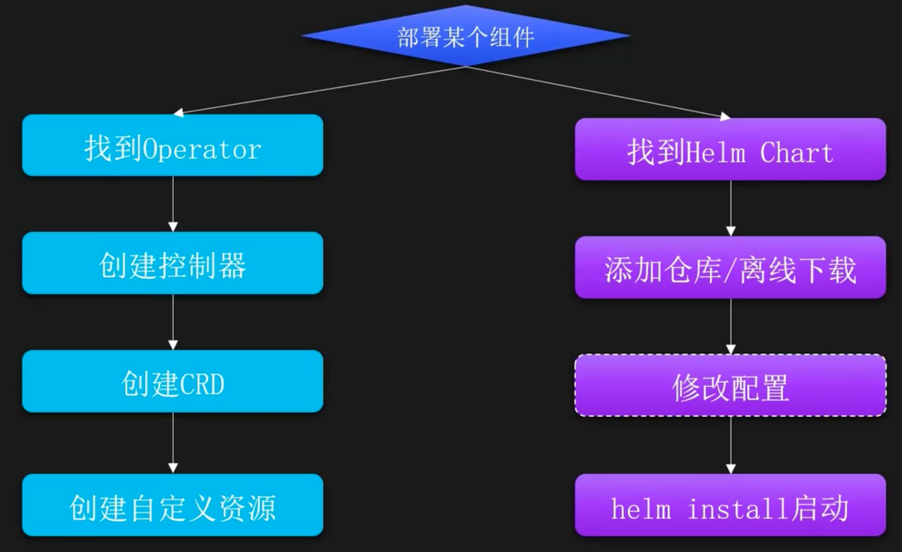
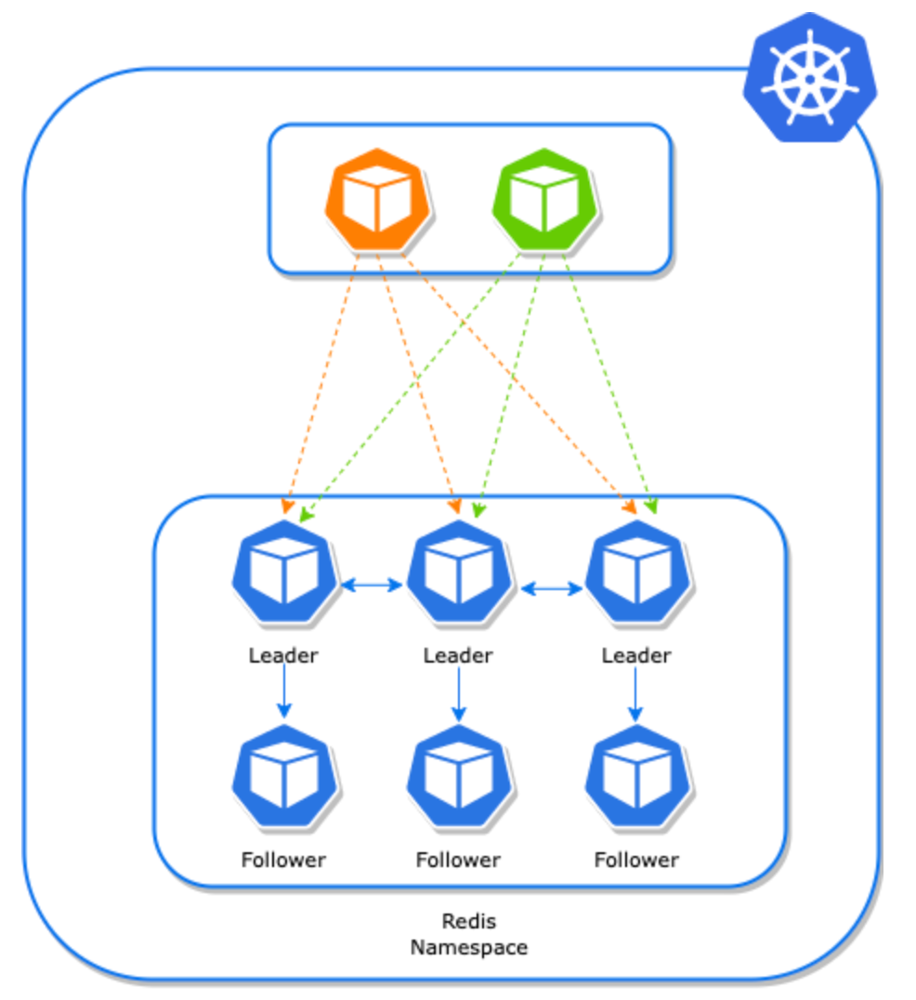
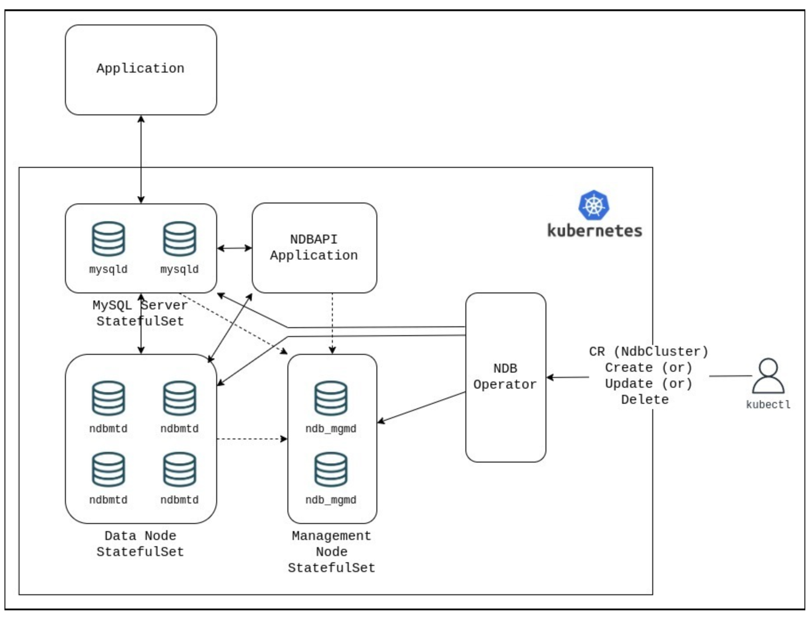

# 扩展能力-Operator

## 什么是Operator

Operator是一种用于扩展KubernetesAPI的自定义控制器，可以实现在原生的资源对象上进行自定义资源类型。通过Operator，也可以将复杂的任务转化为对Kubernetes资源的操作，让应用程序的管理和维护更加简单和规范。

Operator使用场景：

- 简化复杂应用的管理：像管理K8s资源一样管理复杂的系统
- 一致性操作：通过资源定义决定行为，各个环境可以统一配置
- 扩展集群能力：自定义资源类型，扩展集群的调度能力

## Operator组成

`CRD`: Custom Resource Definitions, Operator使用Kubernetes的CRD来定义新的资源类型，新的类型可像核心资源被管理，比如定义一个叫做Database的CRD，可以用于一键启动一个数据库实例。

`Controller`：Operator控制器，该控制器监视自定义资源的状态，并根据用户的配置自动执行相应的操作，比如创建一个数据库，执行一次备份任务等。

## Operator和Helm对比

| Operator                                           | Helm                                |
| -------------------------------------------------- | ----------------------------------- |
| 适合复杂的应用程序（如数据库、消息队列、缓存系统等），除部署外，也需要一些额外任务的应用，比如备份等 | 适合简单的应用程序或微服务，尤其是那些不需要复杂运维任务的应用<br> |
| 开发稍微复杂，需要了解相关开发知识                                  | 开发简单，无需深入了解开发知识                     |

## Operator 使用流程



## Operator安装Redis集群

### 引入

Redis Cluster 是 Redis 的分布式部署模式，可以让多个 Redis 实例以集群的方式运行，从而提供高可用性、水平扩展和数据冗余的能力。Redis Cluster 通过分片（Sharding）和复制 （Replication）技术，确保数据可以在多个节点之间分布，并且在节点故障时能够自动恢复。

[推荐Operator](https://operatorhub.io/operator/redis-operator)

[Operator仓库地址](https://github.com/OT-CONTAINER-KIT/redis-operator)

[官方文档](http://ot-redis-operator.netlify.app/docs/)

Redis集群模式架构


### 安装 Operator 和 CRD

```shell
# 添加 Operator 的 Helm 仓库
helm repo add ot-helm https://ot-container-kit.github.io/helm-charts/

# 安装 Operator 和 CRD
helm install redis-operator ot-helm/redis-operator --namespace otoperators --create-namespace

# 查看创建的 CRD
kubectl get crd | grep redis

# 查看 Pod
kubectl get po -n ot-operators
```

### 安装集群

创建 Redis 集群的资源文件

```yaml
---
apiVersion: redis.redis.opstreelabs.in/v1beta1
kind: RedisCluster
metadata:
  name: redis-cluster
spec:
  clusterSize: 3
  clusterVersion: v7
  securityContext:
    runAsUser: 1000
    fsGroup: 1000
  persistenceEnabled: true
  kubernetesConfig:
    image: registry.cn-beijing.aliyuncs.com/monap/redis:v7.0.15
    imagePullPolicy: IfNotPresent
  storage:
    volumeClaimTemplate:
      spec:
        storageClassName: nfs-csi
        accessModes: ["ReadWriteOnce"]
        resources:
          requests:
            storage: 1Gi
```

创建集群

```shell
kubectl create -f redis-cluster.yaml -n public-service
```

查看 Pod 状态

```shell
kubectl get po -n public-service
```

查看 RedisCluster 状态

```shell
kubectl get rediscluster -n public-service
```

查看 Redis 集群状态

```shell
$ kubectl exec -ti redis-cluster-leader-0 -n public-service -- bash
redis-cluster-leader-0:/data$ ls 
redis-cluster-leader-0:/data$ redis-cli 
# 集群状态查询
127.0.0.1:6379> CLUSTER info 
cluster_state:ok 
cluster_slots_assigned:16384
..
# 集群节点状态查询
127.0.0.1:6379> CLUSTER NODES
..
```

### 设置 Redis 集群密码

使用 Secret 存储 Redis 密码

```yaml
---
apiVersion: v1
kind: Secret
metadata:
name: redis-secret
stringData: 
  password: monap
  type: Opaque
```

创建

```shell
kubectl create -f secret.yaml -n public-service
```

更新 Redis 集群配置

```yaml
...
kubernetesConfig:
  image: registry.cn-beijing.aliyuncs.com/dotbalo/redis:v7.0.15
  imagePullPolicy: IfNotPresent
  redisSecret:
    name: redis-secret
    key: password
...
```

重新创建集群

```shell
kubectl delete -f redis-cluster.yaml -n public-service

kubectl create -f redis-cluster.yaml -n public-service
```

### 在 K8s 外部访问 Redis 集群

如果需要在 K8s 外部访问 Redis 集群（生产环境不推荐），就要把 Redis 集群暴露出去，此时可以把 Service 更改为 NodePort

```yaml
# cat redis-cluster-expose.yaml
---
apiVersion: redis.redis.opstreelabs.in/v1beta1
kind: RedisCluster
metadata:
  name: redis-cluster-expose
spec:
  clusterSize: 3
  clusterVersion: v7
  securityContext:
    runAsUser: 1000
    fsGroup: 1000
  persistenceEnabled: false
  kubernetesConfig:
    service:
      serviceType: NodePort
    image: registry.cn-beijing.aliyuncs.com/dotbalo/redis:v7.0.15
    imagePullPolicy: IfNotPresent
  redisSecret:
    name: redis-secret
    key: password
```

创建集群后，会以 NodePort 的形式为每个 Pod 创建一个 Service

```shell
kubectl get svc -n public-service | grep NodePort
```

此时集群也是通过 NodePort 进行初始化的

### 卸载集群

直接通过 yaml 文件删除即可

```shell
kubectl delete -f redis-cluster-expose.yaml
```

## Operator安装MySQL集群

### 引入

[Operator推荐](https://operatorhub.io/operator/ndb-operator)

[官方文档](https://dev.mysql.com/doc/ndb-operator/8.4/en/)


MySQL NDB Cluster 是一个分布式、高可用的数据库系统，适用于需要高并发读写、低延迟 和高可用性的应用场景。MySQL NDB Cluster 基于 NDB（Network Database）存储引擎，并通过 多个节点协同工作来提供数据的分布存储和故障恢复能力。

MySQL NDB 集群模式架构



### NDB 模式组件介绍

- `管理节点`：Management Node，负责管理和配置整个 NDB Cluster。保存了 NDB 集群 的配置信息，包括 Data Node、SQL Node。管理节点不直接参与数据存储或事务处理， 主要负责集群的管理和监控，确保集群的正常运行。 
- `数据节点`：Data Node，数据节点是集群中实际存储数据的节点，负责存储一部分数据， 并且数据会在多个 Data Node 之间进行分区和复制，以实现高可用性和负载均衡。 
- `SQL 节点`：SQL Node，SQL Node 是用户与 NDB Cluster 交互的主要入口，提供了标准 的 MySQL SQL 接口，允许用户通过 SQL 查询、插入、更新和删除数据。 
- `NDBAPI`：可以直接与 NDB 存储引擎进行交互的接口。

### 安装 Operator 和 CRD

```shell
# 下载部署文件
git clone https://gitee.com/dukuan/mysql-ndb-operator.git

# 创建 Operator
kubectl apply -f deploy/manifests/ndb-operator.yaml

# 查看 Pod（镜像下载比较慢，可以同步镜像至自己的仓库）
kubectl get po -n ndb-operator
```

### 创建 NDB Cluster

创建 NDB Cluster 集群的资源文件

```yaml
# vim ndb-cluster.yaml
apiVersion: mysql.oracle.com/v1
kind: NdbCluster
meta
  name: example-ndb
spec:
  image: registry.cn-beijing.aliyuncs.com/dotbalo/community-cluster:9.1.0
  redundancyLevel: 1 # 指定数据副本的数量，生产环境大于等于 2
  dataNode:
    nodeCount: 1
    pvcSpec:
      storageClassName: nfs-csi
      accessModes: ["ReadWriteOnce"]
      resources:
        requests:
          storage: 10Gi
  mysqlNode:
    nodeCount: 1
    pvcSpec:
      storageClassName: nfs-csi
      accessModes: ["ReadWriteOnce"]
      resources:
        requests:
          storage: 10Gi
```

创建

```shell
# 创建集群
kubectl create ns ndb-cluster
kubectl create -f ndb-cluster.yaml -n ndb-cluster

# 查看集群状态
kubectl get ndbcluster -n ndb-cluster

# 查看 Pod 状态
kubectl get po -n ndb-cluster
```

### 访问测试

集群创建后，会有一些 Service 可以访问到集群内部

```shell
kubectl get svc -n ndb-cluster
```

首先登录到 SQL 节点，然后使用 ndb_mgm 查看集群状态

```shell
$ kubectl exec -ti example-ndb-mysqld-0 -n ndb-cluster -- bash
Defaulted container "mysqld-container" out of: mysqld-container, ndbpod-init-container (init), mysqld-init-container (init) 
bash-5.1$ ndb_mgm -c example-ndb-mgmd
-- NDB Cluster -- Management Client -- 
ndb_mgm> SHOW 
Connected to management server at example-ndb-mgmd port 1186 (using cleartext) 
Cluster Configuration 
---------------------
[ndbd(NDB)] 1 node(s) 
id=2 @172.16.0.59 (mysql-9.1.0 ndb-9.1.0, Nodegroup: 0, *) 

[ndb_mgmd(MGM)] 1 node(s) 
id=1 @172.16.0.156 (mysql-9.1.0 ndb-9.1.0)
```

也可以通过 MySQL 客户端链接集群，首先查看集群的访问密码

```shell
base64 -d <<< $(kubectl -n ndb-cluster get secret example-ndb-mysqldroot-password \ -o jsonpath={.data.password})
```

### 集群外部访问

如果想要在集群外部访问，可以创建一个 SQL Node NodePort 类型的 Service

```yaml
# cat ndbcluster-svc-nodeport.yaml
apiVersion: v1
kind: Service
metadata:
  name: example-ndb-mysqld-nodeport
  namespace: ndb-cluster
spec:
  ports:
    - name: mysqld-service-port-0
      port: 3306
      protocol: TCP
      targetPort: 3306
  selector:
    mysql.oracle.com/node-type: mysqld
    mysql.oracle.com/v1: example-ndb
  sessionAffinity: None
  type: NodePort
```

### 卸载集群

直接删除资源即可

```shell
kubectl delete -f ndb-cluster.yaml -n ndb-cluster
```