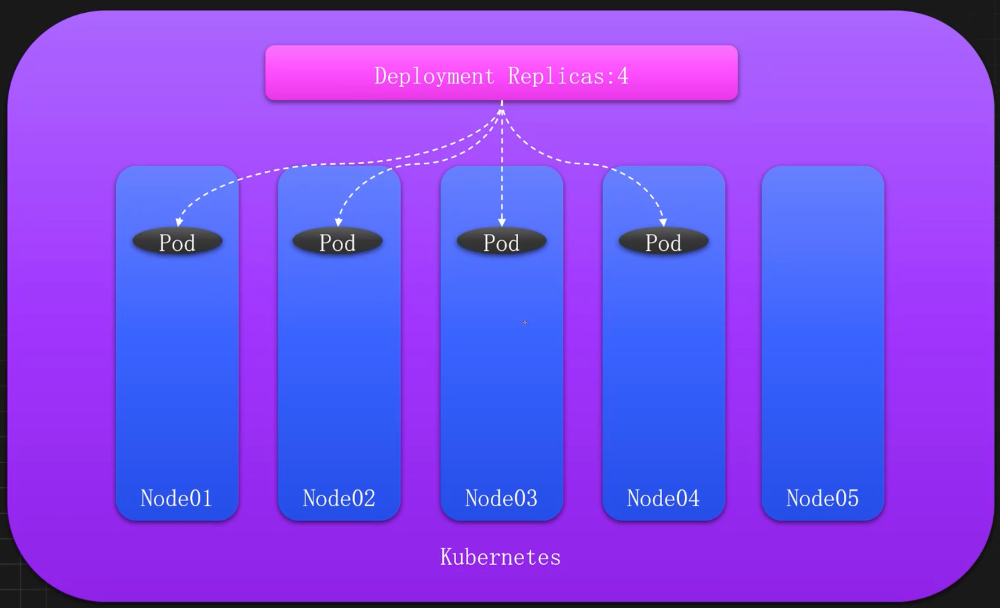
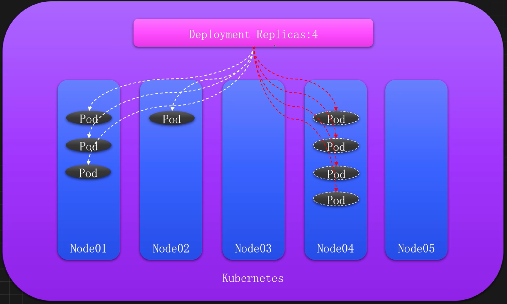
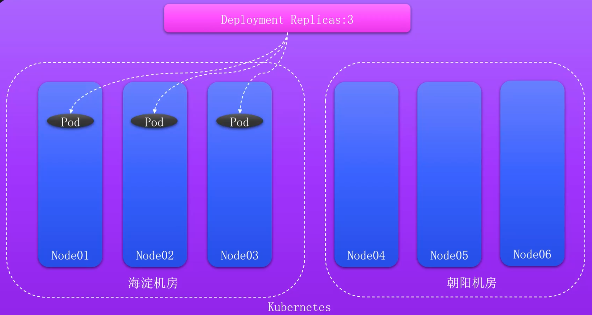
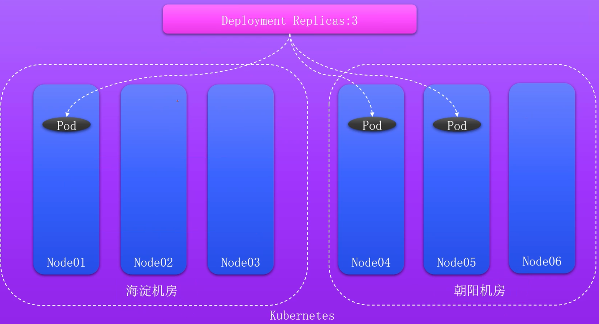
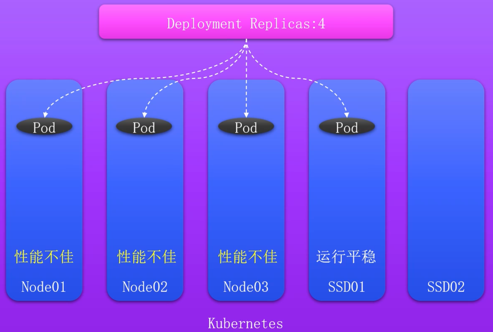
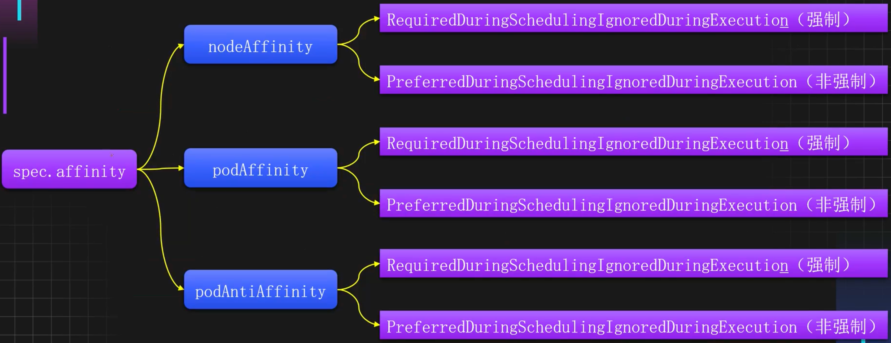
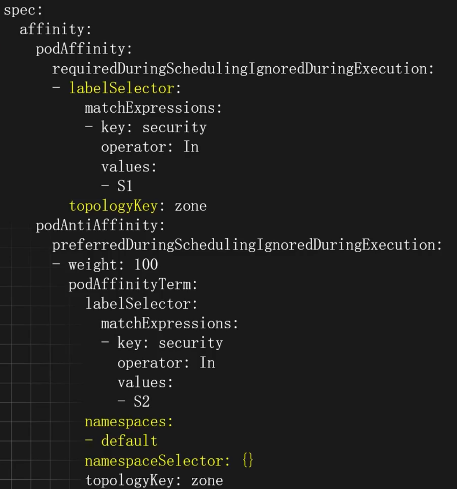
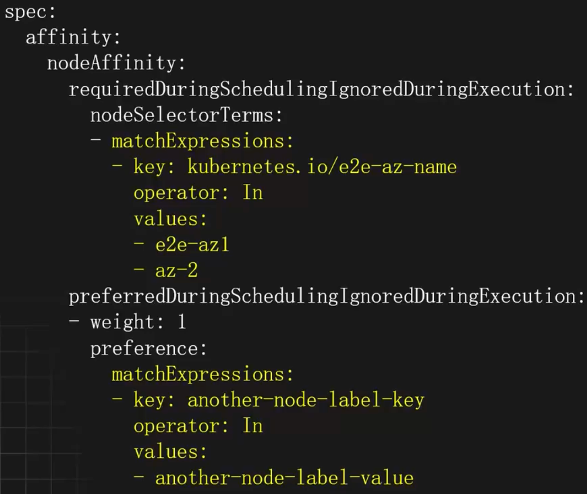

# 提高服务高可用性-亲和力

## 服务高可用性分析

### 节点分配角度

K8s默认调度理想状态



K8s默认调度高风险状态



### 机房分配角度

机房故障引发的问题



如何多机房调度



### 资源分配角度

K8s默认调度节点分配问题



## 使用亲和性提高服务可用性

### 待解决问题

- 某些Pod优先选择有`ssd=true` 标签的节点，如果没有再考虑部署到其它节点
- 某些Pod需要部署在`ssd=true`和`type=physical`的节点上，但是优先部署在`ssd=true`的节点上
- 同一个应用的不同副本或者同一个项目的应用尽量或必须不部署在同一个节点或者符合某个标签的一类节点上或者不同的区域
- 相互依赖的两个Pod尽量或必须部署在同一个节点上或者同一个域内

### 什么是亲和力Affinity

Kubernetes的亲和力 `Affinity` 是一种调度规则，作用于Pod资源，用于控制Pod的调度行为，比如Pod应该或者尽量调度到哪些节点上、Pod不能哪些Pod部署在一起等，从而实现更灵活的资源管理和故障隔离。

Kubernetes的亲和力支持三种类型：节点亲和力 `NodeAffinity`、Pod亲和力 `PodAffinity`、Pod反亲和力 `PodAntiAffinity`。分别用于如下用途：

- 节点亲和力：用于控制Pod和节点之间的关系
- Pod亲和力：用于控制Pod和Pod之间的关系，允许和某些Pod部署在同一个位置
- Pod反亲和力：同样用于控制Pod和Pod之间的关系，不允许和某些Pod部署在同一个位置

同时每种亲和力也分为了强制和非强制调度策略，用于实现调度规则是属于尽量满足还是必须满足。

### 亲和力详细分类



### 亲和力常见使用场景

- 同一个应用不同副本调度到不同的节点，增加服务的高可用性
- 同一个应用不同副本调度到不同的机房，增大容灾能力
- 同一个项目的不同应用尽量分配到不同的位置，增加项目的高可用性
- 特殊应用尽量分配到专用节点，提升应用性能
- 相互依赖的服务，分配到同一个域内

### 拓扑域和拓扑键

在Kubernetes中，拓扑域 `Topology Domain` 通常用于标识一组具有相似属性、相似网络特性的节点，这些节点通常位于同一个物理位置或者某个网络子网中。拓扑域一般用于亲和力配置，用于优化资源分配和提高系统的高可用性等。

在一个超大规模的集群中，可以使用拓扑域用来标记节点所在的机房、子网等信息。拓扑域的划分非常简单，只需要给节点添加一些标签即可，也就是同样的标签（key和value均相同）表示属于同一个拓扑域。

拓扑键（TopologyKey）：用于指定拓扑域，比如指定TopologyKey为 `failure-domain.beta.kubernetes.io/zone`，即表示按照具有该标签的拓扑域作为作用范围。

### 拓扑域划分

在一个超大规模的集群中，可以使用不同的区域和可用区划分拓扑，同时可以精确到数据中心或机房，甚至某个机柜。

比如按照区域划分拓扑域

```shell
kubectl label node k8s-master01 k8s-node01 region=beijing
kubectl label node k8s-node02 region=nanjing
```

同时如果一个区域具备多个数据中心，也可以按照可用区进行再次划分，比如北京区域有两个数据中心位于海淀和朝阳

```shell
kubectl label node k8s-master01 zone=beijing-haidian
kubectl label node k8s-node01 zone=beijing-chaoyang
```

如果需要进一步划分，可以按照不同机房进行划分拓扑域，比如海淀的可用域机器处于不同的机房

```shell
kubectl label node k8s-master01 engineroom=beijing-haidian-c1
```

### Pod亲和力和反亲和力配置示例

- `labelSelector`：Pod选择器配置，可以配置多个，支持key=value（matchLabels）和正则（matchExpressions）两种方式
- `matchExpressions`: 匹配的Pod
- `operator`：配置和节点亲和力一致
	- `In`：相当于key =value的形式
	- `NotIn`：相当于key!= value的形式
	- `Exists`：存在这个Key名的Pod
	- `DoesNotExist`：不存在这个Key名的Pod
- `topologyKey`：匹配的拓扑域的key，也就是节点上label的key，key和value相同的为同一个域，可以用于标注不同的机房和地区
- `namespaces`：和哪些命名空间的Pod进行匹配，为空为当前命名空间
- `namespaceSelector`：使用标签匹配命名空间，为空为当前命空间，如果为表示所有命名空间，支持key-value和正则两方式，写法和上述labelSelector一致



### 节点亲和力配置示例

- `requiredDuringSchedulingIgnoredDuringExecution`: 硬亲和力配置
	- `nodeSelectorTerms`：节点选择器配置，可以配置多个matchExpressions（满足其一），每个matchExpressions下可以配置多个key、value类型的选择器（都需要满足），其中values可以配置多个（满足其一）
- `preferredDuringSchedulingIgnoredDuringExecution`:软亲和力配置
	- `weight`：软亲和力的权重，权重越高优先级越大，范围1-100
	- `preference`：软亲和力配置项，和weight同级，可以配置多个，matchExpressions和硬亲和力一致
- `operator`：标签匹配的方式
	- `In`：相当于key=value的形式NotIn：相当于key !=value的形式
	- `Exists`：节点存在label的key为指定的值即可，不能配置values字段
	- `DoesNotExist`：节点不存在label的key为指定的值即可，不能配置values字段
	- `Gt`：大于value指定的值
	- `Lt`：小于value指定的值



## 亲和力使用案例

#### 同一个应用必须部署在不同宿主机

使用 podAntiAffinity 和 requiredDuringSchedulingIgnoredDuringExecution 可以强制让某个应用和其他应用不处于同一个拓扑域

```yaml
apiVersion: apps/v1
kind: Deployment
metadata:
  name: diff-nodes
  labels:
    app: diff-nodes
spec:
  selector:
    matchLabels:
      app: diff-nodes
  replicas: 2
  template:
    metadata:
      labels:
        app: diff-nodes
    spec:
      affinity:
        podAntiAffinity:
          requiredDuringSchedulingIgnoredDuringExecution:
          - labelSelector:
              matchExpressions:
              - key: app
                operator: In
                values:
                - diff-nodes
            topologyKey: kubernetes.io/hostname
            namespaces: []
      containers:
      - name: diff-nodes
        image: registry.cn-beijing.aliyuncs.com/monap/nginx:1.15.12
        imagePullPolicy: IfNotPresent
```

#### 同一个应用尽量部署在不同宿主机

使用 podAntiAffinity 和 preferredDuringSchedulingIgnoredDuringExecution 可以尽量让某个应用和其他应用不处于同一个拓扑域

```yaml
apiVersion: apps/v1
kind: Deployment
metadata:
  name: diff-nodes
  labels:
    app: diff-nodes
spec:
  selector:
    matchLabels:
      app: diff-nodes
  replicas: 2
  template:
    metadata:
      labels:
        app: diff-nodes
    spec:
      affinity:
        podAntiAffinity:
          preferredDuringSchedulingIgnoredDuringExecution:
          - weight: 100
            podAffinityTerm:
              labelSelector:
                matchExpressions:
                - key: app
                  operator: In
                  values:
                  - diff-nodes
              topologyKey: kubernetes.io/hostname
              namespaces: []
      containers:
      - name: diff-nodes
        image: registry.cn-beijing.aliyuncs.com/monap/nginx:1.15.12
        imagePullPolicy: IfNotPresent
```

#### 同一个应用分布在不同的机房

如果集群处于不同的可用域，可以把应用分布在不同的可用域，以提高服务的高可用性

```yaml
apiVersion: apps/v1
kind: Deployment
metadata:
  name: diff-zone
  labels:
    app: diff-zone
spec:
  selector:
    matchLabels:
      app: diff-zone
  replicas: 3
  template:
    metadata:
      labels:
        app: diff-zone
    spec:
      affinity:
        podAntiAffinity:
          preferredDuringSchedulingIgnoredDuringExecution:
          - weight: 100
            podAffinityTerm:
              labelSelector:
                matchExpressions:
                - key: app
                  operator: In
                  values:
                  - diff-zone
              topologyKey: zone
              namespaces: []
      containers:
      - name: diff-nodes
        image: registry.cn-beijing.aliyuncs.com/monap/nginx:1.15.12
        imagePullPolicy: IfNotPresent
```

#### 应用尽量和缓存服务部署在同一个可用域

如果集群分布在不同的可用域，为了提升基础组件的使用性能，可以把应用程序尽量和缓存服务部署在同一个可用域。 

首先部署一个缓存服务

```shell
kubectl create deploy cache --image=registry.cnbeijing.aliyuncs.com/monap/redis
```

接下来使用亲和力，让应用程序尽量和缓存服务处于同一个可用域

```yaml
apiVersion: apps/v1
kind: Deployment
metadata:
  name: my-app
spec:
  replicas: 2
  selector:
    matchLabels:
      app: my-app
  template:
    metadata:
      labels:
        app: my-app
    spec:
      affinity:
        podAffinity:
          preferredDuringSchedulingIgnoredDuringExecution:
          - weight: 100
            podAffinityTerm:
              labelSelector:
                matchExpressions:
                - key: app
                  operator: In
                  values:
                  - cache
              topologyKey: kubernetes.io/hostname
      containers:
      - name: my-app
        image: registry.cn-beijing.aliyuncs.com/monap/nginx:1.15.12
        imagePullPolicy: IfNotPresent
```

#### 计算服务必须部署至高性能机器

假设集群中有一批机器是高性能机器，而有一些需要密集计算的服务，需要部署至这些机器，以提高计算性能，此时可以使用节点亲和力来控制 Pod 尽量或者必须部署至这些节点上。 

比如计算服务只能部署在 ssd 或 nvme 的节点上

```yaml
apiVersion: apps/v1
kind: Deployment
meta
  name: compute
spec:
  replicas: 2
  selector:
    matchLabels:
      app: compute
  template:
    meta
      labels:
        app: compute
    spec:
      affinity:
        nodeAffinity:
          requiredDuringSchedulingIgnoredDuringExecution:
            nodeSelectorTerms:
            - matchExpressions:
              - key: disktype
                operator: In
                values:
                - ssd
                - nvme
      containers:
      - name: compute
        image: registry.cn-beijing.aliyuncs.com/monap/nginx:1.15.12
        imagePullPolicy: IfNotPresent
```

#### 计算服务尽量部署至高性能机器

如果不强制要求，可以让计算服务尽量部署至高性能机器

```yaml
affinity:
  nodeAffinity:
    preferredDuringSchedulingIgnoredDuringExecution:
    - weight: 100
      preference:
        matchExpressions:
        - key: disktype
          operator: In
          values:
          - ssd
          - nvme
```

同时还可以配置优先使用 ssd 的机器

```yaml
affinity:
  nodeAffinity:
    preferredDuringSchedulingIgnoredDuringExecution:
    - weight: 100
      preference:
        matchExpressions:
        - key: disktype
          operator: In
          values:
          - ssd
    - weight: 50
      preference:
        matchExpressions:
        - key: disktype
          operator: In
          values:
          - nvme
```

#### 应用尽量不部署至低性能机器

假如已知集群中有一些机器可能性能不佳或者其他因素的影响，需要控制某个服务尽量不部署至这些机器，此时只需要把 operator 改为 NotIn 即可

```yaml
apiVersion: apps/v1
kind: Deployment
metadata:
  name: compute-intensive-app
spec:
  replicas: 3
  selector:
    matchLabels:
      app: compute-intensive
  template:
    metadata:
      labels:
        app: compute-intensive
    spec:
      affinity:
        nodeAffinity:
          preferredDuringSchedulingIgnoredDuringExecution:
          - weight: 100
            preference:
              matchExpressions:
              - key: performance
                operator: NotIn
                values:
                - low
      containers:
      - name: compute-intensive
        image: registry.cn-beijing.aliyuncs.com/monap/nginx:1.15.12
        imagePullPolicy: IfNotPresent
```

#### 应用均匀分布在不同的机房

Kubernetes 的 topologySpreadConstraints（拓扑域约束） 是一种高级的调度策略，用于确保工作负载的副本在集群中的不同拓扑域（如节点、可用区、区域等）之间均匀分布。

- `topologySpreadConstraints`：拓扑域约束配置，可以是多个副本均匀分布在不同的域中， 配置多个时，需要全部满足
- `maxSkew`：指定允许的最大偏差。例如，如果 maxSkew 设置为 1，那么在任何拓扑域 中，副本的数量最多只能相差 1
- `whenUnsatisfiable`：指定当无法满足拓扑约束时的行为
	- `DoNotSchedule`：不允许调度新的 Pod，直到满足约束
	- `ScheduleAnyway`：即使不满足约束，也允许调度新的 Pod
- `topologyKey`：指定拓扑域的键
- `labelSelector`：指定要应用拓扑约束的 Pod 的标签选择器，通常配置为当前 Pod 的标 签

```yaml
apiVersion: apps/v1
kind: Deployment
metadata:
  name: example-deployment
spec:
  replicas: 3
  selector:
    matchLabels:
      app: example
  template:
    metadata:
      labels:
        app: example
    spec:
      topologySpreadConstraints:
      - maxSkew: 1
        whenUnsatisfiable: DoNotSchedule
        topologyKey: kubernetes.io/hostname
        labelSelector:
          matchLabels:
            app: example
      containers:
      - name: example
        image: registry.cn-beijing.aliyuncs.com/monap/nginx:1.15.12
```

