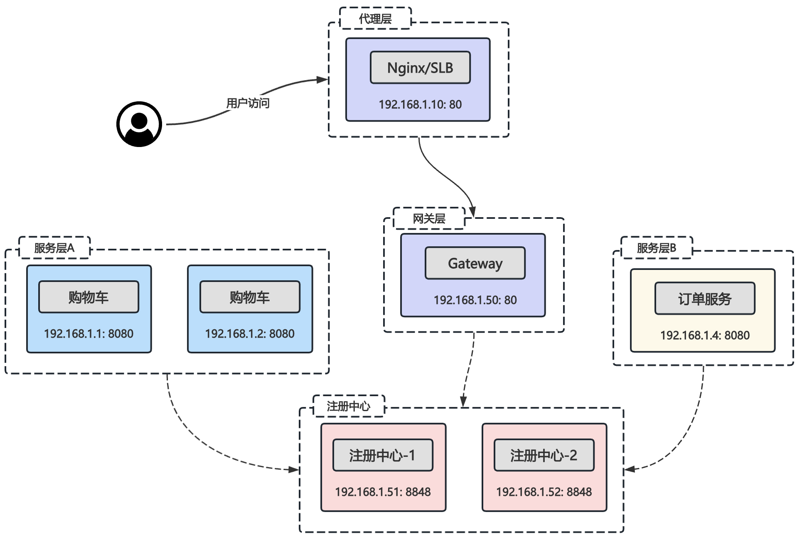
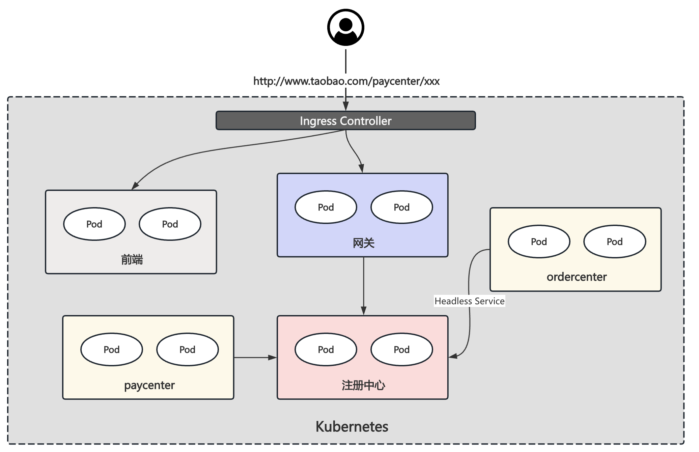
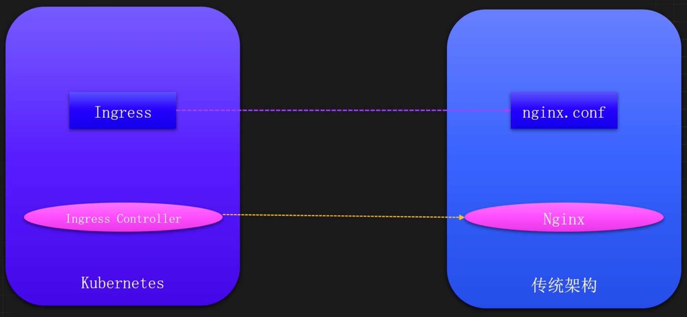
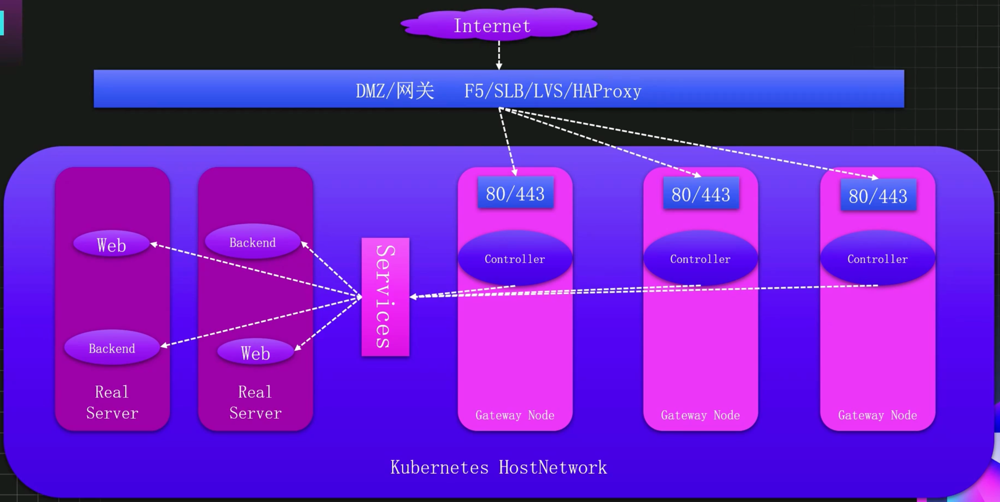

# 服务发布

## K8S 如何发布服务

### 传统架构服务发布方式

#### 无注册中心


#### 有注册中心



### K8S 服务发布方式

#### 无注册中心


#### 有注册中心


## Service 东西流量管理

### 前置-Label与Selector

#### 概念

**Label**

K8s任何资源都有标签的概念，用于给同类的资源进行分组。比如一个集群有很多个节点，可以根据不同的地域、网段、节点类型进行分组，方便管理。

**Selector**

Selector（标签选择器）可以通过同一类资源的不同标签进行精确的查询数据。比如想要查询某个命名空间下所有具有app=payment标签的Pod，可以使用Selector进行过滤。


#### Label 使用

添加标签

```shell
# 命令格式
kubectl label 资源类型 [资源名称] [资源名称] key=value

# 指定单个资源添加标签
kubectl label deploy nginx version=v1

# 查看标签
kubectl get deploy nginx --show-labels

# 指定多个资源添加标签
kubectl label deploy --all svc=true

# 根据已有标签过滤之后再添加标签
kubectl label deploy -l app=nginx svc2=true

# 同时添加多个标签
kubectl label deploy -l app=nginx a=b c=d
```

修改标签

```shell
# 已经存在的标签名，不允许直接进行修改
kubectl label deploy -l app=nginx version=v2
=> error: 'version' already has a value (v1), and --overwrite is false

# 如需修改，可以使用--overwrite 参数
kubectl label deploy -l app=nginx version=v2 --overwrite
```

删除标签

```shell
# 删除 Key 为 version 的标签
kubectl label deploy nginx version-

# 查看是否删除 
kubectl get deploy nginx --show-labels
```

#### Selector 使用

```shell
# 首先使用--show-labels 查看指定资源目前已有的 Label
kubectl get deploy --show-labels

# 查询 app 为 nginx 的 Deployment
kubectl get deploy -l app=nginx

# 查询 app 为 nginx 或 backend 的 Deployment
kubectl get deploy -l 'app in (nginx, backend)' --show-labels

# 查询 app 为 nginx 或 backend 但不包括 version=v1 的 Deployment
kubectl get deploy -l 'app in (nginx, backend)' -l version!=v1 -- show-labels

# 查询 label 的 key 名为 app 的 Deployment
kubectl get deploy -l app --show-labels

# 查询所有空间下的资源
kubectl get deploy -l 'app in (nginx, kube-dns)' --show-labels -A
```

### 引入

#### 什么是Service

Service是K8s开箱即用的一个用于提供负载均衡、服务发现等能力的资源。

Service为Pod提供了一个抽象层，将一组具有相同功能的Pod抽象为一个逻辑上的服务。无论匹配的Pod如何变化，比如重启、迁移、扩缩容等，Service都能保持一个稳定的访问接口，从而让我们无需关心服务所在的具体位置、IP等细节。

主要功能：

- 服务之间的服务发现
- 代理一个或一组Pod
- 代理IP或域名 


#### 什么是Endpoints

Endpoints可以理解为Service的一部分，主要用于记录Service对应的所有Pod的IP地址和端口信息。Service通过Endpoints来找到并访问后端的Pod。

Endpoints资源记录了Pod的IP地址和端口列表，当后端Pod产生变化时，K8s的控制器会自动更新Endpoints里面的配置信息，从而保证Service能够正确的路由到关联且正常运行的Pod中。

只有当Service名称和端口信息与Endpoints一样时，Service和Endpoints才会自动建立关联。

```yaml
apiVersion: v1
kind: Endpoints
metadata:
  name: nginx
  namespace: default
subsets:
- addresses:
  - ip: 172.16.85.211
    nodeName: k8s-node01
    targetRef:
      kind: Pod
      name: nginx-746c6f4d7-2swfnn
      amespace: default
  ports:
  - name: http-web
    port: 80
    protocol: TCP
```

### Service 创建

创建 Service 可以使用 expose 命令和通过 yaml 文件创建。

通过 expose

```shell
kubectl expose deploy nginx --port 80
```

通过 yaml 文件创建 Service

```yaml
kind: Service
apiVersion: v1 
metadata: 
  name: my-service
spec:
  selector:
    app: nginx
  ports:
  - protocol: TCP
    port: 80
    targetPort: 80
```

通过yaml创建一个比较完整的Service

```shell
apiVersion: v1
kind: Service
metadata:
  labels:
    k8s-app: kube-dns
    kubernetes.io/cluster-service: "true"
    kubernetes.io/name: CoreDNS
  name: kubernetes
  namespace: kube-system
spec:
  clusterIP: 10.96.0.10          # Service 的 IP，不需要手动指定
  ports:                         # Service 端口配置
    - name: dns                  # Service 端口名字
      port: 53                   # Service 端口
      protocol: UDP              # 代理协议
      targetPort: 53             # 目标端口，程序端口
    - name: dns-tcp
      port: 53 protocol: TCP
      targetPort: 53
  selector:                      # 代理到哪些Pod
    k8s-app: kube-dns
  sessionAffinity: None          # 会话保持配置
  type: ClusterIP                # Service 类型
```

Service 支持将一个接收端口映射到任意的 targetPort，如果 targetPort 为空，targetPort 将被设置为与 Port 字段相同的值。targetPort 可以设置为一个字符串，引用 Pod 的一个端口的名 称，这样的话即使更改了 Pod 的端口，也不会对 Service 的访问造成影响。

Kubernetes Service 能够支持 TCP、UDP、SCTP 等协议，默认为 TCP 协议

> 流控制传输协议（SCTP，Stream Control Transmission Protocol）是一种在网络连 接两端之间同时传输多个数据流的协议。SCTP 提供的服务与 UDP 和 TCP 类似。

### Service 的类型

Kubernetes Service 主要包括以下几种类型

- `ClusterIP`：在集群内部使用，默认值，只能从集群中访问
- `NodePort`：在所有安装了 Kube-Proxy 的节点上打开一个端口，此端口可以代理至后端Pod，可以通过 NodePort 从集群外部访问集群内的服务，访问格式为 NodeIP:NodePort
- `LoadBalancer`：使用云提供商的负载均衡器公开服务，成本较高
- `ExternalName`：通过返回定义的 CNAME 别名，没有设置任何类型的代理，需要 1.7 或更高版本kube-dns 支持

#### NodePort 类型

如果将 Service 的 type 字段设置为 NodePort，则 Kubernetes 将从 ApiServer `--service-node-port-range` 参数指定的范围（默认为 30000-32767）中自动分配端口，也可以手动指定 NodePort，创建该 Service后，集群每个节点都将暴露一个端口，通过某个宿主机的 IP+端口即可访问到后端的应用。

定义一个 NodePort 类型的 Service 格式如下：

```yaml
apiVersion: v1
kind: Service
metadata:
  name: nginx-svc
spec:
  selector:
    app: nginx-pod
  type: NodePort
  ports:
    - protocol: TCP
      port: 80
      targetPort: 80
      nodePort: 30000
```

> `--service-node-port-range` 参数位置：
> 1️⃣ 二进制安装： /usr/lib/systemd/system/kube-apiserver.service
> 2️⃣ kubeadm安装： /etc/kubernetes/manifests/kube-apiserver

K8s为什么把NodePort端口范围设置为`30000~32767`？

IANA（互联网数字分配机构）管理的划分范围如下：

- 0 - 1023 为知名端口 (Well-Known Ports)，这些端口用于最核心、最广泛使用的网络服务和应用。它们被严格地、永久地分配给固定的协议，比如22/TCP SSH 协议端口。
- 1024 - 49151 为注册端口 (Registered Ports)，这些端口分配给不那么“核心”但依然很常见的应用程序或服务。公司或个人可以向IANA注册一个端口，以供其特定软件使用。比如 6379/TCP Redis 内存数据库端口。
- 49152 - 65535 为动态/私有端口 (Dynamic/Private Ports)，这个范围不固定分配给任何服务。它们的主要用途是作为客户端端口或临时端口。

从端口分配标准来看，30000-32767这个范围位于"注册端口"(registered ports)部分内，而不会侵占动态/私有端口范围(49152-65535)。 这样设计符合IETF的端口分配规范。同时也避免了与系统保留端口冲突，特别是知名端口(0~1023)。

#### ExternalName 类型-代理域名

ExternalName Service 是 Service 的特例，它没有 Selector，也没有定义任何端口和 Endpoint，它通过返回该外部服务的别名来提供服务。和域名解析的 CNAME 类似。

比如可以定义一个 Service，后端设置为一个外部域名，这样通过 Service 的名称即可访问到该域名。在某个Pod容器内使用 nslookup 解析一下文件定义的 Service，K8s集群的 DNS 服务将返回一个值为 `www.taobao.com` 的 CNAME 记录。

```yaml
kind: Service
apiVersion: v1
metadata:
  name: my-service
  namespace: prod
spec:
  type: ExternalName
  externalName: www.taobao.com
```

为什么要使用ExternalName？案例如下：

假设某个项目具备 DEV/UAT 两个环境，每个环境需要链接指定的数据库等基础组件。基础组件同样也是在 K8s 中按照不同的环境进行划分和部署，比如 DEV 环境所用的基础组件均在 basic-component-dev 命名空间下，以此类推。 为了降低配置文件的维护复杂度，准备使用 ExternalName 类型的Service 对基础组件的连接地址进行映射，这样就可以用同名的 Service 区分不同的环境，从而降低配置文件维护的复杂度。比如配置了在同一个项目的不同环境里面都配置一个同名的 Redis Service，类型为 ExternalName，并且按照不同环境指向不同的基础组件地址，这样每个项目的不同环境，都可以用 Redis 这一个地址就可以访问到不同基础组件。

```shell
## 环境准备
# 创建 Namespace
kubectl create ns basic-component-dev
kubectl create ns basic-component-uat
# 创建服务
kubectl create deploy redis -n basic-component-dev -- image=registry.cn-beijing.aliyuncs.com/monap/redis:7.2.5
kubectl create deploy redis -n basic-component-uat -- image=registry.cn-beijing.aliyuncs.com/monap/redis:7.2.5
# 创建 Service
kubectl expose deploy redis --port 6379 -n basic-component-dev
kubectl expose deploy redis --port 6379 -n basic-component-uat

## 访问测试
# 创建一个专门用于测试的 Redis 客户端
kubectl create deploy redis-cli --image=registry.cnbeijing.aliyuncs.com/monap/redis:7.2.5
# 测试每个环境的 Redis 基础组件
kubectl exec -ti redis-cli-57cc5fd584-hvxzq -- bash
# a
redis-cli -h redis.basiccomponent-dev
redis.basic-component-dev:6379> set a dev
# b
redis-cli -h redis.basiccomponent-uat
redis.basic-component-dev:6379> set a uat

## 创建项目的两个环境
kubectl create ns projecta-dev
kubectl create ns projecta-uat
# 在每个项目的环境下，创建一个 externalName 类型的 Service，用于连接到不同环境的基础组件：
# a
kind: Service
apiVersion: v1
metadata:
  name: redis
  namespace: projecta-dev
spec:
  type: ExternalName
  externalName: redis.basic-component-dev.svc.cluster.local 
# b
kind: Service
apiVersion: v1
metadata:
  name: redis
  namespace: projecta-uat
spec:
  type: ExternalName
  externalName: redis.basic-component-uat.svc.cluster.local
# 接下来在每个项目的环境下，创建两个 Redis 客户端，用于模拟需要链接 Redis 的应用程序
kubectl create deploy usercenter --image=registry.cnbeijing.aliyuncs.com/monap/redis:7.2.5 -n projecta-dev
kubectl create deploy usercenter --image=registry.cnbeijing.aliyuncs.com/monap/redis:7.2.5 -n projecta-uat
# 测试每个环境下的 externalName
# 开发环境
kubectl exec -ti usercenter-6685654cc4-pc6m9 -n projecta-dev -- bash
redis-cli -h redis
redis:6379> get a
"dev"
# UAT 环境
kubectl exec -ti usercenter-6685654cc4-m9wrb -n projecta-uat -- bash
redis-cli -h redis
redis:6379> get a
"uat"
```

###  Service 代理 K8S 外部服务

使用场景：

- 希望在生产环境中使用某个固定的名称而非 IP 地址访问外部的中间件服务
- 希望 Service 指向另一个 Namespace 中或其他集群中的服务
- 正在将工作负载转移到 Kubernetes 集群，但是一部分服务仍运行在 Kubernetes 集群 之外的 backend。

如下 Service 不配置 Selector，而是手动创建一个与Service 标签一致（否则无法关联）的 Endpoints 用于指定外部服务地址

> 注意： service配置selector后，`Endpoint Controller` 才会自动创建对应的 Endpoints 对象，否则不会生成 Endpoints 对象

```yaml
# cat nginx-svc-external.yaml 
apiVersion: v1
kind: Service
metadata:
  name: nginx-svc-external
  labels:
    app: nginx-svc-external
spec:
  type: ClusterIP
  ports:
  - name: http
    port: 80 
    protocol: TCP
    targetPort: 80
  sessionAffinity: None
---
# cat nginx-ep-external.yaml 
apiVersion: v1
kind: Endpoints
metadata:
  name: nginx-svc-external
  labels:
    app: nginx-svc-external
subsets:
- addresses:
  - ip: 140.205.94.189 
  ports:          # endpoints 中 ports 下的配置要与 service 一致
  - name: http
    port: 80
    protocol: TCP
```

> 注意：Endpoint IP 地址不能是 loopback（127.0.0.0/8）、link-local（169.254.0.0/16）或者 link-local 多播地址（224.0.0.0/24）

访问没有 Selector 的 Service 与有 Selector 的 Service 的原理相同，通过 Service 名称即可访问，请求将被路由到用户自定义的 Endpoints。

### 多端口 Service

有的程序可能会监听多个端口，Service 也支持同时代理多个端口。比如在 K8s 中部署一个RabbitMQ，它具有两个端口，5672 是程序连接用于数据交互的接口，15672 是 RabbitMQ 管理页面的端口。

```shell
# 首先在 K8s 上部署一个 RabbitMQ
kubectl create deploy rabbitmq --image=registry.cnbeijing.aliyuncs.com/monap/rabbitmq:3-management

# 接下来可以创建一个 Service，把 5672 指向 Pod 的 5672,15672 指向 15672
kind: Service
apiVersion: v1
metadata:
  name: rabbitmq
spec:
  selector:
    app: rabbitmq
  ports:
  - name: http
    protocol: TCP
    port: 15672
    targetPort: 15672
  - name: amqp
    protocol: TCP
    port: 5672
    targetPort: 5672
```

### 会话保持

K8s 的 Service 支持会话保持，但是目前仅支持基于客户端 IP 的会话保持。

注意：Service的会话保持功能基于客户端IP模式在对k8s集群外的连接做会话保持可能会有问题。K8s获取到的ClientIP可能并非真实的客户端IP地址，对k8s集群外的连接如果要做会话保持应该在Ingress处设置。

```yaml
kind: Service
apiVersion: v1
metadata:
  name: nginx
spec:
  selector:
    app: nginx
  ports:
  - protocol: TCP
    port: 80
    targetPort: 80 
    sessionAffinity: ClientIP  # ClientIP：配置基于 客户端IP 的会话保持，None：不开启会话保持 
    sessionAffinityConfig:     # 会话保持配置
      clientIP:
        # 10800 为默认值
        timeoutSeconds: 10800  # 在10800s内某个客户端IP只会路由到service代理的某个副本，而非轮训
```

### Headless Service

#### 理解

`Headless Service` 是 Kubernetes 中一种特殊类型的 Service，它会直接暴露 Pod 的 IP 地址和 DNS记录给客户端，适用于有状态应用的服务发现和负载均衡以及需要直接访问 Pod IP 的应用场景。

Headless Service 不需要分配 ClusterIP，而是通过 DNS 记录直接返回 Pod 的 IP 地址，所以和普通 Service 最大的区别就是使用 `nslookup` 解析一个 `Headless Service` 返回的是 Pod IP， 而普通Service 返回的是 Service 的 IP。

#### 使用场景

- 有状态应用的服务发现和负载均衡：有状态应用（如数据库、消息队列等）通常需要为 每个 Pod 分配一个唯一的标识符（如 Pod 名称或 IP 地址），以便其他服务或其他节点 可以连接到某个实例。`Headless Service` 可以满足这一需求，通过直接暴露 Pod 的 IP 地 址和 DNS 记录，实现服务发现和负载均衡。 
- 需要直接访问 Pod IP 的应用：在某些情况下，客户端可能需要直接访问 Pod 的 IP 地 址，而不需要通过 Service 的负载均衡机制，此时也可以通过 `Headless Service` 实现。
- 分布式系统：在分布式系统中，各个节点之间需要直接通信，并且每个节点都有自己的 身份和状态。`Headless Service` 可以为每个节点分配一个唯一的 DNS 实体名称，支持节 点之间的直接交互和负载均衡

#### 工作原理

当创建一个 Headless Service 时，Kubernetes 会执行以下操作： 

- 创建 DNS 记录：为每个 Pod 创建一个 DNS 记录，该记录的名称基于 Service 名称、Pod 名称和命名空间定义，格式为 `...svc.cluster.local`。
- 暴露 Pod IP：客户端可以通过查询 DNS 记录获取 Pod 的 IP 地址，并直接访问某个 Pod。 比如创建一个名为 `my-headless-service` 的 `Headless Service`，这个 Service 匹配了 `app=myapp` 标签的 Pod，该服务具有三个副本，每个副本的名字是 pod-0、pod-1 和 pod-2。此时可以通过如下 DNS 名字进行访问：
	- `pod-0.my-headless-service.default.svc.cluster.local`
	- `pod-1.my-headless-service.default.svc.cluster.local`
	- `pod-2.my-headless-service.default.svc.cluster.local`

#### 使用

创建一个 StatefulSet 和 Headless Service

```yaml
apiVersion: v1
kind: Service
metadata:
  name: nginx
  labels:
    app: nginx
spec:
  ports:
  - port: 80
    name: web
  clusterIP: None
  selector:
    app: nginx
---
apiVersion: apps/v1
kind: StatefulSet 
metadata:
  name: web
spec:
  serviceName: "nginx"
  replicas: 2
  selector:
    matchLabels:
      app: nginx
  template:
    metadata:
      labels:
        app: nginx
    spec:
      containers:
      - name: nginx
        image: registry.cn-beijing.aliyuncs.com/dotbalo/nginx:stable
        ports: 
        - containerPort: 80
          name: web
```

### Service 代理模式

#### Iptables 代理模式

##### 理解

Iptables 是 Linux 原生提供的一个功能强大的防火墙工具，可以用来设置、维护和检查 IPv4 数据包，并且支持源目地址转换等规则。在 iptables 代理模式下，kube-proxy 通过监听 Kubernetes API Server 中 Service 和 Endpoint 对象的变化，动态地更新节点上的 iptables 规则，以实现请求的转发。

##### 工作流程

1. 当 Service 被创建或更新时，`kube-proxy` 会读取 Service 和 Endpoint 对象的信息，并生成相 应的 iptables 规则
2. 这些 iptables 规则被添加到内核的 netfilter 处理链中，以拦截和转发目标为 `Service IP` 地址 的流量
3. 当客户端访问 Service 的 IP 地址时，iptables 规则会将流量随机重定向到后端的一个或多个 Pod

##### 优点与缺点

优点：iptables 是 Linux 内核的一部分，性能稳定、可靠，iptables 规则易于理解和维护，功能多。 

缺点：随着 Service 数量的增加，iptables 规则的数量也会急剧增加，进而导致性能下降。iptables 的更新操作可能会暂时锁定整个 iptables 规则表，影响网络性能。

#### IPVS 代理模式

##### 理解

IPVS（IP Virtual Server）是一种基于内核的负载均衡器，提供了比 iptables 更高的转发性能。 在 IPVS 代理模式下，kube-proxy 通过配置 IPVS 负载均衡器规则来代替使用 iptables。IPVS 使用更高效的数据结构（如 Hash 表）来存储和查找规则，可以在大量 Service 的情况下也能保持高性能。

##### 工作流程

1. 当 Service 被创建或更新时，kube-proxy 会读取 Service 和 Endpoint 对象的信息，并配置 IPVS 负载均衡策略
2. IPVS 负载均衡器会根据配置的调度算法（如轮询、最少连接等）将请求转发到后端的一个 或多个 Pod 上
3. 当客户端访问 Service 的 IP 地址时，请求会直接被 IPVS 处理并转发到后端 Pod

##### 优点与缺点

优点：IPVS 专为负载均衡设计，性能优于 iptables。并且支持多种调度算法，可以根据实际需求选择合适的算法，同时 IPVS 的更新操作对性能的影响较小

缺点：在某些情况下，IPVS 可能需要依赖 iptables 来实现一些额外的功能（如源地址 NAT）

##### IPVS 负载均衡算法

- 轮询：`rr`，按顺序轮流将请求转发到后端的各个 Pod 上，实现请求的均匀分配
- 最少链接：`lc`，将新的请求转发到当前连接数最少的 Pod 上，以平衡各 Pod 的负载
- 源地址哈希：sh，根据请求的源 IP 地址进行哈希计算，将相同源地址的请求转发到同 一个 Pod 上，实现会话保持
- 目的地址哈希：`dh`，根据请求的目的 IP 地址（即 Service 的 Cluster IP）和端口进行哈希计算，选择后端 Pod
- 无需队列等待：`nq`，如果后端 Pod 的队列为空，则直接选择该 Pod；如果所有 Pod 的 队列都非空，则采用其他策略（如轮询或最少连接）来选择 Pod
- 最短期望延迟：`sed`，考虑 Pod 的当前连接数和连接请求的平均处理时间，选择预计处 理时间最短的 Pod 来接收新请求

#### 更改Service代理模式

```shell
# 查看当前的代理模式
curl 127.0.0.1:10249/proxyMode

# 更改 proxy 的代理模式为 ipvs（二进制安装方式配置文件在每个机器上）
kubectl edit cm kube-proxy -n kube-system
# 将 mode 改为 "ipvs"

# 重启 kube-proxy 生效（二进制安装方式使用 systemctl restart kube-proxy）
kubectl patch daemonset kube-proxy -p "{\"spec\":{\"template\":{\"metadata\":{\"annotations\":{\"date\":\"`date +'%s'`\"}}}}}" -n kube-system

# 再次查看代理模式
curl 127.0.0.1:10249/proxyMode

# 安装ipvs管理工具
yum install ipvsadm -y

# 在机器上查看 ipvs 规则
ipvsadm -ln

# 更改代理算法为最小连接数
kubectl edit cm kube-proxy -n kube-system
# 将 ipvs.scheduler 改为 "lc"

# 重启 kube-proxy 生效
kubectl patch daemonset kube-proxy -p "{\"spec\":{\"template\":{\"metadata\":{\"annotations\":{\"date\":\"`date +'%s'`\"}}}}}" -n kube-system

# 再次查看 ipvs 算法规则
ipvsadm -ln
```

## Ingress 南北流量管理

### 理解

Ingress为Kubernetes集群中的服务提供了一个统一的入口，可以提供负载均衡、SSL终止和基于名称（域名）的虚拟主机、应用的灰度发布等功能，在生产环境中常用的Ingress控制器有Treafik、Nginx、HAProxy、Istio等。

相对于Service，Ingress工作在七层（部分Ingress控制器支持4和6层），所以可以支持HTTP协议的代理，也就是基于域名的匹配规则。


### Ingress 和 Ingress Controller



### Ingress 发布服务流程


### Ingress Controller 生产级高可用架构

> 注意：在生产级架构中，Ingress Controller节点一定要是独立节点。



### Ingress Controller 安装

[官方安装文档](https://kubernetes.github.io/ingress-nginx/deploy/#bare-metal-clusters)

```shell
# 获取官方镜像（裸金属k8s方式-更通用）
wget https://raw.githubusercontent.com/kubernetes/ingress-nginx/controller-v1.14.0/deploy/static/provider/baremetal/deploy.yaml

# 更改部署类型 
#kind: Deployment
kind: DaemonSet

# 添加 hostNetwork
spec:
  template:
    spec: 
      hostNetwork: true

# 更改 DNS 解析策略 
#dnsPolicy: ClusterFirst
dnsPolicy: ClusterFirstWithHostNet

# 选择专用节点 
nodeSelector: 
  kubernetes.io/os: linux
  ingress: "true"

# 修改节点标签，配置为 ingress 专用节点
kubectl label node k8s-node02 ingress=true 

# 创建 Ingress
kubectl create -f ingress-nginx-daemonset.yaml
```

### ingress 使用域名发布 K8S 内部服务

创建Ingress

```yaml
# vim web-ingress.yaml
# k8s >= 1.22 必须 v1
# 1.22之前可以使用v1betal
# 1.19版本之后就可以使用v1了
apiVersion: networking.k8s.io/v1   
kind: Ingress
metadata:
  name: nginx-ingress
  # 1.19之前是用annotations 指定ingress-controller 类型的(api版本为v1betal)
  # annotations:
  #   kubernetes.io/ingress.class: "nginx" 
spec:
  ingressClassName: nginx            # 指定 ingress-controller 类型
  rules:                             # 路由规则
  - host: nginx.test.com
    http:
      paths:
      - backend:
          service:
            # 1.19版本之前是直接使用serviceName和servicePort(api版本为v1betal)
            # serviceName: nginx-svc
            # servicePort: 80
            # 下面写法便可以兼容svc
            name: nginx-svc
            port:
              number: 80
        path: /
        pathType: ImplementationSpecific 
```

- pathType：路径的匹配方式，目前有 ImplementationSpecific、Exact 和 Prefix 方式

  - Exact：精确匹配，比如配置的 path 为 `/bar`，那么 `/bar/` 将不能被路由

  - Prefix：前缀匹配，基于以 / 分隔的 URL 路径。比如 path 为 `/abc`，可以匹配 到 `/abc/bbb` 等，比较常用的配置

  - ImplementationSpecific：这种类型的路由匹配根据 Ingress Controller 来实现， 可以当做一个单独的类型，也可以当做 Prefix 和 Exact。ImplementationSpecific 是 1.18 版本引入 Prefix 和 Exact 的默认配置

```shell
# 查看 ingress-controller
[root@k8s-master01 YAML]# kubectl get ingressclass
NAME    CONTROLLER             PARAMETERS   AGE
nginx   k8s.io/ingress-nginx   <none>       28d


# 创建
[root@k8s-master01 YAML]# kubectl create -f web-ingress.yaml
ingress.networking.k8s.io/nginx-ingress created
[root@k8s-master01 YAML]# kubectl get ingress
NAME            CLASS   HOSTS            ADDRESS   PORTS   AGE
nginx-ingress   nginx   nginx.test.com             80      5s

# 访问
# 将域名解析到nginx-controller
[root@k8s-master01 YAML]# kubectl get svc -n ingress-nginx
NAME                                TYPE      CLUSTER-IP     EXTERNAL-IP  PORT(S)                      AGE
ingress-nginx-controller            NodePort  10.99.196.41   <none>       80:31002/TCP,443:32138/TCP   28d
ingress-nginx-controller-admission  ClusterIP 10.108.181.176 <none>       443/TCP                      28d
# 解析地址为 任意节点ip地址 + NodePort
# 本机host文件添加：192.168.21.101 nginx.test.com 
# 访问：http://nginx.test.com:31002
```

原理

```shell
# ingress-nginx-controller 其实就是nginx，ingress就是它的配置文件
# 进入容器
kubectl exec -it ingress-nginx-controller-bdc4b7d6b-772ch -n ingress-nginx -- bash
# 查看配置文件
bash-5.1$ grep -A 20 "nginx.test.com" nginx.conf
        ## start server nginx.test.com
        server {
                server_name nginx.test.com ;

                listen 80  ;
                listen 443  ssl http2 ;

                set $proxy_upstream_name "-";

                ssl_certificate_by_lua_block {
                        certificate.call()
                }

                location / {

                        set $namespace      "default";
                        set $ingress_name   "nginx-ingress";
                        set $service_name   "nginx-svc";
                        set $service_port   "80";
                        set $location_path  "/";
                        set $global_rate_limit_exceeding n;

                        rewrite_by_lua_block {
--
        ## end server nginx.test.com
```

### Ingress特例-不配置域名发布服务

去掉host配置即可

```shell
# vim web-nohost-ingress.yaml
apiVersion: networking.k8s.io/v1   # k8s >= 1.22 必须 v1
kind: Ingress
metadata:
  name: nginx-nohost-ingress
spec:
  ingressClassName: nginx
  rules:
  - http:
      paths:
      - backend:
          service:
            name: nginx-svc
            port:
              number: 80
        path: /no-host
        pathType: ImplementationSpecific 
```

```shell
# 查看
[root@k8s-master01 YAML]# kubectl get ingress -A
NAMESPACE   NAME                  CLASS   HOSTS            ADDRESS          PORTS   AGE
default     nginx-ingress         nginx   nginx.test.com   192.168.21.101   80      34m
default     nginx-nohost-ingress  nginx   *                192.168.21.101   80      2m33s
# 访问
curl 192.168.21.101:31001/no-host
# 报错404
# 排查：查看所有标签为nginx-pod的日志
[root@k8s-master01 YAML]# kubectl logs -f -l app=nginx-pod
2023/03/10 13:39:19 [error] 7#7: *2 open() "/usr/share/nginx/html/no-host" failed (2: No such file or directory), client: 172.25.244.208, server: localhost, request: "GET /no-host HTTP/1.1", host: "192.168.21.101:31002"
```