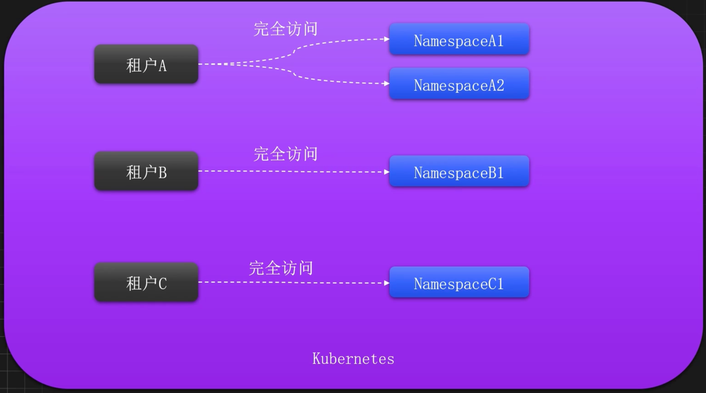
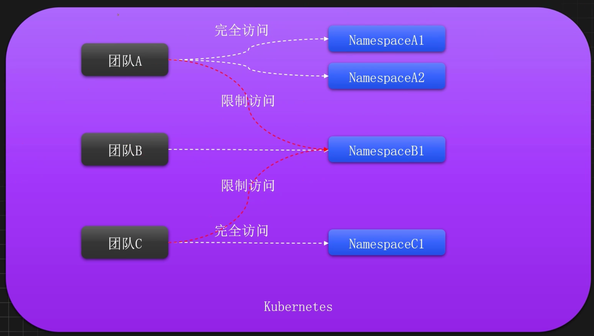
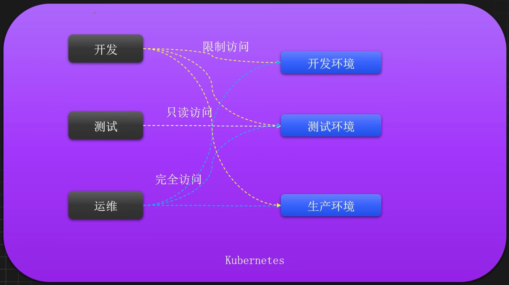
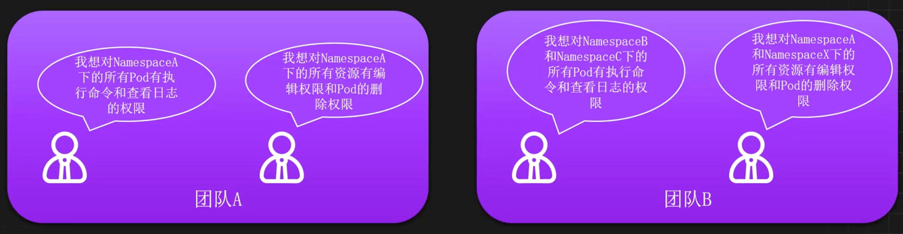
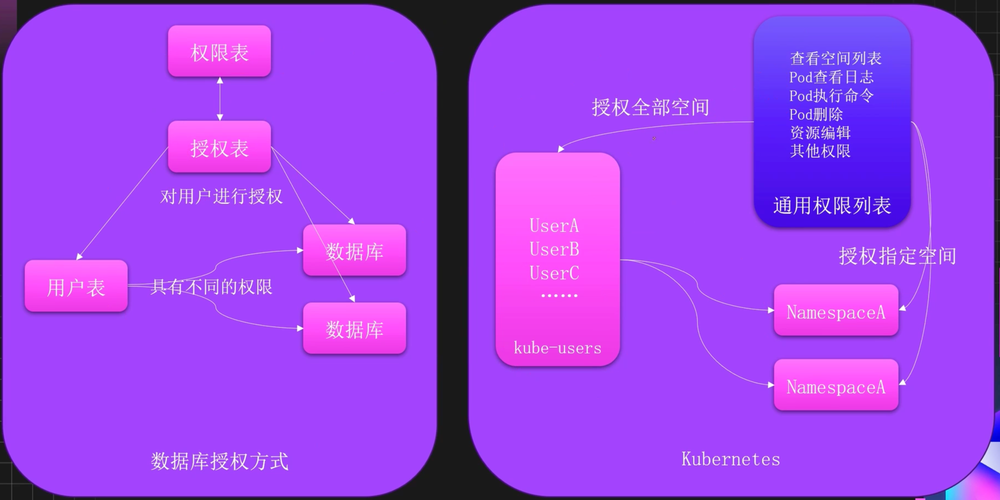
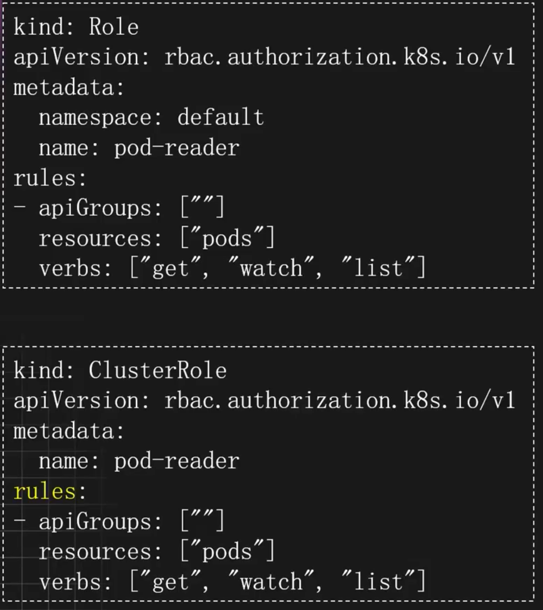
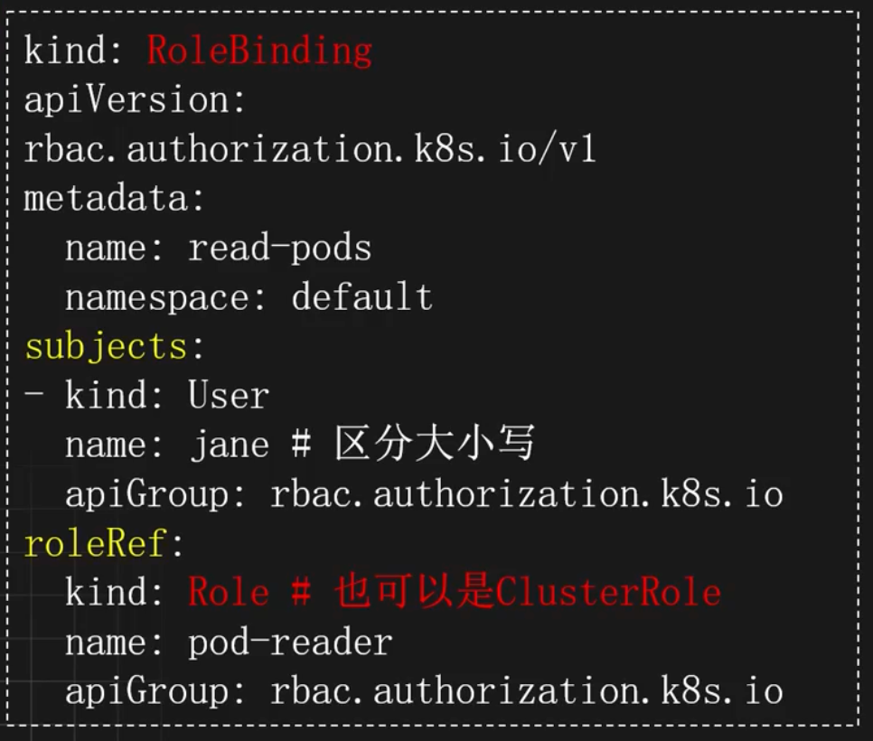

# 细粒度权限管理-RBAC

## K8s多用户使用场景

- 需要根据不同租户、不同团队、不同角色创建用户或组
- 每个用户或组可能有一个或多个不同空间的不同权限

### 针对不同租户



### 针对不同团队



### 针对不同场景不同角色



## 权限需求分析

- Namespace列表查看权限日志查看权限
- 执行命令权限
- Pod删除权限
- 资源编辑权限
- 其他权限



## 如何进行合理的用户和权限管理



## ServiceAccount

#### 理解

ServiceAccount是Kubernetes中的一种资源，主要用于身份验证和授权，可以让应用或用户以特定的身份访问集群内部的其他资源和服务。

ServiceAccount主要用于以下场景：

- 授权给应用程序指定的权限，让其可以访问集群中的资源
- 生成受限的kubeconfig，供不同的用户使用
- 生成临时或永久token，可以登录Kubernetes的Dashboard

#### 定义

方式一

```yaml
apiVersion: vl
kind: ServiceAccountmetadata:
name: my-serviceaccount
namespace: my-namespace
```

方式二（常用）

```shell
kubectl create sa xxx
```

### 示例

创建 ServiceAccount

```shell
# k8s < 1.24 会在创建sa时自动为sa创建对应的secret sa-token-xx
# k8s >= 1.24 为了安全性取消了这一默认行为
kubectl create sa monap
```

查看 ServiceAccount

```shell
kubectl get sa

kubectl get sa monap
```

为某个 ServiceAccount 创建 Token

```shell
# 不指定过期时间默认只有1小时有效期
kubectl create token monap
```

创建一个指定过期时间的 Token

```shell
kubectl create token monap --duration=99999h
```

### 使用 Secret 存储 ServiceAccount Token

```yaml
# vim monap-token-secret.yaml
apiVersion: v1
kind: Secret
metadata:
  name: monap-token-secret
  annotations:
    kubernetes.io/service-account.name: monap
type: kubernetes.io/service-account-token
```

创建该 Secret

```shell
kubectl create -f monap-token-secret.yaml
```

查看生成的 Token

```shell
$ kubectl get secret monap-token-secret 
NAME               TYPE                                DATA   AGE 
monap-token-secret kubernetes.io/service-account-token  3     71s

$ kubectl describe secret monap-token-secret 
Name: monap-token-secret
Namespace: default
Labels:    <None>
Annotations: kubernetes.io/service-account.name: monap
             kubernetes.io/service-account.uid: 227b46f0-42df-4e8e-bdb9-6eb23e858f2c Type: kubernetes.io/service-account-token Data
====
namespace: 7 bytes
token: eyJhbGciOiJSUzI1NiIsImtpZCI6IlRWd…
```

### 基于 ServiceAccount 生成 KubeConfig

基于 ServiceAccount 生成 Kubeconfig，需要先为 ServiceAccount 生成一个 Token，可以使用保存在 Secret 中的 Token。

获取 APIServer 地址

```shell
$ serverAddr=`kubectl cluster-info | grep --color=never \ 
-Eo -m 1 "https://.*" | \ 
sed -r "s/\x1B\[([0-9]{1,2}(;[0-9]{1,2})?)?[m|K]//g"`

$ echo $serverAddr
https://192.168.181.134:6443
```

获取当前 ServiceAccount 的 CA 证书和 Token

```shell
$ serviceaccountName="monap"
$ secretName="monap-token-secret"
$ ca=$(kubectl get secret/$secretName -o jsonpath='{.data.ca\.crt}')
$ token=$(kubectl get secret/$secretName -o jsonpath='{.data.token}' | base64 --decode)
```

生成 KubeConfig

```shell
$ cat < ${serviceaccountName}-kubeconfig.yaml
apiVersion: v1
kind: Config
clusters:
- name: default-cluster
  cluster:
    server: ${serverAddr}
    certificate-authority-data: ${ca}
users:
- name: ${serviceaccountName}
  user:
    token: ${token}
contexts:
- name: ${serviceaccountName}-context
  context:
    cluster: default-cluster
    user: ${serviceaccountName}
    namespace: default
current-context: ${serviceaccountName}-context
EOF
```

生成后即可使用新的 kubeconfig 操作集群

```shell
$ kubectl get po --kubeconfig monap-kubeconfig.yaml
Error from server (Forbidden): pods is forbidden: User "system:serviceaccount:default:monap" cannot list resource "pods" in API group "" in the namespace "default"
```

如果没有权限，可以临时进行授权

```shell
kubectl create rolebinding monap-view --clusterrole=view --serviceaccount=default:monap
```

## K8S RBAC 理解

`RBAC`：Role-Based Access Control，是一种基于角色的访问控制机制，用于管理用户和应用程序对Kubernetes资源的访问权限。通过RBAC，管理员可以细粒度地控制哪些用户或服务账户可以执行哪些操作，从而确保集群的安全性和资源的合理使用。

> 注意：RBAC只具备添加权限，不具备拒绝权限

K8S RBAC授权模式分为Roles和Bindings两种组件：

- `Roles`：用于定义相关权限
- `Bindings`：用于把权限绑定至相关主体，比如用户和组

## Role

### 分类

- `Role`：命名空间级别的权限，权限规则仅限于命名空间内
- `ClusterRole`：集群级别的权限，权限规则覆盖整个集群，同时可以绑定到某个空间内

### Roles 资源定义

- `kind`：定义资源类型为Role或ClusterRole
- `rules`：定义具体的权限规则，切片类型，可以配置多个
	- `API Groups`：包含该资源的组名称名称，比如apps，为空则为核心组
	- `resources`：定义对哪些资源进行授权，切片类型，可以定义多个，比如 `pods`、`service`、`"*"`等
	- `verbs`：定义可以执行的操作，切片类型，可以定义多个，比如 `create`、`delete`、`list`、`get`、`watch`、`update`、`pods/log`（子资源)
	- `resourceNames`：指定授权具体的对象，切片类型，可以定义多个，比如my-deployment



### 示例

> 以下示例均为从 Role 或 ClusterRole 对象中截取出来，我们仅展示其 `rules` 部分。

允许读取在核心 [API 组](https://kubernetes.io/zh-cn/docs/concepts/overview/kubernetes-api/#api-groups-and-versioning)下的 `"pods"`

```yaml
rules:
- apiGroups: [""]
  # 在 HTTP 层面，用来访问 Pod 资源的名称为 "pods"
  resources: ["pods"]
  verbs: ["get", "list", "watch"]
```

允许在 `"apps"` API 组中读/写 Deployment（在 HTTP 层面，对应 URL 中资源部分为 `"deployments"`）

```yaml
rules:
- apiGroups: ["apps"]
  #
  # 在 HTTP 层面，用来访问 Deployment 资源的名称为 "deployments"
  resources: ["deployments"]
  verbs: ["get", "list", "watch", "create", "update", "patch", "delete"]
```

允许读取核心 API 组中的 Pod 和读/写 `"batch"` API 组中的 Job 资源

```yaml
rules:
- apiGroups: [""]
  # 在 HTTP 层面，用来访问 Pod 资源的名称为 "pods"
  resources: ["pods"]
  verbs: ["get", "list", "watch"]
- apiGroups: ["batch"]
  # 在 HTTP 层面，用来访问 Job 资源的名称为 "jobs"
  resources: ["jobs"]
  verbs: ["get", "list", "watch", "create", "update", "patch", "delete"]
```

允许读取名称为 "my-config" 的 ConfigMap（需要通过 RoleBinding 绑定以限制为某名字空间中特定的 ConfigMap）

```yaml
rules:
- apiGroups: [""]
  # 在 HTTP 层面，用来访问 ConfigMap 资源的名称为 "configmaps"
  resources: ["configmaps"]
  resourceNames: ["my-config"]
  verbs: ["get"]
```

允许读取在核心组中的 `"nodes"` 资源（因为 `Node` 是集群作用域的，所以需要 ClusterRole 绑定到 ClusterRoleBinding 才生效）

```yaml
rules:
- apiGroups: [""]
  # 在 HTTP 层面，用来访问 Node 资源的名称为 "nodes"
  resources: ["nodes"]
  verbs: ["get", "list", "watch"]
```

允许针对非资源端点 `/healthz` 和其子路径上发起 GET 和 POST 请求 （必须在 ClusterRole 绑定 ClusterRoleBinding 才生效）

```yaml
rules:
- nonResourceURLs: ["/healthz", "/healthz/*"] # nonResourceURL 中的 '*' 是一个全局通配符
  verbs: ["get", "post"]
```

## RoleBinding

### 分类

- `subjects`：配置被绑定对象，可以配置多个
	- `kind`：绑定对象的类别，当前为User，还可以是Group、ServiceAccount
	- `name`：绑定对象名称
- `roleRef`：指定需要绑定的权限
	- `kind`：指定权限来源，可以是Role或ClusterRole
	- `name`：Role或ClusterRole的名字
	- `apiGroup`：API 组名

### 定义



### 示例

> 下面示例是 `RoleBinding` 中的片段，仅展示其 `subjects` 的部分

对于名称为 `alice@example.com` 的用户：

```yaml
subjects:
- kind: User
  name: "alice@example.com"
  apiGroup: rbac.authorization.k8s.io
```

对于名称为 `frontend-admins` 的用户组：

```yaml
subjects:
- kind: Group
  name: "frontend-admins"
  apiGroup: rbac.authorization.k8s.io
```

对于 `kube-system` 名字空间中的默认服务账户

```yaml
subjects:
- kind: ServiceAccount
  name: default
  namespace: kube-system
```

对于 "qa" 名称空间中的所有服务账户

```yaml
subjects:
- kind: Group
  name: system:serviceaccounts:qa
  apiGroup: rbac.authorization.k8s.io
```

对于在任何名字空间中的服务账户

```yaml
subjects:
- kind: Group
  name: system:serviceaccounts
  apiGroup: rbac.authorization.k8s.io
```

对于所有已经过身份认证的用户

```yaml
subjects:
- kind: Group
  name: system:authenticated
  apiGroup: rbac.authorization.k8s.io
```

对于所有未通过身份认证的用户

```yaml
subjects:
- kind: Group
  name: system:unauthenticated
  apiGroup: rbac.authorization.k8s.io
```

对于所有用户

```yaml
subjects:
- kind: Group
  name: system:authenticated
  apiGroup: rbac.authorization.k8s.io
- kind: Group
  name: system:unauthenticated
  apiGroup: rbac.authorization.k8s.io
```

## 面向用户的系统默认角色

一些系统默认的 ClusterRole 不是以前缀 `system:` 开头的。这些是面向用户的角色。 它们包括超级用户（Super-User）角色（`cluster-admin`）、 使用 ClusterRoleBinding 在集群范围内完成授权的角色（`cluster-status`）、 以及使用 RoleBinding 在特定名字空间中授予的角色（`admin`、`edit`、`view`）。

面向用户的 ClusterRole 使用 [ClusterRole 聚合](https://kubernetes.io/zh-cn/docs/reference/access-authn-authz/rbac/#aggregated-clusterroles)以允许管理员在这些 ClusterRole 上添加用于定制资源的规则。如果想要添加规则到 `admin`、`edit` 或者 `view`， 可以创建带有以下一个或多个标签的 ClusterRole

```yaml
metadata:
  labels:
    rbac.authorization.k8s.io/aggregate-to-admin: "true"
    rbac.authorization.k8s.io/aggregate-to-edit: "true"
    rbac.authorization.k8s.io/aggregate-to-view: "true"
```

|默认 ClusterRole|默认 ClusterRoleBinding|描述|
|---|---|---|
|**cluster-admin**|**system:masters** 组|允许超级用户在平台上的任何资源上执行所有操作。 当在 **ClusterRoleBinding** 中使用时，可以授权对集群中以及所有名字空间中的全部资源进行完全控制。 当在 **RoleBinding** 中使用时，可以授权控制角色绑定所在名字空间中的所有资源，包括名字空间本身。|
|**admin**|无|允许管理员访问权限，旨在使用 **RoleBinding** 在名字空间内执行授权。<br><br>如果在 **RoleBinding** 中使用，则可授予对名字空间中的大多数资源的读/写权限， 包括创建角色和角色绑定的能力。 此角色不允许对资源配额或者名字空间本身进行写操作。 此角色也不允许对 Kubernetes v1.22+ 创建的 EndpointSlices 进行写操作。 更多信息参阅 [“EndpointSlices 写权限”小节](https://kubernetes.io/zh-cn/docs/reference/access-authn-authz/rbac/#write-access-for-endpoints)。|
|**edit**|无|允许对名字空间的大多数对象进行读/写操作。<br><br>此角色不允许查看或者修改角色或者角色绑定。 不过，此角色可以访问 Secret，以名字空间中任何 ServiceAccount 的身份运行 Pod， 所以可以用来了解名字空间内所有服务账户的 API 访问级别。 此角色也不允许对 Kubernetes v1.22+ 创建的 EndpointSlices 进行写操作。 更多信息参阅 [“EndpointSlices 写操作”小节](https://kubernetes.io/zh-cn/docs/reference/access-authn-authz/rbac/#write-access-for-endpoints)。|
|**view**|无|允许对名字空间的大多数对象有只读权限。 它不允许查看角色或角色绑定。<br><br>此角色不允许查看 Secret，因为读取 Secret 的内容意味着可以访问名字空间中 ServiceAccount 的凭据信息，进而允许利用名字空间中任何 ServiceAccount 的身份访问 API（这是一种特权提升）。|

## 细粒度权限控制

### KubeConfig详解及配置多集群

#### 理解

使用 kubeconfig 文件来组织有关集群、用户、命名空间和身份认证机制的信息。 `kubectl` 命令行工具使用 kubeconfig 文件来查找选择集群所需的信息，并与集群的 API 服务器进行通信。

默认情况下，`kubectl` 在 `$HOME/.kube` 目录下查找名为 `config` 的文件。 你可以通过设置 `KUBECONFIG` 环境变量或者设置 [`--kubeconfig`](https://kubernetes.io/docs/reference/generated/kubectl/kubectl/)参数来指定其他 kubeconfig 文件。

假设你有多个集群，并且你的用户和组件以多种方式进行身份认证。比如：

- 正在运行的 kubelet 可能使用证书在进行认证。
- 用户可能通过令牌进行认证。
- 管理员可能拥有多个证书集合提供给各用户。

使用 kubeconfig 文件，你可以组织集群、用户和命名空间。你还可以定义上下文，以便在集群和命名空间之间快速轻松地切换。

#### 上下文（Context）

通过 kubeconfig 文件中的 `context` 元素，使用简便的名称来对访问参数进行分组。 每个 context 都有三个参数：cluster、namespace 和 user。 默认情况下，`kubectl` 命令行工具使用 **当前上下文** 中的参数与集群进行通信。

选择当前上下文：

```shell
kubectl config use-context
```

#### KUBECONFIG 环境变量

`KUBECONFIG` 环境变量包含一个 kubeconfig 文件列表。 对于 Linux 和 Mac，此列表以英文冒号分隔。对于 Windows，此列表以英文分号分隔。 `KUBECONFIG` 环境变量不是必需的。 如果 `KUBECONFIG` 环境变量不存在，`kubectl` 将使用默认的 kubeconfig 文件：`$HOME/.kube/config`。

如果 `KUBECONFIG` 环境变量存在，`kubectl` 将使用 `KUBECONFIG` 环境变量中列举的文件合并后的有效配置。

#### 配置对多集群的访问

可以使用配置文件来配置对多个集群的访问。 在将集群、用户和上下文定义在一个或多个配置文件中之后，用户可以使用 `kubectl config use-context` 命令快速地在集群之间进行切换。

假设用户有两个集群，一个用于开发工作（development），一个用于测试工作（test）。 在 `development` 集群中，前端开发者在名为 `frontend` 的名字空间下工作， 存储开发者在名为 `storage` 的名字空间下工作。在 `test` 集群中， 开发人员可能在默认名字空间下工作，也可能视情况创建附加的名字空间。 访问开发集群需要通过证书进行认证。 访问测试集群需要通过用户名和密码进行认证。

创建名为 `config-exercise` 的目录。在 `config-exercise` 目录中，创建名为 `config-demo` 的文件，其内容为：

```yaml
apiVersion: v1
kind: Config
preferences: {}

clusters:
- cluster:
  name: development
- cluster:
  name: test

users:
- name: developer
- name: experimenter

contexts:
- context:
  name: dev-frontend
- context:
  name: dev-storage
- context:
  name: exp-test
```

配置文件描述了集群、用户名和上下文。`config-demo` 文件中含有描述两个集群、 两个用户和三个上下文的框架。

进入 `config-exercise` 目录。输入以下命令，将集群详细信息添加到配置文件中

```shell
kubectl config --kubeconfig=config-demo set-cluster development --server=https://1.2.3.4 --certificate-authority=fake-ca-file

kubectl config --kubeconfig=config-demo set-cluster test --server=https://5.6.7.8 --insecure-skip-tls-verify
```

将用户详细信息添加到配置文件中

> 注意：将密码保存到 Kubernetes 客户端配置中有风险。 一个较好的替代方式是使用凭据插件并单独保存这些凭据。 参阅 [client-go 凭据插件](https://kubernetes.io/zh-cn/docs/reference/access-authn-authz/authentication/#client-go-credential-plugins)

```shell
kubectl config --kubeconfig=config-demo set-credentials developer --client-certificate=fake-cert-file --client-key=fake-key-seefile

kubectl config --kubeconfig=config-demo set-credentials experimenter --username=exp --password=some-password
```

将上下文详细信息添加到配置文件中

```shell
kubectl config --kubeconfig=config-demo set-context dev-frontend --cluster=development --namespace=frontend --user=developer

kubectl config --kubeconfig=config-demo set-context dev-storage --cluster=development --namespace=storage --user=developer

kubectl config --kubeconfig=config-demo set-context exp-test --cluster=test --namespace=default --user=experimenter
```

每个上下文包含三部分（集群、用户和名字空间），例如， `dev-frontend` 上下文表明：使用 `developer` 用户的凭证来访问 `development` 集群的 `frontend` 名字空间。

设置当前上下文：

```shell
kubectl config --kubeconfig=config-demo use-context dev-frontend
```

现在当输入 `kubectl` 命令时，相应动作会应用于 `dev-frontend` 上下文中所列的集群和名字空间， 同时，命令会使用 `dev-frontend` 上下文中所列用户的凭证。

使用 `--minify` 参数，来查看与当前上下文相关联的配置信息。

```shell
kubectl config --kubeconfig=config-demo view --minify
```

删除相关

```shell
# 删除用户
kubectl --kubeconfig=config-demo config unset users.<name>

# 删除集群
kubectl --kubeconfig=config-demo config unset clusters.<name>

# 删除上下文
kubectl --kubeconfig=config-demo config unset contexts.<name>
```

[更多参考](https://kubernetes.io/zh-cn/docs/tasks/access-application-cluster/configure-access-multiple-clusters/)

### 使用 Kubectl 管理 RBAC

> 注意：由于RBAC的 `role` 配置比较复杂，一般采用yaml文件的方式管理 `role` 与 `clusterRole`

创建一个可以查询 Pod 的 Role

```shell
kubectl create role pod-reader --verb=get --verb=list --verb=watch --resource=pods
```

指定非核心组

```shell
kubectl create role foo --verb=get,list,watch --resource=replicasets.apps
```

创建一个可以查询 Pod 的 ClusterRole

```shell
kubectl create clusterrole pod-reader --verb=get,list,watch --resource=pods
```

创建一个 RoleBinding，把 pod-reader 绑定至 default 空间下的 monap 用户

```shell
kubectl create rolebinding monap-pod-reader --clusterrole=pod-reader --serviceaccount=default:monap
```

创建一个 ClusterRoleBinding，把 admin 权限绑定至 default 空间下的 molly 用户

```shell
kubectl create rolebinding molly-admin-binding --clusterrole=admin --serviceaccount=default:molly
```

验证某个用户是否具有某个权限

```shell
$ kubectl auth can-i get configmaps -n default --as=system:serviceaccount:default:monap
yes

$ kubectl auth can-i get configmaps --as=system:serviceaccount:default:monap -n kube-system
no
```

### 通用权限管理

#### Namespace 查询权限

创建一个可以查询命名空间的权限

```yaml
apiVersion: rbac.authorization.k8s.io/v1
kind: ClusterRole
metadata:
  name: namespace-readonly
rules:
- apiGroups:
  - ""
  resources:
  - namespaces
  verbs:
  - get
  - list
  - watch
- apiGroups:
  - metrics.k8s.io
  resources:
  - pods
  verbs:
  - get
  - list
  - watch
```

#### Pod 删除权限

创建一个可以删除 Pod 的权限

```yaml
apiVersion: rbac.authorization.k8s.io/v1
kind: ClusterRole
metadata:
  name: pod-delete
rules:
- apiGroups:
  - ""
  resources:
  - pods
  - pods/status
  verbs:
  - get
  - list
  - delete
```

#### 执行命令权限

创建一个可以执行命令的权限

```yaml
apiVersion: rbac.authorization.k8s.io/v1
kind: ClusterRole
metadata:
  name: pod-exec
rules:
- apiGroups:
  - ""
  resources:
  - pods
  - pods/status
  verbs:
  - get
  - list
- apiGroups:
  - ""
  resources:
  - pods/exec
  verbs:
  - create
```

#### 查看日志权限

创建一个可以查看日志的权限

```yaml
apiVersion: rbac.authorization.k8s.io/v1
kind: ClusterRole
metadata:
  name: pod-log
rules:
- apiGroups:
  - ""
  resources:
  - pods
  - pods/log
  - pods/status
  verbs:
  - get
  - list
  - watch
```

#### 资源编辑权限

创建一个可以针对指定资源进行编辑的权限

```yaml
apiVersion: rbac.authorization.k8s.io/v1
kind: ClusterRole
metadata:
  name: configmap-deployment-manager
rules:
- apiGroups: [""]
  resources: ["configmaps"]
  verbs: ["get", "list", "watch", "create", "update", "patch"]
- apiGroups: ["apps"]
  resources: ["deployments"]
  verbs: ["get", "list", "watch", "create", "update", "patch"]
```

### K8s多用户管理

#### 基础设置

```shell
# 创建一个专用于存储用户的 Namespace
kubectl create ns kube-users

# 授权 kube-users 空间下的用户都有查看 Namespace 的权限
kubectl create clusterrolebinding namespace-readonly \ 
--clusterrole=namespace-readonly \ 
--group=system:serviceaccounts:kube-users

# 创建多个用户模拟不同的场景
kubectl create sa project-a-develop -n kube-users
kubectl create sa project-a-ops -n kube-users

# 创建 Namespace 模拟不同的环境
kubectl create ns project-a-dev
kubectl create ns project-a-test
kubectl create ns project-a-prod

# 在每个环境下创建一个服务
kubectl create deploy redis --image=registry.cnbeijing.aliyuncs.com/monap/redis:7.2.5 -n project-a-dev
kubectl create deploy redis --image=registry.cnbeijing.aliyuncs.com/monap/redis:7.2.5 -n project-a-test
kubectl create deploy redis --image=registry.cnbeijing.aliyuncs.com/monap/redis:7.2.5 -n project-a-prod
```

#### 不同用户授权管理

##### 授权测试环境可以查看日志和执行命令

在非生产环境，可以针对开发和测试人员开放查看日志和执行命令的权限，方便排查问题等。

授权 project-a-develop 用户对 project-a-dev 和 project-a-test 两个空间可以有查看日志和执行命令的权限

```shell
kubectl create rolebinding develop-pod-log \ 
--clusterrole=pod-log \ 
--serviceaccount=kube-users:project-a-develop -n project-a-dev 

kubectl create rolebinding develop-pod-exec \ 
--clusterrole=pod-exec \ 
--serviceaccount=kube-users:project-a-develop -n project-a-dev


kubectl create rolebinding develop-pod-log \ 
--clusterrole=pod-log \ 
--serviceaccount=kube-users:project-a-develop -n project-a-test

kubectl create rolebinding develop-pod-exec \ 
--clusterrole=pod-exec \ 
--serviceaccount=kube-users:project-a-develop -n project-a-test
```

创建 Token 测试

```shell
kubectl create token project-a-develop -n kube-users
```

之后可以登录到 Kubernetes 的 Dashboard 测试权限，或者生成 KubeConfig 进行测试

##### 授权生产环境只查看日志

在生产环境，通常不允许其他用户有特别大的权限，此时可以限制只能查看日志。 授权开发人员只能查看生产环境的日志权限

```shell
kubectl create rolebinding develop-pod-log \
--clusterrole=pod-log \
--serviceaccount=kube-users:project-a-develop -n project-a-prod
```

授权后可以在 Dashboard 上查看 project-a-prod 空间下 Pod 的日志

##### 授权开发人员可以修改非生产环境部分资源

有时候开发人员需要修改程序的配置用来测试新功能或者排查故障，此时可以给开发人员授权可以编辑部分的资源，比如 ConfigMap 和 Deployment。

```shell
kubectl create rolebinding develop-configmap-deployment-manager \
--clusterrole=configmap-deployment-manager \
--serviceaccount=kube-users:project-a-develop -n project-a-dev
```

授权之后，develop 可以修改 project-a-dev 的 ConfigMap 和 Deployment，但是其他环境无法修改。

##### 授权多租户场景受限管理员的权限

如果集群中分配了多个租户和 OPS 用户，此时租户和 OPS 用户应当具备指定空间的所有权限，此时可以直接使用 admin 或者 edit 的 ClusterRole 进行授权

比如授权 project-a-ops 用户可以操作 project-a-dev、test、prod 空间下的所有资源

```shell
kubectl create rolebinding ops-edit \
--clusterrole=edit \
--serviceaccount=kube-users:project-a-ops -n project-a-dev

kubectl create rolebinding ops-edit \
--clusterrole=edit \
--serviceaccount=kube-users:project-a-ops -n project-a-test

kubectl create rolebinding ops-edit \ 
--clusterrole=edit \ -
-serviceaccount=kube-users:project-a-ops -n project-a-prod
```

此时使用 project-a-ops 用户登录集群，即可操作上述空间的大部分资源

##### 授权应用程序可以访问集群资源

有时候需要对部署在 Kubernetes 集群中的服务进行授权，使其可以访问资源的某些资源， 比如获取集群中的 Pod 状态等，此时可以授权给某个 ServiceAccount，然后让 Pod 用该 ServiceAccount 创建 Pod，此时该 Pod 内的程序即可具备相关的权限。 

比如要实现某个程序具备 view 的权限，可以用如下方式进行授权。 

首先创建一个用于该程序的 ServiceAccount：

```shell
kubectl create sa app-view -n project-a-dev
```

授权该 ServiceAccount

```shell
kubectl create rolebinding app-view \
--clusterrole=view \
--serviceaccount=project-a-dev:app-view -n project-a-dev
```

创建一个资源，并使用该 ServiceAccount

```shell
$ kubectl create deploy app --image=registry.cnbeijing.aliyuncs.com/monap/kubectl -n project-a-dev -- sleep 36000

# 默认情况下是给的default ServiceAccount
$ kubectl get po -n project-a-dev app-xxx -oyaml | grep -i serviceacc
serviceAccountName: default

$ kubectl edit deploy app -n project-a-dev
# 修改或添加 spec.template.spec.serviceAccountName 为 app-view
```

登录至该容器，即可访问该空间下的所有资源

```shell
I have no name!@app-68d6f94698-d9wvd:/$ kubectl get po -n project-a-dev 
NAME                   READY  STATUS   RESTARTS AGE 
app-68d6f94698-d9wvd   1/1    Running    0      4m25s
redis-6b74d4b679-v5dkj 1/1    Running    0     39m
```

其它空间未授权无法访问

```shell
I have no name!@app-68d6f94698-d9wvd:/$ kubectl get pod -n project-a-test
Error from server (Forbidden): pods is forbidden: User "system:serviceaccount:project-a-dev:app-view" cannot list resource "pods" in API group "" in the namespace "project-a-tes"
```

如果需要访问其它空间的资源，按需创建 RoleBinding 即可