# 集群资源合理化分配

## 资源限制-ResourceQuota

### 为什么需要资源分配与限制

#### 服务部署过量分配资源导致资源浪费

>限制资源，使用人员需要设置资源request

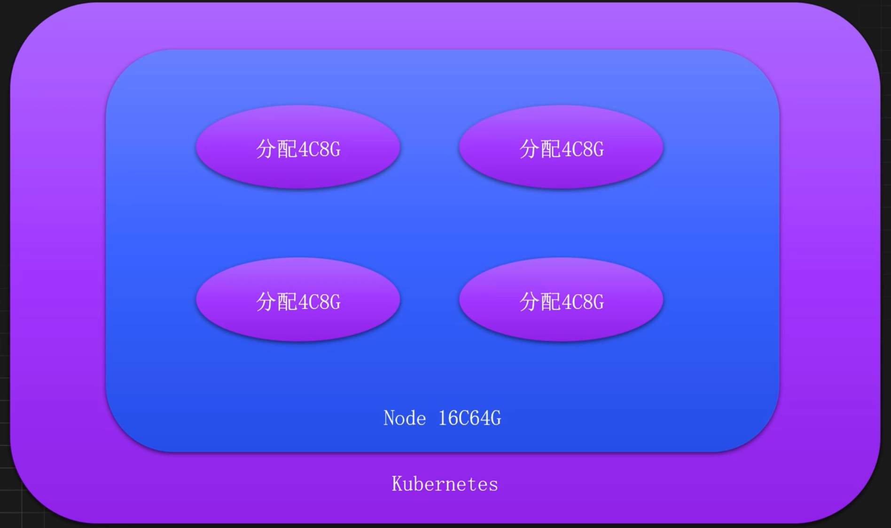

#### 资源设置过大的Limit导致机器故障

> 限制资源，使用人员需要设置资源limit

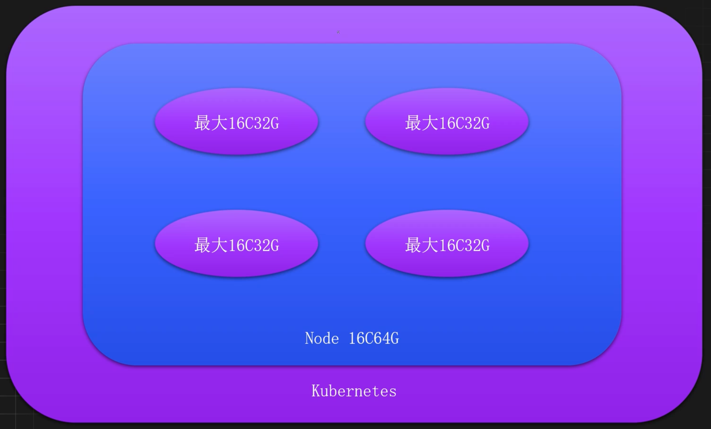

#### 服务下线未及时清理导致过多脏数据

> 限制Pod数量，使用人员需要及时清理垃圾数据

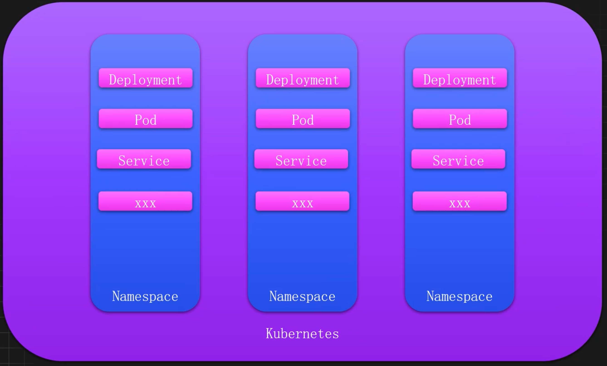

#### 多租户或多环境资源相互争抢

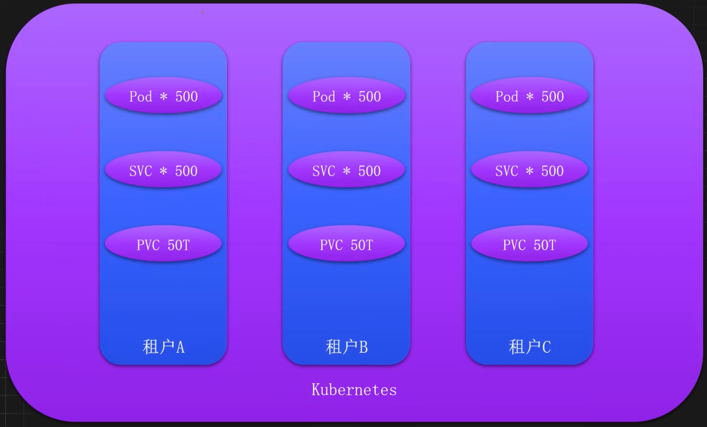

#### 配置问题导致集群资源激增

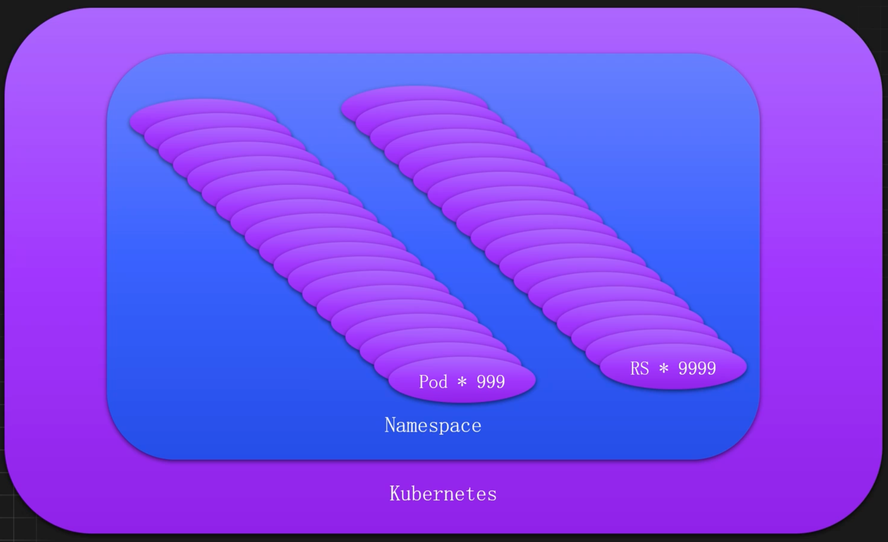

### 如何进行合理的资源划分

#### 以租户为单位

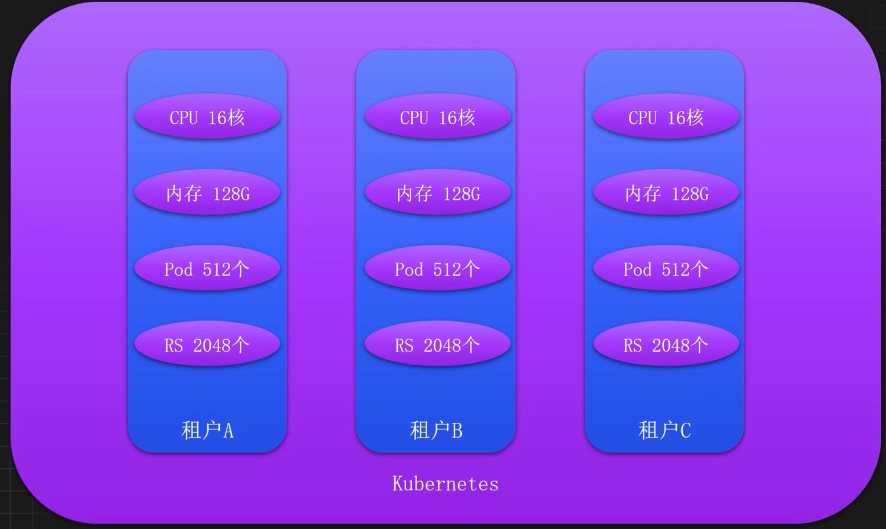

#### 以环境为单位

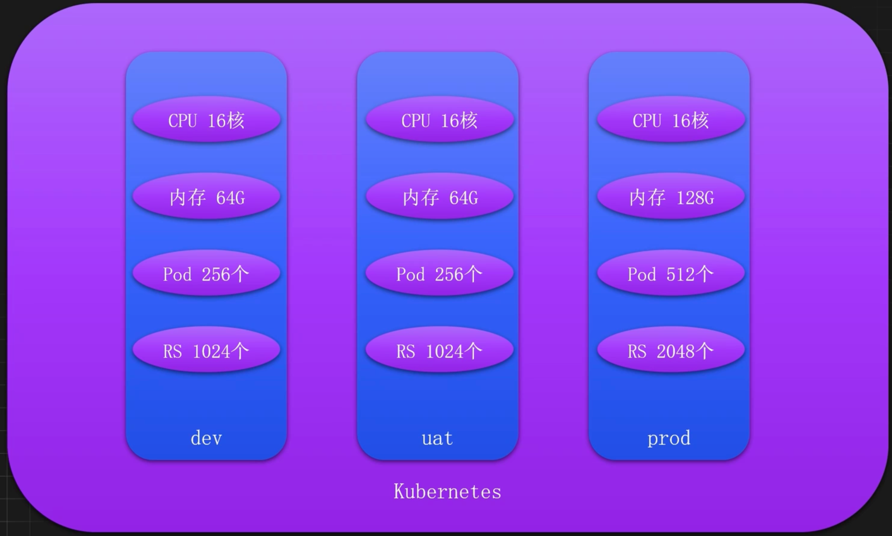


#### 以Namespace为单位

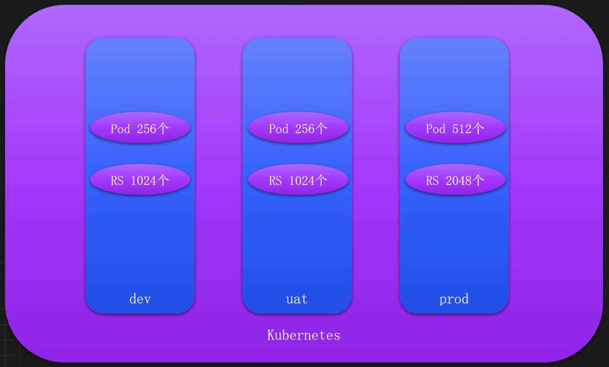

### ResourceQuota 引入

ResourceQuota是一个Kubernetes用于资源管理的对象，主要`用于限制命名空间中的资源使用量`。Kubernetes管理员可以使用ResourceQuota控制命名空间中的资源使用量，确保资源的合理分配和使用，防止某个命名空间或用户过度消耗集群资源。

ResourceQuota通常用于如下场景：

- 限制资源使用：控制命名空间中可以使用的CPU、内存、存储等资源的总量。
- 限制对象数量：控制命名空间中可以创建的对象数量，如Pod、ConfigMap、Secret、Service等。
- 资源公平分配：确保资源在不同命名空间之间公平分配，避免资源争抢。
- 防止资源耗尽：防止某个命名空间或用户过度消耗资源，导致其他应用无法获得所需的资源。

### ResourceQuota配置详解

- `pods`：限制最多启动Pod的个数
- `requests.cpu`：限制最高CPU请求数
- `requests.memory`：限制最高内存的请求数
- `limits.cpu`：限制最高CPU的limit上限
- `limits.memory`：限制最高内存的limit上限
- `requests.storage`：PVC存储请求的总和
- `count/replicasets.apps`：限制特定资源的数量
	- `count/<resource>.<group>`：用于非核心组的资源
	- `count/<resource>`：用于核心组的资源

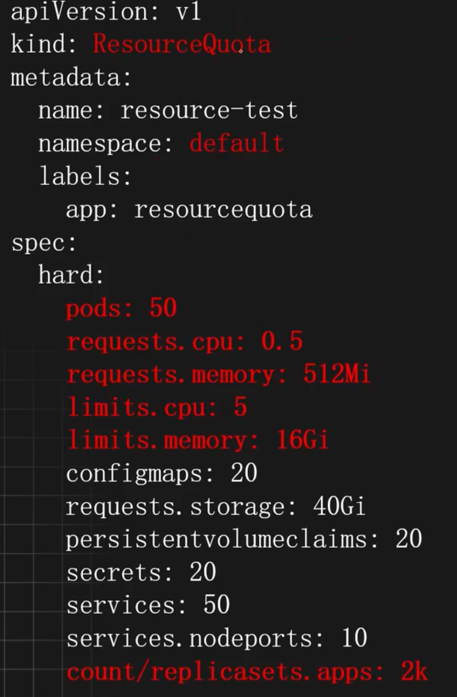

### ResourceQuota 使用示例

#### 基于租户和团队的资源限制

在一个 Kubernetes 集群中，可能会有不同的团队或者不同的租户共同使用，此时可以针对不同的租户和不同的团队进行资源限制。 

首先创建两个 Namespace 模拟两个租户

```shell
kubectl create namespace customer1
kubectl create namespace customer2
```

配置租户 1 的资源限制

```yaml
# vim customer1-resourcequota.yaml
apiVersion: v1
kind: ResourceQuota
metadata:
  name: customer1-quota
  namespace: customer1
spec:
  hard:
    requests.cpu: "2"
    requests.memory: 4Gi
    limits.cpu: "8"
    limits.memory: 16Gi
    pods: "50"
    persistentvolumeclaims: "10"
    requests.storage: 400Gi
    services: "40"
    count/replicasets.apps: 1k
```

配置租户 2 的资源限制

```yaml
# vim customer2-resourcequota.yaml
apiVersion: v1
kind: ResourceQuota
metadata:
  name: customer2-quota
  namespace: customer2
spec:
  hard:
    requests.cpu: "4"
    requests.memory: 8Gi
    limits.cpu: "16"
    limits.memory: 32Gi
    pods: "50"
    count/replicasets.apps: 1k
```

创建一个 Deployment 测试

```shell
# 创建Deployment
kubectl create deploy test-quota --image=registry.cnbeijing.aliyuncs.com/dotbalo/redis:7.2.5 -n customer1

# 此时并没有 Pod 产生
kubectl get po -n customer1

# 添加资源请求
resources:
  requests:
    cpu: "3"
    memory: "10Mi"
  limits:
    cpu: "4"
    memory: "1024Mi"
    
# 由于资源请求大于资源限制，所以也不会产生 Pod，此时可以查看 RS 的日志
exceeded quota: customer1-quota, 
requested: requests.cpu=3, 
used: requests.cpu=0, 
limited: requests.cpu=2
```

#### 基于环境和项目的资源限制

和租户与团队一致，一个集群也可能同时存在多个环境和项目，此时也可以基于环境和项目进行资源限制

```shell
kubectl create namespace project-dev
kubectl create namespace project-test
```

限制 dev 的资源

```yaml
# vim dev-quota.yaml
apiVersion: v1
kind: ResourceQuota
metadata:
  name: dev-quota
  namespace: dev
spec:
  hard:
    requests.cpu: "4"
    requests.memory: 4Gi
    limits.cpu: "8"
    limits.memory: 8Gi
    pods: "40"
    services: "20"
    count/replicasets.apps: 1k
```

限制 test 的资源

```yaml
# vim test-quota.yaml
apiVersion: v1
kind: ResourceQuota
metadata:
  name: test-quota
  namespace: test
spec:
  hard:
    requests.cpu: "8"
    requests.memory: 8Gi
    limits.cpu: "16"
    limits.memory: 16Gi
    pods: "100"
    services: "40"
    count/replicasets.apps: 1k
```

#### 基于命名空间的资源限制

通常情况下，出于稳定性和安全性考虑，应该对每个 Namespace 不受控制的资源进行限制， 比如 Pod 和 ReplicaSet，防止异常创建导致集群故障。 

此时可以给每个 Namespace 添加一个默认的资源限制

```yaml
# vim default-quota.yaml
apiVersion: v1
kind: ResourceQuota
metadata:
  name: default-quota
spec:
  hard:
    count/pods: "1000"
    count/replicasets.apps: 2k
```

## 资源约束-LimitRange

### 限制了资源是否就万无一失

只有ResourceQuota是不够的，我们还需要一种手段能够对request和limit进行约束，防止设置的太小或者太大

- 对于request和limit设置不合理的，禁止创建该服务对于未设置
- request和limit的，自动添加一个默认值

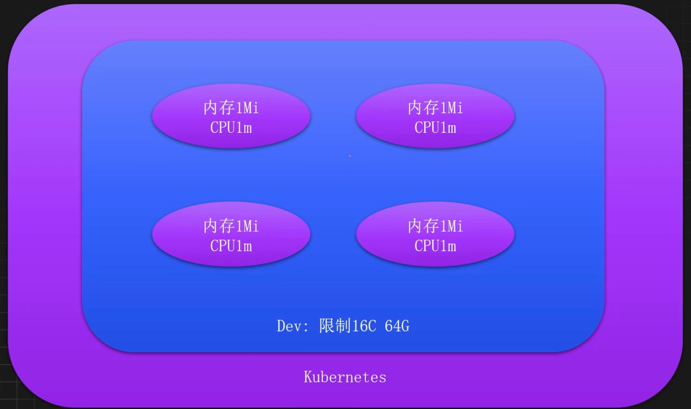

### LimitRange引入

LimitRange是另一个用于资源管理的对象，主要用于配置资源请求（requests）和限制（limits）的默认值和使用范围。Kubernetes管理员可以使用LimitRange控制Pod或容器的资源请求和限制，从而进一步避免资源浪费和过度消耗。

LimitRange通常用于如下场景：

- 设置默认资源请求和限制：确保每个容器在创建时都有合理的默认资源请求和限制。
- 限制资源使用范围：防止用户设置过高的资源请求和限制，导致资源浪费。

### LimitRange配置详解

- `type`：资源类型的限制，常见的值有Container、Pod等
- `default`： limits的默认值
	- `memory`：默认的内存限制
	- `cpu`：默认的CPU限制
- `defaultRequest`： requests的默认值
	- `memory`：默认的内存请求
	- `cpu`：默认的CPU请求
- `min`: 内存和CPU的最小配置（request）
	- `memory`：内存请求和限制的最小值
	- `cpu`：CPU请求和限制的最小值
- `max`：内存和CPU的最大配置（limit)
	- `memory`：内存请求和限制的最大值
	- `cpu`：CPU请求和限制的最大值


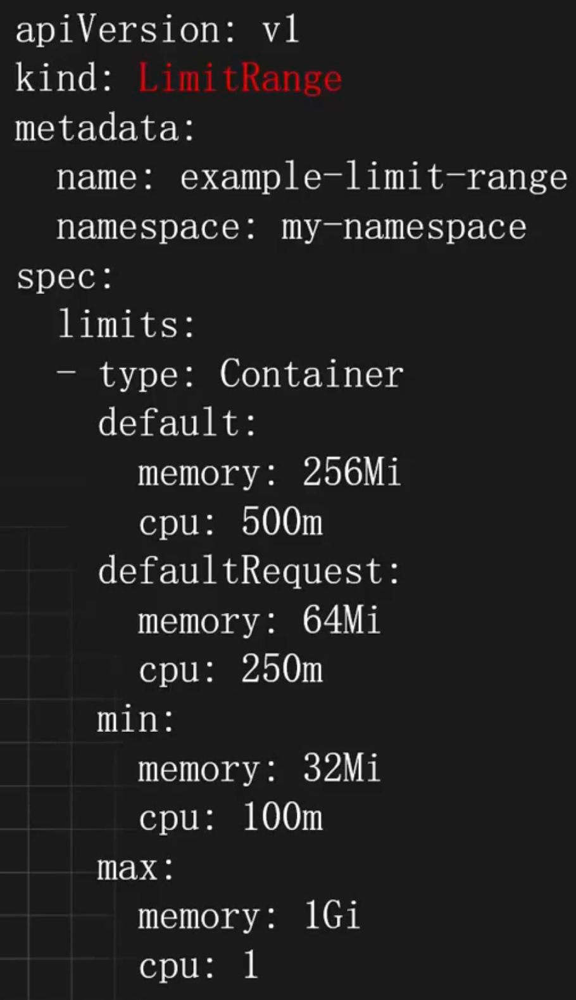

### LimitRange使用示例

#### 设置容器默认的资源配置

在 Kubernetes 集群中部署任何的服务，都建议添加 resources 参数，也就是配置内存和 CPU 资源的请求和限制。 

如果不想给每个容器都手动添加资源配置，此时可以使用 limitRange 实现给每个容器自动 添加资源配置。

比如默认给每个容器默认添加 cpu 请求 0.5 核，内存请求 256Mi，cpu 最大使用量 1 核，内存最大使用量 512Mi。

```yaml
apiVersion: v1
kind: LimitRange
metadata:
  name: cpu-mem-limit-range
spec:
  limits:
  - default:
      cpu: 1
      memory: 512Mi
    defaultRequest:
      cpu: 0.5
      memory: 256Mi
    type: Container
```

创建一个没有资源配置的服务

```shell
kubectl create deploy test-quota --image=registry.cnbeijing.aliyuncs.com/dotbalo/redis:7.2.5 -n customer1
```

此时 Pod 里面的容器会被添加默认的 resources 配置（多个容器也会同时添加，已配置的参 数不会覆盖）

```yaml
# kubectl get po -n customer1 -oyaml | grep resources -A 6
resources:
  limits:
    cpu: "1"
    memory: 512Mi
  requests: 
    cpu: 500m
    memory: 256Mi
```

#### 限制容器可以使用的最大和最小资源

除了给容器配置默认的资源请求和限制，limitRange 还可以限制容器能使用的最大资源及可以配置的最小资源。 

比如限制容器能配置最大内存是 1G，最大 CPU 是 800m，最小内存是 128M，最小 CPU 是 10m

```yaml
# vim min-max.yaml
apiVersion: v1
kind: LimitRange
metadata:
  name: min-and-max
spec:
  limits:
  - max:
      cpu: "800m"
      memory: 1Gi
    min:
      cpu: "10m"
      memory: 128Mi
    type: Container
```

首先给服务添加一个默认的资源配置

```yaml
resources:
  limits:
    cpu: "2" 
    memory: 2Gi
  requests:
    cpu: 1m
    memory: 1Mi
```

创建最大值和最小值的限制

```shell
kubectl create -f min-max.yaml -n customer1
```

此时更新 Deployment 的资源配置不在 limitRange 的限制范围，RS 就会出现如下报错

```shell
minimum cpu usage per Container is 10m, but request is 2m, minimum memory usage per Container is 128Mi, but request is 2Mi, maximum cpu usage per Container is 800m, but limit is 2, maximum memory usage per Container is 1Gi, but limit is 2Gi
```

#### 限制存储使用的大小范围

除了限制 CPU 和内存，也会限制 PVC 的大小范围，此时把 type 改为 PersistentVolumeClaim 即可。

比如限制每个 PVC 只能使用大于等于 1G，小于等于 3G 的空间

```yaml
# vim storage-limit.yaml
apiVersion: v1
kind: LimitRange
metadata:
  name: storagelimits
spec:
  limits:
  - type: PersistentVolumeClaim
    max:
      storage: 3Gi
    min:
      storage: 1Gi
```

创建一个申请 5G 的 PVC

```yaml
apiVersion: v1
kind: PersistentVolumeClaim
metadata:
  name: pvc-test
spec:
  resources:
    requests:
      storage: 5Gi
  volumeMode: Filesystem
  storageClassName: local-storage
  accessModes:
  - ReadWriteMany
```

此时会有如下报错

```shell
$ kubectl create -f pvc.yaml
Error from server (Forbidden): error when creating "pvc.yaml": persistentvolumeclaims "pvc-test" is forbidden: maximum storage usage per PersistentVolumeClaim is 3Gi, but request is 5Gi
```

此时把 storage 改为限制范围内即可正常创建。

## 服务质量-QoS

### 集群总会有意外发生

节点资源不足，服务终止策略如何实现？

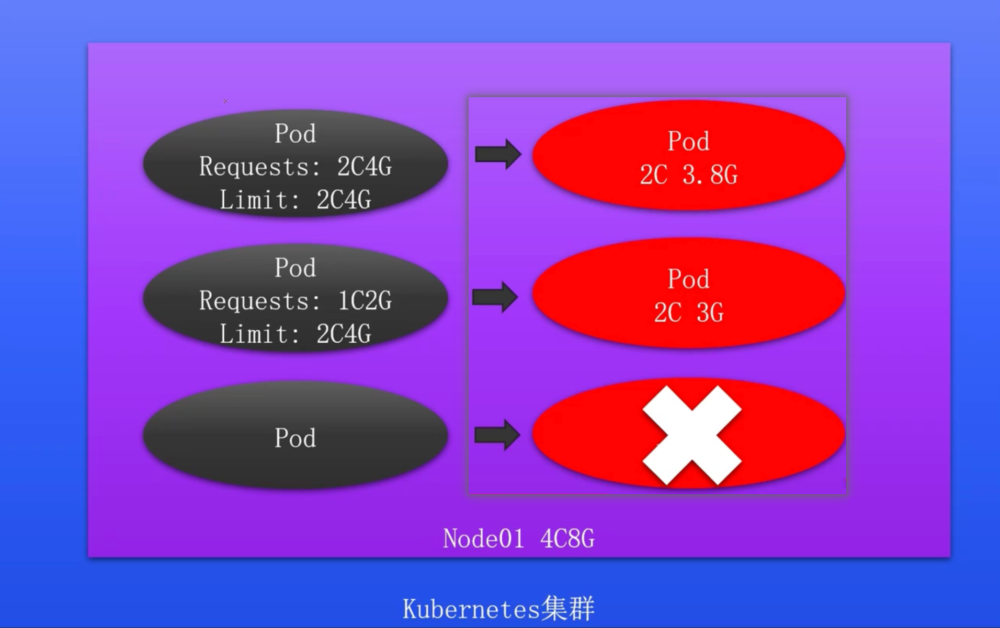


### QoS引入

`QoS` 即 Quality of Service，表示程序的服务质量。K8s集群中的每个Pod，都会有对应的QoS级别（在Kubernetes中通过Resources参数即可配置QoS的级别），可用于决定Pod在资源紧张时的处理顺序，同时可以确保关键服务的稳定性和可靠性。

### QoS级别

- `Guaranteed`：最高服务质量，当宿主机内存不够时，会先kill掉QoS为`BestEffort`和`Burstable`的Pod，如果内存还是不够，才会kill掉QoS为`Guaranteed`，该级别Pod的资源占用量一般比较明确，即requests的cpu和memory和limits的cpu和memory配置的一致。
- `Burstable`：服务质量低于`Guaranteed`，当宿主机内存不够时，会先kill掉QoS为`BestEffort`的Pod，如果内存还是不够之后就会kill掉QoS级别为`Burstable`的Pod，用来保证QoS质量为`Guaranteed`的Pod，该级别Pod一般知道最小资源使用量，但是当机器资源充足时，还是想尽可能的使用更多的资源，即limits字段的cpu和memory大于requests的cpu和memory的配置。
- `BestEffort`：尽力而为，当宿主机内存不够时，首先kill的就是该QoS的Pod，用以保证`Burstable`和`Guaranteed`级别的Pod正常运行。

### QoS使用示例

#### 实现 QoS 为 Guaranteed 的 Pod

Guaranteed 级别的 Pod 具有最高的优先级，Kubernetes 会确保这些 Pod 获得足够的资源， 也就是 Kubernetes 调度器会确保这些 Pod 调度到能够提供所需资源的节点上。

配置 Guaranteed 级别的 Pod，需要满足如下条件： 

1) Pod 中的每个容器必须指定 limits.memory 和 requests.memory，并且两者需要相等 
2) Pod 中的每个容器必须指定 limits.cpu 和 requests.cpu，并且两者需要相等

```yaml
limits:
  cpu: 200m
  memory: 512Mi
requests:
  cpu: 200m
  memory: 512Mi
```

#### 实现 QoS 为 Burstable 的 Pod

Burstable 级别的 Pod 具有中等优先级，Kubernetes 会尽量满足其资源请求，但在资源紧张时可能会被驱逐，Kubernetes 调度器会确保这些 Pod 调度到能够提供所需资源的节点上，如果 节点上有额外的资源，这些 Pod 可以使用超过其请求的资源。 配置 Burstable 级别的 Pod，需要满足如下条件：

1) Pod 不符合 Guaranteed 的配置要求
2) Pod 中至少有一个容器配置了 requests.cpu 或 requests.memory

```yaml
requests:
  memory: 128Mi
  cpu: 100m
```

#### 实现 QoS 为 BestEffort 的 Pod

BestEffort 级别的 Pod 是最低优先级，Kubernetes 不保证这些 Pod 获得任何资源，在资源紧张时，这些 Pod 最先被驱逐。同时 Kubernetes 调度器会尝试将这些 Pod 调度到任何节点上，但不保证节点上有足够的资源。 

配置 BestEffort 级别的 Pod，不配置 resources 字段即可。