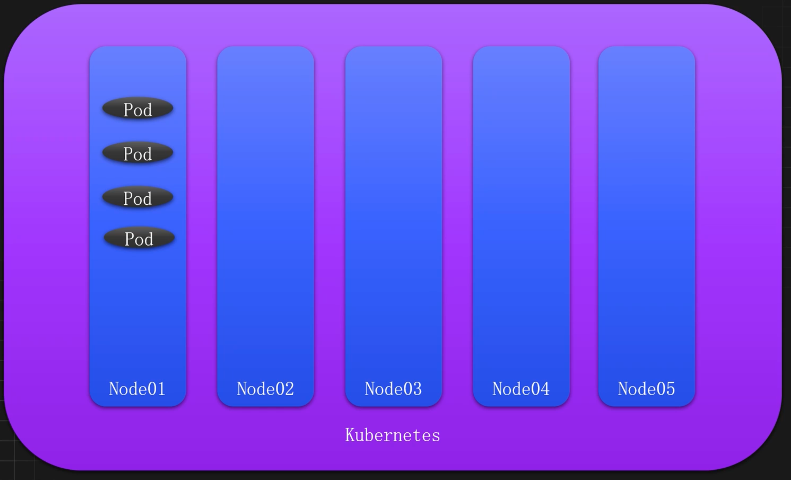
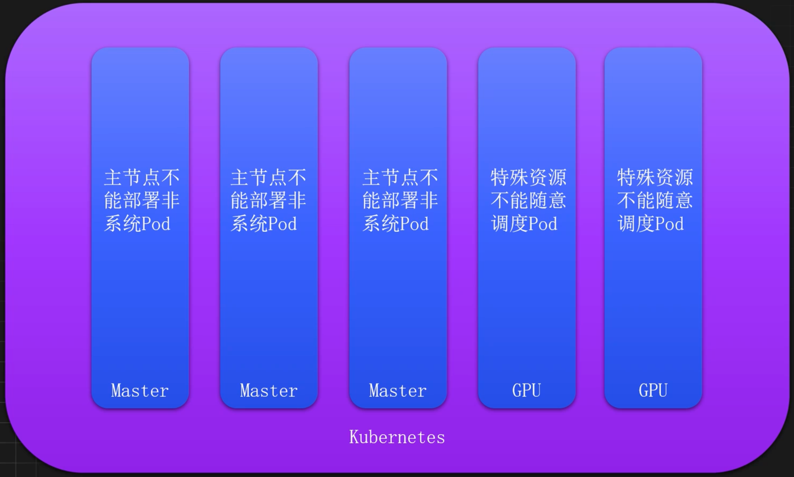
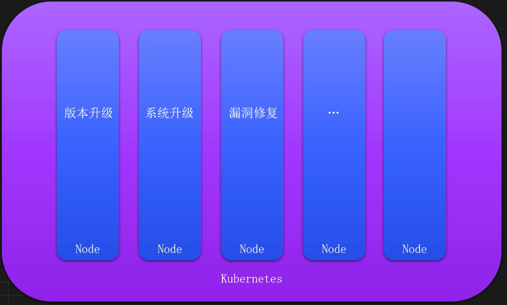
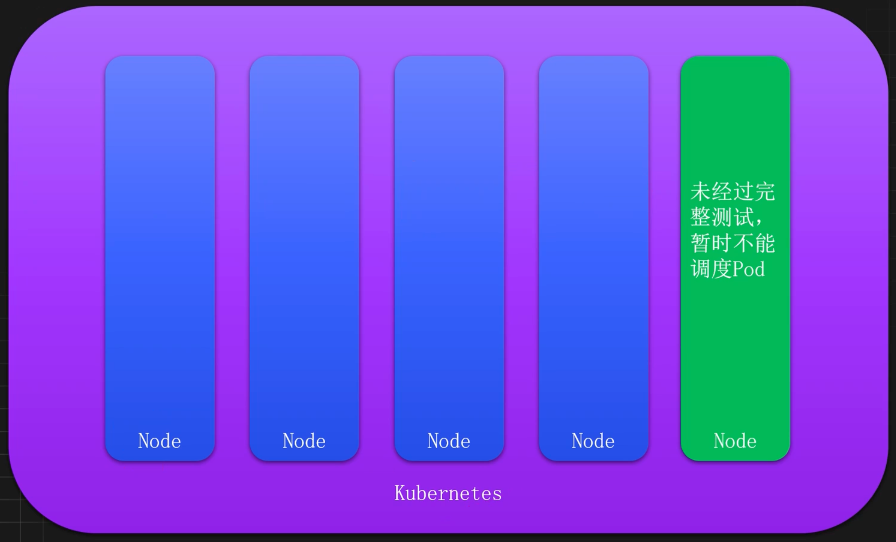
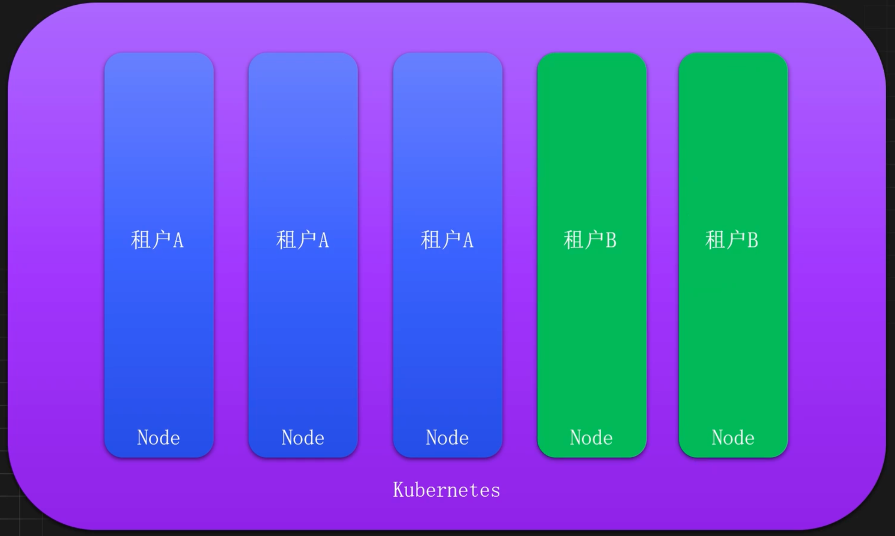
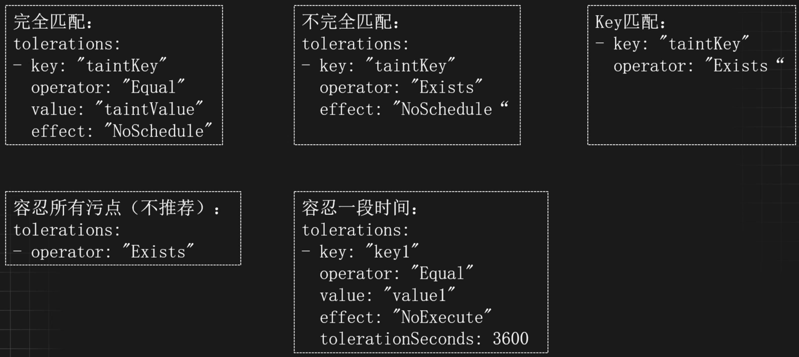

# 集群资源精细化隔离-容忍和污点

## 生产环境仍存在的问题

### 节点故障如何快速恢复服务

如下图，如果Node01故障后该节点上的Pod如何快速秒级迁移到其他节点上去？

> K8S在某个节点被识别与标记为故障，默认五分钟后才会开始迁移调度Pod



### 特殊资源如何不浪费



### 节点维护如何不影响服务



### 新增节点如何确保可用性



### 多租户如何进行隔离



## 容忍和污点引入

### 概念

污点 `Taint` 和容忍 `Toleration` 是Kubernetes提供的一种强大的调度控制机制，可以实现资源的精细化管理和调度优化。

污点用于标记节点，容忍用于控制Pod的调度行为。常用于节点维护、资源隔离、故障恢复、故障隔离等场景。

### 什么是污点(Taint)

污点作用于节点，主要用来标记节点的属性或状态，实现在默认情况下可以让Pod无法调度到这些标记了污点的节点上。

使用场景：

- 节点维护
- 故障恢复
- 故障隔离
- 资源隔离

### 什么是容忍(Toleration)

容忍作用于Pod，主要用来让Pod可以接受某个污点的限制，也就是让某些Pod容忍节点上配置的污点，可以让一些需要特殊配置的Pod能够调用到具有污点和特殊资源的节点上。

污点和容忍相互配合，可以用来避免Pod被分配到不合适的节点上。

### 污点的影响效果(Effect)

- `NoSchedule`：禁止调度Pod到该节点上，但是已经运行在该节点的服务不受影响。适用于资源隔离和节点维护的场景。
- `NoExecute`：禁止调度Pod到该节点上，同时已经运行在该节点上的Pod也会被驱逐（终止并重新调度）。适用于节点故障、紧急维护和故障快速恢复的场景。
- `PreferNoSchedule`：类似于NoSchedule，但不是一个硬性限制，调度器会尽量避免将新的Pod调度到这个节点上，但如果其他节点都不满足条件，Pod仍然会被调度到这个节点上。适用于软性资源隔离的场景。

## 配置与使用

### 污点配置解析

可以使用kubectl给指定的节点添加污点，添加污点需要使用kubectl的taint指令。

命令格式：

```shell
kubectl taint node NODE_NAME TAINT_KEY=TAINT_ VALUE:EFFECT
```

比如给GPU机器添加一个特殊资源的污点：

```shell
kubectl taint node gpu-node01 gpu=true:NoSchedule
```

### 常见污点操作命令

#### 添加污点

```shell
# 添加一个污点
kubectl taint node k8s-node01 taint01=taintvalue01:NoSchedule

# 添加一个同名不同影响度的污点
kubectl taint node k8s-node01 taint01=taintvalue01:PreferNoSchedule

# 添加一个不包含 value 的污点
kubectl taint node k8s-node01 taint02:NoSchedule

# 同时添加多个污点
kubectl taint node k8s-node01 taint02=value02:PreferNoSchedule taint03=value03:NoSchedule

# 同时添加多个节点
kubectl taint node k8s-node02 k8s-master01 taint02=value02:PreferNoSchedule taint03=value03:NoSchedule

# 同时添加所有节点（也可以基于 Label）
kubectl taint node taint04=value04:PreferNoSchedule --all
```

#### 修改污点

```shell
# 修改value
kubectl taint node k8s-node01 taint02=v02:PreferNoSchedule --overwritex

# 修改Effect
kubectl taint node k8s-node01 taint02=v02:NoSchedule --overwrite
```

#### 查询污点

```shell
# 查询 k8s-node01 的污点（推荐）
kubectl describe node k8s-node01 | grep Taints -A 10

# 使用 go-template 查询
kubectl get node k8s-node01 -o go-template --template {{.spec.taints}}

# 查询所有污点
kubectl get nodes -o json | jq '.items[].spec.taints'

# 查询所有污点方式二
kubectl describe node | grep Taints
```

#### 删除污点

```shell
# 首先查看某个节点的污点列表
kubectl describe node k8s-node01 | grep Taints -A 10

# 基于 Key 删除，会删除所有同名的污点
kubectl taint node k8s-node01 taint01-

# 基于 Key 和 Effect 删除
kubectl taint node k8s-node01 taint02:NoSchedule

# 基于完整格式删除
kubectl taint node k8s-node01 taint03=value03:NoSchedule
```

### 创建内置污点

- `node.kubernetes.io/not-ready`：节点未准备好，相当于节点状态Ready的值为False
- `node.kubernetes.io/unreachable`：Node Controller访问不到节点，相当于节点状态Ready的值为Unknown。
- `node.kubernetes.io/out-of-disk`：节点磁盘耗尽。
- `node.kubernetes.io/memory-pressure`：节点存在内存压力。
- `node.kubernetes.io/disk-pressure`：节点存在磁盘压力。
- `node.kubernetes.io/pid-pressure`：节点存在PID压力
- `node.kubernetes.io/network-unavailable`：节点网络不可达
- `node.kubernetes.io/unschedulable`：节点不可调度。

### 容忍配置解析



## 容忍与污点使用案例

### K8s 主节点禁止调度

在生产环境中，Kubernetes 的主节点除了部署系统组件外，不推荐再部署任何服务，此时可以通过添加污点来禁止调度

```shell
kubectl taint node k8s-master01 node-role.kubernetes.io/controlplane:NoSchedule
```

也可以添加 NoExecute 类型的污点，此时不容忍该污点的 Pod 会被驱逐重建

```shell
kubectl taint node k8s-master01 node-role.kubernetes.io/controlplane:NoExecute
```

使用如下命令可以查看正在被驱逐重建的 Pod

```shell
kubectl get po -A -owide | grep k8s-master01 | grep -v Running
```

### K8s 新节点禁止调度

当 Kubernetes 集群添加新节点时，通常情况下不会立即调度 Pod 到该节点，需要经过完整的可用性测试之后才可以调度 Pod，此时也可以使用污点先临时禁止该节点的调度

```shell
kubectl taint node k8s-master01 new-node=true:NoSchedule
```

同样的道理，比如在禁止调度之前已经有 Pod 部署在该节点，可以进行驱逐

```shell
kubectl taint node k8s-master01 new-node=true:NoExecute
```

待新节点测试完毕后，在允许该节点可以进行调度

```shell
kubectl taint node k8s-master01 new-node-
```

### K8s 节点维护流程

当 Kubernetes 的节点需要进行下线维护时，此时需要先把该节点的服务进行驱逐和重新调度。 

此时需要根据实际情况判断是直接驱逐还是选择重新调度，比如某个 Pod 只有一个副本， 或者某个服务比较重要，就不能直接进行驱逐，而是需要先把节点关闭调度，然后在进行服务的重新部署。 

关闭维护节点的调度

```shell
kubectl taint node k8s-node02 maintain:NoSchedule
```

重新触发某个服务的部署

```shell
kubectl rollout restart deploy redis -n basic-component-dev
```

再次查看该服务

```shell
kubectl get po -n basic-component-dev -owide
```

接下来没有重要服务，即可对该节点的 Pod 进行驱逐

```shell
kubectl taint node k8s-node02 maintain:NoExecute
```

驱逐后，即可按照预期进行对节点进行维护，维护完成以后，可以删除污点，恢复调度

```shell
kubectl taint node k8s-node02 maintain-
```

除了自定义污点，也可以使用 kubectl 快捷指令将节点设置为维护状态

```shell
# 将节点标记为不可调度状态
kubectl cordon k8s-node01
```

此时节点会被标记一个 SchedulingDisabled 状态，但是已经运行在该节点的 Pod 不收影响

```shell
$ kubectl get node 
NAME          STATUS                         ROLES         AGE    VERSION
k8s-master01  Ready                    control-plane       73d    v1.31.0
k8s-node01    Ready,SchedulingDisabled      <None>         73d    v1.31.0
```

驱逐 k8s-node01 上面的服务

```shell
kubectl drain k8s-node01 --ignore-daemonsets --delete-emptydir-data
```

恢复节点

```shell
kubectl uncordon k8s-node01
```

### K8s 节点特殊资源保留

当 Kubernetes 中存储特殊节点时，应该尽量保持不要特殊资源的 Pod 不要调度到这些节点 上，此时可以通过污点进行控制。

比如包含了 GPU 的节点不能被任意调度

```shell
kubectl taint node k8s-node02 gpu=true:NoSchedule
```

具有其它特殊资源，尽量不要调度

```shell
kubectl taint node k8s-node02 ssd=true:PreferNoSchedule
```

### 使用容忍调度到具有污点的节点

在生产环境中，经常根据实际情况给节点打上污点，比如特殊资源节点不能随意调度、主节点不能随意调度，但是需要特殊资源的服务还是需要调度到该节点，一些监控和收集的服务还是需要调度到主节点，此时需要给这些服务添加合适的容忍才能部署到这些节点。 

比如上述添加的 GPU 污点

```shell
kubectl taint node k8s-node02 gpu=true:NoSchedule
```

如果某个服务需要 GPU 资源，就需要添加容忍才能部署至该节点。此时可以添加如下的容忍配置至 Pod 上

```shell
apiVersion: apps/v1
kind: Deployment
metadata:
  name: gpu-example
spec:
  replicas: 1
  selector:
    matchLabels:
      app: gpu-example
  template:
    metadata:
      labels:
        app: gpu-example
    spec:
      nodeSelector:
        gpu: "true"
      tolerations:
      - key: "gpu"
        operator: "Exists"
        effect: "NoSchedule"
      containers:
      - name: gpu-example
        image: registry.cn-beijing.aliyuncs.com/monap/nginx:1.15.12
```


### K8s 专用节点隔离

一个 Kubernetes 集群，很常见会有一些专用的节点，比如 ingress、gateway、storage 或者多租户环境等。这些节点通常不建议和其他服务交叉使用，所以需要利用污点和容忍将这些节点隔离起来。 

比如选择一批节点作为 ingress 入口的节点

```shell
# 打标签
kubectl label node k8s-node02 ingress=true

# 添加一个污点，不让其他服务部署
kubectl taint node k8s-node02 ingress=true:NoSchedule
```

更改 Ingress 的部署资源，添加容忍和节点选择器

```yaml
nodeSelector:
  ingress: "true"
  kubernetes.io/os: linux
tolerations:
- effect: NoSchedule
  key: ingress
  operator: Exists
```

### 节点宕机快速恢复服务

当 Kubernetes 集群中有节点故障时，Kubernetes 会自动恢复故障节点上的服务，但是默认情况下，节点故障时五分钟才会重新调度服务，此时可以利用污点的 `tolerationSeconds` 快速恢复服务。

```yaml
apiVersion: apps/v1
kind: Deployment
metadata:
  labels:
    app: tolerations-second
  name: tolerations-second
spec:
  replicas: 1
  selector:
    matchLabels:
      app: tolerations-second
  strategy: {}
  template:
    metadata:
      labels:
        app: tolerations-second
    spec:
      containers:
      - image: registry.cn-beijing.aliyuncs.com/monap/nginx:1.15.12
        name: nginx
      tolerations:
      - effect: NoExecute
        key: node.kubernetes.io/unreachable
        operator: Exists
        tolerationSeconds: 10
      - effect: NoExecute
        key: node.kubernetes.io/not-ready
        operator: Exists
        tolerationSeconds: 10
```