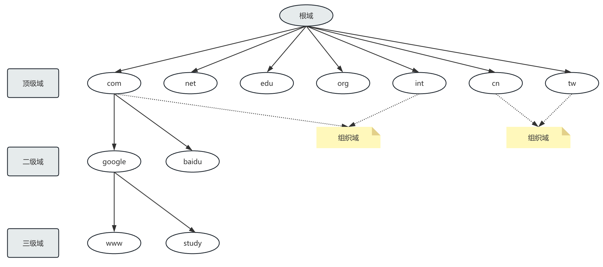
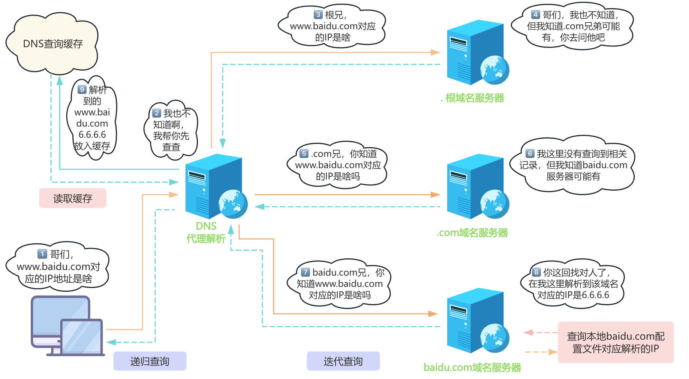
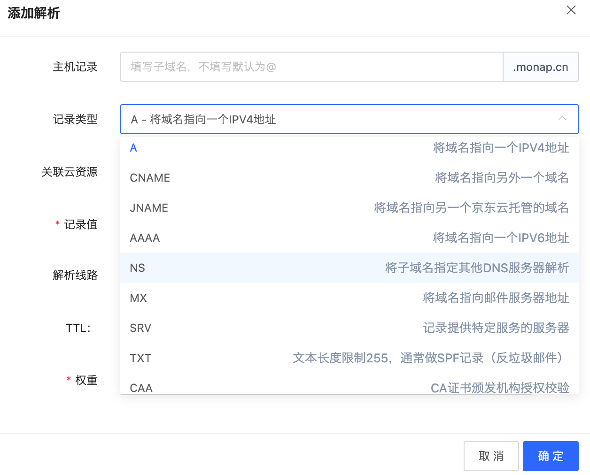

# DNS概述

## 简介

### 引入

当前TCP/IP网络中的设备之间进行通信，是利用和依赖于IP地址实现的。但数字形式的IP地址是很难记忆的。当网络设备众多，想要记住每个设备的IP地址，可以说是"不可能完成的任务”。那么如何解决这一难题呢？我们可以给每个网络设备起一个友好的名称，如：www.monap.cn，这种由文字组成的名称，显而易见要更容易记忆。

但是计算机不会理解这种名称的，我们可以利用一种名字解析服务将名称转化成（解析）成IP地址。从而我们就可以利用名称来直接访问网络中设备了。除此之外还有一个重要功能，利用名称解析服务可以实现主机和IP的解耦，即：当主机IP变化时，只需要修改名称服务即可，用户仍可以通过原有的名称进行访问而不受影响。

实现此服务的方法是多样的。如下面所述：

- 本地名称解析配置文件：hosts
  - Linux：/etc/hosts
  - Windows：%WINDIR%/system32/drivers/etc/hosts

```shell
122.10.117.2 www.baidu.com
93.46.8.89 www.google.com
```

- DNS：DomainNameSystem域名系统，应用层协议，是互联网的一项服务。它作为将域名和IP地址相互映射的一个分布式数据库，能够使人更方便地访问互联网。基于C/S架构，服务器端：53/udp，53/tcp
  

BIND：Bekerley Internet Name Domain,由 ISC（www.isc.org）提供的DNS软件实现

### DNS域名结构

- 根域
- 一级域名：com、edu、mil、gov、net、org、int、arpa（三类：组织域、国家域(.cn、.ca、.hk、.tw)、反向域）
- 二级域名:  monap.cn
- 三级域名：study.monap.cn
- 最多可达到127级域名



CANN（The Internet Corporation for Assigned Names and Numbers）互联网名称与数字地址分配机构，负责在全球范围内对互联网通用顶级域名（gTLD）以及国家和地区顶级域名（ccTLD）系统的管理、以及根服务器系统的管理。

### DNS服务工作原理



### DNS查询类型

- 递归查询：最终结果，负责到底
- 选代查询：最好结果，不负责到底

### 名称服务器

- NameServer，域内负责解析本域内的名称的DNS服务器
- IPv4的根名称服务器：全球共13个负责解析根域的DNS服务器，美国10个，荷兰1，瑞典1，日本1
- IPv6的根名称服务器：全球共25个，中国1主3从，美国1主2从

### 解析类型

- FQDN => IP正向解析
- IP => FQDN反向解析

>注意：正反向解析是两个不同的名称空间，是两棵不同的解析树

### 完整DNS查询请求流程

```shell
# client => hosts文件 => client DNS Service Local Cache => DNS Server（递归) => 
# DNS ServerCache => iteration（迭代）=> 根 => 顶级域名DNS => 二级域名DNS..
```

## 相关概念与技术

### DNS服务器的类型

- 主DNS服务器
- 从DNS服务器
- 缓存DNS服务器（转发器）

### 主DNS服务器

管理和维护所负责解析的域内解析库的服务器

### 从DNS服务器
从主服务器或从服务器"复制”（区域传输）解析库副本

- 序列号：解析库版本号，主服务器解析库变化时，其序列递增
- 刷新时间间隔：从服务器从主服务器请求同步解析的时间间隔
- 重试时间间隔：从服务器请求同步失败时，再次尝试时间间隔
- 过期时长：从服务器联系不到主服务器时，多久后停止服务
- 通知机制：主服务器解析库发生变化时，会主动通知从服务器

### 区域传输
- 完全传输：传送整个解析库
- 增量传输：传递解析库变化的那部分内容

### 解析形式

- 正向:FQDN（Fully Qualified Domain Name）=> IP
- 反向：IP => FQDN

### 负责本地域名的正向和反向解析库

- 正向区域
- 反向区域

### 解析答案

- 肯定答案：存在对应的查询结果
- 否定答案：请求的条目不存在等原因导致无法返回结果
- 权威答案：直接由存有此查询结果的DNS服务器（权威服务器）返回的答案
- 非权威答案：由其它非权威服务器返回的查询答案

### 各种资源记录

区域解析库：由众多资源记录组成：

- 资源记录：Resource Record（简称RR）

- 记录类型：A、AAAA、PTR、SOA、NS、CNAME、MX

  - SOA：StartOfAuthority，起始授权记录；一个区域解析库有且仅能有一个SOA记录，必须位于解析库的第一条记录

  - A：internetAddress，FQDN => IP

  - AAAA： FQDN => IPv6

  - PTR：PoinTeR，IP => FQDN

  - NS：NameServer，专用于标明当前区域的DNS服务器

  - CNAME：CanonicalName，别名记录

  - MX：MaileXchanger，邮件交换器


  - TXT：对域名进行标识和说明的一种方式，一般做验证记录时会使用此项，如：SPF（反垃圾邮件）记录，https验证等，如下示例：


```shell
_dnsauth  TXT  2012011200000051qgs69bwoh4h6nht4n1h01r038x
```

#### 资源记录定义的格式

```shell
# 名称    缓存时长(单位秒)   固定值(Internet简称)        记录类型       值
 name        [TTL]               IN                 rr_type      value
```

注意：

- 如果名称是全域名，结尾需要跟 `.`，否则Bind会补上当前区域域名

  ```shell
  # 正确写法
  www            => www.monap.cn
  www.monap.cn.  => www.monap.cn
  
  # 错误写法
  www.monap.cn   => www.monap.cn.monap.cn
  ```

- TTL可从全局继承
- 使用 `@` 符号可用于引用当前区域的域名
- 同一个名字可以通过多条记录定义多个不同的值；此时DNS服务器会以轮询方式响应
- 同一个值也可能有多个不同的定义名字；通过多个不同的名字指向同一个值进行定义；此仅表示通过多个不同的名字可以找到同一个主机

#### SOA记录

起始授权记录，必须处于整个区域配置数据库文件的第一行。用于描述当前区域配置数据库的整体信息，如负责管理的是哪个域、当前的DNS服务器、管理员和其他辅助信息。

SOA记录也是由五项组成

- name：当前区域对应的域名，例如`monap.cn.` 或则 `@`

- TTL：TTL可以提出来定义一个专门的TTL变量，就不用后续的每一项都写TTL了

- IN

- 资源类型：SOA

- value：由多部分组成


范例：

```c
$TTL 86400
;             当前的主DNS服务器地址   邮箱，@是关键字必须替换为.
@   IN   SOA    ns1.monap.cn.     polaris424.foxmail.com.  (
       2015042201     ;序列号、版本 在该配置文件更新后请同步更新该版本号，该版本号是主从服务器同步时判断配置是否变化的标志
       2H             ;刷新时间，主服务器向从服务器同步数据的时间间隔
                      ;同步方式有主服务器推和从服务器拉,这里配置的是从服务器拉相关的时间间隔
                      ;推：只要主服务器配置变了且序列号增加了就会自动推送到从服务器，
       10M            ;重试时间，同步失败了的重试时间间隔
       1D             ;过期时间 从服务器数据实效时间，当从服务器一只无法与主服务器数据同步，该时间后从服务器将无法对外提供服务
       10H            ;不存在记录的缓存有效期，当用户一直访问一个不存在的域名时，设置该缓存可以避免频繁解析不存在的域名
       )

; 主服务器自己的NS记录
@              IN  NS ns1.monap.cn.
ns1.monap.cn.  IN  A  192.168.1.2
  
; 从服务器的NS记录
; 注意：如果有从服务器，必须要配置该记录，否则主服务器不知道从服务器地址无法进行配置变更推送
@              IN  NS ns2.monap.cn.
ns2.moanp.cn.  IN  A  192.168.1.5
```

#### NS记录

通过该记录体现当前区域中有哪些主、从DNS服务器

- name：当前区域的名字
- value：当前区域的某DNS服务器的名字，例如 ns.monap.cn.

> 注意：
>
> 1. 相邻的两个资源记录的name相同时，后续的可省略
> 2. 对NS记录而言，任何一个ns记录后面的服务器名字，都应该在后续有一个A记录
> 3. 一个区域可以有多个NS记录

范例：

```shell
monap.cn. IN NS  ns1.monap.cn.
monap.cn. IN NS  ns2.monap.cn.


ns1.monap.cn. IN A 192.168.1.2
ns2.monap.cn. IN A 192.168.1.3
```

#### MX记录

指定邮件服务器(smtp服务器）记录

- name：当前区域的名字
- value：当前区域的某邮件服务器(smtp服务器）的主机名

> 注意：
>
> 1. 一个区域内，MX记录可有多个；但每个记录的value之前应该有一个数字(0-99)，表示此服务器的优先级；数
>    字越小优先级越高
> 2. 对MX记录而言，任何一个MX记录后面的服务器名字，都应该在后续有一个A记录

范例：

```shell
monap.cn.   IN   MX  10  mx1.monap.cn.
            IN   MX  20  mx2.monap.cn.
            
mx1.monap.cn. IN A 192.168.1.4
mx2.monap.cn. IN A 192.168.1.5
```

#### A记录

- name：某主机的FQDN，例如：www.monap.cn.
- value：主机名对应主机的IP地址

避免用户写错名称时给错误答案，可通过泛域名解析进行解析至某特定地址

范例：

```c
www.monap.cn.            IN      A      1.1.1.1
www.monap.cn.            IN      A      2.2.2.2
mx1.monap.cn.            IN      A      3.3.3.3
mx2.monap.cn.            IN      A      4.4.4.4
$GENERATE 1-254 HOST$    IN      A      1.2.3.$   // 泛域名解析，可以一次生成254个记录
*.monap.cn.              IN      A      5.5.5.5
monap.cn.                IN      A      6.6.6.6
```

范例：京东云



#### AAAA记录

- name：FQDN
- value：IPv6

#### PTR记录

PTR记录是A记录的逆向记录，又称做IP反查记录或指针记录，负责将IP反向解析为域名

- name：IP有特定格式，把IP地址反过来写，1.2.3.4，要写作4.3.2.1；而且有特定后缀：in-addr.arpa.，所以完整写法为：4.3.2.1.in-addr.arpa.
- value：FQDN

>注意：网络地址及后缀可省略；主机地址依然需要反着写

例如：

```shell
4.3.2.1.in-addr.arpa. IN  PTR  www.monap.cn.

# 如1.2.3.4为网络地址，可简写成：
4  IN   PTR  www.monap.cn.
```

#### CNAME别名记录

CNAME记录在做IP地址变更时要比A记录方便。CNAME记录允许将多个名字映射到同一台计算机，当有多个域名需要指向同一服务IP，此时可以将一个域名做A记录指向服务器IP，然后将其他的域名做别名(即：CNAME)到A记录的域名上。当服务器IP地址变更时，只需要更改A记录的那个域名到新IP上，其它做别名的域名会自动更改到新的IP地址上，而不必对每个域名做更改。

- name：别名的FQDN
- value：真正名字的FQDN

例如：

```shell
www.monap.cn.  IN  CNAME  websrv.monap.cn.
```

### 子域授权

每个域的名称服务器，都是通过其上级名称服务器在解析库进行授权，类似根域授权tld

glue record：粘合记录，父域授权子域的记录

范例：

```shell
.com.            IN    NS    nsl.com.
.com.            IN    NS    ns2.com.
ns1.com.         IN    A     2.2.2.1
ns2.com.         IN    A     2.2.2.2
# monap.cn.在.com的名称服务器上，解析库中添加资源记录
monap.cn.        IN    NS    ns1.monap.cn.
monap.cn.        IN    NS    ns2.monap.cn.
monap.cn.        IN    NS    ns3.monap.cn.
ns1.monap.cn.    IN    A     3.3.3.1
ns2.monap.cn.    IN    A     3.3.3.2
ns3.monap.cn.    IN    A     3.3.3.3
```

### 互联网域名

- 域名注册（代理商：万网，新网，godaddy）
- 注册完成以后，想自己用专用服务来解析
  
> 管理后台：把NS记录指向的服务器名称，和A记录指向的服务器地址
