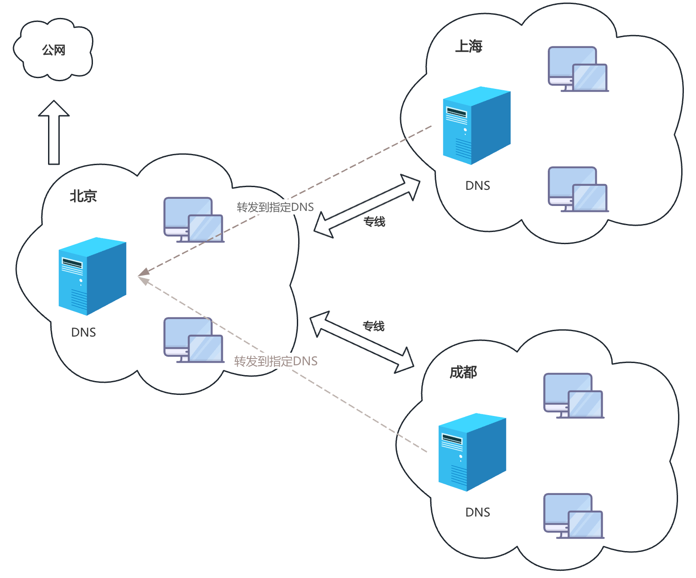

# 实现DNS转发(缓存)服务器

## 理解

利用DNS转发，可以将用户的DNS请求，转发至指定的DNS服务，而非默认的根DNS服务器，并将指定服务器查询的返回结果进行缓存，提高效率。



注意：

- 被转发的服务器需要能够为请求者做递归，否则转发请求不予进行
- 在全局配置块中，关闭dnssec功能

```shell
dnssec-enable no;
dnssec-validation no;
```

## 转发方式

### 全局转发

对非本机所负责解析区域的请求，全转发给指定的服务器

在全局配置块中实现：

forward

- first：先转发至指定DNS服务器，如果无法解析查询请求，则本服务器再去根服务器查询
- only：先转发至指定DNS服务器，如果无法解析查询请求，则本服务器将不再去根服务器查询

```c
options {
  ; 转发规则
  forward first|only;
  ; 转发给谁
  forwarders { ip; };
};
```

### 特定区域转发

仅转发对特定的区域的请求，比全局转发优先级高

```c
zone "ZONE_NAME" IN {
  type forward;
  forward firstlonly;
  forwarders { ip; };
};
```

