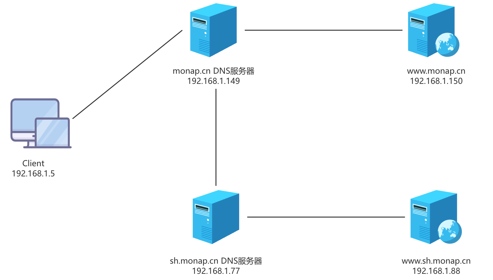

# 实现子域

## 子域委派授权

将子域委派给其它主机管理，实现分布式DNS数据库

正向解析区域子域方法

范例：定义两个子域区域

```c
shanghai.monap.cn.        IN    NS     ns1.ops.monap.cn.
shanghai.monap.cn.        IN    NS     ns2.ops.monap.cn.
shenzhen.monap.cn.        IN    NS     ns1.shenzhen.monap.cn.
shenzhen.monap.cn.        IN    NS     ns2.shenzhen.monap.cn.
ns1.shanghai.monap.cn.    IN    A      11.1.1.1
ns2.shanghai.monap.cn.    IN    A      1.1.1.2
ns1.shenzhen.monap.cn.    IN    A      11.1.1.3
ns2.shenzhen.monap.cn.    IN    A.     1.1.1.4
```

## 实现DNS父域和子域服务案例

### 目标

```shell
# 父域
monap.cn 192.168.1.149

# 子域
sh.monap.cn 192.168.1.77
```



### 父域配置

192.168.1.149 DNS服务器增加子域NS记录

```c
sh   NS   ns3
ns3  A   192.168.1.77
```

### 子域配置

192.168.1.77 DNS服务器做如下配置

区域`/etc/named.rfc1912.zones`配置

```c
zone "sh.monap.cn" IN {
	type master;
	file "named.sh.monap.cn";
	allow-update { none; };
};
```

解析库文件`named.sh.monap.cn`配置

```c
$TTL 1D
@	IN SOA	ns1.sh.monap.cn. polaris424.foxmail.com. (
       2015042201
       2H
       10M
       1D
       10H
)

@       NS      ns1
ns1     A       192.168.1.77
  
www     A       192.168.1.88
```

### 验证

父域到某个客户端上执行如下命令能够成功解析

```shell
dig www.sh.monap.cn
```

