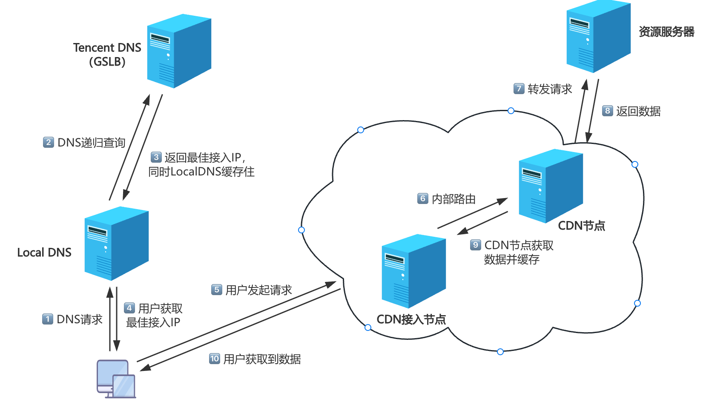
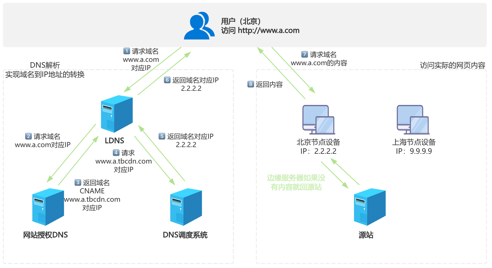

# 实现智能DNS



## GSLB

> GSLB：GlobalServerLoadBalance全局负载均衡

GSLB是对服务器和链路进行综合判断来决定由哪个地点的服务器来提供服务，实现异地服务器群服务质量的保证

GSLB主要的目的是在整个网络范围内将用户的请求定向到最近的节点（或者区域）

GSLB分为基于DNS实现、基于重定向实现、基于路由协议实现，其中最通用的是基于DNS解析方式

范例：查询VIP使用网宿的CDN服务

```shell
[root@dev ~]# dig www.vip.com

; <<>> DiG 9.16.23-RH <<>> www.vip.com
;; global options: +cmd
;; Got answer:
;; ->>HEADER<<- opcode: QUERY, status: NOERROR, id: 17549
;; flags: qr rd ra; QUERY: 1, ANSWER: 2, AUTHORITY: 0, ADDITIONAL: 0

;; QUESTION SECTION:
;www.vip.com.			IN	A

;; ANSWER SECTION:
www.vip.com.		404	IN	CNAME	www.vip.com.vipgslb.com.  # wscdn 网宿服务商
www.vip.com.vipgslb.com. 404	IN	A	120.232.167.201

;; Query time: 40 msec
;; SERVER: fe80::1%2#53(fe80::1%2%2)
;; WHEN: Tue Jul 01 20:51:25 CST 2025
;; MSG SIZE  rcvd: 79
```

## CDN内容分发网络

> CDN：ContentDeliveryNetwork



### CDN工作原理

1. 用户向浏览器输入 www.a.com 这个域名，浏览器第一次发现本地没有dns缓存，则向网站的DNS服务器请求

2. 网站的DNS域名解析器设置了CNAME，指向了 www.a.tbcdn.com ，请求指向了CDN网络中的智能DNS负载均衡系统
3. 智能DNS负载均衡系统解析域名，把对用户响应速度最快的IP节点返回给用户；
4. 用户向该IP节点（CDN服务器）发出请求
5. 由于是第一次访问，CDN服务器会通过Cache内部专用DNS解析得到此域名的原web站点IP，向原站点服务器发起请求，并在CDN服务器上缓存内容
6. 请求结果发给用户

### CDN服务商

- 服务商：阿里、腾讯、蓝汛、网宿、帝联等
- 智能DNS：dnspod、dns.la

## 智能CDN相关技术

### bind中的ACL

ACL（可访问列表）：把一个或多个地址归并为一个集合，并通过一个统一的名称调用。比如我们可以用ACL把所有IP地址按省份进行分类

注意：只能先定义后使用；因此一般定义在配置文件中，处于options的前面

格式：

```c
acl acl_name {
  ip;
  net/prelen;
};
```

范例：

```c
acl beijingnet {
  172.16.0.0/16;
  10.10.10.10;
};
```

bind 有四个内置的ACL

- none：没有一个主机
- any：任意主机
- localhost：本机
- localnet：本机的iP同掩码运算后得到的网络地址

### 访问控制的指令

- allow-query：允许查询的主机；白名单
- allow-transfer0：允许区域传送的主机；白名单
- allow-recursion：允许递归的主机，建议全局使用
- allow-update0：允许更新区域数据库中的内容

### view视图

View：视图，将ACL和区域数据库实现对应关系，以实现智能DNS

- 一个bind服务器可定义多个view，每个view中可定义一个或多个zone

- 每个view用来匹配一组客户端

- 多个view内可能需要对同一个区域进行解析，但使用不同的区域解析库文件

注意：

- 一旦启用了view，所有的zone都只能定义在view中
- 仅在允许递归请求的客户端所在view中定义根区域
- 客户端请求到达时，是自上而下检查每个view所服务的客户端列表

格式：

```c
view VIEW_NAME {
  match-clients { beijingnet; };
  zone "monap.cn" {
    type master;
    file "monap.cn.zone.bj";
  };
  include "/etc/named.rfc1912.zones";
}
    
view VIEW_NAME {
  match-clients { shanghainet; };
  zone "monap.cn" {
    type master;
    file "monap.cn.zone.sh";
  };
  include "/etc/named.rfc1912.zones";
}
```

## 利用View实现智能DNS案例

### 目标

- 搭建DNS主从服务器架构，实现DNS服务冗余

### 环境要求

```shell
# 需要五台主机
# DNS主服务器和web服务器1：192.168.8.8/24，172.16.0.8/16
# web服务器2：192.168.8.7/24
# web服务器3：172.16.0.7/16
# DNS客户端1：192.168.8.6/24
# DNS客户端2：172.16.0.6/16
```

### 前提准备

```shell
# 关闭SELINUX
# 关闭防火墙
# 时间同步
```

### 实现步骤

#### DNS服务器的网卡配置

```shell
# 配置两个IP地址
# eth0：192.168.8.8/24
# eth1：172.16.0.8/16
```

#### 主DNS服务器配置文件实现view

`/etc/named.conf`

```c
// 在文件最前面加入如下行
acl beijingnet {
  192.168.8.0/24;
};

acl shanghainet {
  172.16.0.0/16;
};

acl othernet {
  any;
};

// 创建view
view beijingview {
  match-clients { beijingnet; };
  include "/etc/named.rfc1912.zones.bj";
};

view shanghaiview {
  match-clients { shanghainet; };
  include "/etc/named.rfc1912.zones.sh";
};

view otherview {
  match-clients { othernet; };
  include "/etc/named.rfc1912.zones.other";
};

include "/etc/named.root.key";
```

#### 实现区域配置文件

`/etc/named.rfc1912.zones.bj`

```c
zone "." IN {
  type hint;
  file "named.ca";
};

zone "monap.cn" {
  type master;
  file "monap.cn.zone.bj";
};
```

`/etc/named.rfc1912.zones.sh`

```c
zone "." IN {
  type hint;
  file "named.ca";
};

zone "monap.cn" {
  type master;
  file "monap.cn.zone.sh";
};
```

`/etc/named.rfc1912.zones.other`

```c
zone "." IN {
  type hint;
  file "named.ca";
};

zone "monap.cn" {
  type master;
  file "monap.cn.zone.other";
};
```

#### 创建区域数据库文件

`/var/named/monap.cn.zone.bj`

```c
$TTL 1D
@   IN   SOA   master   admin.monap.cn. (
                  2019042214 ;serial
                  1D ;refresh
                  1H ;retry
                  1w ;expire
                  3H ;minimum
)
  
         NS     master
master   A      192.168.8.8
websrv   A      192.168.8.7
www      CNAME  websrv
```

`/var/named/monap.cn.zone.sh`

```c
$TTL 1D
@   IN   SOA   master   admin.monap.cn. (
                  2019042214 ;serial
                  1D ;refresh
                  1H ;retry
                  1w ;expire
                  3H ;minimum
)
  
         NS     master
master   A      192.168.8.8
websrv   A      172.16.0.7
www      CNAME  websrv
```

`/var/named/monap.cn.zone.other`

```c
$TTL 1D
@   IN   SOA   master   admin.monap.cn. (
                  2019042214 ;serial
                  1D ;refresh
                  1H ;retry
                  1w ;expire
                  3H ;minimum
)
  
         NS     master
master   A      192.168.8.8
websrv   A      127.0.0.1
www      CNAME  websrv
```

#### 实现位于三个不同区域的web服务器

```shell
# 分别在三台主机上安装http服务

# web服务器1：192.168.8.8/24实现
yum install httpd
echo www.monap.cn in Other > /var/www/html/index.html
systemctl start httpd

# 在web服务器2：192.168.8.7/16
yum install httpd
echo www.monap.cn in Beijing > /var/www/html/index.html
systemctl start httpd

# 在web服务器3：172.16.0.7/16
yum install httpd
echo www.monap.cn in Shanghai > /var/www/htm1/index.html
systemctll start httpd
```

#### 客户端测试

```shell
# 分别在三台主机上访问
# DNS客户端1：192.168.8.6/24实现，确保DNS指向192.168.8.8
curl www.monap.cn
www.monap.cn in Beijing

# DNS客户端2：172.16.0.6/16实现，确保DNS指向172.16.0.8
cur1 www.magedu.org
www.monap.cn in Shanghai

# DNS客户端3：192.168.8.8实现，，确保DNS指向127.0.0.1
curl www.monap.cn
www.monap.cn in Other
```

