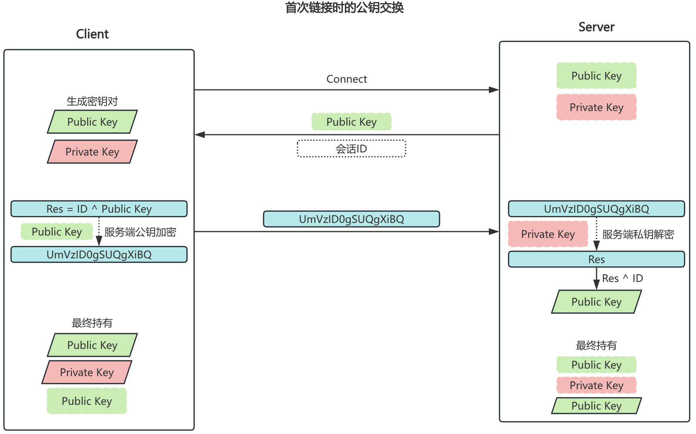
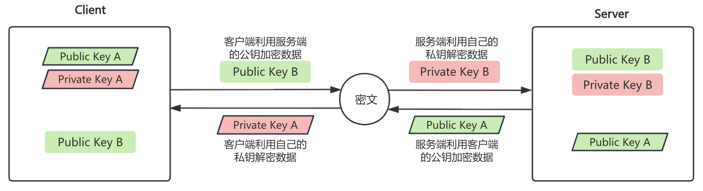

# SSH服务介绍

## 理解

SSH：Secure Shell，protocol，22/tcp，安全的远程登录，实现加密通信，代替传统的telnet协议

具体的软件实现：

- OpenSSH：ssh协议的开源实现，CentOS默认安装
- dropbear：另一个开源项目的实现

SSH协议版本

- v1：基于CRC-32做MAC，不安全；man-in-middle
- V2：双方主机协议选择安全的MAC方式，基于DH算法做密钥交换，基于RSA或DSA实现身份认证

## 安全机制

SSH能提供高度安全的远程连接，核心在于其采用了非对称加密技术来加密所有传输的数据，确保通信的机密性和完整性。

非对称加密技术使用了一对密钥：公钥和私钥

- 公钥 (Public Key)：可以安全地放置在任何您想访问的远程服务器上；

- 私钥 (Private Key)：生成后存储在您的本地客户端机器上，必须严格保密，不可泄露。

这种加密方式的优点是提供了数据传输的安全性，因为即使公钥被公开，没有对应的私钥也无法解密数据，也因此私钥需要小心保存。然而SSH的安全性并非绝对，它提供两种不同级别的验证方式，安全强度差异显著：

### 基于口令的安全验证（密码登录）

原理：

- 用户输入账号和密码，SSH会对传输的数据进行加密，但无法验证服务器的真实性。

风险：

- 攻击者可能伪造服务器（如DNS劫持或ARP欺骗），诱导用户连接恶意主机；

- 密码可能被暴力破解（尤其是弱密码）。

### 基于公钥的安全验证（公钥认证）

原理：

- 用户在客户端生成密钥对（公钥 + 私钥），并将公钥拷贝至服务器；

- 远程访问时，客户端向服务器发起认证请求（请求 + 公钥），服务器检查公钥是否匹配；

- 若公钥匹配，则服务器将发送一个用公钥加密的质询（Challenge）给客户端，客户端使用私钥解密后返回给服务器；

- 验证两段Challenge是否相同，通过后，建立加密通道。

优势：

- 无需传输密码，彻底杜绝密码泄露风险；

- 可抵御中间人攻击，因为攻击者无法伪造私钥签名；

- 支持完全禁用密码登录，极大提升安全性。

## 首次公钥交换原理

- 客户端发起链接请求
- 服务端返回自己的公钥，以及一个会话ID（这一步客户端得到服务端公钥）
- 客户端生成密钥对
- 客户端用自己的公钥异或会话ID，计算出一个值Res，并用服务端的公钥加密
- 客户端发送加密后的值到服务端，服务端用私钥解密，得到Res
- 服务端用解密后的值Res异或会话ID，计算出客户端的公钥（这一步服务端得到客户端公钥）
- 最终：双方各自持有三个秘钥，分别为自己的一对公、私钥，以及对方的公钥，之后的所有通讯都会被加密

> 注意：为什么第一次交换公钥前有提示需要输入yes/no？由于ssh没有引入证书机制，需要人为的手动确认连接的服务器是真实可靠的！

## SSH加密通信原理

